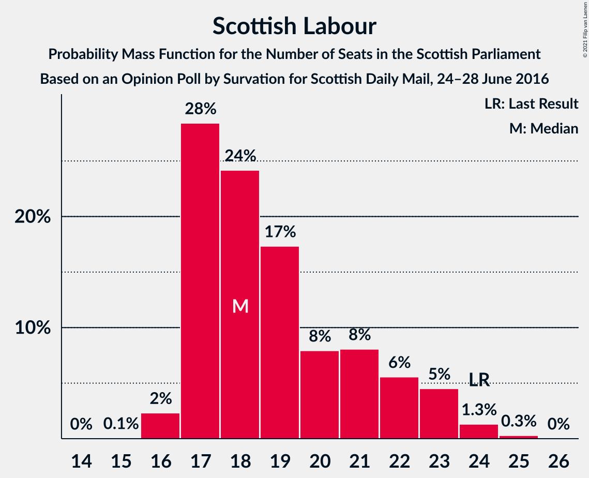

# Opinion Poll by Survation for Scottish Daily Mail, 24–28 June 2016

<a href="#voting-intentions">Voting Intentions</a> | <a href="#seats">Seats</a> | <a href="#coalitions">Coalitions</a> | <a href="#technical-information">Technical Information</a>

## Voting Intentions

### Confidence Intervals

| Party | Last Result | Poll Result | 80% Confidence Interval | 90% Confidence Interval | 95% Confidence Interval | 99% Confidence Interval |
|:-----:|:-----------:|:-----------:|:-----------------------:|:-----------------------:|:-----------------------:|:-----------------------:|
| Scottish National Party | 41.7% | 40.6% | 38.7–42.5% |38.1–43.1% |37.6–43.6% |36.7–44.5% |
| Scottish Conservative & Unionist Party | 22.9% | 19.8% | 18.3–21.5% |17.9–21.9% |17.5–22.3% |16.8–23.1% |
| Scottish Labour | 19.1% | 15.8% | 14.5–17.4% |14.1–17.8% |13.7–18.2% |13.1–18.9% |
| Scottish Greens | 6.6% | 11.8% | 10.7–13.2% |10.3–13.6% |10.0–13.9% |9.5–14.6% |
| Scottish Liberal Democrats | 5.2% | 6.9% | 6.0–8.0% |5.7–8.3% |5.5–8.6% |5.1–9.2% |
| UK Independence Party | 2.0% | 4.0% | 3.3–4.9% |3.1–5.1% |3.0–5.3% |2.7–5.8% |

*Note:* The poll result column reflects the actual value used in the calculations. Published results may vary slightly, and in addition be rounded to fewer digits.

## Seats

### Confidence Intervals

| Party | Last Result | Median | 80% Confidence Interval | 90% Confidence Interval | 95% Confidence Interval | 99% Confidence Interval |
|:-----:|:-----------:|:------:|:-----------------------:|:-----------------------:|:-----------------------:|:-----------------------:|
| <a href="#scottish-national-party">Scottish National Party</a> | 63 | 66 | 63–69 |63–70 |62–70 |61–71 |
| <a href="#scottish-conservative-&-unionist-party">Scottish Conservative & Unionist Party</a> | 31 | 25 | 21–28 |21–29 |20–30 |19–31 |
| <a href="#scottish-labour">Scottish Labour</a> | 24 | 18 | 17–21 |17–21 |17–23 |16–24 |
| <a href="#scottish-greens">Scottish Greens</a> | 6 | 13 | 11–15 |10–15 |10–16 |10–18 |
| <a href="#scottish-liberal-democrats">Scottish Liberal Democrats</a> | 5 | 6 | 5–8 |4–8 |4–9 |4–10 |
| <a href="#uk-independence-party">UK Independence Party</a> | 0 | 0 | 0–2 |0–3 |0–4 |0–5 |

### Scottish National Party

*For a full overview of the results for this party, see the [Scottish National Party](party-scottishnationalparty.html) page.*

| Number of Seats | Probability | Accumulated | Special Marks |
|:---------------:|:-----------:|:-----------:|:-------------:|
| 60 | 0.1% | 100% |  |
| 61 | 0.7% | 99.9% |  |
| 62 | 4% | 99.2% |  |
| 63 | 16% | 95% | Last Result |
| 64 | 8% | 79% |  |
| 65 | 13% | 71% | Majority |
| 66 | 9% | 58% | Median |
| 67 | 21% | 49% |  |
| 68 | 17% | 28% |  |
| 69 | 5% | 10% |  |
| 70 | 4% | 5% |  |
| 71 | 1.4% | 2% |  |
| 72 | 0.4% | 0.4% |  |
| 73 | 0% | 0% |  |

### Scottish Conservative & Unionist Party

*For a full overview of the results for this party, see the [Scottish Conservative & Unionist Party](party-scottishconservativeunionistparty.html) page.*

| Number of Seats | Probability | Accumulated | Special Marks |
|:---------------:|:-----------:|:-----------:|:-------------:|
| 19 | 1.1% | 100% |  |
| 20 | 2% | 98.9% |  |
| 21 | 8% | 97% |  |
| 22 | 6% | 89% |  |
| 23 | 12% | 83% |  |
| 24 | 21% | 71% |  |
| 25 | 20% | 50% | Median |
| 26 | 11% | 30% |  |
| 27 | 5% | 19% |  |
| 28 | 7% | 15% |  |
| 29 | 4% | 8% |  |
| 30 | 4% | 4% |  |
| 31 | 0.5% | 0.5% | Last Result |
| 32 | 0% | 0.1% |  |
| 33 | 0% | 0% |  |

### Scottish Labour

*For a full overview of the results for this party, see the [Scottish Labour](party-scottishlabour.html) page.*

| Number of Seats | Probability | Accumulated | Special Marks |
|:---------------:|:-----------:|:-----------:|:-------------:|
| 15 | 0.1% | 100% |  |
| 16 | 2% | 99.9% |  |
| 17 | 32% | 98% |  |
| 18 | 22% | 65% | Median |
| 19 | 17% | 44% |  |
| 20 | 10% | 27% |  |
| 21 | 12% | 17% |  |
| 22 | 2% | 5% |  |
| 23 | 2% | 3% |  |
| 24 | 0.3% | 0.5% | Last Result |
| 25 | 0.2% | 0.2% |  |
| 26 | 0% | 0% |  |

### Scottish Greens

*For a full overview of the results for this party, see the [Scottish Greens](party-scottishgreens.html) page.*

| Number of Seats | Probability | Accumulated | Special Marks |
|:---------------:|:-----------:|:-----------:|:-------------:|
| 6 | 0% | 100% | Last Result |
| 7 | 0% | 100% |  |
| 8 | 0% | 100% |  |
| 9 | 0% | 100% |  |
| 10 | 5% | 100% |  |
| 11 | 9% | 95% |  |
| 12 | 22% | 86% |  |
| 13 | 26% | 64% | Median |
| 14 | 22% | 38% |  |
| 15 | 13% | 16% |  |
| 16 | 1.1% | 3% |  |
| 17 | 0.8% | 2% |  |
| 18 | 0.7% | 0.8% |  |
| 19 | 0.1% | 0.2% |  |
| 20 | 0% | 0% |  |

### Scottish Liberal Democrats

*For a full overview of the results for this party, see the [Scottish Liberal Democrats](party-scottishliberaldemocrats.html) page.*

| Number of Seats | Probability | Accumulated | Special Marks |
|:---------------:|:-----------:|:-----------:|:-------------:|
| 3 | 0.1% | 100% |  |
| 4 | 8% | 99.9% |  |
| 5 | 19% | 92% | Last Result |
| 6 | 39% | 73% | Median |
| 7 | 17% | 34% |  |
| 8 | 13% | 17% |  |
| 9 | 4% | 4% |  |
| 10 | 0.4% | 0.5% |  |
| 11 | 0.1% | 0.1% |  |
| 12 | 0% | 0% |  |

### UK Independence Party

*For a full overview of the results for this party, see the [UK Independence Party](party-ukindependenceparty.html) page.*

| Number of Seats | Probability | Accumulated | Special Marks |
|:---------------:|:-----------:|:-----------:|:-------------:|
| 0 | 72% | 100% | Last Result, Median |
| 1 | 13% | 28% |  |
| 2 | 9% | 15% |  |
| 3 | 3% | 7% |  |
| 4 | 3% | 4% |  |
| 5 | 0.7% | 0.9% |  |
| 6 | 0.2% | 0.2% |  |
| 7 | 0.1% | 0.1% |  |
| 8 | 0% | 0% |  |

## Coalitions

### Confidence Intervals

| Coalition | Last Result | Median | Majority? | 80% Confidence Interval | 90% Confidence Interval | 95% Confidence Interval | 99% Confidence Interval |
|:---------:|:-----------:|:------:|:---------:|:-----------------------:|:-----------------------:|:-----------------------:|:-----------------------:|
| Scottish National Party – Scottish Greens | 69 | 79 | 100% | 76–82 | 75–83 | 75–84 | 73–85 |
| Scottish National Party | 63 | 66 | 71% | 63–69 | 63–70 | 62–70 | 61–71 |
| Scottish Conservative & Unionist Party – Scottish Labour – Scottish Liberal Democrats | 60 | 49 | 0% | 46–53 | 45–53 | 44–54 | 43–55 |
| Scottish Conservative & Unionist Party – Scottish Labour | 55 | 43 | 0% | 40–46 | 39–47 | 38–48 | 37–49 |
| Scottish Labour – Scottish Greens – Scottish Liberal Democrats | 35 | 38 | 0% | 35–41 | 34–41 | 33–42 | 32–43 |
| Scottish Conservative & Unionist Party – Scottish Liberal Democrats | 36 | 31 | 0% | 28–35 | 27–36 | 26–36 | 25–37 |
| Scottish Labour – Scottish Liberal Democrats | 29 | 25 | 0% | 22–28 | 22–28 | 21–29 | 21–30 |

### Scottish National Party – Scottish Greens

| Number of Seats | Probability | Accumulated | Special Marks |
|:---------------:|:-----------:|:-----------:|:-------------:|
| 69 | 0% | 100% | Last Result |
| 70 | 0% | 100% |  |
| 71 | 0% | 100% |  |
| 72 | 0.1% | 100% |  |
| 73 | 0.6% | 99.9% |  |
| 74 | 1.3% | 99.3% |  |
| 75 | 6% | 98% |  |
| 76 | 14% | 92% |  |
| 77 | 10% | 79% |  |
| 78 | 11% | 69% |  |
| 79 | 9% | 58% | Median |
| 80 | 16% | 48% |  |
| 81 | 16% | 32% |  |
| 82 | 10% | 15% |  |
| 83 | 3% | 6% |  |
| 84 | 2% | 3% |  |
| 85 | 0.5% | 0.7% |  |
| 86 | 0.1% | 0.2% |  |
| 87 | 0% | 0.1% |  |
| 88 | 0% | 0% |  |

### Scottish National Party

| Number of Seats | Probability | Accumulated | Special Marks |
|:---------------:|:-----------:|:-----------:|:-------------:|
| 60 | 0.1% | 100% |  |
| 61 | 0.7% | 99.9% |  |
| 62 | 4% | 99.2% |  |
| 63 | 16% | 95% | Last Result |
| 64 | 8% | 79% |  |
| 65 | 13% | 71% | Majority |
| 66 | 9% | 58% | Median |
| 67 | 21% | 49% |  |
| 68 | 17% | 28% |  |
| 69 | 5% | 10% |  |
| 70 | 4% | 5% |  |
| 71 | 1.4% | 2% |  |
| 72 | 0.4% | 0.4% |  |
| 73 | 0% | 0% |  |

### Scottish Conservative & Unionist Party – Scottish Labour – Scottish Liberal Democrats

| Number of Seats | Probability | Accumulated | Special Marks |
|:---------------:|:-----------:|:-----------:|:-------------:|
| 41 | 0.1% | 100% |  |
| 42 | 0.1% | 99.9% |  |
| 43 | 0.9% | 99.8% |  |
| 44 | 2% | 99.0% |  |
| 45 | 4% | 97% |  |
| 46 | 4% | 94% |  |
| 47 | 14% | 89% |  |
| 48 | 16% | 76% |  |
| 49 | 15% | 60% | Median |
| 50 | 7% | 45% |  |
| 51 | 12% | 38% |  |
| 52 | 11% | 26% |  |
| 53 | 11% | 16% |  |
| 54 | 3% | 5% |  |
| 55 | 1.1% | 1.4% |  |
| 56 | 0.2% | 0.3% |  |
| 57 | 0.1% | 0.1% |  |
| 58 | 0% | 0% |  |
| 59 | 0% | 0% |  |
| 60 | 0% | 0% | Last Result |

### Scottish Conservative & Unionist Party – Scottish Labour

| Number of Seats | Probability | Accumulated | Special Marks |
|:---------------:|:-----------:|:-----------:|:-------------:|
| 36 | 0.2% | 100% |  |
| 37 | 1.2% | 99.8% |  |
| 38 | 2% | 98.7% |  |
| 39 | 3% | 97% |  |
| 40 | 4% | 93% |  |
| 41 | 11% | 89% |  |
| 42 | 21% | 78% |  |
| 43 | 14% | 57% | Median |
| 44 | 10% | 44% |  |
| 45 | 12% | 34% |  |
| 46 | 12% | 21% |  |
| 47 | 7% | 9% |  |
| 48 | 2% | 3% |  |
| 49 | 0.7% | 0.9% |  |
| 50 | 0.1% | 0.1% |  |
| 51 | 0% | 0% |  |
| 52 | 0% | 0% |  |
| 53 | 0% | 0% |  |
| 54 | 0% | 0% |  |
| 55 | 0% | 0% | Last Result |

### Scottish Labour – Scottish Greens – Scottish Liberal Democrats

| Number of Seats | Probability | Accumulated | Special Marks |
|:---------------:|:-----------:|:-----------:|:-------------:|
| 31 | 0.1% | 100% |  |
| 32 | 0.9% | 99.9% |  |
| 33 | 3% | 99.0% |  |
| 34 | 4% | 96% |  |
| 35 | 6% | 92% | Last Result |
| 36 | 16% | 86% |  |
| 37 | 13% | 70% | Median |
| 38 | 18% | 57% |  |
| 39 | 10% | 39% |  |
| 40 | 18% | 29% |  |
| 41 | 7% | 11% |  |
| 42 | 3% | 4% |  |
| 43 | 0.7% | 1.1% |  |
| 44 | 0.4% | 0.4% |  |
| 45 | 0% | 0% |  |

### Scottish Conservative & Unionist Party – Scottish Liberal Democrats

| Number of Seats | Probability | Accumulated | Special Marks |
|:---------------:|:-----------:|:-----------:|:-------------:|
| 24 | 0.1% | 100% |  |
| 25 | 0.8% | 99.8% |  |
| 26 | 3% | 99.0% |  |
| 27 | 4% | 96% |  |
| 28 | 8% | 92% |  |
| 29 | 15% | 83% |  |
| 30 | 17% | 68% |  |
| 31 | 16% | 51% | Median |
| 32 | 11% | 36% |  |
| 33 | 4% | 25% |  |
| 34 | 10% | 20% |  |
| 35 | 4% | 10% |  |
| 36 | 5% | 6% | Last Result |
| 37 | 0.7% | 1.0% |  |
| 38 | 0.2% | 0.2% |  |
| 39 | 0% | 0% |  |

### Scottish Labour – Scottish Liberal Democrats

| Number of Seats | Probability | Accumulated | Special Marks |
|:---------------:|:-----------:|:-----------:|:-------------:|
| 20 | 0.1% | 100% |  |
| 21 | 4% | 99.9% |  |
| 22 | 9% | 96% |  |
| 23 | 18% | 87% |  |
| 24 | 16% | 69% | Median |
| 25 | 18% | 53% |  |
| 26 | 11% | 35% |  |
| 27 | 13% | 24% |  |
| 28 | 7% | 11% |  |
| 29 | 3% | 4% | Last Result |
| 30 | 1.1% | 1.5% |  |
| 31 | 0.3% | 0.4% |  |
| 32 | 0% | 0% |  |

## Technical Information

### Opinion Poll

+ **Polling firm:** Survation
+ **Commissioner(s):** Scottish Daily Mail
+ **Fieldwork period:** 24–28 June 2016

### Calculations

+ **Sample size:** 1055
+ **Simulations done:** 131,072
+ **Error estimate:** 1.31%

