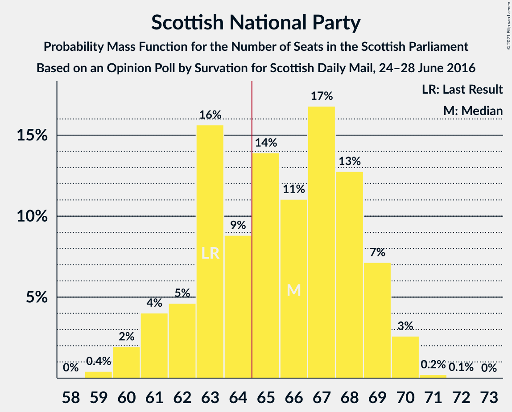
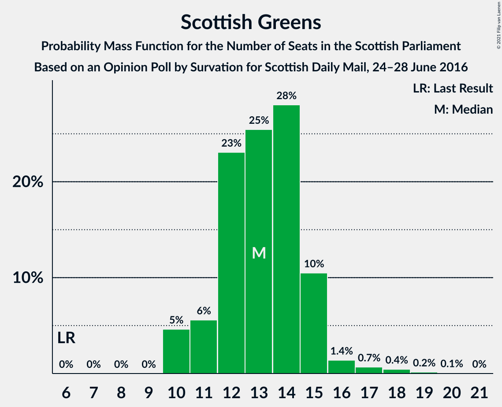
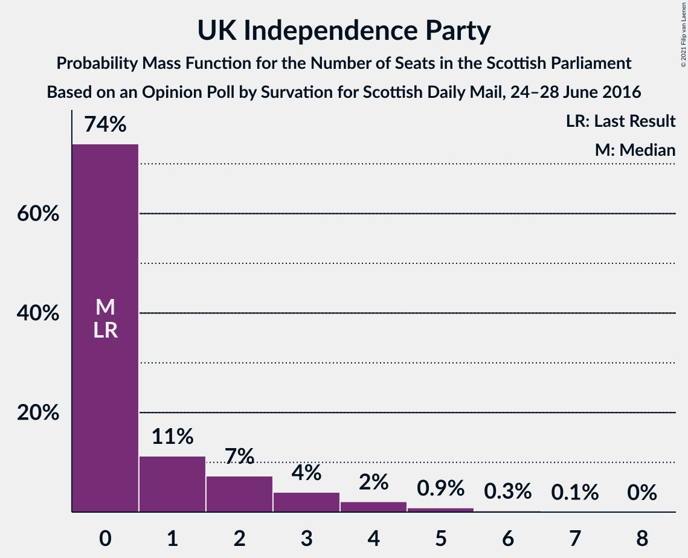
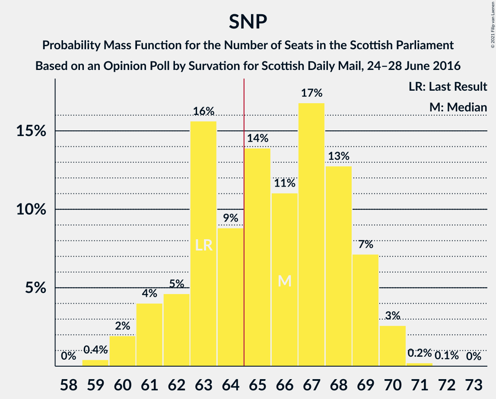

# Opinion Poll by Survation for Scottish Daily Mail, 24–28 June 2016

<a href="#voting-intentions">Voting Intentions</a> | <a href="#seats">Seats</a> | <a href="#coalitions">Coalitions</a> | <a href="#technical-information">Technical Information</a>

## Voting Intentions

### Confidence Intervals

| Party | Last Result | Poll Result | 80% Confidence Interval | 90% Confidence Interval | 95% Confidence Interval | 99% Confidence Interval |
|:-----:|:-----------:|:-----------:|:-----------------------:|:-----------------------:|:-----------------------:|:-----------------------:|
| Scottish National Party | 41.7% | 40.6% | 38.7–42.5% |38.1–43.1% |37.6–43.6% |36.7–44.5% |
| Scottish Conservative & Unionist Party | 22.9% | 19.8% | 18.3–21.5% |17.9–21.9% |17.5–22.3% |16.8–23.1% |
| Scottish Labour | 19.1% | 15.8% | 14.5–17.4% |14.1–17.8% |13.7–18.2% |13.1–18.9% |
| Scottish Greens | 6.6% | 11.8% | 10.7–13.2% |10.3–13.6% |10.0–13.9% |9.5–14.6% |
| Scottish Liberal Democrats | 5.2% | 6.9% | 6.0–8.0% |5.7–8.3% |5.5–8.6% |5.1–9.2% |
| UK Independence Party | 2.0% | 4.0% | 3.3–4.9% |3.1–5.1% |3.0–5.3% |2.7–5.8% |

*Note:* The poll result column reflects the actual value used in the calculations. Published results may vary slightly, and in addition be rounded to fewer digits.

## Seats

### Confidence Intervals

| Party | Last Result | Median | 80% Confidence Interval | 90% Confidence Interval | 95% Confidence Interval | 99% Confidence Interval |
|:-----:|:-----------:|:------:|:-----------------------:|:-----------------------:|:-----------------------:|:-----------------------:|
| <a href="#scottish-national-party">Scottish National Party</a> | 63 | 66 | 62–69 |61–69 |61–70 |60–70 |
| <a href="#scottish-conservative-&-unionist-party">Scottish Conservative & Unionist Party</a> | 31 | 25 | 22–28 |21–29 |20–30 |19–31 |
| <a href="#scottish-labour">Scottish Labour</a> | 24 | 18 | 17–21 |17–23 |16–23 |16–24 |
| <a href="#scottish-greens">Scottish Greens</a> | 6 | 13 | 11–15 |11–15 |10–16 |10–18 |
| <a href="#scottish-liberal-democrats">Scottish Liberal Democrats</a> | 5 | 6 | 5–8 |5–8 |5–9 |4–10 |
| <a href="#uk-independence-party">UK Independence Party</a> | 0 | 0 | 0–2 |0–3 |0–4 |0–5 |

### Scottish National Party

*For a full overview of the results for this party, see the [Scottish National Party](party-scottishnationalparty.html) page.*

| Number of Seats | Probability | Accumulated | Special Marks |
|:---------------:|:-----------:|:-----------:|:-------------:|
| 59 | 0.4% | 100% |  |
| 60 | 2% | 99.6% |  |
| 61 | 3% | 98% |  |
| 62 | 5% | 95% |  |
| 63 | 17% | 90% | Last Result |
| 64 | 9% | 73% |  |
| 65 | 11% | 64% | Majority |
| 66 | 10% | 54% | Median |
| 67 | 19% | 44% |  |
| 68 | 15% | 25% |  |
| 69 | 7% | 10% |  |
| 70 | 3% | 3% |  |
| 71 | 0.4% | 0.5% |  |
| 72 | 0.1% | 0.1% |  |
| 73 | 0% | 0% |  |

### Scottish Conservative & Unionist Party

*For a full overview of the results for this party, see the [Scottish Conservative & Unionist Party](party-scottishconservativeunionistparty.html) page.*

| Number of Seats | Probability | Accumulated | Special Marks |
|:---------------:|:-----------:|:-----------:|:-------------:|
| 19 | 0.8% | 100% |  |
| 20 | 3% | 99.2% |  |
| 21 | 6% | 97% |  |
| 22 | 7% | 91% |  |
| 23 | 12% | 84% |  |
| 24 | 21% | 72% |  |
| 25 | 17% | 51% | Median |
| 26 | 13% | 34% |  |
| 27 | 9% | 22% |  |
| 28 | 6% | 13% |  |
| 29 | 3% | 7% |  |
| 30 | 3% | 4% |  |
| 31 | 0.5% | 0.6% | Last Result |
| 32 | 0.1% | 0.1% |  |
| 33 | 0% | 0% |  |

### Scottish Labour

*For a full overview of the results for this party, see the [Scottish Labour](party-scottishlabour.html) page.*

| Number of Seats | Probability | Accumulated | Special Marks |
|:---------------:|:-----------:|:-----------:|:-------------:|
| 15 | 0.1% | 100% |  |
| 16 | 2% | 99.9% |  |
| 17 | 29% | 97% |  |
| 18 | 23% | 69% | Median |
| 19 | 18% | 46% |  |
| 20 | 8% | 28% |  |
| 21 | 10% | 20% |  |
| 22 | 4% | 10% |  |
| 23 | 4% | 6% |  |
| 24 | 1.4% | 2% | Last Result |
| 25 | 0.2% | 0.2% |  |
| 26 | 0% | 0% |  |

### Scottish Greens

*For a full overview of the results for this party, see the [Scottish Greens](party-scottishgreens.html) page.*

| Number of Seats | Probability | Accumulated | Special Marks |
|:---------------:|:-----------:|:-----------:|:-------------:|
| 6 | 0% | 100% | Last Result |
| 7 | 0% | 100% |  |
| 8 | 0% | 100% |  |
| 9 | 0% | 100% |  |
| 10 | 5% | 100% |  |
| 11 | 6% | 95% |  |
| 12 | 24% | 89% |  |
| 13 | 25% | 66% | Median |
| 14 | 28% | 40% |  |
| 15 | 10% | 13% |  |
| 16 | 1.5% | 3% |  |
| 17 | 0.7% | 1.4% |  |
| 18 | 0.5% | 0.7% |  |
| 19 | 0.2% | 0.2% |  |
| 20 | 0.1% | 0.1% |  |
| 21 | 0% | 0% |  |

### Scottish Liberal Democrats

*For a full overview of the results for this party, see the [Scottish Liberal Democrats](party-scottishliberaldemocrats.html) page.*

| Number of Seats | Probability | Accumulated | Special Marks |
|:---------------:|:-----------:|:-----------:|:-------------:|
| 4 | 2% | 100% |  |
| 5 | 31% | 98% | Last Result |
| 6 | 29% | 67% | Median |
| 7 | 15% | 38% |  |
| 8 | 18% | 23% |  |
| 9 | 3% | 5% |  |
| 10 | 0.9% | 1.3% |  |
| 11 | 0.4% | 0.4% |  |
| 12 | 0% | 0% |  |

### UK Independence Party

*For a full overview of the results for this party, see the [UK Independence Party](party-ukindependenceparty.html) page.*

| Number of Seats | Probability | Accumulated | Special Marks |
|:---------------:|:-----------:|:-----------:|:-------------:|
| 0 | 74% | 100% | Last Result, Median |
| 1 | 11% | 26% |  |
| 2 | 7% | 15% |  |
| 3 | 4% | 8% |  |
| 4 | 2% | 4% |  |
| 5 | 0.9% | 1.2% |  |
| 6 | 0.3% | 0.4% |  |
| 7 | 0.1% | 0.1% |  |
| 8 | 0% | 0% |  |

## Coalitions

### Confidence Intervals

| Coalition | Last Result | Median | Majority? | 80% Confidence Interval | 90% Confidence Interval | 95% Confidence Interval | 99% Confidence Interval |
|:---------:|:-----------:|:------:|:---------:|:-----------------------:|:-----------------------:|:-----------------------:|:-----------------------:|
| Scottish National Party – Scottish Greens | 69 | 79 | 100% | 75–82 | 74–83 | 73–83 | 72–84 |
| Scottish National Party | 63 | 66 | 64% | 62–69 | 61–69 | 61–70 | 60–70 |
| Scottish Conservative & Unionist Party – Scottish Labour – Scottish Liberal Democrats | 60 | 50 | 0% | 46–53 | 45–54 | 45–55 | 43–57 |
| Scottish Conservative & Unionist Party – Scottish Labour | 55 | 43 | 0% | 40–47 | 39–48 | 38–48 | 37–50 |
| Scottish Labour – Scottish Greens – Scottish Liberal Democrats | 35 | 38 | 0% | 35–41 | 34–43 | 34–44 | 33–45 |
| Scottish Conservative & Unionist Party – Scottish Liberal Democrats | 36 | 31 | 0% | 28–34 | 27–36 | 26–36 | 26–37 |
| Scottish Labour – Scottish Liberal Democrats | 29 | 25 | 0% | 22–28 | 22–29 | 22–30 | 21–32 |

### Scottish National Party – Scottish Greens

| Number of Seats | Probability | Accumulated | Special Marks |
|:---------------:|:-----------:|:-----------:|:-------------:|
| 69 | 0% | 100% | Last Result |
| 70 | 0% | 100% |  |
| 71 | 0.1% | 100% |  |
| 72 | 0.7% | 99.8% |  |
| 73 | 2% | 99.2% |  |
| 74 | 3% | 97% |  |
| 75 | 6% | 94% |  |
| 76 | 14% | 89% |  |
| 77 | 11% | 74% |  |
| 78 | 11% | 64% |  |
| 79 | 11% | 53% | Median |
| 80 | 14% | 42% |  |
| 81 | 14% | 28% |  |
| 82 | 9% | 14% |  |
| 83 | 3% | 5% |  |
| 84 | 2% | 2% |  |
| 85 | 0.3% | 0.4% |  |
| 86 | 0.1% | 0.1% |  |
| 87 | 0% | 0% |  |

### Scottish National Party

| Number of Seats | Probability | Accumulated | Special Marks |
|:---------------:|:-----------:|:-----------:|:-------------:|
| 59 | 0.4% | 100% |  |
| 60 | 2% | 99.6% |  |
| 61 | 3% | 98% |  |
| 62 | 5% | 95% |  |
| 63 | 17% | 90% | Last Result |
| 64 | 9% | 73% |  |
| 65 | 11% | 64% | Majority |
| 66 | 10% | 54% | Median |
| 67 | 19% | 44% |  |
| 68 | 15% | 25% |  |
| 69 | 7% | 10% |  |
| 70 | 3% | 3% |  |
| 71 | 0.4% | 0.5% |  |
| 72 | 0.1% | 0.1% |  |
| 73 | 0% | 0% |  |

### Scottish Conservative & Unionist Party – Scottish Labour – Scottish Liberal Democrats

| Number of Seats | Probability | Accumulated | Special Marks |
|:---------------:|:-----------:|:-----------:|:-------------:|
| 42 | 0.1% | 100% |  |
| 43 | 0.6% | 99.9% |  |
| 44 | 1.2% | 99.2% |  |
| 45 | 3% | 98% |  |
| 46 | 6% | 95% |  |
| 47 | 11% | 89% |  |
| 48 | 12% | 78% |  |
| 49 | 14% | 66% | Median |
| 50 | 10% | 52% |  |
| 51 | 11% | 41% |  |
| 52 | 10% | 30% |  |
| 53 | 11% | 20% |  |
| 54 | 4% | 8% |  |
| 55 | 2% | 4% |  |
| 56 | 1.1% | 2% |  |
| 57 | 0.4% | 0.5% |  |
| 58 | 0.1% | 0.1% |  |
| 59 | 0% | 0% |  |
| 60 | 0% | 0% | Last Result |

### Scottish Conservative & Unionist Party – Scottish Labour

| Number of Seats | Probability | Accumulated | Special Marks |
|:---------------:|:-----------:|:-----------:|:-------------:|
| 36 | 0.1% | 100% |  |
| 37 | 0.8% | 99.9% |  |
| 38 | 2% | 99.0% |  |
| 39 | 4% | 97% |  |
| 40 | 4% | 93% |  |
| 41 | 10% | 89% |  |
| 42 | 17% | 79% |  |
| 43 | 12% | 62% | Median |
| 44 | 14% | 50% |  |
| 45 | 13% | 36% |  |
| 46 | 10% | 23% |  |
| 47 | 8% | 13% |  |
| 48 | 3% | 6% |  |
| 49 | 2% | 2% |  |
| 50 | 0.5% | 0.6% |  |
| 51 | 0.1% | 0.2% |  |
| 52 | 0% | 0.1% |  |
| 53 | 0% | 0% |  |
| 54 | 0% | 0% |  |
| 55 | 0% | 0% | Last Result |

### Scottish Labour – Scottish Greens – Scottish Liberal Democrats

| Number of Seats | Probability | Accumulated | Special Marks |
|:---------------:|:-----------:|:-----------:|:-------------:|
| 32 | 0.5% | 100% |  |
| 33 | 1.4% | 99.5% |  |
| 34 | 5% | 98% |  |
| 35 | 9% | 93% | Last Result |
| 36 | 12% | 84% |  |
| 37 | 13% | 72% | Median |
| 38 | 14% | 59% |  |
| 39 | 13% | 45% |  |
| 40 | 14% | 31% |  |
| 41 | 8% | 17% |  |
| 42 | 4% | 9% |  |
| 43 | 3% | 5% |  |
| 44 | 2% | 3% |  |
| 45 | 0.7% | 0.8% |  |
| 46 | 0.1% | 0.1% |  |
| 47 | 0% | 0% |  |

### Scottish Conservative & Unionist Party – Scottish Liberal Democrats

| Number of Seats | Probability | Accumulated | Special Marks |
|:---------------:|:-----------:|:-----------:|:-------------:|
| 24 | 0.1% | 100% |  |
| 25 | 0.4% | 99.9% |  |
| 26 | 3% | 99.5% |  |
| 27 | 3% | 97% |  |
| 28 | 9% | 93% |  |
| 29 | 13% | 84% |  |
| 30 | 17% | 71% |  |
| 31 | 14% | 55% | Median |
| 32 | 11% | 41% |  |
| 33 | 9% | 29% |  |
| 34 | 10% | 20% |  |
| 35 | 4% | 10% |  |
| 36 | 4% | 5% | Last Result |
| 37 | 0.9% | 1.1% |  |
| 38 | 0.2% | 0.2% |  |
| 39 | 0% | 0.1% |  |
| 40 | 0% | 0% |  |

### Scottish Labour – Scottish Liberal Democrats

| Number of Seats | Probability | Accumulated | Special Marks |
|:---------------:|:-----------:|:-----------:|:-------------:|
| 20 | 0% | 100% |  |
| 21 | 1.2% | 99.9% |  |
| 22 | 11% | 98.7% |  |
| 23 | 17% | 88% |  |
| 24 | 15% | 71% | Median |
| 25 | 17% | 56% |  |
| 26 | 11% | 38% |  |
| 27 | 14% | 28% |  |
| 28 | 5% | 14% |  |
| 29 | 4% | 9% | Last Result |
| 30 | 2% | 4% |  |
| 31 | 1.3% | 2% |  |
| 32 | 0.7% | 0.8% |  |
| 33 | 0.1% | 0.1% |  |
| 34 | 0% | 0% |  |

## Technical Information

### Opinion Poll

+ **Polling firm:** Survation
+ **Commissioner(s):** Scottish Daily Mail
+ **Fieldwork period:** 24–28 June 2016

### Calculations

+ **Sample size:** 1055
+ **Simulations done:** 524,288
+ **Error estimate:** 0.55%

