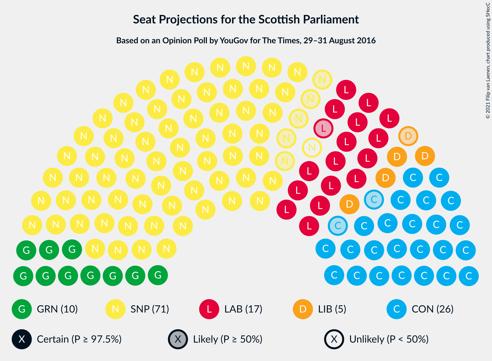
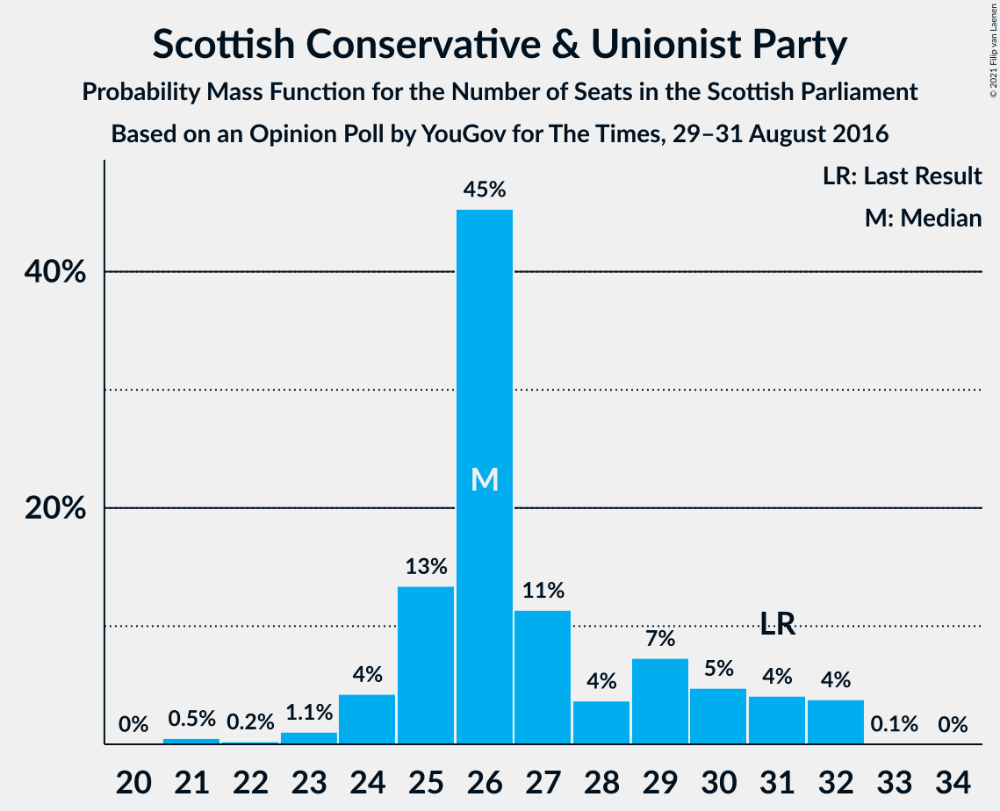

# Opinion Poll by YouGov for The Times, 29–31 August 2016

<a href="#voting-intentions">Voting Intentions</a> | <a href="#seats">Seats</a> | <a href="#coalitions">Coalitions</a> | <a href="#technical-information">Technical Information</a>

## Voting Intentions

### Confidence Intervals

| Party | Last Result | Poll Result | 80% Confidence Interval | 90% Confidence Interval | 95% Confidence Interval | 99% Confidence Interval |
|:-----:|:-----------:|:-----------:|:-----------------------:|:-----------------------:|:-----------------------:|:-----------------------:|
| Scottish National Party | 41.7% | 45.8% | 43.8–47.8% |43.3–48.4% |42.8–48.9% |41.9–49.8% |
| Scottish Conservative & Unionist Party | 22.9% | 21.4% | 19.8–23.1% |19.4–23.5% |19.0–24.0% |18.2–24.8% |
| Scottish Labour | 19.1% | 15.3% | 13.9–16.8% |13.6–17.3% |13.2–17.6% |12.6–18.4% |
| Scottish Greens | 6.6% | 9.1% | 8.1–10.4% |7.8–10.7% |7.5–11.1% |7.1–11.7% |
| Scottish Liberal Democrats | 5.2% | 6.1% | 5.2–7.1% |5.0–7.4% |4.8–7.7% |4.4–8.2% |
| UK Independence Party | 2.0% | 2.0% | 1.6–2.7% |1.4–2.9% |1.3–3.1% |1.1–3.4% |

*Note:* The poll result column reflects the actual value used in the calculations. Published results may vary slightly, and in addition be rounded to fewer digits.

## Seats

### Confidence Intervals

| Party | Last Result | Median | 80% Confidence Interval | 90% Confidence Interval | 95% Confidence Interval | 99% Confidence Interval |
|:-----:|:-----------:|:------:|:-----------------------:|:-----------------------:|:-----------------------:|:-----------------------:|
| <a href="#scottish-national-party">Scottish National Party</a> | 63 | 70 | 66–71 |65–72 |65–73 |64–73 |
| <a href="#scottish-conservative-&-unionist-party">Scottish Conservative & Unionist Party</a> | 31 | 26 | 25–30 |24–31 |24–32 |21–32 |
| <a href="#scottish-labour">Scottish Labour</a> | 24 | 17 | 17–19 |17–19 |16–21 |16–23 |
| <a href="#scottish-greens">Scottish Greens</a> | 6 | 10 | 10–11 |10–11 |10–12 |6–13 |
| <a href="#scottish-liberal-democrats">Scottish Liberal Democrats</a> | 5 | 5 | 5–6 |5–6 |4–7 |2–8 |
| <a href="#uk-independence-party">UK Independence Party</a> | 0 | 0 | 0 |0 |0 |0 |

### Scottish National Party

*For a full overview of the results for this party, see the [Scottish National Party](party-scottishnationalparty.html) page.*

| Number of Seats | Probability | Accumulated | Special Marks |
|:---------------:|:-----------:|:-----------:|:-------------:|
| 63 | 0.2% | 100% | Last Result |
| 64 | 0.6% | 99.8% |  |
| 65 | 8% | 99.2% | Majority |
| 66 | 2% | 91% |  |
| 67 | 11% | 89% |  |
| 68 | 6% | 78% |  |
| 69 | 13% | 73% |  |
| 70 | 27% | 60% | Median |
| 71 | 24% | 33% |  |
| 72 | 6% | 9% |  |
| 73 | 3% | 3% |  |
| 74 | 0.3% | 0.3% |  |
| 75 | 0% | 0% |  |

### Scottish Conservative & Unionist Party

*For a full overview of the results for this party, see the [Scottish Conservative & Unionist Party](party-scottishconservativeunionistparty.html) page.*

| Number of Seats | Probability | Accumulated | Special Marks |
|:---------------:|:-----------:|:-----------:|:-------------:|
| 21 | 0.5% | 100% |  |
| 22 | 0.2% | 99.4% |  |
| 23 | 1.1% | 99.2% |  |
| 24 | 4% | 98% |  |
| 25 | 13% | 94% |  |
| 26 | 45% | 80% | Median |
| 27 | 11% | 35% |  |
| 28 | 4% | 24% |  |
| 29 | 7% | 20% |  |
| 30 | 5% | 13% |  |
| 31 | 4% | 8% | Last Result |
| 32 | 4% | 4% |  |
| 33 | 0.1% | 0.1% |  |
| 34 | 0% | 0% |  |

### Scottish Labour

*For a full overview of the results for this party, see the [Scottish Labour](party-scottishlabour.html) page.*

| Number of Seats | Probability | Accumulated | Special Marks |
|:---------------:|:-----------:|:-----------:|:-------------:|
| 14 | 0.1% | 100% |  |
| 15 | 0.2% | 99.9% |  |
| 16 | 3% | 99.7% |  |
| 17 | 70% | 97% | Median |
| 18 | 15% | 27% |  |
| 19 | 7% | 11% |  |
| 20 | 2% | 5% |  |
| 21 | 1.3% | 3% |  |
| 22 | 0.8% | 2% |  |
| 23 | 0.7% | 0.9% |  |
| 24 | 0.2% | 0.2% | Last Result |
| 25 | 0% | 0% |  |

### Scottish Greens

*For a full overview of the results for this party, see the [Scottish Greens](party-scottishgreens.html) page.*

| Number of Seats | Probability | Accumulated | Special Marks |
|:---------------:|:-----------:|:-----------:|:-------------:|
| 5 | 0.4% | 100% |  |
| 6 | 0.3% | 99.5% | Last Result |
| 7 | 0.4% | 99.3% |  |
| 8 | 0.5% | 98.8% |  |
| 9 | 0.7% | 98% |  |
| 10 | 81% | 98% | Median |
| 11 | 13% | 17% |  |
| 12 | 3% | 3% |  |
| 13 | 0.6% | 0.7% |  |
| 14 | 0.1% | 0.1% |  |
| 15 | 0% | 0% |  |

### Scottish Liberal Democrats

*For a full overview of the results for this party, see the [Scottish Liberal Democrats](party-scottishliberaldemocrats.html) page.*

| Number of Seats | Probability | Accumulated | Special Marks |
|:---------------:|:-----------:|:-----------:|:-------------:|
| 2 | 0.6% | 100% |  |
| 3 | 1.1% | 99.4% |  |
| 4 | 3% | 98% |  |
| 5 | 64% | 95% | Last Result, Median |
| 6 | 26% | 31% |  |
| 7 | 3% | 5% |  |
| 8 | 1.3% | 1.5% |  |
| 9 | 0.2% | 0.2% |  |
| 10 | 0% | 0% |  |

### UK Independence Party

*For a full overview of the results for this party, see the [UK Independence Party](party-ukindependenceparty.html) page.*

| Number of Seats | Probability | Accumulated | Special Marks |
|:---------------:|:-----------:|:-----------:|:-------------:|
| 0 | 100% | 100% | Last Result, Median |

## Coalitions

### Confidence Intervals

| Coalition | Last Result | Median | Majority? | 80% Confidence Interval | 90% Confidence Interval | 95% Confidence Interval | 99% Confidence Interval |
|:---------:|:-----------:|:------:|:---------:|:-----------------------:|:-----------------------:|:-----------------------:|:-----------------------:|
| Scottish National Party – Scottish Greens | 69 | 80 | 100% | 76–82 | 75–82 | 75–83 | 74–83 |
| Scottish National Party | 63 | 70 | 99.2% | 66–71 | 65–72 | 65–73 | 64–73 |
| Scottish Conservative & Unionist Party – Scottish Labour – Scottish Liberal Democrats | 60 | 49 | 0% | 47–53 | 47–54 | 46–54 | 46–55 |
| Scottish Conservative & Unionist Party – Scottish Labour | 55 | 43 | 0% | 42–48 | 42–49 | 41–49 | 40–50 |
| Scottish Conservative & Unionist Party – Scottish Liberal Democrats | 36 | 32 | 0% | 30–35 | 29–37 | 29–37 | 26–37 |
| Scottish Labour – Scottish Greens – Scottish Liberal Democrats | 35 | 33 | 0% | 32–34 | 32–35 | 31–36 | 29–38 |
| Scottish Labour – Scottish Liberal Democrats | 29 | 22 | 0% | 22–24 | 22–25 | 21–26 | 20–28 |

### Scottish National Party – Scottish Greens

| Number of Seats | Probability | Accumulated | Special Marks |
|:---------------:|:-----------:|:-----------:|:-------------:|
| 69 | 0% | 100% | Last Result |
| 70 | 0% | 100% |  |
| 71 | 0% | 100% |  |
| 72 | 0.1% | 99.9% |  |
| 73 | 0.1% | 99.9% |  |
| 74 | 0.4% | 99.8% |  |
| 75 | 7% | 99.4% |  |
| 76 | 3% | 92% |  |
| 77 | 9% | 89% |  |
| 78 | 8% | 81% |  |
| 79 | 11% | 73% |  |
| 80 | 22% | 62% | Median |
| 81 | 28% | 39% |  |
| 82 | 7% | 11% |  |
| 83 | 3% | 4% |  |
| 84 | 0.3% | 0.4% |  |
| 85 | 0% | 0% |  |

### Scottish National Party

| Number of Seats | Probability | Accumulated | Special Marks |
|:---------------:|:-----------:|:-----------:|:-------------:|
| 63 | 0.2% | 100% | Last Result |
| 64 | 0.6% | 99.8% |  |
| 65 | 8% | 99.2% | Majority |
| 66 | 2% | 91% |  |
| 67 | 11% | 89% |  |
| 68 | 6% | 78% |  |
| 69 | 13% | 73% |  |
| 70 | 27% | 60% | Median |
| 71 | 24% | 33% |  |
| 72 | 6% | 9% |  |
| 73 | 3% | 3% |  |
| 74 | 0.3% | 0.3% |  |
| 75 | 0% | 0% |  |

### Scottish Conservative & Unionist Party – Scottish Labour – Scottish Liberal Democrats

| Number of Seats | Probability | Accumulated | Special Marks |
|:---------------:|:-----------:|:-----------:|:-------------:|
| 45 | 0.3% | 100% |  |
| 46 | 3% | 99.6% |  |
| 47 | 7% | 96% |  |
| 48 | 28% | 89% | Median |
| 49 | 22% | 61% |  |
| 50 | 11% | 38% |  |
| 51 | 8% | 27% |  |
| 52 | 9% | 19% |  |
| 53 | 3% | 11% |  |
| 54 | 7% | 8% |  |
| 55 | 0.4% | 0.6% |  |
| 56 | 0.1% | 0.2% |  |
| 57 | 0.1% | 0.1% |  |
| 58 | 0% | 0.1% |  |
| 59 | 0% | 0% |  |
| 60 | 0% | 0% | Last Result |

### Scottish Conservative & Unionist Party – Scottish Labour

| Number of Seats | Probability | Accumulated | Special Marks |
|:---------------:|:-----------:|:-----------:|:-------------:|
| 39 | 0.1% | 100% |  |
| 40 | 0.4% | 99.8% |  |
| 41 | 3% | 99.4% |  |
| 42 | 8% | 96% |  |
| 43 | 39% | 88% | Median |
| 44 | 17% | 49% |  |
| 45 | 7% | 31% |  |
| 46 | 9% | 24% |  |
| 47 | 5% | 15% |  |
| 48 | 5% | 10% |  |
| 49 | 5% | 6% |  |
| 50 | 0.3% | 0.5% |  |
| 51 | 0.1% | 0.2% |  |
| 52 | 0% | 0.1% |  |
| 53 | 0% | 0% |  |
| 54 | 0% | 0% |  |
| 55 | 0% | 0% | Last Result |

### Scottish Conservative & Unionist Party – Scottish Liberal Democrats

| Number of Seats | Probability | Accumulated | Special Marks |
|:---------------:|:-----------:|:-----------:|:-------------:|
| 26 | 0.5% | 100% |  |
| 27 | 0.3% | 99.5% |  |
| 28 | 1.4% | 99.2% |  |
| 29 | 5% | 98% |  |
| 30 | 10% | 93% |  |
| 31 | 32% | 83% | Median |
| 32 | 22% | 51% |  |
| 33 | 6% | 29% |  |
| 34 | 6% | 22% |  |
| 35 | 7% | 16% |  |
| 36 | 3% | 9% | Last Result |
| 37 | 5% | 5% |  |
| 38 | 0.2% | 0.3% |  |
| 39 | 0% | 0% |  |

### Scottish Labour – Scottish Greens – Scottish Liberal Democrats

| Number of Seats | Probability | Accumulated | Special Marks |
|:---------------:|:-----------:|:-----------:|:-------------:|
| 27 | 0.1% | 100% |  |
| 28 | 0.2% | 99.9% |  |
| 29 | 0.4% | 99.7% |  |
| 30 | 0.8% | 99.3% |  |
| 31 | 3% | 98% |  |
| 32 | 38% | 95% | Median |
| 33 | 34% | 58% |  |
| 34 | 14% | 23% |  |
| 35 | 6% | 9% | Last Result |
| 36 | 2% | 4% |  |
| 37 | 0.8% | 2% |  |
| 38 | 0.6% | 1.0% |  |
| 39 | 0.4% | 0.4% |  |
| 40 | 0% | 0.1% |  |
| 41 | 0% | 0% |  |

### Scottish Labour – Scottish Liberal Democrats

| Number of Seats | Probability | Accumulated | Special Marks |
|:---------------:|:-----------:|:-----------:|:-------------:|
| 19 | 0.4% | 100% |  |
| 20 | 0.7% | 99.6% |  |
| 21 | 3% | 98.8% |  |
| 22 | 48% | 95% | Median |
| 23 | 28% | 47% |  |
| 24 | 12% | 20% |  |
| 25 | 4% | 8% |  |
| 26 | 1.5% | 4% |  |
| 27 | 0.9% | 2% |  |
| 28 | 0.7% | 1.2% |  |
| 29 | 0.4% | 0.4% | Last Result |
| 30 | 0% | 0% |  |

## Technical Information

### Opinion Poll

+ **Polling firm:** YouGov
+ **Commissioner(s):** The Times
+ **Fieldwork period:** 29–31 August 2016

### Calculations

+ **Sample size:** 1039
+ **Simulations done:** 1,048,576
+ **Error estimate:** 0.94%

