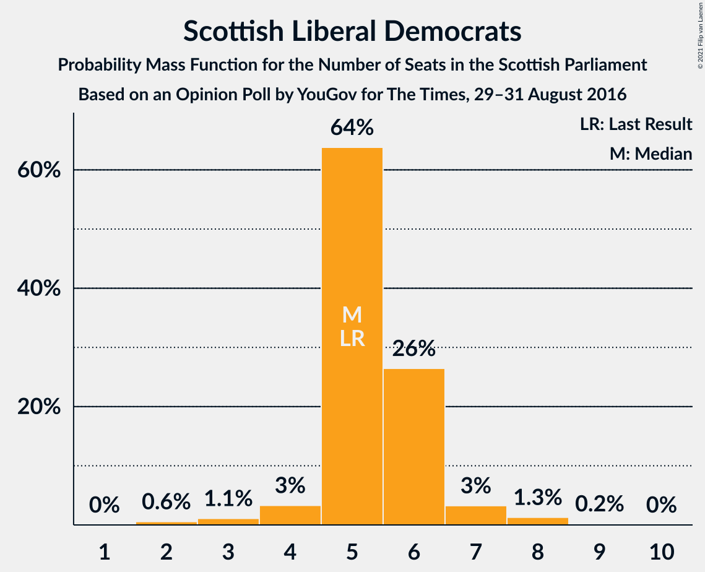
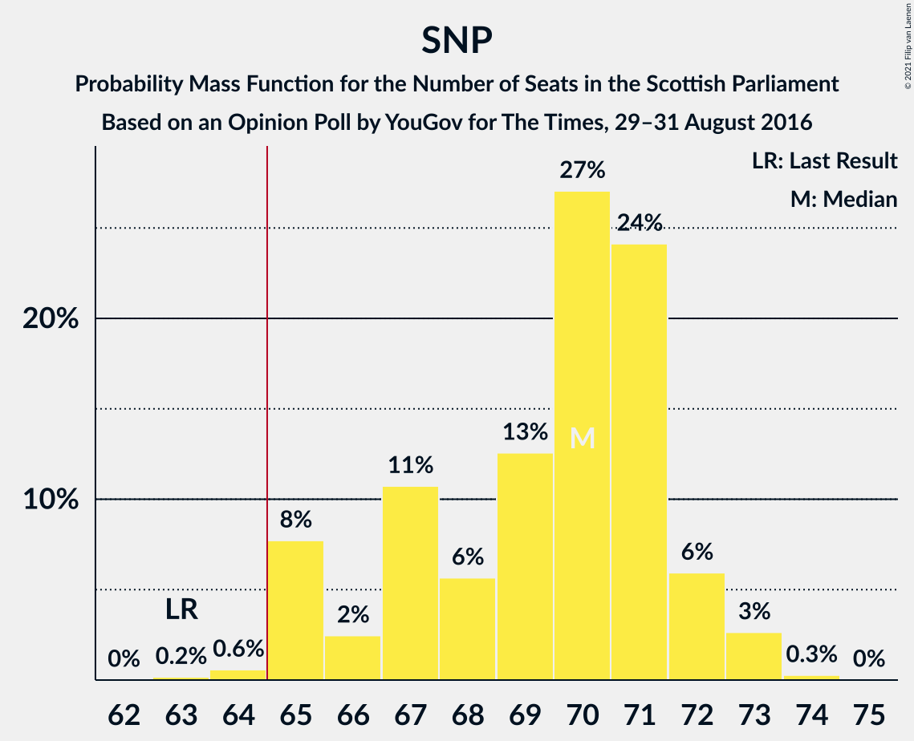

# Opinion Poll by YouGov for The Times, 29–31 August 2016

<a href="#voting-intentions">Voting Intentions</a> | <a href="#seats">Seats</a> | <a href="#coalitions">Coalitions</a> | <a href="#technical-information">Technical Information</a>

## Voting Intentions

### Confidence Intervals

| Party | Last Result | Poll Result | 80% Confidence Interval | 90% Confidence Interval | 95% Confidence Interval | 99% Confidence Interval |
|:-----:|:-----------:|:-----------:|:-----------------------:|:-----------------------:|:-----------------------:|:-----------------------:|
| Scottish National Party | 41.7% | 45.8% | 43.8–47.8% |43.3–48.4% |42.8–48.9% |41.9–49.8% |
| Scottish Conservative & Unionist Party | 22.9% | 21.4% | 19.8–23.1% |19.4–23.5% |19.0–24.0% |18.2–24.8% |
| Scottish Labour | 19.1% | 15.3% | 13.9–16.8% |13.6–17.3% |13.2–17.6% |12.6–18.4% |
| Scottish Greens | 6.6% | 9.1% | 8.1–10.4% |7.8–10.7% |7.5–11.1% |7.1–11.7% |
| Scottish Liberal Democrats | 5.2% | 6.1% | 5.2–7.1% |5.0–7.4% |4.8–7.7% |4.4–8.2% |
| UK Independence Party | 2.0% | 2.0% | 1.6–2.7% |1.4–2.9% |1.3–3.1% |1.1–3.4% |

*Note:* The poll result column reflects the actual value used in the calculations. Published results may vary slightly, and in addition be rounded to fewer digits.

## Seats

### Confidence Intervals

| Party | Last Result | Median | 80% Confidence Interval | 90% Confidence Interval | 95% Confidence Interval | 99% Confidence Interval |
|:-----:|:-----------:|:------:|:-----------------------:|:-----------------------:|:-----------------------:|:-----------------------:|
| <a href="#scottish-national-party">Scottish National Party</a> | 63 | 71 | 67–72 |67–72 |66–73 |66–73 |
| <a href="#scottish-conservative-&-unionist-party">Scottish Conservative & Unionist Party</a> | 31 | 25 | 24–30 |24–30 |24–31 |21–32 |
| <a href="#scottish-labour">Scottish Labour</a> | 24 | 17 | 17–19 |16–20 |16–21 |15–22 |
| <a href="#scottish-greens">Scottish Greens</a> | 6 | 10 | 10–11 |10–12 |10–12 |6–13 |
| <a href="#scottish-liberal-democrats">Scottish Liberal Democrats</a> | 5 | 5 | 4–6 |4–6 |3–7 |2–8 |
| <a href="#uk-independence-party">UK Independence Party</a> | 0 | 0 | 0 |0 |0 |0 |

### Scottish National Party

*For a full overview of the results for this party, see the [Scottish National Party](party-scottishnationalparty.html) page.*

| Number of Seats | Probability | Accumulated | Special Marks |
|:---------------:|:-----------:|:-----------:|:-------------:|
| 63 | 0% | 100% | Last Result |
| 64 | 0.1% | 100% |  |
| 65 | 0.3% | 99.9% | Majority |
| 66 | 3% | 99.6% |  |
| 67 | 13% | 97% |  |
| 68 | 9% | 84% |  |
| 69 | 5% | 75% |  |
| 70 | 15% | 70% |  |
| 71 | 27% | 55% | Median |
| 72 | 24% | 28% |  |
| 73 | 4% | 4% |  |
| 74 | 0.2% | 0.2% |  |
| 75 | 0% | 0% |  |

### Scottish Conservative & Unionist Party

*For a full overview of the results for this party, see the [Scottish Conservative & Unionist Party](party-scottishconservativeunionistparty.html) page.*

| Number of Seats | Probability | Accumulated | Special Marks |
|:---------------:|:-----------:|:-----------:|:-------------:|
| 20 | 0.1% | 100% |  |
| 21 | 0.6% | 99.9% |  |
| 22 | 0.4% | 99.4% |  |
| 23 | 0.6% | 99.0% |  |
| 24 | 13% | 98% |  |
| 25 | 46% | 86% | Median |
| 26 | 14% | 39% |  |
| 27 | 6% | 25% |  |
| 28 | 4% | 19% |  |
| 29 | 5% | 15% |  |
| 30 | 6% | 11% |  |
| 31 | 4% | 4% | Last Result |
| 32 | 0.5% | 0.6% |  |
| 33 | 0% | 0% |  |

### Scottish Labour

*For a full overview of the results for this party, see the [Scottish Labour](party-scottishlabour.html) page.*

| Number of Seats | Probability | Accumulated | Special Marks |
|:---------------:|:-----------:|:-----------:|:-------------:|
| 13 | 0.1% | 100% |  |
| 14 | 0.2% | 99.9% |  |
| 15 | 0.5% | 99.8% |  |
| 16 | 5% | 99.3% |  |
| 17 | 64% | 94% | Median |
| 18 | 15% | 30% |  |
| 19 | 5% | 15% |  |
| 20 | 6% | 9% |  |
| 21 | 2% | 4% |  |
| 22 | 1.5% | 2% |  |
| 23 | 0.2% | 0.4% |  |
| 24 | 0.1% | 0.1% | Last Result |
| 25 | 0% | 0% |  |

### Scottish Greens

*For a full overview of the results for this party, see the [Scottish Greens](party-scottishgreens.html) page.*

| Number of Seats | Probability | Accumulated | Special Marks |
|:---------------:|:-----------:|:-----------:|:-------------:|
| 4 | 0.1% | 100% |  |
| 5 | 0.3% | 99.9% |  |
| 6 | 0.2% | 99.6% | Last Result |
| 7 | 0.8% | 99.4% |  |
| 8 | 0.4% | 98.6% |  |
| 9 | 0.7% | 98% |  |
| 10 | 79% | 98% | Median |
| 11 | 14% | 19% |  |
| 12 | 5% | 5% |  |
| 13 | 0.6% | 0.6% |  |
| 14 | 0% | 0% |  |

### Scottish Liberal Democrats

*For a full overview of the results for this party, see the [Scottish Liberal Democrats](party-scottishliberaldemocrats.html) page.*

| Number of Seats | Probability | Accumulated | Special Marks |
|:---------------:|:-----------:|:-----------:|:-------------:|
| 2 | 0.7% | 100% |  |
| 3 | 2% | 99.3% |  |
| 4 | 13% | 97% |  |
| 5 | 51% | 84% | Last Result, Median |
| 6 | 29% | 33% |  |
| 7 | 3% | 4% |  |
| 8 | 2% | 2% |  |
| 9 | 0.1% | 0.1% |  |
| 10 | 0% | 0% |  |

### UK Independence Party

*For a full overview of the results for this party, see the [UK Independence Party](party-ukindependenceparty.html) page.*

| Number of Seats | Probability | Accumulated | Special Marks |
|:---------------:|:-----------:|:-----------:|:-------------:|
| 0 | 100% | 100% | Last Result, Median |

## Coalitions

### Confidence Intervals

| Coalition | Last Result | Median | Majority? | 80% Confidence Interval | 90% Confidence Interval | 95% Confidence Interval | 99% Confidence Interval |
|:---------:|:-----------:|:------:|:---------:|:-----------------------:|:-----------------------:|:-----------------------:|:-----------------------:|
| Scottish National Party – Scottish Greens | 69 | 81 | 100% | 77–82 | 77–83 | 76–83 | 75–83 |
| Scottish National Party | 63 | 71 | 99.9% | 67–72 | 67–72 | 66–73 | 66–73 |
| Scottish Conservative & Unionist Party – Scottish Labour – Scottish Liberal Democrats | 60 | 48 | 0% | 47–52 | 46–52 | 46–53 | 46–54 |
| Scottish Conservative & Unionist Party – Scottish Labour | 55 | 43 | 0% | 42–47 | 41–47 | 41–48 | 40–49 |
| Scottish Labour – Scottish Greens – Scottish Liberal Democrats | 35 | 33 | 0% | 32–34 | 31–35 | 30–36 | 29–38 |
| Scottish Conservative & Unionist Party – Scottish Liberal Democrats | 36 | 31 | 0% | 29–35 | 29–35 | 28–36 | 26–36 |
| Scottish Labour – Scottish Liberal Democrats | 29 | 22 | 0% | 22–24 | 21–25 | 21–26 | 20–28 |

### Scottish National Party – Scottish Greens

| Number of Seats | Probability | Accumulated | Special Marks |
|:---------------:|:-----------:|:-----------:|:-------------:|
| 69 | 0% | 100% | Last Result |
| 70 | 0% | 100% |  |
| 71 | 0% | 100% |  |
| 72 | 0.1% | 100% |  |
| 73 | 0% | 99.9% |  |
| 74 | 0.2% | 99.9% |  |
| 75 | 0.3% | 99.7% |  |
| 76 | 2% | 99.4% |  |
| 77 | 12% | 97% |  |
| 78 | 9% | 85% |  |
| 79 | 6% | 76% |  |
| 80 | 9% | 70% |  |
| 81 | 25% | 61% | Median |
| 82 | 29% | 36% |  |
| 83 | 7% | 7% |  |
| 84 | 0.3% | 0.3% |  |
| 85 | 0% | 0% |  |

### Scottish National Party

| Number of Seats | Probability | Accumulated | Special Marks |
|:---------------:|:-----------:|:-----------:|:-------------:|
| 63 | 0% | 100% | Last Result |
| 64 | 0.1% | 100% |  |
| 65 | 0.3% | 99.9% | Majority |
| 66 | 3% | 99.6% |  |
| 67 | 13% | 97% |  |
| 68 | 9% | 84% |  |
| 69 | 5% | 75% |  |
| 70 | 15% | 70% |  |
| 71 | 27% | 55% | Median |
| 72 | 24% | 28% |  |
| 73 | 4% | 4% |  |
| 74 | 0.2% | 0.2% |  |
| 75 | 0% | 0% |  |

### Scottish Conservative & Unionist Party – Scottish Labour – Scottish Liberal Democrats

| Number of Seats | Probability | Accumulated | Special Marks |
|:---------------:|:-----------:|:-----------:|:-------------:|
| 45 | 0.3% | 100% |  |
| 46 | 7% | 99.7% |  |
| 47 | 29% | 93% | Median |
| 48 | 25% | 64% |  |
| 49 | 9% | 39% |  |
| 50 | 6% | 30% |  |
| 51 | 9% | 24% |  |
| 52 | 12% | 15% |  |
| 53 | 2% | 3% |  |
| 54 | 0.3% | 0.6% |  |
| 55 | 0.2% | 0.3% |  |
| 56 | 0% | 0.1% |  |
| 57 | 0.1% | 0.1% |  |
| 58 | 0% | 0% |  |
| 59 | 0% | 0% |  |
| 60 | 0% | 0% | Last Result |

### Scottish Conservative & Unionist Party – Scottish Labour

| Number of Seats | Probability | Accumulated | Special Marks |
|:---------------:|:-----------:|:-----------:|:-------------:|
| 39 | 0.1% | 100% |  |
| 40 | 0.5% | 99.8% |  |
| 41 | 7% | 99.3% |  |
| 42 | 36% | 92% | Median |
| 43 | 21% | 56% |  |
| 44 | 5% | 34% |  |
| 45 | 8% | 29% |  |
| 46 | 8% | 20% |  |
| 47 | 9% | 13% |  |
| 48 | 3% | 4% |  |
| 49 | 0.8% | 1.2% |  |
| 50 | 0.1% | 0.4% |  |
| 51 | 0.2% | 0.2% |  |
| 52 | 0% | 0.1% |  |
| 53 | 0% | 0% |  |
| 54 | 0% | 0% |  |
| 55 | 0% | 0% | Last Result |

### Scottish Labour – Scottish Greens – Scottish Liberal Democrats

| Number of Seats | Probability | Accumulated | Special Marks |
|:---------------:|:-----------:|:-----------:|:-------------:|
| 26 | 0% | 100% |  |
| 27 | 0.1% | 99.9% |  |
| 28 | 0.1% | 99.9% |  |
| 29 | 0.4% | 99.8% |  |
| 30 | 2% | 99.3% |  |
| 31 | 5% | 97% |  |
| 32 | 33% | 93% | Median |
| 33 | 33% | 60% |  |
| 34 | 16% | 26% |  |
| 35 | 6% | 10% | Last Result |
| 36 | 2% | 4% |  |
| 37 | 2% | 2% |  |
| 38 | 0.4% | 0.5% |  |
| 39 | 0.1% | 0.1% |  |
| 40 | 0% | 0% |  |

### Scottish Conservative & Unionist Party – Scottish Liberal Democrats

| Number of Seats | Probability | Accumulated | Special Marks |
|:---------------:|:-----------:|:-----------:|:-------------:|
| 26 | 0.7% | 100% |  |
| 27 | 0.5% | 99.3% |  |
| 28 | 3% | 98.7% |  |
| 29 | 14% | 96% |  |
| 30 | 29% | 82% | Median |
| 31 | 23% | 53% |  |
| 32 | 8% | 30% |  |
| 33 | 5% | 23% |  |
| 34 | 5% | 18% |  |
| 35 | 10% | 13% |  |
| 36 | 2% | 3% | Last Result |
| 37 | 0.2% | 0.3% |  |
| 38 | 0% | 0.1% |  |
| 39 | 0% | 0% |  |

### Scottish Labour – Scottish Liberal Democrats

| Number of Seats | Probability | Accumulated | Special Marks |
|:---------------:|:-----------:|:-----------:|:-------------:|
| 18 | 0.1% | 100% |  |
| 19 | 0.3% | 99.9% |  |
| 20 | 2% | 99.6% |  |
| 21 | 6% | 98% |  |
| 22 | 44% | 91% | Median |
| 23 | 24% | 47% |  |
| 24 | 14% | 23% |  |
| 25 | 4% | 8% |  |
| 26 | 2% | 4% |  |
| 27 | 2% | 2% |  |
| 28 | 0.5% | 0.7% |  |
| 29 | 0.2% | 0.2% | Last Result |
| 30 | 0% | 0% |  |

## Technical Information

### Opinion Poll

+ **Polling firm:** YouGov
+ **Commissioner(s):** The Times
+ **Fieldwork period:** 29–31 August 2016

### Calculations

+ **Sample size:** 1039
+ **Simulations done:** 131,072
+ **Error estimate:** 2.99%

