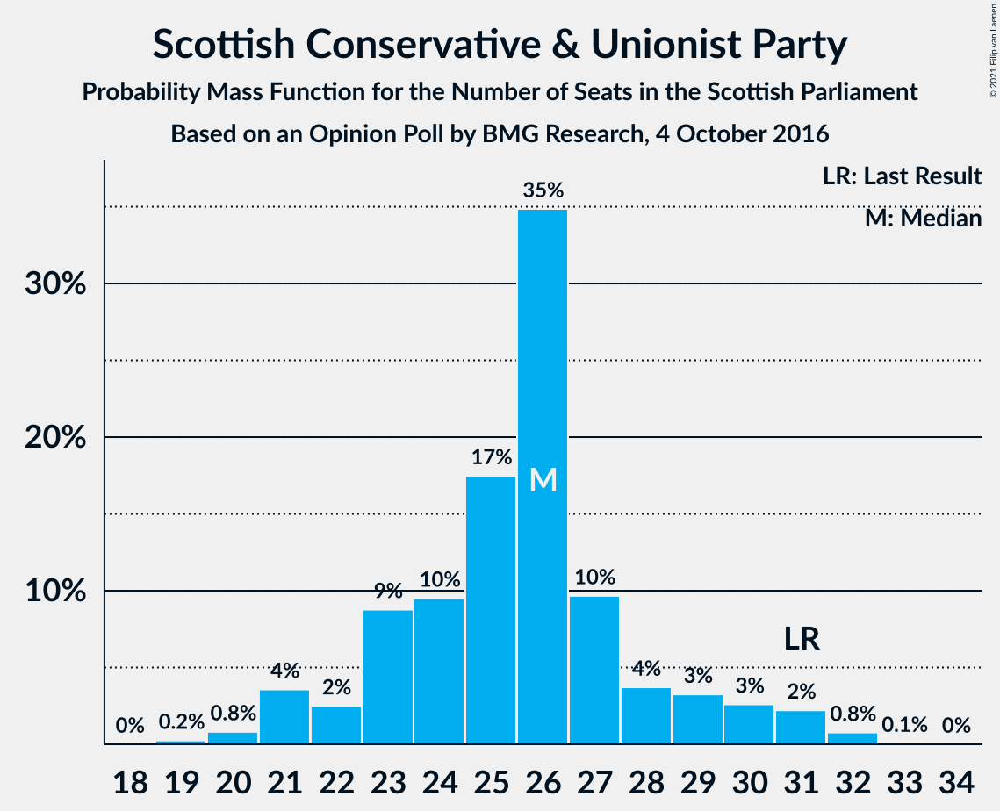
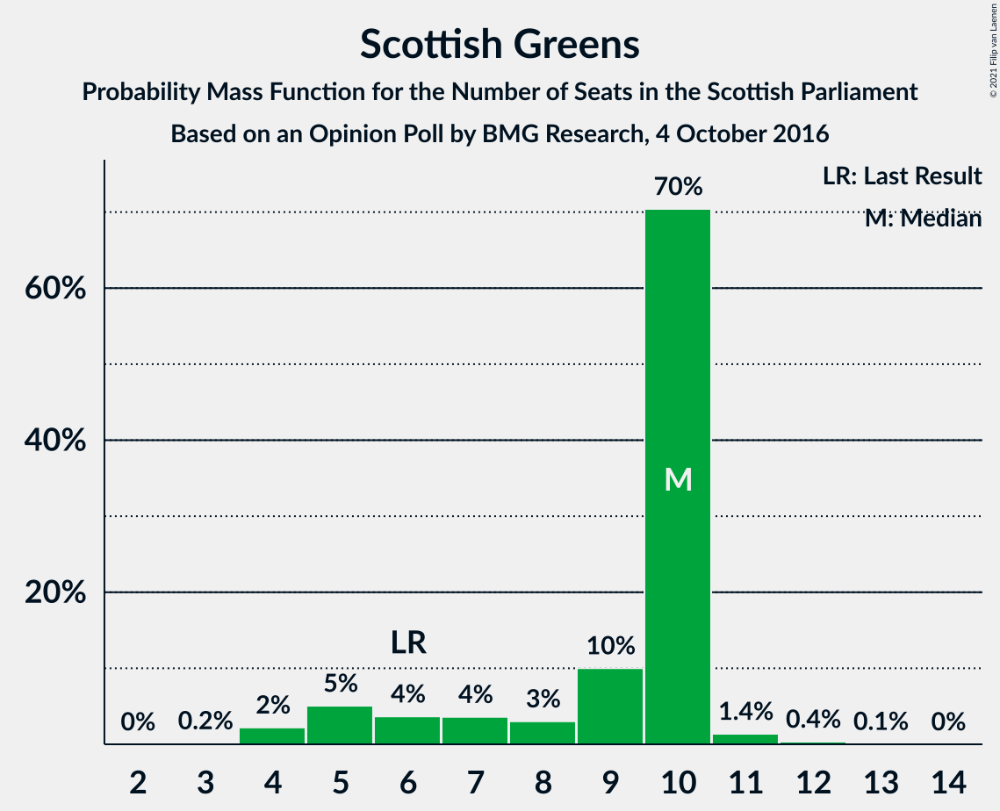

# Opinion Poll by BMG Research, 4 October 2016

<a href="#voting-intentions">Voting Intentions</a> | <a href="#seats">Seats</a> | <a href="#coalitions">Coalitions</a> | <a href="#technical-information">Technical Information</a>

## Voting Intentions

### Confidence Intervals

| Party | Last Result | Poll Result | 80% Confidence Interval | 90% Confidence Interval | 95% Confidence Interval | 99% Confidence Interval |
|:-----:|:-----------:|:-----------:|:-----------------------:|:-----------------------:|:-----------------------:|:-----------------------:|
| Scottish National Party | 41.7% | 43.9% | 41.9–45.9% |41.3–46.5% |40.8–46.9% |39.9–47.9% |
| Scottish Conservative & Unionist Party | 22.9% | 20.4% | 18.8–22.1% |18.4–22.6% |18.0–23.0% |17.3–23.8% |
| Scottish Labour | 19.1% | 16.3% | 14.9–17.9% |14.5–18.4% |14.2–18.7% |13.5–19.5% |
| Scottish Greens | 6.6% | 8.1% | 7.1–9.3% |6.8–9.7% |6.6–10.0% |6.1–10.6% |
| Scottish Liberal Democrats | 5.2% | 7.1% | 6.2–8.3% |5.9–8.6% |5.7–8.9% |5.3–9.5% |
| UK Independence Party | 2.0% | 3.1% | 2.5–3.9% |2.3–4.1% |2.2–4.3% |1.9–4.8% |

*Note:* The poll result column reflects the actual value used in the calculations. Published results may vary slightly, and in addition be rounded to fewer digits.

## Seats

### Confidence Intervals

| Party | Last Result | Median | 80% Confidence Interval | 90% Confidence Interval | 95% Confidence Interval | 99% Confidence Interval |
|:-----:|:-----------:|:------:|:-----------------------:|:-----------------------:|:-----------------------:|:-----------------------:|
| <a href="#scottish-national-party">Scottish National Party</a> | 63 | 69 | 65–71 |65–71 |64–72 |62–73 |
| <a href="#scottish-conservative-&-unionist-party">Scottish Conservative & Unionist Party</a> | 31 | 26 | 23–28 |22–30 |21–31 |20–32 |
| <a href="#scottish-labour">Scottish Labour</a> | 24 | 19 | 17–23 |17–23 |17–24 |16–25 |
| <a href="#scottish-greens">Scottish Greens</a> | 6 | 10 | 6–10 |5–10 |5–10 |4–11 |
| <a href="#scottish-liberal-democrats">Scottish Liberal Democrats</a> | 5 | 6 | 5–8 |5–9 |5–9 |4–11 |
| <a href="#uk-independence-party">UK Independence Party</a> | 0 | 0 | 0 |0 |0 |0–2 |

### Scottish National Party

*For a full overview of the results for this party, see the [Scottish National Party](party-scottishnationalparty.html) page.*

| Number of Seats | Probability | Accumulated | Special Marks |
|:---------------:|:-----------:|:-----------:|:-------------:|
| 61 | 0.2% | 100% |  |
| 62 | 0.4% | 99.8% |  |
| 63 | 1.0% | 99.4% | Last Result |
| 64 | 2% | 98% |  |
| 65 | 8% | 96% | Majority |
| 66 | 4% | 88% |  |
| 67 | 14% | 84% |  |
| 68 | 6% | 70% |  |
| 69 | 33% | 64% | Median |
| 70 | 21% | 31% |  |
| 71 | 8% | 11% |  |
| 72 | 2% | 3% |  |
| 73 | 0.9% | 1.1% |  |
| 74 | 0.1% | 0.2% |  |
| 75 | 0% | 0% |  |

### Scottish Conservative & Unionist Party

*For a full overview of the results for this party, see the [Scottish Conservative & Unionist Party](party-scottishconservativeunionistparty.html) page.*

| Number of Seats | Probability | Accumulated | Special Marks |
|:---------------:|:-----------:|:-----------:|:-------------:|
| 19 | 0.2% | 100% |  |
| 20 | 0.8% | 99.7% |  |
| 21 | 4% | 98.9% |  |
| 22 | 2% | 95% |  |
| 23 | 9% | 93% |  |
| 24 | 10% | 84% |  |
| 25 | 17% | 75% |  |
| 26 | 35% | 57% | Median |
| 27 | 10% | 22% |  |
| 28 | 4% | 13% |  |
| 29 | 3% | 9% |  |
| 30 | 3% | 6% |  |
| 31 | 2% | 3% | Last Result |
| 32 | 0.8% | 0.8% |  |
| 33 | 0.1% | 0.1% |  |
| 34 | 0% | 0% |  |

### Scottish Labour

*For a full overview of the results for this party, see the [Scottish Labour](party-scottishlabour.html) page.*

| Number of Seats | Probability | Accumulated | Special Marks |
|:---------------:|:-----------:|:-----------:|:-------------:|
| 16 | 2% | 100% |  |
| 17 | 25% | 98% |  |
| 18 | 22% | 73% |  |
| 19 | 17% | 51% | Median |
| 20 | 7% | 34% |  |
| 21 | 8% | 28% |  |
| 22 | 8% | 19% |  |
| 23 | 8% | 11% |  |
| 24 | 2% | 3% | Last Result |
| 25 | 0.7% | 0.9% |  |
| 26 | 0.1% | 0.2% |  |
| 27 | 0% | 0.1% |  |
| 28 | 0% | 0% |  |

### Scottish Greens

*For a full overview of the results for this party, see the [Scottish Greens](party-scottishgreens.html) page.*

| Number of Seats | Probability | Accumulated | Special Marks |
|:---------------:|:-----------:|:-----------:|:-------------:|
| 3 | 0.2% | 100% |  |
| 4 | 2% | 99.8% |  |
| 5 | 5% | 98% |  |
| 6 | 4% | 93% | Last Result |
| 7 | 4% | 89% |  |
| 8 | 3% | 85% |  |
| 9 | 10% | 82% |  |
| 10 | 70% | 72% | Median |
| 11 | 1.4% | 2% |  |
| 12 | 0.4% | 0.4% |  |
| 13 | 0.1% | 0.1% |  |
| 14 | 0% | 0% |  |

### Scottish Liberal Democrats

*For a full overview of the results for this party, see the [Scottish Liberal Democrats](party-scottishliberaldemocrats.html) page.*

| Number of Seats | Probability | Accumulated | Special Marks |
|:---------------:|:-----------:|:-----------:|:-------------:|
| 4 | 0.6% | 100% |  |
| 5 | 15% | 99.4% | Last Result |
| 6 | 45% | 84% | Median |
| 7 | 16% | 39% |  |
| 8 | 16% | 23% |  |
| 9 | 6% | 7% |  |
| 10 | 0.9% | 2% |  |
| 11 | 0.6% | 0.6% |  |
| 12 | 0% | 0% |  |

### UK Independence Party

*For a full overview of the results for this party, see the [UK Independence Party](party-ukindependenceparty.html) page.*

| Number of Seats | Probability | Accumulated | Special Marks |
|:---------------:|:-----------:|:-----------:|:-------------:|
| 0 | 98% | 100% | Last Result, Median |
| 1 | 2% | 2% |  |
| 2 | 0.5% | 0.6% |  |
| 3 | 0.1% | 0.2% |  |
| 4 | 0% | 0% |  |

## Coalitions

### Confidence Intervals

| Coalition | Last Result | Median | Majority? | 80% Confidence Interval | 90% Confidence Interval | 95% Confidence Interval | 99% Confidence Interval |
|:---------:|:-----------:|:------:|:---------:|:-----------------------:|:-----------------------:|:-----------------------:|:-----------------------:|
| Scottish National Party – Scottish Greens | 69 | 79 | 100% | 74–80 | 73–81 | 72–81 | 70–83 |
| Scottish National Party | 63 | 69 | 96% | 65–71 | 65–71 | 64–72 | 62–73 |
| Scottish Conservative & Unionist Party – Scottish Labour – Scottish Liberal Democrats | 60 | 50 | 0% | 49–54 | 48–56 | 47–57 | 46–59 |
| Scottish Conservative & Unionist Party – Scottish Labour | 55 | 44 | 0% | 42–48 | 41–49 | 41–50 | 39–53 |
| Scottish Labour – Scottish Greens – Scottish Liberal Democrats | 35 | 35 | 0% | 33–38 | 32–39 | 32–40 | 30–42 |
| Scottish Conservative & Unionist Party – Scottish Liberal Democrats | 36 | 32 | 0% | 29–35 | 28–36 | 27–37 | 26–38 |
| Scottish Labour – Scottish Liberal Democrats | 29 | 25 | 0% | 23–29 | 23–30 | 22–30 | 22–32 |

### Scottish National Party – Scottish Greens

| Number of Seats | Probability | Accumulated | Special Marks |
|:---------------:|:-----------:|:-----------:|:-------------:|
| 68 | 0.1% | 100% |  |
| 69 | 0.3% | 99.9% | Last Result |
| 70 | 0.8% | 99.6% |  |
| 71 | 0.6% | 98.9% |  |
| 72 | 2% | 98% |  |
| 73 | 2% | 97% |  |
| 74 | 5% | 94% |  |
| 75 | 12% | 90% |  |
| 76 | 7% | 78% |  |
| 77 | 13% | 71% |  |
| 78 | 7% | 58% |  |
| 79 | 27% | 50% | Median |
| 80 | 15% | 23% |  |
| 81 | 5% | 8% |  |
| 82 | 2% | 2% |  |
| 83 | 0.7% | 0.8% |  |
| 84 | 0.1% | 0.1% |  |
| 85 | 0% | 0% |  |

### Scottish National Party

| Number of Seats | Probability | Accumulated | Special Marks |
|:---------------:|:-----------:|:-----------:|:-------------:|
| 61 | 0.2% | 100% |  |
| 62 | 0.4% | 99.8% |  |
| 63 | 1.0% | 99.4% | Last Result |
| 64 | 2% | 98% |  |
| 65 | 8% | 96% | Majority |
| 66 | 4% | 88% |  |
| 67 | 14% | 84% |  |
| 68 | 6% | 70% |  |
| 69 | 33% | 64% | Median |
| 70 | 21% | 31% |  |
| 71 | 8% | 11% |  |
| 72 | 2% | 3% |  |
| 73 | 0.9% | 1.1% |  |
| 74 | 0.1% | 0.2% |  |
| 75 | 0% | 0% |  |

### Scottish Conservative & Unionist Party – Scottish Labour – Scottish Liberal Democrats

| Number of Seats | Probability | Accumulated | Special Marks |
|:---------------:|:-----------:|:-----------:|:-------------:|
| 45 | 0.1% | 100% |  |
| 46 | 0.8% | 99.9% |  |
| 47 | 2% | 99.1% |  |
| 48 | 5% | 97% |  |
| 49 | 16% | 92% |  |
| 50 | 27% | 76% |  |
| 51 | 7% | 49% | Median |
| 52 | 13% | 42% |  |
| 53 | 7% | 29% |  |
| 54 | 12% | 22% |  |
| 55 | 5% | 10% |  |
| 56 | 2% | 5% |  |
| 57 | 1.5% | 3% |  |
| 58 | 0.6% | 2% |  |
| 59 | 0.7% | 1.1% |  |
| 60 | 0.3% | 0.4% | Last Result |
| 61 | 0.1% | 0.1% |  |
| 62 | 0% | 0% |  |

### Scottish Conservative & Unionist Party – Scottish Labour

| Number of Seats | Probability | Accumulated | Special Marks |
|:---------------:|:-----------:|:-----------:|:-------------:|
| 38 | 0.1% | 100% |  |
| 39 | 0.5% | 99.9% |  |
| 40 | 2% | 99.4% |  |
| 41 | 4% | 98% |  |
| 42 | 7% | 94% |  |
| 43 | 18% | 86% |  |
| 44 | 26% | 68% |  |
| 45 | 8% | 42% | Median |
| 46 | 11% | 34% |  |
| 47 | 8% | 23% |  |
| 48 | 8% | 15% |  |
| 49 | 4% | 7% |  |
| 50 | 1.2% | 3% |  |
| 51 | 0.8% | 2% |  |
| 52 | 0.6% | 1.2% |  |
| 53 | 0.4% | 0.6% |  |
| 54 | 0.2% | 0.2% |  |
| 55 | 0% | 0% | Last Result |

### Scottish Labour – Scottish Greens – Scottish Liberal Democrats

| Number of Seats | Probability | Accumulated | Special Marks |
|:---------------:|:-----------:|:-----------:|:-------------:|
| 28 | 0.1% | 100% |  |
| 29 | 0.2% | 99.9% |  |
| 30 | 0.3% | 99.6% |  |
| 31 | 0.8% | 99.3% |  |
| 32 | 6% | 98.6% |  |
| 33 | 22% | 92% |  |
| 34 | 21% | 71% |  |
| 35 | 18% | 50% | Last Result, Median |
| 36 | 10% | 33% |  |
| 37 | 8% | 22% |  |
| 38 | 5% | 14% |  |
| 39 | 6% | 9% |  |
| 40 | 2% | 3% |  |
| 41 | 0.6% | 1.1% |  |
| 42 | 0.4% | 0.5% |  |
| 43 | 0.1% | 0.2% |  |
| 44 | 0% | 0% |  |

### Scottish Conservative & Unionist Party – Scottish Liberal Democrats

| Number of Seats | Probability | Accumulated | Special Marks |
|:---------------:|:-----------:|:-----------:|:-------------:|
| 25 | 0.1% | 100% |  |
| 26 | 0.9% | 99.9% |  |
| 27 | 2% | 99.1% |  |
| 28 | 2% | 97% |  |
| 29 | 6% | 94% |  |
| 30 | 7% | 89% |  |
| 31 | 19% | 81% |  |
| 32 | 24% | 62% | Median |
| 33 | 14% | 38% |  |
| 34 | 11% | 24% |  |
| 35 | 5% | 13% |  |
| 36 | 4% | 8% | Last Result |
| 37 | 3% | 4% |  |
| 38 | 0.9% | 1.3% |  |
| 39 | 0.4% | 0.4% |  |
| 40 | 0.1% | 0.1% |  |
| 41 | 0% | 0% |  |

### Scottish Labour – Scottish Liberal Democrats

| Number of Seats | Probability | Accumulated | Special Marks |
|:---------------:|:-----------:|:-----------:|:-------------:|
| 21 | 0.1% | 100% |  |
| 22 | 5% | 99.9% |  |
| 23 | 15% | 95% |  |
| 24 | 18% | 80% |  |
| 25 | 17% | 62% | Median |
| 26 | 10% | 46% |  |
| 27 | 9% | 35% |  |
| 28 | 9% | 26% |  |
| 29 | 9% | 17% | Last Result |
| 30 | 5% | 7% |  |
| 31 | 1.4% | 2% |  |
| 32 | 0.6% | 1.0% |  |
| 33 | 0.3% | 0.4% |  |
| 34 | 0.1% | 0.1% |  |
| 35 | 0% | 0% |  |

## Technical Information

### Opinion Poll

+ **Polling firm:** BMG Research
+ **Commissioner(s):** —
+ **Fieldwork period:** 4 October 2016

### Calculations

+ **Sample size:** 1010
+ **Simulations done:** 1,048,576
+ **Error estimate:** 1.45%

