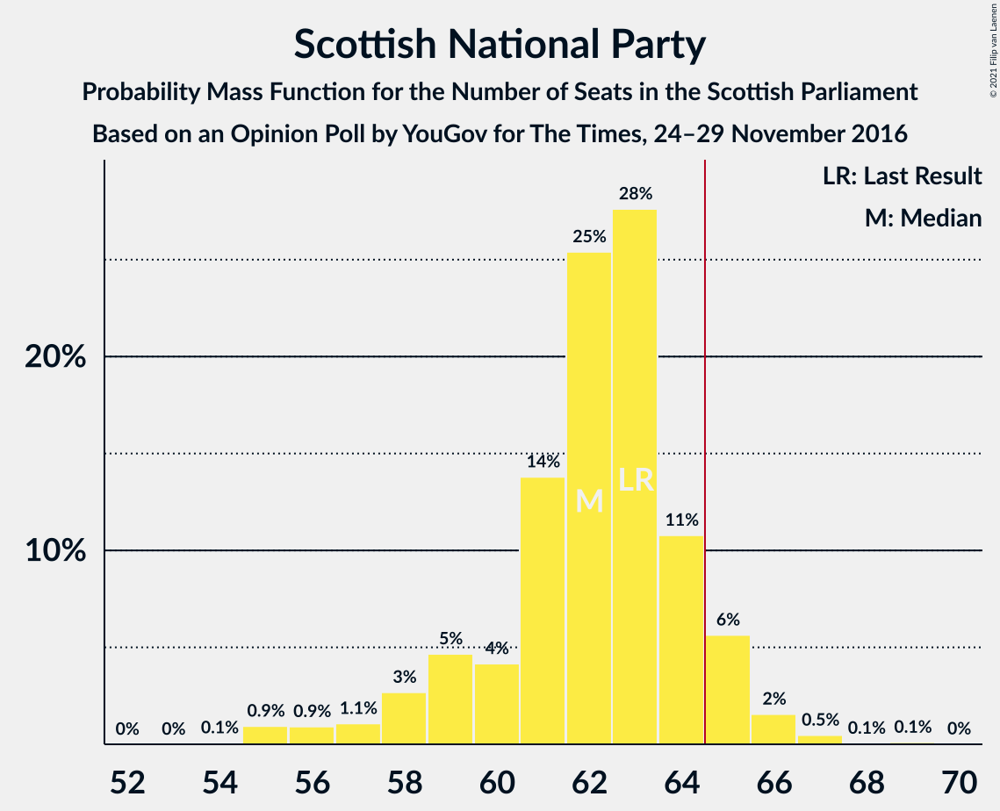
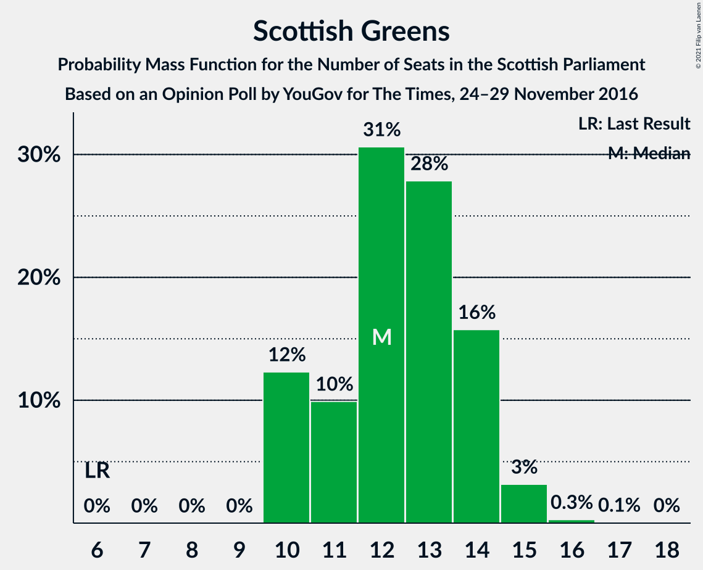
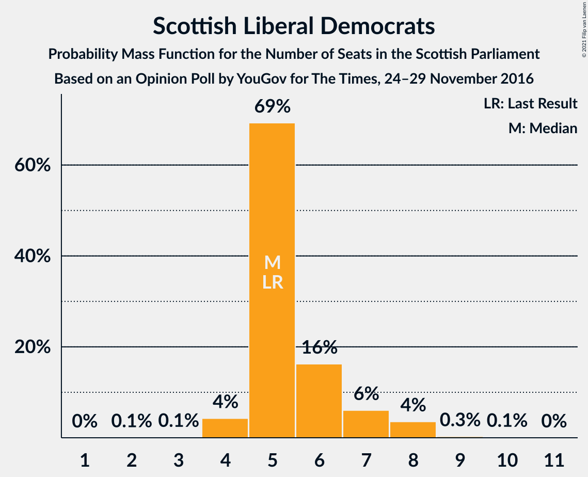
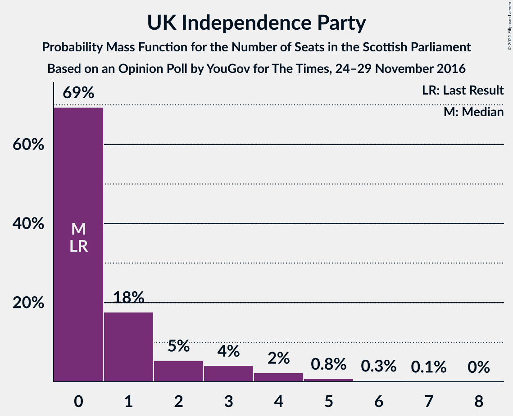

# Opinion Poll by YouGov for The Times, 24–29 November 2016

<a href="#voting-intentions">Voting Intentions</a> | <a href="#seats">Seats</a> | <a href="#coalitions">Coalitions</a> | <a href="#technical-information">Technical Information</a>

## Voting Intentions

### Confidence Intervals

| Party | Last Result | Poll Result | 80% Confidence Interval | 90% Confidence Interval | 95% Confidence Interval | 99% Confidence Interval |
|:-----:|:-----------:|:-----------:|:-----------------------:|:-----------------------:|:-----------------------:|:-----------------------:|
| Scottish National Party | 41.7% | 39.3% | 37.5–41.2% |37.0–41.7% |36.5–42.2% |35.7–43.1% |
| Scottish Conservative & Unionist Party | 22.9% | 24.2% | 22.6–25.8% |22.1–26.3% |21.7–26.7% |21.0–27.6% |
| Scottish Labour | 19.1% | 14.1% | 12.8–15.5% |12.5–15.9% |12.2–16.3% |11.6–17.0% |
| Scottish Greens | 6.6% | 11.1% | 10.0–12.4% |9.7–12.8% |9.4–13.1% |8.9–13.7% |
| Scottish Liberal Democrats | 5.2% | 6.1% | 5.3–7.1% |5.0–7.4% |4.8–7.6% |4.5–8.2% |
| UK Independence Party | 2.0% | 4.1% | 3.4–4.9% |3.2–5.2% |3.0–5.4% |2.8–5.8% |
| Scottish Socialist Party | 0.5% | 1.0% | 0.7–1.5% |0.6–1.6% |0.5–1.7% |0.4–2.0% |

*Note:* The poll result column reflects the actual value used in the calculations. Published results may vary slightly, and in addition be rounded to fewer digits.

## Seats

### Confidence Intervals

| Party | Last Result | Median | 80% Confidence Interval | 90% Confidence Interval | 95% Confidence Interval | 99% Confidence Interval |
|:-----:|:-----------:|:------:|:-----------------------:|:-----------------------:|:-----------------------:|:-----------------------:|
| <a href="#scottish-national-party">Scottish National Party</a> | 63 | 63 | 61–66 |59–66 |58–66 |56–68 |
| <a href="#scottish-conservative-&-unionist-party">Scottish Conservative & Unionist Party</a> | 31 | 32 | 29–33 |28–34 |28–35 |26–37 |
| <a href="#scottish-labour">Scottish Labour</a> | 24 | 17 | 16–17 |15–17 |15–18 |14–20 |
| <a href="#scottish-greens">Scottish Greens</a> | 6 | 12 | 10–13 |10–14 |10–14 |10–15 |
| <a href="#scottish-liberal-democrats">Scottish Liberal Democrats</a> | 5 | 5 | 4–6 |4–7 |4–8 |3–8 |
| <a href="#uk-independence-party">UK Independence Party</a> | 0 | 0 | 0–2 |0–3 |0–4 |0–5 |
| <a href="#scottish-socialist-party">Scottish Socialist Party</a> | 0 | 0 | 0 |0 |0 |0 |

### Scottish National Party

*For a full overview of the results for this party, see the [Scottish National Party](party-scottishnationalparty.html) page.*

| Number of Seats | Probability | Accumulated | Special Marks |
|:---------------:|:-----------:|:-----------:|:-------------:|
| 55 | 0.2% | 100% |  |
| 56 | 0.3% | 99.7% |  |
| 57 | 0.2% | 99.5% |  |
| 58 | 3% | 99.3% |  |
| 59 | 2% | 97% |  |
| 60 | 0.6% | 94% |  |
| 61 | 7% | 94% |  |
| 62 | 8% | 87% |  |
| 63 | 37% | 79% | Last Result, Median |
| 64 | 17% | 43% |  |
| 65 | 15% | 26% | Majority |
| 66 | 10% | 11% |  |
| 67 | 1.2% | 2% |  |
| 68 | 0.1% | 0.6% |  |
| 69 | 0.4% | 0.5% |  |
| 70 | 0% | 0% |  |

### Scottish Conservative & Unionist Party

*For a full overview of the results for this party, see the [Scottish Conservative & Unionist Party](party-scottishconservativeunionistparty.html) page.*

| Number of Seats | Probability | Accumulated | Special Marks |
|:---------------:|:-----------:|:-----------:|:-------------:|
| 25 | 0.3% | 100% |  |
| 26 | 1.0% | 99.6% |  |
| 27 | 1.0% | 98.6% |  |
| 28 | 5% | 98% |  |
| 29 | 4% | 92% |  |
| 30 | 23% | 89% |  |
| 31 | 15% | 66% | Last Result |
| 32 | 36% | 50% | Median |
| 33 | 5% | 14% |  |
| 34 | 6% | 9% |  |
| 35 | 2% | 4% |  |
| 36 | 1.1% | 2% |  |
| 37 | 0.4% | 0.5% |  |
| 38 | 0.1% | 0.1% |  |
| 39 | 0% | 0% |  |

### Scottish Labour

*For a full overview of the results for this party, see the [Scottish Labour](party-scottishlabour.html) page.*

| Number of Seats | Probability | Accumulated | Special Marks |
|:---------------:|:-----------:|:-----------:|:-------------:|
| 12 | 0.1% | 100% |  |
| 13 | 0.2% | 99.8% |  |
| 14 | 0.8% | 99.6% |  |
| 15 | 5% | 98.8% |  |
| 16 | 18% | 93% |  |
| 17 | 71% | 75% | Median |
| 18 | 3% | 5% |  |
| 19 | 1.1% | 2% |  |
| 20 | 0.3% | 0.7% |  |
| 21 | 0.3% | 0.4% |  |
| 22 | 0.1% | 0.1% |  |
| 23 | 0% | 0% |  |
| 24 | 0% | 0% | Last Result |

### Scottish Greens

*For a full overview of the results for this party, see the [Scottish Greens](party-scottishgreens.html) page.*

| Number of Seats | Probability | Accumulated | Special Marks |
|:---------------:|:-----------:|:-----------:|:-------------:|
| 6 | 0% | 100% | Last Result |
| 7 | 0% | 100% |  |
| 8 | 0% | 100% |  |
| 9 | 0% | 100% |  |
| 10 | 11% | 100% |  |
| 11 | 8% | 89% |  |
| 12 | 54% | 81% | Median |
| 13 | 19% | 27% |  |
| 14 | 6% | 9% |  |
| 15 | 2% | 2% |  |
| 16 | 0.1% | 0.1% |  |
| 17 | 0% | 0% |  |

### Scottish Liberal Democrats

*For a full overview of the results for this party, see the [Scottish Liberal Democrats](party-scottishliberaldemocrats.html) page.*

| Number of Seats | Probability | Accumulated | Special Marks |
|:---------------:|:-----------:|:-----------:|:-------------:|
| 2 | 0.2% | 100% |  |
| 3 | 0.6% | 99.8% |  |
| 4 | 28% | 99.1% |  |
| 5 | 49% | 71% | Last Result, Median |
| 6 | 13% | 22% |  |
| 7 | 4% | 9% |  |
| 8 | 5% | 5% |  |
| 9 | 0.3% | 0.3% |  |
| 10 | 0% | 0% |  |

### UK Independence Party

*For a full overview of the results for this party, see the [UK Independence Party](party-ukindependenceparty.html) page.*

| Number of Seats | Probability | Accumulated | Special Marks |
|:---------------:|:-----------:|:-----------:|:-------------:|
| 0 | 69% | 100% | Last Result, Median |
| 1 | 18% | 31% |  |
| 2 | 6% | 13% |  |
| 3 | 4% | 7% |  |
| 4 | 1.0% | 3% |  |
| 5 | 2% | 2% |  |
| 6 | 0.2% | 0.2% |  |
| 7 | 0% | 0% |  |

### Scottish Socialist Party

*For a full overview of the results for this party, see the [Scottish Socialist Party](party-scottishsocialistparty.html) page.*

| Number of Seats | Probability | Accumulated | Special Marks |
|:---------------:|:-----------:|:-----------:|:-------------:|
| 0 | 100% | 100% | Last Result, Median |

## Coalitions

### Confidence Intervals

| Coalition | Last Result | Median | Majority? | 80% Confidence Interval | 90% Confidence Interval | 95% Confidence Interval | 99% Confidence Interval |
|:---------:|:-----------:|:------:|:---------:|:-----------------------:|:-----------------------:|:-----------------------:|:-----------------------:|
| Scottish National Party – Scottish Greens | 69 | 75 | 100% | 73–78 | 72–78 | 71–79 | 69–80 |
| Scottish National Party | 63 | 63 | 26% | 61–66 | 59–66 | 58–66 | 56–68 |
| Scottish Conservative & Unionist Party – Scottish Labour – Scottish Liberal Democrats | 60 | 53 | 0% | 50–56 | 50–56 | 49–57 | 48–60 |
| Scottish Conservative & Unionist Party – Scottish Labour | 55 | 48 | 0% | 45–50 | 45–51 | 44–52 | 43–54 |
| Scottish Conservative & Unionist Party – Scottish Liberal Democrats | 36 | 36 | 0% | 34–39 | 33–39 | 32–40 | 30–42 |
| Scottish Labour – Scottish Greens – Scottish Liberal Democrats | 35 | 34 | 0% | 32–36 | 32–37 | 31–37 | 30–39 |
| Scottish Labour – Scottish Liberal Democrats | 29 | 22 | 0% | 20–23 | 20–24 | 19–24 | 18–26 |

### Scottish National Party – Scottish Greens

| Number of Seats | Probability | Accumulated | Special Marks |
|:---------------:|:-----------:|:-----------:|:-------------:|
| 68 | 0.3% | 100% |  |
| 69 | 0.8% | 99.7% | Last Result |
| 70 | 0.9% | 98.9% |  |
| 71 | 2% | 98% |  |
| 72 | 3% | 96% |  |
| 73 | 7% | 93% |  |
| 74 | 6% | 86% |  |
| 75 | 34% | 80% | Median |
| 76 | 20% | 47% |  |
| 77 | 15% | 27% |  |
| 78 | 8% | 12% |  |
| 79 | 2% | 4% |  |
| 80 | 1.4% | 2% |  |
| 81 | 0.2% | 0.3% |  |
| 82 | 0.1% | 0.1% |  |
| 83 | 0% | 0% |  |

### Scottish National Party

| Number of Seats | Probability | Accumulated | Special Marks |
|:---------------:|:-----------:|:-----------:|:-------------:|
| 55 | 0.2% | 100% |  |
| 56 | 0.3% | 99.7% |  |
| 57 | 0.2% | 99.5% |  |
| 58 | 3% | 99.3% |  |
| 59 | 2% | 97% |  |
| 60 | 0.6% | 94% |  |
| 61 | 7% | 94% |  |
| 62 | 8% | 87% |  |
| 63 | 37% | 79% | Last Result, Median |
| 64 | 17% | 43% |  |
| 65 | 15% | 26% | Majority |
| 66 | 10% | 11% |  |
| 67 | 1.2% | 2% |  |
| 68 | 0.1% | 0.6% |  |
| 69 | 0.4% | 0.5% |  |
| 70 | 0% | 0% |  |

### Scottish Conservative & Unionist Party – Scottish Labour – Scottish Liberal Democrats

| Number of Seats | Probability | Accumulated | Special Marks |
|:---------------:|:-----------:|:-----------:|:-------------:|
| 46 | 0.1% | 100% |  |
| 47 | 0.2% | 99.9% |  |
| 48 | 1.1% | 99.7% |  |
| 49 | 3% | 98.6% |  |
| 50 | 9% | 95% |  |
| 51 | 8% | 87% |  |
| 52 | 12% | 78% |  |
| 53 | 24% | 67% |  |
| 54 | 27% | 43% | Median |
| 55 | 6% | 16% |  |
| 56 | 6% | 10% |  |
| 57 | 2% | 4% |  |
| 58 | 0.8% | 2% |  |
| 59 | 0.7% | 1.3% |  |
| 60 | 0.5% | 0.5% | Last Result |
| 61 | 0% | 0% |  |

### Scottish Conservative & Unionist Party – Scottish Labour

| Number of Seats | Probability | Accumulated | Special Marks |
|:---------------:|:-----------:|:-----------:|:-------------:|
| 41 | 0% | 100% |  |
| 42 | 0.3% | 99.9% |  |
| 43 | 1.0% | 99.7% |  |
| 44 | 1.5% | 98.7% |  |
| 45 | 8% | 97% |  |
| 46 | 11% | 89% |  |
| 47 | 18% | 78% |  |
| 48 | 12% | 60% |  |
| 49 | 36% | 48% | Median |
| 50 | 4% | 12% |  |
| 51 | 4% | 8% |  |
| 52 | 2% | 4% |  |
| 53 | 1.4% | 2% |  |
| 54 | 0.6% | 0.7% |  |
| 55 | 0.1% | 0.2% | Last Result |
| 56 | 0% | 0.1% |  |
| 57 | 0% | 0% |  |

### Scottish Conservative & Unionist Party – Scottish Liberal Democrats

| Number of Seats | Probability | Accumulated | Special Marks |
|:---------------:|:-----------:|:-----------:|:-------------:|
| 29 | 0.1% | 100% |  |
| 30 | 0.4% | 99.9% |  |
| 31 | 1.1% | 99.5% |  |
| 32 | 2% | 98% |  |
| 33 | 5% | 96% |  |
| 34 | 6% | 92% |  |
| 35 | 11% | 85% |  |
| 36 | 29% | 74% | Last Result |
| 37 | 26% | 44% | Median |
| 38 | 6% | 18% |  |
| 39 | 7% | 12% |  |
| 40 | 2% | 5% |  |
| 41 | 2% | 2% |  |
| 42 | 0.7% | 0.9% |  |
| 43 | 0.1% | 0.2% |  |
| 44 | 0% | 0.1% |  |
| 45 | 0% | 0% |  |

### Scottish Labour – Scottish Greens – Scottish Liberal Democrats

| Number of Seats | Probability | Accumulated | Special Marks |
|:---------------:|:-----------:|:-----------:|:-------------:|
| 28 | 0% | 100% |  |
| 29 | 0.2% | 99.9% |  |
| 30 | 1.0% | 99.8% |  |
| 31 | 2% | 98.8% |  |
| 32 | 8% | 97% |  |
| 33 | 27% | 89% |  |
| 34 | 40% | 61% | Median |
| 35 | 8% | 22% | Last Result |
| 36 | 8% | 14% |  |
| 37 | 3% | 5% |  |
| 38 | 2% | 2% |  |
| 39 | 0.4% | 0.6% |  |
| 40 | 0.1% | 0.2% |  |
| 41 | 0.1% | 0.1% |  |
| 42 | 0% | 0% |  |

### Scottish Labour – Scottish Liberal Democrats

| Number of Seats | Probability | Accumulated | Special Marks |
|:---------------:|:-----------:|:-----------:|:-------------:|
| 16 | 0.1% | 100% |  |
| 17 | 0.1% | 99.9% |  |
| 18 | 0.3% | 99.8% |  |
| 19 | 3% | 99.5% |  |
| 20 | 7% | 96% |  |
| 21 | 27% | 89% |  |
| 22 | 39% | 62% | Median |
| 23 | 12% | 22% |  |
| 24 | 8% | 10% |  |
| 25 | 2% | 2% |  |
| 26 | 0.4% | 0.5% |  |
| 27 | 0% | 0.1% |  |
| 28 | 0.1% | 0.1% |  |
| 29 | 0% | 0% | Last Result |

## Technical Information

### Opinion Poll

+ **Polling firm:** YouGov
+ **Commissioner(s):** The Times
+ **Fieldwork period:** 24–29 November 2016

### Calculations

+ **Sample size:** 1134
+ **Simulations done:** 131,072
+ **Error estimate:** 1.14%

