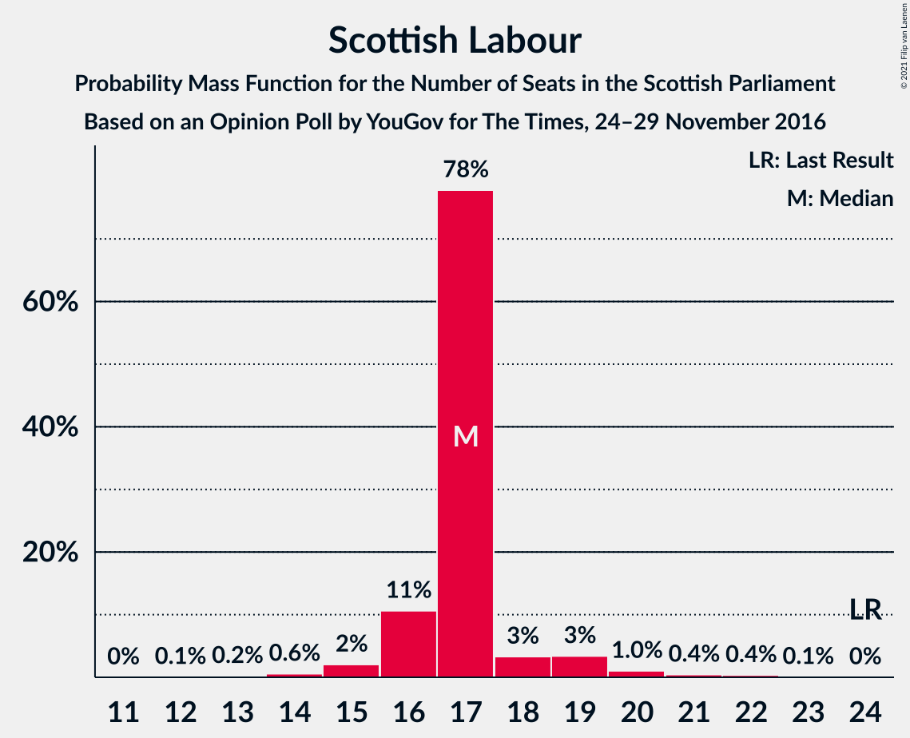
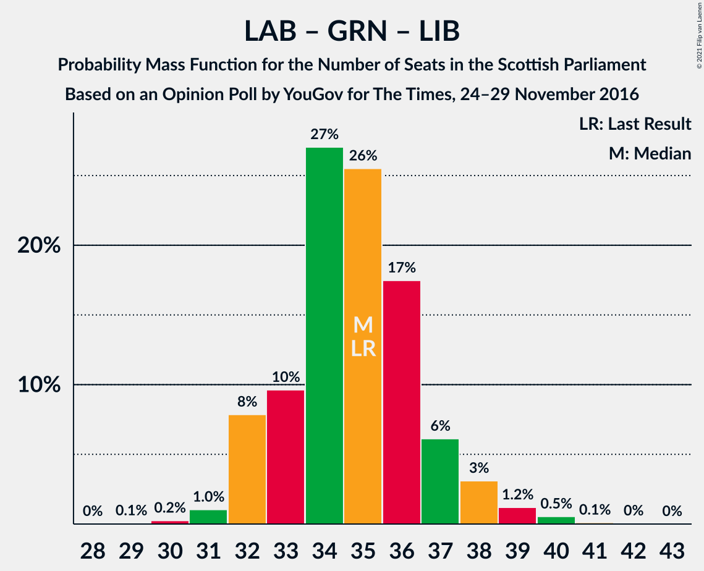

# Opinion Poll by YouGov for The Times, 24–29 November 2016

<a href="#voting-intentions">Voting Intentions</a> | <a href="#seats">Seats</a> | <a href="#coalitions">Coalitions</a> | <a href="#technical-information">Technical Information</a>

## Voting Intentions

### Confidence Intervals

| Party | Last Result | Poll Result | 80% Confidence Interval | 90% Confidence Interval | 95% Confidence Interval | 99% Confidence Interval |
|:-----:|:-----------:|:-----------:|:-----------------------:|:-----------------------:|:-----------------------:|:-----------------------:|
| Scottish National Party | 41.7% | 39.3% | 37.5–41.2% |37.0–41.7% |36.5–42.2% |35.7–43.1% |
| Scottish Conservative & Unionist Party | 22.9% | 24.2% | 22.6–25.8% |22.1–26.3% |21.7–26.7% |21.0–27.6% |
| Scottish Labour | 19.1% | 14.1% | 12.8–15.5% |12.5–15.9% |12.2–16.3% |11.6–17.0% |
| Scottish Greens | 6.6% | 11.1% | 10.0–12.4% |9.7–12.8% |9.4–13.1% |8.9–13.7% |
| Scottish Liberal Democrats | 5.2% | 6.1% | 5.3–7.1% |5.0–7.4% |4.8–7.6% |4.5–8.2% |
| UK Independence Party | 2.0% | 4.1% | 3.4–4.9% |3.2–5.2% |3.0–5.4% |2.8–5.8% |
| Scottish Socialist Party | 0.5% | 1.0% | 0.7–1.5% |0.6–1.6% |0.5–1.7% |0.4–2.0% |

*Note:* The poll result column reflects the actual value used in the calculations. Published results may vary slightly, and in addition be rounded to fewer digits.

## Seats

### Confidence Intervals

| Party | Last Result | Median | 80% Confidence Interval | 90% Confidence Interval | 95% Confidence Interval | 99% Confidence Interval |
|:-----:|:-----------:|:------:|:-----------------------:|:-----------------------:|:-----------------------:|:-----------------------:|
| <a href="#scottish-national-party">Scottish National Party</a> | 63 | 62 | 59–64 |58–65 |57–65 |55–67 |
| <a href="#scottish-conservative-&-unionist-party">Scottish Conservative & Unionist Party</a> | 31 | 31 | 30–34 |29–35 |28–36 |26–37 |
| <a href="#scottish-labour">Scottish Labour</a> | 24 | 17 | 16–17 |16–19 |15–19 |14–21 |
| <a href="#scottish-greens">Scottish Greens</a> | 6 | 12 | 10–14 |10–14 |10–15 |10–15 |
| <a href="#scottish-liberal-democrats">Scottish Liberal Democrats</a> | 5 | 5 | 5–7 |5–7 |4–8 |4–8 |
| <a href="#uk-independence-party">UK Independence Party</a> | 0 | 0 | 0–2 |0–3 |0–4 |0–5 |
| <a href="#scottish-socialist-party">Scottish Socialist Party</a> | 0 | 0 | 0 |0 |0 |0 |

### Scottish National Party

*For a full overview of the results for this party, see the [Scottish National Party](party-scottishnationalparty.html) page.*

| Number of Seats | Probability | Accumulated | Special Marks |
|:---------------:|:-----------:|:-----------:|:-------------:|
| 54 | 0.1% | 100% |  |
| 55 | 0.9% | 99.9% |  |
| 56 | 0.9% | 99.0% |  |
| 57 | 1.1% | 98% |  |
| 58 | 3% | 97% |  |
| 59 | 5% | 94% |  |
| 60 | 4% | 90% |  |
| 61 | 14% | 85% |  |
| 62 | 25% | 72% | Median |
| 63 | 28% | 46% | Last Result |
| 64 | 11% | 19% |  |
| 65 | 6% | 8% | Majority |
| 66 | 2% | 2% |  |
| 67 | 0.5% | 0.7% |  |
| 68 | 0.1% | 0.2% |  |
| 69 | 0.1% | 0.1% |  |
| 70 | 0% | 0% |  |

### Scottish Conservative & Unionist Party

*For a full overview of the results for this party, see the [Scottish Conservative & Unionist Party](party-scottishconservativeunionistparty.html) page.*

| Number of Seats | Probability | Accumulated | Special Marks |
|:---------------:|:-----------:|:-----------:|:-------------:|
| 25 | 0.1% | 100% |  |
| 26 | 0.4% | 99.8% |  |
| 27 | 1.1% | 99.4% |  |
| 28 | 3% | 98% |  |
| 29 | 4% | 96% |  |
| 30 | 24% | 91% |  |
| 31 | 18% | 68% | Last Result, Median |
| 32 | 18% | 50% |  |
| 33 | 17% | 32% |  |
| 34 | 6% | 15% |  |
| 35 | 6% | 9% |  |
| 36 | 2% | 3% |  |
| 37 | 0.4% | 0.6% |  |
| 38 | 0.1% | 0.1% |  |
| 39 | 0% | 0% |  |

### Scottish Labour

*For a full overview of the results for this party, see the [Scottish Labour](party-scottishlabour.html) page.*

| Number of Seats | Probability | Accumulated | Special Marks |
|:---------------:|:-----------:|:-----------:|:-------------:|
| 12 | 0.1% | 100% |  |
| 13 | 0.2% | 99.9% |  |
| 14 | 0.6% | 99.7% |  |
| 15 | 2% | 99.1% |  |
| 16 | 11% | 97% |  |
| 17 | 78% | 86% | Median |
| 18 | 3% | 9% |  |
| 19 | 3% | 5% |  |
| 20 | 1.0% | 2% |  |
| 21 | 0.4% | 0.9% |  |
| 22 | 0.4% | 0.5% |  |
| 23 | 0.1% | 0.1% |  |
| 24 | 0% | 0% | Last Result |

### Scottish Greens

*For a full overview of the results for this party, see the [Scottish Greens](party-scottishgreens.html) page.*

| Number of Seats | Probability | Accumulated | Special Marks |
|:---------------:|:-----------:|:-----------:|:-------------:|
| 6 | 0% | 100% | Last Result |
| 7 | 0% | 100% |  |
| 8 | 0% | 100% |  |
| 9 | 0% | 100% |  |
| 10 | 12% | 100% |  |
| 11 | 10% | 88% |  |
| 12 | 31% | 78% | Median |
| 13 | 28% | 47% |  |
| 14 | 16% | 19% |  |
| 15 | 3% | 4% |  |
| 16 | 0.3% | 0.4% |  |
| 17 | 0.1% | 0.1% |  |
| 18 | 0% | 0% |  |

### Scottish Liberal Democrats

*For a full overview of the results for this party, see the [Scottish Liberal Democrats](party-scottishliberaldemocrats.html) page.*

| Number of Seats | Probability | Accumulated | Special Marks |
|:---------------:|:-----------:|:-----------:|:-------------:|
| 2 | 0.1% | 100% |  |
| 3 | 0.1% | 99.9% |  |
| 4 | 4% | 99.8% |  |
| 5 | 69% | 96% | Last Result, Median |
| 6 | 16% | 26% |  |
| 7 | 6% | 10% |  |
| 8 | 4% | 4% |  |
| 9 | 0.3% | 0.4% |  |
| 10 | 0.1% | 0.2% |  |
| 11 | 0% | 0% |  |

### UK Independence Party

*For a full overview of the results for this party, see the [UK Independence Party](party-ukindependenceparty.html) page.*

| Number of Seats | Probability | Accumulated | Special Marks |
|:---------------:|:-----------:|:-----------:|:-------------:|
| 0 | 69% | 100% | Last Result, Median |
| 1 | 18% | 31% |  |
| 2 | 5% | 13% |  |
| 3 | 4% | 8% |  |
| 4 | 2% | 3% |  |
| 5 | 0.8% | 1.2% |  |
| 6 | 0.3% | 0.4% |  |
| 7 | 0.1% | 0.1% |  |
| 8 | 0% | 0% |  |

### Scottish Socialist Party

*For a full overview of the results for this party, see the [Scottish Socialist Party](party-scottishsocialistparty.html) page.*

| Number of Seats | Probability | Accumulated | Special Marks |
|:---------------:|:-----------:|:-----------:|:-------------:|
| 0 | 100% | 100% | Last Result, Median |

## Coalitions

### Confidence Intervals

| Coalition | Last Result | Median | Majority? | 80% Confidence Interval | 90% Confidence Interval | 95% Confidence Interval | 99% Confidence Interval |
|:---------:|:-----------:|:------:|:---------:|:-----------------------:|:-----------------------:|:-----------------------:|:-----------------------:|
| Scottish National Party – Scottish Greens | 69 | 75 | 100% | 72–77 | 71–77 | 70–78 | 68–79 |
| Scottish National Party | 63 | 62 | 8% | 59–64 | 58–65 | 57–65 | 55–67 |
| Scottish Conservative & Unionist Party – Scottish Labour – Scottish Liberal Democrats | 60 | 54 | 0% | 52–57 | 51–58 | 50–59 | 48–60 |
| Scottish Conservative & Unionist Party – Scottish Labour | 55 | 48 | 0% | 46–52 | 45–52 | 45–53 | 43–54 |
| Scottish Conservative & Unionist Party – Scottish Liberal Democrats | 36 | 37 | 0% | 35–40 | 34–41 | 33–41 | 32–42 |
| Scottish Labour – Scottish Greens – Scottish Liberal Democrats | 35 | 35 | 0% | 33–37 | 32–38 | 32–38 | 31–40 |
| Scottish Labour – Scottish Liberal Democrats | 29 | 22 | 0% | 21–24 | 21–24 | 20–25 | 19–27 |

### Scottish National Party – Scottish Greens

| Number of Seats | Probability | Accumulated | Special Marks |
|:---------------:|:-----------:|:-----------:|:-------------:|
| 66 | 0% | 100% |  |
| 67 | 0.1% | 99.9% |  |
| 68 | 0.4% | 99.8% |  |
| 69 | 1.3% | 99.4% | Last Result |
| 70 | 2% | 98% |  |
| 71 | 5% | 96% |  |
| 72 | 8% | 91% |  |
| 73 | 11% | 83% |  |
| 74 | 18% | 72% | Median |
| 75 | 18% | 54% |  |
| 76 | 24% | 37% |  |
| 77 | 9% | 12% |  |
| 78 | 2% | 3% |  |
| 79 | 0.7% | 1.1% |  |
| 80 | 0.3% | 0.4% |  |
| 81 | 0.1% | 0.1% |  |
| 82 | 0% | 0% |  |

### Scottish National Party

| Number of Seats | Probability | Accumulated | Special Marks |
|:---------------:|:-----------:|:-----------:|:-------------:|
| 54 | 0.1% | 100% |  |
| 55 | 0.9% | 99.9% |  |
| 56 | 0.9% | 99.0% |  |
| 57 | 1.1% | 98% |  |
| 58 | 3% | 97% |  |
| 59 | 5% | 94% |  |
| 60 | 4% | 90% |  |
| 61 | 14% | 85% |  |
| 62 | 25% | 72% | Median |
| 63 | 28% | 46% | Last Result |
| 64 | 11% | 19% |  |
| 65 | 6% | 8% | Majority |
| 66 | 2% | 2% |  |
| 67 | 0.5% | 0.7% |  |
| 68 | 0.1% | 0.2% |  |
| 69 | 0.1% | 0.1% |  |
| 70 | 0% | 0% |  |

### Scottish Conservative & Unionist Party – Scottish Labour – Scottish Liberal Democrats

| Number of Seats | Probability | Accumulated | Special Marks |
|:---------------:|:-----------:|:-----------:|:-------------:|
| 47 | 0.1% | 100% |  |
| 48 | 0.4% | 99.9% |  |
| 49 | 1.1% | 99.4% |  |
| 50 | 3% | 98% |  |
| 51 | 4% | 96% |  |
| 52 | 18% | 92% |  |
| 53 | 19% | 74% | Median |
| 54 | 17% | 55% |  |
| 55 | 16% | 38% |  |
| 56 | 9% | 22% |  |
| 57 | 6% | 13% |  |
| 58 | 4% | 7% |  |
| 59 | 2% | 3% |  |
| 60 | 0.8% | 1.0% | Last Result |
| 61 | 0.1% | 0.2% |  |
| 62 | 0.1% | 0.1% |  |
| 63 | 0% | 0% |  |

### Scottish Conservative & Unionist Party – Scottish Labour

| Number of Seats | Probability | Accumulated | Special Marks |
|:---------------:|:-----------:|:-----------:|:-------------:|
| 42 | 0.2% | 100% |  |
| 43 | 0.5% | 99.8% |  |
| 44 | 1.1% | 99.3% |  |
| 45 | 3% | 98% |  |
| 46 | 6% | 95% |  |
| 47 | 23% | 89% |  |
| 48 | 17% | 66% | Median |
| 49 | 17% | 49% |  |
| 50 | 16% | 32% |  |
| 51 | 5% | 16% |  |
| 52 | 7% | 11% |  |
| 53 | 2% | 4% |  |
| 54 | 2% | 2% |  |
| 55 | 0.2% | 0.3% | Last Result |
| 56 | 0% | 0.1% |  |
| 57 | 0% | 0% |  |

### Scottish Conservative & Unionist Party – Scottish Liberal Democrats

| Number of Seats | Probability | Accumulated | Special Marks |
|:---------------:|:-----------:|:-----------:|:-------------:|
| 30 | 0.1% | 100% |  |
| 31 | 0.3% | 99.9% |  |
| 32 | 0.9% | 99.6% |  |
| 33 | 2% | 98.6% |  |
| 34 | 4% | 96% |  |
| 35 | 16% | 92% |  |
| 36 | 22% | 77% | Last Result, Median |
| 37 | 16% | 55% |  |
| 38 | 18% | 39% |  |
| 39 | 10% | 21% |  |
| 40 | 5% | 11% |  |
| 41 | 4% | 6% |  |
| 42 | 1.4% | 2% |  |
| 43 | 0.3% | 0.4% |  |
| 44 | 0.1% | 0.1% |  |
| 45 | 0% | 0% |  |

### Scottish Labour – Scottish Greens – Scottish Liberal Democrats

| Number of Seats | Probability | Accumulated | Special Marks |
|:---------------:|:-----------:|:-----------:|:-------------:|
| 29 | 0.1% | 100% |  |
| 30 | 0.2% | 99.9% |  |
| 31 | 1.0% | 99.7% |  |
| 32 | 8% | 98.6% |  |
| 33 | 10% | 91% |  |
| 34 | 27% | 81% | Median |
| 35 | 26% | 54% | Last Result |
| 36 | 17% | 29% |  |
| 37 | 6% | 11% |  |
| 38 | 3% | 5% |  |
| 39 | 1.2% | 2% |  |
| 40 | 0.5% | 0.7% |  |
| 41 | 0.1% | 0.2% |  |
| 42 | 0% | 0.1% |  |
| 43 | 0% | 0% |  |

### Scottish Labour – Scottish Liberal Democrats

| Number of Seats | Probability | Accumulated | Special Marks |
|:---------------:|:-----------:|:-----------:|:-------------:|
| 17 | 0.1% | 100% |  |
| 18 | 0.2% | 99.9% |  |
| 19 | 0.9% | 99.7% |  |
| 20 | 2% | 98.8% |  |
| 21 | 8% | 97% |  |
| 22 | 59% | 89% | Median |
| 23 | 16% | 30% |  |
| 24 | 9% | 14% |  |
| 25 | 3% | 4% |  |
| 26 | 0.8% | 2% |  |
| 27 | 0.5% | 0.8% |  |
| 28 | 0.2% | 0.3% |  |
| 29 | 0.1% | 0.1% | Last Result |
| 30 | 0% | 0% |  |

## Technical Information

### Opinion Poll

+ **Polling firm:** YouGov
+ **Commissioner(s):** The Times
+ **Fieldwork period:** 24–29 November 2016

### Calculations

+ **Sample size:** 1134
+ **Simulations done:** 1,048,576
+ **Error estimate:** 1.25%

