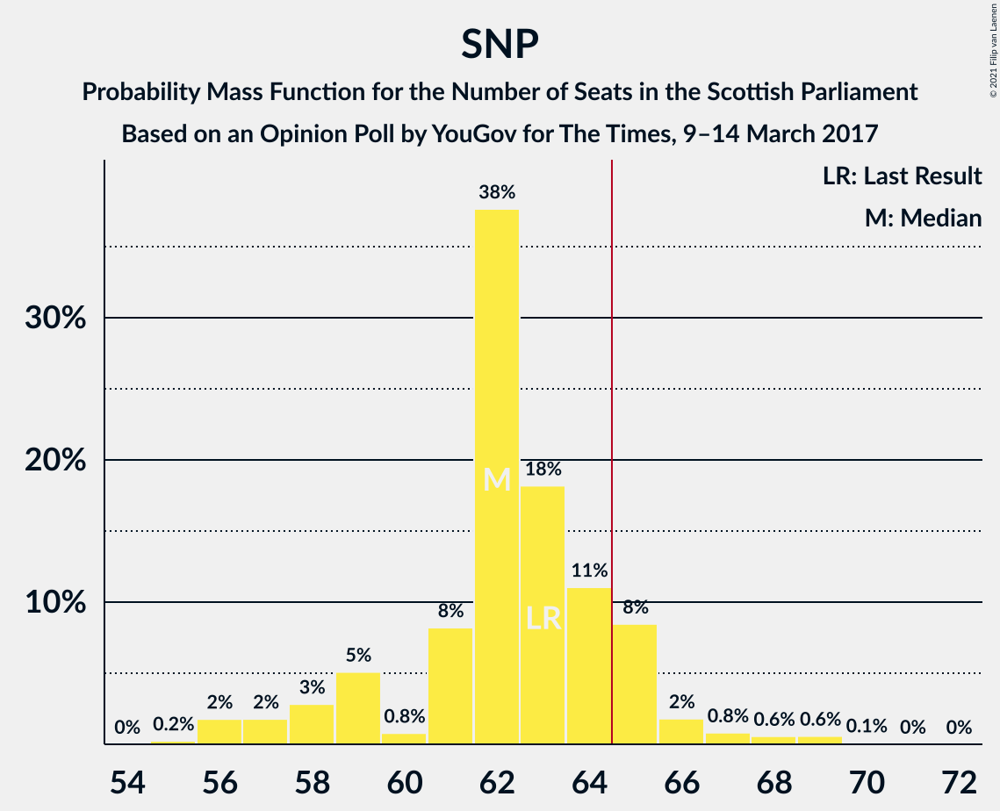
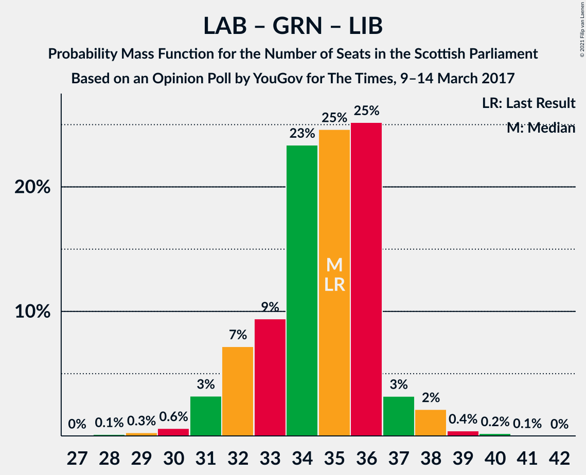

# Opinion Poll by YouGov for The Times, 9–14 March 2017

<a href="#voting-intentions">Voting Intentions</a> | <a href="#seats">Seats</a> | <a href="#coalitions">Coalitions</a> | <a href="#technical-information">Technical Information</a>

## Voting Intentions

### Confidence Intervals

| Party | Last Result | Poll Result | 80% Confidence Interval | 90% Confidence Interval | 95% Confidence Interval | 99% Confidence Interval |
|:-----:|:-----------:|:-----------:|:-----------------------:|:-----------------------:|:-----------------------:|:-----------------------:|
| Scottish National Party | 41.7% | 40.0% | 38.0–42.0% |37.5–42.5% |37.0–43.0% |36.1–44.0% |
| Scottish Conservative & Unionist Party | 22.9% | 25.0% | 23.3–26.8% |22.8–27.3% |22.5–27.7% |21.7–28.6% |
| Scottish Labour | 19.1% | 14.0% | 12.7–15.5% |12.3–15.9% |12.0–16.3% |11.4–17.0% |
| Scottish Greens | 6.6% | 12.0% | 10.7–13.4% |10.4–13.7% |10.1–14.1% |9.6–14.8% |
| Scottish Liberal Democrats | 5.2% | 5.0% | 4.2–5.9% |4.0–6.2% |3.8–6.5% |3.4–7.0% |
| UK Independence Party | 2.0% | 2.0% | 1.6–2.7% |1.4–2.9% |1.3–3.1% |1.1–3.5% |
| Scottish Socialist Party | 0.5% | 1.0% | 0.7–1.5% |0.6–1.6% |0.5–1.8% |0.4–2.1% |

*Note:* The poll result column reflects the actual value used in the calculations. Published results may vary slightly, and in addition be rounded to fewer digits.

## Seats

### Confidence Intervals

| Party | Last Result | Median | 80% Confidence Interval | 90% Confidence Interval | 95% Confidence Interval | 99% Confidence Interval |
|:-----:|:-----------:|:------:|:-----------------------:|:-----------------------:|:-----------------------:|:-----------------------:|
| <a href="#scottish-national-party">Scottish National Party</a> | 63 | 62 | 59–65 |58–65 |57–66 |56–69 |
| <a href="#scottish-conservative-&-unionist-party">Scottish Conservative & Unionist Party</a> | 31 | 32 | 30–35 |30–35 |29–36 |27–38 |
| <a href="#scottish-labour">Scottish Labour</a> | 24 | 17 | 16–17 |15–18 |15–19 |13–21 |
| <a href="#scottish-greens">Scottish Greens</a> | 6 | 13 | 12–15 |12–15 |10–16 |10–17 |
| <a href="#scottish-liberal-democrats">Scottish Liberal Democrats</a> | 5 | 5 | 3–5 |2–5 |2–5 |2–6 |
| <a href="#uk-independence-party">UK Independence Party</a> | 0 | 0 | 0 |0 |0 |0 |
| <a href="#scottish-socialist-party">Scottish Socialist Party</a> | 0 | 0 | 0 |0 |0 |0 |

### Scottish National Party

*For a full overview of the results for this party, see the [Scottish National Party](party-scottishnationalparty.html) page.*

| Number of Seats | Probability | Accumulated | Special Marks |
|:---------------:|:-----------:|:-----------:|:-------------:|
| 55 | 0.2% | 100% |  |
| 56 | 2% | 99.7% |  |
| 57 | 2% | 98% |  |
| 58 | 3% | 96% |  |
| 59 | 5% | 93% |  |
| 60 | 0.8% | 88% |  |
| 61 | 8% | 87% |  |
| 62 | 38% | 79% | Median |
| 63 | 18% | 42% | Last Result |
| 64 | 11% | 23% |  |
| 65 | 8% | 12% | Majority |
| 66 | 2% | 4% |  |
| 67 | 0.8% | 2% |  |
| 68 | 0.6% | 1.3% |  |
| 69 | 0.6% | 0.7% |  |
| 70 | 0.1% | 0.1% |  |
| 71 | 0% | 0% |  |

### Scottish Conservative & Unionist Party

*For a full overview of the results for this party, see the [Scottish Conservative & Unionist Party](party-scottishconservativeunionistparty.html) page.*

| Number of Seats | Probability | Accumulated | Special Marks |
|:---------------:|:-----------:|:-----------:|:-------------:|
| 25 | 0.1% | 100% |  |
| 26 | 0.3% | 99.9% |  |
| 27 | 0.5% | 99.5% |  |
| 28 | 1.0% | 99.1% |  |
| 29 | 1.2% | 98% |  |
| 30 | 8% | 97% |  |
| 31 | 38% | 89% | Last Result |
| 32 | 12% | 51% | Median |
| 33 | 17% | 39% |  |
| 34 | 10% | 22% |  |
| 35 | 7% | 12% |  |
| 36 | 3% | 5% |  |
| 37 | 1.1% | 2% |  |
| 38 | 0.6% | 0.7% |  |
| 39 | 0.1% | 0.1% |  |
| 40 | 0% | 0.1% |  |
| 41 | 0% | 0% |  |

### Scottish Labour

*For a full overview of the results for this party, see the [Scottish Labour](party-scottishlabour.html) page.*

| Number of Seats | Probability | Accumulated | Special Marks |
|:---------------:|:-----------:|:-----------:|:-------------:|
| 11 | 0.1% | 100% |  |
| 12 | 0.2% | 99.9% |  |
| 13 | 0.3% | 99.7% |  |
| 14 | 1.1% | 99.4% |  |
| 15 | 5% | 98% |  |
| 16 | 11% | 93% |  |
| 17 | 75% | 82% | Median |
| 18 | 3% | 7% |  |
| 19 | 3% | 4% |  |
| 20 | 0.7% | 1.2% |  |
| 21 | 0.3% | 0.5% |  |
| 22 | 0.1% | 0.2% |  |
| 23 | 0% | 0.1% |  |
| 24 | 0% | 0% | Last Result |

### Scottish Greens

*For a full overview of the results for this party, see the [Scottish Greens](party-scottishgreens.html) page.*

| Number of Seats | Probability | Accumulated | Special Marks |
|:---------------:|:-----------:|:-----------:|:-------------:|
| 6 | 0% | 100% | Last Result |
| 7 | 0% | 100% |  |
| 8 | 0% | 100% |  |
| 9 | 0% | 100% |  |
| 10 | 3% | 100% |  |
| 11 | 2% | 97% |  |
| 12 | 27% | 96% |  |
| 13 | 27% | 69% | Median |
| 14 | 31% | 42% |  |
| 15 | 7% | 11% |  |
| 16 | 2% | 3% |  |
| 17 | 0.9% | 1.2% |  |
| 18 | 0.1% | 0.3% |  |
| 19 | 0.1% | 0.2% |  |
| 20 | 0.1% | 0.1% |  |
| 21 | 0% | 0% |  |

### Scottish Liberal Democrats

*For a full overview of the results for this party, see the [Scottish Liberal Democrats](party-scottishliberaldemocrats.html) page.*

| Number of Seats | Probability | Accumulated | Special Marks |
|:---------------:|:-----------:|:-----------:|:-------------:|
| 2 | 7% | 100% |  |
| 3 | 7% | 93% |  |
| 4 | 14% | 87% |  |
| 5 | 71% | 73% | Last Result, Median |
| 6 | 1.1% | 1.4% |  |
| 7 | 0.3% | 0.3% |  |
| 8 | 0.1% | 0.1% |  |
| 9 | 0% | 0% |  |

### UK Independence Party

*For a full overview of the results for this party, see the [UK Independence Party](party-ukindependenceparty.html) page.*

| Number of Seats | Probability | Accumulated | Special Marks |
|:---------------:|:-----------:|:-----------:|:-------------:|
| 0 | 100% | 100% | Last Result, Median |

### Scottish Socialist Party

*For a full overview of the results for this party, see the [Scottish Socialist Party](party-scottishsocialistparty.html) page.*

| Number of Seats | Probability | Accumulated | Special Marks |
|:---------------:|:-----------:|:-----------:|:-------------:|
| 0 | 100% | 100% | Last Result, Median |

## Coalitions

### Confidence Intervals

| Coalition | Last Result | Median | Majority? | 80% Confidence Interval | 90% Confidence Interval | 95% Confidence Interval | 99% Confidence Interval |
|:---------:|:-----------:|:------:|:---------:|:-----------------------:|:-----------------------:|:-----------------------:|:-----------------------:|
| Scottish National Party – Scottish Greens | 69 | 76 | 100% | 73–78 | 72–79 | 71–80 | 70–82 |
| Scottish National Party | 63 | 62 | 12% | 59–65 | 58–65 | 57–66 | 56–69 |
| Scottish Conservative & Unionist Party – Scottish Labour – Scottish Liberal Democrats | 60 | 53 | 0% | 51–56 | 50–57 | 49–58 | 47–59 |
| Scottish Conservative & Unionist Party – Scottish Labour | 55 | 49 | 0% | 47–52 | 46–52 | 45–54 | 43–54 |
| Scottish Conservative & Unionist Party – Scottish Liberal Democrats | 36 | 36 | 0% | 35–39 | 34–40 | 33–41 | 30–42 |
| Scottish Labour – Scottish Greens – Scottish Liberal Democrats | 35 | 35 | 0% | 32–36 | 32–37 | 31–38 | 30–39 |
| Scottish Labour – Scottish Liberal Democrats | 29 | 22 | 0% | 20–22 | 19–23 | 19–24 | 17–25 |

### Scottish National Party – Scottish Greens

| Number of Seats | Probability | Accumulated | Special Marks |
|:---------------:|:-----------:|:-----------:|:-------------:|
| 68 | 0.1% | 100% |  |
| 69 | 0.3% | 99.9% | Last Result |
| 70 | 2% | 99.6% |  |
| 71 | 2% | 98% |  |
| 72 | 5% | 96% |  |
| 73 | 6% | 90% |  |
| 74 | 17% | 84% |  |
| 75 | 7% | 67% | Median |
| 76 | 33% | 59% |  |
| 77 | 13% | 27% |  |
| 78 | 8% | 14% |  |
| 79 | 3% | 6% |  |
| 80 | 1.3% | 3% |  |
| 81 | 0.9% | 2% |  |
| 82 | 0.7% | 0.9% |  |
| 83 | 0.2% | 0.2% |  |
| 84 | 0.1% | 0.1% |  |
| 85 | 0% | 0% |  |

### Scottish National Party

| Number of Seats | Probability | Accumulated | Special Marks |
|:---------------:|:-----------:|:-----------:|:-------------:|
| 55 | 0.2% | 100% |  |
| 56 | 2% | 99.7% |  |
| 57 | 2% | 98% |  |
| 58 | 3% | 96% |  |
| 59 | 5% | 93% |  |
| 60 | 0.8% | 88% |  |
| 61 | 8% | 87% |  |
| 62 | 38% | 79% | Median |
| 63 | 18% | 42% | Last Result |
| 64 | 11% | 23% |  |
| 65 | 8% | 12% | Majority |
| 66 | 2% | 4% |  |
| 67 | 0.8% | 2% |  |
| 68 | 0.6% | 1.3% |  |
| 69 | 0.6% | 0.7% |  |
| 70 | 0.1% | 0.1% |  |
| 71 | 0% | 0% |  |

### Scottish Conservative & Unionist Party – Scottish Labour – Scottish Liberal Democrats

| Number of Seats | Probability | Accumulated | Special Marks |
|:---------------:|:-----------:|:-----------:|:-------------:|
| 45 | 0.1% | 100% |  |
| 46 | 0.2% | 99.9% |  |
| 47 | 0.7% | 99.8% |  |
| 48 | 0.9% | 99.1% |  |
| 49 | 1.3% | 98% |  |
| 50 | 3% | 97% |  |
| 51 | 8% | 94% |  |
| 52 | 13% | 86% |  |
| 53 | 33% | 73% |  |
| 54 | 7% | 41% | Median |
| 55 | 17% | 33% |  |
| 56 | 6% | 16% |  |
| 57 | 5% | 10% |  |
| 58 | 2% | 4% |  |
| 59 | 2% | 2% |  |
| 60 | 0.3% | 0.4% | Last Result |
| 61 | 0.1% | 0.1% |  |
| 62 | 0% | 0% |  |

### Scottish Conservative & Unionist Party – Scottish Labour

| Number of Seats | Probability | Accumulated | Special Marks |
|:---------------:|:-----------:|:-----------:|:-------------:|
| 41 | 0% | 100% |  |
| 42 | 0.1% | 99.9% |  |
| 43 | 0.5% | 99.8% |  |
| 44 | 0.8% | 99.3% |  |
| 45 | 2% | 98.5% |  |
| 46 | 5% | 97% |  |
| 47 | 10% | 92% |  |
| 48 | 32% | 82% |  |
| 49 | 12% | 50% | Median |
| 50 | 17% | 39% |  |
| 51 | 10% | 22% |  |
| 52 | 6% | 11% |  |
| 53 | 2% | 5% |  |
| 54 | 3% | 3% |  |
| 55 | 0.3% | 0.4% | Last Result |
| 56 | 0.1% | 0.1% |  |
| 57 | 0% | 0% |  |

### Scottish Conservative & Unionist Party – Scottish Liberal Democrats

| Number of Seats | Probability | Accumulated | Special Marks |
|:---------------:|:-----------:|:-----------:|:-------------:|
| 29 | 0.1% | 100% |  |
| 30 | 0.5% | 99.9% |  |
| 31 | 0.5% | 99.4% |  |
| 32 | 1.0% | 98.8% |  |
| 33 | 2% | 98% |  |
| 34 | 6% | 96% |  |
| 35 | 12% | 90% |  |
| 36 | 37% | 78% | Last Result |
| 37 | 8% | 41% | Median |
| 38 | 17% | 34% |  |
| 39 | 7% | 16% |  |
| 40 | 5% | 10% |  |
| 41 | 3% | 4% |  |
| 42 | 1.1% | 2% |  |
| 43 | 0.3% | 0.4% |  |
| 44 | 0.1% | 0.1% |  |
| 45 | 0% | 0% |  |

### Scottish Labour – Scottish Greens – Scottish Liberal Democrats

| Number of Seats | Probability | Accumulated | Special Marks |
|:---------------:|:-----------:|:-----------:|:-------------:|
| 28 | 0.1% | 100% |  |
| 29 | 0.3% | 99.8% |  |
| 30 | 0.6% | 99.6% |  |
| 31 | 3% | 99.0% |  |
| 32 | 7% | 96% |  |
| 33 | 9% | 89% |  |
| 34 | 23% | 79% |  |
| 35 | 25% | 56% | Last Result, Median |
| 36 | 25% | 31% |  |
| 37 | 3% | 6% |  |
| 38 | 2% | 3% |  |
| 39 | 0.4% | 0.7% |  |
| 40 | 0.2% | 0.3% |  |
| 41 | 0.1% | 0.1% |  |
| 42 | 0% | 0% |  |

### Scottish Labour – Scottish Liberal Democrats

| Number of Seats | Probability | Accumulated | Special Marks |
|:---------------:|:-----------:|:-----------:|:-------------:|
| 15 | 0.1% | 100% |  |
| 16 | 0.3% | 99.9% |  |
| 17 | 0.6% | 99.7% |  |
| 18 | 1.1% | 99.1% |  |
| 19 | 8% | 98% |  |
| 20 | 11% | 90% |  |
| 21 | 16% | 79% |  |
| 22 | 58% | 63% | Median |
| 23 | 2% | 6% |  |
| 24 | 2% | 3% |  |
| 25 | 0.6% | 1.0% |  |
| 26 | 0.2% | 0.4% |  |
| 27 | 0.1% | 0.1% |  |
| 28 | 0% | 0.1% |  |
| 29 | 0% | 0% | Last Result |

## Technical Information

### Opinion Poll

+ **Polling firm:** YouGov
+ **Commissioner(s):** The Times
+ **Fieldwork period:** 9–14 March 2017

### Calculations

+ **Sample size:** 1028
+ **Simulations done:** 1,048,576
+ **Error estimate:** 0.87%

