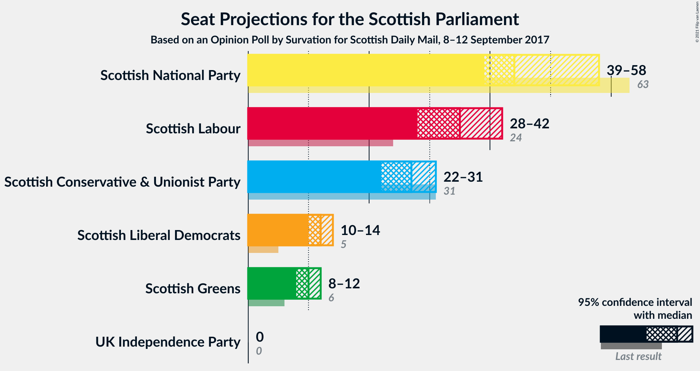
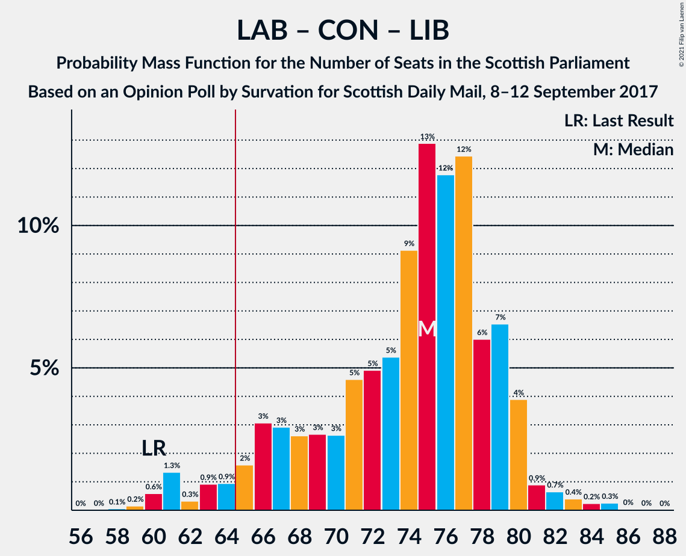

# Opinion Poll by Survation for Scottish Daily Mail, 8–12 September 2017

<a href="#voting-intentions">Voting Intentions</a> | <a href="#seats">Seats</a> | <a href="#coalitions">Coalitions</a> | <a href="#technical-information">Technical Information</a>

## Voting Intentions

### Confidence Intervals

| Party | Last Result | Poll Result | 80% Confidence Interval | 90% Confidence Interval | 95% Confidence Interval | 99% Confidence Interval |
|:-----:|:-----------:|:-----------:|:-----------------------:|:-----------------------:|:-----------------------:|:-----------------------:|
| Scottish National Party | 41.7% | 31.2% | 29.4–33.1% |28.9–33.7% |28.4–34.1% |27.6–35.1% |
| Scottish Labour | 19.1% | 25.2% | 23.5–27.0% |23.0–27.5% |22.6–28.0% |21.8–28.9% |
| Scottish Conservative & Unionist Party | 22.9% | 21.2% | 19.6–22.9% |19.1–23.4% |18.8–23.8% |18.0–24.6% |
| Scottish Liberal Democrats | 5.2% | 10.0% | 8.9–11.4% |8.6–11.7% |8.3–12.1% |7.8–12.7% |
| Scottish Greens | 6.6% | 9.1% | 8.0–10.3% |7.7–10.7% |7.4–11.0% |7.0–11.6% |
| UK Independence Party | 2.0% | 3.1% | 2.5–3.9% |2.3–4.1% |2.1–4.3% |1.9–4.7% |

*Note:* The poll result column reflects the actual value used in the calculations. Published results may vary slightly, and in addition be rounded to fewer digits.

## Seats

### Confidence Intervals

| Party | Last Result | Median | 80% Confidence Interval | 90% Confidence Interval | 95% Confidence Interval | 99% Confidence Interval |
|:-----:|:-----------:|:------:|:-----------------------:|:-----------------------:|:-----------------------:|:-----------------------:|
| <a href="#scottish-national-party">Scottish National Party</a> | 63 | 53 | 50–59 |49–59 |48–60 |46–61 |
| <a href="#scottish-labour">Scottish Labour</a> | 24 | 30 | 28–33 |27–34 |27–34 |25–36 |
| <a href="#scottish-conservative-&-unionist-party">Scottish Conservative & Unionist Party</a> | 31 | 25 | 22–27 |22–28 |20–29 |19–30 |
| <a href="#scottish-liberal-democrats">Scottish Liberal Democrats</a> | 5 | 11 | 9–12 |8–12 |8–12 |7–13 |
| <a href="#scottish-greens">Scottish Greens</a> | 6 | 10 | 7–10 |7–11 |6–11 |5–12 |
| <a href="#uk-independence-party">UK Independence Party</a> | 0 | 0 | 0 |0 |0 |0–1 |

### Scottish National Party

*For a full overview of the results for this party, see the [Scottish National Party](party-scottishnationalparty.html) page.*

| Number of Seats | Probability | Accumulated | Special Marks |
|:---------------:|:-----------:|:-----------:|:-------------:|
| 42 | 0% | 100% |  |
| 43 | 0.1% | 99.9% |  |
| 44 | 0.2% | 99.9% |  |
| 45 | 0.2% | 99.7% |  |
| 46 | 0.9% | 99.5% |  |
| 47 | 0.5% | 98.6% |  |
| 48 | 2% | 98% |  |
| 49 | 3% | 96% |  |
| 50 | 4% | 94% |  |
| 51 | 8% | 89% |  |
| 52 | 15% | 81% |  |
| 53 | 23% | 66% | Median |
| 54 | 11% | 44% |  |
| 55 | 5% | 32% |  |
| 56 | 4% | 27% |  |
| 57 | 2% | 23% |  |
| 58 | 9% | 21% |  |
| 59 | 8% | 12% |  |
| 60 | 2% | 3% |  |
| 61 | 1.1% | 2% |  |
| 62 | 0.3% | 0.5% |  |
| 63 | 0.1% | 0.1% | Last Result |
| 64 | 0% | 0% |  |

### Scottish Labour

*For a full overview of the results for this party, see the [Scottish Labour](party-scottishlabour.html) page.*

| Number of Seats | Probability | Accumulated | Special Marks |
|:---------------:|:-----------:|:-----------:|:-------------:|
| 24 | 0.2% | 100% | Last Result |
| 25 | 0.3% | 99.8% |  |
| 26 | 1.0% | 99.5% |  |
| 27 | 7% | 98.5% |  |
| 28 | 19% | 92% |  |
| 29 | 23% | 73% |  |
| 30 | 21% | 50% | Median |
| 31 | 13% | 29% |  |
| 32 | 5% | 16% |  |
| 33 | 6% | 11% |  |
| 34 | 3% | 5% |  |
| 35 | 1.3% | 2% |  |
| 36 | 0.7% | 1.1% |  |
| 37 | 0.2% | 0.4% |  |
| 38 | 0.1% | 0.1% |  |
| 39 | 0% | 0.1% |  |
| 40 | 0% | 0% |  |

### Scottish Conservative & Unionist Party

*For a full overview of the results for this party, see the [Scottish Conservative & Unionist Party](party-scottishconservativeunionistparty.html) page.*

| Number of Seats | Probability | Accumulated | Special Marks |
|:---------------:|:-----------:|:-----------:|:-------------:|
| 17 | 0.1% | 100% |  |
| 18 | 0.3% | 99.9% |  |
| 19 | 0.3% | 99.6% |  |
| 20 | 2% | 99.4% |  |
| 21 | 2% | 97% |  |
| 22 | 6% | 96% |  |
| 23 | 8% | 90% |  |
| 24 | 21% | 82% |  |
| 25 | 25% | 61% | Median |
| 26 | 12% | 36% |  |
| 27 | 14% | 24% |  |
| 28 | 6% | 9% |  |
| 29 | 3% | 4% |  |
| 30 | 0.6% | 0.9% |  |
| 31 | 0.3% | 0.3% | Last Result |
| 32 | 0% | 0.1% |  |
| 33 | 0% | 0% |  |

### Scottish Liberal Democrats

*For a full overview of the results for this party, see the [Scottish Liberal Democrats](party-scottishliberaldemocrats.html) page.*

| Number of Seats | Probability | Accumulated | Special Marks |
|:---------------:|:-----------:|:-----------:|:-------------:|
| 5 | 0% | 100% | Last Result |
| 6 | 0.1% | 100% |  |
| 7 | 2% | 99.9% |  |
| 8 | 4% | 98% |  |
| 9 | 7% | 94% |  |
| 10 | 10% | 88% |  |
| 11 | 47% | 78% | Median |
| 12 | 30% | 31% |  |
| 13 | 0.6% | 0.9% |  |
| 14 | 0.2% | 0.3% |  |
| 15 | 0.1% | 0.1% |  |
| 16 | 0% | 0% |  |

### Scottish Greens

*For a full overview of the results for this party, see the [Scottish Greens](party-scottishgreens.html) page.*

| Number of Seats | Probability | Accumulated | Special Marks |
|:---------------:|:-----------:|:-----------:|:-------------:|
| 4 | 0.2% | 100% |  |
| 5 | 0.9% | 99.8% |  |
| 6 | 3% | 98.9% | Last Result |
| 7 | 8% | 96% |  |
| 8 | 8% | 88% |  |
| 9 | 3% | 80% |  |
| 10 | 71% | 77% | Median |
| 11 | 5% | 6% |  |
| 12 | 0.3% | 0.5% |  |
| 13 | 0.2% | 0.2% |  |
| 14 | 0.1% | 0.1% |  |
| 15 | 0% | 0% |  |

### UK Independence Party

*For a full overview of the results for this party, see the [UK Independence Party](party-ukindependenceparty.html) page.*

| Number of Seats | Probability | Accumulated | Special Marks |
|:---------------:|:-----------:|:-----------:|:-------------:|
| 0 | 99.3% | 100% | Last Result, Median |
| 1 | 0.6% | 0.7% |  |
| 2 | 0.1% | 0.1% |  |
| 3 | 0% | 0% |  |

## Coalitions

### Confidence Intervals

| Coalition | Last Result | Median | Majority? | 80% Confidence Interval | 90% Confidence Interval | 95% Confidence Interval | 99% Confidence Interval |
|:---------:|:-----------:|:------:|:---------:|:-----------------------:|:-----------------------:|:-----------------------:|:-----------------------:|
| Scottish Labour – Scottish Conservative & Unionist Party – Scottish Liberal Democrats | 60 | 66 | 71% | 61–70 | 60–71 | 60–72 | 58–74 |
| Scottish National Party – Scottish Greens | 69 | 63 | 29% | 59–68 | 58–69 | 57–69 | 55–71 |
| Scottish Labour – Scottish Conservative & Unionist Party | 55 | 55 | 0.1% | 51–59 | 50–60 | 50–61 | 48–63 |
| Scottish National Party | 63 | 53 | 0% | 50–59 | 49–59 | 48–60 | 46–61 |
| Scottish Labour – Scottish Liberal Democrats – Scottish Greens | 35 | 50 | 0% | 47–52 | 46–53 | 46–54 | 44–58 |
| Scottish Labour – Scottish Liberal Democrats | 29 | 41 | 0% | 38–43 | 37–45 | 36–46 | 35–48 |
| Scottish Conservative & Unionist Party – Scottish Liberal Democrats | 36 | 36 | 0% | 33–39 | 32–40 | 31–40 | 29–41 |

### Scottish Labour – Scottish Conservative & Unionist Party – Scottish Liberal Democrats

| Number of Seats | Probability | Accumulated | Special Marks |
|:---------------:|:-----------:|:-----------:|:-------------:|
| 56 | 0.1% | 100% |  |
| 57 | 0.1% | 99.9% |  |
| 58 | 0.4% | 99.8% |  |
| 59 | 1.2% | 99.4% |  |
| 60 | 4% | 98% | Last Result |
| 61 | 10% | 94% |  |
| 62 | 2% | 84% |  |
| 63 | 6% | 82% |  |
| 64 | 6% | 76% |  |
| 65 | 11% | 71% | Majority |
| 66 | 20% | 60% | Median |
| 67 | 15% | 40% |  |
| 68 | 8% | 25% |  |
| 69 | 6% | 16% |  |
| 70 | 5% | 11% |  |
| 71 | 4% | 6% |  |
| 72 | 0.8% | 3% |  |
| 73 | 1.0% | 2% |  |
| 74 | 0.5% | 0.8% |  |
| 75 | 0.1% | 0.3% |  |
| 76 | 0.1% | 0.2% |  |
| 77 | 0% | 0.1% |  |
| 78 | 0% | 0% |  |

### Scottish National Party – Scottish Greens

| Number of Seats | Probability | Accumulated | Special Marks |
|:---------------:|:-----------:|:-----------:|:-------------:|
| 52 | 0% | 100% |  |
| 53 | 0.1% | 99.9% |  |
| 54 | 0.1% | 99.8% |  |
| 55 | 0.5% | 99.7% |  |
| 56 | 1.0% | 99.2% |  |
| 57 | 0.8% | 98% |  |
| 58 | 4% | 97% |  |
| 59 | 4% | 94% |  |
| 60 | 6% | 89% |  |
| 61 | 8% | 83% |  |
| 62 | 15% | 75% |  |
| 63 | 20% | 60% | Median |
| 64 | 10% | 40% |  |
| 65 | 6% | 29% | Majority |
| 66 | 6% | 24% |  |
| 67 | 2% | 18% |  |
| 68 | 10% | 16% |  |
| 69 | 4% | 6% | Last Result |
| 70 | 1.2% | 2% |  |
| 71 | 0.4% | 0.6% |  |
| 72 | 0.1% | 0.2% |  |
| 73 | 0.1% | 0.1% |  |
| 74 | 0% | 0% |  |

### Scottish Labour – Scottish Conservative & Unionist Party

| Number of Seats | Probability | Accumulated | Special Marks |
|:---------------:|:-----------:|:-----------:|:-------------:|
| 46 | 0% | 100% |  |
| 47 | 0.1% | 99.9% |  |
| 48 | 1.0% | 99.8% |  |
| 49 | 1.3% | 98.8% |  |
| 50 | 6% | 98% |  |
| 51 | 7% | 92% |  |
| 52 | 7% | 84% |  |
| 53 | 7% | 78% |  |
| 54 | 15% | 71% |  |
| 55 | 19% | 56% | Last Result, Median |
| 56 | 15% | 37% |  |
| 57 | 4% | 22% |  |
| 58 | 6% | 18% |  |
| 59 | 6% | 12% |  |
| 60 | 3% | 6% |  |
| 61 | 2% | 3% |  |
| 62 | 0.7% | 1.3% |  |
| 63 | 0.4% | 0.6% |  |
| 64 | 0.1% | 0.2% |  |
| 65 | 0.1% | 0.1% | Majority |
| 66 | 0% | 0.1% |  |
| 67 | 0% | 0% |  |

### Scottish National Party

| Number of Seats | Probability | Accumulated | Special Marks |
|:---------------:|:-----------:|:-----------:|:-------------:|
| 42 | 0% | 100% |  |
| 43 | 0.1% | 99.9% |  |
| 44 | 0.2% | 99.9% |  |
| 45 | 0.2% | 99.7% |  |
| 46 | 0.9% | 99.5% |  |
| 47 | 0.5% | 98.6% |  |
| 48 | 2% | 98% |  |
| 49 | 3% | 96% |  |
| 50 | 4% | 94% |  |
| 51 | 8% | 89% |  |
| 52 | 15% | 81% |  |
| 53 | 23% | 66% | Median |
| 54 | 11% | 44% |  |
| 55 | 5% | 32% |  |
| 56 | 4% | 27% |  |
| 57 | 2% | 23% |  |
| 58 | 9% | 21% |  |
| 59 | 8% | 12% |  |
| 60 | 2% | 3% |  |
| 61 | 1.1% | 2% |  |
| 62 | 0.3% | 0.5% |  |
| 63 | 0.1% | 0.1% | Last Result |
| 64 | 0% | 0% |  |

### Scottish Labour – Scottish Liberal Democrats – Scottish Greens

| Number of Seats | Probability | Accumulated | Special Marks |
|:---------------:|:-----------:|:-----------:|:-------------:|
| 35 | 0% | 100% | Last Result |
| 36 | 0% | 100% |  |
| 37 | 0% | 100% |  |
| 38 | 0% | 100% |  |
| 39 | 0% | 100% |  |
| 40 | 0% | 100% |  |
| 41 | 0% | 100% |  |
| 42 | 0% | 100% |  |
| 43 | 0.1% | 99.9% |  |
| 44 | 0.7% | 99.9% |  |
| 45 | 0.9% | 99.2% |  |
| 46 | 4% | 98% |  |
| 47 | 6% | 94% |  |
| 48 | 9% | 88% |  |
| 49 | 15% | 79% |  |
| 50 | 16% | 64% |  |
| 51 | 22% | 48% | Median |
| 52 | 17% | 26% |  |
| 53 | 4% | 9% |  |
| 54 | 2% | 5% |  |
| 55 | 0.7% | 2% |  |
| 56 | 1.0% | 2% |  |
| 57 | 0.2% | 0.8% |  |
| 58 | 0.4% | 0.6% |  |
| 59 | 0.2% | 0.2% |  |
| 60 | 0% | 0.1% |  |
| 61 | 0% | 0% |  |

### Scottish Labour – Scottish Liberal Democrats

| Number of Seats | Probability | Accumulated | Special Marks |
|:---------------:|:-----------:|:-----------:|:-------------:|
| 29 | 0% | 100% | Last Result |
| 30 | 0% | 100% |  |
| 31 | 0% | 100% |  |
| 32 | 0% | 100% |  |
| 33 | 0% | 100% |  |
| 34 | 0.2% | 99.9% |  |
| 35 | 0.2% | 99.7% |  |
| 36 | 4% | 99.5% |  |
| 37 | 3% | 96% |  |
| 38 | 7% | 92% |  |
| 39 | 13% | 85% |  |
| 40 | 17% | 73% |  |
| 41 | 23% | 55% | Median |
| 42 | 17% | 33% |  |
| 43 | 5% | 15% |  |
| 44 | 5% | 10% |  |
| 45 | 3% | 5% |  |
| 46 | 2% | 3% |  |
| 47 | 0.5% | 1.1% |  |
| 48 | 0.5% | 0.7% |  |
| 49 | 0.1% | 0.2% |  |
| 50 | 0.1% | 0.1% |  |
| 51 | 0% | 0% |  |

### Scottish Conservative & Unionist Party – Scottish Liberal Democrats

| Number of Seats | Probability | Accumulated | Special Marks |
|:---------------:|:-----------:|:-----------:|:-------------:|
| 27 | 0.1% | 100% |  |
| 28 | 0.4% | 99.9% |  |
| 29 | 0.5% | 99.5% |  |
| 30 | 1.1% | 99.1% |  |
| 31 | 3% | 98% |  |
| 32 | 2% | 95% |  |
| 33 | 14% | 93% |  |
| 34 | 7% | 79% |  |
| 35 | 7% | 72% |  |
| 36 | 22% | 65% | Last Result, Median |
| 37 | 13% | 43% |  |
| 38 | 19% | 30% |  |
| 39 | 6% | 11% |  |
| 40 | 4% | 5% |  |
| 41 | 0.4% | 0.6% |  |
| 42 | 0.1% | 0.2% |  |
| 43 | 0% | 0% |  |

## Technical Information

### Opinion Poll

+ **Polling firm:** Survation
+ **Commissioner(s):** Scottish Daily Mail
+ **Fieldwork period:** 8–12 September 2017

### Calculations

+ **Sample size:** 1016
+ **Simulations done:** 131,072
+ **Error estimate:** 0.73%

