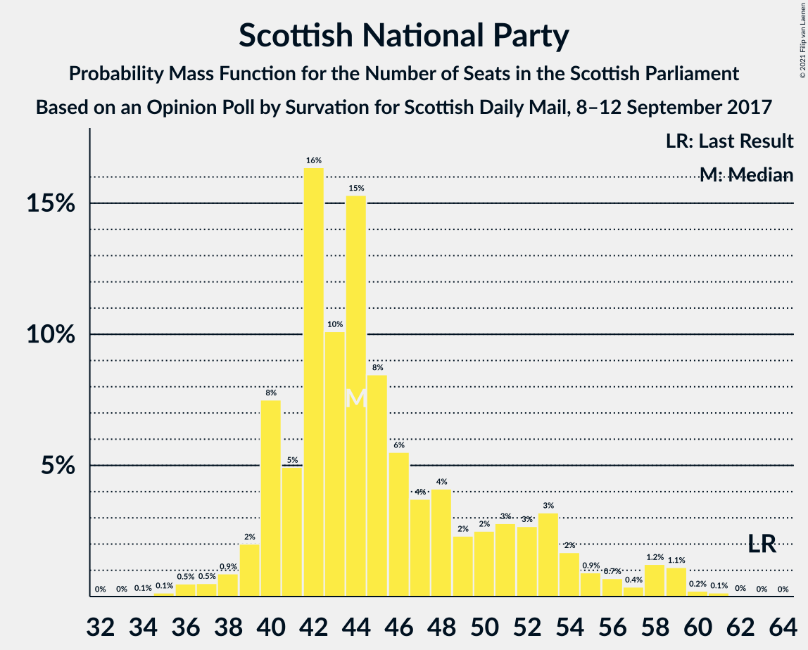
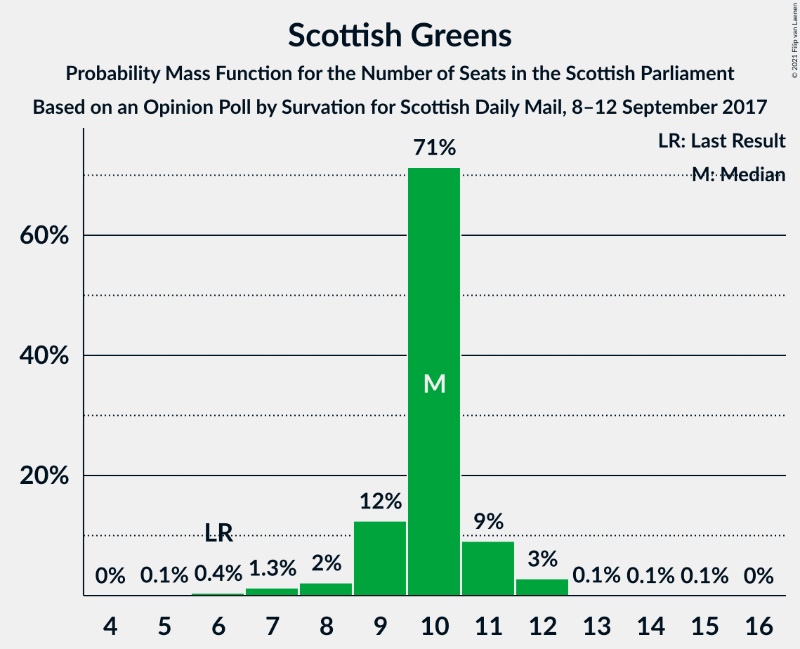
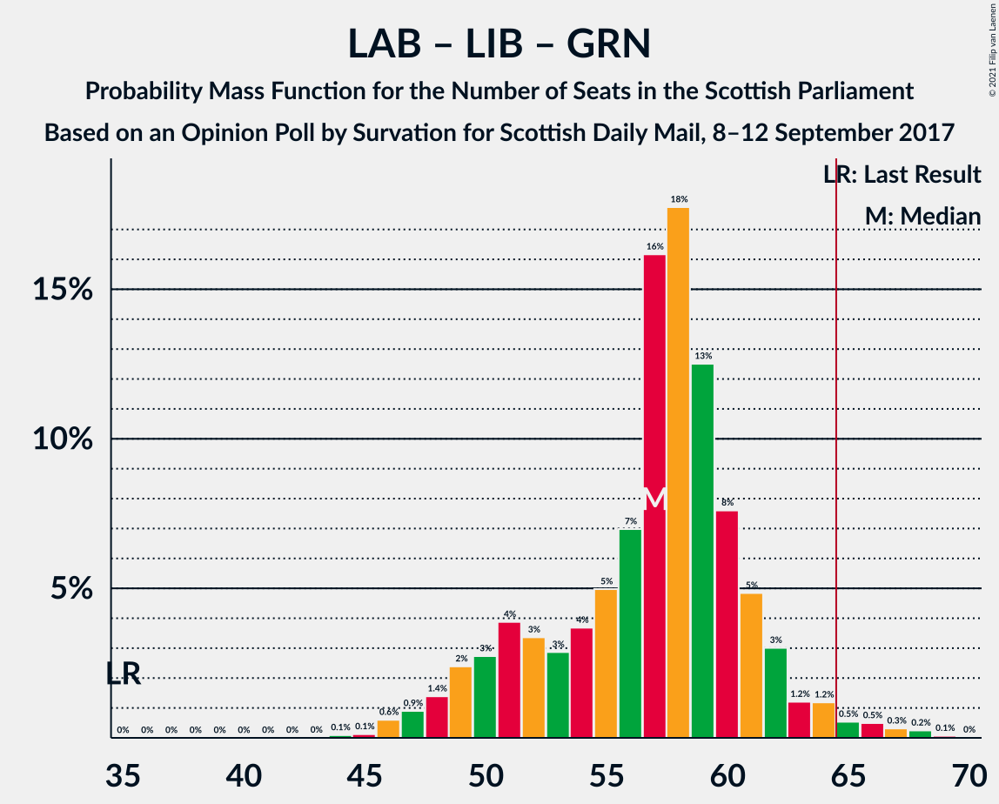

# Opinion Poll by Survation for Scottish Daily Mail, 8–12 September 2017

<a href="#voting-intentions">Voting Intentions</a> | <a href="#seats">Seats</a> | <a href="#coalitions">Coalitions</a> | <a href="#technical-information">Technical Information</a>

## Voting Intentions

### Confidence Intervals

| Party | Last Result | Poll Result | 80% Confidence Interval | 90% Confidence Interval | 95% Confidence Interval | 99% Confidence Interval |
|:-----:|:-----------:|:-----------:|:-----------------------:|:-----------------------:|:-----------------------:|:-----------------------:|
| Scottish National Party | 41.7% | 31.2% | 29.4–33.1% |28.9–33.7% |28.4–34.1% |27.6–35.1% |
| Scottish Labour | 19.1% | 25.2% | 23.5–27.0% |23.0–27.5% |22.6–28.0% |21.8–28.9% |
| Scottish Conservative & Unionist Party | 22.9% | 21.2% | 19.6–22.9% |19.1–23.4% |18.8–23.8% |18.0–24.6% |
| Scottish Liberal Democrats | 5.2% | 10.0% | 8.9–11.4% |8.6–11.7% |8.3–12.1% |7.8–12.7% |
| Scottish Greens | 6.6% | 9.1% | 8.0–10.3% |7.7–10.7% |7.4–11.0% |7.0–11.6% |
| UK Independence Party | 2.0% | 3.1% | 2.5–3.9% |2.3–4.1% |2.1–4.3% |1.9–4.7% |

*Note:* The poll result column reflects the actual value used in the calculations. Published results may vary slightly, and in addition be rounded to fewer digits.

## Seats

### Confidence Intervals

| Party | Last Result | Median | 80% Confidence Interval | 90% Confidence Interval | 95% Confidence Interval | 99% Confidence Interval |
|:-----:|:-----------:|:------:|:-----------------------:|:-----------------------:|:-----------------------:|:-----------------------:|
| <a href="#scottish-national-party">Scottish National Party</a> | 63 | 44 | 40–52 |40–54 |39–58 |36–59 |
| <a href="#scottish-labour">Scottish Labour</a> | 24 | 35 | 30–39 |29–40 |28–42 |27–46 |
| <a href="#scottish-conservative-&-unionist-party">Scottish Conservative & Unionist Party</a> | 31 | 27 | 24–30 |23–30 |22–31 |21–32 |
| <a href="#scottish-liberal-democrats">Scottish Liberal Democrats</a> | 5 | 12 | 11–13 |10–14 |10–14 |8–15 |
| <a href="#scottish-greens">Scottish Greens</a> | 6 | 10 | 9–11 |9–11 |8–12 |6–12 |
| <a href="#uk-independence-party">UK Independence Party</a> | 0 | 0 | 0 |0 |0 |0–1 |

### Scottish National Party

*For a full overview of the results for this party, see the [Scottish National Party](party-scottishnationalparty.html) page.*

| Number of Seats | Probability | Accumulated | Special Marks |
|:---------------:|:-----------:|:-----------:|:-------------:|
| 34 | 0.1% | 100% |  |
| 35 | 0.1% | 99.9% |  |
| 36 | 0.5% | 99.8% |  |
| 37 | 0.5% | 99.3% |  |
| 38 | 0.9% | 98.8% |  |
| 39 | 2% | 98% |  |
| 40 | 8% | 96% |  |
| 41 | 5% | 88% |  |
| 42 | 16% | 83% |  |
| 43 | 10% | 67% |  |
| 44 | 15% | 57% | Median |
| 45 | 8% | 42% |  |
| 46 | 6% | 33% |  |
| 47 | 4% | 28% |  |
| 48 | 4% | 24% |  |
| 49 | 2% | 20% |  |
| 50 | 2% | 18% |  |
| 51 | 3% | 15% |  |
| 52 | 3% | 12% |  |
| 53 | 3% | 10% |  |
| 54 | 2% | 6% |  |
| 55 | 0.9% | 5% |  |
| 56 | 0.7% | 4% |  |
| 57 | 0.4% | 3% |  |
| 58 | 1.2% | 3% |  |
| 59 | 1.1% | 2% |  |
| 60 | 0.2% | 0.4% |  |
| 61 | 0.1% | 0.2% |  |
| 62 | 0% | 0.1% |  |
| 63 | 0% | 0% | Last Result |

### Scottish Labour

*For a full overview of the results for this party, see the [Scottish Labour](party-scottishlabour.html) page.*

| Number of Seats | Probability | Accumulated | Special Marks |
|:---------------:|:-----------:|:-----------:|:-------------:|
| 24 | 0% | 100% | Last Result |
| 25 | 0.1% | 100% |  |
| 26 | 0.3% | 99.9% |  |
| 27 | 1.2% | 99.6% |  |
| 28 | 3% | 98% |  |
| 29 | 4% | 95% |  |
| 30 | 5% | 92% |  |
| 31 | 4% | 87% |  |
| 32 | 6% | 82% |  |
| 33 | 9% | 77% |  |
| 34 | 11% | 67% |  |
| 35 | 9% | 56% | Median |
| 36 | 10% | 47% |  |
| 37 | 15% | 37% |  |
| 38 | 10% | 22% |  |
| 39 | 4% | 12% |  |
| 40 | 4% | 8% |  |
| 41 | 1.0% | 4% |  |
| 42 | 0.9% | 3% |  |
| 43 | 0.7% | 2% |  |
| 44 | 0.3% | 1.3% |  |
| 45 | 0.4% | 1.0% |  |
| 46 | 0.5% | 0.6% |  |
| 47 | 0.1% | 0.1% |  |
| 48 | 0% | 0% |  |

### Scottish Conservative & Unionist Party

*For a full overview of the results for this party, see the [Scottish Conservative & Unionist Party](party-scottishconservativeunionistparty.html) page.*

| Number of Seats | Probability | Accumulated | Special Marks |
|:---------------:|:-----------:|:-----------:|:-------------:|
| 18 | 0% | 100% |  |
| 19 | 0% | 99.9% |  |
| 20 | 0.3% | 99.9% |  |
| 21 | 0.9% | 99.6% |  |
| 22 | 2% | 98.7% |  |
| 23 | 6% | 97% |  |
| 24 | 6% | 91% |  |
| 25 | 8% | 85% |  |
| 26 | 17% | 77% |  |
| 27 | 18% | 60% | Median |
| 28 | 13% | 43% |  |
| 29 | 12% | 30% |  |
| 30 | 13% | 18% |  |
| 31 | 4% | 4% | Last Result |
| 32 | 0.4% | 0.6% |  |
| 33 | 0.2% | 0.3% |  |
| 34 | 0% | 0% |  |

### Scottish Liberal Democrats

*For a full overview of the results for this party, see the [Scottish Liberal Democrats](party-scottishliberaldemocrats.html) page.*

| Number of Seats | Probability | Accumulated | Special Marks |
|:---------------:|:-----------:|:-----------:|:-------------:|
| 5 | 0% | 100% | Last Result |
| 6 | 0% | 100% |  |
| 7 | 0.2% | 100% |  |
| 8 | 0.6% | 99.7% |  |
| 9 | 1.5% | 99.1% |  |
| 10 | 4% | 98% |  |
| 11 | 19% | 94% |  |
| 12 | 52% | 75% | Median |
| 13 | 17% | 24% |  |
| 14 | 5% | 6% |  |
| 15 | 1.1% | 1.4% |  |
| 16 | 0.2% | 0.3% |  |
| 17 | 0.1% | 0.1% |  |
| 18 | 0% | 0% |  |

### Scottish Greens

*For a full overview of the results for this party, see the [Scottish Greens](party-scottishgreens.html) page.*

| Number of Seats | Probability | Accumulated | Special Marks |
|:---------------:|:-----------:|:-----------:|:-------------:|
| 5 | 0.1% | 100% |  |
| 6 | 0.4% | 99.8% | Last Result |
| 7 | 1.3% | 99.4% |  |
| 8 | 2% | 98% |  |
| 9 | 12% | 96% |  |
| 10 | 71% | 84% | Median |
| 11 | 9% | 12% |  |
| 12 | 3% | 3% |  |
| 13 | 0.1% | 0.3% |  |
| 14 | 0.1% | 0.1% |  |
| 15 | 0.1% | 0.1% |  |
| 16 | 0% | 0% |  |

### UK Independence Party

*For a full overview of the results for this party, see the [UK Independence Party](party-ukindependenceparty.html) page.*

| Number of Seats | Probability | Accumulated | Special Marks |
|:---------------:|:-----------:|:-----------:|:-------------:|
| 0 | 99.0% | 100% | Last Result, Median |
| 1 | 0.8% | 1.0% |  |
| 2 | 0.1% | 0.3% |  |
| 3 | 0.1% | 0.1% |  |
| 4 | 0% | 0.1% |  |
| 5 | 0% | 0% |  |

## Coalitions

### Confidence Intervals

| Coalition | Last Result | Median | Majority? | 80% Confidence Interval | 90% Confidence Interval | 95% Confidence Interval | 99% Confidence Interval |
|:---------:|:-----------:|:------:|:---------:|:-----------------------:|:-----------------------:|:-----------------------:|:-----------------------:|
| Scottish Labour – Scottish Conservative & Unionist Party – Scottish Liberal Democrats | 60 | 75 | 96% | 67–79 | 65–80 | 63–81 | 60–84 |
| Scottish Labour – Scottish Conservative & Unionist Party | 55 | 63 | 26% | 55–67 | 54–68 | 52–68 | 50–72 |
| Scottish National Party – Scottish Greens | 69 | 54 | 4% | 50–62 | 49–64 | 48–66 | 45–69 |
| Scottish Labour – Scottish Liberal Democrats – Scottish Greens | 35 | 57 | 2% | 51–61 | 49–62 | 48–64 | 46–67 |
| Scottish National Party | 63 | 44 | 0% | 40–52 | 40–54 | 39–58 | 36–59 |
| Scottish Labour – Scottish Liberal Democrats | 29 | 47 | 0% | 41–51 | 40–52 | 39–54 | 36–58 |
| Scottish Conservative & Unionist Party – Scottish Liberal Democrats | 36 | 39 | 0% | 35–43 | 34–43 | 33–44 | 31–45 |

### Scottish Labour – Scottish Conservative & Unionist Party – Scottish Liberal Democrats

| Number of Seats | Probability | Accumulated | Special Marks |
|:---------------:|:-----------:|:-----------:|:-------------:|
| 58 | 0.1% | 100% |  |
| 59 | 0.2% | 99.9% |  |
| 60 | 0.6% | 99.8% | Last Result |
| 61 | 1.3% | 99.2% |  |
| 62 | 0.3% | 98% |  |
| 63 | 0.9% | 98% |  |
| 64 | 0.9% | 97% |  |
| 65 | 2% | 96% | Majority |
| 66 | 3% | 94% |  |
| 67 | 3% | 91% |  |
| 68 | 3% | 88% |  |
| 69 | 3% | 85% |  |
| 70 | 3% | 83% |  |
| 71 | 5% | 80% |  |
| 72 | 5% | 76% |  |
| 73 | 5% | 71% |  |
| 74 | 9% | 65% | Median |
| 75 | 13% | 56% |  |
| 76 | 12% | 43% |  |
| 77 | 12% | 31% |  |
| 78 | 6% | 19% |  |
| 79 | 7% | 13% |  |
| 80 | 4% | 6% |  |
| 81 | 0.9% | 3% |  |
| 82 | 0.7% | 2% |  |
| 83 | 0.4% | 1.0% |  |
| 84 | 0.2% | 0.6% |  |
| 85 | 0.3% | 0.3% |  |
| 86 | 0% | 0.1% |  |
| 87 | 0% | 0% |  |

### Scottish Labour – Scottish Conservative & Unionist Party

| Number of Seats | Probability | Accumulated | Special Marks |
|:---------------:|:-----------:|:-----------:|:-------------:|
| 48 | 0.1% | 100% |  |
| 49 | 0.2% | 99.8% |  |
| 50 | 0.8% | 99.7% |  |
| 51 | 1.1% | 98.8% |  |
| 52 | 1.1% | 98% |  |
| 53 | 1.2% | 97% |  |
| 54 | 2% | 95% |  |
| 55 | 3% | 93% | Last Result |
| 56 | 3% | 90% |  |
| 57 | 2% | 86% |  |
| 58 | 4% | 84% |  |
| 59 | 3% | 80% |  |
| 60 | 7% | 76% |  |
| 61 | 6% | 70% |  |
| 62 | 7% | 64% | Median |
| 63 | 16% | 57% |  |
| 64 | 14% | 40% |  |
| 65 | 8% | 26% | Majority |
| 66 | 5% | 18% |  |
| 67 | 7% | 13% |  |
| 68 | 4% | 6% |  |
| 69 | 0.7% | 2% |  |
| 70 | 0.5% | 1.5% |  |
| 71 | 0.4% | 1.0% |  |
| 72 | 0.2% | 0.6% |  |
| 73 | 0.3% | 0.3% |  |
| 74 | 0% | 0.1% |  |
| 75 | 0% | 0% |  |

### Scottish National Party – Scottish Greens

| Number of Seats | Probability | Accumulated | Special Marks |
|:---------------:|:-----------:|:-----------:|:-------------:|
| 43 | 0% | 100% |  |
| 44 | 0.3% | 99.9% |  |
| 45 | 0.2% | 99.7% |  |
| 46 | 0.4% | 99.4% |  |
| 47 | 0.7% | 99.0% |  |
| 48 | 0.9% | 98% |  |
| 49 | 4% | 97% |  |
| 50 | 7% | 94% |  |
| 51 | 6% | 87% |  |
| 52 | 13% | 81% |  |
| 53 | 12% | 68% |  |
| 54 | 13% | 57% | Median |
| 55 | 9% | 44% |  |
| 56 | 5% | 35% |  |
| 57 | 5% | 29% |  |
| 58 | 5% | 24% |  |
| 59 | 3% | 20% |  |
| 60 | 3% | 17% |  |
| 61 | 3% | 15% |  |
| 62 | 3% | 12% |  |
| 63 | 3% | 9% |  |
| 64 | 2% | 6% |  |
| 65 | 0.9% | 4% | Majority |
| 66 | 0.9% | 3% |  |
| 67 | 0.3% | 2% |  |
| 68 | 1.3% | 2% |  |
| 69 | 0.6% | 0.8% | Last Result |
| 70 | 0.2% | 0.2% |  |
| 71 | 0.1% | 0.1% |  |
| 72 | 0% | 0% |  |

### Scottish Labour – Scottish Liberal Democrats – Scottish Greens

| Number of Seats | Probability | Accumulated | Special Marks |
|:---------------:|:-----------:|:-----------:|:-------------:|
| 35 | 0% | 100% | Last Result |
| 36 | 0% | 100% |  |
| 37 | 0% | 100% |  |
| 38 | 0% | 100% |  |
| 39 | 0% | 100% |  |
| 40 | 0% | 100% |  |
| 41 | 0% | 100% |  |
| 42 | 0% | 100% |  |
| 43 | 0% | 100% |  |
| 44 | 0.1% | 100% |  |
| 45 | 0.1% | 99.9% |  |
| 46 | 0.6% | 99.8% |  |
| 47 | 0.9% | 99.2% |  |
| 48 | 1.4% | 98% |  |
| 49 | 2% | 97% |  |
| 50 | 3% | 94% |  |
| 51 | 4% | 92% |  |
| 52 | 3% | 88% |  |
| 53 | 3% | 84% |  |
| 54 | 4% | 82% |  |
| 55 | 5% | 78% |  |
| 56 | 7% | 73% |  |
| 57 | 16% | 66% | Median |
| 58 | 18% | 50% |  |
| 59 | 13% | 32% |  |
| 60 | 8% | 20% |  |
| 61 | 5% | 12% |  |
| 62 | 3% | 7% |  |
| 63 | 1.2% | 4% |  |
| 64 | 1.2% | 3% |  |
| 65 | 0.5% | 2% | Majority |
| 66 | 0.5% | 1.2% |  |
| 67 | 0.3% | 0.7% |  |
| 68 | 0.2% | 0.4% |  |
| 69 | 0.1% | 0.1% |  |
| 70 | 0% | 0% |  |

### Scottish National Party

| Number of Seats | Probability | Accumulated | Special Marks |
|:---------------:|:-----------:|:-----------:|:-------------:|
| 34 | 0.1% | 100% |  |
| 35 | 0.1% | 99.9% |  |
| 36 | 0.5% | 99.8% |  |
| 37 | 0.5% | 99.3% |  |
| 38 | 0.9% | 98.8% |  |
| 39 | 2% | 98% |  |
| 40 | 8% | 96% |  |
| 41 | 5% | 88% |  |
| 42 | 16% | 83% |  |
| 43 | 10% | 67% |  |
| 44 | 15% | 57% | Median |
| 45 | 8% | 42% |  |
| 46 | 6% | 33% |  |
| 47 | 4% | 28% |  |
| 48 | 4% | 24% |  |
| 49 | 2% | 20% |  |
| 50 | 2% | 18% |  |
| 51 | 3% | 15% |  |
| 52 | 3% | 12% |  |
| 53 | 3% | 10% |  |
| 54 | 2% | 6% |  |
| 55 | 0.9% | 5% |  |
| 56 | 0.7% | 4% |  |
| 57 | 0.4% | 3% |  |
| 58 | 1.2% | 3% |  |
| 59 | 1.1% | 2% |  |
| 60 | 0.2% | 0.4% |  |
| 61 | 0.1% | 0.2% |  |
| 62 | 0% | 0.1% |  |
| 63 | 0% | 0% | Last Result |

### Scottish Labour – Scottish Liberal Democrats

| Number of Seats | Probability | Accumulated | Special Marks |
|:---------------:|:-----------:|:-----------:|:-------------:|
| 29 | 0% | 100% | Last Result |
| 30 | 0% | 100% |  |
| 31 | 0% | 100% |  |
| 32 | 0% | 100% |  |
| 33 | 0% | 100% |  |
| 34 | 0% | 100% |  |
| 35 | 0% | 100% |  |
| 36 | 0.5% | 99.9% |  |
| 37 | 0.5% | 99.4% |  |
| 38 | 1.1% | 98.9% |  |
| 39 | 2% | 98% |  |
| 40 | 3% | 96% |  |
| 41 | 4% | 93% |  |
| 42 | 4% | 89% |  |
| 43 | 3% | 85% |  |
| 44 | 4% | 82% |  |
| 45 | 6% | 78% |  |
| 46 | 8% | 71% |  |
| 47 | 16% | 63% | Median |
| 48 | 13% | 47% |  |
| 49 | 12% | 34% |  |
| 50 | 8% | 22% |  |
| 51 | 4% | 13% |  |
| 52 | 4% | 9% |  |
| 53 | 1.4% | 5% |  |
| 54 | 1.0% | 3% |  |
| 55 | 0.7% | 2% |  |
| 56 | 0.4% | 1.4% |  |
| 57 | 0.4% | 1.0% |  |
| 58 | 0.5% | 0.6% |  |
| 59 | 0.1% | 0.1% |  |
| 60 | 0% | 0% |  |

### Scottish Conservative & Unionist Party – Scottish Liberal Democrats

| Number of Seats | Probability | Accumulated | Special Marks |
|:---------------:|:-----------:|:-----------:|:-------------:|
| 28 | 0.1% | 100% |  |
| 29 | 0.1% | 99.9% |  |
| 30 | 0.1% | 99.9% |  |
| 31 | 0.4% | 99.7% |  |
| 32 | 0.5% | 99.4% |  |
| 33 | 3% | 98.9% |  |
| 34 | 3% | 96% |  |
| 35 | 4% | 93% |  |
| 36 | 7% | 89% | Last Result |
| 37 | 10% | 82% |  |
| 38 | 15% | 73% |  |
| 39 | 12% | 57% | Median |
| 40 | 13% | 45% |  |
| 41 | 12% | 32% |  |
| 42 | 10% | 20% |  |
| 43 | 6% | 10% |  |
| 44 | 3% | 4% |  |
| 45 | 0.9% | 1.2% |  |
| 46 | 0.2% | 0.3% |  |
| 47 | 0.1% | 0.1% |  |
| 48 | 0% | 0% |  |

## Technical Information

### Opinion Poll

+ **Polling firm:** Survation
+ **Commissioner(s):** Scottish Daily Mail
+ **Fieldwork period:** 8–12 September 2017

### Calculations

+ **Sample size:** 1016
+ **Simulations done:** 1,048,576
+ **Error estimate:** 1.43%

