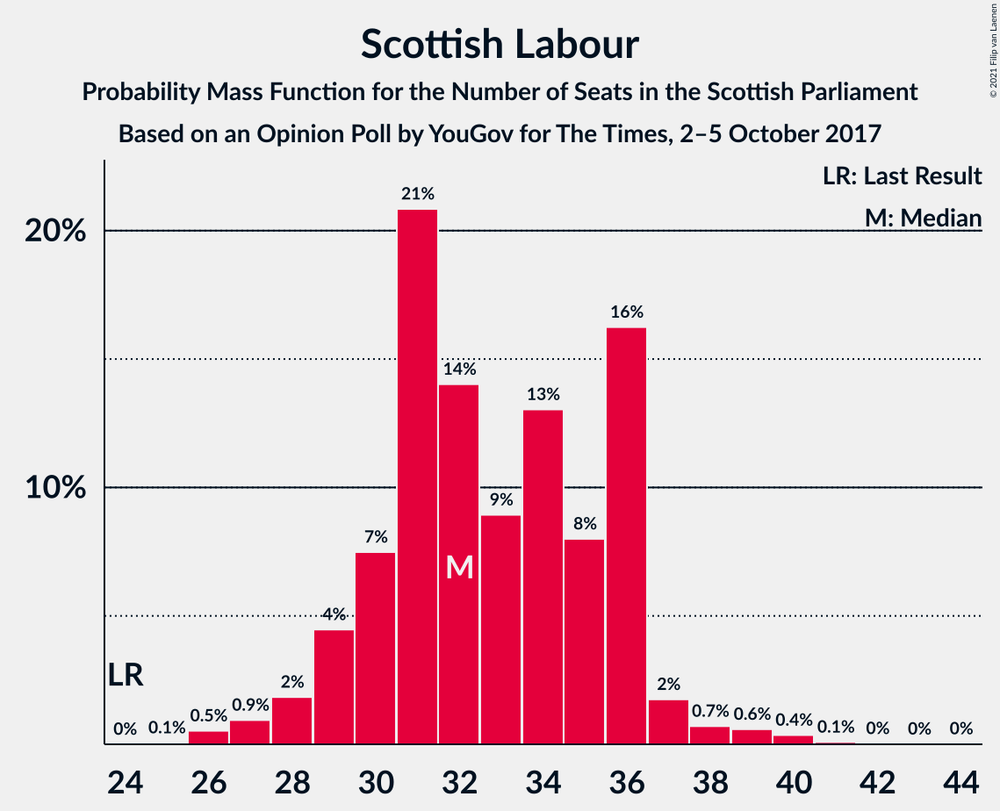
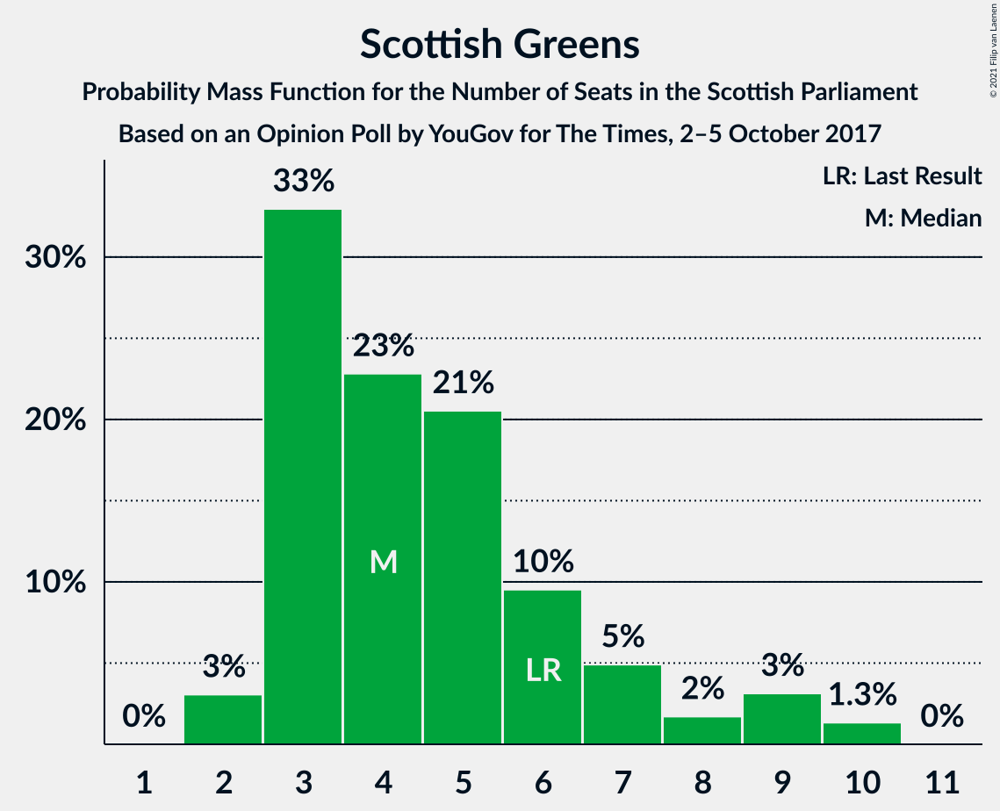
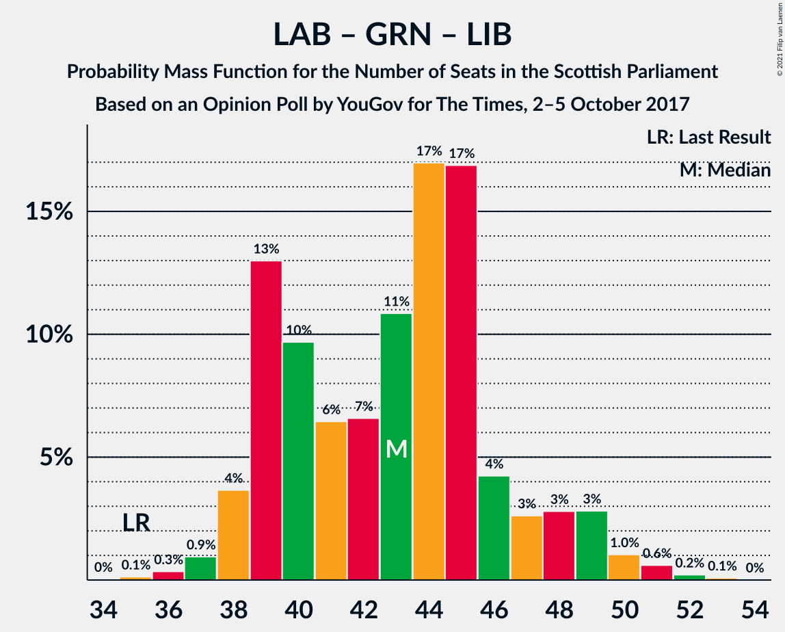

# Opinion Poll by YouGov for The Times, 2–5 October 2017

<a href="#voting-intentions">Voting Intentions</a> | <a href="#seats">Seats</a> | <a href="#coalitions">Coalitions</a> | <a href="#technical-information">Technical Information</a>

## Voting Intentions

### Confidence Intervals

| Party | Last Result | Poll Result | 80% Confidence Interval | 90% Confidence Interval | 95% Confidence Interval | 99% Confidence Interval |
|:-----:|:-----------:|:-----------:|:-----------------------:|:-----------------------:|:-----------------------:|:-----------------------:|
| Scottish National Party | 41.7% | 35.6% | 33.8–37.4% |33.3–38.0% |32.9–38.4% |32.0–39.3% |
| Scottish Labour | 19.1% | 24.4% | 22.8–26.1% |22.4–26.6% |22.0–27.0% |21.2–27.8% |
| Scottish Conservative & Unionist Party | 22.9% | 23.4% | 21.9–25.1% |21.4–25.6% |21.1–26.0% |20.3–26.8% |
| Scottish Greens | 6.6% | 6.1% | 5.3–7.1% |5.0–7.4% |4.8–7.6% |4.5–8.1% |
| Scottish Liberal Democrats | 5.2% | 6.1% | 5.3–7.1% |5.0–7.4% |4.8–7.6% |4.5–8.1% |
| Scottish Socialist Party | 0.5% | 3.1% | 2.5–3.9% |2.3–4.1% |2.2–4.3% |2.0–4.7% |
| UK Independence Party | 2.0% | 1.1% | 0.8–1.6% |0.7–1.7% |0.6–1.8% |0.5–2.1% |

*Note:* The poll result column reflects the actual value used in the calculations. Published results may vary slightly, and in addition be rounded to fewer digits.

## Seats

### Confidence Intervals

| Party | Last Result | Median | 80% Confidence Interval | 90% Confidence Interval | 95% Confidence Interval | 99% Confidence Interval |
|:-----:|:-----------:|:------:|:-----------------------:|:-----------------------:|:-----------------------:|:-----------------------:|
| <a href="#scottish-national-party">Scottish National Party</a> | 63 | 59 | 54–61 |53–61 |51–63 |50–63 |
| <a href="#scottish-labour">Scottish Labour</a> | 24 | 31 | 30–33 |29–34 |28–36 |27–38 |
| <a href="#scottish-conservative-&-unionist-party">Scottish Conservative & Unionist Party</a> | 31 | 31 | 27–33 |27–34 |26–34 |24–35 |
| <a href="#scottish-greens">Scottish Greens</a> | 6 | 3 | 3–5 |3–7 |3–9 |2–9 |
| <a href="#scottish-liberal-democrats">Scottish Liberal Democrats</a> | 5 | 5 | 5–6 |4–6 |4–8 |4–9 |
| <a href="#scottish-socialist-party">Scottish Socialist Party</a> | 0 | 0 | 0 |0 |0 |0 |
| <a href="#uk-independence-party">UK Independence Party</a> | 0 | 0 | 0 |0 |0 |0 |

### Scottish National Party

*For a full overview of the results for this party, see the [Scottish National Party](party-scottishnationalparty.html) page.*

| Number of Seats | Probability | Accumulated | Special Marks |
|:---------------:|:-----------:|:-----------:|:-------------:|
| 46 | 0% | 100% |  |
| 47 | 0% | 99.9% |  |
| 48 | 0.1% | 99.9% |  |
| 49 | 0.1% | 99.9% |  |
| 50 | 1.5% | 99.7% |  |
| 51 | 3% | 98% |  |
| 52 | 0.7% | 96% |  |
| 53 | 3% | 95% |  |
| 54 | 6% | 92% |  |
| 55 | 5% | 86% |  |
| 56 | 9% | 81% |  |
| 57 | 11% | 72% |  |
| 58 | 7% | 61% |  |
| 59 | 21% | 54% | Median |
| 60 | 13% | 33% |  |
| 61 | 16% | 21% |  |
| 62 | 1.0% | 4% |  |
| 63 | 3% | 3% | Last Result |
| 64 | 0.3% | 0.3% |  |
| 65 | 0% | 0% | Majority |

### Scottish Labour

*For a full overview of the results for this party, see the [Scottish Labour](party-scottishlabour.html) page.*

| Number of Seats | Probability | Accumulated | Special Marks |
|:---------------:|:-----------:|:-----------:|:-------------:|
| 24 | 0% | 100% | Last Result |
| 25 | 0.2% | 100% |  |
| 26 | 0.1% | 99.8% |  |
| 27 | 1.1% | 99.7% |  |
| 28 | 2% | 98.6% |  |
| 29 | 5% | 97% |  |
| 30 | 21% | 92% |  |
| 31 | 27% | 71% | Median |
| 32 | 30% | 44% |  |
| 33 | 7% | 14% |  |
| 34 | 3% | 7% |  |
| 35 | 1.3% | 5% |  |
| 36 | 2% | 3% |  |
| 37 | 0.6% | 1.3% |  |
| 38 | 0.6% | 0.8% |  |
| 39 | 0.1% | 0.1% |  |
| 40 | 0% | 0% |  |

### Scottish Conservative & Unionist Party

*For a full overview of the results for this party, see the [Scottish Conservative & Unionist Party](party-scottishconservativeunionistparty.html) page.*

| Number of Seats | Probability | Accumulated | Special Marks |
|:---------------:|:-----------:|:-----------:|:-------------:|
| 24 | 0.6% | 100% |  |
| 25 | 1.3% | 99.4% |  |
| 26 | 2% | 98% |  |
| 27 | 7% | 96% |  |
| 28 | 6% | 89% |  |
| 29 | 17% | 83% |  |
| 30 | 5% | 66% |  |
| 31 | 27% | 61% | Last Result, Median |
| 32 | 18% | 34% |  |
| 33 | 11% | 16% |  |
| 34 | 4% | 5% |  |
| 35 | 1.1% | 1.4% |  |
| 36 | 0.2% | 0.3% |  |
| 37 | 0% | 0% |  |

### Scottish Greens

*For a full overview of the results for this party, see the [Scottish Greens](party-scottishgreens.html) page.*

| Number of Seats | Probability | Accumulated | Special Marks |
|:---------------:|:-----------:|:-----------:|:-------------:|
| 2 | 2% | 100% |  |
| 3 | 58% | 98% | Median |
| 4 | 25% | 41% |  |
| 5 | 6% | 16% |  |
| 6 | 3% | 10% | Last Result |
| 7 | 2% | 7% |  |
| 8 | 2% | 5% |  |
| 9 | 3% | 3% |  |
| 10 | 0.2% | 0.2% |  |
| 11 | 0% | 0% |  |

### Scottish Liberal Democrats

*For a full overview of the results for this party, see the [Scottish Liberal Democrats](party-scottishliberaldemocrats.html) page.*

| Number of Seats | Probability | Accumulated | Special Marks |
|:---------------:|:-----------:|:-----------:|:-------------:|
| 2 | 0.2% | 100% |  |
| 3 | 0.2% | 99.8% |  |
| 4 | 8% | 99.5% |  |
| 5 | 52% | 92% | Last Result, Median |
| 6 | 35% | 40% |  |
| 7 | 2% | 5% |  |
| 8 | 2% | 3% |  |
| 9 | 0.6% | 0.8% |  |
| 10 | 0.2% | 0.2% |  |
| 11 | 0% | 0% |  |

### Scottish Socialist Party

*For a full overview of the results for this party, see the [Scottish Socialist Party](party-scottishsocialistparty.html) page.*

| Number of Seats | Probability | Accumulated | Special Marks |
|:---------------:|:-----------:|:-----------:|:-------------:|
| 0 | 100% | 100% | Last Result, Median |

### UK Independence Party

*For a full overview of the results for this party, see the [UK Independence Party](party-ukindependenceparty.html) page.*

| Number of Seats | Probability | Accumulated | Special Marks |
|:---------------:|:-----------:|:-----------:|:-------------:|
| 0 | 100% | 100% | Last Result, Median |

## Coalitions

### Confidence Intervals

| Coalition | Last Result | Median | Majority? | 80% Confidence Interval | 90% Confidence Interval | 95% Confidence Interval | 99% Confidence Interval |
|:---------:|:-----------:|:------:|:---------:|:-----------------------:|:-----------------------:|:-----------------------:|:-----------------------:|
| Scottish Labour – Scottish Conservative & Unionist Party – Scottish Liberal Democrats | 60 | 67 | 91% | 65–71 | 63–73 | 62–74 | 60–76 |
| Scottish Labour – Scottish Conservative & Unionist Party | 55 | 62 | 13% | 59–65 | 58–67 | 57–68 | 55–70 |
| Scottish National Party – Scottish Greens | 69 | 62 | 9% | 58–64 | 56–66 | 55–67 | 53–69 |
| Scottish National Party | 63 | 59 | 0% | 54–61 | 53–61 | 51–63 | 50–63 |
| Scottish Labour – Scottish Greens – Scottish Liberal Democrats | 35 | 40 | 0% | 38–44 | 38–46 | 37–47 | 36–47 |
| Scottish Labour – Scottish Liberal Democrats | 29 | 36 | 0% | 34–39 | 34–41 | 33–42 | 32–43 |
| Scottish Conservative & Unionist Party – Scottish Liberal Democrats | 36 | 36 | 0% | 33–39 | 32–39 | 32–40 | 30–41 |

### Scottish Labour – Scottish Conservative & Unionist Party – Scottish Liberal Democrats

| Number of Seats | Probability | Accumulated | Special Marks |
|:---------------:|:-----------:|:-----------:|:-------------:|
| 57 | 0.1% | 100% |  |
| 58 | 0.1% | 99.9% |  |
| 59 | 0.1% | 99.8% |  |
| 60 | 0.4% | 99.6% | Last Result |
| 61 | 0.8% | 99.3% |  |
| 62 | 3% | 98.5% |  |
| 63 | 3% | 96% |  |
| 64 | 2% | 93% |  |
| 65 | 21% | 91% | Majority |
| 66 | 8% | 71% |  |
| 67 | 24% | 63% | Median |
| 68 | 13% | 38% |  |
| 69 | 11% | 26% |  |
| 70 | 2% | 14% |  |
| 71 | 3% | 13% |  |
| 72 | 4% | 9% |  |
| 73 | 1.0% | 5% |  |
| 74 | 3% | 4% |  |
| 75 | 1.0% | 2% |  |
| 76 | 0.6% | 0.7% |  |
| 77 | 0.1% | 0.1% |  |
| 78 | 0% | 0% |  |

### Scottish Labour – Scottish Conservative & Unionist Party

| Number of Seats | Probability | Accumulated | Special Marks |
|:---------------:|:-----------:|:-----------:|:-------------:|
| 53 | 0.2% | 100% |  |
| 54 | 0.2% | 99.8% |  |
| 55 | 0.2% | 99.6% | Last Result |
| 56 | 2% | 99.5% |  |
| 57 | 1.4% | 98% |  |
| 58 | 4% | 96% |  |
| 59 | 18% | 92% |  |
| 60 | 6% | 74% |  |
| 61 | 7% | 68% |  |
| 62 | 25% | 61% | Median |
| 63 | 10% | 36% |  |
| 64 | 13% | 26% |  |
| 65 | 4% | 13% | Majority |
| 66 | 4% | 9% |  |
| 67 | 1.3% | 5% |  |
| 68 | 2% | 4% |  |
| 69 | 0.4% | 2% |  |
| 70 | 1.0% | 1.1% |  |
| 71 | 0.1% | 0.2% |  |
| 72 | 0.1% | 0.1% |  |
| 73 | 0% | 0% |  |

### Scottish National Party – Scottish Greens

| Number of Seats | Probability | Accumulated | Special Marks |
|:---------------:|:-----------:|:-----------:|:-------------:|
| 52 | 0.1% | 100% |  |
| 53 | 0.6% | 99.9% |  |
| 54 | 1.0% | 99.3% |  |
| 55 | 3% | 98% |  |
| 56 | 1.0% | 96% |  |
| 57 | 4% | 95% |  |
| 58 | 3% | 91% |  |
| 59 | 2% | 87% |  |
| 60 | 11% | 86% |  |
| 61 | 13% | 74% |  |
| 62 | 24% | 62% | Median |
| 63 | 8% | 37% |  |
| 64 | 21% | 29% |  |
| 65 | 2% | 9% | Majority |
| 66 | 3% | 7% |  |
| 67 | 3% | 4% |  |
| 68 | 0.8% | 1.5% |  |
| 69 | 0.4% | 0.7% | Last Result |
| 70 | 0.1% | 0.4% |  |
| 71 | 0.1% | 0.2% |  |
| 72 | 0.1% | 0.1% |  |
| 73 | 0% | 0% |  |

### Scottish National Party

| Number of Seats | Probability | Accumulated | Special Marks |
|:---------------:|:-----------:|:-----------:|:-------------:|
| 46 | 0% | 100% |  |
| 47 | 0% | 99.9% |  |
| 48 | 0.1% | 99.9% |  |
| 49 | 0.1% | 99.9% |  |
| 50 | 1.5% | 99.7% |  |
| 51 | 3% | 98% |  |
| 52 | 0.7% | 96% |  |
| 53 | 3% | 95% |  |
| 54 | 6% | 92% |  |
| 55 | 5% | 86% |  |
| 56 | 9% | 81% |  |
| 57 | 11% | 72% |  |
| 58 | 7% | 61% |  |
| 59 | 21% | 54% | Median |
| 60 | 13% | 33% |  |
| 61 | 16% | 21% |  |
| 62 | 1.0% | 4% |  |
| 63 | 3% | 3% | Last Result |
| 64 | 0.3% | 0.3% |  |
| 65 | 0% | 0% | Majority |

### Scottish Labour – Scottish Greens – Scottish Liberal Democrats

| Number of Seats | Probability | Accumulated | Special Marks |
|:---------------:|:-----------:|:-----------:|:-------------:|
| 34 | 0.1% | 100% |  |
| 35 | 0.1% | 99.9% | Last Result |
| 36 | 0.4% | 99.8% |  |
| 37 | 3% | 99.4% |  |
| 38 | 7% | 96% |  |
| 39 | 26% | 89% | Median |
| 40 | 23% | 63% |  |
| 41 | 20% | 40% |  |
| 42 | 7% | 20% |  |
| 43 | 1.1% | 13% |  |
| 44 | 3% | 12% |  |
| 45 | 2% | 9% |  |
| 46 | 4% | 7% |  |
| 47 | 3% | 4% |  |
| 48 | 0.2% | 0.4% |  |
| 49 | 0.1% | 0.2% |  |
| 50 | 0% | 0.1% |  |
| 51 | 0% | 0% |  |

### Scottish Labour – Scottish Liberal Democrats

| Number of Seats | Probability | Accumulated | Special Marks |
|:---------------:|:-----------:|:-----------:|:-------------:|
| 29 | 0% | 100% | Last Result |
| 30 | 0.1% | 100% |  |
| 31 | 0.2% | 99.9% |  |
| 32 | 0.7% | 99.6% |  |
| 33 | 2% | 99.0% |  |
| 34 | 7% | 97% |  |
| 35 | 7% | 89% |  |
| 36 | 36% | 82% | Median |
| 37 | 17% | 46% |  |
| 38 | 16% | 29% |  |
| 39 | 5% | 13% |  |
| 40 | 2% | 7% |  |
| 41 | 2% | 5% |  |
| 42 | 2% | 4% |  |
| 43 | 1.3% | 2% |  |
| 44 | 0.2% | 0.3% |  |
| 45 | 0% | 0.1% |  |
| 46 | 0% | 0.1% |  |
| 47 | 0% | 0% |  |

### Scottish Conservative & Unionist Party – Scottish Liberal Democrats

| Number of Seats | Probability | Accumulated | Special Marks |
|:---------------:|:-----------:|:-----------:|:-------------:|
| 27 | 0.1% | 100% |  |
| 28 | 0.2% | 99.9% |  |
| 29 | 0.2% | 99.7% |  |
| 30 | 1.0% | 99.5% |  |
| 31 | 1.0% | 98.5% |  |
| 32 | 3% | 98% |  |
| 33 | 8% | 95% |  |
| 34 | 8% | 87% |  |
| 35 | 19% | 79% |  |
| 36 | 24% | 59% | Last Result, Median |
| 37 | 16% | 35% |  |
| 38 | 4% | 19% |  |
| 39 | 11% | 15% |  |
| 40 | 2% | 4% |  |
| 41 | 1.4% | 2% |  |
| 42 | 0.1% | 0.2% |  |
| 43 | 0% | 0.1% |  |
| 44 | 0% | 0% |  |

## Technical Information

### Opinion Poll

+ **Polling firm:** YouGov
+ **Commissioner(s):** The Times
+ **Fieldwork period:** 2–5 October 2017

### Calculations

+ **Sample size:** 1135
+ **Simulations done:** 131,072
+ **Error estimate:** 1.91%

