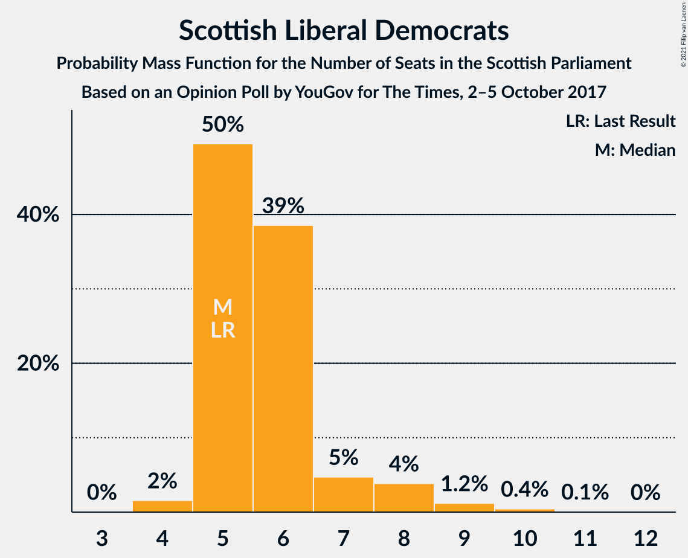
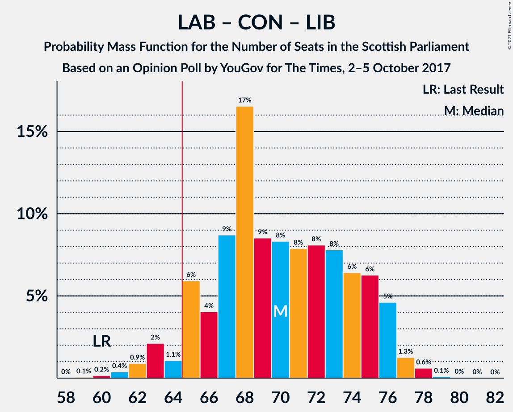

# Opinion Poll by YouGov for The Times, 2–5 October 2017

<a href="#voting-intentions">Voting Intentions</a> | <a href="#seats">Seats</a> | <a href="#coalitions">Coalitions</a> | <a href="#technical-information">Technical Information</a>

## Voting Intentions

### Confidence Intervals

| Party | Last Result | Poll Result | 80% Confidence Interval | 90% Confidence Interval | 95% Confidence Interval | 99% Confidence Interval |
|:-----:|:-----------:|:-----------:|:-----------------------:|:-----------------------:|:-----------------------:|:-----------------------:|
| Scottish National Party | 41.7% | 35.6% | 33.8–37.4% |33.3–38.0% |32.9–38.4% |32.0–39.3% |
| Scottish Labour | 19.1% | 24.4% | 22.8–26.1% |22.4–26.6% |22.0–27.0% |21.2–27.8% |
| Scottish Conservative & Unionist Party | 22.9% | 23.4% | 21.9–25.1% |21.4–25.6% |21.1–26.0% |20.3–26.8% |
| Scottish Greens | 6.6% | 6.1% | 5.3–7.1% |5.0–7.4% |4.8–7.6% |4.5–8.1% |
| Scottish Liberal Democrats | 5.2% | 6.1% | 5.3–7.1% |5.0–7.4% |4.8–7.6% |4.5–8.1% |
| Scottish Socialist Party | 0.5% | 3.1% | 2.5–3.9% |2.3–4.1% |2.2–4.3% |2.0–4.7% |
| UK Independence Party | 2.0% | 1.1% | 0.8–1.6% |0.7–1.7% |0.6–1.8% |0.5–2.1% |

*Note:* The poll result column reflects the actual value used in the calculations. Published results may vary slightly, and in addition be rounded to fewer digits.

## Seats

### Confidence Intervals

| Party | Last Result | Median | 80% Confidence Interval | 90% Confidence Interval | 95% Confidence Interval | 99% Confidence Interval |
|:-----:|:-----------:|:------:|:-----------------------:|:-----------------------:|:-----------------------:|:-----------------------:|
| <a href="#scottish-national-party">Scottish National Party</a> | 63 | 54 | 50–59 |48–60 |48–61 |46–63 |
| <a href="#scottish-labour">Scottish Labour</a> | 24 | 32 | 30–36 |29–36 |28–37 |26–40 |
| <a href="#scottish-conservative-&-unionist-party">Scottish Conservative & Unionist Party</a> | 31 | 32 | 29–34 |27–35 |27–35 |25–37 |
| <a href="#scottish-greens">Scottish Greens</a> | 6 | 4 | 3–7 |3–8 |2–9 |2–10 |
| <a href="#scottish-liberal-democrats">Scottish Liberal Democrats</a> | 5 | 5 | 5–7 |5–8 |5–8 |4–10 |
| <a href="#scottish-socialist-party">Scottish Socialist Party</a> | 0 | 0 | 0 |0 |0 |0 |
| <a href="#uk-independence-party">UK Independence Party</a> | 0 | 0 | 0 |0 |0 |0 |

### Scottish National Party

*For a full overview of the results for this party, see the [Scottish National Party](party-scottishnationalparty.html) page.*

| Number of Seats | Probability | Accumulated | Special Marks |
|:---------------:|:-----------:|:-----------:|:-------------:|
| 43 | 0% | 100% |  |
| 44 | 0% | 99.9% |  |
| 45 | 0.1% | 99.9% |  |
| 46 | 0.6% | 99.9% |  |
| 47 | 1.5% | 99.3% |  |
| 48 | 3% | 98% |  |
| 49 | 2% | 94% |  |
| 50 | 4% | 93% |  |
| 51 | 9% | 88% |  |
| 52 | 11% | 79% |  |
| 53 | 11% | 68% |  |
| 54 | 9% | 57% | Median |
| 55 | 12% | 49% |  |
| 56 | 4% | 37% |  |
| 57 | 6% | 33% |  |
| 58 | 11% | 28% |  |
| 59 | 6% | 16% |  |
| 60 | 6% | 10% |  |
| 61 | 3% | 4% |  |
| 62 | 0.3% | 1.0% |  |
| 63 | 0.6% | 0.6% | Last Result |
| 64 | 0% | 0.1% |  |
| 65 | 0% | 0% | Majority |

### Scottish Labour

*For a full overview of the results for this party, see the [Scottish Labour](party-scottishlabour.html) page.*

| Number of Seats | Probability | Accumulated | Special Marks |
|:---------------:|:-----------:|:-----------:|:-------------:|
| 24 | 0% | 100% | Last Result |
| 25 | 0.1% | 100% |  |
| 26 | 0.5% | 99.9% |  |
| 27 | 0.9% | 99.4% |  |
| 28 | 2% | 98% |  |
| 29 | 4% | 97% |  |
| 30 | 7% | 92% |  |
| 31 | 21% | 85% |  |
| 32 | 14% | 64% | Median |
| 33 | 9% | 50% |  |
| 34 | 13% | 41% |  |
| 35 | 8% | 28% |  |
| 36 | 16% | 20% |  |
| 37 | 2% | 4% |  |
| 38 | 0.7% | 2% |  |
| 39 | 0.6% | 1.1% |  |
| 40 | 0.4% | 0.5% |  |
| 41 | 0.1% | 0.2% |  |
| 42 | 0% | 0.1% |  |
| 43 | 0% | 0.1% |  |
| 44 | 0% | 0% |  |

### Scottish Conservative & Unionist Party

*For a full overview of the results for this party, see the [Scottish Conservative & Unionist Party](party-scottishconservativeunionistparty.html) page.*

| Number of Seats | Probability | Accumulated | Special Marks |
|:---------------:|:-----------:|:-----------:|:-------------:|
| 24 | 0.2% | 100% |  |
| 25 | 0.7% | 99.8% |  |
| 26 | 1.3% | 99.2% |  |
| 27 | 4% | 98% |  |
| 28 | 2% | 94% |  |
| 29 | 8% | 92% |  |
| 30 | 7% | 84% |  |
| 31 | 20% | 77% | Last Result |
| 32 | 27% | 56% | Median |
| 33 | 14% | 30% |  |
| 34 | 10% | 15% |  |
| 35 | 3% | 5% |  |
| 36 | 1.2% | 2% |  |
| 37 | 0.6% | 0.6% |  |
| 38 | 0% | 0% |  |

### Scottish Greens

*For a full overview of the results for this party, see the [Scottish Greens](party-scottishgreens.html) page.*

| Number of Seats | Probability | Accumulated | Special Marks |
|:---------------:|:-----------:|:-----------:|:-------------:|
| 2 | 3% | 100% |  |
| 3 | 33% | 97% |  |
| 4 | 23% | 64% | Median |
| 5 | 21% | 41% |  |
| 6 | 10% | 21% | Last Result |
| 7 | 5% | 11% |  |
| 8 | 2% | 6% |  |
| 9 | 3% | 4% |  |
| 10 | 1.3% | 1.3% |  |
| 11 | 0% | 0% |  |

### Scottish Liberal Democrats

*For a full overview of the results for this party, see the [Scottish Liberal Democrats](party-scottishliberaldemocrats.html) page.*

| Number of Seats | Probability | Accumulated | Special Marks |
|:---------------:|:-----------:|:-----------:|:-------------:|
| 3 | 0% | 100% |  |
| 4 | 2% | 99.9% |  |
| 5 | 50% | 98% | Last Result, Median |
| 6 | 39% | 49% |  |
| 7 | 5% | 10% |  |
| 8 | 4% | 6% |  |
| 9 | 1.2% | 2% |  |
| 10 | 0.4% | 0.5% |  |
| 11 | 0.1% | 0.1% |  |
| 12 | 0% | 0% |  |

### Scottish Socialist Party

*For a full overview of the results for this party, see the [Scottish Socialist Party](party-scottishsocialistparty.html) page.*

| Number of Seats | Probability | Accumulated | Special Marks |
|:---------------:|:-----------:|:-----------:|:-------------:|
| 0 | 100% | 100% | Last Result, Median |

### UK Independence Party

*For a full overview of the results for this party, see the [UK Independence Party](party-ukindependenceparty.html) page.*

| Number of Seats | Probability | Accumulated | Special Marks |
|:---------------:|:-----------:|:-----------:|:-------------:|
| 0 | 100% | 100% | Last Result, Median |

## Coalitions

### Confidence Intervals

| Coalition | Last Result | Median | Majority? | 80% Confidence Interval | 90% Confidence Interval | 95% Confidence Interval | 99% Confidence Interval |
|:---------:|:-----------:|:------:|:---------:|:-----------------------:|:-----------------------:|:-----------------------:|:-----------------------:|
| Scottish Labour – Scottish Conservative & Unionist Party – Scottish Liberal Democrats | 60 | 70 | 95% | 65–75 | 65–76 | 63–76 | 61–78 |
| Scottish Labour – Scottish Conservative & Unionist Party | 55 | 64 | 45% | 60–69 | 59–70 | 58–70 | 56–72 |
| Scottish National Party – Scottish Greens | 69 | 59 | 5% | 54–64 | 53–64 | 53–66 | 51–68 |
| Scottish National Party | 63 | 54 | 0% | 50–59 | 48–60 | 48–61 | 46–63 |
| Scottish Labour – Scottish Greens – Scottish Liberal Democrats | 35 | 43 | 0% | 39–47 | 38–48 | 38–49 | 36–51 |
| Scottish Labour – Scottish Liberal Democrats | 29 | 38 | 0% | 35–42 | 34–43 | 34–43 | 32–46 |
| Scottish Conservative & Unionist Party – Scottish Liberal Democrats | 36 | 37 | 0% | 35–40 | 33–41 | 32–41 | 31–43 |

### Scottish Labour – Scottish Conservative & Unionist Party – Scottish Liberal Democrats

| Number of Seats | Probability | Accumulated | Special Marks |
|:---------------:|:-----------:|:-----------:|:-------------:|
| 59 | 0.1% | 100% |  |
| 60 | 0.2% | 99.9% | Last Result |
| 61 | 0.4% | 99.7% |  |
| 62 | 0.9% | 99.3% |  |
| 63 | 2% | 98% |  |
| 64 | 1.1% | 96% |  |
| 65 | 6% | 95% | Majority |
| 66 | 4% | 89% |  |
| 67 | 9% | 85% |  |
| 68 | 17% | 77% |  |
| 69 | 9% | 60% | Median |
| 70 | 8% | 51% |  |
| 71 | 8% | 43% |  |
| 72 | 8% | 35% |  |
| 73 | 8% | 27% |  |
| 74 | 6% | 19% |  |
| 75 | 6% | 13% |  |
| 76 | 5% | 7% |  |
| 77 | 1.3% | 2% |  |
| 78 | 0.6% | 0.8% |  |
| 79 | 0.1% | 0.2% |  |
| 80 | 0% | 0.1% |  |
| 81 | 0% | 0% |  |

### Scottish Labour – Scottish Conservative & Unionist Party

| Number of Seats | Probability | Accumulated | Special Marks |
|:---------------:|:-----------:|:-----------:|:-------------:|
| 53 | 0% | 100% |  |
| 54 | 0.1% | 99.9% |  |
| 55 | 0.3% | 99.8% | Last Result |
| 56 | 0.5% | 99.5% |  |
| 57 | 1.4% | 99.0% |  |
| 58 | 2% | 98% |  |
| 59 | 4% | 95% |  |
| 60 | 4% | 91% |  |
| 61 | 5% | 87% |  |
| 62 | 11% | 82% |  |
| 63 | 16% | 70% |  |
| 64 | 9% | 55% | Median |
| 65 | 6% | 45% | Majority |
| 66 | 9% | 39% |  |
| 67 | 9% | 29% |  |
| 68 | 7% | 20% |  |
| 69 | 6% | 14% |  |
| 70 | 6% | 8% |  |
| 71 | 1.1% | 2% |  |
| 72 | 0.6% | 0.7% |  |
| 73 | 0.1% | 0.1% |  |
| 74 | 0% | 0.1% |  |
| 75 | 0% | 0% |  |

### Scottish National Party – Scottish Greens

| Number of Seats | Probability | Accumulated | Special Marks |
|:---------------:|:-----------:|:-----------:|:-------------:|
| 49 | 0% | 100% |  |
| 50 | 0.1% | 99.9% |  |
| 51 | 0.6% | 99.8% |  |
| 52 | 1.3% | 99.2% |  |
| 53 | 5% | 98% |  |
| 54 | 6% | 93% |  |
| 55 | 6% | 87% |  |
| 56 | 8% | 81% |  |
| 57 | 8% | 73% |  |
| 58 | 8% | 65% | Median |
| 59 | 8% | 57% |  |
| 60 | 9% | 49% |  |
| 61 | 17% | 40% |  |
| 62 | 9% | 23% |  |
| 63 | 4% | 15% |  |
| 64 | 6% | 11% |  |
| 65 | 1.1% | 5% | Majority |
| 66 | 2% | 4% |  |
| 67 | 0.9% | 2% |  |
| 68 | 0.4% | 0.7% |  |
| 69 | 0.2% | 0.3% | Last Result |
| 70 | 0.1% | 0.1% |  |
| 71 | 0% | 0% |  |

### Scottish National Party

| Number of Seats | Probability | Accumulated | Special Marks |
|:---------------:|:-----------:|:-----------:|:-------------:|
| 43 | 0% | 100% |  |
| 44 | 0% | 99.9% |  |
| 45 | 0.1% | 99.9% |  |
| 46 | 0.6% | 99.9% |  |
| 47 | 1.5% | 99.3% |  |
| 48 | 3% | 98% |  |
| 49 | 2% | 94% |  |
| 50 | 4% | 93% |  |
| 51 | 9% | 88% |  |
| 52 | 11% | 79% |  |
| 53 | 11% | 68% |  |
| 54 | 9% | 57% | Median |
| 55 | 12% | 49% |  |
| 56 | 4% | 37% |  |
| 57 | 6% | 33% |  |
| 58 | 11% | 28% |  |
| 59 | 6% | 16% |  |
| 60 | 6% | 10% |  |
| 61 | 3% | 4% |  |
| 62 | 0.3% | 1.0% |  |
| 63 | 0.6% | 0.6% | Last Result |
| 64 | 0% | 0.1% |  |
| 65 | 0% | 0% | Majority |

### Scottish Labour – Scottish Greens – Scottish Liberal Democrats

| Number of Seats | Probability | Accumulated | Special Marks |
|:---------------:|:-----------:|:-----------:|:-------------:|
| 35 | 0.1% | 100% | Last Result |
| 36 | 0.3% | 99.8% |  |
| 37 | 0.9% | 99.5% |  |
| 38 | 4% | 98.5% |  |
| 39 | 13% | 95% |  |
| 40 | 10% | 82% |  |
| 41 | 6% | 72% | Median |
| 42 | 7% | 66% |  |
| 43 | 11% | 59% |  |
| 44 | 17% | 48% |  |
| 45 | 17% | 31% |  |
| 46 | 4% | 14% |  |
| 47 | 3% | 10% |  |
| 48 | 3% | 8% |  |
| 49 | 3% | 5% |  |
| 50 | 1.0% | 2% |  |
| 51 | 0.6% | 0.9% |  |
| 52 | 0.2% | 0.3% |  |
| 53 | 0.1% | 0.1% |  |
| 54 | 0% | 0% |  |

### Scottish Labour – Scottish Liberal Democrats

| Number of Seats | Probability | Accumulated | Special Marks |
|:---------------:|:-----------:|:-----------:|:-------------:|
| 29 | 0% | 100% | Last Result |
| 30 | 0% | 100% |  |
| 31 | 0.3% | 100% |  |
| 32 | 0.7% | 99.7% |  |
| 33 | 1.1% | 99.0% |  |
| 34 | 4% | 98% |  |
| 35 | 6% | 94% |  |
| 36 | 18% | 88% |  |
| 37 | 10% | 70% | Median |
| 38 | 12% | 60% |  |
| 39 | 10% | 47% |  |
| 40 | 8% | 37% |  |
| 41 | 15% | 29% |  |
| 42 | 8% | 14% |  |
| 43 | 3% | 5% |  |
| 44 | 0.8% | 2% |  |
| 45 | 0.9% | 1.4% |  |
| 46 | 0.3% | 0.6% |  |
| 47 | 0.1% | 0.2% |  |
| 48 | 0% | 0.1% |  |
| 49 | 0% | 0.1% |  |
| 50 | 0% | 0% |  |

### Scottish Conservative & Unionist Party – Scottish Liberal Democrats

| Number of Seats | Probability | Accumulated | Special Marks |
|:---------------:|:-----------:|:-----------:|:-------------:|
| 29 | 0.1% | 100% |  |
| 30 | 0.3% | 99.9% |  |
| 31 | 0.7% | 99.6% |  |
| 32 | 2% | 98.9% |  |
| 33 | 3% | 97% |  |
| 34 | 4% | 94% |  |
| 35 | 7% | 90% |  |
| 36 | 17% | 83% | Last Result |
| 37 | 27% | 67% | Median |
| 38 | 14% | 40% |  |
| 39 | 11% | 26% |  |
| 40 | 8% | 15% |  |
| 41 | 5% | 7% |  |
| 42 | 2% | 2% |  |
| 43 | 0.5% | 0.6% |  |
| 44 | 0.1% | 0.1% |  |
| 45 | 0% | 0% |  |

## Technical Information

### Opinion Poll

+ **Polling firm:** YouGov
+ **Commissioner(s):** The Times
+ **Fieldwork period:** 2–5 October 2017

### Calculations

+ **Sample size:** 1135
+ **Simulations done:** 1,048,576
+ **Error estimate:** 0.98%

