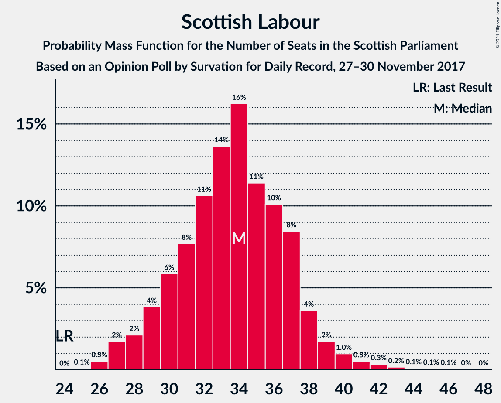
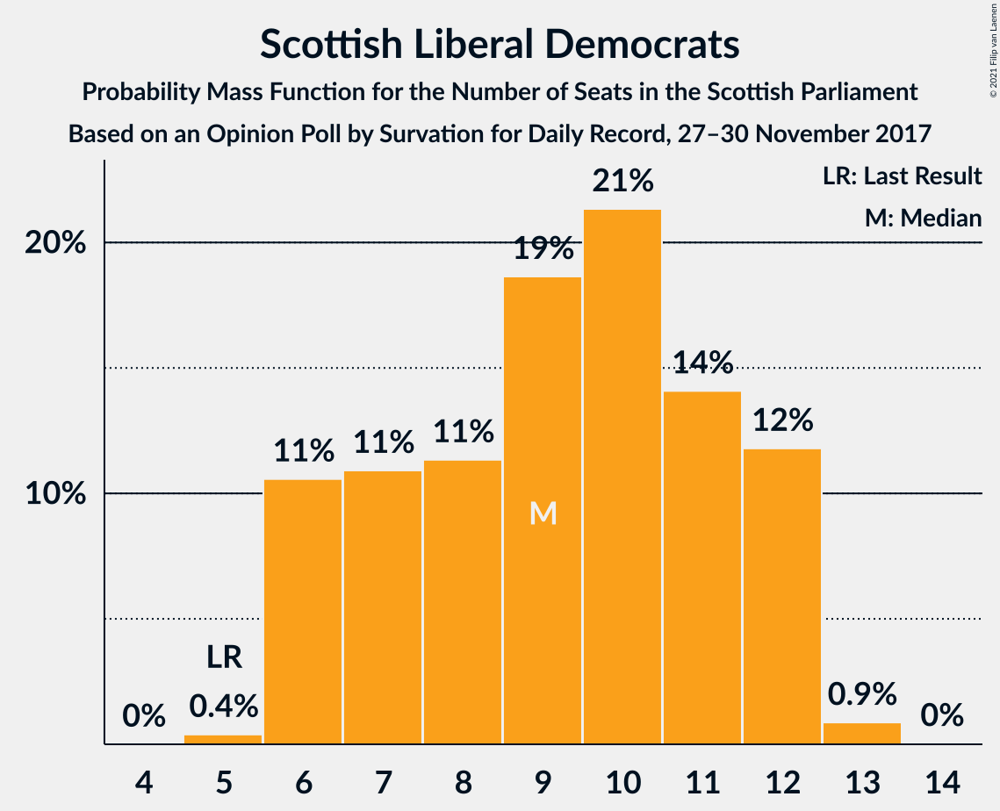
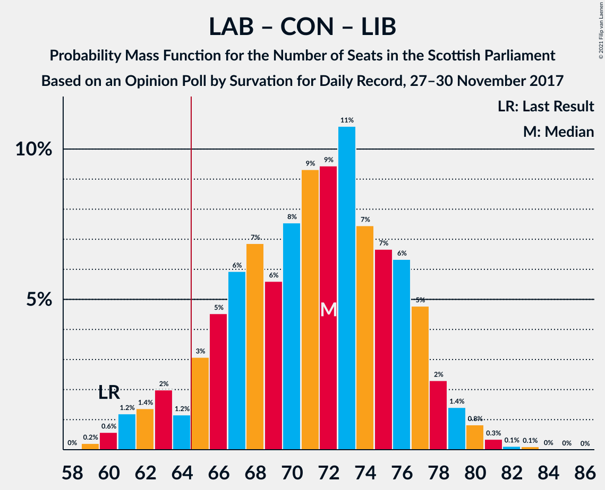

# Opinion Poll by Survation for Daily Record, 27–30 November 2017

<a href="#voting-intentions">Voting Intentions</a> | <a href="#seats">Seats</a> | <a href="#coalitions">Coalitions</a> | <a href="#technical-information">Technical Information</a>

## Voting Intentions

### Confidence Intervals

| Party | Last Result | Poll Result | 80% Confidence Interval | 90% Confidence Interval | 95% Confidence Interval | 99% Confidence Interval |
|:-----:|:-----------:|:-----------:|:-----------------------:|:-----------------------:|:-----------------------:|:-----------------------:|
| Scottish National Party | 41.7% | 33.2% | 31.4–35.2% |30.8–35.7% |30.4–36.2% |29.5–37.1% |
| Scottish Labour | 19.1% | 25.2% | 23.5–27.0% |23.0–27.5% |22.6–27.9% |21.8–28.8% |
| Scottish Conservative & Unionist Party | 22.9% | 22.1% | 20.5–23.9% |20.1–24.4% |19.7–24.8% |18.9–25.6% |
| Scottish Greens | 6.6% | 8.1% | 7.1–9.3% |6.8–9.6% |6.5–9.9% |6.1–10.5% |
| Scottish Liberal Democrats | 5.2% | 8.1% | 7.1–9.3% |6.8–9.6% |6.5–9.9% |6.1–10.5% |
| UK Independence Party | 2.0% | 3.0% | 2.5–3.9% |2.3–4.1% |2.1–4.3% |1.9–4.7% |

*Note:* The poll result column reflects the actual value used in the calculations. Published results may vary slightly, and in addition be rounded to fewer digits.

## Seats

### Confidence Intervals

| Party | Last Result | Median | 80% Confidence Interval | 90% Confidence Interval | 95% Confidence Interval | 99% Confidence Interval |
|:-----:|:-----------:|:------:|:-----------------------:|:-----------------------:|:-----------------------:|:-----------------------:|
| <a href="#scottish-national-party">Scottish National Party</a> | 63 | 48 | 43–55 |42–57 |41–58 |40–60 |
| <a href="#scottish-labour">Scottish Labour</a> | 24 | 34 | 30–37 |29–38 |28–39 |26–42 |
| <a href="#scottish-conservative-&-unionist-party">Scottish Conservative & Unionist Party</a> | 31 | 28 | 25–32 |24–32 |24–33 |23–34 |
| <a href="#scottish-greens">Scottish Greens</a> | 6 | 10 | 7–10 |6–10 |5–10 |4–11 |
| <a href="#scottish-liberal-democrats">Scottish Liberal Democrats</a> | 5 | 9 | 6–12 |6–12 |6–12 |6–13 |
| <a href="#uk-independence-party">UK Independence Party</a> | 0 | 0 | 0 |0 |0 |0–1 |

### Scottish National Party

*For a full overview of the results for this party, see the [Scottish National Party](party-scottishnationalparty.html) page.*

| Number of Seats | Probability | Accumulated | Special Marks |
|:---------------:|:-----------:|:-----------:|:-------------:|
| 37 | 0% | 100% |  |
| 38 | 0.1% | 99.9% |  |
| 39 | 0.2% | 99.9% |  |
| 40 | 1.3% | 99.7% |  |
| 41 | 1.3% | 98% |  |
| 42 | 4% | 97% |  |
| 43 | 6% | 94% |  |
| 44 | 5% | 88% |  |
| 45 | 7% | 83% |  |
| 46 | 9% | 76% |  |
| 47 | 11% | 66% |  |
| 48 | 10% | 56% | Median |
| 49 | 7% | 46% |  |
| 50 | 5% | 39% |  |
| 51 | 9% | 35% |  |
| 52 | 6% | 25% |  |
| 53 | 4% | 20% |  |
| 54 | 5% | 16% |  |
| 55 | 3% | 10% |  |
| 56 | 2% | 7% |  |
| 57 | 2% | 6% |  |
| 58 | 1.4% | 4% |  |
| 59 | 1.0% | 2% |  |
| 60 | 1.3% | 1.4% |  |
| 61 | 0.1% | 0.1% |  |
| 62 | 0% | 0% |  |
| 63 | 0% | 0% | Last Result |

### Scottish Labour

*For a full overview of the results for this party, see the [Scottish Labour](party-scottishlabour.html) page.*

| Number of Seats | Probability | Accumulated | Special Marks |
|:---------------:|:-----------:|:-----------:|:-------------:|
| 24 | 0% | 100% | Last Result |
| 25 | 0.1% | 100% |  |
| 26 | 0.5% | 99.9% |  |
| 27 | 2% | 99.4% |  |
| 28 | 2% | 98% |  |
| 29 | 4% | 96% |  |
| 30 | 6% | 92% |  |
| 31 | 8% | 86% |  |
| 32 | 11% | 78% |  |
| 33 | 14% | 68% |  |
| 34 | 16% | 54% | Median |
| 35 | 11% | 38% |  |
| 36 | 10% | 26% |  |
| 37 | 8% | 16% |  |
| 38 | 4% | 8% |  |
| 39 | 2% | 4% |  |
| 40 | 1.0% | 2% |  |
| 41 | 0.5% | 1.3% |  |
| 42 | 0.3% | 0.8% |  |
| 43 | 0.2% | 0.5% |  |
| 44 | 0.1% | 0.3% |  |
| 45 | 0.1% | 0.2% |  |
| 46 | 0.1% | 0.1% |  |
| 47 | 0% | 0.1% |  |
| 48 | 0% | 0% |  |

### Scottish Conservative & Unionist Party

*For a full overview of the results for this party, see the [Scottish Conservative & Unionist Party](party-scottishconservativeunionistparty.html) page.*

| Number of Seats | Probability | Accumulated | Special Marks |
|:---------------:|:-----------:|:-----------:|:-------------:|
| 21 | 0.1% | 100% |  |
| 22 | 0.2% | 99.9% |  |
| 23 | 1.5% | 99.7% |  |
| 24 | 4% | 98% |  |
| 25 | 8% | 95% |  |
| 26 | 13% | 86% |  |
| 27 | 15% | 73% |  |
| 28 | 11% | 58% | Median |
| 29 | 11% | 48% |  |
| 30 | 15% | 37% |  |
| 31 | 12% | 22% | Last Result |
| 32 | 6% | 10% |  |
| 33 | 3% | 4% |  |
| 34 | 0.8% | 0.9% |  |
| 35 | 0.1% | 0.1% |  |
| 36 | 0% | 0% |  |

### Scottish Greens

*For a full overview of the results for this party, see the [Scottish Greens](party-scottishgreens.html) page.*

| Number of Seats | Probability | Accumulated | Special Marks |
|:---------------:|:-----------:|:-----------:|:-------------:|
| 2 | 0.1% | 100% |  |
| 3 | 0.2% | 99.9% |  |
| 4 | 1.0% | 99.8% |  |
| 5 | 3% | 98.8% |  |
| 6 | 5% | 96% | Last Result |
| 7 | 5% | 90% |  |
| 8 | 10% | 85% |  |
| 9 | 13% | 76% |  |
| 10 | 61% | 62% | Median |
| 11 | 1.1% | 2% |  |
| 12 | 0.4% | 0.4% |  |
| 13 | 0% | 0.1% |  |
| 14 | 0% | 0% |  |

### Scottish Liberal Democrats

*For a full overview of the results for this party, see the [Scottish Liberal Democrats](party-scottishliberaldemocrats.html) page.*

| Number of Seats | Probability | Accumulated | Special Marks |
|:---------------:|:-----------:|:-----------:|:-------------:|
| 5 | 0.4% | 100% | Last Result |
| 6 | 11% | 99.6% |  |
| 7 | 11% | 89% |  |
| 8 | 11% | 78% |  |
| 9 | 19% | 67% | Median |
| 10 | 21% | 48% |  |
| 11 | 14% | 27% |  |
| 12 | 12% | 13% |  |
| 13 | 0.9% | 0.9% |  |
| 14 | 0% | 0% |  |

### UK Independence Party

*For a full overview of the results for this party, see the [UK Independence Party](party-ukindependenceparty.html) page.*

| Number of Seats | Probability | Accumulated | Special Marks |
|:---------------:|:-----------:|:-----------:|:-------------:|
| 0 | 98.6% | 100% | Last Result, Median |
| 1 | 1.1% | 1.4% |  |
| 2 | 0.2% | 0.3% |  |
| 3 | 0.1% | 0.1% |  |
| 4 | 0% | 0% |  |

## Coalitions

### Confidence Intervals

| Coalition | Last Result | Median | Majority? | 80% Confidence Interval | 90% Confidence Interval | 95% Confidence Interval | 99% Confidence Interval |
|:---------:|:-----------:|:------:|:---------:|:-----------------------:|:-----------------------:|:-----------------------:|:-----------------------:|
| Scottish Labour – Scottish Conservative & Unionist Party – Scottish Liberal Democrats | 60 | 72 | 93% | 66–76 | 63–78 | 62–79 | 60–81 |
| Scottish Labour – Scottish Conservative & Unionist Party | 55 | 62 | 26% | 57–67 | 55–68 | 54–69 | 52–71 |
| Scottish National Party – Scottish Greens | 69 | 57 | 6% | 52–63 | 51–66 | 50–67 | 48–69 |
| Scottish Labour – Scottish Greens – Scottish Liberal Democrats | 35 | 52 | 0% | 47–57 | 46–58 | 44–59 | 43–61 |
| Scottish National Party | 63 | 48 | 0% | 43–55 | 42–57 | 41–58 | 40–60 |
| Scottish Labour – Scottish Liberal Democrats | 29 | 43 | 0% | 38–47 | 37–49 | 36–50 | 34–53 |
| Scottish Conservative & Unionist Party – Scottish Liberal Democrats | 36 | 38 | 0% | 33–42 | 32–42 | 32–43 | 31–44 |

### Scottish Labour – Scottish Conservative & Unionist Party – Scottish Liberal Democrats

| Number of Seats | Probability | Accumulated | Special Marks |
|:---------------:|:-----------:|:-----------:|:-------------:|
| 59 | 0.2% | 100% |  |
| 60 | 0.6% | 99.8% | Last Result |
| 61 | 1.2% | 99.2% |  |
| 62 | 1.4% | 98% |  |
| 63 | 2% | 97% |  |
| 64 | 1.2% | 95% |  |
| 65 | 3% | 93% | Majority |
| 66 | 5% | 90% |  |
| 67 | 6% | 86% |  |
| 68 | 7% | 80% |  |
| 69 | 6% | 73% |  |
| 70 | 8% | 67% |  |
| 71 | 9% | 60% | Median |
| 72 | 9% | 51% |  |
| 73 | 11% | 41% |  |
| 74 | 7% | 30% |  |
| 75 | 7% | 23% |  |
| 76 | 6% | 16% |  |
| 77 | 5% | 10% |  |
| 78 | 2% | 5% |  |
| 79 | 1.4% | 3% |  |
| 80 | 0.8% | 1.4% |  |
| 81 | 0.3% | 0.6% |  |
| 82 | 0.1% | 0.3% |  |
| 83 | 0.1% | 0.2% |  |
| 84 | 0% | 0.1% |  |
| 85 | 0% | 0% |  |

### Scottish Labour – Scottish Conservative & Unionist Party

| Number of Seats | Probability | Accumulated | Special Marks |
|:---------------:|:-----------:|:-----------:|:-------------:|
| 50 | 0.1% | 100% |  |
| 51 | 0.2% | 99.9% |  |
| 52 | 0.8% | 99.7% |  |
| 53 | 0.7% | 98.9% |  |
| 54 | 1.4% | 98% |  |
| 55 | 2% | 97% | Last Result |
| 56 | 3% | 94% |  |
| 57 | 4% | 91% |  |
| 58 | 7% | 88% |  |
| 59 | 6% | 81% |  |
| 60 | 7% | 75% |  |
| 61 | 9% | 68% |  |
| 62 | 10% | 59% | Median |
| 63 | 14% | 49% |  |
| 64 | 9% | 35% |  |
| 65 | 10% | 26% | Majority |
| 66 | 5% | 16% |  |
| 67 | 5% | 11% |  |
| 68 | 3% | 6% |  |
| 69 | 1.2% | 3% |  |
| 70 | 0.8% | 1.5% |  |
| 71 | 0.3% | 0.7% |  |
| 72 | 0.1% | 0.3% |  |
| 73 | 0.1% | 0.2% |  |
| 74 | 0.1% | 0.1% |  |
| 75 | 0% | 0.1% |  |
| 76 | 0% | 0% |  |

### Scottish National Party – Scottish Greens

| Number of Seats | Probability | Accumulated | Special Marks |
|:---------------:|:-----------:|:-----------:|:-------------:|
| 45 | 0% | 100% |  |
| 46 | 0.1% | 99.9% |  |
| 47 | 0.1% | 99.8% |  |
| 48 | 0.4% | 99.7% |  |
| 49 | 0.8% | 99.4% |  |
| 50 | 1.4% | 98.5% |  |
| 51 | 2% | 97% |  |
| 52 | 5% | 95% |  |
| 53 | 6% | 90% |  |
| 54 | 7% | 84% |  |
| 55 | 7% | 77% |  |
| 56 | 11% | 69% |  |
| 57 | 9% | 59% |  |
| 58 | 9% | 49% | Median |
| 59 | 8% | 40% |  |
| 60 | 6% | 32% |  |
| 61 | 7% | 27% |  |
| 62 | 6% | 20% |  |
| 63 | 4% | 14% |  |
| 64 | 3% | 10% |  |
| 65 | 1.1% | 6% | Majority |
| 66 | 2% | 5% |  |
| 67 | 1.4% | 3% |  |
| 68 | 1.2% | 2% |  |
| 69 | 0.6% | 0.8% | Last Result |
| 70 | 0.2% | 0.2% |  |
| 71 | 0% | 0% |  |

### Scottish Labour – Scottish Greens – Scottish Liberal Democrats

| Number of Seats | Probability | Accumulated | Special Marks |
|:---------------:|:-----------:|:-----------:|:-------------:|
| 35 | 0% | 100% | Last Result |
| 36 | 0% | 100% |  |
| 37 | 0% | 100% |  |
| 38 | 0% | 100% |  |
| 39 | 0% | 100% |  |
| 40 | 0.1% | 100% |  |
| 41 | 0.1% | 99.9% |  |
| 42 | 0.2% | 99.8% |  |
| 43 | 0.7% | 99.6% |  |
| 44 | 1.4% | 98.9% |  |
| 45 | 2% | 97% |  |
| 46 | 3% | 95% |  |
| 47 | 6% | 92% |  |
| 48 | 7% | 86% |  |
| 49 | 7% | 79% |  |
| 50 | 8% | 72% |  |
| 51 | 8% | 64% |  |
| 52 | 10% | 56% |  |
| 53 | 10% | 46% | Median |
| 54 | 8% | 36% |  |
| 55 | 8% | 28% |  |
| 56 | 7% | 21% |  |
| 57 | 6% | 13% |  |
| 58 | 4% | 7% |  |
| 59 | 1.4% | 3% |  |
| 60 | 1.0% | 2% |  |
| 61 | 0.3% | 0.7% |  |
| 62 | 0.2% | 0.3% |  |
| 63 | 0.1% | 0.2% |  |
| 64 | 0.1% | 0.1% |  |
| 65 | 0% | 0% | Majority |

### Scottish National Party

| Number of Seats | Probability | Accumulated | Special Marks |
|:---------------:|:-----------:|:-----------:|:-------------:|
| 37 | 0% | 100% |  |
| 38 | 0.1% | 99.9% |  |
| 39 | 0.2% | 99.9% |  |
| 40 | 1.3% | 99.7% |  |
| 41 | 1.3% | 98% |  |
| 42 | 4% | 97% |  |
| 43 | 6% | 94% |  |
| 44 | 5% | 88% |  |
| 45 | 7% | 83% |  |
| 46 | 9% | 76% |  |
| 47 | 11% | 66% |  |
| 48 | 10% | 56% | Median |
| 49 | 7% | 46% |  |
| 50 | 5% | 39% |  |
| 51 | 9% | 35% |  |
| 52 | 6% | 25% |  |
| 53 | 4% | 20% |  |
| 54 | 5% | 16% |  |
| 55 | 3% | 10% |  |
| 56 | 2% | 7% |  |
| 57 | 2% | 6% |  |
| 58 | 1.4% | 4% |  |
| 59 | 1.0% | 2% |  |
| 60 | 1.3% | 1.4% |  |
| 61 | 0.1% | 0.1% |  |
| 62 | 0% | 0% |  |
| 63 | 0% | 0% | Last Result |

### Scottish Labour – Scottish Liberal Democrats

| Number of Seats | Probability | Accumulated | Special Marks |
|:---------------:|:-----------:|:-----------:|:-------------:|
| 29 | 0% | 100% | Last Result |
| 30 | 0% | 100% |  |
| 31 | 0% | 100% |  |
| 32 | 0% | 100% |  |
| 33 | 0.1% | 99.9% |  |
| 34 | 0.4% | 99.8% |  |
| 35 | 0.9% | 99.4% |  |
| 36 | 2% | 98% |  |
| 37 | 4% | 97% |  |
| 38 | 5% | 93% |  |
| 39 | 6% | 88% |  |
| 40 | 10% | 82% |  |
| 41 | 7% | 72% |  |
| 42 | 12% | 66% |  |
| 43 | 11% | 54% | Median |
| 44 | 9% | 43% |  |
| 45 | 9% | 34% |  |
| 46 | 8% | 25% |  |
| 47 | 8% | 17% |  |
| 48 | 4% | 9% |  |
| 49 | 2% | 5% |  |
| 50 | 1.2% | 3% |  |
| 51 | 1.0% | 2% |  |
| 52 | 0.3% | 0.8% |  |
| 53 | 0.3% | 0.5% |  |
| 54 | 0.1% | 0.3% |  |
| 55 | 0% | 0.1% |  |
| 56 | 0% | 0.1% |  |
| 57 | 0% | 0% |  |

### Scottish Conservative & Unionist Party – Scottish Liberal Democrats

| Number of Seats | Probability | Accumulated | Special Marks |
|:---------------:|:-----------:|:-----------:|:-------------:|
| 29 | 0.1% | 100% |  |
| 30 | 0.4% | 99.9% |  |
| 31 | 2% | 99.6% |  |
| 32 | 3% | 98% |  |
| 33 | 5% | 95% |  |
| 34 | 8% | 90% |  |
| 35 | 10% | 82% |  |
| 36 | 9% | 72% | Last Result |
| 37 | 11% | 63% | Median |
| 38 | 11% | 52% |  |
| 39 | 13% | 41% |  |
| 40 | 9% | 27% |  |
| 41 | 7% | 18% |  |
| 42 | 7% | 11% |  |
| 43 | 4% | 4% |  |
| 44 | 0.5% | 0.6% |  |
| 45 | 0.1% | 0.2% |  |
| 46 | 0% | 0% |  |

## Technical Information

### Opinion Poll

+ **Polling firm:** Survation
+ **Commissioner(s):** Daily Record
+ **Fieldwork period:** 27–30 November 2017

### Calculations

+ **Sample size:** 1017
+ **Simulations done:** 1,048,576
+ **Error estimate:** 1.54%

