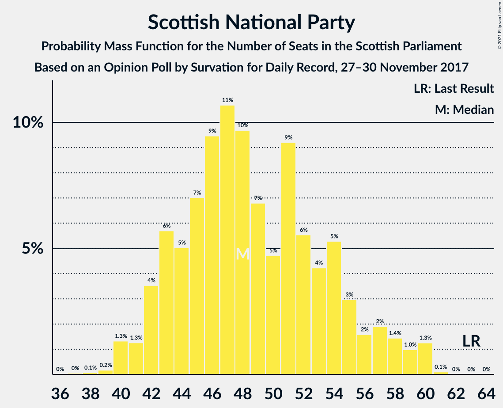
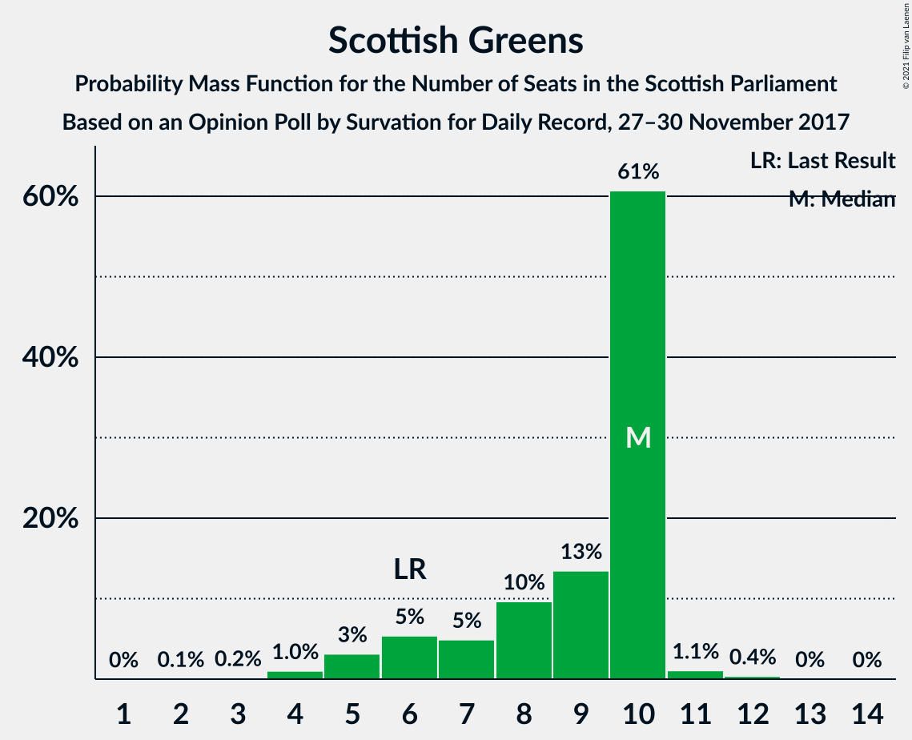

# Opinion Poll by Survation for Daily Record, 27–30 November 2017

<a href="#voting-intentions">Voting Intentions</a> | <a href="#seats">Seats</a> | <a href="#coalitions">Coalitions</a> | <a href="#technical-information">Technical Information</a>

## Voting Intentions

### Confidence Intervals

| Party | Last Result | Poll Result | 80% Confidence Interval | 90% Confidence Interval | 95% Confidence Interval | 99% Confidence Interval |
|:-----:|:-----------:|:-----------:|:-----------------------:|:-----------------------:|:-----------------------:|:-----------------------:|
| Scottish National Party | 41.7% | 33.2% | 31.4–35.2% |30.8–35.7% |30.4–36.2% |29.5–37.1% |
| Scottish Labour | 19.1% | 25.2% | 23.5–27.0% |23.0–27.5% |22.6–27.9% |21.8–28.8% |
| Scottish Conservative & Unionist Party | 22.9% | 22.1% | 20.5–23.9% |20.1–24.4% |19.7–24.8% |18.9–25.6% |
| Scottish Greens | 6.6% | 8.1% | 7.1–9.3% |6.8–9.6% |6.5–9.9% |6.1–10.5% |
| Scottish Liberal Democrats | 5.2% | 8.1% | 7.1–9.3% |6.8–9.6% |6.5–9.9% |6.1–10.5% |
| UK Independence Party | 2.0% | 3.0% | 2.5–3.9% |2.3–4.1% |2.1–4.3% |1.9–4.7% |

*Note:* The poll result column reflects the actual value used in the calculations. Published results may vary slightly, and in addition be rounded to fewer digits.

## Seats

### Confidence Intervals

| Party | Last Result | Median | 80% Confidence Interval | 90% Confidence Interval | 95% Confidence Interval | 99% Confidence Interval |
|:-----:|:-----------:|:------:|:-----------------------:|:-----------------------:|:-----------------------:|:-----------------------:|
| <a href="#scottish-national-party">Scottish National Party</a> | 63 | 54 | 48–59 |48–60 |47–60 |44–61 |
| <a href="#scottish-labour">Scottish Labour</a> | 24 | 32 | 29–34 |27–35 |27–36 |26–39 |
| <a href="#scottish-conservative-&-unionist-party">Scottish Conservative & Unionist Party</a> | 31 | 27 | 25–29 |24–30 |24–32 |24–34 |
| <a href="#scottish-greens">Scottish Greens</a> | 6 | 8 | 6–10 |5–10 |5–10 |4–11 |
| <a href="#scottish-liberal-democrats">Scottish Liberal Democrats</a> | 5 | 8 | 6–11 |6–11 |6–11 |5–12 |
| <a href="#uk-independence-party">UK Independence Party</a> | 0 | 0 | 0 |0 |0–1 |0–1 |

### Scottish National Party

*For a full overview of the results for this party, see the [Scottish National Party](party-scottishnationalparty.html) page.*

| Number of Seats | Probability | Accumulated | Special Marks |
|:---------------:|:-----------:|:-----------:|:-------------:|
| 42 | 0% | 100% |  |
| 43 | 0.3% | 99.9% |  |
| 44 | 0.7% | 99.6% |  |
| 45 | 0.3% | 99.0% |  |
| 46 | 0.8% | 98.6% |  |
| 47 | 2% | 98% |  |
| 48 | 6% | 96% |  |
| 49 | 1.1% | 90% |  |
| 50 | 3% | 88% |  |
| 51 | 13% | 85% |  |
| 52 | 8% | 72% |  |
| 53 | 6% | 63% |  |
| 54 | 18% | 58% | Median |
| 55 | 11% | 39% |  |
| 56 | 5% | 28% |  |
| 57 | 5% | 23% |  |
| 58 | 5% | 18% |  |
| 59 | 5% | 13% |  |
| 60 | 7% | 8% |  |
| 61 | 0.5% | 0.5% |  |
| 62 | 0% | 0% |  |
| 63 | 0% | 0% | Last Result |

### Scottish Labour

*For a full overview of the results for this party, see the [Scottish Labour](party-scottishlabour.html) page.*

| Number of Seats | Probability | Accumulated | Special Marks |
|:---------------:|:-----------:|:-----------:|:-------------:|
| 24 | 0% | 100% | Last Result |
| 25 | 0% | 100% |  |
| 26 | 1.3% | 100% |  |
| 27 | 5% | 98.6% |  |
| 28 | 3% | 94% |  |
| 29 | 7% | 91% |  |
| 30 | 16% | 84% |  |
| 31 | 12% | 68% |  |
| 32 | 16% | 55% | Median |
| 33 | 24% | 39% |  |
| 34 | 10% | 16% |  |
| 35 | 2% | 5% |  |
| 36 | 1.5% | 3% |  |
| 37 | 0.6% | 2% |  |
| 38 | 0.3% | 1.3% |  |
| 39 | 0.7% | 1.0% |  |
| 40 | 0.2% | 0.4% |  |
| 41 | 0.1% | 0.1% |  |
| 42 | 0% | 0% |  |

### Scottish Conservative & Unionist Party

*For a full overview of the results for this party, see the [Scottish Conservative & Unionist Party](party-scottishconservativeunionistparty.html) page.*

| Number of Seats | Probability | Accumulated | Special Marks |
|:---------------:|:-----------:|:-----------:|:-------------:|
| 20 | 0% | 100% |  |
| 21 | 0.1% | 99.9% |  |
| 22 | 0.1% | 99.9% |  |
| 23 | 0.2% | 99.8% |  |
| 24 | 5% | 99.6% |  |
| 25 | 22% | 95% |  |
| 26 | 13% | 73% |  |
| 27 | 25% | 60% | Median |
| 28 | 23% | 35% |  |
| 29 | 6% | 13% |  |
| 30 | 3% | 7% |  |
| 31 | 0.9% | 4% | Last Result |
| 32 | 0.8% | 3% |  |
| 33 | 1.1% | 2% |  |
| 34 | 0.6% | 0.7% |  |
| 35 | 0% | 0% |  |

### Scottish Greens

*For a full overview of the results for this party, see the [Scottish Greens](party-scottishgreens.html) page.*

| Number of Seats | Probability | Accumulated | Special Marks |
|:---------------:|:-----------:|:-----------:|:-------------:|
| 3 | 0.2% | 100% |  |
| 4 | 1.2% | 99.8% |  |
| 5 | 4% | 98.6% |  |
| 6 | 7% | 94% | Last Result |
| 7 | 8% | 87% |  |
| 8 | 31% | 79% | Median |
| 9 | 21% | 48% |  |
| 10 | 26% | 27% |  |
| 11 | 0.4% | 0.8% |  |
| 12 | 0.5% | 0.5% |  |
| 13 | 0% | 0% |  |

### Scottish Liberal Democrats

*For a full overview of the results for this party, see the [Scottish Liberal Democrats](party-scottishliberaldemocrats.html) page.*

| Number of Seats | Probability | Accumulated | Special Marks |
|:---------------:|:-----------:|:-----------:|:-------------:|
| 5 | 0.6% | 100% | Last Result |
| 6 | 13% | 99.4% |  |
| 7 | 27% | 87% |  |
| 8 | 17% | 60% | Median |
| 9 | 11% | 42% |  |
| 10 | 15% | 32% |  |
| 11 | 15% | 16% |  |
| 12 | 0.9% | 0.9% |  |
| 13 | 0% | 0% |  |

### UK Independence Party

*For a full overview of the results for this party, see the [UK Independence Party](party-ukindependenceparty.html) page.*

| Number of Seats | Probability | Accumulated | Special Marks |
|:---------------:|:-----------:|:-----------:|:-------------:|
| 0 | 96% | 100% | Last Result, Median |
| 1 | 3% | 4% |  |
| 2 | 0.2% | 0.2% |  |
| 3 | 0% | 0% |  |

## Coalitions

### Confidence Intervals

| Coalition | Last Result | Median | Majority? | 80% Confidence Interval | 90% Confidence Interval | 95% Confidence Interval | 99% Confidence Interval |
|:---------:|:-----------:|:------:|:---------:|:-----------------------:|:-----------------------:|:-----------------------:|:-----------------------:|
| Scottish Labour – Scottish Conservative & Unionist Party – Scottish Liberal Democrats | 60 | 67 | 76% | 62–72 | 61–73 | 60–75 | 59–76 |
| Scottish National Party – Scottish Greens | 69 | 62 | 23% | 57–67 | 56–68 | 54–69 | 53–70 |
| Scottish Labour – Scottish Conservative & Unionist Party | 55 | 58 | 3% | 54–62 | 53–64 | 52–65 | 51–68 |
| Scottish National Party | 63 | 54 | 0% | 48–59 | 48–60 | 47–60 | 44–61 |
| Scottish Labour – Scottish Greens – Scottish Liberal Democrats | 35 | 48 | 0% | 45–52 | 44–53 | 43–55 | 42–57 |
| Scottish Labour – Scottish Liberal Democrats | 29 | 40 | 0% | 37–44 | 35–45 | 35–45 | 34–47 |
| Scottish Conservative & Unionist Party – Scottish Liberal Democrats | 36 | 35 | 0% | 32–39 | 31–40 | 31–40 | 30–42 |

### Scottish Labour – Scottish Conservative & Unionist Party – Scottish Liberal Democrats

| Number of Seats | Probability | Accumulated | Special Marks |
|:---------------:|:-----------:|:-----------:|:-------------:|
| 58 | 0.1% | 100% |  |
| 59 | 1.1% | 99.9% |  |
| 60 | 3% | 98.8% | Last Result |
| 61 | 5% | 96% |  |
| 62 | 5% | 91% |  |
| 63 | 7% | 86% |  |
| 64 | 3% | 79% |  |
| 65 | 11% | 76% | Majority |
| 66 | 10% | 66% |  |
| 67 | 13% | 56% | Median |
| 68 | 13% | 43% |  |
| 69 | 10% | 30% |  |
| 70 | 2% | 19% |  |
| 71 | 6% | 17% |  |
| 72 | 2% | 11% |  |
| 73 | 5% | 9% |  |
| 74 | 1.3% | 4% |  |
| 75 | 2% | 3% |  |
| 76 | 0.5% | 0.8% |  |
| 77 | 0.1% | 0.3% |  |
| 78 | 0.1% | 0.1% |  |
| 79 | 0.1% | 0.1% |  |
| 80 | 0% | 0% |  |

### Scottish National Party – Scottish Greens

| Number of Seats | Probability | Accumulated | Special Marks |
|:---------------:|:-----------:|:-----------:|:-------------:|
| 50 | 0.1% | 100% |  |
| 51 | 0.1% | 99.9% |  |
| 52 | 0.1% | 99.8% |  |
| 53 | 0.5% | 99.7% |  |
| 54 | 2% | 99.2% |  |
| 55 | 1.4% | 97% |  |
| 56 | 5% | 96% |  |
| 57 | 3% | 91% |  |
| 58 | 6% | 89% |  |
| 59 | 2% | 83% |  |
| 60 | 10% | 80% |  |
| 61 | 13% | 70% |  |
| 62 | 15% | 57% | Median |
| 63 | 8% | 42% |  |
| 64 | 10% | 34% |  |
| 65 | 3% | 23% | Majority |
| 66 | 7% | 21% |  |
| 67 | 5% | 14% |  |
| 68 | 5% | 9% |  |
| 69 | 3% | 4% | Last Result |
| 70 | 1.1% | 1.2% |  |
| 71 | 0.1% | 0.1% |  |
| 72 | 0% | 0% |  |

### Scottish Labour – Scottish Conservative & Unionist Party

| Number of Seats | Probability | Accumulated | Special Marks |
|:---------------:|:-----------:|:-----------:|:-------------:|
| 50 | 0.2% | 100% |  |
| 51 | 0.7% | 99.8% |  |
| 52 | 3% | 99.1% |  |
| 53 | 2% | 96% |  |
| 54 | 5% | 95% |  |
| 55 | 8% | 90% | Last Result |
| 56 | 8% | 82% |  |
| 57 | 8% | 74% |  |
| 58 | 19% | 66% |  |
| 59 | 13% | 47% | Median |
| 60 | 8% | 34% |  |
| 61 | 8% | 26% |  |
| 62 | 10% | 18% |  |
| 63 | 3% | 8% |  |
| 64 | 2% | 6% |  |
| 65 | 0.8% | 3% | Majority |
| 66 | 1.1% | 2% |  |
| 67 | 0.6% | 1.2% |  |
| 68 | 0.4% | 0.6% |  |
| 69 | 0.1% | 0.2% |  |
| 70 | 0.1% | 0.1% |  |
| 71 | 0% | 0% |  |

### Scottish National Party

| Number of Seats | Probability | Accumulated | Special Marks |
|:---------------:|:-----------:|:-----------:|:-------------:|
| 42 | 0% | 100% |  |
| 43 | 0.3% | 99.9% |  |
| 44 | 0.7% | 99.6% |  |
| 45 | 0.3% | 99.0% |  |
| 46 | 0.8% | 98.6% |  |
| 47 | 2% | 98% |  |
| 48 | 6% | 96% |  |
| 49 | 1.1% | 90% |  |
| 50 | 3% | 88% |  |
| 51 | 13% | 85% |  |
| 52 | 8% | 72% |  |
| 53 | 6% | 63% |  |
| 54 | 18% | 58% | Median |
| 55 | 11% | 39% |  |
| 56 | 5% | 28% |  |
| 57 | 5% | 23% |  |
| 58 | 5% | 18% |  |
| 59 | 5% | 13% |  |
| 60 | 7% | 8% |  |
| 61 | 0.5% | 0.5% |  |
| 62 | 0% | 0% |  |
| 63 | 0% | 0% | Last Result |

### Scottish Labour – Scottish Greens – Scottish Liberal Democrats

| Number of Seats | Probability | Accumulated | Special Marks |
|:---------------:|:-----------:|:-----------:|:-------------:|
| 35 | 0% | 100% | Last Result |
| 36 | 0% | 100% |  |
| 37 | 0% | 100% |  |
| 38 | 0% | 100% |  |
| 39 | 0.1% | 100% |  |
| 40 | 0.1% | 99.9% |  |
| 41 | 0.2% | 99.8% |  |
| 42 | 0.3% | 99.6% |  |
| 43 | 2% | 99.3% |  |
| 44 | 5% | 97% |  |
| 45 | 8% | 92% |  |
| 46 | 11% | 84% |  |
| 47 | 18% | 73% |  |
| 48 | 12% | 55% | Median |
| 49 | 13% | 43% |  |
| 50 | 8% | 30% |  |
| 51 | 8% | 22% |  |
| 52 | 5% | 14% |  |
| 53 | 6% | 10% |  |
| 54 | 0.9% | 4% |  |
| 55 | 2% | 3% |  |
| 56 | 0.5% | 2% |  |
| 57 | 0.8% | 1.1% |  |
| 58 | 0.2% | 0.3% |  |
| 59 | 0% | 0.1% |  |
| 60 | 0% | 0% |  |

### Scottish Labour – Scottish Liberal Democrats

| Number of Seats | Probability | Accumulated | Special Marks |
|:---------------:|:-----------:|:-----------:|:-------------:|
| 29 | 0% | 100% | Last Result |
| 30 | 0% | 100% |  |
| 31 | 0% | 100% |  |
| 32 | 0.1% | 100% |  |
| 33 | 0.2% | 99.9% |  |
| 34 | 1.2% | 99.7% |  |
| 35 | 4% | 98% |  |
| 36 | 5% | 95% |  |
| 37 | 8% | 90% |  |
| 38 | 12% | 82% |  |
| 39 | 13% | 70% |  |
| 40 | 20% | 57% | Median |
| 41 | 12% | 37% |  |
| 42 | 8% | 25% |  |
| 43 | 6% | 17% |  |
| 44 | 3% | 11% |  |
| 45 | 6% | 8% |  |
| 46 | 0.5% | 2% |  |
| 47 | 0.9% | 1.3% |  |
| 48 | 0.3% | 0.5% |  |
| 49 | 0.1% | 0.2% |  |
| 50 | 0.1% | 0.1% |  |
| 51 | 0% | 0% |  |

### Scottish Conservative & Unionist Party – Scottish Liberal Democrats

| Number of Seats | Probability | Accumulated | Special Marks |
|:---------------:|:-----------:|:-----------:|:-------------:|
| 29 | 0.2% | 100% |  |
| 30 | 2% | 99.8% |  |
| 31 | 6% | 98% |  |
| 32 | 13% | 92% |  |
| 33 | 11% | 79% |  |
| 34 | 9% | 68% |  |
| 35 | 11% | 59% | Median |
| 36 | 10% | 48% | Last Result |
| 37 | 14% | 38% |  |
| 38 | 10% | 24% |  |
| 39 | 9% | 14% |  |
| 40 | 3% | 5% |  |
| 41 | 2% | 2% |  |
| 42 | 0.5% | 0.6% |  |
| 43 | 0.1% | 0.1% |  |
| 44 | 0% | 0% |  |

## Technical Information

### Opinion Poll

+ **Polling firm:** Survation
+ **Commissioner(s):** Daily Record
+ **Fieldwork period:** 27–30 November 2017

### Calculations

+ **Sample size:** 1017
+ **Simulations done:** 131,072
+ **Error estimate:** 1.51%

