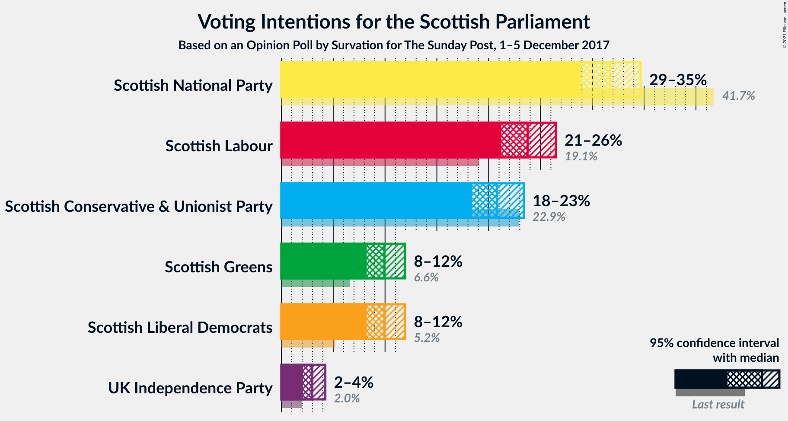
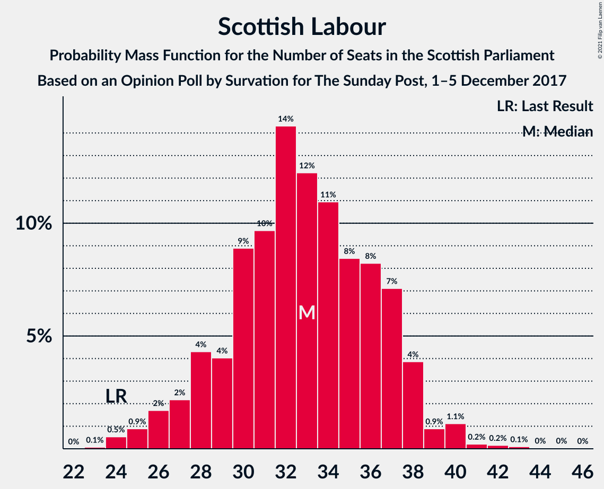
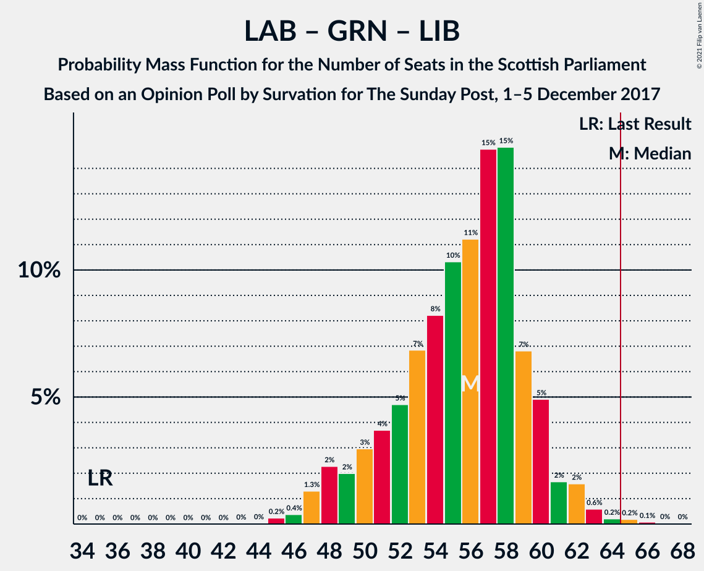

# Opinion Poll by Survation for The Sunday Post, 1–5 December 2017

<a href="#voting-intentions">Voting Intentions</a> | <a href="#seats">Seats</a> | <a href="#coalitions">Coalitions</a> | <a href="#technical-information">Technical Information</a>

## Voting Intentions

### Confidence Intervals

| Party | Last Result | Poll Result | 80% Confidence Interval | 90% Confidence Interval | 95% Confidence Interval | 99% Confidence Interval |
|:-----:|:-----------:|:-----------:|:-----------------------:|:-----------------------:|:-----------------------:|:-----------------------:|
| Scottish National Party | 41.7% | 31.7% | 29.9–33.6% |29.4–34.2% |28.9–34.7% |28.0–35.6% |
| Scottish Labour | 19.1% | 23.8% | 22.1–25.5% |21.6–26.0% |21.2–26.5% |20.5–27.4% |
| Scottish Conservative & Unionist Party | 22.9% | 20.8% | 19.2–22.5% |18.8–23.0% |18.4–23.4% |17.6–24.2% |
| Scottish Greens | 6.6% | 9.9% | 8.8–11.2% |8.5–11.6% |8.2–11.9% |7.7–12.6% |
| Scottish Liberal Democrats | 5.2% | 9.9% | 8.8–11.2% |8.5–11.6% |8.2–11.9% |7.7–12.6% |
| UK Independence Party | 2.0% | 3.0% | 2.4–3.8% |2.2–4.0% |2.1–4.2% |1.8–4.6% |

*Note:* The poll result column reflects the actual value used in the calculations. Published results may vary slightly, and in addition be rounded to fewer digits.

## Seats

### Confidence Intervals

| Party | Last Result | Median | 80% Confidence Interval | 90% Confidence Interval | 95% Confidence Interval | 99% Confidence Interval |
|:-----:|:-----------:|:------:|:-----------------------:|:-----------------------:|:-----------------------:|:-----------------------:|
| <a href="#scottish-national-party">Scottish National Party</a> | 63 | 49 | 44–56 |43–57 |42–59 |41–60 |
| <a href="#scottish-labour">Scottish Labour</a> | 24 | 32 | 28–35 |26–36 |25–36 |24–38 |
| <a href="#scottish-conservative-&-unionist-party">Scottish Conservative & Unionist Party</a> | 31 | 26 | 23–29 |22–30 |22–30 |21–32 |
| <a href="#scottish-greens">Scottish Greens</a> | 6 | 10 | 10–13 |10–13 |10–14 |9–14 |
| <a href="#scottish-liberal-democrats">Scottish Liberal Democrats</a> | 5 | 11 | 9–12 |9–12 |9–13 |8–15 |
| <a href="#uk-independence-party">UK Independence Party</a> | 0 | 0 | 0 |0 |0 |0–1 |

### Scottish National Party

*For a full overview of the results for this party, see the [Scottish National Party](party-scottishnationalparty.html) page.*

| Number of Seats | Probability | Accumulated | Special Marks |
|:---------------:|:-----------:|:-----------:|:-------------:|
| 39 | 0.1% | 100% |  |
| 40 | 0.2% | 99.9% |  |
| 41 | 0.7% | 99.7% |  |
| 42 | 2% | 99.0% |  |
| 43 | 4% | 97% |  |
| 44 | 10% | 93% |  |
| 45 | 4% | 84% |  |
| 46 | 6% | 79% |  |
| 47 | 9% | 74% |  |
| 48 | 10% | 65% |  |
| 49 | 11% | 55% | Median |
| 50 | 7% | 44% |  |
| 51 | 6% | 37% |  |
| 52 | 6% | 31% |  |
| 53 | 7% | 25% |  |
| 54 | 3% | 18% |  |
| 55 | 4% | 16% |  |
| 56 | 5% | 12% |  |
| 57 | 3% | 7% |  |
| 58 | 0.8% | 4% |  |
| 59 | 2% | 3% |  |
| 60 | 1.1% | 2% |  |
| 61 | 0.4% | 0.5% |  |
| 62 | 0% | 0.1% |  |
| 63 | 0% | 0% | Last Result |

### Scottish Labour

*For a full overview of the results for this party, see the [Scottish Labour](party-scottishlabour.html) page.*

| Number of Seats | Probability | Accumulated | Special Marks |
|:---------------:|:-----------:|:-----------:|:-------------:|
| 24 | 0.7% | 100% | Last Result |
| 25 | 2% | 99.2% |  |
| 26 | 3% | 97% |  |
| 27 | 2% | 95% |  |
| 28 | 11% | 92% |  |
| 29 | 6% | 81% |  |
| 30 | 10% | 75% |  |
| 31 | 8% | 65% |  |
| 32 | 18% | 56% | Median |
| 33 | 16% | 39% |  |
| 34 | 7% | 23% |  |
| 35 | 6% | 16% |  |
| 36 | 9% | 10% |  |
| 37 | 0.8% | 1.3% |  |
| 38 | 0.2% | 0.5% |  |
| 39 | 0.1% | 0.3% |  |
| 40 | 0.1% | 0.1% |  |
| 41 | 0% | 0.1% |  |
| 42 | 0% | 0.1% |  |
| 43 | 0% | 0% |  |

### Scottish Conservative & Unionist Party

*For a full overview of the results for this party, see the [Scottish Conservative & Unionist Party](party-scottishconservativeunionistparty.html) page.*

| Number of Seats | Probability | Accumulated | Special Marks |
|:---------------:|:-----------:|:-----------:|:-------------:|
| 19 | 0.1% | 100% |  |
| 20 | 0.3% | 99.9% |  |
| 21 | 1.2% | 99.6% |  |
| 22 | 6% | 98% |  |
| 23 | 5% | 92% |  |
| 24 | 7% | 87% |  |
| 25 | 12% | 80% |  |
| 26 | 24% | 69% | Median |
| 27 | 14% | 45% |  |
| 28 | 13% | 31% |  |
| 29 | 11% | 18% |  |
| 30 | 5% | 7% |  |
| 31 | 2% | 2% | Last Result |
| 32 | 0.5% | 0.6% |  |
| 33 | 0.1% | 0.2% |  |
| 34 | 0% | 0% |  |

### Scottish Greens

*For a full overview of the results for this party, see the [Scottish Greens](party-scottishgreens.html) page.*

| Number of Seats | Probability | Accumulated | Special Marks |
|:---------------:|:-----------:|:-----------:|:-------------:|
| 6 | 0% | 100% | Last Result |
| 7 | 0.1% | 100% |  |
| 8 | 0.2% | 99.9% |  |
| 9 | 0.9% | 99.7% |  |
| 10 | 52% | 98.8% | Median |
| 11 | 23% | 47% |  |
| 12 | 13% | 24% |  |
| 13 | 7% | 11% |  |
| 14 | 3% | 3% |  |
| 15 | 0.3% | 0.4% |  |
| 16 | 0.1% | 0.1% |  |
| 17 | 0% | 0% |  |

### Scottish Liberal Democrats

*For a full overview of the results for this party, see the [Scottish Liberal Democrats](party-scottishliberaldemocrats.html) page.*

| Number of Seats | Probability | Accumulated | Special Marks |
|:---------------:|:-----------:|:-----------:|:-------------:|
| 5 | 0% | 100% | Last Result |
| 6 | 0.1% | 100% |  |
| 7 | 0.3% | 99.9% |  |
| 8 | 1.2% | 99.6% |  |
| 9 | 14% | 98% |  |
| 10 | 20% | 85% |  |
| 11 | 32% | 65% | Median |
| 12 | 29% | 33% |  |
| 13 | 2% | 4% |  |
| 14 | 0.8% | 2% |  |
| 15 | 0.8% | 1.0% |  |
| 16 | 0.2% | 0.2% |  |
| 17 | 0% | 0% |  |

### UK Independence Party

*For a full overview of the results for this party, see the [UK Independence Party](party-ukindependenceparty.html) page.*

| Number of Seats | Probability | Accumulated | Special Marks |
|:---------------:|:-----------:|:-----------:|:-------------:|
| 0 | 99.4% | 100% | Last Result, Median |
| 1 | 0.4% | 0.6% |  |
| 2 | 0.1% | 0.2% |  |
| 3 | 0.1% | 0.1% |  |
| 4 | 0% | 0% |  |

## Coalitions

### Confidence Intervals

| Coalition | Last Result | Median | Majority? | 80% Confidence Interval | 90% Confidence Interval | 95% Confidence Interval | 99% Confidence Interval |
|:---------:|:-----------:|:------:|:---------:|:-----------------------:|:-----------------------:|:-----------------------:|:-----------------------:|
| Scottish Labour – Scottish Conservative & Unionist Party – Scottish Liberal Democrats | 60 | 69 | 80% | 63–74 | 61–75 | 60–76 | 58–78 |
| Scottish National Party – Scottish Greens | 69 | 60 | 20% | 55–66 | 54–68 | 53–69 | 51–71 |
| Scottish Labour – Scottish Conservative & Unionist Party | 55 | 58 | 3% | 53–63 | 51–63 | 49–65 | 47–66 |
| Scottish Labour – Scottish Greens – Scottish Liberal Democrats | 35 | 54 | 0% | 48–57 | 47–58 | 46–59 | 45–61 |
| Scottish National Party | 63 | 49 | 0% | 44–56 | 43–57 | 42–59 | 41–60 |
| Scottish Labour – Scottish Liberal Democrats | 29 | 43 | 0% | 38–46 | 37–47 | 36–48 | 34–50 |
| Scottish Conservative & Unionist Party – Scottish Liberal Democrats | 36 | 38 | 0% | 33–41 | 33–41 | 32–42 | 31–43 |

### Scottish Labour – Scottish Conservative & Unionist Party – Scottish Liberal Democrats

| Number of Seats | Probability | Accumulated | Special Marks |
|:---------------:|:-----------:|:-----------:|:-------------:|
| 57 | 0.2% | 100% |  |
| 58 | 0.6% | 99.8% |  |
| 59 | 1.1% | 99.1% |  |
| 60 | 2% | 98% | Last Result |
| 61 | 1.4% | 96% |  |
| 62 | 4% | 95% |  |
| 63 | 5% | 91% |  |
| 64 | 6% | 86% |  |
| 65 | 5% | 80% | Majority |
| 66 | 3% | 75% |  |
| 67 | 6% | 71% |  |
| 68 | 12% | 65% |  |
| 69 | 5% | 54% | Median |
| 70 | 16% | 48% |  |
| 71 | 7% | 33% |  |
| 72 | 5% | 25% |  |
| 73 | 4% | 20% |  |
| 74 | 7% | 16% |  |
| 75 | 5% | 9% |  |
| 76 | 2% | 4% |  |
| 77 | 1.3% | 2% |  |
| 78 | 0.4% | 0.5% |  |
| 79 | 0.1% | 0.1% |  |
| 80 | 0% | 0% |  |

### Scottish National Party – Scottish Greens

| Number of Seats | Probability | Accumulated | Special Marks |
|:---------------:|:-----------:|:-----------:|:-------------:|
| 50 | 0.1% | 100% |  |
| 51 | 0.4% | 99.9% |  |
| 52 | 1.4% | 99.5% |  |
| 53 | 2% | 98% |  |
| 54 | 5% | 96% |  |
| 55 | 7% | 91% |  |
| 56 | 4% | 84% |  |
| 57 | 5% | 80% |  |
| 58 | 7% | 75% |  |
| 59 | 16% | 67% | Median |
| 60 | 5% | 51% |  |
| 61 | 12% | 46% |  |
| 62 | 6% | 35% |  |
| 63 | 3% | 29% |  |
| 64 | 5% | 25% |  |
| 65 | 6% | 20% | Majority |
| 66 | 5% | 14% |  |
| 67 | 4% | 9% |  |
| 68 | 1.3% | 5% |  |
| 69 | 2% | 4% | Last Result |
| 70 | 1.1% | 2% |  |
| 71 | 0.6% | 0.9% |  |
| 72 | 0.2% | 0.2% |  |
| 73 | 0% | 0% |  |

### Scottish Labour – Scottish Conservative & Unionist Party

| Number of Seats | Probability | Accumulated | Special Marks |
|:---------------:|:-----------:|:-----------:|:-------------:|
| 46 | 0.1% | 100% |  |
| 47 | 0.4% | 99.9% |  |
| 48 | 0.6% | 99.5% |  |
| 49 | 1.4% | 98.9% |  |
| 50 | 2% | 97% |  |
| 51 | 2% | 96% |  |
| 52 | 3% | 94% |  |
| 53 | 6% | 91% |  |
| 54 | 8% | 85% |  |
| 55 | 7% | 77% | Last Result |
| 56 | 4% | 70% |  |
| 57 | 11% | 67% |  |
| 58 | 10% | 56% | Median |
| 59 | 12% | 46% |  |
| 60 | 7% | 34% |  |
| 61 | 7% | 26% |  |
| 62 | 5% | 20% |  |
| 63 | 10% | 15% |  |
| 64 | 1.4% | 5% |  |
| 65 | 2% | 3% | Majority |
| 66 | 0.7% | 1.0% |  |
| 67 | 0.2% | 0.3% |  |
| 68 | 0% | 0.1% |  |
| 69 | 0% | 0% |  |

### Scottish Labour – Scottish Greens – Scottish Liberal Democrats

| Number of Seats | Probability | Accumulated | Special Marks |
|:---------------:|:-----------:|:-----------:|:-------------:|
| 35 | 0% | 100% | Last Result |
| 36 | 0% | 100% |  |
| 37 | 0% | 100% |  |
| 38 | 0% | 100% |  |
| 39 | 0% | 100% |  |
| 40 | 0% | 100% |  |
| 41 | 0% | 100% |  |
| 42 | 0% | 100% |  |
| 43 | 0.1% | 100% |  |
| 44 | 0.1% | 99.8% |  |
| 45 | 1.3% | 99.7% |  |
| 46 | 1.0% | 98% |  |
| 47 | 4% | 97% |  |
| 48 | 5% | 93% |  |
| 49 | 4% | 88% |  |
| 50 | 9% | 84% |  |
| 51 | 4% | 76% |  |
| 52 | 9% | 72% |  |
| 53 | 7% | 62% | Median |
| 54 | 16% | 55% |  |
| 55 | 15% | 39% |  |
| 56 | 8% | 24% |  |
| 57 | 7% | 16% |  |
| 58 | 5% | 9% |  |
| 59 | 3% | 4% |  |
| 60 | 0.7% | 1.3% |  |
| 61 | 0.3% | 0.6% |  |
| 62 | 0.1% | 0.3% |  |
| 63 | 0.1% | 0.1% |  |
| 64 | 0% | 0.1% |  |
| 65 | 0% | 0% | Majority |

### Scottish National Party

| Number of Seats | Probability | Accumulated | Special Marks |
|:---------------:|:-----------:|:-----------:|:-------------:|
| 39 | 0.1% | 100% |  |
| 40 | 0.2% | 99.9% |  |
| 41 | 0.7% | 99.7% |  |
| 42 | 2% | 99.0% |  |
| 43 | 4% | 97% |  |
| 44 | 10% | 93% |  |
| 45 | 4% | 84% |  |
| 46 | 6% | 79% |  |
| 47 | 9% | 74% |  |
| 48 | 10% | 65% |  |
| 49 | 11% | 55% | Median |
| 50 | 7% | 44% |  |
| 51 | 6% | 37% |  |
| 52 | 6% | 31% |  |
| 53 | 7% | 25% |  |
| 54 | 3% | 18% |  |
| 55 | 4% | 16% |  |
| 56 | 5% | 12% |  |
| 57 | 3% | 7% |  |
| 58 | 0.8% | 4% |  |
| 59 | 2% | 3% |  |
| 60 | 1.1% | 2% |  |
| 61 | 0.4% | 0.5% |  |
| 62 | 0% | 0.1% |  |
| 63 | 0% | 0% | Last Result |

### Scottish Labour – Scottish Liberal Democrats

| Number of Seats | Probability | Accumulated | Special Marks |
|:---------------:|:-----------:|:-----------:|:-------------:|
| 29 | 0% | 100% | Last Result |
| 30 | 0% | 100% |  |
| 31 | 0% | 100% |  |
| 32 | 0% | 100% |  |
| 33 | 0.2% | 100% |  |
| 34 | 0.3% | 99.8% |  |
| 35 | 1.4% | 99.5% |  |
| 36 | 2% | 98% |  |
| 37 | 5% | 96% |  |
| 38 | 5% | 91% |  |
| 39 | 6% | 86% |  |
| 40 | 9% | 80% |  |
| 41 | 8% | 71% |  |
| 42 | 10% | 63% |  |
| 43 | 10% | 53% | Median |
| 44 | 18% | 43% |  |
| 45 | 9% | 25% |  |
| 46 | 7% | 16% |  |
| 47 | 4% | 9% |  |
| 48 | 4% | 5% |  |
| 49 | 0.8% | 1.4% |  |
| 50 | 0.4% | 0.6% |  |
| 51 | 0.1% | 0.3% |  |
| 52 | 0.1% | 0.1% |  |
| 53 | 0% | 0.1% |  |
| 54 | 0% | 0% |  |

### Scottish Conservative & Unionist Party – Scottish Liberal Democrats

| Number of Seats | Probability | Accumulated | Special Marks |
|:---------------:|:-----------:|:-----------:|:-------------:|
| 29 | 0% | 100% |  |
| 30 | 0.3% | 99.9% |  |
| 31 | 0.8% | 99.6% |  |
| 32 | 3% | 98.8% |  |
| 33 | 7% | 96% |  |
| 34 | 11% | 89% |  |
| 35 | 8% | 78% |  |
| 36 | 8% | 70% | Last Result |
| 37 | 10% | 62% | Median |
| 38 | 17% | 52% |  |
| 39 | 15% | 35% |  |
| 40 | 9% | 20% |  |
| 41 | 7% | 11% |  |
| 42 | 3% | 4% |  |
| 43 | 1.0% | 1.5% |  |
| 44 | 0.4% | 0.5% |  |
| 45 | 0.1% | 0.1% |  |
| 46 | 0% | 0% |  |

## Technical Information

### Opinion Poll

+ **Polling firm:** Survation
+ **Commissioner(s):** The Sunday Post
+ **Fieldwork period:** 1–5 December 2017

### Calculations

+ **Sample size:** 1006
+ **Simulations done:** 131,072
+ **Error estimate:** 1.34%

