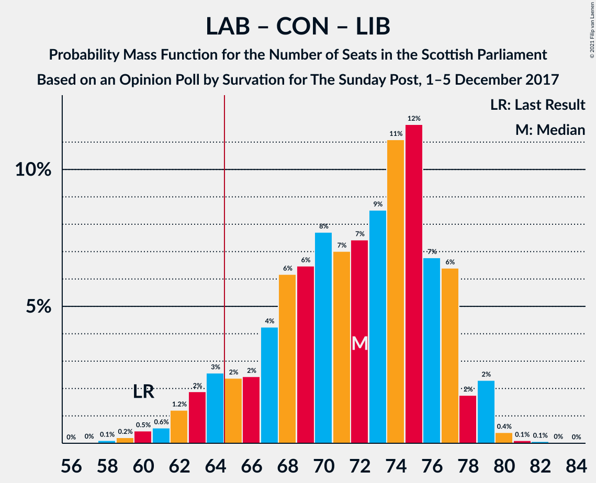

# Opinion Poll by Survation for The Sunday Post, 1–5 December 2017

<a href="#voting-intentions">Voting Intentions</a> | <a href="#seats">Seats</a> | <a href="#coalitions">Coalitions</a> | <a href="#technical-information">Technical Information</a>

## Voting Intentions

### Confidence Intervals

| Party | Last Result | Poll Result | 80% Confidence Interval | 90% Confidence Interval | 95% Confidence Interval | 99% Confidence Interval |
|:-----:|:-----------:|:-----------:|:-----------------------:|:-----------------------:|:-----------------------:|:-----------------------:|
| Scottish National Party | 41.7% | 31.7% | 29.9–33.6% |29.4–34.2% |28.9–34.7% |28.0–35.6% |
| Scottish Labour | 19.1% | 23.8% | 22.1–25.5% |21.6–26.0% |21.2–26.5% |20.5–27.4% |
| Scottish Conservative & Unionist Party | 22.9% | 20.8% | 19.2–22.5% |18.8–23.0% |18.4–23.4% |17.6–24.2% |
| Scottish Greens | 6.6% | 9.9% | 8.8–11.2% |8.5–11.6% |8.2–11.9% |7.7–12.6% |
| Scottish Liberal Democrats | 5.2% | 9.9% | 8.8–11.2% |8.5–11.6% |8.2–11.9% |7.7–12.6% |
| UK Independence Party | 2.0% | 3.0% | 2.4–3.8% |2.2–4.0% |2.1–4.2% |1.8–4.6% |

*Note:* The poll result column reflects the actual value used in the calculations. Published results may vary slightly, and in addition be rounded to fewer digits.

## Seats

### Confidence Intervals

| Party | Last Result | Median | 80% Confidence Interval | 90% Confidence Interval | 95% Confidence Interval | 99% Confidence Interval |
|:-----:|:-----------:|:------:|:-----------------------:|:-----------------------:|:-----------------------:|:-----------------------:|
| <a href="#scottish-national-party">Scottish National Party</a> | 63 | 46 | 42–52 |41–55 |40–56 |39–59 |
| <a href="#scottish-labour">Scottish Labour</a> | 24 | 33 | 29–37 |27–38 |26–39 |24–41 |
| <a href="#scottish-conservative-&-unionist-party">Scottish Conservative & Unionist Party</a> | 31 | 27 | 23–30 |23–30 |22–31 |21–32 |
| <a href="#scottish-greens">Scottish Greens</a> | 6 | 10 | 10–12 |10–13 |10–14 |9–15 |
| <a href="#scottish-liberal-democrats">Scottish Liberal Democrats</a> | 5 | 12 | 11–13 |10–14 |9–14 |9–15 |
| <a href="#uk-independence-party">UK Independence Party</a> | 0 | 0 | 0 |0 |0 |0–1 |

### Scottish National Party

*For a full overview of the results for this party, see the [Scottish National Party](party-scottishnationalparty.html) page.*

| Number of Seats | Probability | Accumulated | Special Marks |
|:---------------:|:-----------:|:-----------:|:-------------:|
| 36 | 0% | 100% |  |
| 37 | 0.1% | 99.9% |  |
| 38 | 0.2% | 99.9% |  |
| 39 | 0.6% | 99.7% |  |
| 40 | 2% | 99.1% |  |
| 41 | 2% | 97% |  |
| 42 | 10% | 95% |  |
| 43 | 10% | 84% |  |
| 44 | 13% | 75% |  |
| 45 | 11% | 62% |  |
| 46 | 7% | 51% | Median |
| 47 | 7% | 44% |  |
| 48 | 6% | 36% |  |
| 49 | 7% | 31% |  |
| 50 | 7% | 23% |  |
| 51 | 5% | 17% |  |
| 52 | 3% | 12% |  |
| 53 | 2% | 9% |  |
| 54 | 1.3% | 7% |  |
| 55 | 2% | 6% |  |
| 56 | 2% | 4% |  |
| 57 | 1.0% | 2% |  |
| 58 | 0.4% | 0.9% |  |
| 59 | 0.3% | 0.5% |  |
| 60 | 0.2% | 0.2% |  |
| 61 | 0.1% | 0.1% |  |
| 62 | 0% | 0% |  |
| 63 | 0% | 0% | Last Result |

### Scottish Labour

*For a full overview of the results for this party, see the [Scottish Labour](party-scottishlabour.html) page.*

| Number of Seats | Probability | Accumulated | Special Marks |
|:---------------:|:-----------:|:-----------:|:-------------:|
| 23 | 0.1% | 100% |  |
| 24 | 0.5% | 99.9% | Last Result |
| 25 | 0.9% | 99.4% |  |
| 26 | 2% | 98.5% |  |
| 27 | 2% | 97% |  |
| 28 | 4% | 95% |  |
| 29 | 4% | 90% |  |
| 30 | 9% | 86% |  |
| 31 | 10% | 77% |  |
| 32 | 14% | 68% |  |
| 33 | 12% | 53% | Median |
| 34 | 11% | 41% |  |
| 35 | 8% | 30% |  |
| 36 | 8% | 22% |  |
| 37 | 7% | 14% |  |
| 38 | 4% | 6% |  |
| 39 | 0.9% | 3% |  |
| 40 | 1.1% | 2% |  |
| 41 | 0.2% | 0.6% |  |
| 42 | 0.2% | 0.4% |  |
| 43 | 0.1% | 0.2% |  |
| 44 | 0% | 0.1% |  |
| 45 | 0% | 0.1% |  |
| 46 | 0% | 0% |  |

### Scottish Conservative & Unionist Party

*For a full overview of the results for this party, see the [Scottish Conservative & Unionist Party](party-scottishconservativeunionistparty.html) page.*

| Number of Seats | Probability | Accumulated | Special Marks |
|:---------------:|:-----------:|:-----------:|:-------------:|
| 20 | 0.1% | 100% |  |
| 21 | 0.8% | 99.9% |  |
| 22 | 3% | 99.1% |  |
| 23 | 8% | 96% |  |
| 24 | 6% | 89% |  |
| 25 | 8% | 83% |  |
| 26 | 17% | 75% |  |
| 27 | 21% | 58% | Median |
| 28 | 10% | 37% |  |
| 29 | 11% | 27% |  |
| 30 | 12% | 16% |  |
| 31 | 3% | 4% | Last Result |
| 32 | 0.5% | 0.9% |  |
| 33 | 0.4% | 0.4% |  |
| 34 | 0% | 0% |  |

### Scottish Greens

*For a full overview of the results for this party, see the [Scottish Greens](party-scottishgreens.html) page.*

| Number of Seats | Probability | Accumulated | Special Marks |
|:---------------:|:-----------:|:-----------:|:-------------:|
| 6 | 0% | 100% | Last Result |
| 7 | 0% | 100% |  |
| 8 | 0.1% | 99.9% |  |
| 9 | 0.6% | 99.9% |  |
| 10 | 57% | 99.3% | Median |
| 11 | 21% | 42% |  |
| 12 | 14% | 21% |  |
| 13 | 4% | 7% |  |
| 14 | 2% | 3% |  |
| 15 | 1.1% | 1.1% |  |
| 16 | 0% | 0.1% |  |
| 17 | 0% | 0% |  |

### Scottish Liberal Democrats

*For a full overview of the results for this party, see the [Scottish Liberal Democrats](party-scottishliberaldemocrats.html) page.*

| Number of Seats | Probability | Accumulated | Special Marks |
|:---------------:|:-----------:|:-----------:|:-------------:|
| 5 | 0% | 100% | Last Result |
| 6 | 0% | 100% |  |
| 7 | 0.1% | 100% |  |
| 8 | 0.3% | 99.9% |  |
| 9 | 3% | 99.6% |  |
| 10 | 5% | 97% |  |
| 11 | 19% | 92% |  |
| 12 | 42% | 73% | Median |
| 13 | 24% | 31% |  |
| 14 | 6% | 7% |  |
| 15 | 1.0% | 1.3% |  |
| 16 | 0.2% | 0.3% |  |
| 17 | 0.1% | 0.1% |  |
| 18 | 0% | 0% |  |

### UK Independence Party

*For a full overview of the results for this party, see the [UK Independence Party](party-ukindependenceparty.html) page.*

| Number of Seats | Probability | Accumulated | Special Marks |
|:---------------:|:-----------:|:-----------:|:-------------:|
| 0 | 99.3% | 100% | Last Result, Median |
| 1 | 0.5% | 0.7% |  |
| 2 | 0.1% | 0.2% |  |
| 3 | 0% | 0.1% |  |
| 4 | 0% | 0.1% |  |
| 5 | 0% | 0% |  |

## Coalitions

### Confidence Intervals

| Coalition | Last Result | Median | Majority? | 80% Confidence Interval | 90% Confidence Interval | 95% Confidence Interval | 99% Confidence Interval |
|:---------:|:-----------:|:------:|:---------:|:-----------------------:|:-----------------------:|:-----------------------:|:-----------------------:|
| Scottish Labour – Scottish Conservative & Unionist Party – Scottish Liberal Democrats | 60 | 72 | 93% | 66–77 | 64–77 | 62–79 | 60–80 |
| Scottish Labour – Scottish Conservative & Unionist Party | 55 | 60 | 9% | 54–64 | 53–65 | 51–67 | 49–68 |
| Scottish National Party – Scottish Greens | 69 | 57 | 7% | 52–63 | 52–65 | 50–67 | 49–69 |
| Scottish Labour – Scottish Greens – Scottish Liberal Democrats | 35 | 56 | 0.4% | 51–59 | 49–60 | 48–62 | 46–64 |
| Scottish National Party | 63 | 46 | 0% | 42–52 | 41–55 | 40–56 | 39–59 |
| Scottish Labour – Scottish Liberal Democrats | 29 | 45 | 0% | 40–49 | 38–50 | 37–51 | 36–53 |
| Scottish Conservative & Unionist Party – Scottish Liberal Democrats | 36 | 39 | 0% | 35–42 | 34–43 | 33–44 | 32–45 |

### Scottish Labour – Scottish Conservative & Unionist Party – Scottish Liberal Democrats

| Number of Seats | Probability | Accumulated | Special Marks |
|:---------------:|:-----------:|:-----------:|:-------------:|
| 58 | 0.1% | 100% |  |
| 59 | 0.2% | 99.9% |  |
| 60 | 0.5% | 99.6% | Last Result |
| 61 | 0.6% | 99.2% |  |
| 62 | 1.2% | 98.6% |  |
| 63 | 2% | 97% |  |
| 64 | 3% | 96% |  |
| 65 | 2% | 93% | Majority |
| 66 | 2% | 91% |  |
| 67 | 4% | 88% |  |
| 68 | 6% | 84% |  |
| 69 | 6% | 78% |  |
| 70 | 8% | 71% |  |
| 71 | 7% | 64% |  |
| 72 | 7% | 57% | Median |
| 73 | 9% | 49% |  |
| 74 | 11% | 41% |  |
| 75 | 12% | 29% |  |
| 76 | 7% | 18% |  |
| 77 | 6% | 11% |  |
| 78 | 2% | 5% |  |
| 79 | 2% | 3% |  |
| 80 | 0.4% | 0.6% |  |
| 81 | 0.1% | 0.2% |  |
| 82 | 0.1% | 0.1% |  |
| 83 | 0% | 0% |  |

### Scottish Labour – Scottish Conservative & Unionist Party

| Number of Seats | Probability | Accumulated | Special Marks |
|:---------------:|:-----------:|:-----------:|:-------------:|
| 47 | 0.1% | 100% |  |
| 48 | 0.2% | 99.9% |  |
| 49 | 0.5% | 99.7% |  |
| 50 | 0.8% | 99.2% |  |
| 51 | 1.3% | 98% |  |
| 52 | 2% | 97% |  |
| 53 | 3% | 95% |  |
| 54 | 3% | 92% |  |
| 55 | 4% | 89% | Last Result |
| 56 | 6% | 85% |  |
| 57 | 7% | 79% |  |
| 58 | 7% | 72% |  |
| 59 | 9% | 64% |  |
| 60 | 8% | 55% | Median |
| 61 | 10% | 47% |  |
| 62 | 9% | 37% |  |
| 63 | 13% | 28% |  |
| 64 | 7% | 15% |  |
| 65 | 4% | 9% | Majority |
| 66 | 2% | 4% |  |
| 67 | 2% | 3% |  |
| 68 | 0.3% | 0.5% |  |
| 69 | 0.1% | 0.2% |  |
| 70 | 0% | 0.1% |  |
| 71 | 0% | 0% |  |

### Scottish National Party – Scottish Greens

| Number of Seats | Probability | Accumulated | Special Marks |
|:---------------:|:-----------:|:-----------:|:-------------:|
| 47 | 0.1% | 100% |  |
| 48 | 0.1% | 99.9% |  |
| 49 | 0.4% | 99.8% |  |
| 50 | 2% | 99.4% |  |
| 51 | 2% | 97% |  |
| 52 | 6% | 95% |  |
| 53 | 7% | 89% |  |
| 54 | 12% | 82% |  |
| 55 | 11% | 70% |  |
| 56 | 9% | 59% | Median |
| 57 | 7% | 51% |  |
| 58 | 7% | 43% |  |
| 59 | 8% | 36% |  |
| 60 | 6% | 29% |  |
| 61 | 6% | 22% |  |
| 62 | 4% | 16% |  |
| 63 | 2% | 12% |  |
| 64 | 2% | 9% |  |
| 65 | 3% | 7% | Majority |
| 66 | 2% | 4% |  |
| 67 | 1.2% | 3% |  |
| 68 | 0.6% | 1.4% |  |
| 69 | 0.5% | 0.8% | Last Result |
| 70 | 0.2% | 0.4% |  |
| 71 | 0.1% | 0.1% |  |
| 72 | 0% | 0% |  |

### Scottish Labour – Scottish Greens – Scottish Liberal Democrats

| Number of Seats | Probability | Accumulated | Special Marks |
|:---------------:|:-----------:|:-----------:|:-------------:|
| 35 | 0% | 100% | Last Result |
| 36 | 0% | 100% |  |
| 37 | 0% | 100% |  |
| 38 | 0% | 100% |  |
| 39 | 0% | 100% |  |
| 40 | 0% | 100% |  |
| 41 | 0% | 100% |  |
| 42 | 0% | 100% |  |
| 43 | 0% | 100% |  |
| 44 | 0% | 100% |  |
| 45 | 0.2% | 99.9% |  |
| 46 | 0.4% | 99.7% |  |
| 47 | 1.3% | 99.3% |  |
| 48 | 2% | 98% |  |
| 49 | 2% | 96% |  |
| 50 | 3% | 94% |  |
| 51 | 4% | 91% |  |
| 52 | 5% | 87% |  |
| 53 | 7% | 82% |  |
| 54 | 8% | 76% |  |
| 55 | 10% | 67% | Median |
| 56 | 11% | 57% |  |
| 57 | 15% | 46% |  |
| 58 | 15% | 31% |  |
| 59 | 7% | 16% |  |
| 60 | 5% | 9% |  |
| 61 | 2% | 4% |  |
| 62 | 2% | 3% |  |
| 63 | 0.6% | 1.2% |  |
| 64 | 0.2% | 0.6% |  |
| 65 | 0.2% | 0.4% | Majority |
| 66 | 0.1% | 0.2% |  |
| 67 | 0% | 0.1% |  |
| 68 | 0% | 0% |  |

### Scottish National Party

| Number of Seats | Probability | Accumulated | Special Marks |
|:---------------:|:-----------:|:-----------:|:-------------:|
| 36 | 0% | 100% |  |
| 37 | 0.1% | 99.9% |  |
| 38 | 0.2% | 99.9% |  |
| 39 | 0.6% | 99.7% |  |
| 40 | 2% | 99.1% |  |
| 41 | 2% | 97% |  |
| 42 | 10% | 95% |  |
| 43 | 10% | 84% |  |
| 44 | 13% | 75% |  |
| 45 | 11% | 62% |  |
| 46 | 7% | 51% | Median |
| 47 | 7% | 44% |  |
| 48 | 6% | 36% |  |
| 49 | 7% | 31% |  |
| 50 | 7% | 23% |  |
| 51 | 5% | 17% |  |
| 52 | 3% | 12% |  |
| 53 | 2% | 9% |  |
| 54 | 1.3% | 7% |  |
| 55 | 2% | 6% |  |
| 56 | 2% | 4% |  |
| 57 | 1.0% | 2% |  |
| 58 | 0.4% | 0.9% |  |
| 59 | 0.3% | 0.5% |  |
| 60 | 0.2% | 0.2% |  |
| 61 | 0.1% | 0.1% |  |
| 62 | 0% | 0% |  |
| 63 | 0% | 0% | Last Result |

### Scottish Labour – Scottish Liberal Democrats

| Number of Seats | Probability | Accumulated | Special Marks |
|:---------------:|:-----------:|:-----------:|:-------------:|
| 29 | 0% | 100% | Last Result |
| 30 | 0% | 100% |  |
| 31 | 0% | 100% |  |
| 32 | 0% | 100% |  |
| 33 | 0% | 100% |  |
| 34 | 0.1% | 100% |  |
| 35 | 0.4% | 99.9% |  |
| 36 | 0.7% | 99.5% |  |
| 37 | 2% | 98.8% |  |
| 38 | 2% | 97% |  |
| 39 | 3% | 95% |  |
| 40 | 4% | 92% |  |
| 41 | 5% | 89% |  |
| 42 | 7% | 83% |  |
| 43 | 8% | 76% |  |
| 44 | 11% | 68% |  |
| 45 | 10% | 57% | Median |
| 46 | 13% | 47% |  |
| 47 | 12% | 34% |  |
| 48 | 9% | 22% |  |
| 49 | 6% | 13% |  |
| 50 | 4% | 7% |  |
| 51 | 1.1% | 3% |  |
| 52 | 1.2% | 2% |  |
| 53 | 0.3% | 0.7% |  |
| 54 | 0.2% | 0.4% |  |
| 55 | 0.1% | 0.2% |  |
| 56 | 0% | 0.1% |  |
| 57 | 0% | 0.1% |  |
| 58 | 0% | 0% |  |

### Scottish Conservative & Unionist Party – Scottish Liberal Democrats

| Number of Seats | Probability | Accumulated | Special Marks |
|:---------------:|:-----------:|:-----------:|:-------------:|
| 30 | 0% | 100% |  |
| 31 | 0.1% | 99.9% |  |
| 32 | 0.5% | 99.8% |  |
| 33 | 2% | 99.3% |  |
| 34 | 4% | 97% |  |
| 35 | 6% | 93% |  |
| 36 | 7% | 87% | Last Result |
| 37 | 10% | 80% |  |
| 38 | 14% | 70% |  |
| 39 | 15% | 57% | Median |
| 40 | 12% | 42% |  |
| 41 | 10% | 30% |  |
| 42 | 11% | 20% |  |
| 43 | 5% | 8% |  |
| 44 | 2% | 3% |  |
| 45 | 0.9% | 1.2% |  |
| 46 | 0.2% | 0.3% |  |
| 47 | 0.1% | 0.1% |  |
| 48 | 0% | 0% |  |

## Technical Information

### Opinion Poll

+ **Polling firm:** Survation
+ **Commissioner(s):** The Sunday Post
+ **Fieldwork period:** 1–5 December 2017

### Calculations

+ **Sample size:** 1006
+ **Simulations done:** 1,048,576
+ **Error estimate:** 0.67%

