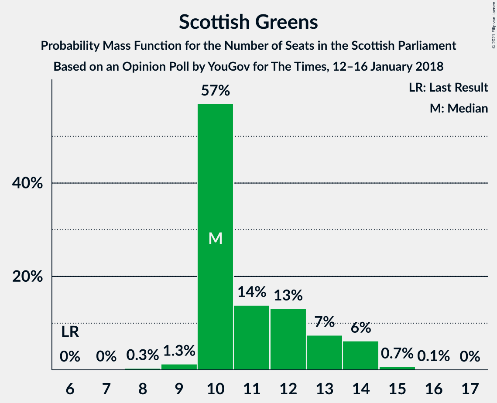
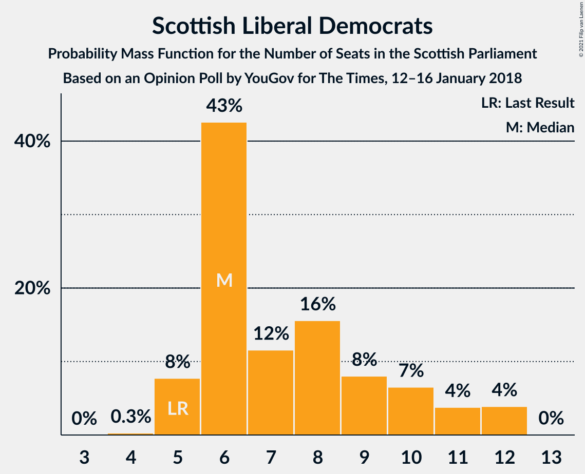
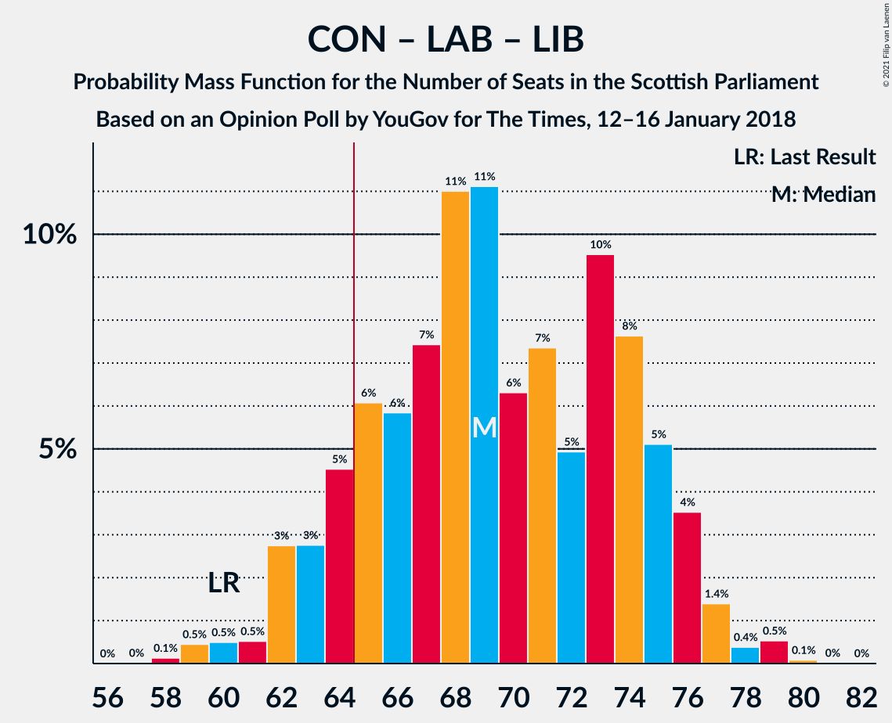
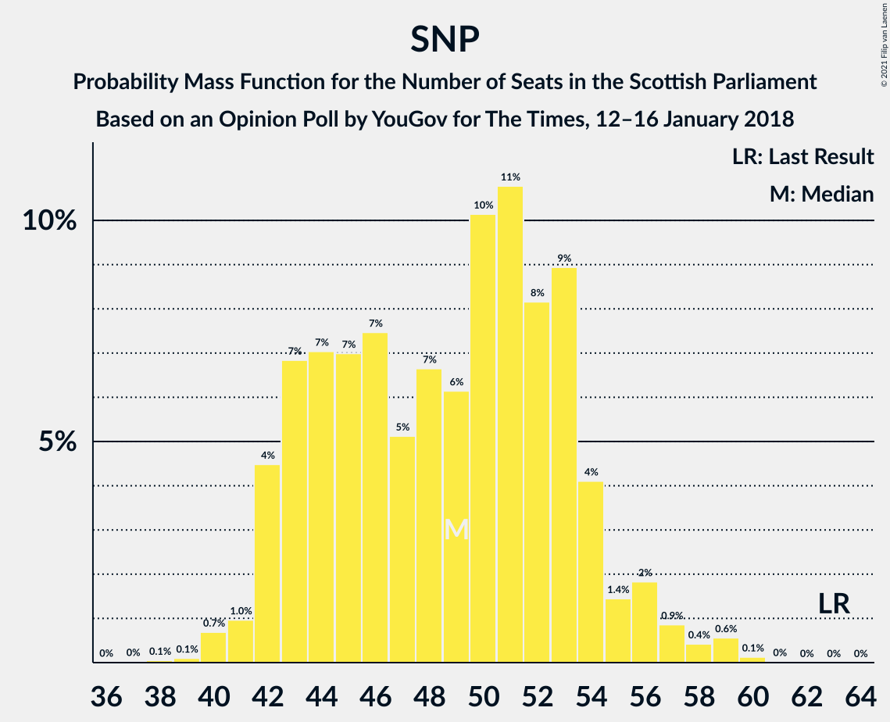

# Opinion Poll by YouGov for The Times, 12–16 January 2018

<a href="#voting-intentions">Voting Intentions</a> | <a href="#seats">Seats</a> | <a href="#coalitions">Coalitions</a> | <a href="#technical-information">Technical Information</a>

## Voting Intentions

### Confidence Intervals

| Party | Last Result | Poll Result | 80% Confidence Interval | 90% Confidence Interval | 95% Confidence Interval | 99% Confidence Interval |
|:-----:|:-----------:|:-----------:|:-----------------------:|:-----------------------:|:-----------------------:|:-----------------------:|
| Scottish National Party | 41.7% | 31.6% | 29.8–33.6% |29.3–34.1% |28.8–34.6% |28.0–35.5% |
| Scottish Conservative & Unionist Party | 22.9% | 24.7% | 23.0–26.5% |22.5–27.0% |22.1–27.4% |21.3–28.3% |
| Scottish Labour | 19.1% | 21.8% | 20.1–23.5% |19.7–24.0% |19.3–24.4% |18.6–25.3% |
| Scottish Greens | 6.6% | 9.9% | 8.8–11.2% |8.4–11.6% |8.2–11.9% |7.7–12.5% |
| Scottish Liberal Democrats | 5.2% | 6.9% | 6.0–8.0% |5.7–8.4% |5.5–8.6% |5.1–9.2% |
| UK Independence Party | 2.0% | 3.0% | 2.4–3.8% |2.2–4.0% |2.1–4.3% |1.8–4.7% |
| Scottish Socialist Party | 0.5% | 2.0% | 1.5–2.7% |1.4–2.9% |1.3–3.1% |1.1–3.4% |

*Note:* The poll result column reflects the actual value used in the calculations. Published results may vary slightly, and in addition be rounded to fewer digits.

## Seats

### Confidence Intervals

| Party | Last Result | Median | 80% Confidence Interval | 90% Confidence Interval | 95% Confidence Interval | 99% Confidence Interval |
|:-----:|:-----------:|:------:|:-----------------------:|:-----------------------:|:-----------------------:|:-----------------------:|
| <a href="#scottish-national-party">Scottish National Party</a> | 63 | 49 | 43–53 |42–55 |42–56 |40–59 |
| <a href="#scottish-conservative-&-unionist-party">Scottish Conservative & Unionist Party</a> | 31 | 33 | 30–35 |29–36 |28–37 |26–39 |
| <a href="#scottish-labour">Scottish Labour</a> | 24 | 29 | 25–33 |25–34 |24–35 |23–36 |
| <a href="#scottish-greens">Scottish Greens</a> | 6 | 10 | 10–13 |10–14 |10–14 |9–15 |
| <a href="#scottish-liberal-democrats">Scottish Liberal Democrats</a> | 5 | 6 | 6–10 |5–11 |5–12 |5–12 |
| <a href="#uk-independence-party">UK Independence Party</a> | 0 | 0 | 0 |0 |0 |0–1 |
| <a href="#scottish-socialist-party">Scottish Socialist Party</a> | 0 | 0 | 0 |0 |0 |0 |

### Scottish National Party

*For a full overview of the results for this party, see the [Scottish National Party](party-scottishnationalparty.html) page.*

| Number of Seats | Probability | Accumulated | Special Marks |
|:---------------:|:-----------:|:-----------:|:-------------:|
| 38 | 0.1% | 100% |  |
| 39 | 0.1% | 99.9% |  |
| 40 | 0.7% | 99.8% |  |
| 41 | 1.0% | 99.1% |  |
| 42 | 4% | 98% |  |
| 43 | 7% | 94% |  |
| 44 | 7% | 87% |  |
| 45 | 7% | 80% |  |
| 46 | 7% | 73% |  |
| 47 | 5% | 65% |  |
| 48 | 7% | 60% |  |
| 49 | 6% | 54% | Median |
| 50 | 10% | 47% |  |
| 51 | 11% | 37% |  |
| 52 | 8% | 26% |  |
| 53 | 9% | 18% |  |
| 54 | 4% | 9% |  |
| 55 | 1.4% | 5% |  |
| 56 | 2% | 4% |  |
| 57 | 0.9% | 2% |  |
| 58 | 0.4% | 1.1% |  |
| 59 | 0.6% | 0.7% |  |
| 60 | 0.1% | 0.2% |  |
| 61 | 0% | 0% |  |
| 62 | 0% | 0% |  |
| 63 | 0% | 0% | Last Result |

### Scottish Conservative & Unionist Party

*For a full overview of the results for this party, see the [Scottish Conservative & Unionist Party](party-scottishconservativeunionistparty.html) page.*

| Number of Seats | Probability | Accumulated | Special Marks |
|:---------------:|:-----------:|:-----------:|:-------------:|
| 25 | 0.1% | 100% |  |
| 26 | 0.8% | 99.8% |  |
| 27 | 0.9% | 99.0% |  |
| 28 | 1.2% | 98% |  |
| 29 | 5% | 97% |  |
| 30 | 4% | 92% |  |
| 31 | 8% | 89% | Last Result |
| 32 | 9% | 80% |  |
| 33 | 28% | 71% | Median |
| 34 | 20% | 44% |  |
| 35 | 15% | 24% |  |
| 36 | 4% | 8% |  |
| 37 | 3% | 5% |  |
| 38 | 1.2% | 2% |  |
| 39 | 0.8% | 1.0% |  |
| 40 | 0.2% | 0.2% |  |
| 41 | 0.1% | 0.1% |  |
| 42 | 0% | 0% |  |

### Scottish Labour

*For a full overview of the results for this party, see the [Scottish Labour](party-scottishlabour.html) page.*

| Number of Seats | Probability | Accumulated | Special Marks |
|:---------------:|:-----------:|:-----------:|:-------------:|
| 22 | 0.2% | 100% |  |
| 23 | 1.1% | 99.7% |  |
| 24 | 3% | 98.6% | Last Result |
| 25 | 8% | 95% |  |
| 26 | 7% | 87% |  |
| 27 | 20% | 80% |  |
| 28 | 6% | 60% |  |
| 29 | 8% | 54% | Median |
| 30 | 12% | 46% |  |
| 31 | 7% | 34% |  |
| 32 | 12% | 27% |  |
| 33 | 8% | 16% |  |
| 34 | 5% | 7% |  |
| 35 | 2% | 3% |  |
| 36 | 0.7% | 0.9% |  |
| 37 | 0.2% | 0.2% |  |
| 38 | 0% | 0.1% |  |
| 39 | 0% | 0% |  |

### Scottish Greens

*For a full overview of the results for this party, see the [Scottish Greens](party-scottishgreens.html) page.*

| Number of Seats | Probability | Accumulated | Special Marks |
|:---------------:|:-----------:|:-----------:|:-------------:|
| 6 | 0% | 100% | Last Result |
| 7 | 0% | 100% |  |
| 8 | 0.3% | 99.9% |  |
| 9 | 1.3% | 99.6% |  |
| 10 | 57% | 98% | Median |
| 11 | 14% | 41% |  |
| 12 | 13% | 28% |  |
| 13 | 7% | 14% |  |
| 14 | 6% | 7% |  |
| 15 | 0.7% | 0.8% |  |
| 16 | 0.1% | 0.1% |  |
| 17 | 0% | 0% |  |

### Scottish Liberal Democrats

*For a full overview of the results for this party, see the [Scottish Liberal Democrats](party-scottishliberaldemocrats.html) page.*

| Number of Seats | Probability | Accumulated | Special Marks |
|:---------------:|:-----------:|:-----------:|:-------------:|
| 4 | 0.3% | 100% |  |
| 5 | 8% | 99.7% | Last Result |
| 6 | 43% | 92% | Median |
| 7 | 12% | 49% |  |
| 8 | 16% | 38% |  |
| 9 | 8% | 22% |  |
| 10 | 7% | 14% |  |
| 11 | 4% | 8% |  |
| 12 | 4% | 4% |  |
| 13 | 0% | 0% |  |

### UK Independence Party

*For a full overview of the results for this party, see the [UK Independence Party](party-ukindependenceparty.html) page.*

| Number of Seats | Probability | Accumulated | Special Marks |
|:---------------:|:-----------:|:-----------:|:-------------:|
| 0 | 98.8% | 100% | Last Result, Median |
| 1 | 0.8% | 1.2% |  |
| 2 | 0.2% | 0.5% |  |
| 3 | 0.2% | 0.2% |  |
| 4 | 0% | 0.1% |  |
| 5 | 0% | 0% |  |

### Scottish Socialist Party

*For a full overview of the results for this party, see the [Scottish Socialist Party](party-scottishsocialistparty.html) page.*

| Number of Seats | Probability | Accumulated | Special Marks |
|:---------------:|:-----------:|:-----------:|:-------------:|
| 0 | 100% | 100% | Last Result, Median |

## Coalitions

### Confidence Intervals

| Coalition | Last Result | Median | Majority? | 80% Confidence Interval | 90% Confidence Interval | 95% Confidence Interval | 99% Confidence Interval |
|:---------:|:-----------:|:------:|:---------:|:-----------------------:|:-----------------------:|:-----------------------:|:-----------------------:|
| Scottish Conservative & Unionist Party – Scottish Labour – Scottish Liberal Democrats | 60 | 69 | 88% | 64–75 | 63–76 | 62–76 | 59–79 |
| Scottish Conservative & Unionist Party – Scottish Labour | 55 | 62 | 30% | 57–68 | 56–69 | 55–69 | 53–70 |
| Scottish National Party – Scottish Greens | 69 | 60 | 12% | 54–65 | 53–66 | 53–67 | 50–70 |
| Scottish National Party | 63 | 49 | 0% | 43–53 | 42–55 | 42–56 | 40–59 |
| Scottish Labour – Scottish Greens – Scottish Liberal Democrats | 35 | 47 | 0% | 43–52 | 42–53 | 41–54 | 40–57 |
| Scottish Conservative & Unionist Party – Scottish Liberal Democrats | 36 | 41 | 0% | 37–44 | 35–44 | 35–45 | 33–47 |
| Scottish Labour – Scottish Liberal Democrats | 29 | 36 | 0% | 32–41 | 31–42 | 30–43 | 29–45 |

### Scottish Conservative & Unionist Party – Scottish Labour – Scottish Liberal Democrats

| Number of Seats | Probability | Accumulated | Special Marks |
|:---------------:|:-----------:|:-----------:|:-------------:|
| 58 | 0.1% | 100% |  |
| 59 | 0.5% | 99.8% |  |
| 60 | 0.5% | 99.4% | Last Result |
| 61 | 0.5% | 98.9% |  |
| 62 | 3% | 98% |  |
| 63 | 3% | 96% |  |
| 64 | 5% | 93% |  |
| 65 | 6% | 88% | Majority |
| 66 | 6% | 82% |  |
| 67 | 7% | 76% |  |
| 68 | 11% | 69% | Median |
| 69 | 11% | 58% |  |
| 70 | 6% | 47% |  |
| 71 | 7% | 41% |  |
| 72 | 5% | 33% |  |
| 73 | 10% | 28% |  |
| 74 | 8% | 19% |  |
| 75 | 5% | 11% |  |
| 76 | 4% | 6% |  |
| 77 | 1.4% | 2% |  |
| 78 | 0.4% | 1.0% |  |
| 79 | 0.5% | 0.6% |  |
| 80 | 0.1% | 0.1% |  |
| 81 | 0% | 0% |  |

### Scottish Conservative & Unionist Party – Scottish Labour

| Number of Seats | Probability | Accumulated | Special Marks |
|:---------------:|:-----------:|:-----------:|:-------------:|
| 50 | 0.1% | 100% |  |
| 51 | 0.1% | 99.9% |  |
| 52 | 0.3% | 99.8% |  |
| 53 | 0.6% | 99.5% |  |
| 54 | 1.1% | 98.9% |  |
| 55 | 1.2% | 98% | Last Result |
| 56 | 4% | 97% |  |
| 57 | 4% | 93% |  |
| 58 | 5% | 89% |  |
| 59 | 7% | 83% |  |
| 60 | 11% | 76% |  |
| 61 | 8% | 65% |  |
| 62 | 9% | 57% | Median |
| 63 | 13% | 48% |  |
| 64 | 5% | 35% |  |
| 65 | 9% | 30% | Majority |
| 66 | 5% | 20% |  |
| 67 | 5% | 15% |  |
| 68 | 5% | 11% |  |
| 69 | 3% | 5% |  |
| 70 | 1.5% | 2% |  |
| 71 | 0.2% | 0.4% |  |
| 72 | 0.1% | 0.1% |  |
| 73 | 0% | 0% |  |

### Scottish National Party – Scottish Greens

| Number of Seats | Probability | Accumulated | Special Marks |
|:---------------:|:-----------:|:-----------:|:-------------:|
| 49 | 0.1% | 100% |  |
| 50 | 0.5% | 99.9% |  |
| 51 | 0.4% | 99.3% |  |
| 52 | 1.5% | 99.0% |  |
| 53 | 4% | 98% |  |
| 54 | 5% | 94% |  |
| 55 | 8% | 89% |  |
| 56 | 9% | 81% |  |
| 57 | 5% | 72% |  |
| 58 | 7% | 67% |  |
| 59 | 6% | 59% | Median |
| 60 | 11% | 53% |  |
| 61 | 11% | 42% |  |
| 62 | 7% | 31% |  |
| 63 | 6% | 23% |  |
| 64 | 6% | 18% |  |
| 65 | 4% | 12% | Majority |
| 66 | 3% | 7% |  |
| 67 | 3% | 4% |  |
| 68 | 0.5% | 2% |  |
| 69 | 0.5% | 1.1% | Last Result |
| 70 | 0.4% | 0.6% |  |
| 71 | 0.1% | 0.2% |  |
| 72 | 0% | 0% |  |

### Scottish National Party

| Number of Seats | Probability | Accumulated | Special Marks |
|:---------------:|:-----------:|:-----------:|:-------------:|
| 38 | 0.1% | 100% |  |
| 39 | 0.1% | 99.9% |  |
| 40 | 0.7% | 99.8% |  |
| 41 | 1.0% | 99.1% |  |
| 42 | 4% | 98% |  |
| 43 | 7% | 94% |  |
| 44 | 7% | 87% |  |
| 45 | 7% | 80% |  |
| 46 | 7% | 73% |  |
| 47 | 5% | 65% |  |
| 48 | 7% | 60% |  |
| 49 | 6% | 54% | Median |
| 50 | 10% | 47% |  |
| 51 | 11% | 37% |  |
| 52 | 8% | 26% |  |
| 53 | 9% | 18% |  |
| 54 | 4% | 9% |  |
| 55 | 1.4% | 5% |  |
| 56 | 2% | 4% |  |
| 57 | 0.9% | 2% |  |
| 58 | 0.4% | 1.1% |  |
| 59 | 0.6% | 0.7% |  |
| 60 | 0.1% | 0.2% |  |
| 61 | 0% | 0% |  |
| 62 | 0% | 0% |  |
| 63 | 0% | 0% | Last Result |

### Scottish Labour – Scottish Greens – Scottish Liberal Democrats

| Number of Seats | Probability | Accumulated | Special Marks |
|:---------------:|:-----------:|:-----------:|:-------------:|
| 35 | 0% | 100% | Last Result |
| 36 | 0% | 100% |  |
| 37 | 0% | 100% |  |
| 38 | 0% | 100% |  |
| 39 | 0.2% | 100% |  |
| 40 | 0.7% | 99.8% |  |
| 41 | 2% | 99.1% |  |
| 42 | 6% | 97% |  |
| 43 | 9% | 91% |  |
| 44 | 10% | 82% |  |
| 45 | 10% | 72% | Median |
| 46 | 8% | 62% |  |
| 47 | 7% | 54% |  |
| 48 | 7% | 47% |  |
| 49 | 10% | 39% |  |
| 50 | 9% | 30% |  |
| 51 | 5% | 21% |  |
| 52 | 6% | 16% |  |
| 53 | 6% | 9% |  |
| 54 | 1.3% | 4% |  |
| 55 | 1.2% | 2% |  |
| 56 | 0.6% | 1.1% |  |
| 57 | 0.4% | 0.5% |  |
| 58 | 0.1% | 0.1% |  |
| 59 | 0% | 0% |  |

### Scottish Conservative & Unionist Party – Scottish Liberal Democrats

| Number of Seats | Probability | Accumulated | Special Marks |
|:---------------:|:-----------:|:-----------:|:-------------:|
| 31 | 0% | 100% |  |
| 32 | 0.3% | 99.9% |  |
| 33 | 0.4% | 99.6% |  |
| 34 | 1.2% | 99.2% |  |
| 35 | 4% | 98% |  |
| 36 | 1.3% | 94% | Last Result |
| 37 | 4% | 93% |  |
| 38 | 7% | 89% |  |
| 39 | 13% | 81% | Median |
| 40 | 15% | 68% |  |
| 41 | 25% | 53% |  |
| 42 | 11% | 28% |  |
| 43 | 6% | 17% |  |
| 44 | 7% | 11% |  |
| 45 | 2% | 4% |  |
| 46 | 1.1% | 2% |  |
| 47 | 0.4% | 0.8% |  |
| 48 | 0.3% | 0.4% |  |
| 49 | 0.1% | 0.1% |  |
| 50 | 0% | 0.1% |  |
| 51 | 0% | 0% |  |

### Scottish Labour – Scottish Liberal Democrats

| Number of Seats | Probability | Accumulated | Special Marks |
|:---------------:|:-----------:|:-----------:|:-------------:|
| 28 | 0.1% | 100% |  |
| 29 | 0.7% | 99.9% | Last Result |
| 30 | 2% | 99.2% |  |
| 31 | 6% | 97% |  |
| 32 | 6% | 91% |  |
| 33 | 12% | 86% |  |
| 34 | 7% | 74% |  |
| 35 | 10% | 67% | Median |
| 36 | 10% | 57% |  |
| 37 | 8% | 48% |  |
| 38 | 8% | 39% |  |
| 39 | 9% | 31% |  |
| 40 | 10% | 22% |  |
| 41 | 5% | 12% |  |
| 42 | 4% | 7% |  |
| 43 | 2% | 3% |  |
| 44 | 0.7% | 2% |  |
| 45 | 0.6% | 1.0% |  |
| 46 | 0.1% | 0.4% |  |
| 47 | 0.2% | 0.2% |  |
| 48 | 0% | 0% |  |

## Technical Information

### Opinion Poll

+ **Polling firm:** YouGov
+ **Commissioner(s):** The Times
+ **Fieldwork period:** 12–16 January 2018

### Calculations

+ **Sample size:** 1002
+ **Simulations done:** 1,048,576
+ **Error estimate:** 1.49%

