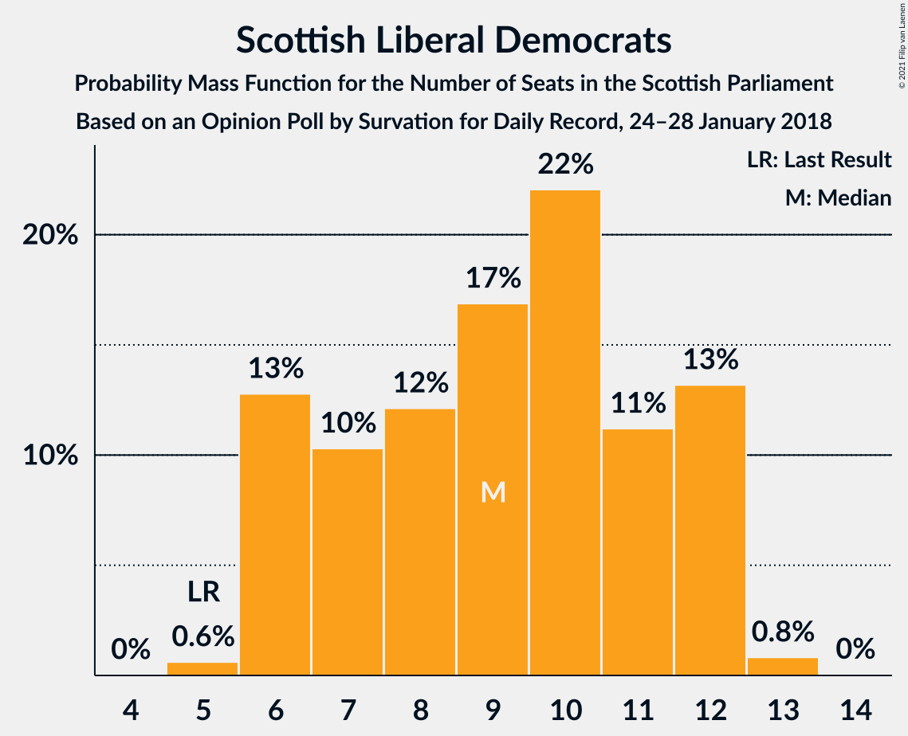
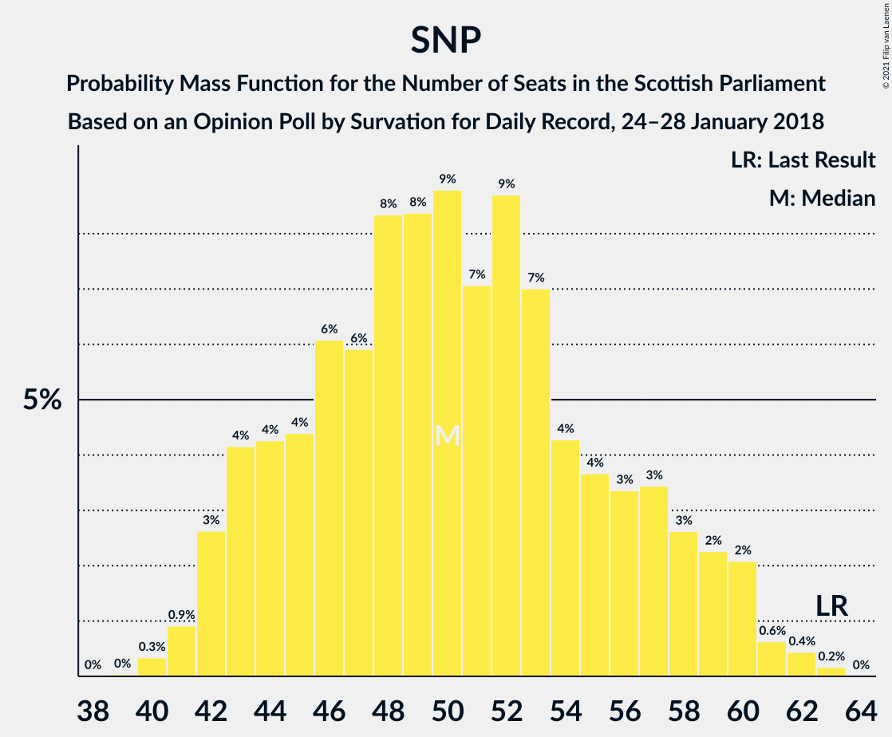

# Opinion Poll by Survation for Daily Record, 24–28 January 2018

<a href="#voting-intentions">Voting Intentions</a> | <a href="#seats">Seats</a> | <a href="#coalitions">Coalitions</a> | <a href="#technical-information">Technical Information</a>

## Voting Intentions

### Confidence Intervals

| Party | Last Result | Poll Result | 80% Confidence Interval | 90% Confidence Interval | 95% Confidence Interval | 99% Confidence Interval |
|:-----:|:-----------:|:-----------:|:-----------------------:|:-----------------------:|:-----------------------:|:-----------------------:|
| Scottish National Party | 41.7% | 33.0% | 31.2–35.0% |30.7–35.5% |30.2–36.0% |29.4–36.9% |
| Scottish Conservative & Unionist Party | 22.9% | 23.0% | 21.4–24.8% |21.0–25.3% |20.6–25.7% |19.8–26.6% |
| Scottish Labour | 19.1% | 23.0% | 21.4–24.8% |21.0–25.3% |20.6–25.7% |19.8–26.6% |
| Scottish Greens | 6.6% | 9.0% | 8.0–10.3% |7.7–10.6% |7.4–11.0% |7.0–11.6% |
| Scottish Liberal Democrats | 5.2% | 8.0% | 7.0–9.2% |6.7–9.5% |6.5–9.8% |6.0–10.4% |
| UK Independence Party | 2.0% | 3.0% | 2.4–3.8% |2.3–4.1% |2.1–4.3% |1.9–4.7% |

*Note:* The poll result column reflects the actual value used in the calculations. Published results may vary slightly, and in addition be rounded to fewer digits.

## Seats

### Confidence Intervals

| Party | Last Result | Median | 80% Confidence Interval | 90% Confidence Interval | 95% Confidence Interval | 99% Confidence Interval |
|:-----:|:-----------:|:------:|:-----------------------:|:-----------------------:|:-----------------------:|:-----------------------:|
| <a href="#scottish-national-party">Scottish National Party</a> | 63 | 50 | 44–57 |43–59 |42–60 |41–62 |
| <a href="#scottish-conservative-&-unionist-party">Scottish Conservative & Unionist Party</a> | 31 | 30 | 26–33 |25–33 |25–34 |24–35 |
| <a href="#scottish-labour">Scottish Labour</a> | 24 | 30 | 26–34 |26–35 |25–36 |24–37 |
| <a href="#scottish-greens">Scottish Greens</a> | 6 | 10 | 9–11 |9–11 |8–12 |6–14 |
| <a href="#scottish-liberal-democrats">Scottish Liberal Democrats</a> | 5 | 9 | 6–12 |6–12 |6–12 |5–13 |
| <a href="#uk-independence-party">UK Independence Party</a> | 0 | 0 | 0 |0 |0 |0–1 |

### Scottish National Party

*For a full overview of the results for this party, see the [Scottish National Party](party-scottishnationalparty.html) page.*

| Number of Seats | Probability | Accumulated | Special Marks |
|:---------------:|:-----------:|:-----------:|:-------------:|
| 39 | 0% | 100% |  |
| 40 | 0.3% | 99.9% |  |
| 41 | 0.9% | 99.6% |  |
| 42 | 3% | 98.7% |  |
| 43 | 4% | 96% |  |
| 44 | 4% | 92% |  |
| 45 | 4% | 88% |  |
| 46 | 6% | 83% |  |
| 47 | 6% | 77% |  |
| 48 | 8% | 71% |  |
| 49 | 8% | 63% |  |
| 50 | 9% | 55% | Median |
| 51 | 7% | 46% |  |
| 52 | 9% | 39% |  |
| 53 | 7% | 30% |  |
| 54 | 4% | 23% |  |
| 55 | 4% | 19% |  |
| 56 | 3% | 15% |  |
| 57 | 3% | 12% |  |
| 58 | 3% | 8% |  |
| 59 | 2% | 6% |  |
| 60 | 2% | 3% |  |
| 61 | 0.6% | 1.2% |  |
| 62 | 0.4% | 0.6% |  |
| 63 | 0.2% | 0.2% | Last Result |
| 64 | 0% | 0% |  |

### Scottish Conservative & Unionist Party

*For a full overview of the results for this party, see the [Scottish Conservative & Unionist Party](party-scottishconservativeunionistparty.html) page.*

| Number of Seats | Probability | Accumulated | Special Marks |
|:---------------:|:-----------:|:-----------:|:-------------:|
| 23 | 0.2% | 100% |  |
| 24 | 2% | 99.8% |  |
| 25 | 5% | 98% |  |
| 26 | 8% | 93% |  |
| 27 | 10% | 85% |  |
| 28 | 10% | 75% |  |
| 29 | 10% | 65% |  |
| 30 | 18% | 55% | Median |
| 31 | 14% | 37% | Last Result |
| 32 | 9% | 24% |  |
| 33 | 9% | 14% |  |
| 34 | 4% | 5% |  |
| 35 | 0.8% | 0.9% |  |
| 36 | 0.1% | 0.1% |  |
| 37 | 0% | 0% |  |

### Scottish Labour

*For a full overview of the results for this party, see the [Scottish Labour](party-scottishlabour.html) page.*

| Number of Seats | Probability | Accumulated | Special Marks |
|:---------------:|:-----------:|:-----------:|:-------------:|
| 23 | 0.2% | 100% |  |
| 24 | 0.8% | 99.8% | Last Result |
| 25 | 3% | 99.1% |  |
| 26 | 8% | 96% |  |
| 27 | 12% | 88% |  |
| 28 | 10% | 76% |  |
| 29 | 9% | 66% |  |
| 30 | 10% | 56% | Median |
| 31 | 12% | 46% |  |
| 32 | 12% | 34% |  |
| 33 | 6% | 22% |  |
| 34 | 8% | 16% |  |
| 35 | 4% | 7% |  |
| 36 | 2% | 3% |  |
| 37 | 0.7% | 1.1% |  |
| 38 | 0.3% | 0.4% |  |
| 39 | 0.1% | 0.1% |  |
| 40 | 0% | 0.1% |  |
| 41 | 0% | 0% |  |

### Scottish Greens

*For a full overview of the results for this party, see the [Scottish Greens](party-scottishgreens.html) page.*

| Number of Seats | Probability | Accumulated | Special Marks |
|:---------------:|:-----------:|:-----------:|:-------------:|
| 4 | 0.1% | 100% |  |
| 5 | 0.3% | 99.9% |  |
| 6 | 0.6% | 99.7% | Last Result |
| 7 | 0.9% | 99.0% |  |
| 8 | 3% | 98% |  |
| 9 | 6% | 95% |  |
| 10 | 77% | 89% | Median |
| 11 | 6% | 11% |  |
| 12 | 4% | 5% |  |
| 13 | 0.7% | 1.2% |  |
| 14 | 0.5% | 0.5% |  |
| 15 | 0% | 0% |  |

### Scottish Liberal Democrats

*For a full overview of the results for this party, see the [Scottish Liberal Democrats](party-scottishliberaldemocrats.html) page.*

| Number of Seats | Probability | Accumulated | Special Marks |
|:---------------:|:-----------:|:-----------:|:-------------:|
| 5 | 0.6% | 100% | Last Result |
| 6 | 13% | 99.4% |  |
| 7 | 10% | 87% |  |
| 8 | 12% | 76% |  |
| 9 | 17% | 64% | Median |
| 10 | 22% | 47% |  |
| 11 | 11% | 25% |  |
| 12 | 13% | 14% |  |
| 13 | 0.8% | 0.9% |  |
| 14 | 0% | 0% |  |

### UK Independence Party

*For a full overview of the results for this party, see the [UK Independence Party](party-ukindependenceparty.html) page.*

| Number of Seats | Probability | Accumulated | Special Marks |
|:---------------:|:-----------:|:-----------:|:-------------:|
| 0 | 99.1% | 100% | Last Result, Median |
| 1 | 0.7% | 0.9% |  |
| 2 | 0.1% | 0.2% |  |
| 3 | 0.1% | 0.1% |  |
| 4 | 0% | 0% |  |

## Coalitions

### Confidence Intervals

| Coalition | Last Result | Median | Majority? | 80% Confidence Interval | 90% Confidence Interval | 95% Confidence Interval | 99% Confidence Interval |
|:---------:|:-----------:|:------:|:---------:|:-----------------------:|:-----------------------:|:-----------------------:|:-----------------------:|
| Scottish Conservative & Unionist Party – Scottish Labour – Scottish Liberal Democrats | 60 | 69 | 81% | 62–75 | 61–76 | 59–77 | 58–78 |
| Scottish National Party – Scottish Greens | 69 | 60 | 19% | 54–67 | 53–68 | 52–70 | 51–71 |
| Scottish Conservative & Unionist Party – Scottish Labour | 55 | 60 | 10% | 53–64 | 52–66 | 51–67 | 50–69 |
| Scottish National Party | 63 | 50 | 0% | 44–57 | 43–59 | 42–60 | 41–62 |
| Scottish Labour – Scottish Greens – Scottish Liberal Democrats | 35 | 49 | 0% | 44–55 | 43–56 | 42–57 | 41–58 |
| Scottish Labour – Scottish Liberal Democrats | 29 | 39 | 0% | 35–44 | 34–46 | 33–46 | 31–48 |
| Scottish Conservative & Unionist Party – Scottish Liberal Democrats | 36 | 39 | 0% | 34–43 | 33–43 | 32–44 | 31–45 |

### Scottish Conservative & Unionist Party – Scottish Labour – Scottish Liberal Democrats

| Number of Seats | Probability | Accumulated | Special Marks |
|:---------------:|:-----------:|:-----------:|:-------------:|
| 56 | 0.2% | 100% |  |
| 57 | 0.3% | 99.8% |  |
| 58 | 0.6% | 99.6% |  |
| 59 | 1.5% | 99.0% |  |
| 60 | 2% | 97% | Last Result |
| 61 | 2% | 95% |  |
| 62 | 4% | 93% |  |
| 63 | 4% | 89% |  |
| 64 | 4% | 85% |  |
| 65 | 4% | 81% | Majority |
| 66 | 7% | 77% |  |
| 67 | 8% | 71% |  |
| 68 | 8% | 63% |  |
| 69 | 9% | 55% | Median |
| 70 | 9% | 46% |  |
| 71 | 8% | 37% |  |
| 72 | 6% | 28% |  |
| 73 | 6% | 22% |  |
| 74 | 5% | 16% |  |
| 75 | 4% | 11% |  |
| 76 | 4% | 7% |  |
| 77 | 2% | 3% |  |
| 78 | 0.9% | 1.3% |  |
| 79 | 0.3% | 0.4% |  |
| 80 | 0.1% | 0.1% |  |
| 81 | 0% | 0% |  |

### Scottish National Party – Scottish Greens

| Number of Seats | Probability | Accumulated | Special Marks |
|:---------------:|:-----------:|:-----------:|:-------------:|
| 49 | 0.1% | 100% |  |
| 50 | 0.3% | 99.9% |  |
| 51 | 0.9% | 99.6% |  |
| 52 | 2% | 98.7% |  |
| 53 | 4% | 97% |  |
| 54 | 4% | 93% |  |
| 55 | 5% | 89% |  |
| 56 | 6% | 84% |  |
| 57 | 6% | 78% |  |
| 58 | 8% | 72% |  |
| 59 | 9% | 63% |  |
| 60 | 9% | 54% | Median |
| 61 | 8% | 45% |  |
| 62 | 8% | 37% |  |
| 63 | 7% | 29% |  |
| 64 | 4% | 22% |  |
| 65 | 4% | 19% | Majority |
| 66 | 4% | 15% |  |
| 67 | 4% | 11% |  |
| 68 | 2% | 7% |  |
| 69 | 2% | 5% | Last Result |
| 70 | 2% | 3% |  |
| 71 | 0.6% | 1.0% |  |
| 72 | 0.3% | 0.4% |  |
| 73 | 0.2% | 0.2% |  |
| 74 | 0% | 0% |  |

### Scottish Conservative & Unionist Party – Scottish Labour

| Number of Seats | Probability | Accumulated | Special Marks |
|:---------------:|:-----------:|:-----------:|:-------------:|
| 48 | 0.1% | 100% |  |
| 49 | 0.2% | 99.9% |  |
| 50 | 0.7% | 99.7% |  |
| 51 | 2% | 99.0% |  |
| 52 | 4% | 97% |  |
| 53 | 4% | 94% |  |
| 54 | 3% | 90% |  |
| 55 | 4% | 87% | Last Result |
| 56 | 6% | 82% |  |
| 57 | 7% | 77% |  |
| 58 | 6% | 69% |  |
| 59 | 8% | 64% |  |
| 60 | 13% | 56% | Median |
| 61 | 7% | 43% |  |
| 62 | 8% | 36% |  |
| 63 | 10% | 28% |  |
| 64 | 8% | 18% |  |
| 65 | 3% | 10% | Majority |
| 66 | 2% | 7% |  |
| 67 | 2% | 4% |  |
| 68 | 1.2% | 2% |  |
| 69 | 0.6% | 0.9% |  |
| 70 | 0.3% | 0.3% |  |
| 71 | 0% | 0% |  |

### Scottish National Party

| Number of Seats | Probability | Accumulated | Special Marks |
|:---------------:|:-----------:|:-----------:|:-------------:|
| 39 | 0% | 100% |  |
| 40 | 0.3% | 99.9% |  |
| 41 | 0.9% | 99.6% |  |
| 42 | 3% | 98.7% |  |
| 43 | 4% | 96% |  |
| 44 | 4% | 92% |  |
| 45 | 4% | 88% |  |
| 46 | 6% | 83% |  |
| 47 | 6% | 77% |  |
| 48 | 8% | 71% |  |
| 49 | 8% | 63% |  |
| 50 | 9% | 55% | Median |
| 51 | 7% | 46% |  |
| 52 | 9% | 39% |  |
| 53 | 7% | 30% |  |
| 54 | 4% | 23% |  |
| 55 | 4% | 19% |  |
| 56 | 3% | 15% |  |
| 57 | 3% | 12% |  |
| 58 | 3% | 8% |  |
| 59 | 2% | 6% |  |
| 60 | 2% | 3% |  |
| 61 | 0.6% | 1.2% |  |
| 62 | 0.4% | 0.6% |  |
| 63 | 0.2% | 0.2% | Last Result |
| 64 | 0% | 0% |  |

### Scottish Labour – Scottish Greens – Scottish Liberal Democrats

| Number of Seats | Probability | Accumulated | Special Marks |
|:---------------:|:-----------:|:-----------:|:-------------:|
| 35 | 0% | 100% | Last Result |
| 36 | 0% | 100% |  |
| 37 | 0% | 100% |  |
| 38 | 0% | 100% |  |
| 39 | 0.1% | 100% |  |
| 40 | 0.2% | 99.9% |  |
| 41 | 0.9% | 99.6% |  |
| 42 | 2% | 98.8% |  |
| 43 | 3% | 97% |  |
| 44 | 5% | 94% |  |
| 45 | 6% | 89% |  |
| 46 | 7% | 83% |  |
| 47 | 8% | 76% |  |
| 48 | 12% | 68% |  |
| 49 | 10% | 56% | Median |
| 50 | 13% | 47% |  |
| 51 | 8% | 34% |  |
| 52 | 5% | 26% |  |
| 53 | 7% | 21% |  |
| 54 | 4% | 14% |  |
| 55 | 4% | 10% |  |
| 56 | 4% | 7% |  |
| 57 | 2% | 3% |  |
| 58 | 0.6% | 0.9% |  |
| 59 | 0.2% | 0.3% |  |
| 60 | 0.1% | 0.2% |  |
| 61 | 0% | 0% |  |

### Scottish Labour – Scottish Liberal Democrats

| Number of Seats | Probability | Accumulated | Special Marks |
|:---------------:|:-----------:|:-----------:|:-------------:|
| 29 | 0% | 100% | Last Result |
| 30 | 0.1% | 100% |  |
| 31 | 0.7% | 99.8% |  |
| 32 | 1.3% | 99.2% |  |
| 33 | 3% | 98% |  |
| 34 | 5% | 95% |  |
| 35 | 6% | 90% |  |
| 36 | 7% | 85% |  |
| 37 | 9% | 77% |  |
| 38 | 13% | 69% |  |
| 39 | 9% | 56% | Median |
| 40 | 14% | 47% |  |
| 41 | 8% | 33% |  |
| 42 | 5% | 25% |  |
| 43 | 7% | 20% |  |
| 44 | 4% | 13% |  |
| 45 | 3% | 9% |  |
| 46 | 3% | 6% |  |
| 47 | 1.4% | 2% |  |
| 48 | 0.6% | 0.9% |  |
| 49 | 0.2% | 0.3% |  |
| 50 | 0.1% | 0.2% |  |
| 51 | 0% | 0.1% |  |
| 52 | 0% | 0% |  |

### Scottish Conservative & Unionist Party – Scottish Liberal Democrats

| Number of Seats | Probability | Accumulated | Special Marks |
|:---------------:|:-----------:|:-----------:|:-------------:|
| 29 | 0.1% | 100% |  |
| 30 | 0.1% | 99.9% |  |
| 31 | 0.6% | 99.8% |  |
| 32 | 2% | 99.2% |  |
| 33 | 4% | 97% |  |
| 34 | 4% | 93% |  |
| 35 | 6% | 89% |  |
| 36 | 8% | 82% | Last Result |
| 37 | 9% | 74% |  |
| 38 | 10% | 66% |  |
| 39 | 14% | 56% | Median |
| 40 | 12% | 42% |  |
| 41 | 11% | 30% |  |
| 42 | 10% | 20% |  |
| 43 | 6% | 10% |  |
| 44 | 3% | 4% |  |
| 45 | 1.4% | 2% |  |
| 46 | 0.2% | 0.3% |  |
| 47 | 0% | 0.1% |  |
| 48 | 0% | 0% |  |

## Technical Information

### Opinion Poll

+ **Polling firm:** Survation
+ **Commissioner(s):** Daily Record
+ **Fieldwork period:** 24–28 January 2018

### Calculations

+ **Sample size:** 1029
+ **Simulations done:** 1,048,576
+ **Error estimate:** 0.85%

