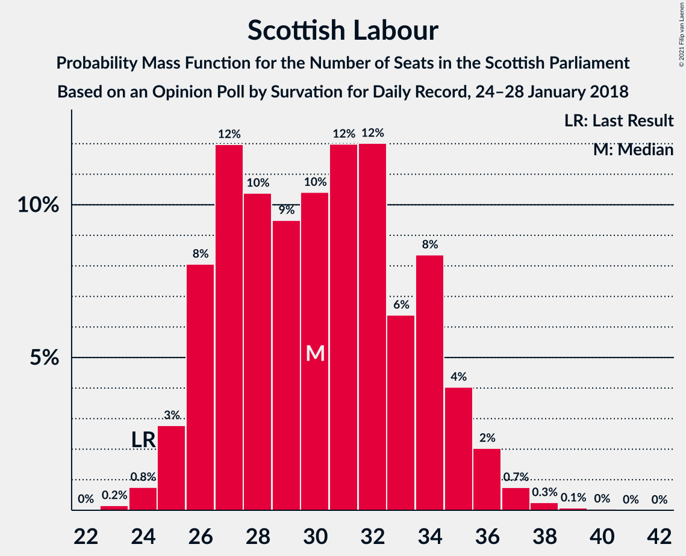
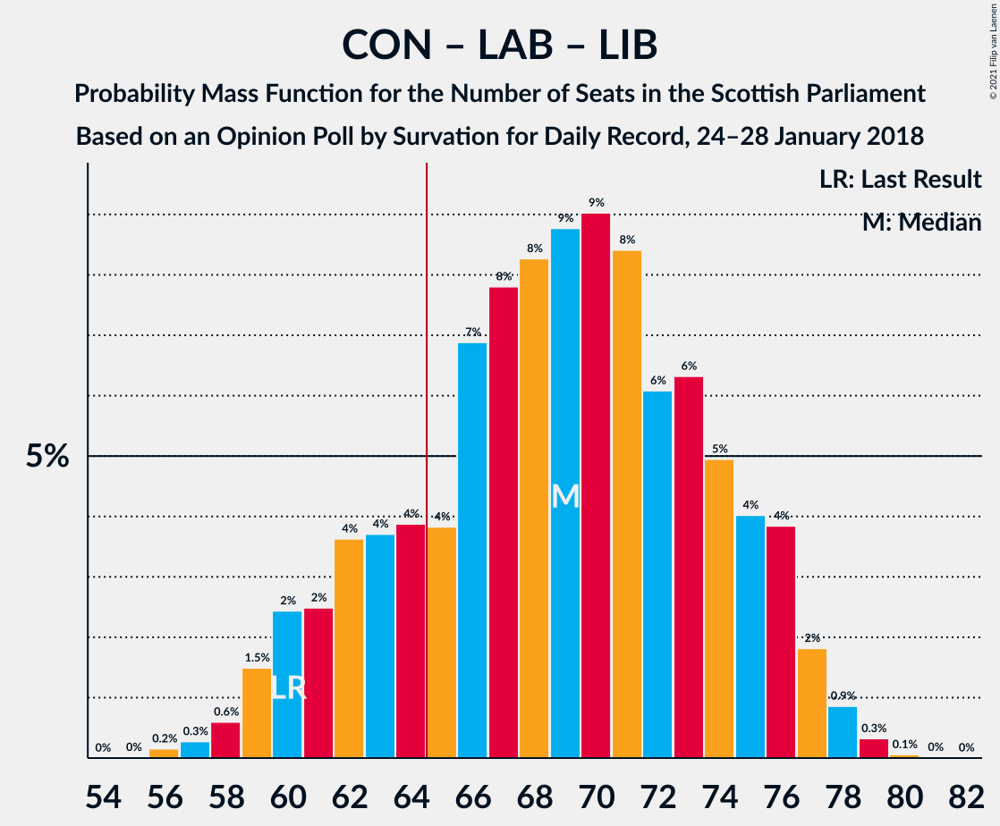

# Opinion Poll by Survation for Daily Record, 24–28 January 2018

<a href="#voting-intentions">Voting Intentions</a> | <a href="#seats">Seats</a> | <a href="#coalitions">Coalitions</a> | <a href="#technical-information">Technical Information</a>

## Voting Intentions

### Confidence Intervals

| Party | Last Result | Poll Result | 80% Confidence Interval | 90% Confidence Interval | 95% Confidence Interval | 99% Confidence Interval |
|:-----:|:-----------:|:-----------:|:-----------------------:|:-----------------------:|:-----------------------:|:-----------------------:|
| Scottish National Party | 41.7% | 33.0% | 31.2–35.0% |30.7–35.5% |30.2–36.0% |29.4–36.9% |
| Scottish Conservative & Unionist Party | 22.9% | 23.0% | 21.4–24.8% |21.0–25.3% |20.6–25.7% |19.8–26.6% |
| Scottish Labour | 19.1% | 23.0% | 21.4–24.8% |21.0–25.3% |20.6–25.7% |19.8–26.6% |
| Scottish Greens | 6.6% | 9.0% | 8.0–10.3% |7.7–10.6% |7.4–11.0% |7.0–11.6% |
| Scottish Liberal Democrats | 5.2% | 8.0% | 7.0–9.2% |6.7–9.5% |6.5–9.8% |6.0–10.4% |
| UK Independence Party | 2.0% | 3.0% | 2.4–3.8% |2.3–4.1% |2.1–4.3% |1.9–4.7% |

*Note:* The poll result column reflects the actual value used in the calculations. Published results may vary slightly, and in addition be rounded to fewer digits.

## Seats

### Confidence Intervals

| Party | Last Result | Median | 80% Confidence Interval | 90% Confidence Interval | 95% Confidence Interval | 99% Confidence Interval |
|:-----:|:-----------:|:------:|:-----------------------:|:-----------------------:|:-----------------------:|:-----------------------:|
| <a href="#scottish-national-party">Scottish National Party</a> | 63 | 55 | 51–60 |50–61 |48–62 |46–63 |
| <a href="#scottish-conservative-&-unionist-party">Scottish Conservative & Unionist Party</a> | 31 | 28 | 24–32 |24–33 |24–33 |23–34 |
| <a href="#scottish-labour">Scottish Labour</a> | 24 | 27 | 26–31 |25–32 |25–33 |24–34 |
| <a href="#scottish-greens">Scottish Greens</a> | 6 | 10 | 8–10 |8–11 |7–11 |5–12 |
| <a href="#scottish-liberal-democrats">Scottish Liberal Democrats</a> | 5 | 8 | 6–10 |6–10 |6–11 |5–11 |
| <a href="#uk-independence-party">UK Independence Party</a> | 0 | 0 | 0 |0 |0 |0–1 |

### Scottish National Party

*For a full overview of the results for this party, see the [Scottish National Party](party-scottishnationalparty.html) page.*

| Number of Seats | Probability | Accumulated | Special Marks |
|:---------------:|:-----------:|:-----------:|:-------------:|
| 43 | 0.1% | 100% |  |
| 44 | 0% | 99.9% |  |
| 45 | 0.3% | 99.9% |  |
| 46 | 0.4% | 99.6% |  |
| 47 | 0.3% | 99.2% |  |
| 48 | 2% | 98.9% |  |
| 49 | 2% | 97% |  |
| 50 | 2% | 96% |  |
| 51 | 3% | 93% |  |
| 52 | 10% | 90% |  |
| 53 | 14% | 79% |  |
| 54 | 13% | 65% |  |
| 55 | 5% | 52% | Median |
| 56 | 5% | 48% |  |
| 57 | 6% | 43% |  |
| 58 | 8% | 37% |  |
| 59 | 10% | 29% |  |
| 60 | 11% | 19% |  |
| 61 | 4% | 8% |  |
| 62 | 3% | 5% |  |
| 63 | 1.2% | 1.3% | Last Result |
| 64 | 0.1% | 0.1% |  |
| 65 | 0% | 0% | Majority |

### Scottish Conservative & Unionist Party

*For a full overview of the results for this party, see the [Scottish Conservative & Unionist Party](party-scottishconservativeunionistparty.html) page.*

| Number of Seats | Probability | Accumulated | Special Marks |
|:---------------:|:-----------:|:-----------:|:-------------:|
| 22 | 0.1% | 100% |  |
| 23 | 0.4% | 99.9% |  |
| 24 | 10% | 99.5% |  |
| 25 | 20% | 90% |  |
| 26 | 5% | 70% |  |
| 27 | 6% | 64% |  |
| 28 | 15% | 59% | Median |
| 29 | 13% | 44% |  |
| 30 | 10% | 31% |  |
| 31 | 7% | 21% | Last Result |
| 32 | 6% | 14% |  |
| 33 | 6% | 8% |  |
| 34 | 1.4% | 2% |  |
| 35 | 0.1% | 0.1% |  |
| 36 | 0% | 0% |  |

### Scottish Labour

*For a full overview of the results for this party, see the [Scottish Labour](party-scottishlabour.html) page.*

| Number of Seats | Probability | Accumulated | Special Marks |
|:---------------:|:-----------:|:-----------:|:-------------:|
| 22 | 0.1% | 100% |  |
| 23 | 0.2% | 99.9% |  |
| 24 | 1.4% | 99.7% | Last Result |
| 25 | 7% | 98% |  |
| 26 | 20% | 91% |  |
| 27 | 28% | 71% | Median |
| 28 | 12% | 43% |  |
| 29 | 11% | 31% |  |
| 30 | 4% | 21% |  |
| 31 | 9% | 16% |  |
| 32 | 4% | 7% |  |
| 33 | 2% | 3% |  |
| 34 | 0.4% | 0.7% |  |
| 35 | 0.2% | 0.3% |  |
| 36 | 0% | 0.1% |  |
| 37 | 0% | 0.1% |  |
| 38 | 0% | 0% |  |

### Scottish Greens

*For a full overview of the results for this party, see the [Scottish Greens](party-scottishgreens.html) page.*

| Number of Seats | Probability | Accumulated | Special Marks |
|:---------------:|:-----------:|:-----------:|:-------------:|
| 4 | 0.2% | 100% |  |
| 5 | 0.6% | 99.7% |  |
| 6 | 0.7% | 99.1% | Last Result |
| 7 | 2% | 98% |  |
| 8 | 14% | 97% |  |
| 9 | 18% | 83% |  |
| 10 | 57% | 64% | Median |
| 11 | 5% | 8% |  |
| 12 | 2% | 2% |  |
| 13 | 0.3% | 0.3% |  |
| 14 | 0% | 0% |  |

### Scottish Liberal Democrats

*For a full overview of the results for this party, see the [Scottish Liberal Democrats](party-scottishliberaldemocrats.html) page.*

| Number of Seats | Probability | Accumulated | Special Marks |
|:---------------:|:-----------:|:-----------:|:-------------:|
| 4 | 0.2% | 100% |  |
| 5 | 2% | 99.8% | Last Result |
| 6 | 10% | 98% |  |
| 7 | 21% | 88% |  |
| 8 | 32% | 67% | Median |
| 9 | 22% | 34% |  |
| 10 | 8% | 13% |  |
| 11 | 4% | 4% |  |
| 12 | 0.3% | 0.3% |  |
| 13 | 0% | 0% |  |

### UK Independence Party

*For a full overview of the results for this party, see the [UK Independence Party](party-ukindependenceparty.html) page.*

| Number of Seats | Probability | Accumulated | Special Marks |
|:---------------:|:-----------:|:-----------:|:-------------:|
| 0 | 99.0% | 100% | Last Result, Median |
| 1 | 0.8% | 1.0% |  |
| 2 | 0.1% | 0.2% |  |
| 3 | 0% | 0% |  |

## Coalitions

### Confidence Intervals

| Coalition | Last Result | Median | Majority? | 80% Confidence Interval | 90% Confidence Interval | 95% Confidence Interval | 99% Confidence Interval |
|:---------:|:-----------:|:------:|:---------:|:-----------------------:|:-----------------------:|:-----------------------:|:-----------------------:|
| Scottish National Party – Scottish Greens | 69 | 65 | 52% | 60–70 | 59–71 | 58–72 | 55–73 |
| Scottish Conservative & Unionist Party – Scottish Labour – Scottish Liberal Democrats | 60 | 64 | 48% | 59–69 | 58–70 | 57–71 | 56–74 |
| Scottish Conservative & Unionist Party – Scottish Labour | 55 | 56 | 0.8% | 51–60 | 51–62 | 50–63 | 48–66 |
| Scottish National Party | 63 | 55 | 0% | 51–60 | 50–61 | 48–62 | 46–63 |
| Scottish Labour – Scottish Greens – Scottish Liberal Democrats | 35 | 45 | 0% | 43–49 | 42–50 | 41–51 | 39–54 |
| Scottish Labour – Scottish Liberal Democrats | 29 | 36 | 0% | 33–40 | 32–40 | 32–41 | 30–43 |
| Scottish Conservative & Unionist Party – Scottish Liberal Democrats | 36 | 36 | 0% | 32–40 | 32–41 | 31–41 | 30–42 |

### Scottish National Party – Scottish Greens

| Number of Seats | Probability | Accumulated | Special Marks |
|:---------------:|:-----------:|:-----------:|:-------------:|
| 53 | 0.1% | 100% |  |
| 54 | 0.1% | 99.9% |  |
| 55 | 0.4% | 99.8% |  |
| 56 | 0.3% | 99.5% |  |
| 57 | 0.6% | 99.2% |  |
| 58 | 2% | 98.6% |  |
| 59 | 2% | 97% |  |
| 60 | 5% | 95% |  |
| 61 | 11% | 90% |  |
| 62 | 6% | 78% |  |
| 63 | 12% | 72% |  |
| 64 | 9% | 60% |  |
| 65 | 5% | 52% | Median, Majority |
| 66 | 7% | 47% |  |
| 67 | 8% | 40% |  |
| 68 | 8% | 33% |  |
| 69 | 11% | 25% | Last Result |
| 70 | 7% | 14% |  |
| 71 | 3% | 7% |  |
| 72 | 2% | 3% |  |
| 73 | 1.1% | 1.2% |  |
| 74 | 0.1% | 0.1% |  |
| 75 | 0% | 0% |  |

### Scottish Conservative & Unionist Party – Scottish Labour – Scottish Liberal Democrats

| Number of Seats | Probability | Accumulated | Special Marks |
|:---------------:|:-----------:|:-----------:|:-------------:|
| 55 | 0.1% | 100% |  |
| 56 | 1.2% | 99.9% |  |
| 57 | 2% | 98.7% |  |
| 58 | 3% | 97% |  |
| 59 | 7% | 93% |  |
| 60 | 11% | 86% | Last Result |
| 61 | 8% | 75% |  |
| 62 | 8% | 67% |  |
| 63 | 7% | 60% | Median |
| 64 | 5% | 53% |  |
| 65 | 9% | 48% | Majority |
| 66 | 12% | 39% |  |
| 67 | 6% | 27% |  |
| 68 | 11% | 22% |  |
| 69 | 5% | 10% |  |
| 70 | 2% | 5% |  |
| 71 | 2% | 3% |  |
| 72 | 0.6% | 1.4% |  |
| 73 | 0.3% | 0.8% |  |
| 74 | 0.4% | 0.5% |  |
| 75 | 0.1% | 0.2% |  |
| 76 | 0.1% | 0.1% |  |
| 77 | 0% | 0% |  |

### Scottish Conservative & Unionist Party – Scottish Labour

| Number of Seats | Probability | Accumulated | Special Marks |
|:---------------:|:-----------:|:-----------:|:-------------:|
| 47 | 0.1% | 100% |  |
| 48 | 0.7% | 99.9% |  |
| 49 | 0.9% | 99.2% |  |
| 50 | 3% | 98% |  |
| 51 | 7% | 96% |  |
| 52 | 13% | 89% |  |
| 53 | 8% | 76% |  |
| 54 | 5% | 68% |  |
| 55 | 13% | 63% | Last Result, Median |
| 56 | 8% | 50% |  |
| 57 | 9% | 42% |  |
| 58 | 4% | 33% |  |
| 59 | 11% | 28% |  |
| 60 | 9% | 17% |  |
| 61 | 2% | 9% |  |
| 62 | 3% | 7% |  |
| 63 | 2% | 4% |  |
| 64 | 1.4% | 2% |  |
| 65 | 0.3% | 0.8% | Majority |
| 66 | 0.3% | 0.6% |  |
| 67 | 0.2% | 0.3% |  |
| 68 | 0.1% | 0.1% |  |
| 69 | 0% | 0% |  |

### Scottish National Party

| Number of Seats | Probability | Accumulated | Special Marks |
|:---------------:|:-----------:|:-----------:|:-------------:|
| 43 | 0.1% | 100% |  |
| 44 | 0% | 99.9% |  |
| 45 | 0.3% | 99.9% |  |
| 46 | 0.4% | 99.6% |  |
| 47 | 0.3% | 99.2% |  |
| 48 | 2% | 98.9% |  |
| 49 | 2% | 97% |  |
| 50 | 2% | 96% |  |
| 51 | 3% | 93% |  |
| 52 | 10% | 90% |  |
| 53 | 14% | 79% |  |
| 54 | 13% | 65% |  |
| 55 | 5% | 52% | Median |
| 56 | 5% | 48% |  |
| 57 | 6% | 43% |  |
| 58 | 8% | 37% |  |
| 59 | 10% | 29% |  |
| 60 | 11% | 19% |  |
| 61 | 4% | 8% |  |
| 62 | 3% | 5% |  |
| 63 | 1.2% | 1.3% | Last Result |
| 64 | 0.1% | 0.1% |  |
| 65 | 0% | 0% | Majority |

### Scottish Labour – Scottish Greens – Scottish Liberal Democrats

| Number of Seats | Probability | Accumulated | Special Marks |
|:---------------:|:-----------:|:-----------:|:-------------:|
| 35 | 0% | 100% | Last Result |
| 36 | 0% | 100% |  |
| 37 | 0% | 100% |  |
| 38 | 0.1% | 99.9% |  |
| 39 | 0.4% | 99.9% |  |
| 40 | 0.6% | 99.4% |  |
| 41 | 2% | 98.8% |  |
| 42 | 6% | 97% |  |
| 43 | 9% | 90% |  |
| 44 | 21% | 81% |  |
| 45 | 20% | 60% | Median |
| 46 | 13% | 40% |  |
| 47 | 7% | 27% |  |
| 48 | 6% | 19% |  |
| 49 | 8% | 13% |  |
| 50 | 2% | 6% |  |
| 51 | 2% | 3% |  |
| 52 | 0.5% | 2% |  |
| 53 | 0.4% | 1.0% |  |
| 54 | 0.5% | 0.6% |  |
| 55 | 0.1% | 0.2% |  |
| 56 | 0% | 0.1% |  |
| 57 | 0% | 0% |  |

### Scottish Labour – Scottish Liberal Democrats

| Number of Seats | Probability | Accumulated | Special Marks |
|:---------------:|:-----------:|:-----------:|:-------------:|
| 29 | 0.1% | 100% | Last Result |
| 30 | 0.7% | 99.9% |  |
| 31 | 1.5% | 99.2% |  |
| 32 | 3% | 98% |  |
| 33 | 8% | 95% |  |
| 34 | 18% | 87% |  |
| 35 | 18% | 69% | Median |
| 36 | 16% | 51% |  |
| 37 | 12% | 34% |  |
| 38 | 8% | 23% |  |
| 39 | 3% | 14% |  |
| 40 | 9% | 11% |  |
| 41 | 1.5% | 3% |  |
| 42 | 0.5% | 1.4% |  |
| 43 | 0.5% | 0.9% |  |
| 44 | 0.2% | 0.4% |  |
| 45 | 0.1% | 0.1% |  |
| 46 | 0% | 0% |  |

### Scottish Conservative & Unionist Party – Scottish Liberal Democrats

| Number of Seats | Probability | Accumulated | Special Marks |
|:---------------:|:-----------:|:-----------:|:-------------:|
| 28 | 0.1% | 100% |  |
| 29 | 0.4% | 99.9% |  |
| 30 | 0.8% | 99.5% |  |
| 31 | 3% | 98.7% |  |
| 32 | 11% | 96% |  |
| 33 | 16% | 85% |  |
| 34 | 5% | 69% |  |
| 35 | 10% | 64% |  |
| 36 | 7% | 54% | Last Result, Median |
| 37 | 8% | 47% |  |
| 38 | 11% | 39% |  |
| 39 | 12% | 28% |  |
| 40 | 10% | 16% |  |
| 41 | 4% | 6% |  |
| 42 | 1.4% | 2% |  |
| 43 | 0.2% | 0.3% |  |
| 44 | 0% | 0.1% |  |
| 45 | 0% | 0% |  |

## Technical Information

### Opinion Poll

+ **Polling firm:** Survation
+ **Commissioner(s):** Daily Record
+ **Fieldwork period:** 24–28 January 2018

### Calculations

+ **Sample size:** 1029
+ **Simulations done:** 131,072
+ **Error estimate:** 0.85%

