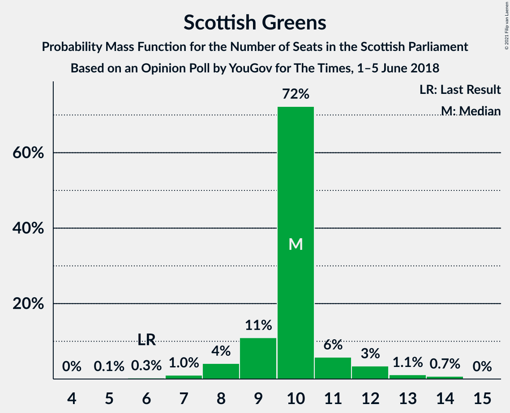
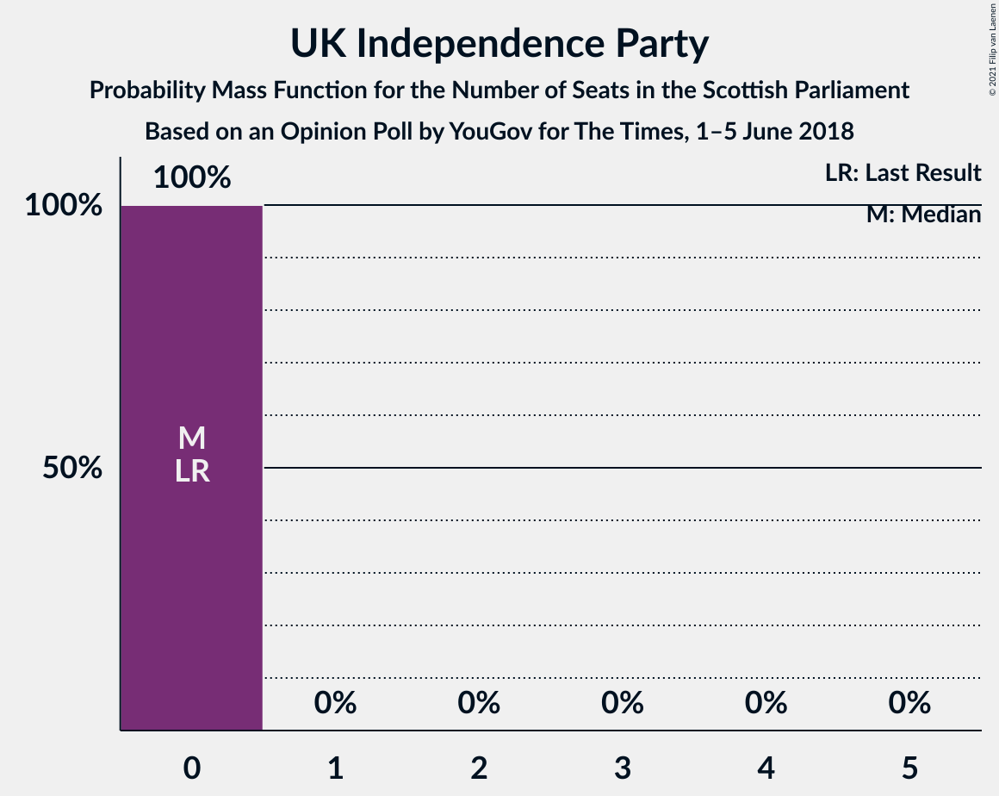
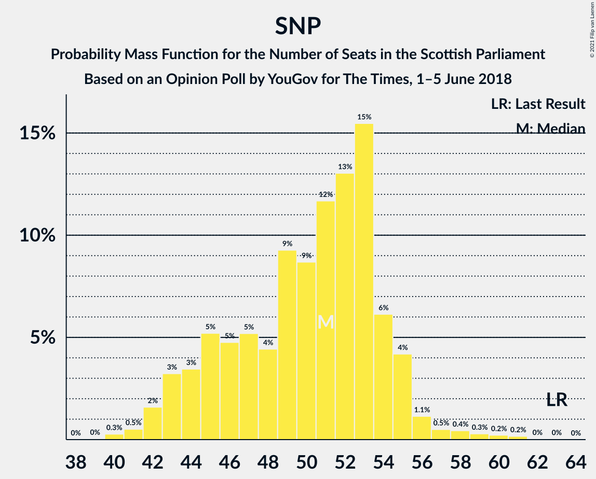
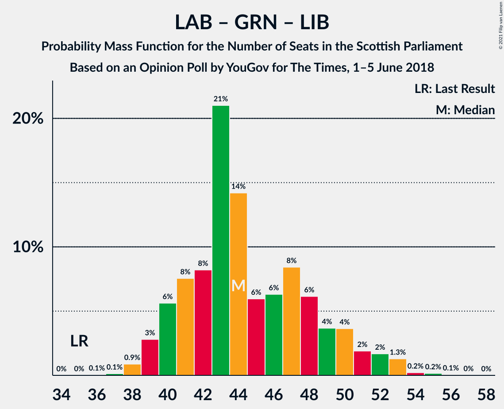

# Opinion Poll by YouGov for The Times, 1–5 June 2018

<a href="#voting-intentions">Voting Intentions</a> | <a href="#seats">Seats</a> | <a href="#coalitions">Coalitions</a> | <a href="#technical-information">Technical Information</a>

## Voting Intentions

### Confidence Intervals

| Party | Last Result | Poll Result | 80% Confidence Interval | 90% Confidence Interval | 95% Confidence Interval | 99% Confidence Interval |
|:-----:|:-----------:|:-----------:|:-----------------------:|:-----------------------:|:-----------------------:|:-----------------------:|
| Scottish National Party | 41.7% | 32.3% | 30.5–34.2% |30.0–34.7% |29.5–35.1% |28.7–36.0% |
| Scottish Conservative & Unionist Party | 22.9% | 26.2% | 24.6–28.0% |24.1–28.5% |23.7–29.0% |22.9–29.8% |
| Scottish Labour | 19.1% | 21.1% | 19.6–22.8% |19.1–23.3% |18.8–23.7% |18.1–24.5% |
| Scottish Greens | 6.6% | 9.0% | 8.0–10.2% |7.7–10.6% |7.5–10.9% |7.0–11.5% |
| Scottish Liberal Democrats | 5.2% | 7.1% | 6.2–8.2% |5.9–8.5% |5.7–8.8% |5.3–9.3% |
| Scottish Socialist Party | 0.5% | 3.0% | 2.4–3.8% |2.2–4.0% |2.1–4.2% |1.9–4.6% |
| UK Independence Party | 2.0% | 1.0% | 0.7–1.5% |0.6–1.7% |0.6–1.8% |0.5–2.1% |

*Note:* The poll result column reflects the actual value used in the calculations. Published results may vary slightly, and in addition be rounded to fewer digits.

## Seats

### Confidence Intervals

| Party | Last Result | Median | 80% Confidence Interval | 90% Confidence Interval | 95% Confidence Interval | 99% Confidence Interval |
|:-----:|:-----------:|:------:|:-----------------------:|:-----------------------:|:-----------------------:|:-----------------------:|
| <a href="#scottish-national-party">Scottish National Party</a> | 63 | 53 | 46–55 |44–56 |43–58 |42–61 |
| <a href="#scottish-conservative-&-unionist-party">Scottish Conservative & Unionist Party</a> | 31 | 34 | 32–37 |31–38 |30–39 |28–39 |
| <a href="#scottish-labour">Scottish Labour</a> | 24 | 26 | 24–30 |23–31 |23–32 |21–34 |
| <a href="#scottish-greens">Scottish Greens</a> | 6 | 10 | 9–11 |8–12 |8–12 |6–14 |
| <a href="#scottish-liberal-democrats">Scottish Liberal Democrats</a> | 5 | 6 | 6–9 |5–11 |5–12 |4–12 |
| <a href="#scottish-socialist-party">Scottish Socialist Party</a> | 0 | 0 | 0 |0 |0 |0 |
| <a href="#uk-independence-party">UK Independence Party</a> | 0 | 0 | 0 |0 |0 |0 |

### Scottish National Party

*For a full overview of the results for this party, see the [Scottish National Party](party-scottishnationalparty.html) page.*

| Number of Seats | Probability | Accumulated | Special Marks |
|:---------------:|:-----------:|:-----------:|:-------------:|
| 40 | 0.1% | 100% |  |
| 41 | 0.2% | 99.9% |  |
| 42 | 1.5% | 99.7% |  |
| 43 | 3% | 98% |  |
| 44 | 2% | 96% |  |
| 45 | 3% | 93% |  |
| 46 | 1.2% | 91% |  |
| 47 | 8% | 89% |  |
| 48 | 3% | 81% |  |
| 49 | 3% | 78% |  |
| 50 | 6% | 75% |  |
| 51 | 5% | 69% |  |
| 52 | 13% | 64% |  |
| 53 | 23% | 51% | Median |
| 54 | 12% | 28% |  |
| 55 | 9% | 16% |  |
| 56 | 3% | 7% |  |
| 57 | 1.1% | 4% |  |
| 58 | 1.1% | 3% |  |
| 59 | 0.5% | 2% |  |
| 60 | 0.4% | 1.3% |  |
| 61 | 0.7% | 1.0% |  |
| 62 | 0.1% | 0.3% |  |
| 63 | 0.1% | 0.1% | Last Result |
| 64 | 0% | 0% |  |

### Scottish Conservative & Unionist Party

*For a full overview of the results for this party, see the [Scottish Conservative & Unionist Party](party-scottishconservativeunionistparty.html) page.*

| Number of Seats | Probability | Accumulated | Special Marks |
|:---------------:|:-----------:|:-----------:|:-------------:|
| 26 | 0.1% | 100% |  |
| 27 | 0.3% | 99.9% |  |
| 28 | 0.6% | 99.6% |  |
| 29 | 1.1% | 99.0% |  |
| 30 | 2% | 98% |  |
| 31 | 5% | 96% | Last Result |
| 32 | 5% | 90% |  |
| 33 | 24% | 85% |  |
| 34 | 24% | 60% | Median |
| 35 | 15% | 36% |  |
| 36 | 10% | 21% |  |
| 37 | 3% | 11% |  |
| 38 | 4% | 8% |  |
| 39 | 3% | 4% |  |
| 40 | 0.2% | 0.4% |  |
| 41 | 0.1% | 0.2% |  |
| 42 | 0% | 0% |  |

### Scottish Labour

*For a full overview of the results for this party, see the [Scottish Labour](party-scottishlabour.html) page.*

| Number of Seats | Probability | Accumulated | Special Marks |
|:---------------:|:-----------:|:-----------:|:-------------:|
| 20 | 0.2% | 100% |  |
| 21 | 0.6% | 99.8% |  |
| 22 | 1.4% | 99.3% |  |
| 23 | 6% | 98% |  |
| 24 | 5% | 92% | Last Result |
| 25 | 19% | 88% |  |
| 26 | 26% | 68% | Median |
| 27 | 14% | 42% |  |
| 28 | 7% | 28% |  |
| 29 | 11% | 21% |  |
| 30 | 3% | 10% |  |
| 31 | 2% | 7% |  |
| 32 | 2% | 4% |  |
| 33 | 1.2% | 2% |  |
| 34 | 0.8% | 1.1% |  |
| 35 | 0.3% | 0.3% |  |
| 36 | 0% | 0% |  |

### Scottish Greens

*For a full overview of the results for this party, see the [Scottish Greens](party-scottishgreens.html) page.*

| Number of Seats | Probability | Accumulated | Special Marks |
|:---------------:|:-----------:|:-----------:|:-------------:|
| 4 | 0.1% | 100% |  |
| 5 | 0.1% | 99.9% |  |
| 6 | 0.4% | 99.8% | Last Result |
| 7 | 1.3% | 99.4% |  |
| 8 | 6% | 98% |  |
| 9 | 15% | 93% |  |
| 10 | 64% | 77% | Median |
| 11 | 8% | 13% |  |
| 12 | 4% | 5% |  |
| 13 | 0.8% | 1.3% |  |
| 14 | 0.5% | 0.5% |  |
| 15 | 0% | 0% |  |

### Scottish Liberal Democrats

*For a full overview of the results for this party, see the [Scottish Liberal Democrats](party-scottishliberaldemocrats.html) page.*

| Number of Seats | Probability | Accumulated | Special Marks |
|:---------------:|:-----------:|:-----------:|:-------------:|
| 4 | 0.5% | 100% |  |
| 5 | 9% | 99.5% | Last Result |
| 6 | 44% | 91% | Median |
| 7 | 22% | 46% |  |
| 8 | 6% | 25% |  |
| 9 | 10% | 19% |  |
| 10 | 3% | 9% |  |
| 11 | 3% | 6% |  |
| 12 | 4% | 4% |  |
| 13 | 0% | 0% |  |

### Scottish Socialist Party

*For a full overview of the results for this party, see the [Scottish Socialist Party](party-scottishsocialistparty.html) page.*

| Number of Seats | Probability | Accumulated | Special Marks |
|:---------------:|:-----------:|:-----------:|:-------------:|
| 0 | 100% | 100% | Last Result, Median |

### UK Independence Party

*For a full overview of the results for this party, see the [UK Independence Party](party-ukindependenceparty.html) page.*

| Number of Seats | Probability | Accumulated | Special Marks |
|:---------------:|:-----------:|:-----------:|:-------------:|
| 0 | 100% | 100% | Last Result, Median |

## Coalitions

### Confidence Intervals

| Coalition | Last Result | Median | Majority? | 80% Confidence Interval | 90% Confidence Interval | 95% Confidence Interval | 99% Confidence Interval |
|:---------:|:-----------:|:------:|:---------:|:-----------------------:|:-----------------------:|:-----------------------:|:-----------------------:|
| Scottish Conservative & Unionist Party – Scottish Labour – Scottish Liberal Democrats | 60 | 67 | 85% | 64–73 | 63–74 | 61–76 | 58–77 |
| Scottish Conservative & Unionist Party – Scottish Labour | 55 | 60 | 11% | 57–65 | 56–67 | 55–68 | 52–70 |
| Scottish National Party – Scottish Greens | 69 | 62 | 15% | 56–65 | 55–66 | 53–68 | 52–71 |
| Scottish National Party | 63 | 53 | 0% | 46–55 | 44–56 | 43–58 | 42–61 |
| Scottish Labour – Scottish Greens – Scottish Liberal Democrats | 35 | 43 | 0% | 40–48 | 39–50 | 39–52 | 37–53 |
| Scottish Conservative & Unionist Party – Scottish Liberal Democrats | 36 | 41 | 0% | 38–45 | 37–45 | 36–46 | 34–48 |
| Scottish Labour – Scottish Liberal Democrats | 29 | 33 | 0% | 30–38 | 29–40 | 29–41 | 27–43 |

### Scottish Conservative & Unionist Party – Scottish Labour – Scottish Liberal Democrats

| Number of Seats | Probability | Accumulated | Special Marks |
|:---------------:|:-----------:|:-----------:|:-------------:|
| 56 | 0.1% | 100% |  |
| 57 | 0.1% | 99.9% |  |
| 58 | 0.7% | 99.7% |  |
| 59 | 0.2% | 99.1% |  |
| 60 | 0.4% | 98.8% | Last Result |
| 61 | 1.2% | 98% |  |
| 62 | 1.1% | 97% |  |
| 63 | 4% | 96% |  |
| 64 | 7% | 92% |  |
| 65 | 10% | 85% | Majority |
| 66 | 20% | 76% | Median |
| 67 | 17% | 56% |  |
| 68 | 7% | 39% |  |
| 69 | 6% | 32% |  |
| 70 | 5% | 27% |  |
| 71 | 3% | 22% |  |
| 72 | 9% | 19% |  |
| 73 | 1.2% | 10% |  |
| 74 | 5% | 9% |  |
| 75 | 0.9% | 4% |  |
| 76 | 2% | 3% |  |
| 77 | 1.2% | 2% |  |
| 78 | 0.2% | 0.3% |  |
| 79 | 0.1% | 0.1% |  |
| 80 | 0% | 0% |  |

### Scottish Conservative & Unionist Party – Scottish Labour

| Number of Seats | Probability | Accumulated | Special Marks |
|:---------------:|:-----------:|:-----------:|:-------------:|
| 50 | 0.1% | 100% |  |
| 51 | 0.1% | 99.9% |  |
| 52 | 0.4% | 99.8% |  |
| 53 | 1.0% | 99.4% |  |
| 54 | 0.5% | 98% |  |
| 55 | 1.2% | 98% | Last Result |
| 56 | 2% | 97% |  |
| 57 | 6% | 95% |  |
| 58 | 8% | 88% |  |
| 59 | 15% | 80% |  |
| 60 | 21% | 66% | Median |
| 61 | 13% | 45% |  |
| 62 | 5% | 31% |  |
| 63 | 13% | 27% |  |
| 64 | 3% | 14% |  |
| 65 | 3% | 11% | Majority |
| 66 | 2% | 7% |  |
| 67 | 3% | 6% |  |
| 68 | 1.1% | 3% |  |
| 69 | 0.8% | 2% |  |
| 70 | 0.6% | 0.9% |  |
| 71 | 0.2% | 0.3% |  |
| 72 | 0% | 0% |  |

### Scottish National Party – Scottish Greens

| Number of Seats | Probability | Accumulated | Special Marks |
|:---------------:|:-----------:|:-----------:|:-------------:|
| 50 | 0.1% | 100% |  |
| 51 | 0.2% | 99.9% |  |
| 52 | 1.2% | 99.7% |  |
| 53 | 2% | 98% |  |
| 54 | 0.9% | 97% |  |
| 55 | 5% | 96% |  |
| 56 | 1.2% | 91% |  |
| 57 | 9% | 90% |  |
| 58 | 3% | 81% |  |
| 59 | 5% | 78% |  |
| 60 | 6% | 73% |  |
| 61 | 7% | 68% |  |
| 62 | 17% | 61% |  |
| 63 | 20% | 44% | Median |
| 64 | 10% | 24% |  |
| 65 | 7% | 15% | Majority |
| 66 | 4% | 8% |  |
| 67 | 1.1% | 4% |  |
| 68 | 1.2% | 3% |  |
| 69 | 0.4% | 2% | Last Result |
| 70 | 0.2% | 1.2% |  |
| 71 | 0.7% | 0.9% |  |
| 72 | 0.1% | 0.3% |  |
| 73 | 0.1% | 0.1% |  |
| 74 | 0% | 0% |  |

### Scottish National Party

| Number of Seats | Probability | Accumulated | Special Marks |
|:---------------:|:-----------:|:-----------:|:-------------:|
| 40 | 0.1% | 100% |  |
| 41 | 0.2% | 99.9% |  |
| 42 | 1.5% | 99.7% |  |
| 43 | 3% | 98% |  |
| 44 | 2% | 96% |  |
| 45 | 3% | 93% |  |
| 46 | 1.2% | 91% |  |
| 47 | 8% | 89% |  |
| 48 | 3% | 81% |  |
| 49 | 3% | 78% |  |
| 50 | 6% | 75% |  |
| 51 | 5% | 69% |  |
| 52 | 13% | 64% |  |
| 53 | 23% | 51% | Median |
| 54 | 12% | 28% |  |
| 55 | 9% | 16% |  |
| 56 | 3% | 7% |  |
| 57 | 1.1% | 4% |  |
| 58 | 1.1% | 3% |  |
| 59 | 0.5% | 2% |  |
| 60 | 0.4% | 1.3% |  |
| 61 | 0.7% | 1.0% |  |
| 62 | 0.1% | 0.3% |  |
| 63 | 0.1% | 0.1% | Last Result |
| 64 | 0% | 0% |  |

### Scottish Labour – Scottish Greens – Scottish Liberal Democrats

| Number of Seats | Probability | Accumulated | Special Marks |
|:---------------:|:-----------:|:-----------:|:-------------:|
| 35 | 0% | 100% | Last Result |
| 36 | 0.1% | 100% |  |
| 37 | 0.3% | 99.8% |  |
| 38 | 1.3% | 99.5% |  |
| 39 | 7% | 98% |  |
| 40 | 12% | 92% |  |
| 41 | 13% | 80% |  |
| 42 | 11% | 67% | Median |
| 43 | 14% | 55% |  |
| 44 | 9% | 41% |  |
| 45 | 11% | 32% |  |
| 46 | 4% | 21% |  |
| 47 | 2% | 18% |  |
| 48 | 6% | 16% |  |
| 49 | 4% | 10% |  |
| 50 | 1.3% | 6% |  |
| 51 | 0.3% | 5% |  |
| 52 | 4% | 4% |  |
| 53 | 0.6% | 0.9% |  |
| 54 | 0% | 0.3% |  |
| 55 | 0.2% | 0.2% |  |
| 56 | 0% | 0.1% |  |
| 57 | 0% | 0% |  |

### Scottish Conservative & Unionist Party – Scottish Liberal Democrats

| Number of Seats | Probability | Accumulated | Special Marks |
|:---------------:|:-----------:|:-----------:|:-------------:|
| 32 | 0.1% | 100% |  |
| 33 | 0.3% | 99.9% |  |
| 34 | 0.8% | 99.6% |  |
| 35 | 0.6% | 98.8% |  |
| 36 | 2% | 98% | Last Result |
| 37 | 3% | 97% |  |
| 38 | 7% | 94% |  |
| 39 | 9% | 87% |  |
| 40 | 22% | 77% | Median |
| 41 | 18% | 56% |  |
| 42 | 12% | 38% |  |
| 43 | 11% | 27% |  |
| 44 | 5% | 16% |  |
| 45 | 6% | 11% |  |
| 46 | 4% | 5% |  |
| 47 | 0.6% | 1.2% |  |
| 48 | 0.5% | 0.7% |  |
| 49 | 0.1% | 0.2% |  |
| 50 | 0.1% | 0.1% |  |
| 51 | 0.1% | 0.1% |  |
| 52 | 0% | 0% |  |

### Scottish Labour – Scottish Liberal Democrats

| Number of Seats | Probability | Accumulated | Special Marks |
|:---------------:|:-----------:|:-----------:|:-------------:|
| 26 | 0.1% | 100% |  |
| 27 | 0.4% | 99.9% |  |
| 28 | 0.9% | 99.5% |  |
| 29 | 6% | 98.5% | Last Result |
| 30 | 6% | 93% |  |
| 31 | 12% | 87% |  |
| 32 | 18% | 74% | Median |
| 33 | 14% | 56% |  |
| 34 | 10% | 42% |  |
| 35 | 10% | 32% |  |
| 36 | 3% | 22% |  |
| 37 | 2% | 18% |  |
| 38 | 6% | 16% |  |
| 39 | 4% | 10% |  |
| 40 | 2% | 6% |  |
| 41 | 2% | 4% |  |
| 42 | 1.4% | 2% |  |
| 43 | 0.3% | 0.6% |  |
| 44 | 0.1% | 0.3% |  |
| 45 | 0.2% | 0.2% |  |
| 46 | 0% | 0% |  |

## Technical Information

### Opinion Poll

+ **Polling firm:** YouGov
+ **Commissioner(s):** The Times
+ **Fieldwork period:** 1–5 June 2018

### Calculations

+ **Sample size:** 1075
+ **Simulations done:** 262,144
+ **Error estimate:** 1.27%

