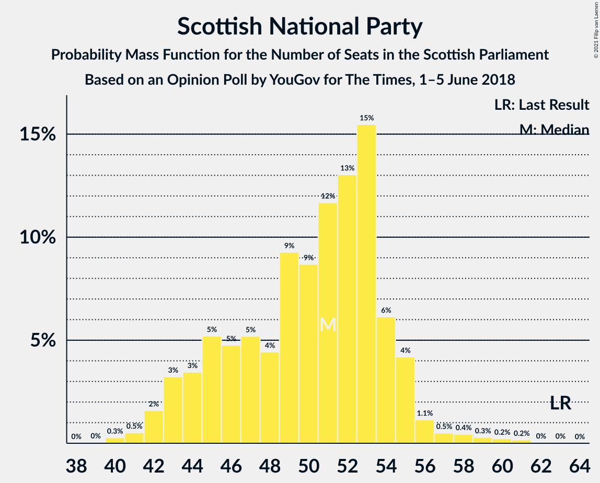
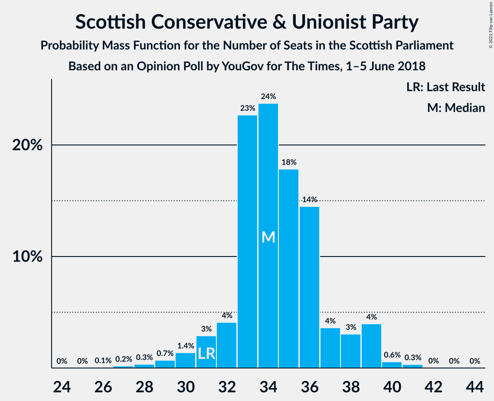
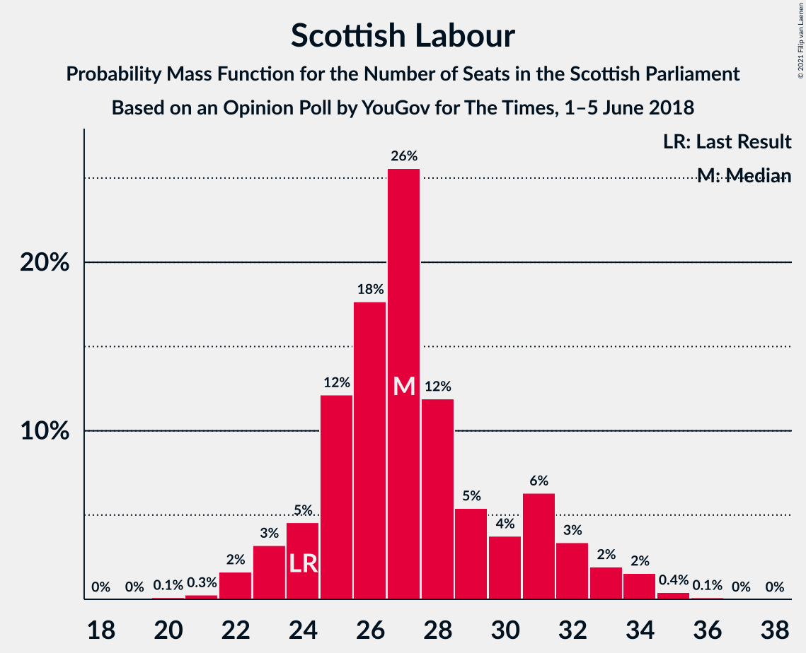
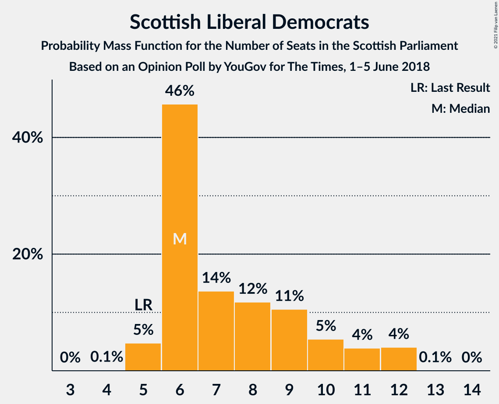
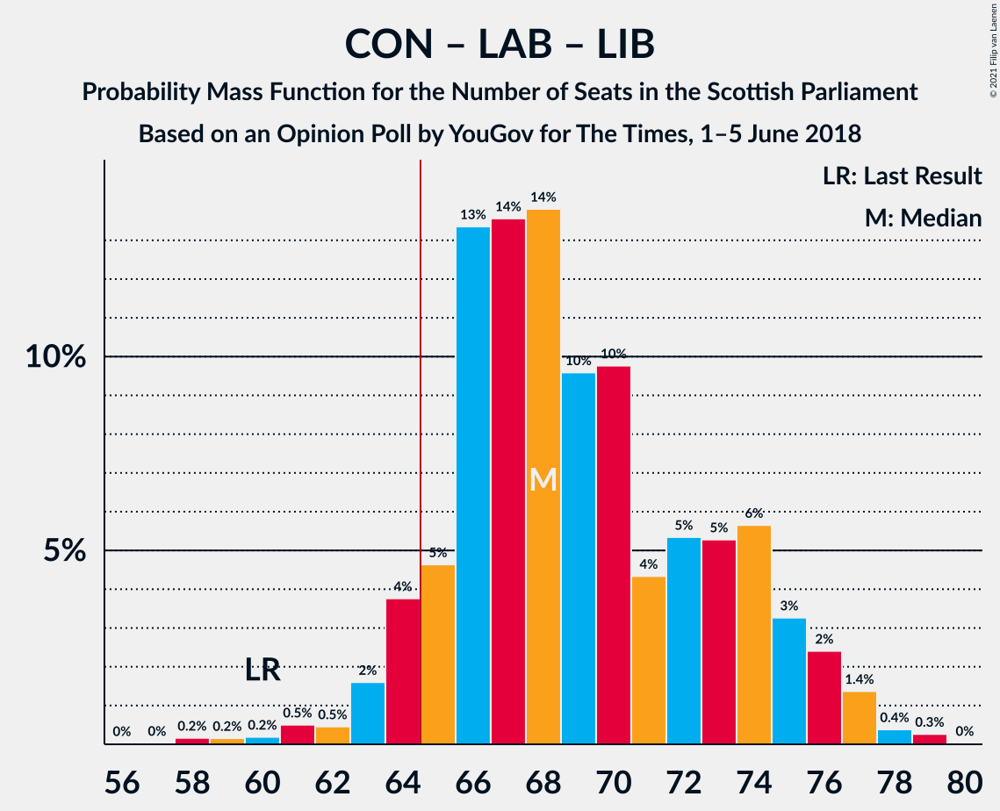

# Opinion Poll by YouGov for The Times, 1–5 June 2018

<a href="#voting-intentions">Voting Intentions</a> | <a href="#seats">Seats</a> | <a href="#coalitions">Coalitions</a> | <a href="#technical-information">Technical Information</a>

## Voting Intentions

### Confidence Intervals

| Party | Last Result | Poll Result | 80% Confidence Interval | 90% Confidence Interval | 95% Confidence Interval | 99% Confidence Interval |
|:-----:|:-----------:|:-----------:|:-----------------------:|:-----------------------:|:-----------------------:|:-----------------------:|
| Scottish National Party | 41.7% | 32.3% | 30.5–34.2% |30.0–34.7% |29.5–35.1% |28.7–36.0% |
| Scottish Conservative & Unionist Party | 22.9% | 26.2% | 24.6–28.0% |24.1–28.5% |23.7–29.0% |22.9–29.8% |
| Scottish Labour | 19.1% | 21.1% | 19.6–22.8% |19.1–23.3% |18.8–23.7% |18.1–24.5% |
| Scottish Greens | 6.6% | 9.0% | 8.0–10.2% |7.7–10.6% |7.5–10.9% |7.0–11.5% |
| Scottish Liberal Democrats | 5.2% | 7.1% | 6.2–8.2% |5.9–8.5% |5.7–8.8% |5.3–9.3% |
| Scottish Socialist Party | 0.5% | 3.0% | 2.4–3.8% |2.2–4.0% |2.1–4.2% |1.9–4.6% |
| UK Independence Party | 2.0% | 1.0% | 0.7–1.5% |0.6–1.7% |0.6–1.8% |0.5–2.1% |

*Note:* The poll result column reflects the actual value used in the calculations. Published results may vary slightly, and in addition be rounded to fewer digits.

## Seats

### Confidence Intervals

| Party | Last Result | Median | 80% Confidence Interval | 90% Confidence Interval | 95% Confidence Interval | 99% Confidence Interval |
|:-----:|:-----------:|:------:|:-----------------------:|:-----------------------:|:-----------------------:|:-----------------------:|
| <a href="#scottish-national-party">Scottish National Party</a> | 63 | 51 | 45–54 |43–55 |43–56 |41–59 |
| <a href="#scottish-conservative-&-unionist-party">Scottish Conservative & Unionist Party</a> | 31 | 34 | 33–37 |31–38 |30–39 |28–40 |
| <a href="#scottish-labour">Scottish Labour</a> | 24 | 27 | 25–31 |23–32 |23–33 |22–35 |
| <a href="#scottish-greens">Scottish Greens</a> | 6 | 10 | 9–11 |8–12 |8–12 |7–14 |
| <a href="#scottish-liberal-democrats">Scottish Liberal Democrats</a> | 5 | 6 | 6–10 |6–11 |5–12 |5–12 |
| <a href="#scottish-socialist-party">Scottish Socialist Party</a> | 0 | 0 | 0 |0 |0 |0 |
| <a href="#uk-independence-party">UK Independence Party</a> | 0 | 0 | 0 |0 |0 |0 |

### Scottish National Party

*For a full overview of the results for this party, see the [Scottish National Party](party-scottishnationalparty.html) page.*

| Number of Seats | Probability | Accumulated | Special Marks |
|:---------------:|:-----------:|:-----------:|:-------------:|
| 39 | 0% | 100% |  |
| 40 | 0.3% | 99.9% |  |
| 41 | 0.5% | 99.7% |  |
| 42 | 2% | 99.2% |  |
| 43 | 3% | 98% |  |
| 44 | 3% | 94% |  |
| 45 | 5% | 91% |  |
| 46 | 5% | 86% |  |
| 47 | 5% | 81% |  |
| 48 | 4% | 76% |  |
| 49 | 9% | 71% |  |
| 50 | 9% | 62% |  |
| 51 | 12% | 53% | Median |
| 52 | 13% | 42% |  |
| 53 | 15% | 29% |  |
| 54 | 6% | 13% |  |
| 55 | 4% | 7% |  |
| 56 | 1.1% | 3% |  |
| 57 | 0.5% | 2% |  |
| 58 | 0.4% | 1.2% |  |
| 59 | 0.3% | 0.7% |  |
| 60 | 0.2% | 0.4% |  |
| 61 | 0.2% | 0.2% |  |
| 62 | 0% | 0.1% |  |
| 63 | 0% | 0% | Last Result |

### Scottish Conservative & Unionist Party

*For a full overview of the results for this party, see the [Scottish Conservative & Unionist Party](party-scottishconservativeunionistparty.html) page.*

| Number of Seats | Probability | Accumulated | Special Marks |
|:---------------:|:-----------:|:-----------:|:-------------:|
| 26 | 0.1% | 100% |  |
| 27 | 0.2% | 99.9% |  |
| 28 | 0.3% | 99.7% |  |
| 29 | 0.7% | 99.4% |  |
| 30 | 1.4% | 98.7% |  |
| 31 | 3% | 97% | Last Result |
| 32 | 4% | 94% |  |
| 33 | 23% | 90% |  |
| 34 | 24% | 68% | Median |
| 35 | 18% | 44% |  |
| 36 | 14% | 26% |  |
| 37 | 4% | 12% |  |
| 38 | 3% | 8% |  |
| 39 | 4% | 5% |  |
| 40 | 0.6% | 0.9% |  |
| 41 | 0.3% | 0.4% |  |
| 42 | 0% | 0.1% |  |
| 43 | 0% | 0% |  |

### Scottish Labour

*For a full overview of the results for this party, see the [Scottish Labour](party-scottishlabour.html) page.*

| Number of Seats | Probability | Accumulated | Special Marks |
|:---------------:|:-----------:|:-----------:|:-------------:|
| 20 | 0.1% | 100% |  |
| 21 | 0.3% | 99.9% |  |
| 22 | 2% | 99.6% |  |
| 23 | 3% | 98% |  |
| 24 | 5% | 95% | Last Result |
| 25 | 12% | 90% |  |
| 26 | 18% | 78% |  |
| 27 | 26% | 60% | Median |
| 28 | 12% | 35% |  |
| 29 | 5% | 23% |  |
| 30 | 4% | 17% |  |
| 31 | 6% | 14% |  |
| 32 | 3% | 7% |  |
| 33 | 2% | 4% |  |
| 34 | 2% | 2% |  |
| 35 | 0.4% | 0.5% |  |
| 36 | 0.1% | 0.1% |  |
| 37 | 0% | 0% |  |

### Scottish Greens

*For a full overview of the results for this party, see the [Scottish Greens](party-scottishgreens.html) page.*

| Number of Seats | Probability | Accumulated | Special Marks |
|:---------------:|:-----------:|:-----------:|:-------------:|
| 5 | 0.1% | 100% |  |
| 6 | 0.3% | 99.9% | Last Result |
| 7 | 1.0% | 99.6% |  |
| 8 | 4% | 98.6% |  |
| 9 | 11% | 94% |  |
| 10 | 72% | 83% | Median |
| 11 | 6% | 11% |  |
| 12 | 3% | 5% |  |
| 13 | 1.1% | 2% |  |
| 14 | 0.7% | 0.8% |  |
| 15 | 0% | 0% |  |

### Scottish Liberal Democrats

*For a full overview of the results for this party, see the [Scottish Liberal Democrats](party-scottishliberaldemocrats.html) page.*

| Number of Seats | Probability | Accumulated | Special Marks |
|:---------------:|:-----------:|:-----------:|:-------------:|
| 4 | 0.1% | 100% |  |
| 5 | 5% | 99.9% | Last Result |
| 6 | 46% | 95% | Median |
| 7 | 14% | 49% |  |
| 8 | 12% | 36% |  |
| 9 | 11% | 24% |  |
| 10 | 5% | 13% |  |
| 11 | 4% | 8% |  |
| 12 | 4% | 4% |  |
| 13 | 0.1% | 0.1% |  |
| 14 | 0% | 0% |  |

### Scottish Socialist Party

*For a full overview of the results for this party, see the [Scottish Socialist Party](party-scottishsocialistparty.html) page.*

| Number of Seats | Probability | Accumulated | Special Marks |
|:---------------:|:-----------:|:-----------:|:-------------:|
| 0 | 100% | 100% | Last Result, Median |

### UK Independence Party

*For a full overview of the results for this party, see the [UK Independence Party](party-ukindependenceparty.html) page.*

| Number of Seats | Probability | Accumulated | Special Marks |
|:---------------:|:-----------:|:-----------:|:-------------:|
| 0 | 100% | 100% | Last Result, Median |

## Coalitions

### Confidence Intervals

| Coalition | Last Result | Median | Majority? | 80% Confidence Interval | 90% Confidence Interval | 95% Confidence Interval | 99% Confidence Interval |
|:---------:|:-----------:|:------:|:---------:|:-----------------------:|:-----------------------:|:-----------------------:|:-----------------------:|
| Scottish Conservative & Unionist Party – Scottish Labour – Scottish Liberal Democrats | 60 | 68 | 93% | 65–74 | 64–75 | 63–76 | 60–78 |
| Scottish Conservative & Unionist Party – Scottish Labour | 55 | 61 | 19% | 58–67 | 57–68 | 56–69 | 53–70 |
| Scottish National Party – Scottish Greens | 69 | 61 | 7% | 55–64 | 54–65 | 53–66 | 51–69 |
| Scottish National Party | 63 | 51 | 0% | 45–54 | 43–55 | 43–56 | 41–59 |
| Scottish Labour – Scottish Greens – Scottish Liberal Democrats | 35 | 44 | 0% | 41–49 | 40–51 | 39–52 | 38–53 |
| Scottish Conservative & Unionist Party – Scottish Liberal Democrats | 36 | 41 | 0% | 39–45 | 38–46 | 37–47 | 35–49 |
| Scottish Labour – Scottish Liberal Democrats | 29 | 34 | 0% | 31–39 | 30–40 | 29–41 | 28–43 |

### Scottish Conservative & Unionist Party – Scottish Labour – Scottish Liberal Democrats

| Number of Seats | Probability | Accumulated | Special Marks |
|:---------------:|:-----------:|:-----------:|:-------------:|
| 57 | 0% | 100% |  |
| 58 | 0.2% | 99.9% |  |
| 59 | 0.2% | 99.8% |  |
| 60 | 0.2% | 99.6% | Last Result |
| 61 | 0.5% | 99.4% |  |
| 62 | 0.5% | 98.9% |  |
| 63 | 2% | 98% |  |
| 64 | 4% | 97% |  |
| 65 | 5% | 93% | Majority |
| 66 | 13% | 88% |  |
| 67 | 14% | 75% | Median |
| 68 | 14% | 62% |  |
| 69 | 10% | 48% |  |
| 70 | 10% | 38% |  |
| 71 | 4% | 28% |  |
| 72 | 5% | 24% |  |
| 73 | 5% | 19% |  |
| 74 | 6% | 13% |  |
| 75 | 3% | 8% |  |
| 76 | 2% | 4% |  |
| 77 | 1.4% | 2% |  |
| 78 | 0.4% | 0.7% |  |
| 79 | 0.3% | 0.3% |  |
| 80 | 0% | 0% |  |

### Scottish Conservative & Unionist Party – Scottish Labour

| Number of Seats | Probability | Accumulated | Special Marks |
|:---------------:|:-----------:|:-----------:|:-------------:|
| 51 | 0% | 100% |  |
| 52 | 0.1% | 99.9% |  |
| 53 | 0.4% | 99.8% |  |
| 54 | 0.4% | 99.4% |  |
| 55 | 0.6% | 99.0% | Last Result |
| 56 | 2% | 98% |  |
| 57 | 3% | 96% |  |
| 58 | 7% | 93% |  |
| 59 | 10% | 86% |  |
| 60 | 17% | 76% |  |
| 61 | 14% | 59% | Median |
| 62 | 10% | 45% |  |
| 63 | 10% | 35% |  |
| 64 | 7% | 25% |  |
| 65 | 5% | 19% | Majority |
| 66 | 3% | 14% |  |
| 67 | 6% | 11% |  |
| 68 | 2% | 5% |  |
| 69 | 2% | 3% |  |
| 70 | 1.1% | 1.5% |  |
| 71 | 0.3% | 0.3% |  |
| 72 | 0% | 0% |  |

### Scottish National Party – Scottish Greens

| Number of Seats | Probability | Accumulated | Special Marks |
|:---------------:|:-----------:|:-----------:|:-------------:|
| 50 | 0.3% | 100% |  |
| 51 | 0.4% | 99.7% |  |
| 52 | 1.4% | 99.3% |  |
| 53 | 2% | 98% |  |
| 54 | 3% | 96% |  |
| 55 | 6% | 92% |  |
| 56 | 5% | 87% |  |
| 57 | 5% | 81% |  |
| 58 | 4% | 76% |  |
| 59 | 10% | 72% |  |
| 60 | 10% | 62% |  |
| 61 | 14% | 52% | Median |
| 62 | 14% | 38% |  |
| 63 | 13% | 25% |  |
| 64 | 5% | 12% |  |
| 65 | 4% | 7% | Majority |
| 66 | 2% | 3% |  |
| 67 | 0.5% | 2% |  |
| 68 | 0.5% | 1.1% |  |
| 69 | 0.2% | 0.6% | Last Result |
| 70 | 0.2% | 0.4% |  |
| 71 | 0.2% | 0.2% |  |
| 72 | 0% | 0.1% |  |
| 73 | 0% | 0% |  |

### Scottish National Party

| Number of Seats | Probability | Accumulated | Special Marks |
|:---------------:|:-----------:|:-----------:|:-------------:|
| 39 | 0% | 100% |  |
| 40 | 0.3% | 99.9% |  |
| 41 | 0.5% | 99.7% |  |
| 42 | 2% | 99.2% |  |
| 43 | 3% | 98% |  |
| 44 | 3% | 94% |  |
| 45 | 5% | 91% |  |
| 46 | 5% | 86% |  |
| 47 | 5% | 81% |  |
| 48 | 4% | 76% |  |
| 49 | 9% | 71% |  |
| 50 | 9% | 62% |  |
| 51 | 12% | 53% | Median |
| 52 | 13% | 42% |  |
| 53 | 15% | 29% |  |
| 54 | 6% | 13% |  |
| 55 | 4% | 7% |  |
| 56 | 1.1% | 3% |  |
| 57 | 0.5% | 2% |  |
| 58 | 0.4% | 1.2% |  |
| 59 | 0.3% | 0.7% |  |
| 60 | 0.2% | 0.4% |  |
| 61 | 0.2% | 0.2% |  |
| 62 | 0% | 0.1% |  |
| 63 | 0% | 0% | Last Result |

### Scottish Labour – Scottish Greens – Scottish Liberal Democrats

| Number of Seats | Probability | Accumulated | Special Marks |
|:---------------:|:-----------:|:-----------:|:-------------:|
| 35 | 0% | 100% | Last Result |
| 36 | 0.1% | 100% |  |
| 37 | 0.1% | 99.9% |  |
| 38 | 0.9% | 99.8% |  |
| 39 | 3% | 98.9% |  |
| 40 | 6% | 96% |  |
| 41 | 8% | 90% |  |
| 42 | 8% | 83% |  |
| 43 | 21% | 75% | Median |
| 44 | 14% | 54% |  |
| 45 | 6% | 40% |  |
| 46 | 6% | 34% |  |
| 47 | 8% | 27% |  |
| 48 | 6% | 19% |  |
| 49 | 4% | 13% |  |
| 50 | 4% | 9% |  |
| 51 | 2% | 5% |  |
| 52 | 2% | 3% |  |
| 53 | 1.3% | 2% |  |
| 54 | 0.2% | 0.5% |  |
| 55 | 0.2% | 0.2% |  |
| 56 | 0.1% | 0.1% |  |
| 57 | 0% | 0% |  |

### Scottish Conservative & Unionist Party – Scottish Liberal Democrats

| Number of Seats | Probability | Accumulated | Special Marks |
|:---------------:|:-----------:|:-----------:|:-------------:|
| 33 | 0.1% | 100% |  |
| 34 | 0.3% | 99.9% |  |
| 35 | 0.4% | 99.6% |  |
| 36 | 0.7% | 99.2% | Last Result |
| 37 | 1.1% | 98.5% |  |
| 38 | 3% | 97% |  |
| 39 | 7% | 94% |  |
| 40 | 16% | 87% | Median |
| 41 | 21% | 71% |  |
| 42 | 20% | 50% |  |
| 43 | 10% | 30% |  |
| 44 | 6% | 20% |  |
| 45 | 6% | 14% |  |
| 46 | 4% | 7% |  |
| 47 | 2% | 4% |  |
| 48 | 1.0% | 2% |  |
| 49 | 0.4% | 0.6% |  |
| 50 | 0.1% | 0.2% |  |
| 51 | 0.1% | 0.1% |  |
| 52 | 0% | 0% |  |

### Scottish Labour – Scottish Liberal Democrats

| Number of Seats | Probability | Accumulated | Special Marks |
|:---------------:|:-----------:|:-----------:|:-------------:|
| 27 | 0.1% | 100% |  |
| 28 | 0.6% | 99.8% |  |
| 29 | 2% | 99.2% | Last Result |
| 30 | 3% | 97% |  |
| 31 | 7% | 94% |  |
| 32 | 12% | 87% |  |
| 33 | 21% | 75% | Median |
| 34 | 14% | 54% |  |
| 35 | 6% | 40% |  |
| 36 | 6% | 34% |  |
| 37 | 10% | 28% |  |
| 38 | 6% | 18% |  |
| 39 | 4% | 12% |  |
| 40 | 4% | 8% |  |
| 41 | 2% | 4% |  |
| 42 | 1.0% | 2% |  |
| 43 | 0.8% | 1.1% |  |
| 44 | 0.2% | 0.4% |  |
| 45 | 0.1% | 0.2% |  |
| 46 | 0.1% | 0.1% |  |
| 47 | 0% | 0% |  |

## Technical Information

### Opinion Poll

+ **Polling firm:** YouGov
+ **Commissioner(s):** The Times
+ **Fieldwork period:** 1–5 June 2018

### Calculations

+ **Sample size:** 1075
+ **Simulations done:** 1,048,576
+ **Error estimate:** 1.27%

