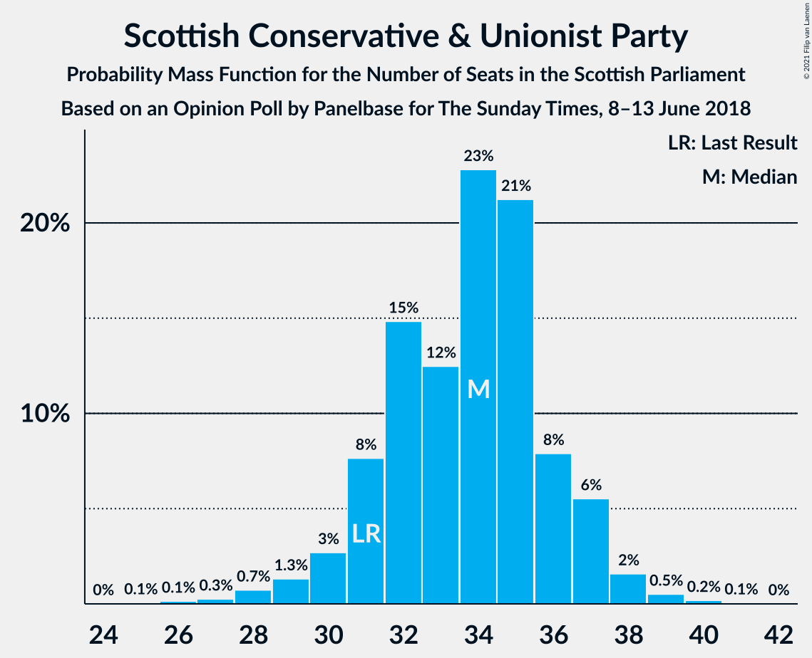
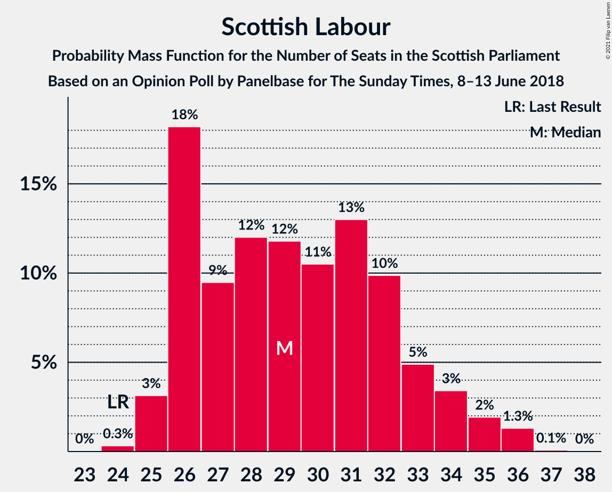
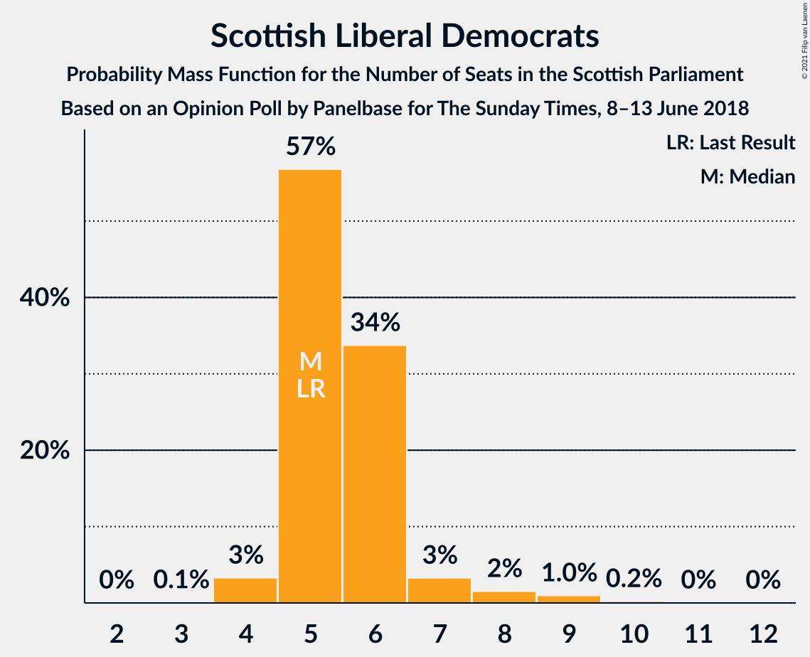
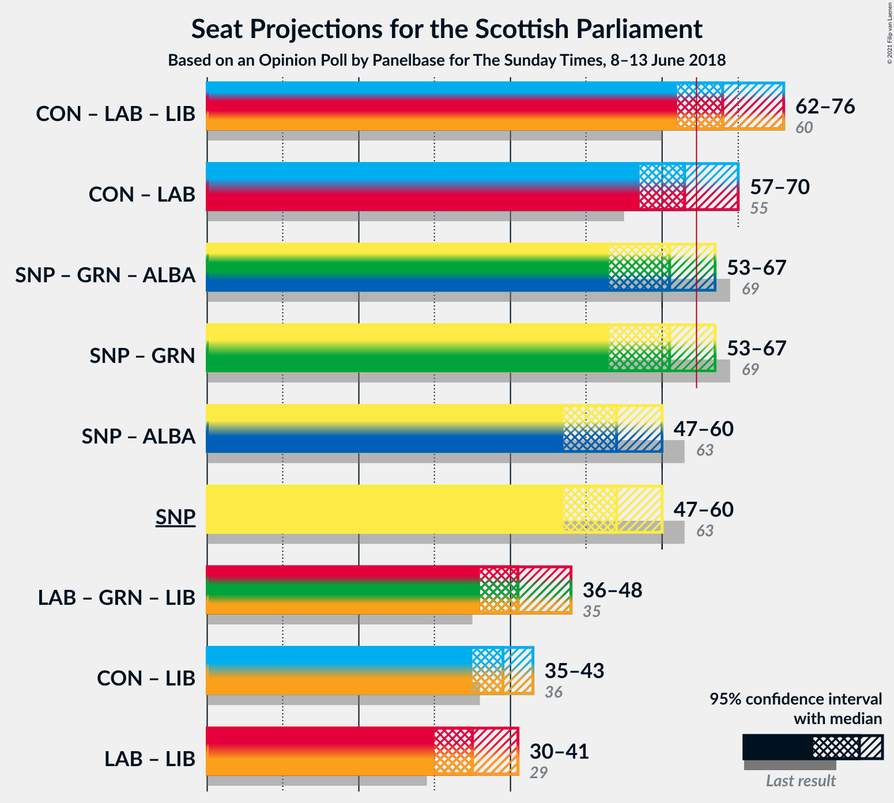
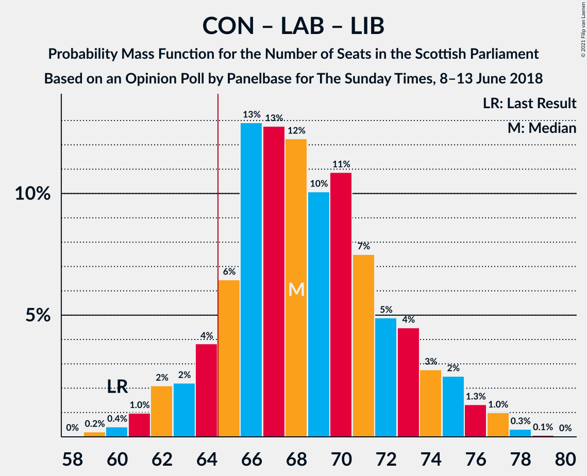

# Opinion Poll by Panelbase for The Sunday Times, 8–13 June 2018

<a href="#voting-intentions">Voting Intentions</a> | <a href="#seats">Seats</a> | <a href="#coalitions">Coalitions</a> | <a href="#technical-information">Technical Information</a>

## Voting Intentions

### Confidence Intervals

| Party | Last Result | Poll Result | 80% Confidence Interval | 90% Confidence Interval | 95% Confidence Interval | 99% Confidence Interval |
|:-----:|:-----------:|:-----------:|:-----------------------:|:-----------------------:|:-----------------------:|:-----------------------:|
| Scottish National Party | 41.7% | 36.2% | 34.3–38.2% |33.8–38.8% |33.3–39.2% |32.4–40.2% |
| Scottish Conservative & Unionist Party | 22.9% | 26.2% | 24.4–28.0% |24.0–28.5% |23.5–28.9% |22.7–29.8% |
| Scottish Labour | 19.1% | 23.2% | 21.6–25.0% |21.1–25.5% |20.7–25.9% |20.0–26.8% |
| Scottish Greens | 6.6% | 7.1% | 6.1–8.2% |5.9–8.5% |5.6–8.8% |5.2–9.4% |
| Scottish Liberal Democrats | 5.2% | 6.1% | 5.2–7.1% |5.0–7.5% |4.8–7.7% |4.4–8.3% |
| UK Independence Party | 2.0% | 1.0% | 0.7–1.5% |0.6–1.7% |0.5–1.8% |0.4–2.1% |

*Note:* The poll result column reflects the actual value used in the calculations. Published results may vary slightly, and in addition be rounded to fewer digits.

## Seats

### Confidence Intervals

| Party | Last Result | Median | 80% Confidence Interval | 90% Confidence Interval | 95% Confidence Interval | 99% Confidence Interval |
|:-----:|:-----------:|:------:|:-----------------------:|:-----------------------:|:-----------------------:|:-----------------------:|
| <a href="#scottish-national-party">Scottish National Party</a> | 63 | 55 | 52–57 |50–57 |50–58 |47–60 |
| <a href="#scottish-conservative-&-unionist-party">Scottish Conservative & Unionist Party</a> | 31 | 34 | 31–36 |31–37 |30–38 |28–39 |
| <a href="#scottish-labour">Scottish Labour</a> | 24 | 29 | 26–32 |26–33 |26–34 |25–35 |
| <a href="#scottish-greens">Scottish Greens</a> | 6 | 7 | 4–9 |4–9 |3–10 |3–10 |
| <a href="#scottish-liberal-democrats">Scottish Liberal Democrats</a> | 5 | 5 | 4–6 |4–7 |4–7 |3–8 |
| <a href="#uk-independence-party">UK Independence Party</a> | 0 | 0 | 0 |0 |0 |0 |

### Scottish National Party

*For a full overview of the results for this party, see the [Scottish National Party](party-scottishnationalparty.html) page.*

| Number of Seats | Probability | Accumulated | Special Marks |
|:---------------:|:-----------:|:-----------:|:-------------:|
| 44 | 0.2% | 100% |  |
| 45 | 0% | 99.8% |  |
| 46 | 0.1% | 99.8% |  |
| 47 | 0.2% | 99.7% |  |
| 48 | 0.6% | 99.4% |  |
| 49 | 1.3% | 98.8% |  |
| 50 | 3% | 98% |  |
| 51 | 1.4% | 95% |  |
| 52 | 5% | 93% |  |
| 53 | 11% | 88% |  |
| 54 | 13% | 77% |  |
| 55 | 31% | 65% | Median |
| 56 | 13% | 33% |  |
| 57 | 15% | 20% |  |
| 58 | 3% | 5% |  |
| 59 | 1.1% | 2% |  |
| 60 | 0.3% | 0.7% |  |
| 61 | 0.3% | 0.4% |  |
| 62 | 0.1% | 0.2% |  |
| 63 | 0% | 0% | Last Result |

### Scottish Conservative & Unionist Party

*For a full overview of the results for this party, see the [Scottish Conservative & Unionist Party](party-scottishconservativeunionistparty.html) page.*

| Number of Seats | Probability | Accumulated | Special Marks |
|:---------------:|:-----------:|:-----------:|:-------------:|
| 26 | 0.1% | 100% |  |
| 27 | 0.1% | 99.8% |  |
| 28 | 0.3% | 99.8% |  |
| 29 | 0.9% | 99.4% |  |
| 30 | 3% | 98% |  |
| 31 | 10% | 95% | Last Result |
| 32 | 8% | 85% |  |
| 33 | 24% | 77% |  |
| 34 | 23% | 52% | Median |
| 35 | 17% | 30% |  |
| 36 | 7% | 12% |  |
| 37 | 3% | 6% |  |
| 38 | 2% | 3% |  |
| 39 | 0.4% | 0.8% |  |
| 40 | 0.3% | 0.4% |  |
| 41 | 0.1% | 0.1% |  |
| 42 | 0% | 0% |  |

### Scottish Labour

*For a full overview of the results for this party, see the [Scottish Labour](party-scottishlabour.html) page.*

| Number of Seats | Probability | Accumulated | Special Marks |
|:---------------:|:-----------:|:-----------:|:-------------:|
| 23 | 0.1% | 100% |  |
| 24 | 0.2% | 99.9% | Last Result |
| 25 | 2% | 99.8% |  |
| 26 | 10% | 98% |  |
| 27 | 19% | 88% |  |
| 28 | 13% | 69% |  |
| 29 | 11% | 56% | Median |
| 30 | 14% | 45% |  |
| 31 | 14% | 31% |  |
| 32 | 7% | 16% |  |
| 33 | 5% | 10% |  |
| 34 | 4% | 5% |  |
| 35 | 0.7% | 1.1% |  |
| 36 | 0.2% | 0.3% |  |
| 37 | 0.1% | 0.1% |  |
| 38 | 0% | 0% |  |

### Scottish Greens

*For a full overview of the results for this party, see the [Scottish Greens](party-scottishgreens.html) page.*

| Number of Seats | Probability | Accumulated | Special Marks |
|:---------------:|:-----------:|:-----------:|:-------------:|
| 2 | 0.2% | 100% |  |
| 3 | 4% | 99.8% |  |
| 4 | 24% | 96% |  |
| 5 | 6% | 72% |  |
| 6 | 15% | 65% | Last Result |
| 7 | 19% | 50% | Median |
| 8 | 11% | 31% |  |
| 9 | 16% | 20% |  |
| 10 | 4% | 4% |  |
| 11 | 0% | 0% |  |

### Scottish Liberal Democrats

*For a full overview of the results for this party, see the [Scottish Liberal Democrats](party-scottishliberaldemocrats.html) page.*

| Number of Seats | Probability | Accumulated | Special Marks |
|:---------------:|:-----------:|:-----------:|:-------------:|
| 2 | 0.2% | 100% |  |
| 3 | 0.4% | 99.8% |  |
| 4 | 17% | 99.4% |  |
| 5 | 61% | 83% | Last Result, Median |
| 6 | 16% | 21% |  |
| 7 | 3% | 5% |  |
| 8 | 1.2% | 2% |  |
| 9 | 0.3% | 0.4% |  |
| 10 | 0.1% | 0.1% |  |
| 11 | 0% | 0% |  |

### UK Independence Party

*For a full overview of the results for this party, see the [UK Independence Party](party-ukindependenceparty.html) page.*

| Number of Seats | Probability | Accumulated | Special Marks |
|:---------------:|:-----------:|:-----------:|:-------------:|
| 0 | 100% | 100% | Last Result, Median |

## Coalitions

### Confidence Intervals

| Coalition | Last Result | Median | Majority? | 80% Confidence Interval | 90% Confidence Interval | 95% Confidence Interval | 99% Confidence Interval |
|:---------:|:-----------:|:------:|:---------:|:-----------------------:|:-----------------------:|:-----------------------:|:-----------------------:|
| Scottish Conservative & Unionist Party – Scottish Labour – Scottish Liberal Democrats | 60 | 68 | 93% | 65–72 | 64–73 | 63–74 | 62–76 |
| Scottish Conservative & Unionist Party – Scottish Labour | 55 | 62 | 24% | 60–66 | 59–67 | 59–68 | 56–70 |
| Scottish National Party – Scottish Greens | 69 | 61 | 7% | 57–64 | 56–65 | 55–66 | 53–67 |
| Scottish National Party | 63 | 55 | 0% | 52–57 | 50–57 | 50–58 | 47–60 |
| Scottish Labour – Scottish Greens – Scottish Liberal Democrats | 35 | 40 | 0% | 38–45 | 37–45 | 36–46 | 35–47 |
| Scottish Conservative & Unionist Party – Scottish Liberal Democrats | 36 | 39 | 0% | 36–41 | 35–42 | 35–43 | 33–45 |
| Scottish Labour – Scottish Liberal Democrats | 29 | 34 | 0% | 31–38 | 31–39 | 30–39 | 30–41 |

### Scottish Conservative & Unionist Party – Scottish Labour – Scottish Liberal Democrats

| Number of Seats | Probability | Accumulated | Special Marks |
|:---------------:|:-----------:|:-----------:|:-------------:|
| 59 | 0.1% | 100% |  |
| 60 | 0.1% | 99.9% | Last Result |
| 61 | 0.2% | 99.7% |  |
| 62 | 1.0% | 99.5% |  |
| 63 | 3% | 98% |  |
| 64 | 3% | 95% |  |
| 65 | 7% | 93% | Majority |
| 66 | 18% | 86% |  |
| 67 | 16% | 68% |  |
| 68 | 19% | 52% | Median |
| 69 | 7% | 33% |  |
| 70 | 9% | 25% |  |
| 71 | 6% | 16% |  |
| 72 | 5% | 10% |  |
| 73 | 3% | 5% |  |
| 74 | 1.1% | 3% |  |
| 75 | 0.9% | 1.4% |  |
| 76 | 0.2% | 0.5% |  |
| 77 | 0.2% | 0.3% |  |
| 78 | 0% | 0.1% |  |
| 79 | 0% | 0.1% |  |
| 80 | 0% | 0% |  |

### Scottish Conservative & Unionist Party – Scottish Labour

| Number of Seats | Probability | Accumulated | Special Marks |
|:---------------:|:-----------:|:-----------:|:-------------:|
| 54 | 0.1% | 100% |  |
| 55 | 0.2% | 99.9% | Last Result |
| 56 | 0.4% | 99.7% |  |
| 57 | 0.8% | 99.4% |  |
| 58 | 0.9% | 98.5% |  |
| 59 | 5% | 98% |  |
| 60 | 8% | 93% |  |
| 61 | 12% | 85% |  |
| 62 | 25% | 73% |  |
| 63 | 17% | 48% | Median |
| 64 | 8% | 31% |  |
| 65 | 12% | 24% | Majority |
| 66 | 2% | 11% |  |
| 67 | 5% | 9% |  |
| 68 | 2% | 4% |  |
| 69 | 1.2% | 2% |  |
| 70 | 0.6% | 0.9% |  |
| 71 | 0.2% | 0.4% |  |
| 72 | 0.1% | 0.2% |  |
| 73 | 0% | 0.1% |  |
| 74 | 0% | 0.1% |  |
| 75 | 0% | 0% |  |

### Scottish National Party – Scottish Greens

| Number of Seats | Probability | Accumulated | Special Marks |
|:---------------:|:-----------:|:-----------:|:-------------:|
| 50 | 0% | 100% |  |
| 51 | 0% | 99.9% |  |
| 52 | 0.2% | 99.9% |  |
| 53 | 0.2% | 99.7% |  |
| 54 | 0.9% | 99.5% |  |
| 55 | 1.1% | 98.6% |  |
| 56 | 3% | 97% |  |
| 57 | 5% | 95% |  |
| 58 | 6% | 90% |  |
| 59 | 9% | 84% |  |
| 60 | 7% | 75% |  |
| 61 | 19% | 67% |  |
| 62 | 16% | 48% | Median |
| 63 | 18% | 32% |  |
| 64 | 7% | 14% |  |
| 65 | 3% | 7% | Majority |
| 66 | 3% | 5% |  |
| 67 | 1.0% | 2% |  |
| 68 | 0.2% | 0.5% |  |
| 69 | 0.1% | 0.3% | Last Result |
| 70 | 0.1% | 0.1% |  |
| 71 | 0% | 0% |  |

### Scottish National Party

| Number of Seats | Probability | Accumulated | Special Marks |
|:---------------:|:-----------:|:-----------:|:-------------:|
| 44 | 0.2% | 100% |  |
| 45 | 0% | 99.8% |  |
| 46 | 0.1% | 99.8% |  |
| 47 | 0.2% | 99.7% |  |
| 48 | 0.6% | 99.4% |  |
| 49 | 1.3% | 98.8% |  |
| 50 | 3% | 98% |  |
| 51 | 1.4% | 95% |  |
| 52 | 5% | 93% |  |
| 53 | 11% | 88% |  |
| 54 | 13% | 77% |  |
| 55 | 31% | 65% | Median |
| 56 | 13% | 33% |  |
| 57 | 15% | 20% |  |
| 58 | 3% | 5% |  |
| 59 | 1.1% | 2% |  |
| 60 | 0.3% | 0.7% |  |
| 61 | 0.3% | 0.4% |  |
| 62 | 0.1% | 0.2% |  |
| 63 | 0% | 0% | Last Result |

### Scottish Labour – Scottish Greens – Scottish Liberal Democrats

| Number of Seats | Probability | Accumulated | Special Marks |
|:---------------:|:-----------:|:-----------:|:-------------:|
| 34 | 0.2% | 100% |  |
| 35 | 0.6% | 99.7% | Last Result |
| 36 | 3% | 99.1% |  |
| 37 | 6% | 97% |  |
| 38 | 9% | 91% |  |
| 39 | 7% | 82% |  |
| 40 | 29% | 75% |  |
| 41 | 22% | 47% | Median |
| 42 | 5% | 25% |  |
| 43 | 4% | 20% |  |
| 44 | 5% | 16% |  |
| 45 | 8% | 11% |  |
| 46 | 2% | 3% |  |
| 47 | 0.8% | 1.2% |  |
| 48 | 0.2% | 0.4% |  |
| 49 | 0.1% | 0.3% |  |
| 50 | 0% | 0.2% |  |
| 51 | 0.1% | 0.1% |  |
| 52 | 0% | 0% |  |

### Scottish Conservative & Unionist Party – Scottish Liberal Democrats

| Number of Seats | Probability | Accumulated | Special Marks |
|:---------------:|:-----------:|:-----------:|:-------------:|
| 30 | 0% | 100% |  |
| 31 | 0.1% | 99.9% |  |
| 32 | 0.1% | 99.9% |  |
| 33 | 0.4% | 99.8% |  |
| 34 | 1.0% | 99.4% |  |
| 35 | 5% | 98% |  |
| 36 | 7% | 93% | Last Result |
| 37 | 14% | 86% |  |
| 38 | 18% | 72% |  |
| 39 | 21% | 54% | Median |
| 40 | 15% | 33% |  |
| 41 | 11% | 19% |  |
| 42 | 3% | 8% |  |
| 43 | 3% | 4% |  |
| 44 | 0.8% | 1.3% |  |
| 45 | 0.4% | 0.6% |  |
| 46 | 0.1% | 0.1% |  |
| 47 | 0% | 0% |  |

### Scottish Labour – Scottish Liberal Democrats

| Number of Seats | Probability | Accumulated | Special Marks |
|:---------------:|:-----------:|:-----------:|:-------------:|
| 28 | 0.1% | 100% |  |
| 29 | 0.3% | 99.9% | Last Result |
| 30 | 3% | 99.6% |  |
| 31 | 8% | 96% |  |
| 32 | 17% | 88% |  |
| 33 | 17% | 71% |  |
| 34 | 8% | 54% | Median |
| 35 | 12% | 45% |  |
| 36 | 14% | 33% |  |
| 37 | 8% | 19% |  |
| 38 | 5% | 11% |  |
| 39 | 4% | 7% |  |
| 40 | 2% | 2% |  |
| 41 | 0.4% | 0.7% |  |
| 42 | 0.2% | 0.3% |  |
| 43 | 0.1% | 0.1% |  |
| 44 | 0% | 0% |  |

## Technical Information

### Opinion Poll

+ **Polling firm:** Panelbase
+ **Commissioner(s):** The Sunday Times
+ **Fieldwork period:** 8–13 June 2018

### Calculations

+ **Sample size:** 1021
+ **Simulations done:** 131,072
+ **Error estimate:** 0.58%

