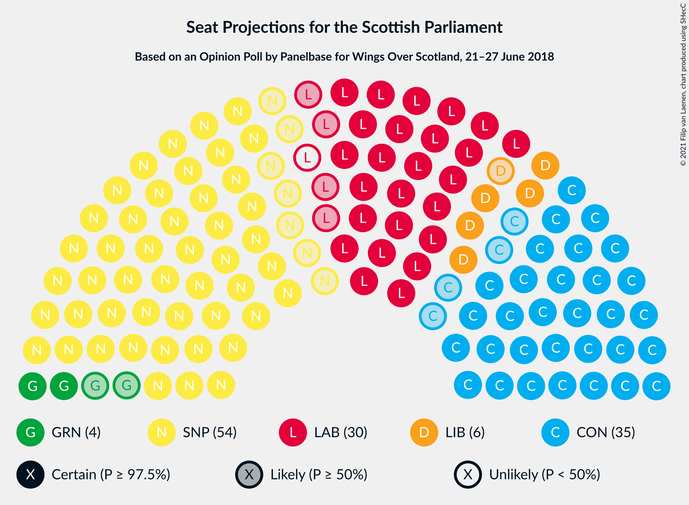
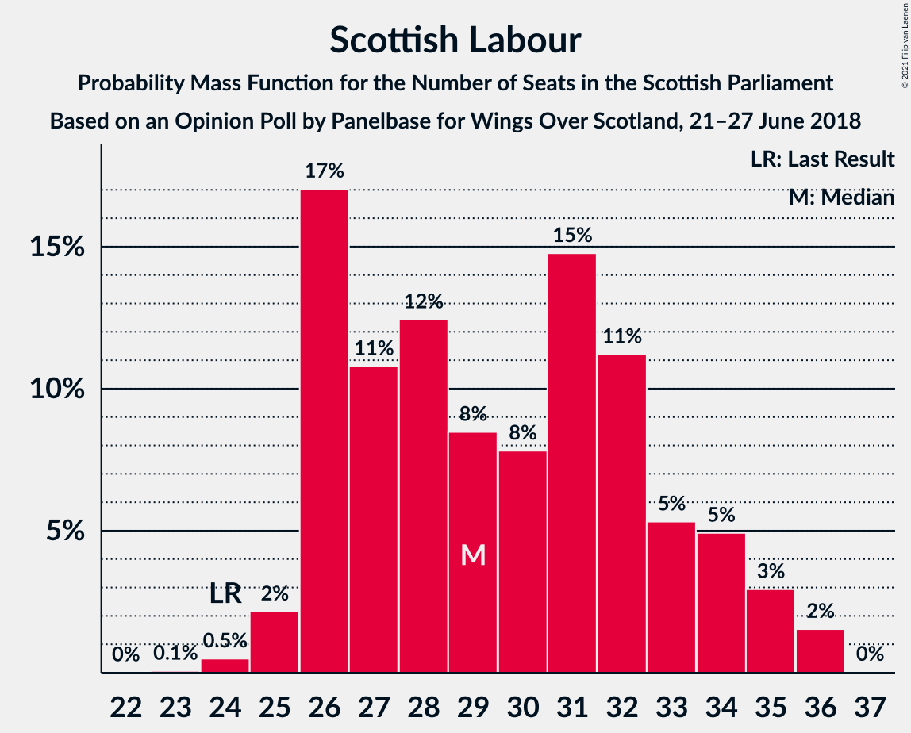
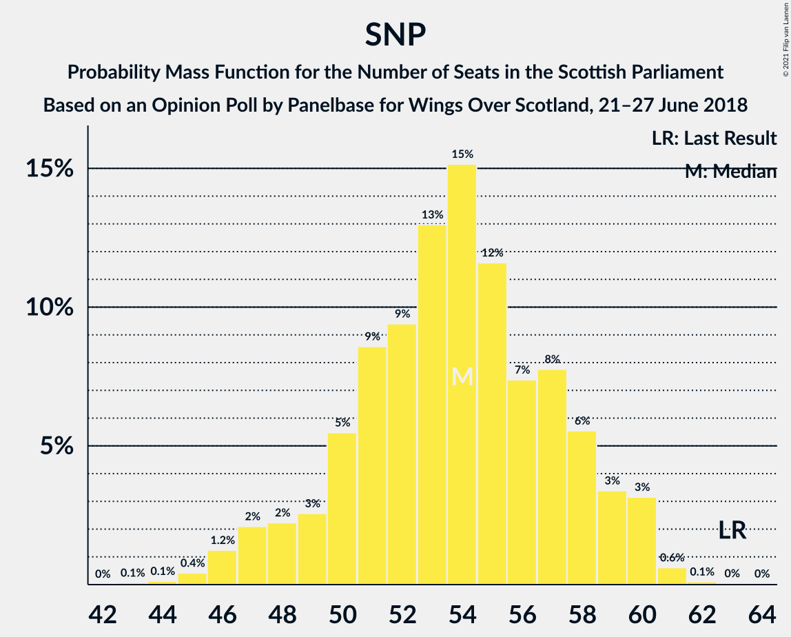

# Opinion Poll by Panelbase for Wings Over Scotland, 21–27 June 2018

<a href="#voting-intentions">Voting Intentions</a> | <a href="#seats">Seats</a> | <a href="#coalitions">Coalitions</a> | <a href="#technical-information">Technical Information</a>

## Voting Intentions

### Confidence Intervals

| Party | Last Result | Poll Result | 80% Confidence Interval | 90% Confidence Interval | 95% Confidence Interval | 99% Confidence Interval |
|:-----:|:-----------:|:-----------:|:-----------------------:|:-----------------------:|:-----------------------:|:-----------------------:|
| Scottish National Party | 41.7% | 36.0% | 34.0–37.9% |33.5–38.5% |33.1–39.0% |32.2–39.9% |
| Scottish Conservative & Unionist Party | 22.9% | 26.9% | 25.2–28.8% |24.7–29.3% |24.3–29.7% |23.5–30.6% |
| Scottish Labour | 19.1% | 23.0% | 21.4–24.8% |20.9–25.2% |20.5–25.7% |19.7–26.5% |
| Scottish Liberal Democrats | 5.2% | 7.0% | 6.1–8.1% |5.8–8.4% |5.6–8.7% |5.2–9.3% |
| Scottish Greens | 6.6% | 6.0% | 5.1–7.1% |4.9–7.4% |4.7–7.6% |4.3–8.2% |
| UK Independence Party | 2.0% | 1.0% | 0.7–1.5% |0.6–1.7% |0.5–1.8% |0.4–2.1% |

*Note:* The poll result column reflects the actual value used in the calculations. Published results may vary slightly, and in addition be rounded to fewer digits.

## Seats

### Confidence Intervals

| Party | Last Result | Median | 80% Confidence Interval | 90% Confidence Interval | 95% Confidence Interval | 99% Confidence Interval |
|:-----:|:-----------:|:------:|:-----------------------:|:-----------------------:|:-----------------------:|:-----------------------:|
| <a href="#scottish-national-party">Scottish National Party</a> | 63 | 54 | 50–58 |48–59 |47–60 |45–61 |
| <a href="#scottish-conservative-&-unionist-party">Scottish Conservative & Unionist Party</a> | 31 | 35 | 32–38 |31–38 |31–39 |30–40 |
| <a href="#scottish-labour">Scottish Labour</a> | 24 | 29 | 26–33 |26–34 |25–35 |24–36 |
| <a href="#scottish-liberal-democrats">Scottish Liberal Democrats</a> | 5 | 6 | 5–9 |5–10 |5–10 |5–12 |
| <a href="#scottish-greens">Scottish Greens</a> | 6 | 4 | 2–7 |2–7 |2–8 |2–9 |
| <a href="#uk-independence-party">UK Independence Party</a> | 0 | 0 | 0 |0 |0 |0 |

### Scottish National Party

*For a full overview of the results for this party, see the [Scottish National Party](party-scottishnationalparty.html) page.*

| Number of Seats | Probability | Accumulated | Special Marks |
|:---------------:|:-----------:|:-----------:|:-------------:|
| 43 | 0.1% | 100% |  |
| 44 | 0.1% | 99.9% |  |
| 45 | 0.4% | 99.8% |  |
| 46 | 1.2% | 99.4% |  |
| 47 | 2% | 98% |  |
| 48 | 2% | 96% |  |
| 49 | 3% | 94% |  |
| 50 | 5% | 91% |  |
| 51 | 9% | 86% |  |
| 52 | 9% | 77% |  |
| 53 | 13% | 68% |  |
| 54 | 15% | 55% | Median |
| 55 | 12% | 40% |  |
| 56 | 7% | 28% |  |
| 57 | 8% | 21% |  |
| 58 | 6% | 13% |  |
| 59 | 3% | 7% |  |
| 60 | 3% | 4% |  |
| 61 | 0.6% | 0.8% |  |
| 62 | 0.1% | 0.2% |  |
| 63 | 0% | 0.1% | Last Result |
| 64 | 0% | 0% |  |

### Scottish Conservative & Unionist Party

*For a full overview of the results for this party, see the [Scottish Conservative & Unionist Party](party-scottishconservativeunionistparty.html) page.*

| Number of Seats | Probability | Accumulated | Special Marks |
|:---------------:|:-----------:|:-----------:|:-------------:|
| 27 | 0% | 100% |  |
| 28 | 0.1% | 99.9% |  |
| 29 | 0.3% | 99.9% |  |
| 30 | 2% | 99.6% |  |
| 31 | 4% | 98% | Last Result |
| 32 | 6% | 94% |  |
| 33 | 7% | 88% |  |
| 34 | 21% | 81% |  |
| 35 | 19% | 60% | Median |
| 36 | 14% | 41% |  |
| 37 | 16% | 27% |  |
| 38 | 6% | 11% |  |
| 39 | 3% | 4% |  |
| 40 | 0.9% | 1.3% |  |
| 41 | 0.3% | 0.4% |  |
| 42 | 0.1% | 0.1% |  |
| 43 | 0% | 0% |  |

### Scottish Labour

*For a full overview of the results for this party, see the [Scottish Labour](party-scottishlabour.html) page.*

| Number of Seats | Probability | Accumulated | Special Marks |
|:---------------:|:-----------:|:-----------:|:-------------:|
| 23 | 0.1% | 100% |  |
| 24 | 0.5% | 99.9% | Last Result |
| 25 | 2% | 99.4% |  |
| 26 | 17% | 97% |  |
| 27 | 11% | 80% |  |
| 28 | 12% | 69% |  |
| 29 | 8% | 57% | Median |
| 30 | 8% | 49% |  |
| 31 | 15% | 41% |  |
| 32 | 11% | 26% |  |
| 33 | 5% | 15% |  |
| 34 | 5% | 9% |  |
| 35 | 3% | 5% |  |
| 36 | 2% | 2% |  |
| 37 | 0% | 0% |  |

### Scottish Liberal Democrats

*For a full overview of the results for this party, see the [Scottish Liberal Democrats](party-scottishliberaldemocrats.html) page.*

| Number of Seats | Probability | Accumulated | Special Marks |
|:---------------:|:-----------:|:-----------:|:-------------:|
| 4 | 0.1% | 100% |  |
| 5 | 19% | 99.9% | Last Result |
| 6 | 48% | 81% | Median |
| 7 | 8% | 33% |  |
| 8 | 12% | 25% |  |
| 9 | 8% | 14% |  |
| 10 | 4% | 6% |  |
| 11 | 1.3% | 2% |  |
| 12 | 0.7% | 0.8% |  |
| 13 | 0.1% | 0.1% |  |
| 14 | 0% | 0% |  |

### Scottish Greens

*For a full overview of the results for this party, see the [Scottish Greens](party-scottishgreens.html) page.*

| Number of Seats | Probability | Accumulated | Special Marks |
|:---------------:|:-----------:|:-----------:|:-------------:|
| 2 | 15% | 100% |  |
| 3 | 24% | 85% |  |
| 4 | 35% | 61% | Median |
| 5 | 8% | 26% |  |
| 6 | 5% | 17% | Last Result |
| 7 | 8% | 12% |  |
| 8 | 2% | 4% |  |
| 9 | 1.1% | 2% |  |
| 10 | 0.4% | 0.4% |  |
| 11 | 0% | 0% |  |

### UK Independence Party

*For a full overview of the results for this party, see the [UK Independence Party](party-ukindependenceparty.html) page.*

| Number of Seats | Probability | Accumulated | Special Marks |
|:---------------:|:-----------:|:-----------:|:-------------:|
| 0 | 100% | 100% | Last Result, Median |

## Coalitions

### Confidence Intervals

| Coalition | Last Result | Median | Majority? | 80% Confidence Interval | 90% Confidence Interval | 95% Confidence Interval | 99% Confidence Interval |
|:---------:|:-----------:|:------:|:---------:|:-----------------------:|:-----------------------:|:-----------------------:|:-----------------------:|
| Scottish Conservative & Unionist Party – Scottish Labour – Scottish Liberal Democrats | 60 | 71 | 98.7% | 67–76 | 66–77 | 65–78 | 63–80 |
| Scottish Conservative & Unionist Party – Scottish Labour | 55 | 65 | 51% | 60–69 | 60–70 | 58–71 | 57–72 |
| Scottish National Party – Scottish Greens | 69 | 58 | 1.3% | 53–62 | 52–63 | 51–64 | 49–66 |
| Scottish National Party | 63 | 54 | 0% | 50–58 | 48–59 | 47–60 | 45–61 |
| Scottish Labour – Scottish Liberal Democrats – Scottish Greens | 35 | 40 | 0% | 36–44 | 35–46 | 34–47 | 34–49 |
| Scottish Conservative & Unionist Party – Scottish Liberal Democrats | 36 | 42 | 0% | 39–45 | 37–46 | 37–46 | 36–48 |
| Scottish Labour – Scottish Liberal Democrats | 29 | 36 | 0% | 32–40 | 31–42 | 31–43 | 30–45 |

### Scottish Conservative & Unionist Party – Scottish Labour – Scottish Liberal Democrats

| Number of Seats | Probability | Accumulated | Special Marks |
|:---------------:|:-----------:|:-----------:|:-------------:|
| 60 | 0% | 100% | Last Result |
| 61 | 0% | 100% |  |
| 62 | 0.2% | 99.9% |  |
| 63 | 0.3% | 99.7% |  |
| 64 | 0.7% | 99.4% |  |
| 65 | 2% | 98.7% | Majority |
| 66 | 3% | 97% |  |
| 67 | 7% | 93% |  |
| 68 | 10% | 86% |  |
| 69 | 9% | 76% |  |
| 70 | 10% | 67% | Median |
| 71 | 15% | 58% |  |
| 72 | 9% | 43% |  |
| 73 | 9% | 34% |  |
| 74 | 8% | 25% |  |
| 75 | 6% | 17% |  |
| 76 | 4% | 11% |  |
| 77 | 3% | 7% |  |
| 78 | 2% | 4% |  |
| 79 | 1.2% | 2% |  |
| 80 | 0.4% | 0.6% |  |
| 81 | 0.1% | 0.2% |  |
| 82 | 0.1% | 0.1% |  |
| 83 | 0% | 0% |  |

### Scottish Conservative & Unionist Party – Scottish Labour

| Number of Seats | Probability | Accumulated | Special Marks |
|:---------------:|:-----------:|:-----------:|:-------------:|
| 55 | 0.1% | 100% | Last Result |
| 56 | 0.2% | 99.9% |  |
| 57 | 1.0% | 99.7% |  |
| 58 | 1.4% | 98.7% |  |
| 59 | 2% | 97% |  |
| 60 | 5% | 95% |  |
| 61 | 9% | 90% |  |
| 62 | 9% | 81% |  |
| 63 | 12% | 72% |  |
| 64 | 9% | 61% | Median |
| 65 | 15% | 51% | Majority |
| 66 | 9% | 36% |  |
| 67 | 8% | 27% |  |
| 68 | 6% | 19% |  |
| 69 | 5% | 13% |  |
| 70 | 4% | 8% |  |
| 71 | 3% | 4% |  |
| 72 | 0.8% | 1.2% |  |
| 73 | 0.2% | 0.4% |  |
| 74 | 0.1% | 0.1% |  |
| 75 | 0% | 0.1% |  |
| 76 | 0% | 0% |  |

### Scottish National Party – Scottish Greens

| Number of Seats | Probability | Accumulated | Special Marks |
|:---------------:|:-----------:|:-----------:|:-------------:|
| 47 | 0.1% | 100% |  |
| 48 | 0.1% | 99.9% |  |
| 49 | 0.4% | 99.8% |  |
| 50 | 1.2% | 99.4% |  |
| 51 | 2% | 98% |  |
| 52 | 3% | 96% |  |
| 53 | 4% | 93% |  |
| 54 | 6% | 89% |  |
| 55 | 8% | 83% |  |
| 56 | 9% | 75% |  |
| 57 | 9% | 66% |  |
| 58 | 15% | 57% | Median |
| 59 | 10% | 42% |  |
| 60 | 9% | 33% |  |
| 61 | 10% | 24% |  |
| 62 | 7% | 14% |  |
| 63 | 3% | 7% |  |
| 64 | 2% | 3% |  |
| 65 | 0.7% | 1.3% | Majority |
| 66 | 0.3% | 0.6% |  |
| 67 | 0.2% | 0.3% |  |
| 68 | 0% | 0.1% |  |
| 69 | 0% | 0% | Last Result |

### Scottish National Party

| Number of Seats | Probability | Accumulated | Special Marks |
|:---------------:|:-----------:|:-----------:|:-------------:|
| 43 | 0.1% | 100% |  |
| 44 | 0.1% | 99.9% |  |
| 45 | 0.4% | 99.8% |  |
| 46 | 1.2% | 99.4% |  |
| 47 | 2% | 98% |  |
| 48 | 2% | 96% |  |
| 49 | 3% | 94% |  |
| 50 | 5% | 91% |  |
| 51 | 9% | 86% |  |
| 52 | 9% | 77% |  |
| 53 | 13% | 68% |  |
| 54 | 15% | 55% | Median |
| 55 | 12% | 40% |  |
| 56 | 7% | 28% |  |
| 57 | 8% | 21% |  |
| 58 | 6% | 13% |  |
| 59 | 3% | 7% |  |
| 60 | 3% | 4% |  |
| 61 | 0.6% | 0.8% |  |
| 62 | 0.1% | 0.2% |  |
| 63 | 0% | 0.1% | Last Result |
| 64 | 0% | 0% |  |

### Scottish Labour – Scottish Liberal Democrats – Scottish Greens

| Number of Seats | Probability | Accumulated | Special Marks |
|:---------------:|:-----------:|:-----------:|:-------------:|
| 33 | 0.3% | 100% |  |
| 34 | 2% | 99.7% |  |
| 35 | 5% | 97% | Last Result |
| 36 | 6% | 93% |  |
| 37 | 6% | 87% |  |
| 38 | 12% | 81% |  |
| 39 | 10% | 69% | Median |
| 40 | 15% | 59% |  |
| 41 | 16% | 45% |  |
| 42 | 8% | 29% |  |
| 43 | 7% | 21% |  |
| 44 | 5% | 14% |  |
| 45 | 4% | 10% |  |
| 46 | 2% | 6% |  |
| 47 | 2% | 3% |  |
| 48 | 0.8% | 2% |  |
| 49 | 0.4% | 0.8% |  |
| 50 | 0.3% | 0.4% |  |
| 51 | 0.1% | 0.1% |  |
| 52 | 0% | 0.1% |  |
| 53 | 0% | 0% |  |

### Scottish Conservative & Unionist Party – Scottish Liberal Democrats

| Number of Seats | Probability | Accumulated | Special Marks |
|:---------------:|:-----------:|:-----------:|:-------------:|
| 34 | 0.1% | 100% |  |
| 35 | 0.3% | 99.9% |  |
| 36 | 1.4% | 99.6% | Last Result |
| 37 | 4% | 98% |  |
| 38 | 5% | 95% |  |
| 39 | 7% | 90% |  |
| 40 | 12% | 83% |  |
| 41 | 16% | 71% | Median |
| 42 | 17% | 55% |  |
| 43 | 18% | 38% |  |
| 44 | 9% | 20% |  |
| 45 | 6% | 11% |  |
| 46 | 3% | 5% |  |
| 47 | 1.2% | 2% |  |
| 48 | 0.4% | 0.7% |  |
| 49 | 0.2% | 0.3% |  |
| 50 | 0.1% | 0.1% |  |
| 51 | 0% | 0% |  |

### Scottish Labour – Scottish Liberal Democrats

| Number of Seats | Probability | Accumulated | Special Marks |
|:---------------:|:-----------:|:-----------:|:-------------:|
| 29 | 0.1% | 100% | Last Result |
| 30 | 0.6% | 99.9% |  |
| 31 | 4% | 99.3% |  |
| 32 | 9% | 95% |  |
| 33 | 7% | 86% |  |
| 34 | 13% | 78% |  |
| 35 | 7% | 65% | Median |
| 36 | 11% | 58% |  |
| 37 | 16% | 46% |  |
| 38 | 11% | 31% |  |
| 39 | 6% | 20% |  |
| 40 | 5% | 14% |  |
| 41 | 4% | 9% |  |
| 42 | 3% | 5% |  |
| 43 | 1.4% | 3% |  |
| 44 | 0.6% | 1.2% |  |
| 45 | 0.4% | 0.5% |  |
| 46 | 0.1% | 0.2% |  |
| 47 | 0.1% | 0.1% |  |
| 48 | 0% | 0% |  |

## Technical Information

### Opinion Poll

+ **Polling firm:** Panelbase
+ **Commissioner(s):** Wings Over Scotland
+ **Fieldwork period:** 21–27 June 2018

### Calculations

+ **Sample size:** 1018
+ **Simulations done:** 1,048,576
+ **Error estimate:** 0.24%

