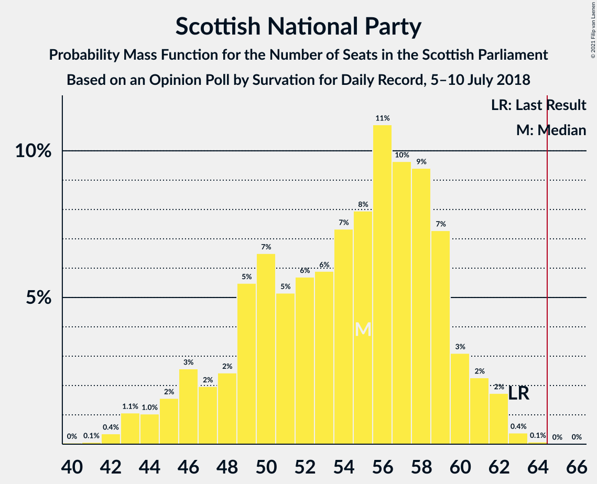
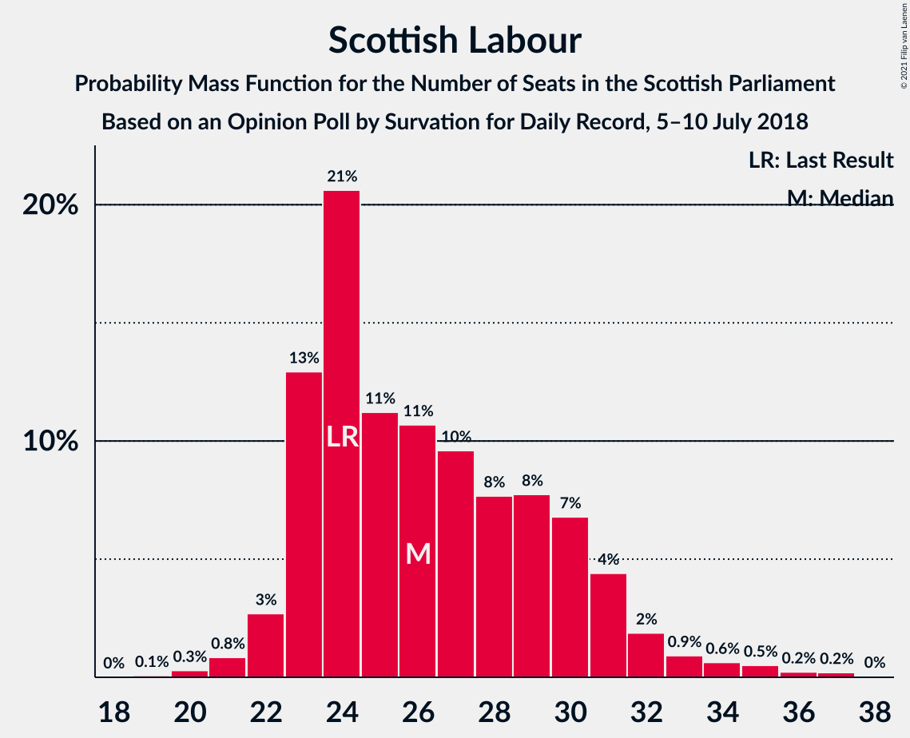
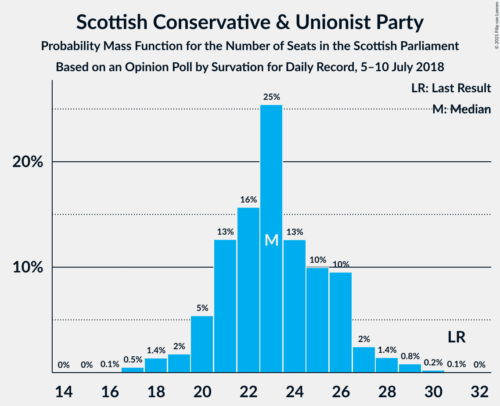

# Opinion Poll by Survation for Daily Record, 5–10 July 2018

<a href="#voting-intentions">Voting Intentions</a> | <a href="#seats">Seats</a> | <a href="#coalitions">Coalitions</a> | <a href="#technical-information">Technical Information</a>

## Voting Intentions

### Confidence Intervals

| Party | Last Result | Poll Result | 80% Confidence Interval | 90% Confidence Interval | 95% Confidence Interval | 99% Confidence Interval |
|:-----:|:-----------:|:-----------:|:-----------------------:|:-----------------------:|:-----------------------:|:-----------------------:|
| Scottish National Party | 41.7% | 33.0% | 31.1–34.9% |30.6–35.5% |30.1–35.9% |29.2–36.9% |
| Scottish Labour | 19.1% | 21.0% | 19.4–22.7% |19.0–23.2% |18.6–23.7% |17.9–24.5% |
| Scottish Conservative & Unionist Party | 22.9% | 19.0% | 17.5–20.7% |17.1–21.2% |16.7–21.6% |16.0–22.4% |
| Scottish Greens | 6.6% | 11.0% | 9.8–12.3% |9.4–12.7% |9.2–13.0% |8.6–13.7% |
| Scottish Liberal Democrats | 5.2% | 10.0% | 8.8–11.3% |8.5–11.6% |8.2–12.0% |7.7–12.6% |
| UK Independence Party | 2.0% | 5.0% | 4.2–6.0% |4.0–6.3% |3.8–6.5% |3.4–7.0% |

*Note:* The poll result column reflects the actual value used in the calculations. Published results may vary slightly, and in addition be rounded to fewer digits.

## Seats

### Confidence Intervals

| Party | Last Result | Median | 80% Confidence Interval | 90% Confidence Interval | 95% Confidence Interval | 99% Confidence Interval |
|:-----:|:-----------:|:------:|:-----------------------:|:-----------------------:|:-----------------------:|:-----------------------:|
| <a href="#scottish-national-party">Scottish National Party</a> | 63 | 55 | 48–59 |46–60 |44–61 |42–63 |
| <a href="#scottish-labour">Scottish Labour</a> | 24 | 26 | 23–30 |23–31 |22–33 |21–35 |
| <a href="#scottish-conservative-&-unionist-party">Scottish Conservative & Unionist Party</a> | 31 | 23 | 21–26 |20–27 |19–28 |17–29 |
| <a href="#scottish-greens">Scottish Greens</a> | 6 | 12 | 10–14 |10–14 |10–15 |10–15 |
| <a href="#scottish-liberal-democrats">Scottish Liberal Democrats</a> | 5 | 12 | 10–13 |9–14 |9–14 |8–15 |
| <a href="#uk-independence-party">UK Independence Party</a> | 0 | 2 | 0–5 |0–6 |0–7 |0–8 |

### Scottish National Party

*For a full overview of the results for this party, see the [Scottish National Party](party-scottishnationalparty.html) page.*

| Number of Seats | Probability | Accumulated | Special Marks |
|:---------------:|:-----------:|:-----------:|:-------------:|
| 40 | 0% | 100% |  |
| 41 | 0.1% | 99.9% |  |
| 42 | 0.4% | 99.9% |  |
| 43 | 1.1% | 99.5% |  |
| 44 | 1.0% | 98% |  |
| 45 | 2% | 97% |  |
| 46 | 3% | 96% |  |
| 47 | 2% | 93% |  |
| 48 | 2% | 91% |  |
| 49 | 5% | 89% |  |
| 50 | 7% | 83% |  |
| 51 | 5% | 77% |  |
| 52 | 6% | 72% |  |
| 53 | 6% | 66% |  |
| 54 | 7% | 60% |  |
| 55 | 8% | 53% | Median |
| 56 | 11% | 45% |  |
| 57 | 10% | 34% |  |
| 58 | 9% | 24% |  |
| 59 | 7% | 15% |  |
| 60 | 3% | 8% |  |
| 61 | 2% | 5% |  |
| 62 | 2% | 2% |  |
| 63 | 0.4% | 0.5% | Last Result |
| 64 | 0.1% | 0.1% |  |
| 65 | 0% | 0.1% | Majority |
| 66 | 0% | 0% |  |

### Scottish Labour

*For a full overview of the results for this party, see the [Scottish Labour](party-scottishlabour.html) page.*

| Number of Seats | Probability | Accumulated | Special Marks |
|:---------------:|:-----------:|:-----------:|:-------------:|
| 19 | 0.1% | 100% |  |
| 20 | 0.3% | 99.9% |  |
| 21 | 0.8% | 99.6% |  |
| 22 | 3% | 98.8% |  |
| 23 | 13% | 96% |  |
| 24 | 21% | 83% | Last Result |
| 25 | 11% | 63% |  |
| 26 | 11% | 51% | Median |
| 27 | 10% | 41% |  |
| 28 | 8% | 31% |  |
| 29 | 8% | 23% |  |
| 30 | 7% | 16% |  |
| 31 | 4% | 9% |  |
| 32 | 2% | 4% |  |
| 33 | 0.9% | 3% |  |
| 34 | 0.6% | 2% |  |
| 35 | 0.5% | 1.0% |  |
| 36 | 0.2% | 0.5% |  |
| 37 | 0.2% | 0.3% |  |
| 38 | 0% | 0% |  |

### Scottish Conservative & Unionist Party

*For a full overview of the results for this party, see the [Scottish Conservative & Unionist Party](party-scottishconservativeunionistparty.html) page.*

| Number of Seats | Probability | Accumulated | Special Marks |
|:---------------:|:-----------:|:-----------:|:-------------:|
| 16 | 0.1% | 100% |  |
| 17 | 0.5% | 99.9% |  |
| 18 | 1.4% | 99.4% |  |
| 19 | 2% | 98% |  |
| 20 | 5% | 96% |  |
| 21 | 13% | 91% |  |
| 22 | 16% | 78% |  |
| 23 | 25% | 63% | Median |
| 24 | 13% | 37% |  |
| 25 | 10% | 25% |  |
| 26 | 10% | 15% |  |
| 27 | 2% | 5% |  |
| 28 | 1.4% | 3% |  |
| 29 | 0.8% | 1.2% |  |
| 30 | 0.2% | 0.3% |  |
| 31 | 0.1% | 0.1% | Last Result |
| 32 | 0% | 0% |  |

### Scottish Greens

*For a full overview of the results for this party, see the [Scottish Greens](party-scottishgreens.html) page.*

| Number of Seats | Probability | Accumulated | Special Marks |
|:---------------:|:-----------:|:-----------:|:-------------:|
| 6 | 0% | 100% | Last Result |
| 7 | 0% | 100% |  |
| 8 | 0% | 100% |  |
| 9 | 0.3% | 100% |  |
| 10 | 30% | 99.7% |  |
| 11 | 20% | 70% |  |
| 12 | 17% | 50% | Median |
| 13 | 21% | 33% |  |
| 14 | 9% | 12% |  |
| 15 | 3% | 3% |  |
| 16 | 0.2% | 0.3% |  |
| 17 | 0.1% | 0.1% |  |
| 18 | 0% | 0% |  |

### Scottish Liberal Democrats

*For a full overview of the results for this party, see the [Scottish Liberal Democrats](party-scottishliberaldemocrats.html) page.*

| Number of Seats | Probability | Accumulated | Special Marks |
|:---------------:|:-----------:|:-----------:|:-------------:|
| 5 | 0% | 100% | Last Result |
| 6 | 0% | 100% |  |
| 7 | 0.2% | 100% |  |
| 8 | 1.3% | 99.8% |  |
| 9 | 6% | 98% |  |
| 10 | 8% | 93% |  |
| 11 | 27% | 84% |  |
| 12 | 34% | 57% | Median |
| 13 | 17% | 24% |  |
| 14 | 5% | 6% |  |
| 15 | 1.0% | 1.1% |  |
| 16 | 0.1% | 0.1% |  |
| 17 | 0% | 0% |  |

### UK Independence Party

*For a full overview of the results for this party, see the [UK Independence Party](party-ukindependenceparty.html) page.*

| Number of Seats | Probability | Accumulated | Special Marks |
|:---------------:|:-----------:|:-----------:|:-------------:|
| 0 | 35% | 100% | Last Result |
| 1 | 8% | 65% |  |
| 2 | 12% | 56% | Median |
| 3 | 15% | 44% |  |
| 4 | 11% | 29% |  |
| 5 | 10% | 19% |  |
| 6 | 5% | 9% |  |
| 7 | 3% | 4% |  |
| 8 | 1.3% | 1.3% |  |
| 9 | 0% | 0% |  |

## Coalitions

### Confidence Intervals

| Coalition | Last Result | Median | Majority? | 80% Confidence Interval | 90% Confidence Interval | 95% Confidence Interval | 99% Confidence Interval |
|:---------:|:-----------:|:------:|:---------:|:-----------------------:|:-----------------------:|:-----------------------:|:-----------------------:|
| Scottish National Party – Scottish Greens | 69 | 66 | 65% | 60–71 | 58–72 | 56–73 | 54–75 |
| Scottish Labour – Scottish Conservative & Unionist Party – Scottish Liberal Democrats | 60 | 61 | 19% | 56–67 | 55–68 | 54–70 | 52–73 |
| Scottish National Party | 63 | 55 | 0.1% | 48–59 | 46–60 | 44–61 | 42–63 |
| Scottish Labour – Scottish Greens – Scottish Liberal Democrats | 35 | 49 | 0% | 45–55 | 45–56 | 44–57 | 42–60 |
| Scottish Labour – Scottish Conservative & Unionist Party | 55 | 49 | 0% | 45–54 | 44–56 | 43–57 | 41–61 |
| Scottish Labour – Scottish Liberal Democrats | 29 | 37 | 0% | 34–42 | 33–44 | 32–45 | 31–48 |
| Scottish Conservative & Unionist Party – Scottish Liberal Democrats | 36 | 35 | 0% | 32–38 | 31–39 | 30–40 | 27–42 |

### Scottish National Party – Scottish Greens

| Number of Seats | Probability | Accumulated | Special Marks |
|:---------------:|:-----------:|:-----------:|:-------------:|
| 51 | 0% | 100% |  |
| 52 | 0.1% | 99.9% |  |
| 53 | 0.3% | 99.9% |  |
| 54 | 0.5% | 99.6% |  |
| 55 | 1.0% | 99.1% |  |
| 56 | 1.0% | 98% |  |
| 57 | 2% | 97% |  |
| 58 | 2% | 96% |  |
| 59 | 3% | 94% |  |
| 60 | 3% | 91% |  |
| 61 | 5% | 88% |  |
| 62 | 5% | 82% |  |
| 63 | 6% | 78% |  |
| 64 | 7% | 71% |  |
| 65 | 8% | 65% | Majority |
| 66 | 9% | 57% |  |
| 67 | 9% | 48% | Median |
| 68 | 9% | 39% |  |
| 69 | 9% | 29% | Last Result |
| 70 | 8% | 20% |  |
| 71 | 5% | 13% |  |
| 72 | 4% | 7% |  |
| 73 | 2% | 4% |  |
| 74 | 1.3% | 2% |  |
| 75 | 0.4% | 0.5% |  |
| 76 | 0% | 0.1% |  |
| 77 | 0% | 0% |  |

### Scottish Labour – Scottish Conservative & Unionist Party – Scottish Liberal Democrats

| Number of Seats | Probability | Accumulated | Special Marks |
|:---------------:|:-----------:|:-----------:|:-------------:|
| 50 | 0.1% | 100% |  |
| 51 | 0.3% | 99.8% |  |
| 52 | 0.6% | 99.6% |  |
| 53 | 1.0% | 99.0% |  |
| 54 | 2% | 98% |  |
| 55 | 4% | 96% |  |
| 56 | 5% | 91% |  |
| 57 | 7% | 87% |  |
| 58 | 10% | 80% |  |
| 59 | 9% | 70% |  |
| 60 | 8% | 60% | Last Result |
| 61 | 11% | 53% | Median |
| 62 | 8% | 42% |  |
| 63 | 9% | 34% |  |
| 64 | 7% | 26% |  |
| 65 | 6% | 19% | Majority |
| 66 | 3% | 13% |  |
| 67 | 3% | 10% |  |
| 68 | 3% | 7% |  |
| 69 | 2% | 4% |  |
| 70 | 0.9% | 3% |  |
| 71 | 0.6% | 2% |  |
| 72 | 0.5% | 1.3% |  |
| 73 | 0.4% | 0.8% |  |
| 74 | 0.3% | 0.4% |  |
| 75 | 0.1% | 0.1% |  |
| 76 | 0% | 0% |  |

### Scottish National Party

| Number of Seats | Probability | Accumulated | Special Marks |
|:---------------:|:-----------:|:-----------:|:-------------:|
| 40 | 0% | 100% |  |
| 41 | 0.1% | 99.9% |  |
| 42 | 0.4% | 99.9% |  |
| 43 | 1.1% | 99.5% |  |
| 44 | 1.0% | 98% |  |
| 45 | 2% | 97% |  |
| 46 | 3% | 96% |  |
| 47 | 2% | 93% |  |
| 48 | 2% | 91% |  |
| 49 | 5% | 89% |  |
| 50 | 7% | 83% |  |
| 51 | 5% | 77% |  |
| 52 | 6% | 72% |  |
| 53 | 6% | 66% |  |
| 54 | 7% | 60% |  |
| 55 | 8% | 53% | Median |
| 56 | 11% | 45% |  |
| 57 | 10% | 34% |  |
| 58 | 9% | 24% |  |
| 59 | 7% | 15% |  |
| 60 | 3% | 8% |  |
| 61 | 2% | 5% |  |
| 62 | 2% | 2% |  |
| 63 | 0.4% | 0.5% | Last Result |
| 64 | 0.1% | 0.1% |  |
| 65 | 0% | 0.1% | Majority |
| 66 | 0% | 0% |  |

### Scottish Labour – Scottish Greens – Scottish Liberal Democrats

| Number of Seats | Probability | Accumulated | Special Marks |
|:---------------:|:-----------:|:-----------:|:-------------:|
| 35 | 0% | 100% | Last Result |
| 36 | 0% | 100% |  |
| 37 | 0% | 100% |  |
| 38 | 0% | 100% |  |
| 39 | 0% | 100% |  |
| 40 | 0% | 100% |  |
| 41 | 0.3% | 99.9% |  |
| 42 | 0.5% | 99.7% |  |
| 43 | 1.3% | 99.2% |  |
| 44 | 3% | 98% |  |
| 45 | 6% | 95% |  |
| 46 | 8% | 89% |  |
| 47 | 15% | 82% |  |
| 48 | 14% | 67% |  |
| 49 | 11% | 53% |  |
| 50 | 8% | 42% | Median |
| 51 | 7% | 34% |  |
| 52 | 5% | 27% |  |
| 53 | 5% | 22% |  |
| 54 | 5% | 17% |  |
| 55 | 5% | 11% |  |
| 56 | 3% | 7% |  |
| 57 | 2% | 4% |  |
| 58 | 0.9% | 2% |  |
| 59 | 0.6% | 2% |  |
| 60 | 0.5% | 0.9% |  |
| 61 | 0.3% | 0.4% |  |
| 62 | 0.1% | 0.2% |  |
| 63 | 0% | 0% |  |

### Scottish Labour – Scottish Conservative & Unionist Party

| Number of Seats | Probability | Accumulated | Special Marks |
|:---------------:|:-----------:|:-----------:|:-------------:|
| 40 | 0.2% | 100% |  |
| 41 | 0.5% | 99.7% |  |
| 42 | 1.1% | 99.3% |  |
| 43 | 2% | 98% |  |
| 44 | 5% | 96% |  |
| 45 | 7% | 91% |  |
| 46 | 7% | 84% |  |
| 47 | 12% | 77% |  |
| 48 | 9% | 65% |  |
| 49 | 10% | 56% | Median |
| 50 | 11% | 46% |  |
| 51 | 7% | 35% |  |
| 52 | 8% | 27% |  |
| 53 | 6% | 19% |  |
| 54 | 4% | 13% |  |
| 55 | 3% | 9% | Last Result |
| 56 | 2% | 6% |  |
| 57 | 1.3% | 4% |  |
| 58 | 0.7% | 2% |  |
| 59 | 0.7% | 2% |  |
| 60 | 0.5% | 1.1% |  |
| 61 | 0.3% | 0.5% |  |
| 62 | 0.2% | 0.3% |  |
| 63 | 0.1% | 0.1% |  |
| 64 | 0% | 0% |  |

### Scottish Labour – Scottish Liberal Democrats

| Number of Seats | Probability | Accumulated | Special Marks |
|:---------------:|:-----------:|:-----------:|:-------------:|
| 29 | 0.1% | 100% | Last Result |
| 30 | 0.1% | 99.9% |  |
| 31 | 0.7% | 99.8% |  |
| 32 | 2% | 99.1% |  |
| 33 | 4% | 97% |  |
| 34 | 7% | 93% |  |
| 35 | 13% | 87% |  |
| 36 | 14% | 73% |  |
| 37 | 12% | 59% |  |
| 38 | 10% | 48% | Median |
| 39 | 8% | 38% |  |
| 40 | 7% | 29% |  |
| 41 | 6% | 22% |  |
| 42 | 6% | 16% |  |
| 43 | 4% | 10% |  |
| 44 | 2% | 6% |  |
| 45 | 2% | 4% |  |
| 46 | 0.9% | 2% |  |
| 47 | 0.6% | 1.3% |  |
| 48 | 0.4% | 0.6% |  |
| 49 | 0.2% | 0.3% |  |
| 50 | 0.1% | 0.1% |  |
| 51 | 0% | 0% |  |

### Scottish Conservative & Unionist Party – Scottish Liberal Democrats

| Number of Seats | Probability | Accumulated | Special Marks |
|:---------------:|:-----------:|:-----------:|:-------------:|
| 26 | 0.2% | 100% |  |
| 27 | 0.3% | 99.7% |  |
| 28 | 0.6% | 99.5% |  |
| 29 | 0.9% | 98.8% |  |
| 30 | 2% | 98% |  |
| 31 | 5% | 96% |  |
| 32 | 8% | 91% |  |
| 33 | 13% | 82% |  |
| 34 | 19% | 70% |  |
| 35 | 15% | 51% | Median |
| 36 | 12% | 36% | Last Result |
| 37 | 10% | 24% |  |
| 38 | 7% | 14% |  |
| 39 | 4% | 8% |  |
| 40 | 1.4% | 3% |  |
| 41 | 1.2% | 2% |  |
| 42 | 0.4% | 0.7% |  |
| 43 | 0.2% | 0.3% |  |
| 44 | 0.1% | 0.1% |  |
| 45 | 0% | 0% |  |

## Technical Information

### Opinion Poll

+ **Polling firm:** Survation
+ **Commissioner(s):** Daily Record
+ **Fieldwork period:** 5–10 July 2018

### Calculations

+ **Sample size:** 1004
+ **Simulations done:** 1,048,576
+ **Error estimate:** 1.22%

