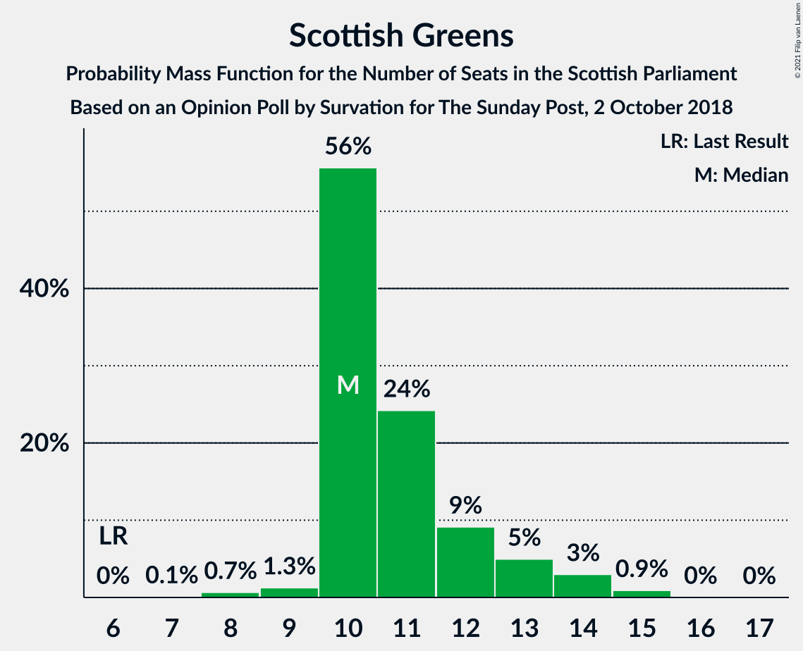
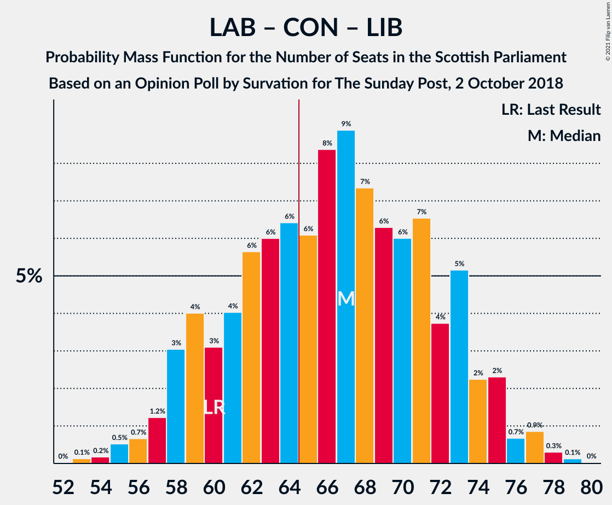

# Opinion Poll by Survation for The Sunday Post, 2 October 2018

<a href="#voting-intentions">Voting Intentions</a> | <a href="#seats">Seats</a> | <a href="#coalitions">Coalitions</a> | <a href="#technical-information">Technical Information</a>

## Voting Intentions

### Confidence Intervals

| Party | Last Result | Poll Result | 80% Confidence Interval | 90% Confidence Interval | 95% Confidence Interval | 99% Confidence Interval |
|:-----:|:-----------:|:-----------:|:-----------------------:|:-----------------------:|:-----------------------:|:-----------------------:|
| Scottish National Party | 41.7% | 32.2% | 30.4–34.1% |29.9–34.7% |29.5–35.2% |28.6–36.1% |
| Scottish Labour | 19.1% | 23.2% | 21.5–24.9% |21.1–25.4% |20.7–25.8% |19.9–26.7% |
| Scottish Conservative & Unionist Party | 22.9% | 21.1% | 19.6–22.8% |19.1–23.3% |18.8–23.7% |18.0–24.6% |
| Scottish Greens | 6.6% | 10.0% | 8.9–11.3% |8.6–11.7% |8.4–12.0% |7.8–12.7% |
| Scottish Liberal Democrats | 5.2% | 8.1% | 7.1–9.3% |6.8–9.6% |6.6–9.9% |6.1–10.5% |
| UK Independence Party | 2.0% | 5.0% | 4.2–6.0% |4.0–6.3% |3.8–6.5% |3.5–7.0% |

*Note:* The poll result column reflects the actual value used in the calculations. Published results may vary slightly, and in addition be rounded to fewer digits.

## Seats

### Confidence Intervals

| Party | Last Result | Median | 80% Confidence Interval | 90% Confidence Interval | 95% Confidence Interval | 99% Confidence Interval |
|:-----:|:-----------:|:------:|:-----------------------:|:-----------------------:|:-----------------------:|:-----------------------:|
| <a href="#scottish-national-party">Scottish National Party</a> | 63 | 49 | 43–57 |42–59 |41–59 |38–61 |
| <a href="#scottish-labour">Scottish Labour</a> | 24 | 30 | 26–35 |25–36 |25–37 |23–39 |
| <a href="#scottish-conservative-&-unionist-party">Scottish Conservative & Unionist Party</a> | 31 | 27 | 23–30 |22–30 |22–31 |21–33 |
| <a href="#scottish-greens">Scottish Greens</a> | 6 | 10 | 10–12 |10–13 |10–14 |8–15 |
| <a href="#scottish-liberal-democrats">Scottish Liberal Democrats</a> | 5 | 10 | 7–12 |6–12 |6–12 |5–13 |
| <a href="#uk-independence-party">UK Independence Party</a> | 0 | 2 | 0–6 |0–7 |0–8 |0–8 |

### Scottish National Party

*For a full overview of the results for this party, see the [Scottish National Party](party-scottishnationalparty.html) page.*

| Number of Seats | Probability | Accumulated | Special Marks |
|:---------------:|:-----------:|:-----------:|:-------------:|
| 37 | 0.1% | 100% |  |
| 38 | 0.4% | 99.8% |  |
| 39 | 0.6% | 99.5% |  |
| 40 | 1.0% | 98.8% |  |
| 41 | 2% | 98% |  |
| 42 | 5% | 96% |  |
| 43 | 6% | 91% |  |
| 44 | 6% | 85% |  |
| 45 | 7% | 80% |  |
| 46 | 8% | 73% |  |
| 47 | 6% | 65% |  |
| 48 | 7% | 59% |  |
| 49 | 6% | 52% | Median |
| 50 | 8% | 46% |  |
| 51 | 8% | 38% |  |
| 52 | 5% | 31% |  |
| 53 | 5% | 26% |  |
| 54 | 4% | 21% |  |
| 55 | 2% | 17% |  |
| 56 | 4% | 15% |  |
| 57 | 2% | 11% |  |
| 58 | 3% | 9% |  |
| 59 | 4% | 6% |  |
| 60 | 1.3% | 2% |  |
| 61 | 0.4% | 0.7% |  |
| 62 | 0.2% | 0.3% |  |
| 63 | 0.1% | 0.2% | Last Result |
| 64 | 0% | 0% |  |

### Scottish Labour

*For a full overview of the results for this party, see the [Scottish Labour](party-scottishlabour.html) page.*

| Number of Seats | Probability | Accumulated | Special Marks |
|:---------------:|:-----------:|:-----------:|:-------------:|
| 22 | 0.1% | 100% |  |
| 23 | 0.4% | 99.9% |  |
| 24 | 2% | 99.5% | Last Result |
| 25 | 4% | 98% |  |
| 26 | 7% | 94% |  |
| 27 | 8% | 87% |  |
| 28 | 9% | 78% |  |
| 29 | 10% | 69% |  |
| 30 | 13% | 59% | Median |
| 31 | 11% | 46% |  |
| 32 | 11% | 35% |  |
| 33 | 6% | 24% |  |
| 34 | 5% | 18% |  |
| 35 | 6% | 13% |  |
| 36 | 3% | 7% |  |
| 37 | 2% | 4% |  |
| 38 | 1.1% | 2% |  |
| 39 | 0.4% | 0.6% |  |
| 40 | 0.1% | 0.2% |  |
| 41 | 0% | 0.1% |  |
| 42 | 0% | 0% |  |

### Scottish Conservative & Unionist Party

*For a full overview of the results for this party, see the [Scottish Conservative & Unionist Party](party-scottishconservativeunionistparty.html) page.*

| Number of Seats | Probability | Accumulated | Special Marks |
|:---------------:|:-----------:|:-----------:|:-------------:|
| 19 | 0% | 100% |  |
| 20 | 0.2% | 99.9% |  |
| 21 | 1.0% | 99.7% |  |
| 22 | 4% | 98.7% |  |
| 23 | 5% | 95% |  |
| 24 | 9% | 90% |  |
| 25 | 10% | 80% |  |
| 26 | 17% | 70% |  |
| 27 | 20% | 53% | Median |
| 28 | 10% | 33% |  |
| 29 | 11% | 23% |  |
| 30 | 7% | 12% |  |
| 31 | 3% | 5% | Last Result |
| 32 | 1.0% | 2% |  |
| 33 | 0.7% | 0.8% |  |
| 34 | 0.1% | 0.1% |  |
| 35 | 0% | 0% |  |

### Scottish Greens

*For a full overview of the results for this party, see the [Scottish Greens](party-scottishgreens.html) page.*

| Number of Seats | Probability | Accumulated | Special Marks |
|:---------------:|:-----------:|:-----------:|:-------------:|
| 6 | 0% | 100% | Last Result |
| 7 | 0.1% | 100% |  |
| 8 | 0.7% | 99.9% |  |
| 9 | 1.3% | 99.2% |  |
| 10 | 56% | 98% | Median |
| 11 | 24% | 42% |  |
| 12 | 9% | 18% |  |
| 13 | 5% | 9% |  |
| 14 | 3% | 4% |  |
| 15 | 0.9% | 1.0% |  |
| 16 | 0% | 0.1% |  |
| 17 | 0% | 0% |  |

### Scottish Liberal Democrats

*For a full overview of the results for this party, see the [Scottish Liberal Democrats](party-scottishliberaldemocrats.html) page.*

| Number of Seats | Probability | Accumulated | Special Marks |
|:---------------:|:-----------:|:-----------:|:-------------:|
| 5 | 2% | 100% | Last Result |
| 6 | 7% | 98% |  |
| 7 | 7% | 91% |  |
| 8 | 12% | 84% |  |
| 9 | 16% | 72% |  |
| 10 | 21% | 56% | Median |
| 11 | 24% | 34% |  |
| 12 | 9% | 11% |  |
| 13 | 1.4% | 2% |  |
| 14 | 0.1% | 0.1% |  |
| 15 | 0% | 0% |  |

### UK Independence Party

*For a full overview of the results for this party, see the [UK Independence Party](party-ukindependenceparty.html) page.*

| Number of Seats | Probability | Accumulated | Special Marks |
|:---------------:|:-----------:|:-----------:|:-------------:|
| 0 | 26% | 100% | Last Result |
| 1 | 10% | 74% |  |
| 2 | 15% | 64% | Median |
| 3 | 16% | 50% |  |
| 4 | 11% | 34% |  |
| 5 | 9% | 23% |  |
| 6 | 7% | 14% |  |
| 7 | 3% | 7% |  |
| 8 | 4% | 4% |  |
| 9 | 0% | 0% |  |

## Coalitions

### Confidence Intervals

| Coalition | Last Result | Median | Majority? | 80% Confidence Interval | 90% Confidence Interval | 95% Confidence Interval | 99% Confidence Interval |
|:---------:|:-----------:|:------:|:---------:|:-----------------------:|:-----------------------:|:-----------------------:|:-----------------------:|
| Scottish Labour – Scottish Conservative & Unionist Party – Scottish Liberal Democrats | 60 | 67 | 65% | 60–73 | 58–74 | 57–75 | 55–77 |
| Scottish National Party – Scottish Greens | 69 | 59 | 19% | 54–67 | 52–69 | 51–70 | 49–72 |
| Scottish Labour – Scottish Conservative & Unionist Party | 55 | 57 | 2% | 51–63 | 50–63 | 49–64 | 47–67 |
| Scottish Labour – Scottish Greens – Scottish Liberal Democrats | 35 | 51 | 0% | 45–56 | 44–57 | 43–59 | 41–61 |
| Scottish National Party | 63 | 49 | 0% | 43–57 | 42–59 | 41–59 | 38–61 |
| Scottish Labour – Scottish Liberal Democrats | 29 | 40 | 0% | 35–45 | 33–47 | 33–48 | 31–50 |
| Scottish Conservative & Unionist Party – Scottish Liberal Democrats | 36 | 36 | 0% | 32–40 | 31–41 | 30–42 | 28–43 |

### Scottish Labour – Scottish Conservative & Unionist Party – Scottish Liberal Democrats

| Number of Seats | Probability | Accumulated | Special Marks |
|:---------------:|:-----------:|:-----------:|:-------------:|
| 53 | 0.1% | 100% |  |
| 54 | 0.2% | 99.8% |  |
| 55 | 0.5% | 99.7% |  |
| 56 | 0.7% | 99.1% |  |
| 57 | 1.2% | 98% |  |
| 58 | 3% | 97% |  |
| 59 | 4% | 94% |  |
| 60 | 3% | 90% | Last Result |
| 61 | 4% | 87% |  |
| 62 | 6% | 83% |  |
| 63 | 6% | 77% |  |
| 64 | 6% | 71% |  |
| 65 | 6% | 65% | Majority |
| 66 | 8% | 59% |  |
| 67 | 9% | 51% | Median |
| 68 | 7% | 42% |  |
| 69 | 6% | 34% |  |
| 70 | 6% | 28% |  |
| 71 | 7% | 22% |  |
| 72 | 4% | 15% |  |
| 73 | 5% | 12% |  |
| 74 | 2% | 7% |  |
| 75 | 2% | 4% |  |
| 76 | 0.7% | 2% |  |
| 77 | 0.9% | 1.3% |  |
| 78 | 0.3% | 0.5% |  |
| 79 | 0.1% | 0.2% |  |
| 80 | 0% | 0% |  |

### Scottish National Party – Scottish Greens

| Number of Seats | Probability | Accumulated | Special Marks |
|:---------------:|:-----------:|:-----------:|:-------------:|
| 47 | 0.1% | 100% |  |
| 48 | 0.2% | 99.9% |  |
| 49 | 0.4% | 99.6% |  |
| 50 | 0.8% | 99.2% |  |
| 51 | 2% | 98% |  |
| 52 | 3% | 97% |  |
| 53 | 3% | 94% |  |
| 54 | 7% | 91% |  |
| 55 | 7% | 84% |  |
| 56 | 7% | 78% |  |
| 57 | 6% | 71% |  |
| 58 | 8% | 65% |  |
| 59 | 8% | 58% | Median |
| 60 | 5% | 50% |  |
| 61 | 8% | 45% |  |
| 62 | 5% | 36% |  |
| 63 | 6% | 31% |  |
| 64 | 6% | 25% |  |
| 65 | 3% | 19% | Majority |
| 66 | 4% | 16% |  |
| 67 | 2% | 12% |  |
| 68 | 3% | 10% |  |
| 69 | 4% | 7% | Last Result |
| 70 | 2% | 3% |  |
| 71 | 0.5% | 1.0% |  |
| 72 | 0.3% | 0.5% |  |
| 73 | 0.2% | 0.2% |  |
| 74 | 0.1% | 0.1% |  |
| 75 | 0% | 0% |  |

### Scottish Labour – Scottish Conservative & Unionist Party

| Number of Seats | Probability | Accumulated | Special Marks |
|:---------------:|:-----------:|:-----------:|:-------------:|
| 45 | 0.1% | 100% |  |
| 46 | 0.2% | 99.9% |  |
| 47 | 0.5% | 99.7% |  |
| 48 | 0.9% | 99.3% |  |
| 49 | 2% | 98% |  |
| 50 | 4% | 96% |  |
| 51 | 3% | 92% |  |
| 52 | 6% | 89% |  |
| 53 | 8% | 83% |  |
| 54 | 7% | 75% |  |
| 55 | 6% | 69% | Last Result |
| 56 | 10% | 63% |  |
| 57 | 8% | 53% | Median |
| 58 | 7% | 45% |  |
| 59 | 7% | 38% |  |
| 60 | 5% | 30% |  |
| 61 | 7% | 25% |  |
| 62 | 8% | 18% |  |
| 63 | 6% | 10% |  |
| 64 | 2% | 5% |  |
| 65 | 1.2% | 2% | Majority |
| 66 | 0.7% | 1.2% |  |
| 67 | 0.3% | 0.5% |  |
| 68 | 0.1% | 0.2% |  |
| 69 | 0% | 0.1% |  |
| 70 | 0% | 0% |  |

### Scottish Labour – Scottish Greens – Scottish Liberal Democrats

| Number of Seats | Probability | Accumulated | Special Marks |
|:---------------:|:-----------:|:-----------:|:-------------:|
| 35 | 0% | 100% | Last Result |
| 36 | 0% | 100% |  |
| 37 | 0% | 100% |  |
| 38 | 0% | 100% |  |
| 39 | 0% | 100% |  |
| 40 | 0.1% | 100% |  |
| 41 | 0.6% | 99.8% |  |
| 42 | 1.2% | 99.3% |  |
| 43 | 3% | 98% |  |
| 44 | 3% | 95% |  |
| 45 | 4% | 92% |  |
| 46 | 6% | 88% |  |
| 47 | 7% | 82% |  |
| 48 | 6% | 75% |  |
| 49 | 9% | 69% |  |
| 50 | 9% | 60% | Median |
| 51 | 11% | 51% |  |
| 52 | 8% | 39% |  |
| 53 | 9% | 32% |  |
| 54 | 5% | 23% |  |
| 55 | 4% | 18% |  |
| 56 | 5% | 14% |  |
| 57 | 4% | 8% |  |
| 58 | 2% | 4% |  |
| 59 | 1.4% | 3% |  |
| 60 | 0.6% | 1.1% |  |
| 61 | 0.3% | 0.5% |  |
| 62 | 0.1% | 0.2% |  |
| 63 | 0% | 0.1% |  |
| 64 | 0% | 0% |  |

### Scottish National Party

| Number of Seats | Probability | Accumulated | Special Marks |
|:---------------:|:-----------:|:-----------:|:-------------:|
| 37 | 0.1% | 100% |  |
| 38 | 0.4% | 99.8% |  |
| 39 | 0.6% | 99.5% |  |
| 40 | 1.0% | 98.8% |  |
| 41 | 2% | 98% |  |
| 42 | 5% | 96% |  |
| 43 | 6% | 91% |  |
| 44 | 6% | 85% |  |
| 45 | 7% | 80% |  |
| 46 | 8% | 73% |  |
| 47 | 6% | 65% |  |
| 48 | 7% | 59% |  |
| 49 | 6% | 52% | Median |
| 50 | 8% | 46% |  |
| 51 | 8% | 38% |  |
| 52 | 5% | 31% |  |
| 53 | 5% | 26% |  |
| 54 | 4% | 21% |  |
| 55 | 2% | 17% |  |
| 56 | 4% | 15% |  |
| 57 | 2% | 11% |  |
| 58 | 3% | 9% |  |
| 59 | 4% | 6% |  |
| 60 | 1.3% | 2% |  |
| 61 | 0.4% | 0.7% |  |
| 62 | 0.2% | 0.3% |  |
| 63 | 0.1% | 0.2% | Last Result |
| 64 | 0% | 0% |  |

### Scottish Labour – Scottish Liberal Democrats

| Number of Seats | Probability | Accumulated | Special Marks |
|:---------------:|:-----------:|:-----------:|:-------------:|
| 29 | 0.1% | 100% | Last Result |
| 30 | 0.2% | 99.9% |  |
| 31 | 0.8% | 99.8% |  |
| 32 | 1.2% | 99.0% |  |
| 33 | 3% | 98% |  |
| 34 | 4% | 94% |  |
| 35 | 5% | 91% |  |
| 36 | 6% | 85% |  |
| 37 | 8% | 79% |  |
| 38 | 8% | 71% |  |
| 39 | 11% | 63% |  |
| 40 | 10% | 52% | Median |
| 41 | 11% | 42% |  |
| 42 | 7% | 30% |  |
| 43 | 5% | 23% |  |
| 44 | 5% | 18% |  |
| 45 | 4% | 13% |  |
| 46 | 3% | 9% |  |
| 47 | 3% | 6% |  |
| 48 | 1.3% | 3% |  |
| 49 | 0.8% | 2% |  |
| 50 | 0.5% | 0.7% |  |
| 51 | 0.2% | 0.2% |  |
| 52 | 0% | 0.1% |  |
| 53 | 0% | 0% |  |

### Scottish Conservative & Unionist Party – Scottish Liberal Democrats

| Number of Seats | Probability | Accumulated | Special Marks |
|:---------------:|:-----------:|:-----------:|:-------------:|
| 26 | 0.1% | 100% |  |
| 27 | 0.1% | 99.9% |  |
| 28 | 0.3% | 99.8% |  |
| 29 | 0.7% | 99.5% |  |
| 30 | 2% | 98.7% |  |
| 31 | 3% | 97% |  |
| 32 | 7% | 93% |  |
| 33 | 8% | 86% |  |
| 34 | 9% | 78% |  |
| 35 | 11% | 69% |  |
| 36 | 13% | 59% | Last Result |
| 37 | 14% | 46% | Median |
| 38 | 12% | 32% |  |
| 39 | 5% | 20% |  |
| 40 | 6% | 15% |  |
| 41 | 3% | 8% |  |
| 42 | 3% | 5% |  |
| 43 | 1.0% | 1.5% |  |
| 44 | 0.4% | 0.5% |  |
| 45 | 0.1% | 0.1% |  |
| 46 | 0% | 0% |  |

## Technical Information

### Opinion Poll

+ **Polling firm:** Survation
+ **Commissioner(s):** The Sunday Post
+ **Fieldwork period:** 2 October 2018

### Calculations

+ **Sample size:** 1036
+ **Simulations done:** 1,048,576
+ **Error estimate:** 0.94%

