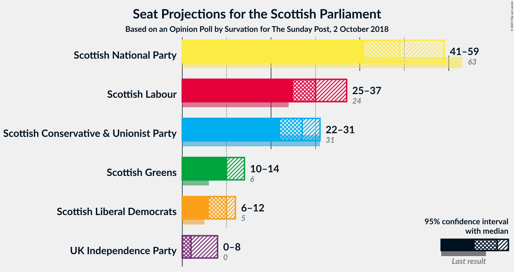
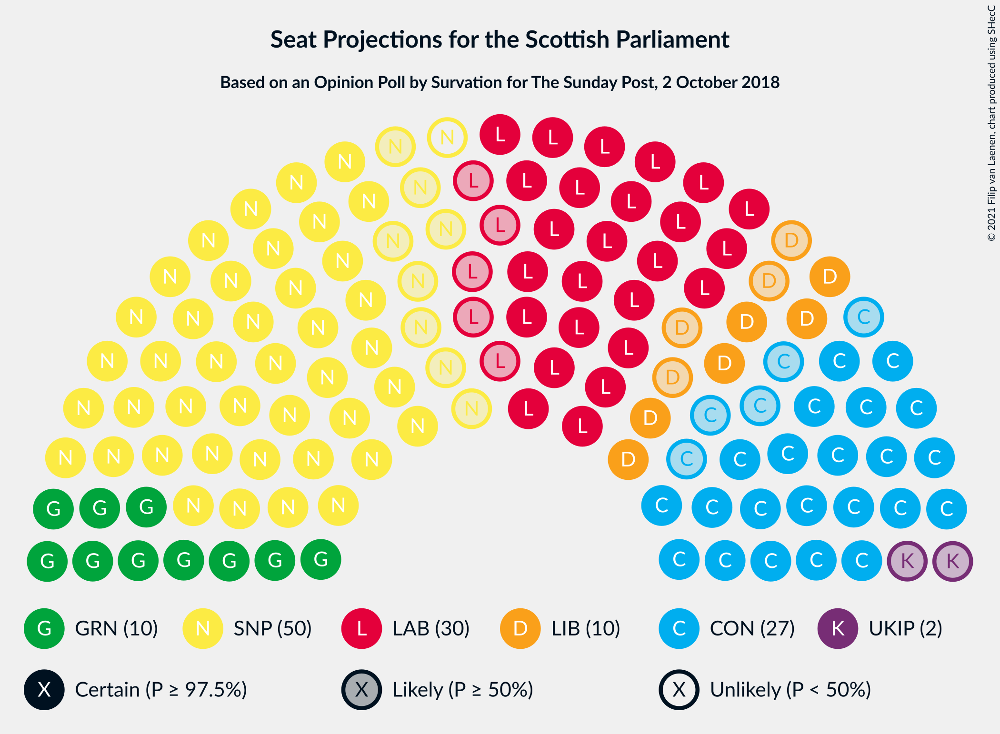
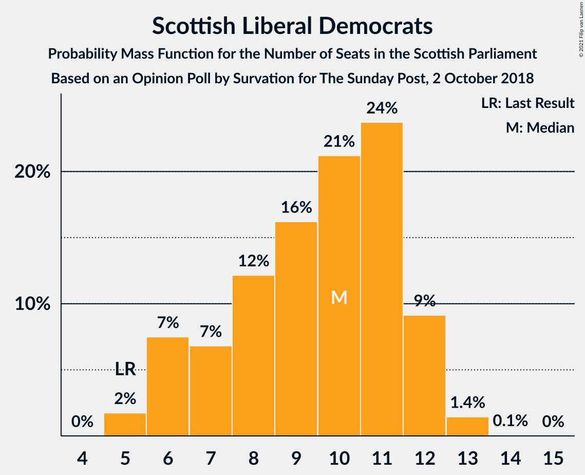
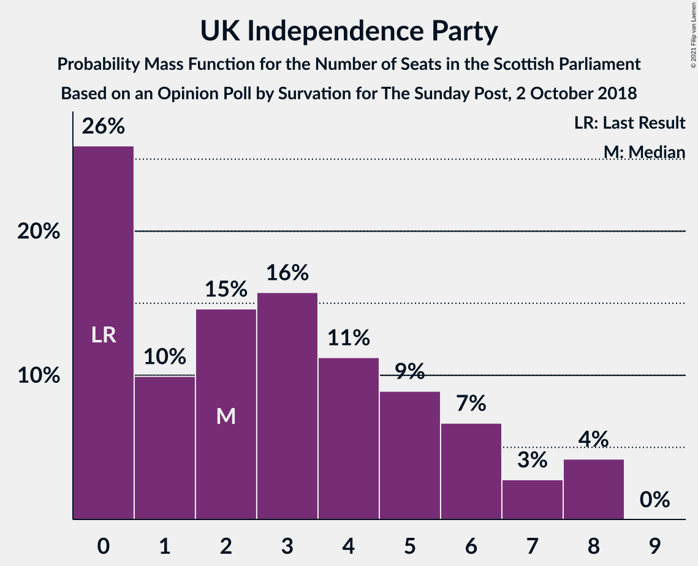

# Opinion Poll by Survation for The Sunday Post, 2 October 2018

<a href="#voting-intentions">Voting Intentions</a> | <a href="#seats">Seats</a> | <a href="#coalitions">Coalitions</a> | <a href="#technical-information">Technical Information</a>

## Voting Intentions

### Confidence Intervals

| Party | Last Result | Poll Result | 80% Confidence Interval | 90% Confidence Interval | 95% Confidence Interval | 99% Confidence Interval |
|:-----:|:-----------:|:-----------:|:-----------------------:|:-----------------------:|:-----------------------:|:-----------------------:|
| Scottish National Party | 41.7% | 32.2% | 30.4–34.1% |29.9–34.7% |29.5–35.2% |28.6–36.1% |
| Scottish Labour | 19.1% | 23.2% | 21.5–24.9% |21.1–25.4% |20.7–25.8% |19.9–26.7% |
| Scottish Conservative & Unionist Party | 22.9% | 21.1% | 19.6–22.8% |19.1–23.3% |18.8–23.7% |18.0–24.6% |
| Scottish Greens | 6.6% | 10.0% | 8.9–11.3% |8.6–11.7% |8.4–12.0% |7.8–12.7% |
| Scottish Liberal Democrats | 5.2% | 8.1% | 7.1–9.3% |6.8–9.6% |6.6–9.9% |6.1–10.5% |
| UK Independence Party | 2.0% | 5.0% | 4.2–6.0% |4.0–6.3% |3.8–6.5% |3.5–7.0% |

*Note:* The poll result column reflects the actual value used in the calculations. Published results may vary slightly, and in addition be rounded to fewer digits.

## Seats

### Confidence Intervals

| Party | Last Result | Median | 80% Confidence Interval | 90% Confidence Interval | 95% Confidence Interval | 99% Confidence Interval |
|:-----:|:-----------:|:------:|:-----------------------:|:-----------------------:|:-----------------------:|:-----------------------:|
| <a href="#scottish-national-party">Scottish National Party</a> | 63 | 58 | 53–60 |52–61 |51–61 |49–63 |
| <a href="#scottish-labour">Scottish Labour</a> | 24 | 27 | 25–30 |25–30 |24–31 |23–32 |
| <a href="#scottish-conservative-&-unionist-party">Scottish Conservative & Unionist Party</a> | 31 | 25 | 23–28 |22–29 |21–30 |19–31 |
| <a href="#scottish-greens">Scottish Greens</a> | 6 | 10 | 10–12 |9–12 |8–13 |8–14 |
| <a href="#scottish-liberal-democrats">Scottish Liberal Democrats</a> | 5 | 8 | 5–9 |5–10 |5–11 |5–11 |
| <a href="#uk-independence-party">UK Independence Party</a> | 0 | 2 | 0–3 |0–4 |0–6 |0–8 |

### Scottish National Party

*For a full overview of the results for this party, see the [Scottish National Party](party-scottishnationalparty.html) page.*

| Number of Seats | Probability | Accumulated | Special Marks |
|:---------------:|:-----------:|:-----------:|:-------------:|
| 46 | 0% | 100% |  |
| 47 | 0% | 99.9% |  |
| 48 | 0.2% | 99.9% |  |
| 49 | 0.4% | 99.7% |  |
| 50 | 0.9% | 99.4% |  |
| 51 | 1.1% | 98% |  |
| 52 | 6% | 97% |  |
| 53 | 12% | 91% |  |
| 54 | 7% | 79% |  |
| 55 | 3% | 72% |  |
| 56 | 3% | 69% |  |
| 57 | 6% | 66% |  |
| 58 | 18% | 60% | Median |
| 59 | 27% | 42% |  |
| 60 | 10% | 15% |  |
| 61 | 3% | 5% |  |
| 62 | 1.2% | 2% |  |
| 63 | 1.0% | 1.2% | Last Result |
| 64 | 0.2% | 0.3% |  |
| 65 | 0.1% | 0.1% | Majority |
| 66 | 0% | 0% |  |

### Scottish Labour

*For a full overview of the results for this party, see the [Scottish Labour](party-scottishlabour.html) page.*

| Number of Seats | Probability | Accumulated | Special Marks |
|:---------------:|:-----------:|:-----------:|:-------------:|
| 21 | 0.1% | 100% |  |
| 22 | 0.2% | 99.9% |  |
| 23 | 1.4% | 99.7% |  |
| 24 | 3% | 98% | Last Result |
| 25 | 11% | 96% |  |
| 26 | 20% | 84% |  |
| 27 | 16% | 65% | Median |
| 28 | 22% | 49% |  |
| 29 | 16% | 27% |  |
| 30 | 7% | 11% |  |
| 31 | 3% | 4% |  |
| 32 | 1.1% | 2% |  |
| 33 | 0.3% | 0.4% |  |
| 34 | 0.1% | 0.1% |  |
| 35 | 0% | 0% |  |

### Scottish Conservative & Unionist Party

*For a full overview of the results for this party, see the [Scottish Conservative & Unionist Party](party-scottishconservativeunionistparty.html) page.*

| Number of Seats | Probability | Accumulated | Special Marks |
|:---------------:|:-----------:|:-----------:|:-------------:|
| 18 | 0.2% | 100% |  |
| 19 | 0.3% | 99.8% |  |
| 20 | 0.9% | 99.4% |  |
| 21 | 1.2% | 98.5% |  |
| 22 | 3% | 97% |  |
| 23 | 10% | 94% |  |
| 24 | 26% | 84% |  |
| 25 | 25% | 58% | Median |
| 26 | 15% | 34% |  |
| 27 | 8% | 19% |  |
| 28 | 5% | 11% |  |
| 29 | 2% | 6% |  |
| 30 | 3% | 4% |  |
| 31 | 0.3% | 0.6% | Last Result |
| 32 | 0.2% | 0.3% |  |
| 33 | 0.1% | 0.1% |  |
| 34 | 0% | 0% |  |

### Scottish Greens

*For a full overview of the results for this party, see the [Scottish Greens](party-scottishgreens.html) page.*

| Number of Seats | Probability | Accumulated | Special Marks |
|:---------------:|:-----------:|:-----------:|:-------------:|
| 6 | 0% | 100% | Last Result |
| 7 | 0.3% | 99.9% |  |
| 8 | 4% | 99.6% |  |
| 9 | 4% | 96% |  |
| 10 | 69% | 91% | Median |
| 11 | 10% | 22% |  |
| 12 | 9% | 12% |  |
| 13 | 3% | 4% |  |
| 14 | 0.8% | 0.8% |  |
| 15 | 0% | 0.1% |  |
| 16 | 0% | 0% |  |

### Scottish Liberal Democrats

*For a full overview of the results for this party, see the [Scottish Liberal Democrats](party-scottishliberaldemocrats.html) page.*

| Number of Seats | Probability | Accumulated | Special Marks |
|:---------------:|:-----------:|:-----------:|:-------------:|
| 5 | 13% | 100% | Last Result |
| 6 | 10% | 87% |  |
| 7 | 12% | 77% |  |
| 8 | 37% | 65% | Median |
| 9 | 19% | 28% |  |
| 10 | 5% | 9% |  |
| 11 | 4% | 4% |  |
| 12 | 0.2% | 0.2% |  |
| 13 | 0% | 0% |  |

### UK Independence Party

*For a full overview of the results for this party, see the [UK Independence Party](party-ukindependenceparty.html) page.*

| Number of Seats | Probability | Accumulated | Special Marks |
|:---------------:|:-----------:|:-----------:|:-------------:|
| 0 | 31% | 100% | Last Result |
| 1 | 12% | 69% |  |
| 2 | 36% | 57% | Median |
| 3 | 15% | 21% |  |
| 4 | 2% | 6% |  |
| 5 | 1.2% | 4% |  |
| 6 | 0.7% | 3% |  |
| 7 | 1.0% | 2% |  |
| 8 | 1.0% | 1.0% |  |
| 9 | 0% | 0% |  |

## Coalitions

### Confidence Intervals

| Coalition | Last Result | Median | Majority? | 80% Confidence Interval | 90% Confidence Interval | 95% Confidence Interval | 99% Confidence Interval |
|:---------:|:-----------:|:------:|:---------:|:-----------------------:|:-----------------------:|:-----------------------:|:-----------------------:|
| Scottish National Party – Scottish Greens | 69 | 68 | 74% | 63–70 | 62–71 | 62–72 | 59–74 |
| Scottish Labour – Scottish Conservative & Unionist Party – Scottish Liberal Democrats | 60 | 59 | 10% | 57–64 | 55–65 | 55–66 | 53–68 |
| Scottish National Party | 63 | 58 | 0.1% | 53–60 | 52–61 | 51–61 | 49–63 |
| Scottish Labour – Scottish Conservative & Unionist Party | 55 | 52 | 0% | 49–56 | 48–57 | 47–58 | 46–60 |
| Scottish Labour – Scottish Greens – Scottish Liberal Democrats | 35 | 45 | 0% | 43–49 | 42–50 | 41–50 | 40–52 |
| Scottish Labour – Scottish Liberal Democrats | 29 | 35 | 0% | 33–38 | 31–39 | 31–39 | 30–41 |
| Scottish Conservative & Unionist Party – Scottish Liberal Democrats | 36 | 32 | 0% | 30–36 | 29–37 | 28–37 | 27–40 |

### Scottish National Party – Scottish Greens

| Number of Seats | Probability | Accumulated | Special Marks |
|:---------------:|:-----------:|:-----------:|:-------------:|
| 57 | 0% | 100% |  |
| 58 | 0.1% | 99.9% |  |
| 59 | 0.4% | 99.8% |  |
| 60 | 0.6% | 99.4% |  |
| 61 | 1.1% | 98.8% |  |
| 62 | 3% | 98% |  |
| 63 | 7% | 95% |  |
| 64 | 14% | 88% |  |
| 65 | 2% | 74% | Majority |
| 66 | 4% | 72% |  |
| 67 | 10% | 69% |  |
| 68 | 16% | 59% | Median |
| 69 | 25% | 42% | Last Result |
| 70 | 10% | 17% |  |
| 71 | 3% | 7% |  |
| 72 | 2% | 4% |  |
| 73 | 1.2% | 2% |  |
| 74 | 0.5% | 0.6% |  |
| 75 | 0.1% | 0.1% |  |
| 76 | 0% | 0% |  |

### Scottish Labour – Scottish Conservative & Unionist Party – Scottish Liberal Democrats

| Number of Seats | Probability | Accumulated | Special Marks |
|:---------------:|:-----------:|:-----------:|:-------------:|
| 51 | 0.1% | 100% |  |
| 52 | 0.1% | 99.9% |  |
| 53 | 0.8% | 99.8% |  |
| 54 | 0.8% | 99.0% |  |
| 55 | 3% | 98% |  |
| 56 | 3% | 95% |  |
| 57 | 6% | 91% |  |
| 58 | 17% | 86% |  |
| 59 | 19% | 69% |  |
| 60 | 10% | 50% | Last Result, Median |
| 61 | 7% | 39% |  |
| 62 | 10% | 33% |  |
| 63 | 6% | 22% |  |
| 64 | 6% | 16% |  |
| 65 | 6% | 10% | Majority |
| 66 | 2% | 3% |  |
| 67 | 0.7% | 1.2% |  |
| 68 | 0.3% | 0.5% |  |
| 69 | 0.2% | 0.3% |  |
| 70 | 0% | 0.1% |  |
| 71 | 0% | 0% |  |

### Scottish National Party

| Number of Seats | Probability | Accumulated | Special Marks |
|:---------------:|:-----------:|:-----------:|:-------------:|
| 46 | 0% | 100% |  |
| 47 | 0% | 99.9% |  |
| 48 | 0.2% | 99.9% |  |
| 49 | 0.4% | 99.7% |  |
| 50 | 0.9% | 99.4% |  |
| 51 | 1.1% | 98% |  |
| 52 | 6% | 97% |  |
| 53 | 12% | 91% |  |
| 54 | 7% | 79% |  |
| 55 | 3% | 72% |  |
| 56 | 3% | 69% |  |
| 57 | 6% | 66% |  |
| 58 | 18% | 60% | Median |
| 59 | 27% | 42% |  |
| 60 | 10% | 15% |  |
| 61 | 3% | 5% |  |
| 62 | 1.2% | 2% |  |
| 63 | 1.0% | 1.2% | Last Result |
| 64 | 0.2% | 0.3% |  |
| 65 | 0.1% | 0.1% | Majority |
| 66 | 0% | 0% |  |

### Scottish Labour – Scottish Conservative & Unionist Party

| Number of Seats | Probability | Accumulated | Special Marks |
|:---------------:|:-----------:|:-----------:|:-------------:|
| 44 | 0.1% | 100% |  |
| 45 | 0.3% | 99.8% |  |
| 46 | 0.6% | 99.6% |  |
| 47 | 2% | 98.9% |  |
| 48 | 3% | 97% |  |
| 49 | 5% | 94% |  |
| 50 | 20% | 89% |  |
| 51 | 7% | 69% |  |
| 52 | 13% | 62% | Median |
| 53 | 14% | 49% |  |
| 54 | 15% | 35% |  |
| 55 | 6% | 20% | Last Result |
| 56 | 6% | 14% |  |
| 57 | 5% | 8% |  |
| 58 | 1.3% | 3% |  |
| 59 | 1.0% | 2% |  |
| 60 | 0.3% | 0.6% |  |
| 61 | 0.2% | 0.3% |  |
| 62 | 0% | 0.1% |  |
| 63 | 0% | 0% |  |

### Scottish Labour – Scottish Greens – Scottish Liberal Democrats

| Number of Seats | Probability | Accumulated | Special Marks |
|:---------------:|:-----------:|:-----------:|:-------------:|
| 35 | 0% | 100% | Last Result |
| 36 | 0% | 100% |  |
| 37 | 0% | 100% |  |
| 38 | 0% | 100% |  |
| 39 | 0.2% | 99.9% |  |
| 40 | 0.8% | 99.8% |  |
| 41 | 3% | 99.0% |  |
| 42 | 4% | 96% |  |
| 43 | 15% | 91% |  |
| 44 | 17% | 76% |  |
| 45 | 14% | 59% | Median |
| 46 | 18% | 45% |  |
| 47 | 8% | 27% |  |
| 48 | 8% | 19% |  |
| 49 | 5% | 12% |  |
| 50 | 6% | 7% |  |
| 51 | 0.6% | 1.2% |  |
| 52 | 0.3% | 0.5% |  |
| 53 | 0.1% | 0.2% |  |
| 54 | 0.1% | 0.1% |  |
| 55 | 0% | 0% |  |

### Scottish Labour – Scottish Liberal Democrats

| Number of Seats | Probability | Accumulated | Special Marks |
|:---------------:|:-----------:|:-----------:|:-------------:|
| 29 | 0.2% | 100% | Last Result |
| 30 | 0.6% | 99.7% |  |
| 31 | 4% | 99.2% |  |
| 32 | 4% | 95% |  |
| 33 | 17% | 91% |  |
| 34 | 18% | 75% |  |
| 35 | 15% | 57% | Median |
| 36 | 18% | 42% |  |
| 37 | 9% | 24% |  |
| 38 | 10% | 15% |  |
| 39 | 3% | 5% |  |
| 40 | 2% | 2% |  |
| 41 | 0.3% | 0.5% |  |
| 42 | 0.1% | 0.3% |  |
| 43 | 0.1% | 0.1% |  |
| 44 | 0% | 0% |  |

### Scottish Conservative & Unionist Party – Scottish Liberal Democrats

| Number of Seats | Probability | Accumulated | Special Marks |
|:---------------:|:-----------:|:-----------:|:-------------:|
| 25 | 0.1% | 100% |  |
| 26 | 0.4% | 99.9% |  |
| 27 | 0.9% | 99.5% |  |
| 28 | 2% | 98.6% |  |
| 29 | 4% | 97% |  |
| 30 | 12% | 93% |  |
| 31 | 10% | 81% |  |
| 32 | 21% | 71% |  |
| 33 | 15% | 50% | Median |
| 34 | 11% | 34% |  |
| 35 | 7% | 23% |  |
| 36 | 8% | 16% | Last Result |
| 37 | 6% | 8% |  |
| 38 | 0.8% | 2% |  |
| 39 | 0.7% | 1.5% |  |
| 40 | 0.7% | 0.8% |  |
| 41 | 0.1% | 0.1% |  |
| 42 | 0% | 0% |  |

## Technical Information

### Opinion Poll

+ **Polling firm:** Survation
+ **Commissioner(s):** The Sunday Post
+ **Fieldwork period:** 2 October 2018

### Calculations

+ **Sample size:** 1036
+ **Simulations done:** 131,072
+ **Error estimate:** 1.02%

