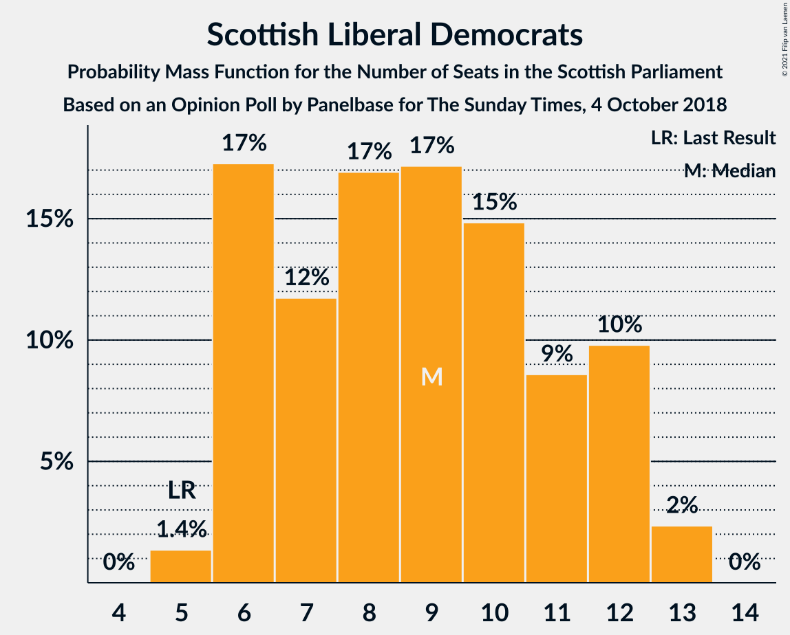
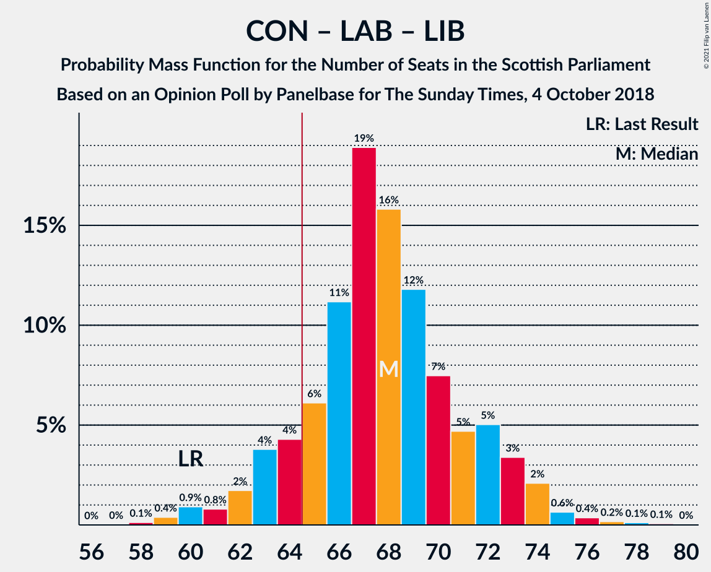
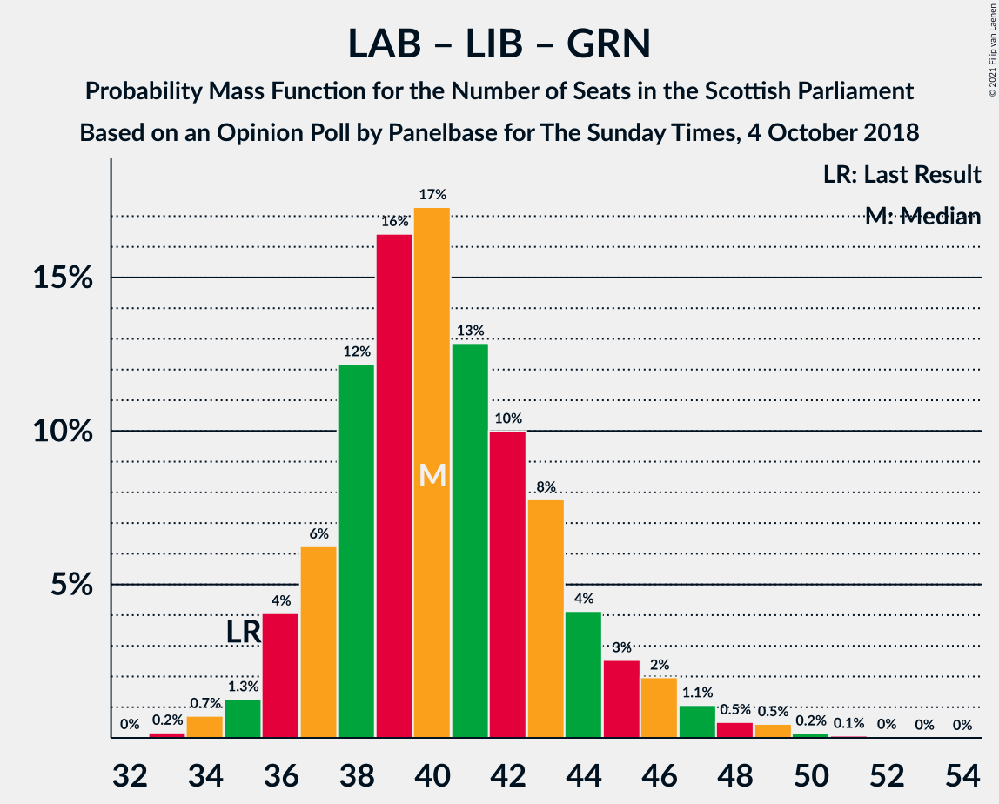

# Opinion Poll by Panelbase for The Sunday Times, 4 October 2018

<a href="#voting-intentions">Voting Intentions</a> | <a href="#seats">Seats</a> | <a href="#coalitions">Coalitions</a> | <a href="#technical-information">Technical Information</a>

## Voting Intentions

### Confidence Intervals

| Party | Last Result | Poll Result | 80% Confidence Interval | 90% Confidence Interval | 95% Confidence Interval | 99% Confidence Interval |
|:-----:|:-----------:|:-----------:|:-----------------------:|:-----------------------:|:-----------------------:|:-----------------------:|
| Scottish National Party | 41.7% | 35.4% | 33.5–37.3% |32.9–37.9% |32.5–38.3% |31.6–39.3% |
| Scottish Conservative & Unionist Party | 22.9% | 26.3% | 24.6–28.1% |24.1–28.6% |23.7–29.1% |22.9–29.9% |
| Scottish Labour | 19.1% | 20.2% | 18.7–21.9% |18.2–22.4% |17.9–22.8% |17.1–23.6% |
| Scottish Liberal Democrats | 5.2% | 8.1% | 7.1–9.3% |6.8–9.6% |6.6–10.0% |6.1–10.5% |
| Scottish Greens | 6.6% | 7.0% | 6.1–8.2% |5.8–8.5% |5.6–8.8% |5.2–9.3% |
| UK Independence Party | 2.0% | 2.1% | 1.6–2.7% |1.4–2.9% |1.3–3.1% |1.1–3.5% |

*Note:* The poll result column reflects the actual value used in the calculations. Published results may vary slightly, and in addition be rounded to fewer digits.

## Seats

### Confidence Intervals

| Party | Last Result | Median | 80% Confidence Interval | 90% Confidence Interval | 95% Confidence Interval | 99% Confidence Interval |
|:-----:|:-----------:|:------:|:-----------------------:|:-----------------------:|:-----------------------:|:-----------------------:|
| <a href="#scottish-national-party">Scottish National Party</a> | 63 | 55 | 52–59 |51–60 |49–60 |46–61 |
| <a href="#scottish-conservative-&-unionist-party">Scottish Conservative & Unionist Party</a> | 31 | 34 | 31–36 |30–37 |29–38 |27–39 |
| <a href="#scottish-labour">Scottish Labour</a> | 24 | 25 | 23–27 |22–28 |22–29 |20–32 |
| <a href="#scottish-liberal-democrats">Scottish Liberal Democrats</a> | 5 | 9 | 6–12 |6–12 |6–12 |5–13 |
| <a href="#scottish-greens">Scottish Greens</a> | 6 | 7 | 4–9 |3–10 |3–10 |2–10 |
| <a href="#uk-independence-party">UK Independence Party</a> | 0 | 0 | 0 |0 |0 |0 |

### Scottish National Party

*For a full overview of the results for this party, see the [Scottish National Party](party-scottishnationalparty.html) page.*

| Number of Seats | Probability | Accumulated | Special Marks |
|:---------------:|:-----------:|:-----------:|:-------------:|
| 44 | 0% | 100% |  |
| 45 | 0.2% | 99.9% |  |
| 46 | 0.3% | 99.7% |  |
| 47 | 0.6% | 99.4% |  |
| 48 | 0.5% | 98.8% |  |
| 49 | 1.5% | 98% |  |
| 50 | 2% | 97% |  |
| 51 | 4% | 95% |  |
| 52 | 7% | 92% |  |
| 53 | 11% | 85% |  |
| 54 | 21% | 74% |  |
| 55 | 20% | 53% | Median |
| 56 | 10% | 33% |  |
| 57 | 6% | 23% |  |
| 58 | 5% | 17% |  |
| 59 | 4% | 12% |  |
| 60 | 6% | 8% |  |
| 61 | 1.5% | 2% |  |
| 62 | 0.2% | 0.4% |  |
| 63 | 0.1% | 0.2% | Last Result |
| 64 | 0% | 0% |  |

### Scottish Conservative & Unionist Party

*For a full overview of the results for this party, see the [Scottish Conservative & Unionist Party](party-scottishconservativeunionistparty.html) page.*

| Number of Seats | Probability | Accumulated | Special Marks |
|:---------------:|:-----------:|:-----------:|:-------------:|
| 25 | 0.1% | 100% |  |
| 26 | 0.2% | 99.9% |  |
| 27 | 0.5% | 99.7% |  |
| 28 | 0.7% | 99.2% |  |
| 29 | 1.2% | 98.5% |  |
| 30 | 3% | 97% |  |
| 31 | 8% | 94% | Last Result |
| 32 | 10% | 86% |  |
| 33 | 14% | 76% |  |
| 34 | 21% | 62% | Median |
| 35 | 18% | 41% |  |
| 36 | 15% | 22% |  |
| 37 | 4% | 8% |  |
| 38 | 3% | 3% |  |
| 39 | 0.6% | 0.8% |  |
| 40 | 0.2% | 0.2% |  |
| 41 | 0.1% | 0.1% |  |
| 42 | 0% | 0% |  |

### Scottish Labour

*For a full overview of the results for this party, see the [Scottish Labour](party-scottishlabour.html) page.*

| Number of Seats | Probability | Accumulated | Special Marks |
|:---------------:|:-----------:|:-----------:|:-------------:|
| 19 | 0.3% | 100% |  |
| 20 | 0.5% | 99.6% |  |
| 21 | 1.3% | 99.1% |  |
| 22 | 5% | 98% |  |
| 23 | 11% | 93% |  |
| 24 | 16% | 82% | Last Result |
| 25 | 24% | 66% | Median |
| 26 | 23% | 42% |  |
| 27 | 10% | 19% |  |
| 28 | 5% | 9% |  |
| 29 | 2% | 5% |  |
| 30 | 1.0% | 2% |  |
| 31 | 0.8% | 1.5% |  |
| 32 | 0.4% | 0.7% |  |
| 33 | 0.2% | 0.3% |  |
| 34 | 0.1% | 0.1% |  |
| 35 | 0% | 0% |  |

### Scottish Liberal Democrats

*For a full overview of the results for this party, see the [Scottish Liberal Democrats](party-scottishliberaldemocrats.html) page.*

| Number of Seats | Probability | Accumulated | Special Marks |
|:---------------:|:-----------:|:-----------:|:-------------:|
| 5 | 1.4% | 100% | Last Result |
| 6 | 17% | 98.6% |  |
| 7 | 12% | 81% |  |
| 8 | 17% | 70% |  |
| 9 | 17% | 53% | Median |
| 10 | 15% | 36% |  |
| 11 | 9% | 21% |  |
| 12 | 10% | 12% |  |
| 13 | 2% | 2% |  |
| 14 | 0% | 0% |  |

### Scottish Greens

*For a full overview of the results for this party, see the [Scottish Greens](party-scottishgreens.html) page.*

| Number of Seats | Probability | Accumulated | Special Marks |
|:---------------:|:-----------:|:-----------:|:-------------:|
| 2 | 2% | 100% |  |
| 3 | 6% | 98% |  |
| 4 | 17% | 93% |  |
| 5 | 9% | 76% |  |
| 6 | 16% | 67% | Last Result |
| 7 | 20% | 51% | Median |
| 8 | 15% | 31% |  |
| 9 | 9% | 16% |  |
| 10 | 7% | 7% |  |
| 11 | 0% | 0% |  |

### UK Independence Party

*For a full overview of the results for this party, see the [UK Independence Party](party-ukindependenceparty.html) page.*

| Number of Seats | Probability | Accumulated | Special Marks |
|:---------------:|:-----------:|:-----------:|:-------------:|
| 0 | 100% | 100% | Last Result, Median |

## Coalitions

### Confidence Intervals

| Coalition | Last Result | Median | Majority? | 80% Confidence Interval | 90% Confidence Interval | 95% Confidence Interval | 99% Confidence Interval |
|:---------:|:-----------:|:------:|:---------:|:-----------------------:|:-----------------------:|:-----------------------:|:-----------------------:|
| Scottish Conservative & Unionist Party – Scottish Labour – Scottish Liberal Democrats | 60 | 68 | 88% | 64–72 | 63–73 | 62–74 | 59–76 |
| Scottish National Party – Scottish Greens | 69 | 61 | 12% | 57–65 | 56–66 | 55–67 | 53–70 |
| Scottish Conservative & Unionist Party – Scottish Labour | 55 | 59 | 3% | 55–62 | 54–64 | 53–65 | 51–67 |
| Scottish National Party | 63 | 55 | 0% | 52–59 | 51–60 | 49–60 | 46–61 |
| Scottish Conservative & Unionist Party – Scottish Liberal Democrats | 36 | 43 | 0% | 39–46 | 38–47 | 37–48 | 35–49 |
| Scottish Labour – Scottish Liberal Democrats – Scottish Greens | 35 | 40 | 0% | 37–44 | 36–45 | 36–46 | 34–49 |
| Scottish Labour – Scottish Liberal Democrats | 29 | 34 | 0% | 31–37 | 30–38 | 30–39 | 28–41 |

### Scottish Conservative & Unionist Party – Scottish Labour – Scottish Liberal Democrats

| Number of Seats | Probability | Accumulated | Special Marks |
|:---------------:|:-----------:|:-----------:|:-------------:|
| 58 | 0.1% | 100% |  |
| 59 | 0.4% | 99.8% |  |
| 60 | 0.9% | 99.5% | Last Result |
| 61 | 0.8% | 98.5% |  |
| 62 | 2% | 98% |  |
| 63 | 4% | 96% |  |
| 64 | 4% | 92% |  |
| 65 | 6% | 88% | Majority |
| 66 | 11% | 82% |  |
| 67 | 19% | 71% |  |
| 68 | 16% | 52% | Median |
| 69 | 12% | 36% |  |
| 70 | 7% | 24% |  |
| 71 | 5% | 17% |  |
| 72 | 5% | 12% |  |
| 73 | 3% | 7% |  |
| 74 | 2% | 4% |  |
| 75 | 0.6% | 1.4% |  |
| 76 | 0.4% | 0.8% |  |
| 77 | 0.2% | 0.4% |  |
| 78 | 0.1% | 0.2% |  |
| 79 | 0.1% | 0.1% |  |
| 80 | 0% | 0% |  |

### Scottish National Party – Scottish Greens

| Number of Seats | Probability | Accumulated | Special Marks |
|:---------------:|:-----------:|:-----------:|:-------------:|
| 50 | 0.1% | 100% |  |
| 51 | 0.1% | 99.9% |  |
| 52 | 0.2% | 99.8% |  |
| 53 | 0.4% | 99.6% |  |
| 54 | 0.6% | 99.2% |  |
| 55 | 2% | 98.6% |  |
| 56 | 3% | 96% |  |
| 57 | 5% | 93% |  |
| 58 | 5% | 88% |  |
| 59 | 7% | 83% |  |
| 60 | 12% | 76% |  |
| 61 | 16% | 64% |  |
| 62 | 19% | 48% | Median |
| 63 | 11% | 29% |  |
| 64 | 6% | 18% |  |
| 65 | 4% | 12% | Majority |
| 66 | 4% | 8% |  |
| 67 | 2% | 4% |  |
| 68 | 0.8% | 2% |  |
| 69 | 0.9% | 1.5% | Last Result |
| 70 | 0.4% | 0.5% |  |
| 71 | 0.1% | 0.2% |  |
| 72 | 0% | 0% |  |

### Scottish Conservative & Unionist Party – Scottish Labour

| Number of Seats | Probability | Accumulated | Special Marks |
|:---------------:|:-----------:|:-----------:|:-------------:|
| 49 | 0.1% | 100% |  |
| 50 | 0.2% | 99.8% |  |
| 51 | 0.3% | 99.6% |  |
| 52 | 0.7% | 99.3% |  |
| 53 | 1.3% | 98.7% |  |
| 54 | 3% | 97% |  |
| 55 | 5% | 95% | Last Result |
| 56 | 7% | 90% |  |
| 57 | 10% | 83% |  |
| 58 | 13% | 73% |  |
| 59 | 14% | 60% | Median |
| 60 | 19% | 46% |  |
| 61 | 11% | 27% |  |
| 62 | 7% | 17% |  |
| 63 | 4% | 9% |  |
| 64 | 3% | 5% |  |
| 65 | 1.1% | 3% | Majority |
| 66 | 0.7% | 1.4% |  |
| 67 | 0.4% | 0.6% |  |
| 68 | 0.1% | 0.3% |  |
| 69 | 0.1% | 0.1% |  |
| 70 | 0% | 0.1% |  |
| 71 | 0% | 0% |  |

### Scottish National Party

| Number of Seats | Probability | Accumulated | Special Marks |
|:---------------:|:-----------:|:-----------:|:-------------:|
| 44 | 0% | 100% |  |
| 45 | 0.2% | 99.9% |  |
| 46 | 0.3% | 99.7% |  |
| 47 | 0.6% | 99.4% |  |
| 48 | 0.5% | 98.8% |  |
| 49 | 1.5% | 98% |  |
| 50 | 2% | 97% |  |
| 51 | 4% | 95% |  |
| 52 | 7% | 92% |  |
| 53 | 11% | 85% |  |
| 54 | 21% | 74% |  |
| 55 | 20% | 53% | Median |
| 56 | 10% | 33% |  |
| 57 | 6% | 23% |  |
| 58 | 5% | 17% |  |
| 59 | 4% | 12% |  |
| 60 | 6% | 8% |  |
| 61 | 1.5% | 2% |  |
| 62 | 0.2% | 0.4% |  |
| 63 | 0.1% | 0.2% | Last Result |
| 64 | 0% | 0% |  |

### Scottish Conservative & Unionist Party – Scottish Liberal Democrats

| Number of Seats | Probability | Accumulated | Special Marks |
|:---------------:|:-----------:|:-----------:|:-------------:|
| 33 | 0.1% | 100% |  |
| 34 | 0.2% | 99.9% |  |
| 35 | 0.6% | 99.7% |  |
| 36 | 0.7% | 99.1% | Last Result |
| 37 | 1.4% | 98% |  |
| 38 | 3% | 97% |  |
| 39 | 4% | 94% |  |
| 40 | 9% | 90% |  |
| 41 | 14% | 81% |  |
| 42 | 16% | 66% |  |
| 43 | 15% | 50% | Median |
| 44 | 11% | 36% |  |
| 45 | 11% | 25% |  |
| 46 | 6% | 13% |  |
| 47 | 4% | 7% |  |
| 48 | 2% | 3% |  |
| 49 | 0.4% | 0.7% |  |
| 50 | 0.2% | 0.2% |  |
| 51 | 0% | 0.1% |  |
| 52 | 0% | 0% |  |

### Scottish Labour – Scottish Liberal Democrats – Scottish Greens

| Number of Seats | Probability | Accumulated | Special Marks |
|:---------------:|:-----------:|:-----------:|:-------------:|
| 33 | 0.2% | 100% |  |
| 34 | 0.7% | 99.8% |  |
| 35 | 1.3% | 99.1% | Last Result |
| 36 | 4% | 98% |  |
| 37 | 6% | 94% |  |
| 38 | 12% | 87% |  |
| 39 | 16% | 75% |  |
| 40 | 17% | 59% |  |
| 41 | 13% | 42% | Median |
| 42 | 10% | 29% |  |
| 43 | 8% | 19% |  |
| 44 | 4% | 11% |  |
| 45 | 3% | 7% |  |
| 46 | 2% | 4% |  |
| 47 | 1.1% | 2% |  |
| 48 | 0.5% | 1.3% |  |
| 49 | 0.5% | 0.7% |  |
| 50 | 0.2% | 0.3% |  |
| 51 | 0.1% | 0.1% |  |
| 52 | 0% | 0.1% |  |
| 53 | 0% | 0% |  |

### Scottish Labour – Scottish Liberal Democrats

| Number of Seats | Probability | Accumulated | Special Marks |
|:---------------:|:-----------:|:-----------:|:-------------:|
| 26 | 0.1% | 100% |  |
| 27 | 0.1% | 99.9% |  |
| 28 | 0.6% | 99.8% |  |
| 29 | 1.4% | 99.2% | Last Result |
| 30 | 5% | 98% |  |
| 31 | 10% | 93% |  |
| 32 | 17% | 83% |  |
| 33 | 14% | 66% |  |
| 34 | 14% | 52% | Median |
| 35 | 11% | 38% |  |
| 36 | 11% | 27% |  |
| 37 | 8% | 17% |  |
| 38 | 5% | 9% |  |
| 39 | 2% | 4% |  |
| 40 | 0.9% | 2% |  |
| 41 | 0.6% | 1.1% |  |
| 42 | 0.2% | 0.5% |  |
| 43 | 0.1% | 0.3% |  |
| 44 | 0.1% | 0.2% |  |
| 45 | 0% | 0.1% |  |
| 46 | 0% | 0% |  |

## Technical Information

### Opinion Poll

+ **Polling firm:** Panelbase
+ **Commissioner(s):** The Sunday Times
+ **Fieldwork period:** 4 October 2018

### Calculations

+ **Sample size:** 1024
+ **Simulations done:** 1,048,576
+ **Error estimate:** 0.62%

