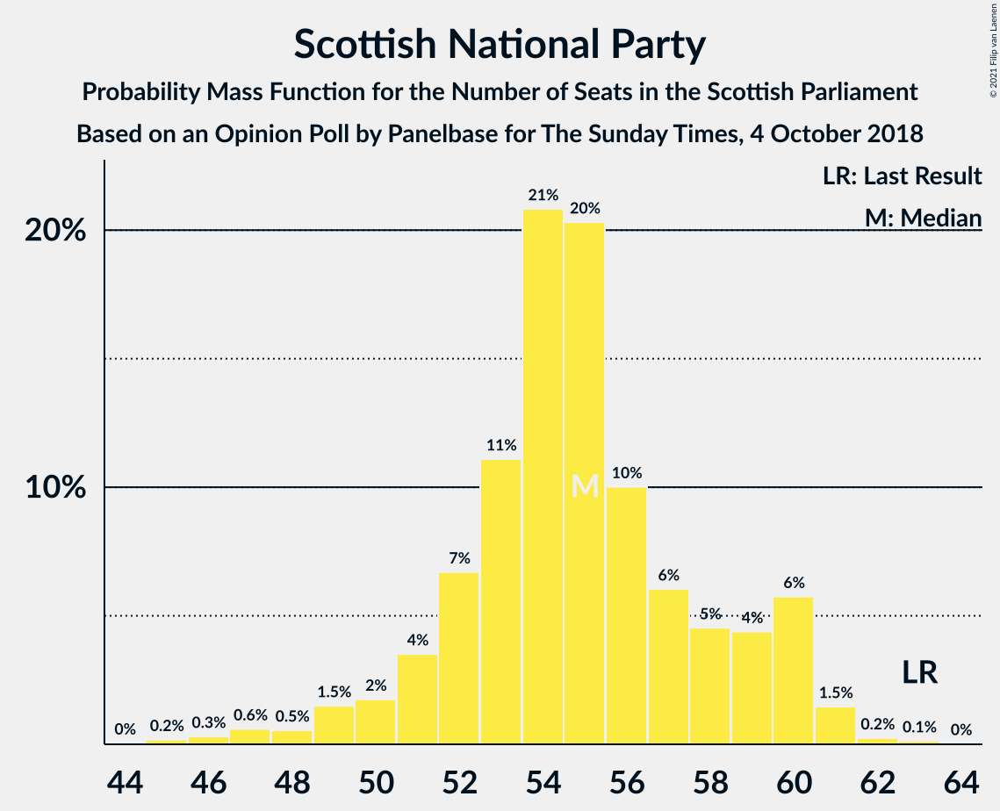
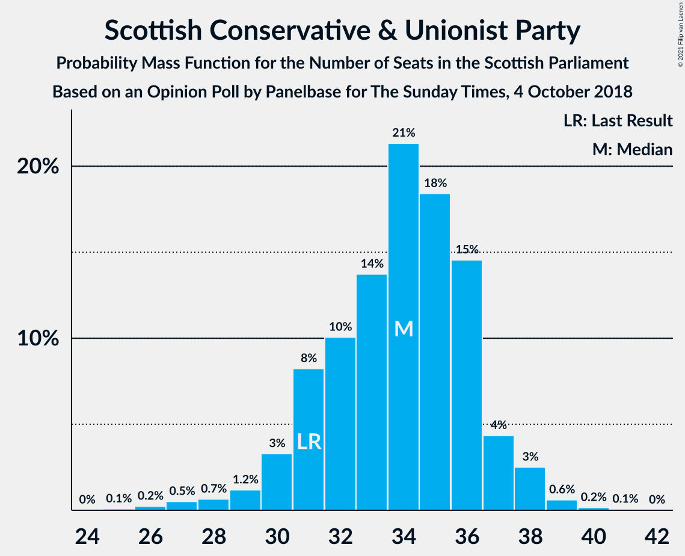
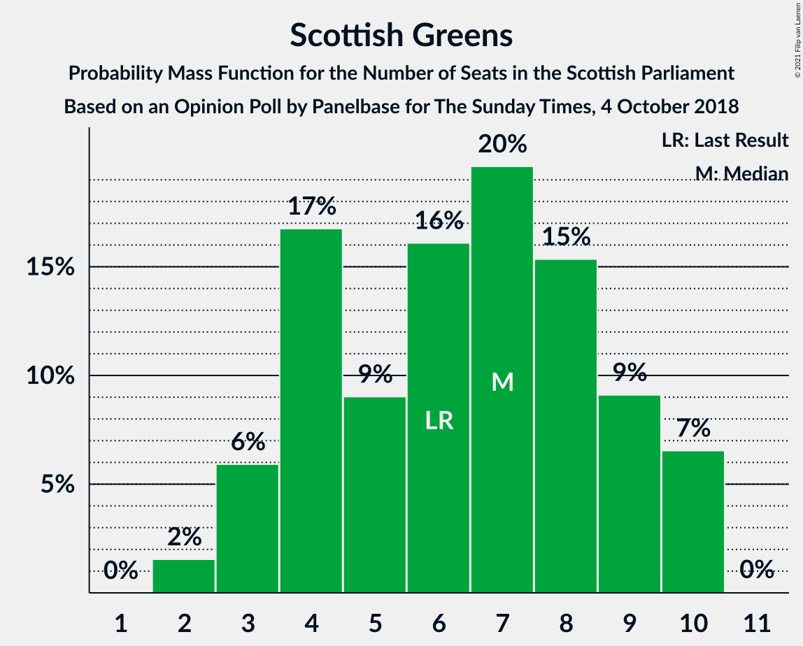
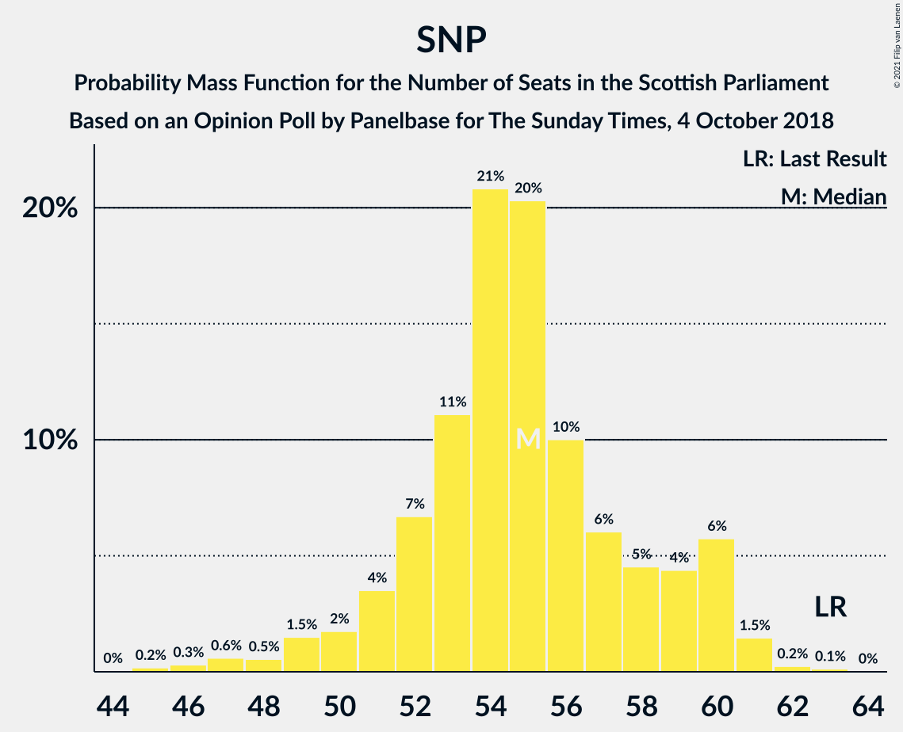

# Opinion Poll by Panelbase for The Sunday Times, 4 October 2018

<a href="#voting-intentions">Voting Intentions</a> | <a href="#seats">Seats</a> | <a href="#coalitions">Coalitions</a> | <a href="#technical-information">Technical Information</a>

## Voting Intentions

### Confidence Intervals

| Party | Last Result | Poll Result | 80% Confidence Interval | 90% Confidence Interval | 95% Confidence Interval | 99% Confidence Interval |
|:-----:|:-----------:|:-----------:|:-----------------------:|:-----------------------:|:-----------------------:|:-----------------------:|
| Scottish National Party | 41.7% | 35.4% | 33.5–37.3% |32.9–37.9% |32.5–38.3% |31.6–39.3% |
| Scottish Conservative & Unionist Party | 22.9% | 26.3% | 24.6–28.1% |24.1–28.6% |23.7–29.1% |22.9–29.9% |
| Scottish Labour | 19.1% | 20.2% | 18.7–21.9% |18.2–22.4% |17.9–22.8% |17.1–23.6% |
| Scottish Liberal Democrats | 5.2% | 8.1% | 7.1–9.3% |6.8–9.6% |6.6–10.0% |6.1–10.5% |
| Scottish Greens | 6.6% | 7.0% | 6.1–8.2% |5.8–8.5% |5.6–8.8% |5.2–9.3% |
| UK Independence Party | 2.0% | 2.1% | 1.6–2.7% |1.4–2.9% |1.3–3.1% |1.1–3.5% |

*Note:* The poll result column reflects the actual value used in the calculations. Published results may vary slightly, and in addition be rounded to fewer digits.

## Seats

### Confidence Intervals

| Party | Last Result | Median | 80% Confidence Interval | 90% Confidence Interval | 95% Confidence Interval | 99% Confidence Interval |
|:-----:|:-----------:|:------:|:-----------------------:|:-----------------------:|:-----------------------:|:-----------------------:|
| <a href="#scottish-national-party">Scottish National Party</a> | 63 | 55 | 53–60 |53–61 |52–62 |51–63 |
| <a href="#scottish-conservative-&-unionist-party">Scottish Conservative & Unionist Party</a> | 31 | 34 | 31–36 |30–37 |29–38 |27–39 |
| <a href="#scottish-labour">Scottish Labour</a> | 24 | 25 | 23–27 |22–28 |22–28 |21–31 |
| <a href="#scottish-liberal-democrats">Scottish Liberal Democrats</a> | 5 | 8 | 6–10 |6–11 |5–12 |5–12 |
| <a href="#scottish-greens">Scottish Greens</a> | 6 | 7 | 4–9 |3–10 |3–10 |2–10 |
| <a href="#uk-independence-party">UK Independence Party</a> | 0 | 0 | 0 |0 |0 |0 |

### Scottish National Party

*For a full overview of the results for this party, see the [Scottish National Party](party-scottishnationalparty.html) page.*

| Number of Seats | Probability | Accumulated | Special Marks |
|:---------------:|:-----------:|:-----------:|:-------------:|
| 49 | 0% | 100% |  |
| 50 | 0.2% | 99.9% |  |
| 51 | 0.7% | 99.7% |  |
| 52 | 4% | 99.0% |  |
| 53 | 26% | 95% |  |
| 54 | 14% | 69% |  |
| 55 | 13% | 55% | Median |
| 56 | 11% | 43% |  |
| 57 | 10% | 32% |  |
| 58 | 7% | 22% |  |
| 59 | 4% | 15% |  |
| 60 | 2% | 11% |  |
| 61 | 7% | 9% |  |
| 62 | 1.4% | 3% |  |
| 63 | 1.0% | 1.2% | Last Result |
| 64 | 0.2% | 0.2% |  |
| 65 | 0% | 0% | Majority |

### Scottish Conservative & Unionist Party

*For a full overview of the results for this party, see the [Scottish Conservative & Unionist Party](party-scottishconservativeunionistparty.html) page.*

| Number of Seats | Probability | Accumulated | Special Marks |
|:---------------:|:-----------:|:-----------:|:-------------:|
| 25 | 0.2% | 100% |  |
| 26 | 0.2% | 99.8% |  |
| 27 | 0.9% | 99.7% |  |
| 28 | 0.7% | 98.8% |  |
| 29 | 0.8% | 98% |  |
| 30 | 5% | 97% |  |
| 31 | 5% | 92% | Last Result |
| 32 | 13% | 87% |  |
| 33 | 12% | 74% |  |
| 34 | 25% | 62% | Median |
| 35 | 18% | 37% |  |
| 36 | 13% | 20% |  |
| 37 | 3% | 7% |  |
| 38 | 3% | 4% |  |
| 39 | 0.8% | 1.1% |  |
| 40 | 0.2% | 0.3% |  |
| 41 | 0.1% | 0.1% |  |
| 42 | 0% | 0% |  |

### Scottish Labour

*For a full overview of the results for this party, see the [Scottish Labour](party-scottishlabour.html) page.*

| Number of Seats | Probability | Accumulated | Special Marks |
|:---------------:|:-----------:|:-----------:|:-------------:|
| 19 | 0.2% | 100% |  |
| 20 | 0.3% | 99.8% |  |
| 21 | 2% | 99.5% |  |
| 22 | 6% | 98% |  |
| 23 | 13% | 91% |  |
| 24 | 11% | 78% | Last Result |
| 25 | 24% | 67% | Median |
| 26 | 13% | 43% |  |
| 27 | 22% | 30% |  |
| 28 | 6% | 8% |  |
| 29 | 0.9% | 2% |  |
| 30 | 0.8% | 1.4% |  |
| 31 | 0.3% | 0.6% |  |
| 32 | 0.2% | 0.3% |  |
| 33 | 0.1% | 0.1% |  |
| 34 | 0% | 0% |  |

### Scottish Liberal Democrats

*For a full overview of the results for this party, see the [Scottish Liberal Democrats](party-scottishliberaldemocrats.html) page.*

| Number of Seats | Probability | Accumulated | Special Marks |
|:---------------:|:-----------:|:-----------:|:-------------:|
| 5 | 3% | 100% | Last Result |
| 6 | 21% | 97% |  |
| 7 | 20% | 76% |  |
| 8 | 24% | 56% | Median |
| 9 | 13% | 32% |  |
| 10 | 11% | 19% |  |
| 11 | 6% | 8% |  |
| 12 | 3% | 3% |  |
| 13 | 0.1% | 0.1% |  |
| 14 | 0% | 0% |  |

### Scottish Greens

*For a full overview of the results for this party, see the [Scottish Greens](party-scottishgreens.html) page.*

| Number of Seats | Probability | Accumulated | Special Marks |
|:---------------:|:-----------:|:-----------:|:-------------:|
| 2 | 0.7% | 100% |  |
| 3 | 9% | 99.3% |  |
| 4 | 18% | 91% |  |
| 5 | 7% | 72% |  |
| 6 | 13% | 65% | Last Result |
| 7 | 12% | 53% | Median |
| 8 | 14% | 41% |  |
| 9 | 19% | 27% |  |
| 10 | 8% | 8% |  |
| 11 | 0% | 0% |  |

### UK Independence Party

*For a full overview of the results for this party, see the [UK Independence Party](party-ukindependenceparty.html) page.*

| Number of Seats | Probability | Accumulated | Special Marks |
|:---------------:|:-----------:|:-----------:|:-------------:|
| 0 | 100% | 100% | Last Result, Median |

## Coalitions

### Confidence Intervals

| Coalition | Last Result | Median | Majority? | 80% Confidence Interval | 90% Confidence Interval | 95% Confidence Interval | 99% Confidence Interval |
|:---------:|:-----------:|:------:|:---------:|:-----------------------:|:-----------------------:|:-----------------------:|:-----------------------:|
| Scottish Conservative & Unionist Party – Scottish Labour – Scottish Liberal Democrats | 60 | 67 | 81% | 63–71 | 62–72 | 60–73 | 58–74 |
| Scottish National Party – Scottish Greens | 69 | 62 | 19% | 58–66 | 57–67 | 56–69 | 55–71 |
| Scottish Conservative & Unionist Party – Scottish Labour | 55 | 59 | 1.3% | 55–62 | 54–63 | 53–64 | 50–65 |
| Scottish National Party | 63 | 55 | 0% | 53–60 | 53–61 | 52–62 | 51–63 |
| Scottish Conservative & Unionist Party – Scottish Liberal Democrats | 36 | 42 | 0% | 39–45 | 38–46 | 36–46 | 34–48 |
| Scottish Labour – Scottish Liberal Democrats – Scottish Greens | 35 | 40 | 0% | 36–42 | 35–44 | 35–44 | 33–46 |
| Scottish Labour – Scottish Liberal Democrats | 29 | 33 | 0% | 30–37 | 30–37 | 29–37 | 28–39 |

### Scottish Conservative & Unionist Party – Scottish Labour – Scottish Liberal Democrats

| Number of Seats | Probability | Accumulated | Special Marks |
|:---------------:|:-----------:|:-----------:|:-------------:|
| 57 | 0.1% | 100% |  |
| 58 | 0.6% | 99.8% |  |
| 59 | 0.6% | 99.3% |  |
| 60 | 2% | 98.7% | Last Result |
| 61 | 1.1% | 97% |  |
| 62 | 4% | 96% |  |
| 63 | 6% | 92% |  |
| 64 | 6% | 86% |  |
| 65 | 14% | 81% | Majority |
| 66 | 9% | 67% |  |
| 67 | 17% | 58% | Median |
| 68 | 14% | 41% |  |
| 69 | 8% | 27% |  |
| 70 | 5% | 19% |  |
| 71 | 5% | 14% |  |
| 72 | 5% | 9% |  |
| 73 | 3% | 4% |  |
| 74 | 0.6% | 0.7% |  |
| 75 | 0% | 0% |  |

### Scottish National Party – Scottish Greens

| Number of Seats | Probability | Accumulated | Special Marks |
|:---------------:|:-----------:|:-----------:|:-------------:|
| 55 | 0.6% | 100% |  |
| 56 | 3% | 99.3% |  |
| 57 | 5% | 96% |  |
| 58 | 5% | 91% |  |
| 59 | 5% | 86% |  |
| 60 | 8% | 81% |  |
| 61 | 14% | 73% |  |
| 62 | 17% | 59% | Median |
| 63 | 9% | 42% |  |
| 64 | 14% | 33% |  |
| 65 | 6% | 19% | Majority |
| 66 | 6% | 14% |  |
| 67 | 4% | 8% |  |
| 68 | 1.1% | 4% |  |
| 69 | 2% | 3% | Last Result |
| 70 | 0.6% | 1.3% |  |
| 71 | 0.6% | 0.7% |  |
| 72 | 0.1% | 0.2% |  |
| 73 | 0% | 0% |  |

### Scottish Conservative & Unionist Party – Scottish Labour

| Number of Seats | Probability | Accumulated | Special Marks |
|:---------------:|:-----------:|:-----------:|:-------------:|
| 49 | 0.3% | 100% |  |
| 50 | 0.4% | 99.7% |  |
| 51 | 0.3% | 99.2% |  |
| 52 | 0.9% | 98.9% |  |
| 53 | 1.0% | 98% |  |
| 54 | 3% | 97% |  |
| 55 | 5% | 94% | Last Result |
| 56 | 10% | 89% |  |
| 57 | 8% | 79% |  |
| 58 | 9% | 71% |  |
| 59 | 15% | 62% | Median |
| 60 | 16% | 47% |  |
| 61 | 14% | 31% |  |
| 62 | 8% | 17% |  |
| 63 | 4% | 9% |  |
| 64 | 3% | 4% |  |
| 65 | 0.9% | 1.3% | Majority |
| 66 | 0.2% | 0.4% |  |
| 67 | 0.1% | 0.2% |  |
| 68 | 0% | 0% |  |

### Scottish National Party

| Number of Seats | Probability | Accumulated | Special Marks |
|:---------------:|:-----------:|:-----------:|:-------------:|
| 49 | 0% | 100% |  |
| 50 | 0.2% | 99.9% |  |
| 51 | 0.7% | 99.7% |  |
| 52 | 4% | 99.0% |  |
| 53 | 26% | 95% |  |
| 54 | 14% | 69% |  |
| 55 | 13% | 55% | Median |
| 56 | 11% | 43% |  |
| 57 | 10% | 32% |  |
| 58 | 7% | 22% |  |
| 59 | 4% | 15% |  |
| 60 | 2% | 11% |  |
| 61 | 7% | 9% |  |
| 62 | 1.4% | 3% |  |
| 63 | 1.0% | 1.2% | Last Result |
| 64 | 0.2% | 0.2% |  |
| 65 | 0% | 0% | Majority |

### Scottish Conservative & Unionist Party – Scottish Liberal Democrats

| Number of Seats | Probability | Accumulated | Special Marks |
|:---------------:|:-----------:|:-----------:|:-------------:|
| 33 | 0.3% | 100% |  |
| 34 | 0.3% | 99.6% |  |
| 35 | 0.7% | 99.3% |  |
| 36 | 2% | 98.6% | Last Result |
| 37 | 2% | 97% |  |
| 38 | 5% | 95% |  |
| 39 | 7% | 90% |  |
| 40 | 16% | 83% |  |
| 41 | 15% | 67% |  |
| 42 | 14% | 52% | Median |
| 43 | 13% | 38% |  |
| 44 | 10% | 24% |  |
| 45 | 7% | 14% |  |
| 46 | 5% | 8% |  |
| 47 | 2% | 2% |  |
| 48 | 0.5% | 0.8% |  |
| 49 | 0.2% | 0.3% |  |
| 50 | 0.1% | 0.1% |  |
| 51 | 0% | 0% |  |

### Scottish Labour – Scottish Liberal Democrats – Scottish Greens

| Number of Seats | Probability | Accumulated | Special Marks |
|:---------------:|:-----------:|:-----------:|:-------------:|
| 32 | 0.2% | 100% |  |
| 33 | 0.3% | 99.8% |  |
| 34 | 2% | 99.5% |  |
| 35 | 4% | 98% | Last Result |
| 36 | 7% | 94% |  |
| 37 | 6% | 87% |  |
| 38 | 10% | 81% |  |
| 39 | 10% | 71% |  |
| 40 | 26% | 61% | Median |
| 41 | 12% | 35% |  |
| 42 | 13% | 23% |  |
| 43 | 5% | 10% |  |
| 44 | 3% | 5% |  |
| 45 | 0.9% | 2% |  |
| 46 | 0.6% | 1.1% |  |
| 47 | 0.4% | 0.4% |  |
| 48 | 0% | 0% |  |

### Scottish Labour – Scottish Liberal Democrats

| Number of Seats | Probability | Accumulated | Special Marks |
|:---------------:|:-----------:|:-----------:|:-------------:|
| 26 | 0.1% | 100% |  |
| 27 | 0.3% | 99.9% |  |
| 28 | 2% | 99.6% |  |
| 29 | 2% | 98% | Last Result |
| 30 | 8% | 96% |  |
| 31 | 17% | 88% |  |
| 32 | 20% | 71% |  |
| 33 | 14% | 51% | Median |
| 34 | 7% | 37% |  |
| 35 | 8% | 30% |  |
| 36 | 9% | 22% |  |
| 37 | 11% | 13% |  |
| 38 | 1.1% | 2% |  |
| 39 | 1.0% | 1.4% |  |
| 40 | 0.2% | 0.4% |  |
| 41 | 0.1% | 0.2% |  |
| 42 | 0.1% | 0.1% |  |
| 43 | 0% | 0% |  |

## Technical Information

### Opinion Poll

+ **Polling firm:** Panelbase
+ **Commissioner(s):** The Sunday Times
+ **Fieldwork period:** 4 October 2018

### Calculations

+ **Sample size:** 1024
+ **Simulations done:** 131,072
+ **Error estimate:** 1.87%

