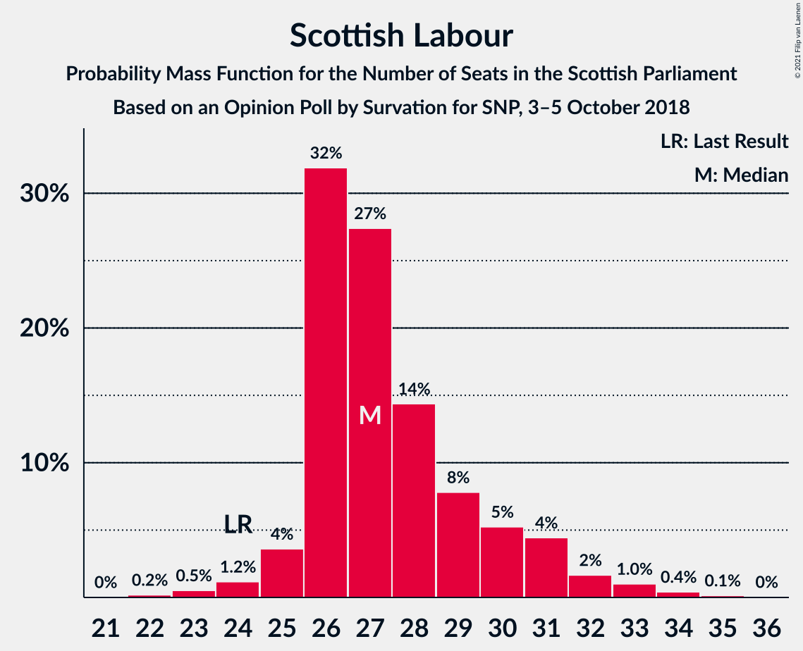
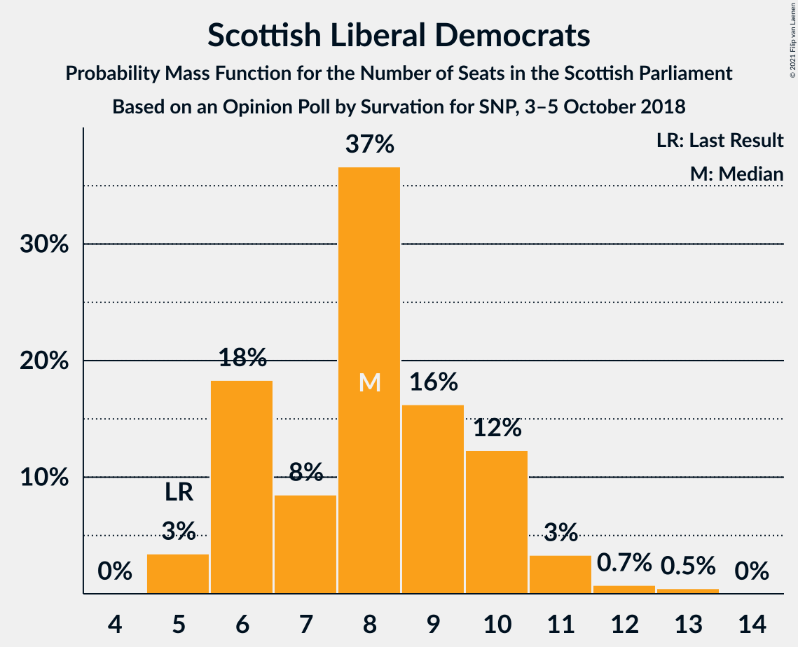

# Opinion Poll by Survation for SNP, 3–5 October 2018

<a href="#voting-intentions">Voting Intentions</a> | <a href="#seats">Seats</a> | <a href="#coalitions">Coalitions</a> | <a href="#technical-information">Technical Information</a>

## Voting Intentions

### Confidence Intervals

| Party | Last Result | Poll Result | 80% Confidence Interval | 90% Confidence Interval | 95% Confidence Interval | 99% Confidence Interval |
|:-----:|:-----------:|:-----------:|:-----------------------:|:-----------------------:|:-----------------------:|:-----------------------:|
| Scottish National Party | 41.7% | 39.6% | 37.6–41.6% |37.1–42.1% |36.6–42.6% |35.7–43.6% |
| Scottish Conservative & Unionist Party | 22.9% | 24.8% | 23.1–26.6% |22.6–27.1% |22.2–27.5% |21.4–28.4% |
| Scottish Labour | 19.1% | 21.8% | 20.2–23.5% |19.8–24.0% |19.4–24.5% |18.6–25.3% |
| Scottish Liberal Democrats | 5.2% | 7.9% | 6.9–9.1% |6.6–9.4% |6.4–9.7% |5.9–10.3% |
| Scottish Greens | 6.6% | 3.9% | 3.3–4.9% |3.1–5.1% |2.9–5.3% |2.6–5.8% |

*Note:* The poll result column reflects the actual value used in the calculations. Published results may vary slightly, and in addition be rounded to fewer digits.

## Seats

### Confidence Intervals

| Party | Last Result | Median | 80% Confidence Interval | 90% Confidence Interval | 95% Confidence Interval | 99% Confidence Interval |
|:-----:|:-----------:|:------:|:-----------------------:|:-----------------------:|:-----------------------:|:-----------------------:|
| <a href="#scottish-national-party">Scottish National Party</a> | 63 | 60 | 58–62 |56–63 |55–64 |52–65 |
| <a href="#scottish-conservative-&-unionist-party">Scottish Conservative & Unionist Party</a> | 31 | 32 | 30–34 |29–35 |28–36 |26–37 |
| <a href="#scottish-labour">Scottish Labour</a> | 24 | 27 | 26–30 |25–31 |25–32 |23–34 |
| <a href="#scottish-liberal-democrats">Scottish Liberal Democrats</a> | 5 | 8 | 6–10 |6–10 |5–11 |5–12 |
| <a href="#scottish-greens">Scottish Greens</a> | 6 | 2 | 1–2 |0–2 |0–3 |0–3 |

### Scottish National Party

*For a full overview of the results for this party, see the [Scottish National Party](party-scottishnationalparty.html) page.*

| Number of Seats | Probability | Accumulated | Special Marks |
|:---------------:|:-----------:|:-----------:|:-------------:|
| 50 | 0.1% | 100% |  |
| 51 | 0.2% | 99.9% |  |
| 52 | 0.2% | 99.7% |  |
| 53 | 0.4% | 99.4% |  |
| 54 | 0.9% | 99.0% |  |
| 55 | 2% | 98% |  |
| 56 | 3% | 96% |  |
| 57 | 3% | 94% |  |
| 58 | 6% | 90% |  |
| 59 | 11% | 85% |  |
| 60 | 36% | 74% | Median |
| 61 | 19% | 37% |  |
| 62 | 9% | 19% |  |
| 63 | 7% | 10% | Last Result |
| 64 | 2% | 3% |  |
| 65 | 1.0% | 1.2% | Majority |
| 66 | 0.1% | 0.1% |  |
| 67 | 0% | 0% |  |

### Scottish Conservative & Unionist Party

*For a full overview of the results for this party, see the [Scottish Conservative & Unionist Party](party-scottishconservativeunionistparty.html) page.*

| Number of Seats | Probability | Accumulated | Special Marks |
|:---------------:|:-----------:|:-----------:|:-------------:|
| 24 | 0.1% | 100% |  |
| 25 | 0.2% | 99.9% |  |
| 26 | 0.4% | 99.7% |  |
| 27 | 1.3% | 99.3% |  |
| 28 | 2% | 98% |  |
| 29 | 5% | 96% |  |
| 30 | 9% | 91% |  |
| 31 | 21% | 81% | Last Result |
| 32 | 22% | 61% | Median |
| 33 | 20% | 39% |  |
| 34 | 11% | 19% |  |
| 35 | 5% | 8% |  |
| 36 | 2% | 3% |  |
| 37 | 1.1% | 1.3% |  |
| 38 | 0.1% | 0.2% |  |
| 39 | 0.1% | 0.1% |  |
| 40 | 0% | 0% |  |

### Scottish Labour

*For a full overview of the results for this party, see the [Scottish Labour](party-scottishlabour.html) page.*

| Number of Seats | Probability | Accumulated | Special Marks |
|:---------------:|:-----------:|:-----------:|:-------------:|
| 22 | 0.2% | 100% |  |
| 23 | 0.5% | 99.8% |  |
| 24 | 1.2% | 99.3% | Last Result |
| 25 | 4% | 98% |  |
| 26 | 32% | 94% |  |
| 27 | 27% | 63% | Median |
| 28 | 14% | 35% |  |
| 29 | 8% | 21% |  |
| 30 | 5% | 13% |  |
| 31 | 4% | 8% |  |
| 32 | 2% | 3% |  |
| 33 | 1.0% | 2% |  |
| 34 | 0.4% | 0.6% |  |
| 35 | 0.1% | 0.2% |  |
| 36 | 0% | 0% |  |

### Scottish Liberal Democrats

*For a full overview of the results for this party, see the [Scottish Liberal Democrats](party-scottishliberaldemocrats.html) page.*

| Number of Seats | Probability | Accumulated | Special Marks |
|:---------------:|:-----------:|:-----------:|:-------------:|
| 5 | 3% | 100% | Last Result |
| 6 | 18% | 97% |  |
| 7 | 8% | 78% |  |
| 8 | 37% | 70% | Median |
| 9 | 16% | 33% |  |
| 10 | 12% | 17% |  |
| 11 | 3% | 5% |  |
| 12 | 0.7% | 1.2% |  |
| 13 | 0.5% | 0.5% |  |
| 14 | 0% | 0% |  |

### Scottish Greens

*For a full overview of the results for this party, see the [Scottish Greens](party-scottishgreens.html) page.*

| Number of Seats | Probability | Accumulated | Special Marks |
|:---------------:|:-----------:|:-----------:|:-------------:|
| 0 | 9% | 100% |  |
| 1 | 25% | 91% |  |
| 2 | 63% | 66% | Median |
| 3 | 3% | 3% |  |
| 4 | 0.3% | 0.3% |  |
| 5 | 0% | 0% |  |
| 6 | 0% | 0% | Last Result |

## Coalitions

### Confidence Intervals

| Coalition | Last Result | Median | Majority? | 80% Confidence Interval | 90% Confidence Interval | 95% Confidence Interval | 99% Confidence Interval |
|:---------:|:-----------:|:------:|:---------:|:-----------------------:|:-----------------------:|:-----------------------:|:-----------------------:|
| Scottish Conservative & Unionist Party – Scottish Labour – Scottish Liberal Democrats | 60 | 67 | 93% | 65–70 | 64–71 | 64–73 | 62–75 |
| Scottish National Party – Scottish Greens | 69 | 62 | 7% | 59–64 | 58–65 | 56–65 | 54–67 |
| Scottish Conservative & Unionist Party – Scottish Labour | 55 | 59 | 2% | 57–62 | 56–63 | 56–64 | 54–67 |
| Scottish National Party | 63 | 60 | 1.2% | 58–62 | 56–63 | 55–64 | 52–65 |
| Scottish Conservative & Unionist Party – Scottish Liberal Democrats | 36 | 40 | 0% | 37–43 | 36–44 | 36–45 | 34–46 |
| Scottish Labour – Scottish Liberal Democrats – Scottish Greens | 35 | 37 | 0% | 35–39 | 34–41 | 33–42 | 32–44 |
| Scottish Labour – Scottish Liberal Democrats | 29 | 35 | 0% | 33–38 | 32–39 | 32–40 | 30–43 |

### Scottish Conservative & Unionist Party – Scottish Labour – Scottish Liberal Democrats

| Number of Seats | Probability | Accumulated | Special Marks |
|:---------------:|:-----------:|:-----------:|:-------------:|
| 60 | 0% | 100% | Last Result |
| 61 | 0.1% | 100% |  |
| 62 | 0.8% | 99.9% |  |
| 63 | 1.0% | 99.1% |  |
| 64 | 5% | 98% |  |
| 65 | 9% | 93% | Majority |
| 66 | 15% | 84% |  |
| 67 | 29% | 69% | Median |
| 68 | 19% | 40% |  |
| 69 | 9% | 21% |  |
| 70 | 5% | 12% |  |
| 71 | 3% | 8% |  |
| 72 | 2% | 4% |  |
| 73 | 1.2% | 3% |  |
| 74 | 0.7% | 1.3% |  |
| 75 | 0.3% | 0.7% |  |
| 76 | 0.2% | 0.4% |  |
| 77 | 0.1% | 0.2% |  |
| 78 | 0% | 0.1% |  |
| 79 | 0% | 0% |  |

### Scottish National Party – Scottish Greens

| Number of Seats | Probability | Accumulated | Special Marks |
|:---------------:|:-----------:|:-----------:|:-------------:|
| 51 | 0% | 100% |  |
| 52 | 0.1% | 99.9% |  |
| 53 | 0.2% | 99.8% |  |
| 54 | 0.3% | 99.6% |  |
| 55 | 0.7% | 99.3% |  |
| 56 | 1.2% | 98.7% |  |
| 57 | 2% | 97% |  |
| 58 | 3% | 96% |  |
| 59 | 5% | 92% |  |
| 60 | 9% | 88% |  |
| 61 | 19% | 79% |  |
| 62 | 29% | 60% | Median |
| 63 | 15% | 31% |  |
| 64 | 9% | 16% |  |
| 65 | 5% | 7% | Majority |
| 66 | 1.0% | 2% |  |
| 67 | 0.8% | 0.9% |  |
| 68 | 0.1% | 0.1% |  |
| 69 | 0% | 0% | Last Result |

### Scottish Conservative & Unionist Party – Scottish Labour

| Number of Seats | Probability | Accumulated | Special Marks |
|:---------------:|:-----------:|:-----------:|:-------------:|
| 52 | 0.1% | 100% |  |
| 53 | 0.2% | 99.9% |  |
| 54 | 0.7% | 99.7% |  |
| 55 | 1.2% | 99.0% | Last Result |
| 56 | 4% | 98% |  |
| 57 | 12% | 94% |  |
| 58 | 19% | 82% |  |
| 59 | 23% | 63% | Median |
| 60 | 15% | 41% |  |
| 61 | 10% | 25% |  |
| 62 | 7% | 15% |  |
| 63 | 4% | 8% |  |
| 64 | 2% | 4% |  |
| 65 | 1.0% | 2% | Majority |
| 66 | 0.7% | 1.5% |  |
| 67 | 0.4% | 0.8% |  |
| 68 | 0.2% | 0.3% |  |
| 69 | 0.1% | 0.1% |  |
| 70 | 0% | 0% |  |

### Scottish National Party

| Number of Seats | Probability | Accumulated | Special Marks |
|:---------------:|:-----------:|:-----------:|:-------------:|
| 50 | 0.1% | 100% |  |
| 51 | 0.2% | 99.9% |  |
| 52 | 0.2% | 99.7% |  |
| 53 | 0.4% | 99.4% |  |
| 54 | 0.9% | 99.0% |  |
| 55 | 2% | 98% |  |
| 56 | 3% | 96% |  |
| 57 | 3% | 94% |  |
| 58 | 6% | 90% |  |
| 59 | 11% | 85% |  |
| 60 | 36% | 74% | Median |
| 61 | 19% | 37% |  |
| 62 | 9% | 19% |  |
| 63 | 7% | 10% | Last Result |
| 64 | 2% | 3% |  |
| 65 | 1.0% | 1.2% | Majority |
| 66 | 0.1% | 0.1% |  |
| 67 | 0% | 0% |  |

### Scottish Conservative & Unionist Party – Scottish Liberal Democrats

| Number of Seats | Probability | Accumulated | Special Marks |
|:---------------:|:-----------:|:-----------:|:-------------:|
| 32 | 0.1% | 100% |  |
| 33 | 0.2% | 99.9% |  |
| 34 | 0.4% | 99.7% |  |
| 35 | 1.3% | 99.3% |  |
| 36 | 3% | 98% | Last Result |
| 37 | 10% | 95% |  |
| 38 | 9% | 85% |  |
| 39 | 14% | 76% |  |
| 40 | 17% | 61% | Median |
| 41 | 24% | 44% |  |
| 42 | 9% | 20% |  |
| 43 | 6% | 11% |  |
| 44 | 2% | 5% |  |
| 45 | 2% | 3% |  |
| 46 | 0.9% | 1.2% |  |
| 47 | 0.2% | 0.3% |  |
| 48 | 0% | 0.1% |  |
| 49 | 0% | 0% |  |

### Scottish Labour – Scottish Liberal Democrats – Scottish Greens

| Number of Seats | Probability | Accumulated | Special Marks |
|:---------------:|:-----------:|:-----------:|:-------------:|
| 31 | 0% | 100% |  |
| 32 | 0.6% | 99.9% |  |
| 33 | 2% | 99.3% |  |
| 34 | 5% | 97% |  |
| 35 | 11% | 92% | Last Result |
| 36 | 25% | 82% |  |
| 37 | 24% | 56% | Median |
| 38 | 14% | 33% |  |
| 39 | 9% | 18% |  |
| 40 | 4% | 9% |  |
| 41 | 3% | 5% |  |
| 42 | 1.3% | 3% |  |
| 43 | 0.7% | 1.5% |  |
| 44 | 0.4% | 0.8% |  |
| 45 | 0.2% | 0.4% |  |
| 46 | 0.1% | 0.2% |  |
| 47 | 0% | 0.1% |  |
| 48 | 0% | 0% |  |

### Scottish Labour – Scottish Liberal Democrats

| Number of Seats | Probability | Accumulated | Special Marks |
|:---------------:|:-----------:|:-----------:|:-------------:|
| 29 | 0% | 100% | Last Result |
| 30 | 0.5% | 100% |  |
| 31 | 1.3% | 99.5% |  |
| 32 | 3% | 98% |  |
| 33 | 8% | 95% |  |
| 34 | 20% | 86% |  |
| 35 | 25% | 66% | Median |
| 36 | 17% | 41% |  |
| 37 | 12% | 24% |  |
| 38 | 6% | 13% |  |
| 39 | 3% | 7% |  |
| 40 | 2% | 4% |  |
| 41 | 1.0% | 2% |  |
| 42 | 0.5% | 1.0% |  |
| 43 | 0.3% | 0.5% |  |
| 44 | 0.1% | 0.2% |  |
| 45 | 0.1% | 0.1% |  |
| 46 | 0% | 0% |  |

## Technical Information

### Opinion Poll

+ **Polling firm:** Survation
+ **Commissioner(s):** SNP
+ **Fieldwork period:** 3–5 October 2018

### Calculations

+ **Sample size:** 1013
+ **Simulations done:** 1,048,576
+ **Error estimate:** 0.84%

