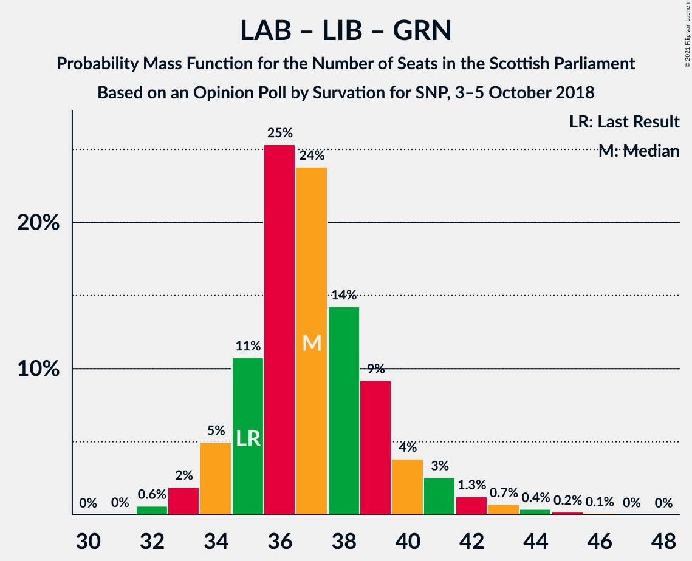

# Opinion Poll by Survation for SNP, 3–5 October 2018

<a href="#voting-intentions">Voting Intentions</a> | <a href="#seats">Seats</a> | <a href="#coalitions">Coalitions</a> | <a href="#technical-information">Technical Information</a>

## Voting Intentions

### Confidence Intervals

| Party | Last Result | Poll Result | 80% Confidence Interval | 90% Confidence Interval | 95% Confidence Interval | 99% Confidence Interval |
|:-----:|:-----------:|:-----------:|:-----------------------:|:-----------------------:|:-----------------------:|:-----------------------:|
| Scottish National Party | 41.7% | 39.6% | 37.6–41.6% |37.1–42.1% |36.6–42.6% |35.7–43.6% |
| Scottish Conservative & Unionist Party | 22.9% | 24.8% | 23.1–26.6% |22.6–27.1% |22.2–27.5% |21.4–28.4% |
| Scottish Labour | 19.1% | 21.8% | 20.2–23.5% |19.8–24.0% |19.4–24.5% |18.6–25.3% |
| Scottish Liberal Democrats | 5.2% | 7.9% | 6.9–9.1% |6.6–9.4% |6.4–9.7% |5.9–10.3% |
| Scottish Greens | 6.6% | 3.9% | 3.3–4.9% |3.1–5.1% |2.9–5.3% |2.6–5.8% |

*Note:* The poll result column reflects the actual value used in the calculations. Published results may vary slightly, and in addition be rounded to fewer digits.

## Seats

### Confidence Intervals

| Party | Last Result | Median | 80% Confidence Interval | 90% Confidence Interval | 95% Confidence Interval | 99% Confidence Interval |
|:-----:|:-----------:|:------:|:-----------------------:|:-----------------------:|:-----------------------:|:-----------------------:|
| <a href="#scottish-national-party">Scottish National Party</a> | 63 | 60 | 58–63 |57–64 |56–64 |55–65 |
| <a href="#scottish-conservative-&-unionist-party">Scottish Conservative & Unionist Party</a> | 31 | 32 | 29–34 |29–35 |27–36 |26–37 |
| <a href="#scottish-labour">Scottish Labour</a> | 24 | 27 | 26–30 |25–31 |24–31 |23–33 |
| <a href="#scottish-liberal-democrats">Scottish Liberal Democrats</a> | 5 | 8 | 6–10 |6–10 |5–11 |5–12 |
| <a href="#scottish-greens">Scottish Greens</a> | 6 | 2 | 1–2 |0–2 |0–3 |0–3 |

### Scottish National Party

*For a full overview of the results for this party, see the [Scottish National Party](party-scottishnationalparty.html) page.*

| Number of Seats | Probability | Accumulated | Special Marks |
|:---------------:|:-----------:|:-----------:|:-------------:|
| 53 | 0.1% | 100% |  |
| 54 | 0.3% | 99.9% |  |
| 55 | 1.0% | 99.5% |  |
| 56 | 2% | 98.5% |  |
| 57 | 4% | 97% |  |
| 58 | 4% | 93% |  |
| 59 | 12% | 89% |  |
| 60 | 37% | 77% | Median |
| 61 | 20% | 40% |  |
| 62 | 8% | 21% |  |
| 63 | 6% | 12% | Last Result |
| 64 | 5% | 7% |  |
| 65 | 1.5% | 2% | Majority |
| 66 | 0.3% | 0.4% |  |
| 67 | 0.1% | 0.1% |  |
| 68 | 0% | 0% |  |

### Scottish Conservative & Unionist Party

*For a full overview of the results for this party, see the [Scottish Conservative & Unionist Party](party-scottishconservativeunionistparty.html) page.*

| Number of Seats | Probability | Accumulated | Special Marks |
|:---------------:|:-----------:|:-----------:|:-------------:|
| 24 | 0.1% | 100% |  |
| 25 | 0.3% | 99.9% |  |
| 26 | 0.5% | 99.6% |  |
| 27 | 2% | 99.1% |  |
| 28 | 2% | 97% |  |
| 29 | 6% | 95% |  |
| 30 | 9% | 89% |  |
| 31 | 21% | 81% | Last Result |
| 32 | 21% | 60% | Median |
| 33 | 19% | 39% |  |
| 34 | 12% | 20% |  |
| 35 | 5% | 9% |  |
| 36 | 3% | 4% |  |
| 37 | 0.8% | 1.1% |  |
| 38 | 0.1% | 0.3% |  |
| 39 | 0.1% | 0.1% |  |
| 40 | 0% | 0% |  |

### Scottish Labour

*For a full overview of the results for this party, see the [Scottish Labour](party-scottishlabour.html) page.*

| Number of Seats | Probability | Accumulated | Special Marks |
|:---------------:|:-----------:|:-----------:|:-------------:|
| 22 | 0.3% | 100% |  |
| 23 | 0.9% | 99.6% |  |
| 24 | 1.3% | 98.7% | Last Result |
| 25 | 4% | 97% |  |
| 26 | 33% | 93% |  |
| 27 | 25% | 61% | Median |
| 28 | 15% | 35% |  |
| 29 | 8% | 20% |  |
| 30 | 6% | 12% |  |
| 31 | 4% | 6% |  |
| 32 | 1.2% | 2% |  |
| 33 | 0.5% | 0.7% |  |
| 34 | 0.1% | 0.1% |  |
| 35 | 0% | 0% |  |

### Scottish Liberal Democrats

*For a full overview of the results for this party, see the [Scottish Liberal Democrats](party-scottishliberaldemocrats.html) page.*

| Number of Seats | Probability | Accumulated | Special Marks |
|:---------------:|:-----------:|:-----------:|:-------------:|
| 4 | 0.1% | 100% |  |
| 5 | 4% | 99.9% | Last Result |
| 6 | 21% | 96% |  |
| 7 | 9% | 75% |  |
| 8 | 33% | 67% | Median |
| 9 | 24% | 34% |  |
| 10 | 7% | 11% |  |
| 11 | 3% | 3% |  |
| 12 | 0.8% | 0.8% |  |
| 13 | 0% | 0% |  |

### Scottish Greens

*For a full overview of the results for this party, see the [Scottish Greens](party-scottishgreens.html) page.*

| Number of Seats | Probability | Accumulated | Special Marks |
|:---------------:|:-----------:|:-----------:|:-------------:|
| 0 | 9% | 100% |  |
| 1 | 28% | 91% |  |
| 2 | 59% | 62% | Median |
| 3 | 3% | 3% |  |
| 4 | 0.2% | 0.2% |  |
| 5 | 0% | 0% |  |
| 6 | 0% | 0% | Last Result |

## Coalitions

### Confidence Intervals

| Coalition | Last Result | Median | Majority? | 80% Confidence Interval | 90% Confidence Interval | 95% Confidence Interval | 99% Confidence Interval |
|:---------:|:-----------:|:------:|:---------:|:-----------------------:|:-----------------------:|:-----------------------:|:-----------------------:|
| Scottish Conservative & Unionist Party – Scottish Labour – Scottish Liberal Democrats | 60 | 67 | 90% | 65–69 | 64–71 | 63–71 | 62–73 |
| Scottish National Party – Scottish Greens | 69 | 62 | 10% | 60–64 | 58–65 | 58–66 | 56–67 |
| Scottish National Party | 63 | 60 | 2% | 58–63 | 57–64 | 56–64 | 55–65 |
| Scottish Conservative & Unionist Party – Scottish Labour | 55 | 59 | 2% | 57–62 | 56–63 | 55–64 | 54–66 |
| Scottish Conservative & Unionist Party – Scottish Liberal Democrats | 36 | 40 | 0% | 37–43 | 36–43 | 35–44 | 34–46 |
| Scottish Labour – Scottish Liberal Democrats – Scottish Greens | 35 | 37 | 0% | 34–39 | 34–39 | 33–40 | 32–42 |
| Scottish Labour – Scottish Liberal Democrats | 29 | 35 | 0% | 33–37 | 32–38 | 31–39 | 30–41 |

### Scottish Conservative & Unionist Party – Scottish Labour – Scottish Liberal Democrats

| Number of Seats | Probability | Accumulated | Special Marks |
|:---------------:|:-----------:|:-----------:|:-------------:|
| 60 | 0.1% | 100% | Last Result |
| 61 | 0.3% | 99.9% |  |
| 62 | 1.1% | 99.7% |  |
| 63 | 3% | 98.6% |  |
| 64 | 5% | 95% |  |
| 65 | 8% | 90% | Majority |
| 66 | 17% | 82% |  |
| 67 | 27% | 66% | Median |
| 68 | 20% | 38% |  |
| 69 | 9% | 18% |  |
| 70 | 4% | 10% |  |
| 71 | 3% | 6% |  |
| 72 | 2% | 2% |  |
| 73 | 0.6% | 0.9% |  |
| 74 | 0.2% | 0.2% |  |
| 75 | 0% | 0.1% |  |
| 76 | 0% | 0% |  |

### Scottish National Party – Scottish Greens

| Number of Seats | Probability | Accumulated | Special Marks |
|:---------------:|:-----------:|:-----------:|:-------------:|
| 54 | 0% | 100% |  |
| 55 | 0.2% | 99.9% |  |
| 56 | 0.6% | 99.8% |  |
| 57 | 2% | 99.1% |  |
| 58 | 3% | 98% |  |
| 59 | 4% | 94% |  |
| 60 | 9% | 90% |  |
| 61 | 20% | 82% |  |
| 62 | 27% | 62% | Median |
| 63 | 17% | 34% |  |
| 64 | 8% | 18% |  |
| 65 | 5% | 10% | Majority |
| 66 | 3% | 5% |  |
| 67 | 1.1% | 1.4% |  |
| 68 | 0.3% | 0.3% |  |
| 69 | 0.1% | 0.1% | Last Result |
| 70 | 0% | 0% |  |

### Scottish National Party

| Number of Seats | Probability | Accumulated | Special Marks |
|:---------------:|:-----------:|:-----------:|:-------------:|
| 53 | 0.1% | 100% |  |
| 54 | 0.3% | 99.9% |  |
| 55 | 1.0% | 99.5% |  |
| 56 | 2% | 98.5% |  |
| 57 | 4% | 97% |  |
| 58 | 4% | 93% |  |
| 59 | 12% | 89% |  |
| 60 | 37% | 77% | Median |
| 61 | 20% | 40% |  |
| 62 | 8% | 21% |  |
| 63 | 6% | 12% | Last Result |
| 64 | 5% | 7% |  |
| 65 | 1.5% | 2% | Majority |
| 66 | 0.3% | 0.4% |  |
| 67 | 0.1% | 0.1% |  |
| 68 | 0% | 0% |  |

### Scottish Conservative & Unionist Party – Scottish Labour

| Number of Seats | Probability | Accumulated | Special Marks |
|:---------------:|:-----------:|:-----------:|:-------------:|
| 52 | 0.1% | 100% |  |
| 53 | 0.2% | 99.9% |  |
| 54 | 0.8% | 99.6% |  |
| 55 | 3% | 98.8% | Last Result |
| 56 | 4% | 96% |  |
| 57 | 12% | 92% |  |
| 58 | 18% | 81% |  |
| 59 | 24% | 63% | Median |
| 60 | 14% | 39% |  |
| 61 | 11% | 25% |  |
| 62 | 8% | 14% |  |
| 63 | 3% | 6% |  |
| 64 | 1.4% | 3% |  |
| 65 | 0.8% | 2% | Majority |
| 66 | 0.5% | 0.7% |  |
| 67 | 0.1% | 0.2% |  |
| 68 | 0% | 0% |  |

### Scottish Conservative & Unionist Party – Scottish Liberal Democrats

| Number of Seats | Probability | Accumulated | Special Marks |
|:---------------:|:-----------:|:-----------:|:-------------:|
| 32 | 0.1% | 100% |  |
| 33 | 0.2% | 99.9% |  |
| 34 | 0.6% | 99.7% |  |
| 35 | 2% | 99.1% |  |
| 36 | 4% | 97% | Last Result |
| 37 | 11% | 93% |  |
| 38 | 9% | 82% |  |
| 39 | 14% | 73% |  |
| 40 | 19% | 59% | Median |
| 41 | 21% | 41% |  |
| 42 | 9% | 20% |  |
| 43 | 6% | 10% |  |
| 44 | 2% | 4% |  |
| 45 | 1.1% | 2% |  |
| 46 | 0.8% | 0.9% |  |
| 47 | 0.1% | 0.1% |  |
| 48 | 0% | 0% |  |

### Scottish Labour – Scottish Liberal Democrats – Scottish Greens

| Number of Seats | Probability | Accumulated | Special Marks |
|:---------------:|:-----------:|:-----------:|:-------------:|
| 31 | 0.1% | 100% |  |
| 32 | 1.1% | 99.9% |  |
| 33 | 3% | 98.8% |  |
| 34 | 7% | 96% |  |
| 35 | 12% | 89% | Last Result |
| 36 | 21% | 78% |  |
| 37 | 27% | 57% | Median |
| 38 | 19% | 30% |  |
| 39 | 7% | 12% |  |
| 40 | 2% | 5% |  |
| 41 | 1.3% | 2% |  |
| 42 | 0.4% | 0.9% |  |
| 43 | 0.3% | 0.5% |  |
| 44 | 0.1% | 0.2% |  |
| 45 | 0.1% | 0.1% |  |
| 46 | 0% | 0% |  |

### Scottish Labour – Scottish Liberal Democrats

| Number of Seats | Probability | Accumulated | Special Marks |
|:---------------:|:-----------:|:-----------:|:-------------:|
| 29 | 0.1% | 100% | Last Result |
| 30 | 0.9% | 99.9% |  |
| 31 | 2% | 99.0% |  |
| 32 | 5% | 97% |  |
| 33 | 10% | 92% |  |
| 34 | 18% | 82% |  |
| 35 | 22% | 64% | Median |
| 36 | 21% | 42% |  |
| 37 | 12% | 21% |  |
| 38 | 5% | 9% |  |
| 39 | 2% | 4% |  |
| 40 | 0.8% | 2% |  |
| 41 | 0.6% | 0.8% |  |
| 42 | 0.2% | 0.3% |  |
| 43 | 0.1% | 0.1% |  |
| 44 | 0% | 0% |  |

## Technical Information

### Opinion Poll

+ **Polling firm:** Survation
+ **Commissioner(s):** SNP
+ **Fieldwork period:** 3–5 October 2018

### Calculations

+ **Sample size:** 1013
+ **Simulations done:** 131,072
+ **Error estimate:** 1.33%

