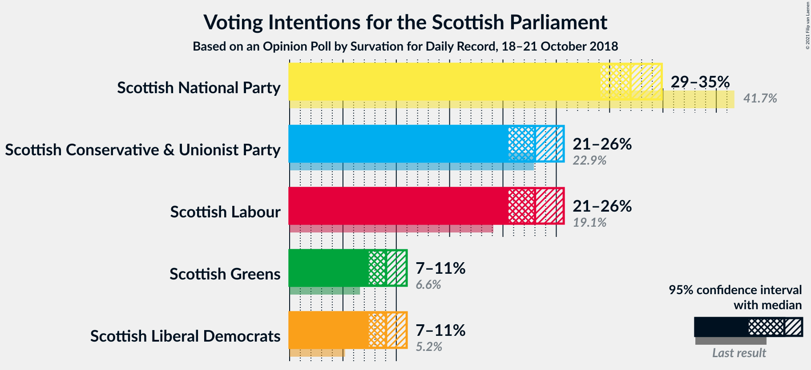
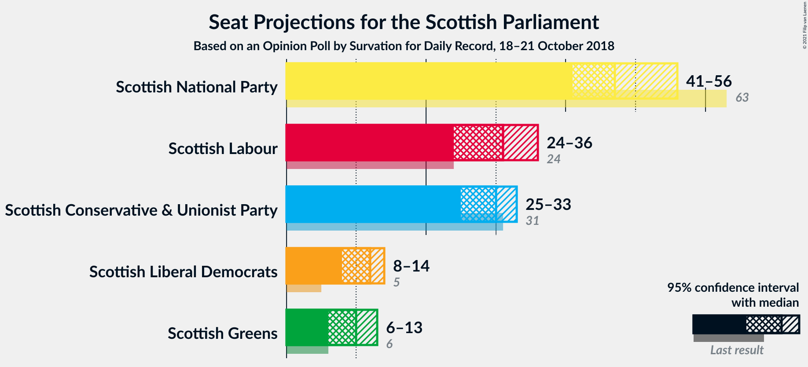
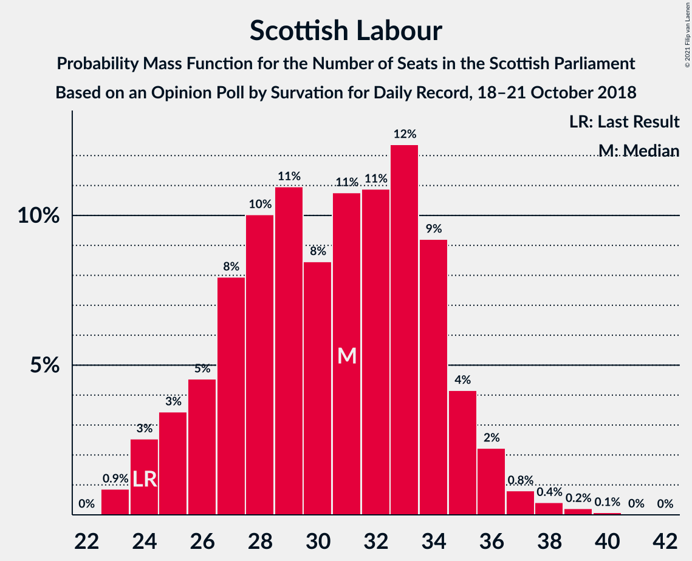
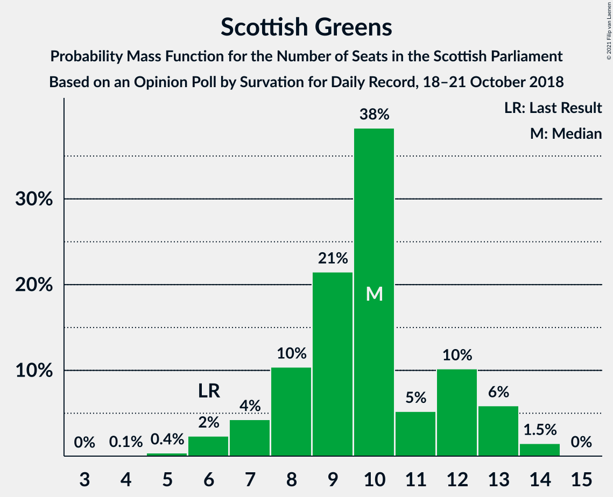
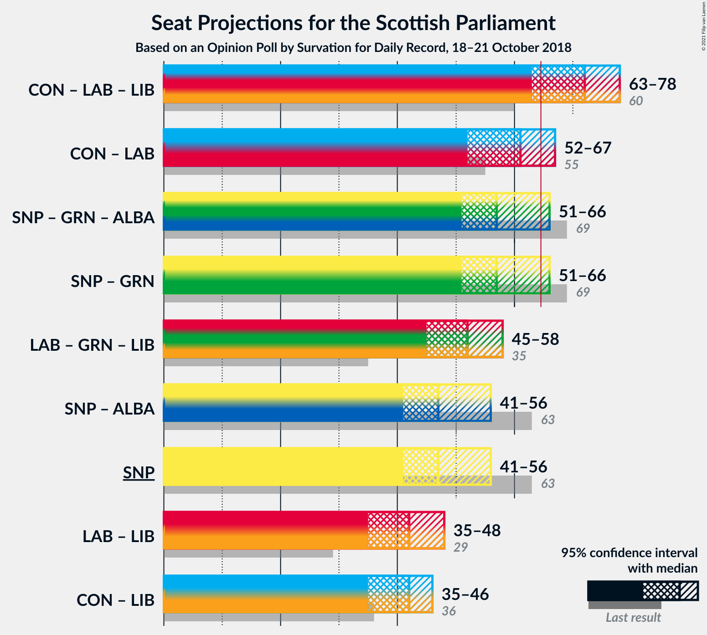

# Opinion Poll by Survation for Daily Record, 18–21 October 2018

<a href="#voting-intentions">Voting Intentions</a> | <a href="#seats">Seats</a> | <a href="#coalitions">Coalitions</a> | <a href="#technical-information">Technical Information</a>

## Voting Intentions

### Confidence Intervals

| Party | Last Result | Poll Result | 80% Confidence Interval | 90% Confidence Interval | 95% Confidence Interval | 99% Confidence Interval |
|:-----:|:-----------:|:-----------:|:-----------------------:|:-----------------------:|:-----------------------:|:-----------------------:|
| Scottish National Party | 41.7% | 32.0% | 30.1–33.9% |29.6–34.4% |29.2–34.9% |28.3–35.8% |
| Scottish Conservative & Unionist Party | 22.9% | 23.0% | 21.4–24.8% |20.9–25.3% |20.5–25.7% |19.8–26.6% |
| Scottish Labour | 19.1% | 23.0% | 21.4–24.8% |20.9–25.3% |20.5–25.7% |19.8–26.6% |
| Scottish Greens | 6.6% | 9.0% | 8.0–10.3% |7.7–10.7% |7.4–11.0% |7.0–11.6% |
| Scottish Liberal Democrats | 5.2% | 9.0% | 8.0–10.3% |7.7–10.7% |7.4–11.0% |7.0–11.6% |

*Note:* The poll result column reflects the actual value used in the calculations. Published results may vary slightly, and in addition be rounded to fewer digits.

## Seats

### Confidence Intervals

| Party | Last Result | Median | 80% Confidence Interval | 90% Confidence Interval | 95% Confidence Interval | 99% Confidence Interval |
|:-----:|:-----------:|:------:|:-----------------------:|:-----------------------:|:-----------------------:|:-----------------------:|
| <a href="#scottish-national-party">Scottish National Party</a> | 63 | 50 | 46–53 |44–54 |43–56 |41–59 |
| <a href="#scottish-conservative-&-unionist-party">Scottish Conservative & Unionist Party</a> | 31 | 29 | 27–32 |26–33 |25–34 |24–35 |
| <a href="#scottish-labour">Scottish Labour</a> | 24 | 30 | 26–33 |25–34 |25–35 |24–35 |
| <a href="#scottish-greens">Scottish Greens</a> | 6 | 9 | 7–12 |7–13 |6–13 |6–14 |
| <a href="#scottish-liberal-democrats">Scottish Liberal Democrats</a> | 5 | 11 | 9–12 |7–12 |6–13 |6–14 |

### Scottish National Party

*For a full overview of the results for this party, see the [Scottish National Party](party-scottishnationalparty.html) page.*

| Number of Seats | Probability | Accumulated | Special Marks |
|:---------------:|:-----------:|:-----------:|:-------------:|
| 39 | 0.1% | 100% |  |
| 40 | 0.3% | 99.9% |  |
| 41 | 0.3% | 99.6% |  |
| 42 | 0.8% | 99.3% |  |
| 43 | 2% | 98.5% |  |
| 44 | 3% | 97% |  |
| 45 | 3% | 94% |  |
| 46 | 4% | 91% |  |
| 47 | 7% | 87% |  |
| 48 | 9% | 80% |  |
| 49 | 11% | 71% |  |
| 50 | 13% | 60% | Median |
| 51 | 13% | 47% |  |
| 52 | 6% | 34% |  |
| 53 | 19% | 28% |  |
| 54 | 4% | 9% |  |
| 55 | 2% | 5% |  |
| 56 | 0.7% | 3% |  |
| 57 | 0.6% | 2% |  |
| 58 | 1.0% | 2% |  |
| 59 | 0.5% | 0.8% |  |
| 60 | 0.3% | 0.3% |  |
| 61 | 0% | 0% |  |
| 62 | 0% | 0% |  |
| 63 | 0% | 0% | Last Result |

### Scottish Conservative & Unionist Party

*For a full overview of the results for this party, see the [Scottish Conservative & Unionist Party](party-scottishconservativeunionistparty.html) page.*

| Number of Seats | Probability | Accumulated | Special Marks |
|:---------------:|:-----------:|:-----------:|:-------------:|
| 23 | 0.2% | 100% |  |
| 24 | 2% | 99.8% |  |
| 25 | 2% | 98% |  |
| 26 | 6% | 96% |  |
| 27 | 8% | 90% |  |
| 28 | 21% | 82% |  |
| 29 | 24% | 61% | Median |
| 30 | 9% | 37% |  |
| 31 | 11% | 28% | Last Result |
| 32 | 8% | 17% |  |
| 33 | 6% | 8% |  |
| 34 | 2% | 3% |  |
| 35 | 0.5% | 0.6% |  |
| 36 | 0% | 0.1% |  |
| 37 | 0% | 0% |  |

### Scottish Labour

*For a full overview of the results for this party, see the [Scottish Labour](party-scottishlabour.html) page.*

| Number of Seats | Probability | Accumulated | Special Marks |
|:---------------:|:-----------:|:-----------:|:-------------:|
| 23 | 0.5% | 100% |  |
| 24 | 0.8% | 99.5% | Last Result |
| 25 | 5% | 98.8% |  |
| 26 | 9% | 94% |  |
| 27 | 9% | 84% |  |
| 28 | 11% | 76% |  |
| 29 | 13% | 65% |  |
| 30 | 16% | 52% | Median |
| 31 | 15% | 36% |  |
| 32 | 10% | 21% |  |
| 33 | 3% | 12% |  |
| 34 | 5% | 9% |  |
| 35 | 3% | 4% |  |
| 36 | 0.3% | 0.4% |  |
| 37 | 0.1% | 0.1% |  |
| 38 | 0% | 0% |  |

### Scottish Greens

*For a full overview of the results for this party, see the [Scottish Greens](party-scottishgreens.html) page.*

| Number of Seats | Probability | Accumulated | Special Marks |
|:---------------:|:-----------:|:-----------:|:-------------:|
| 4 | 0.1% | 100% |  |
| 5 | 0.4% | 99.9% |  |
| 6 | 3% | 99.6% | Last Result |
| 7 | 6% | 96% |  |
| 8 | 17% | 90% |  |
| 9 | 23% | 73% | Median |
| 10 | 27% | 49% |  |
| 11 | 3% | 22% |  |
| 12 | 14% | 19% |  |
| 13 | 4% | 5% |  |
| 14 | 1.3% | 1.3% |  |
| 15 | 0% | 0% |  |

### Scottish Liberal Democrats

*For a full overview of the results for this party, see the [Scottish Liberal Democrats](party-scottishliberaldemocrats.html) page.*

| Number of Seats | Probability | Accumulated | Special Marks |
|:---------------:|:-----------:|:-----------:|:-------------:|
| 5 | 0.3% | 100% | Last Result |
| 6 | 3% | 99.7% |  |
| 7 | 3% | 97% |  |
| 8 | 3% | 94% |  |
| 9 | 9% | 91% |  |
| 10 | 11% | 82% |  |
| 11 | 45% | 71% | Median |
| 12 | 23% | 26% |  |
| 13 | 2% | 3% |  |
| 14 | 1.0% | 1.2% |  |
| 15 | 0.2% | 0.2% |  |
| 16 | 0% | 0% |  |

## Coalitions

### Confidence Intervals

| Coalition | Last Result | Median | Majority? | 80% Confidence Interval | 90% Confidence Interval | 95% Confidence Interval | 99% Confidence Interval |
|:---------:|:-----------:|:------:|:---------:|:-----------------------:|:-----------------------:|:-----------------------:|:-----------------------:|
| Scottish Conservative & Unionist Party – Scottish Labour – Scottish Liberal Democrats | 60 | 69 | 91% | 65–74 | 64–75 | 63–76 | 61–78 |
| Scottish Conservative & Unionist Party – Scottish Labour | 55 | 59 | 4% | 54–63 | 54–64 | 53–66 | 51–67 |
| Scottish National Party – Scottish Greens | 69 | 60 | 9% | 55–64 | 54–65 | 53–66 | 51–68 |
| Scottish Labour – Scottish Greens – Scottish Liberal Democrats | 35 | 50 | 0% | 46–54 | 45–55 | 44–56 | 42–57 |
| Scottish National Party | 63 | 50 | 0% | 46–53 | 44–54 | 43–56 | 41–59 |
| Scottish Labour – Scottish Liberal Democrats | 29 | 40 | 0% | 36–44 | 35–45 | 35–46 | 32–47 |
| Scottish Conservative & Unionist Party – Scottish Liberal Democrats | 36 | 40 | 0% | 37–43 | 35–44 | 34–45 | 33–46 |

### Scottish Conservative & Unionist Party – Scottish Labour – Scottish Liberal Democrats

| Number of Seats | Probability | Accumulated | Special Marks |
|:---------------:|:-----------:|:-----------:|:-------------:|
| 58 | 0.1% | 100% |  |
| 59 | 0.1% | 99.9% |  |
| 60 | 0.3% | 99.8% | Last Result |
| 61 | 0.4% | 99.6% |  |
| 62 | 1.0% | 99.2% |  |
| 63 | 1.5% | 98% |  |
| 64 | 5% | 97% |  |
| 65 | 4% | 91% | Majority |
| 66 | 9% | 87% |  |
| 67 | 8% | 78% |  |
| 68 | 8% | 71% |  |
| 69 | 14% | 63% |  |
| 70 | 15% | 49% | Median |
| 71 | 5% | 34% |  |
| 72 | 15% | 29% |  |
| 73 | 2% | 14% |  |
| 74 | 3% | 11% |  |
| 75 | 4% | 8% |  |
| 76 | 2% | 4% |  |
| 77 | 1.3% | 2% |  |
| 78 | 0.5% | 0.9% |  |
| 79 | 0.3% | 0.4% |  |
| 80 | 0% | 0.1% |  |
| 81 | 0% | 0% |  |

### Scottish Conservative & Unionist Party – Scottish Labour

| Number of Seats | Probability | Accumulated | Special Marks |
|:---------------:|:-----------:|:-----------:|:-------------:|
| 49 | 0.1% | 100% |  |
| 50 | 0.3% | 99.9% |  |
| 51 | 0.5% | 99.6% |  |
| 52 | 0.8% | 99.1% |  |
| 53 | 2% | 98% |  |
| 54 | 7% | 97% |  |
| 55 | 7% | 90% | Last Result |
| 56 | 7% | 83% |  |
| 57 | 13% | 76% |  |
| 58 | 11% | 63% |  |
| 59 | 12% | 52% | Median |
| 60 | 13% | 40% |  |
| 61 | 11% | 27% |  |
| 62 | 2% | 16% |  |
| 63 | 6% | 14% |  |
| 64 | 3% | 7% |  |
| 65 | 2% | 4% | Majority |
| 66 | 1.3% | 3% |  |
| 67 | 1.0% | 1.4% |  |
| 68 | 0.3% | 0.4% |  |
| 69 | 0.1% | 0.1% |  |
| 70 | 0% | 0% |  |

### Scottish National Party – Scottish Greens

| Number of Seats | Probability | Accumulated | Special Marks |
|:---------------:|:-----------:|:-----------:|:-------------:|
| 49 | 0% | 100% |  |
| 50 | 0.3% | 99.9% |  |
| 51 | 0.5% | 99.6% |  |
| 52 | 1.3% | 99.1% |  |
| 53 | 2% | 98% |  |
| 54 | 4% | 96% |  |
| 55 | 3% | 92% |  |
| 56 | 2% | 89% |  |
| 57 | 15% | 86% |  |
| 58 | 5% | 71% |  |
| 59 | 15% | 66% | Median |
| 60 | 14% | 51% |  |
| 61 | 8% | 37% |  |
| 62 | 8% | 29% |  |
| 63 | 9% | 22% |  |
| 64 | 4% | 13% |  |
| 65 | 5% | 9% | Majority |
| 66 | 1.5% | 3% |  |
| 67 | 1.0% | 2% |  |
| 68 | 0.4% | 0.8% |  |
| 69 | 0.3% | 0.4% | Last Result |
| 70 | 0.1% | 0.2% |  |
| 71 | 0.1% | 0.1% |  |
| 72 | 0% | 0% |  |

### Scottish Labour – Scottish Greens – Scottish Liberal Democrats

| Number of Seats | Probability | Accumulated | Special Marks |
|:---------------:|:-----------:|:-----------:|:-------------:|
| 35 | 0% | 100% | Last Result |
| 36 | 0% | 100% |  |
| 37 | 0% | 100% |  |
| 38 | 0% | 100% |  |
| 39 | 0% | 100% |  |
| 40 | 0.1% | 100% |  |
| 41 | 0.1% | 99.9% |  |
| 42 | 0.4% | 99.8% |  |
| 43 | 0.9% | 99.4% |  |
| 44 | 2% | 98% |  |
| 45 | 4% | 96% |  |
| 46 | 4% | 92% |  |
| 47 | 17% | 88% |  |
| 48 | 12% | 71% |  |
| 49 | 8% | 59% |  |
| 50 | 15% | 52% | Median |
| 51 | 6% | 36% |  |
| 52 | 9% | 31% |  |
| 53 | 9% | 22% |  |
| 54 | 5% | 12% |  |
| 55 | 3% | 7% |  |
| 56 | 3% | 4% |  |
| 57 | 1.0% | 1.4% |  |
| 58 | 0.3% | 0.4% |  |
| 59 | 0.1% | 0.1% |  |
| 60 | 0% | 0.1% |  |
| 61 | 0% | 0% |  |

### Scottish National Party

| Number of Seats | Probability | Accumulated | Special Marks |
|:---------------:|:-----------:|:-----------:|:-------------:|
| 39 | 0.1% | 100% |  |
| 40 | 0.3% | 99.9% |  |
| 41 | 0.3% | 99.6% |  |
| 42 | 0.8% | 99.3% |  |
| 43 | 2% | 98.5% |  |
| 44 | 3% | 97% |  |
| 45 | 3% | 94% |  |
| 46 | 4% | 91% |  |
| 47 | 7% | 87% |  |
| 48 | 9% | 80% |  |
| 49 | 11% | 71% |  |
| 50 | 13% | 60% | Median |
| 51 | 13% | 47% |  |
| 52 | 6% | 34% |  |
| 53 | 19% | 28% |  |
| 54 | 4% | 9% |  |
| 55 | 2% | 5% |  |
| 56 | 0.7% | 3% |  |
| 57 | 0.6% | 2% |  |
| 58 | 1.0% | 2% |  |
| 59 | 0.5% | 0.8% |  |
| 60 | 0.3% | 0.3% |  |
| 61 | 0% | 0% |  |
| 62 | 0% | 0% |  |
| 63 | 0% | 0% | Last Result |

### Scottish Labour – Scottish Liberal Democrats

| Number of Seats | Probability | Accumulated | Special Marks |
|:---------------:|:-----------:|:-----------:|:-------------:|
| 29 | 0% | 100% | Last Result |
| 30 | 0% | 100% |  |
| 31 | 0.1% | 100% |  |
| 32 | 0.6% | 99.9% |  |
| 33 | 0.9% | 99.2% |  |
| 34 | 0.8% | 98% |  |
| 35 | 3% | 98% |  |
| 36 | 5% | 94% |  |
| 37 | 9% | 90% |  |
| 38 | 14% | 81% |  |
| 39 | 11% | 67% |  |
| 40 | 7% | 56% |  |
| 41 | 14% | 49% | Median |
| 42 | 12% | 35% |  |
| 43 | 10% | 23% |  |
| 44 | 5% | 13% |  |
| 45 | 4% | 8% |  |
| 46 | 4% | 5% |  |
| 47 | 0.8% | 1.0% |  |
| 48 | 0.1% | 0.2% |  |
| 49 | 0.1% | 0.1% |  |
| 50 | 0% | 0% |  |

### Scottish Conservative & Unionist Party – Scottish Liberal Democrats

| Number of Seats | Probability | Accumulated | Special Marks |
|:---------------:|:-----------:|:-----------:|:-------------:|
| 31 | 0.1% | 100% |  |
| 32 | 0.2% | 99.9% |  |
| 33 | 0.9% | 99.7% |  |
| 34 | 1.4% | 98.8% |  |
| 35 | 3% | 97% |  |
| 36 | 4% | 94% | Last Result |
| 37 | 5% | 90% |  |
| 38 | 8% | 85% |  |
| 39 | 17% | 78% |  |
| 40 | 24% | 61% | Median |
| 41 | 14% | 37% |  |
| 42 | 11% | 23% |  |
| 43 | 5% | 12% |  |
| 44 | 5% | 7% |  |
| 45 | 1.4% | 3% |  |
| 46 | 1.1% | 1.2% |  |
| 47 | 0.1% | 0.1% |  |
| 48 | 0% | 0% |  |

## Technical Information

### Opinion Poll

+ **Polling firm:** Survation
+ **Commissioner(s):** Daily Record
+ **Fieldwork period:** 18–21 October 2018

### Calculations

+ **Sample size:** 1017
+ **Simulations done:** 131,072
+ **Error estimate:** 1.17%

