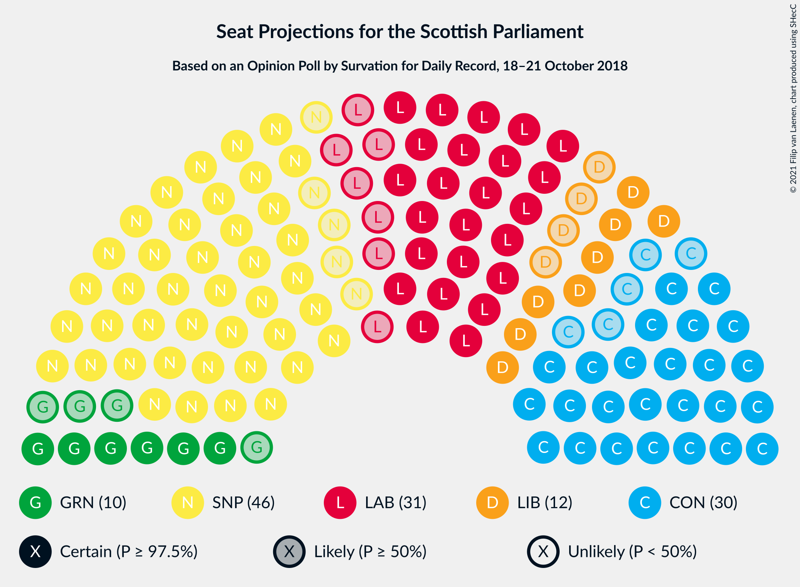
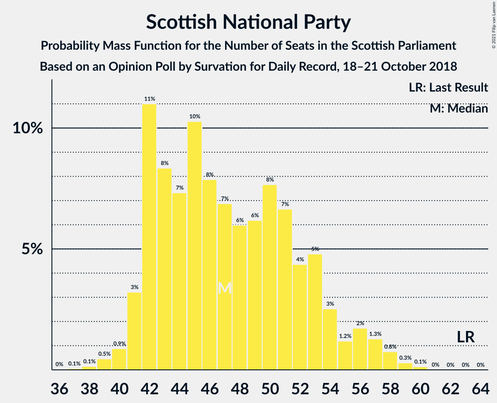
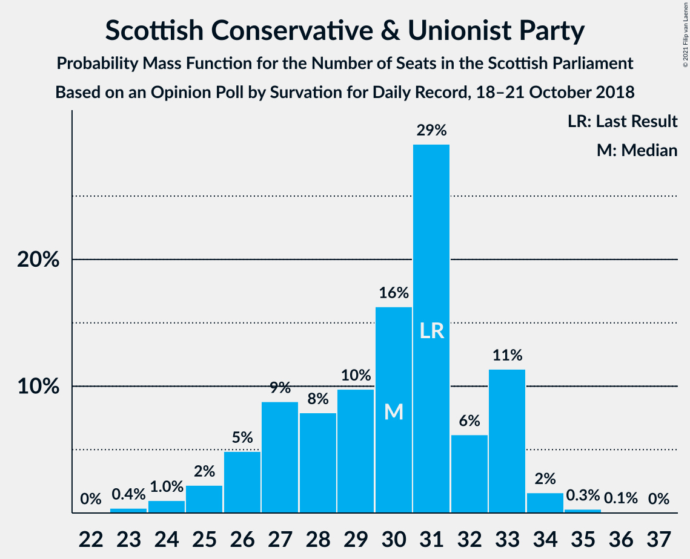
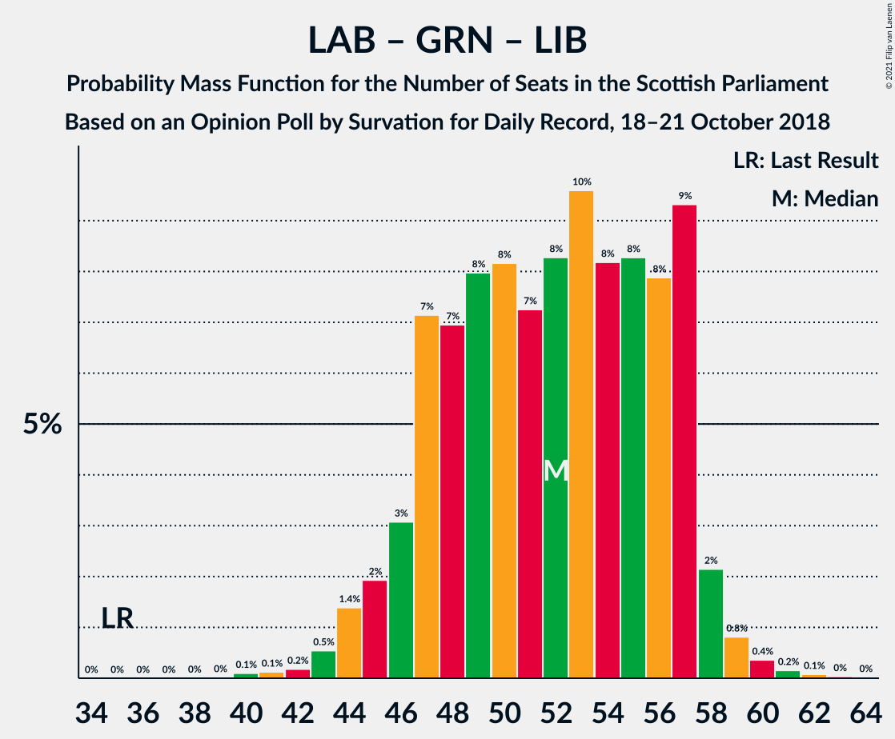

# Opinion Poll by Survation for Daily Record, 18–21 October 2018

<a href="#voting-intentions">Voting Intentions</a> | <a href="#seats">Seats</a> | <a href="#coalitions">Coalitions</a> | <a href="#technical-information">Technical Information</a>

## Voting Intentions

### Confidence Intervals

| Party | Last Result | Poll Result | 80% Confidence Interval | 90% Confidence Interval | 95% Confidence Interval | 99% Confidence Interval |
|:-----:|:-----------:|:-----------:|:-----------------------:|:-----------------------:|:-----------------------:|:-----------------------:|
| Scottish National Party | 41.7% | 32.0% | 30.1–33.9% |29.6–34.4% |29.2–34.9% |28.3–35.8% |
| Scottish Conservative & Unionist Party | 22.9% | 23.0% | 21.4–24.8% |20.9–25.3% |20.5–25.7% |19.8–26.6% |
| Scottish Labour | 19.1% | 23.0% | 21.4–24.8% |20.9–25.3% |20.5–25.7% |19.8–26.6% |
| Scottish Greens | 6.6% | 9.0% | 8.0–10.3% |7.7–10.7% |7.4–11.0% |7.0–11.6% |
| Scottish Liberal Democrats | 5.2% | 9.0% | 8.0–10.3% |7.7–10.7% |7.4–11.0% |7.0–11.6% |

*Note:* The poll result column reflects the actual value used in the calculations. Published results may vary slightly, and in addition be rounded to fewer digits.

## Seats

### Confidence Intervals

| Party | Last Result | Median | 80% Confidence Interval | 90% Confidence Interval | 95% Confidence Interval | 99% Confidence Interval |
|:-----:|:-----------:|:------:|:-----------------------:|:-----------------------:|:-----------------------:|:-----------------------:|
| <a href="#scottish-national-party">Scottish National Party</a> | 63 | 47 | 42–53 |42–55 |41–56 |39–58 |
| <a href="#scottish-conservative-&-unionist-party">Scottish Conservative & Unionist Party</a> | 31 | 30 | 27–33 |26–33 |25–33 |24–34 |
| <a href="#scottish-labour">Scottish Labour</a> | 24 | 31 | 26–34 |25–35 |24–36 |23–38 |
| <a href="#scottish-greens">Scottish Greens</a> | 6 | 10 | 8–12 |7–13 |6–13 |6–14 |
| <a href="#scottish-liberal-democrats">Scottish Liberal Democrats</a> | 5 | 12 | 10–13 |9–14 |8–14 |6–15 |

### Scottish National Party

*For a full overview of the results for this party, see the [Scottish National Party](party-scottishnationalparty.html) page.*

| Number of Seats | Probability | Accumulated | Special Marks |
|:---------------:|:-----------:|:-----------:|:-------------:|
| 37 | 0.1% | 100% |  |
| 38 | 0.1% | 99.9% |  |
| 39 | 0.5% | 99.8% |  |
| 40 | 0.9% | 99.3% |  |
| 41 | 3% | 98% |  |
| 42 | 11% | 95% |  |
| 43 | 8% | 84% |  |
| 44 | 7% | 76% |  |
| 45 | 10% | 69% |  |
| 46 | 8% | 58% |  |
| 47 | 7% | 50% | Median |
| 48 | 6% | 44% |  |
| 49 | 6% | 38% |  |
| 50 | 8% | 31% |  |
| 51 | 7% | 24% |  |
| 52 | 4% | 17% |  |
| 53 | 5% | 13% |  |
| 54 | 3% | 8% |  |
| 55 | 1.2% | 5% |  |
| 56 | 2% | 4% |  |
| 57 | 1.3% | 2% |  |
| 58 | 0.8% | 1.2% |  |
| 59 | 0.3% | 0.4% |  |
| 60 | 0.1% | 0.1% |  |
| 61 | 0% | 0% |  |
| 62 | 0% | 0% |  |
| 63 | 0% | 0% | Last Result |

### Scottish Conservative & Unionist Party

*For a full overview of the results for this party, see the [Scottish Conservative & Unionist Party](party-scottishconservativeunionistparty.html) page.*

| Number of Seats | Probability | Accumulated | Special Marks |
|:---------------:|:-----------:|:-----------:|:-------------:|
| 23 | 0.4% | 100% |  |
| 24 | 1.0% | 99.6% |  |
| 25 | 2% | 98.6% |  |
| 26 | 5% | 96% |  |
| 27 | 9% | 92% |  |
| 28 | 8% | 83% |  |
| 29 | 10% | 75% |  |
| 30 | 16% | 65% | Median |
| 31 | 29% | 49% | Last Result |
| 32 | 6% | 20% |  |
| 33 | 11% | 13% |  |
| 34 | 2% | 2% |  |
| 35 | 0.3% | 0.5% |  |
| 36 | 0.1% | 0.1% |  |
| 37 | 0% | 0% |  |

### Scottish Labour

*For a full overview of the results for this party, see the [Scottish Labour](party-scottishlabour.html) page.*

| Number of Seats | Probability | Accumulated | Special Marks |
|:---------------:|:-----------:|:-----------:|:-------------:|
| 23 | 0.9% | 100% |  |
| 24 | 3% | 99.1% | Last Result |
| 25 | 3% | 97% |  |
| 26 | 5% | 93% |  |
| 27 | 8% | 89% |  |
| 28 | 10% | 81% |  |
| 29 | 11% | 71% |  |
| 30 | 8% | 60% |  |
| 31 | 11% | 51% | Median |
| 32 | 11% | 40% |  |
| 33 | 12% | 30% |  |
| 34 | 9% | 17% |  |
| 35 | 4% | 8% |  |
| 36 | 2% | 4% |  |
| 37 | 0.8% | 2% |  |
| 38 | 0.4% | 0.8% |  |
| 39 | 0.2% | 0.4% |  |
| 40 | 0.1% | 0.1% |  |
| 41 | 0% | 0.1% |  |
| 42 | 0% | 0% |  |

### Scottish Greens

*For a full overview of the results for this party, see the [Scottish Greens](party-scottishgreens.html) page.*

| Number of Seats | Probability | Accumulated | Special Marks |
|:---------------:|:-----------:|:-----------:|:-------------:|
| 4 | 0.1% | 100% |  |
| 5 | 0.4% | 99.9% |  |
| 6 | 2% | 99.6% | Last Result |
| 7 | 4% | 97% |  |
| 8 | 10% | 93% |  |
| 9 | 21% | 83% |  |
| 10 | 38% | 61% | Median |
| 11 | 5% | 23% |  |
| 12 | 10% | 18% |  |
| 13 | 6% | 7% |  |
| 14 | 1.5% | 2% |  |
| 15 | 0% | 0% |  |

### Scottish Liberal Democrats

*For a full overview of the results for this party, see the [Scottish Liberal Democrats](party-scottishliberaldemocrats.html) page.*

| Number of Seats | Probability | Accumulated | Special Marks |
|:---------------:|:-----------:|:-----------:|:-------------:|
| 5 | 0% | 100% | Last Result |
| 6 | 1.4% | 100% |  |
| 7 | 1.0% | 98.6% |  |
| 8 | 2% | 98% |  |
| 9 | 4% | 95% |  |
| 10 | 8% | 91% |  |
| 11 | 17% | 83% |  |
| 12 | 39% | 66% | Median |
| 13 | 21% | 28% |  |
| 14 | 5% | 6% |  |
| 15 | 0.6% | 0.7% |  |
| 16 | 0.1% | 0.1% |  |
| 17 | 0% | 0% |  |

## Coalitions

### Confidence Intervals

| Coalition | Last Result | Median | Majority? | 80% Confidence Interval | 90% Confidence Interval | 95% Confidence Interval | 99% Confidence Interval |
|:---------:|:-----------:|:------:|:---------:|:-----------------------:|:-----------------------:|:-----------------------:|:-----------------------:|
| Scottish Conservative & Unionist Party – Scottish Labour – Scottish Liberal Democrats | 60 | 72 | 95% | 66–77 | 64–78 | 63–78 | 61–80 |
| Scottish Conservative & Unionist Party – Scottish Labour | 55 | 61 | 12% | 55–65 | 53–66 | 52–67 | 50–68 |
| Scottish National Party – Scottish Greens | 69 | 57 | 5% | 52–63 | 51–65 | 51–66 | 49–68 |
| Scottish Labour – Scottish Greens – Scottish Liberal Democrats | 35 | 52 | 0% | 47–57 | 46–57 | 45–58 | 43–60 |
| Scottish National Party | 63 | 47 | 0% | 42–53 | 42–55 | 41–56 | 39–58 |
| Scottish Labour – Scottish Liberal Democrats | 29 | 42 | 0% | 37–47 | 36–47 | 35–48 | 33–50 |
| Scottish Conservative & Unionist Party – Scottish Liberal Democrats | 36 | 42 | 0% | 38–45 | 36–46 | 35–46 | 34–47 |

### Scottish Conservative & Unionist Party – Scottish Labour – Scottish Liberal Democrats

| Number of Seats | Probability | Accumulated | Special Marks |
|:---------------:|:-----------:|:-----------:|:-------------:|
| 58 | 0% | 100% |  |
| 59 | 0.1% | 99.9% |  |
| 60 | 0.3% | 99.9% | Last Result |
| 61 | 0.4% | 99.6% |  |
| 62 | 0.6% | 99.1% |  |
| 63 | 2% | 98.6% |  |
| 64 | 2% | 97% |  |
| 65 | 2% | 95% | Majority |
| 66 | 4% | 92% |  |
| 67 | 4% | 89% |  |
| 68 | 4% | 84% |  |
| 69 | 7% | 80% |  |
| 70 | 8% | 73% |  |
| 71 | 7% | 65% |  |
| 72 | 9% | 58% |  |
| 73 | 7% | 49% | Median |
| 74 | 10% | 42% |  |
| 75 | 10% | 32% |  |
| 76 | 8% | 22% |  |
| 77 | 8% | 15% |  |
| 78 | 4% | 6% |  |
| 79 | 1.2% | 2% |  |
| 80 | 0.5% | 0.8% |  |
| 81 | 0.1% | 0.2% |  |
| 82 | 0.1% | 0.1% |  |
| 83 | 0% | 0.1% |  |
| 84 | 0% | 0% |  |

### Scottish Conservative & Unionist Party – Scottish Labour

| Number of Seats | Probability | Accumulated | Special Marks |
|:---------------:|:-----------:|:-----------:|:-------------:|
| 48 | 0.1% | 100% |  |
| 49 | 0.2% | 99.9% |  |
| 50 | 0.6% | 99.7% |  |
| 51 | 0.9% | 99.0% |  |
| 52 | 1.1% | 98% |  |
| 53 | 2% | 97% |  |
| 54 | 3% | 95% |  |
| 55 | 4% | 92% | Last Result |
| 56 | 4% | 88% |  |
| 57 | 6% | 83% |  |
| 58 | 6% | 77% |  |
| 59 | 7% | 71% |  |
| 60 | 10% | 63% |  |
| 61 | 8% | 53% | Median |
| 62 | 12% | 44% |  |
| 63 | 11% | 32% |  |
| 64 | 9% | 21% |  |
| 65 | 6% | 12% | Majority |
| 66 | 3% | 6% |  |
| 67 | 2% | 3% |  |
| 68 | 0.6% | 1.0% |  |
| 69 | 0.3% | 0.4% |  |
| 70 | 0.1% | 0.1% |  |
| 71 | 0% | 0.1% |  |
| 72 | 0% | 0% |  |

### Scottish National Party – Scottish Greens

| Number of Seats | Probability | Accumulated | Special Marks |
|:---------------:|:-----------:|:-----------:|:-------------:|
| 46 | 0% | 100% |  |
| 47 | 0.1% | 99.9% |  |
| 48 | 0.1% | 99.9% |  |
| 49 | 0.5% | 99.8% |  |
| 50 | 1.2% | 99.2% |  |
| 51 | 4% | 98% |  |
| 52 | 8% | 94% |  |
| 53 | 8% | 85% |  |
| 54 | 10% | 78% |  |
| 55 | 10% | 68% |  |
| 56 | 7% | 58% |  |
| 57 | 9% | 51% | Median |
| 58 | 7% | 42% |  |
| 59 | 8% | 35% |  |
| 60 | 7% | 27% |  |
| 61 | 4% | 20% |  |
| 62 | 4% | 16% |  |
| 63 | 4% | 11% |  |
| 64 | 2% | 8% |  |
| 65 | 2% | 5% | Majority |
| 66 | 2% | 3% |  |
| 67 | 0.6% | 1.4% |  |
| 68 | 0.4% | 0.9% |  |
| 69 | 0.3% | 0.4% | Last Result |
| 70 | 0.1% | 0.1% |  |
| 71 | 0% | 0.1% |  |
| 72 | 0% | 0% |  |

### Scottish Labour – Scottish Greens – Scottish Liberal Democrats

| Number of Seats | Probability | Accumulated | Special Marks |
|:---------------:|:-----------:|:-----------:|:-------------:|
| 35 | 0% | 100% | Last Result |
| 36 | 0% | 100% |  |
| 37 | 0% | 100% |  |
| 38 | 0% | 100% |  |
| 39 | 0% | 100% |  |
| 40 | 0.1% | 100% |  |
| 41 | 0.1% | 99.9% |  |
| 42 | 0.2% | 99.8% |  |
| 43 | 0.5% | 99.6% |  |
| 44 | 1.4% | 99.0% |  |
| 45 | 2% | 98% |  |
| 46 | 3% | 96% |  |
| 47 | 7% | 93% |  |
| 48 | 7% | 85% |  |
| 49 | 8% | 79% |  |
| 50 | 8% | 71% |  |
| 51 | 7% | 62% |  |
| 52 | 8% | 55% |  |
| 53 | 10% | 47% | Median |
| 54 | 8% | 37% |  |
| 55 | 8% | 29% |  |
| 56 | 8% | 21% |  |
| 57 | 9% | 13% |  |
| 58 | 2% | 4% |  |
| 59 | 0.8% | 1.5% |  |
| 60 | 0.4% | 0.7% |  |
| 61 | 0.2% | 0.3% |  |
| 62 | 0.1% | 0.1% |  |
| 63 | 0% | 0.1% |  |
| 64 | 0% | 0% |  |

### Scottish National Party

| Number of Seats | Probability | Accumulated | Special Marks |
|:---------------:|:-----------:|:-----------:|:-------------:|
| 37 | 0.1% | 100% |  |
| 38 | 0.1% | 99.9% |  |
| 39 | 0.5% | 99.8% |  |
| 40 | 0.9% | 99.3% |  |
| 41 | 3% | 98% |  |
| 42 | 11% | 95% |  |
| 43 | 8% | 84% |  |
| 44 | 7% | 76% |  |
| 45 | 10% | 69% |  |
| 46 | 8% | 58% |  |
| 47 | 7% | 50% | Median |
| 48 | 6% | 44% |  |
| 49 | 6% | 38% |  |
| 50 | 8% | 31% |  |
| 51 | 7% | 24% |  |
| 52 | 4% | 17% |  |
| 53 | 5% | 13% |  |
| 54 | 3% | 8% |  |
| 55 | 1.2% | 5% |  |
| 56 | 2% | 4% |  |
| 57 | 1.3% | 2% |  |
| 58 | 0.8% | 1.2% |  |
| 59 | 0.3% | 0.4% |  |
| 60 | 0.1% | 0.1% |  |
| 61 | 0% | 0% |  |
| 62 | 0% | 0% |  |
| 63 | 0% | 0% | Last Result |

### Scottish Labour – Scottish Liberal Democrats

| Number of Seats | Probability | Accumulated | Special Marks |
|:---------------:|:-----------:|:-----------:|:-------------:|
| 29 | 0% | 100% | Last Result |
| 30 | 0% | 100% |  |
| 31 | 0.1% | 100% |  |
| 32 | 0.2% | 99.9% |  |
| 33 | 0.4% | 99.7% |  |
| 34 | 0.8% | 99.3% |  |
| 35 | 1.3% | 98.5% |  |
| 36 | 3% | 97% |  |
| 37 | 5% | 95% |  |
| 38 | 7% | 90% |  |
| 39 | 7% | 83% |  |
| 40 | 11% | 76% |  |
| 41 | 11% | 65% |  |
| 42 | 8% | 54% |  |
| 43 | 9% | 46% | Median |
| 44 | 9% | 37% |  |
| 45 | 9% | 29% |  |
| 46 | 6% | 19% |  |
| 47 | 9% | 13% |  |
| 48 | 2% | 4% |  |
| 49 | 0.7% | 2% |  |
| 50 | 0.4% | 0.8% |  |
| 51 | 0.2% | 0.4% |  |
| 52 | 0.1% | 0.1% |  |
| 53 | 0% | 0.1% |  |
| 54 | 0% | 0% |  |

### Scottish Conservative & Unionist Party – Scottish Liberal Democrats

| Number of Seats | Probability | Accumulated | Special Marks |
|:---------------:|:-----------:|:-----------:|:-------------:|
| 32 | 0.1% | 100% |  |
| 33 | 0.3% | 99.9% |  |
| 34 | 0.9% | 99.6% |  |
| 35 | 1.4% | 98.7% |  |
| 36 | 2% | 97% | Last Result |
| 37 | 3% | 95% |  |
| 38 | 6% | 92% |  |
| 39 | 8% | 85% |  |
| 40 | 9% | 77% |  |
| 41 | 11% | 69% |  |
| 42 | 14% | 58% | Median |
| 43 | 21% | 44% |  |
| 44 | 10% | 23% |  |
| 45 | 7% | 12% |  |
| 46 | 4% | 6% |  |
| 47 | 2% | 2% |  |
| 48 | 0.1% | 0.2% |  |
| 49 | 0% | 0.1% |  |
| 50 | 0% | 0% |  |

## Technical Information

### Opinion Poll

+ **Polling firm:** Survation
+ **Commissioner(s):** Daily Record
+ **Fieldwork period:** 18–21 October 2018

### Calculations

+ **Sample size:** 1017
+ **Simulations done:** 1,048,576
+ **Error estimate:** 0.21%

