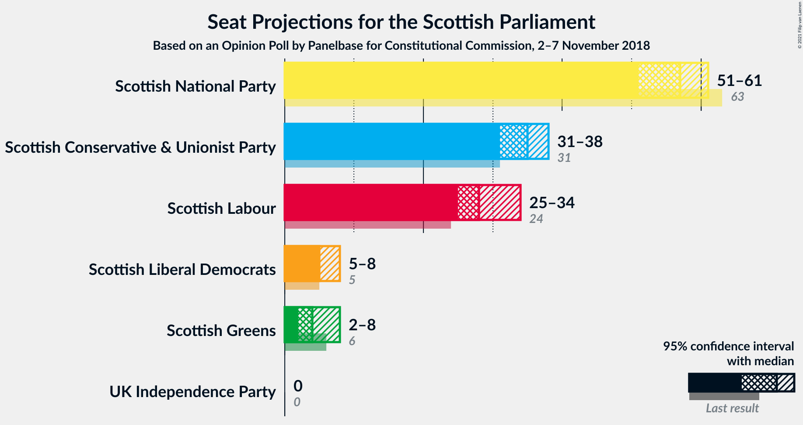
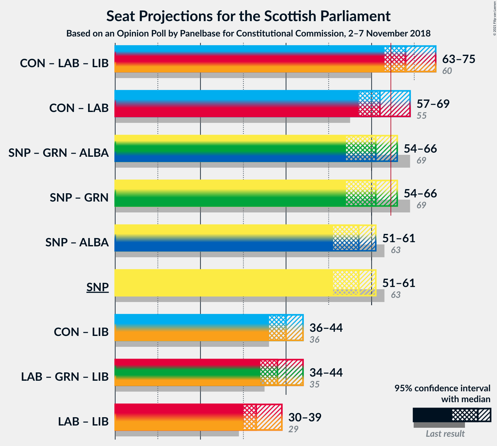
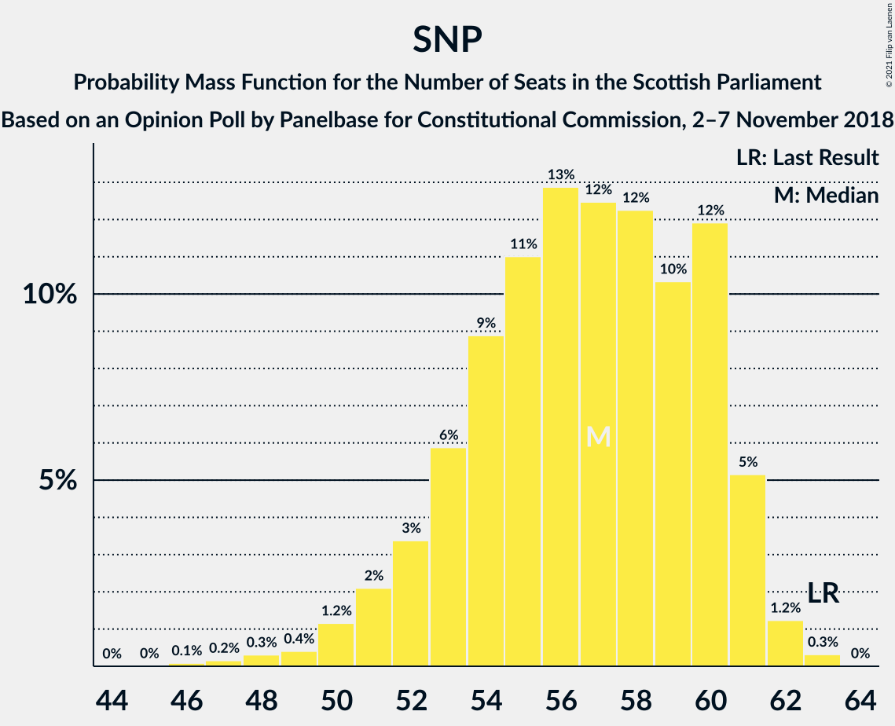

# Opinion Poll by Panelbase for Constitutional Commission, 2–7 November 2018

<a href="#voting-intentions">Voting Intentions</a> | <a href="#seats">Seats</a> | <a href="#coalitions">Coalitions</a> | <a href="#technical-information">Technical Information</a>

## Voting Intentions

### Confidence Intervals

| Party | Last Result | Poll Result | 80% Confidence Interval | 90% Confidence Interval | 95% Confidence Interval | 99% Confidence Interval |
|:-----:|:-----------:|:-----------:|:-----------------------:|:-----------------------:|:-----------------------:|:-----------------------:|
| Scottish National Party | 41.7% | 37.2% | 35.3–39.2% |34.8–39.7% |34.4–40.2% |33.5–41.2% |
| Scottish Conservative & Unionist Party | 22.9% | 26.2% | 24.5–28.0% |24.0–28.5% |23.6–28.9% |22.8–29.8% |
| Scottish Labour | 19.1% | 22.2% | 20.6–23.9% |20.2–24.4% |19.8–24.8% |19.0–25.7% |
| Scottish Greens | 6.6% | 6.0% | 5.2–7.1% |4.9–7.3% |4.7–7.6% |4.3–8.1% |
| Scottish Liberal Democrats | 5.2% | 6.0% | 5.2–7.1% |4.9–7.3% |4.7–7.6% |4.3–8.1% |
| UK Independence Party | 2.0% | 2.0% | 1.5–2.7% |1.4–2.9% |1.3–3.0% |1.1–3.4% |

*Note:* The poll result column reflects the actual value used in the calculations. Published results may vary slightly, and in addition be rounded to fewer digits.

## Seats

### Confidence Intervals

| Party | Last Result | Median | 80% Confidence Interval | 90% Confidence Interval | 95% Confidence Interval | 99% Confidence Interval |
|:-----:|:-----------:|:------:|:-----------------------:|:-----------------------:|:-----------------------:|:-----------------------:|
| <a href="#scottish-national-party">Scottish National Party</a> | 63 | 57 | 53–60 |52–61 |51–61 |48–62 |
| <a href="#scottish-conservative-&-unionist-party">Scottish Conservative & Unionist Party</a> | 31 | 35 | 32–37 |31–38 |31–38 |29–40 |
| <a href="#scottish-labour">Scottish Labour</a> | 24 | 28 | 26–32 |25–33 |25–34 |24–35 |
| <a href="#scottish-greens">Scottish Greens</a> | 6 | 4 | 3–7 |2–7 |2–8 |2–9 |
| <a href="#scottish-liberal-democrats">Scottish Liberal Democrats</a> | 5 | 5 | 5–6 |5–7 |5–8 |4–9 |
| <a href="#uk-independence-party">UK Independence Party</a> | 0 | 0 | 0 |0 |0 |0 |

### Scottish National Party

*For a full overview of the results for this party, see the [Scottish National Party](party-scottishnationalparty.html) page.*

| Number of Seats | Probability | Accumulated | Special Marks |
|:---------------:|:-----------:|:-----------:|:-------------:|
| 46 | 0.1% | 100% |  |
| 47 | 0.2% | 99.9% |  |
| 48 | 0.3% | 99.7% |  |
| 49 | 0.4% | 99.4% |  |
| 50 | 1.2% | 99.0% |  |
| 51 | 2% | 98% |  |
| 52 | 3% | 96% |  |
| 53 | 6% | 92% |  |
| 54 | 9% | 86% |  |
| 55 | 11% | 78% |  |
| 56 | 13% | 67% |  |
| 57 | 12% | 54% | Median |
| 58 | 12% | 41% |  |
| 59 | 10% | 29% |  |
| 60 | 12% | 19% |  |
| 61 | 5% | 7% |  |
| 62 | 1.2% | 2% |  |
| 63 | 0.3% | 0.3% | Last Result |
| 64 | 0% | 0% |  |

### Scottish Conservative & Unionist Party

*For a full overview of the results for this party, see the [Scottish Conservative & Unionist Party](party-scottishconservativeunionistparty.html) page.*

| Number of Seats | Probability | Accumulated | Special Marks |
|:---------------:|:-----------:|:-----------:|:-------------:|
| 27 | 0% | 100% |  |
| 28 | 0.2% | 99.9% |  |
| 29 | 0.3% | 99.8% |  |
| 30 | 2% | 99.4% |  |
| 31 | 7% | 98% | Last Result |
| 32 | 12% | 91% |  |
| 33 | 9% | 79% |  |
| 34 | 19% | 70% |  |
| 35 | 17% | 50% | Median |
| 36 | 15% | 33% |  |
| 37 | 13% | 18% |  |
| 38 | 4% | 6% |  |
| 39 | 2% | 2% |  |
| 40 | 0.6% | 0.7% |  |
| 41 | 0.1% | 0.1% |  |
| 42 | 0% | 0% |  |

### Scottish Labour

*For a full overview of the results for this party, see the [Scottish Labour](party-scottishlabour.html) page.*

| Number of Seats | Probability | Accumulated | Special Marks |
|:---------------:|:-----------:|:-----------:|:-------------:|
| 23 | 0.1% | 100% |  |
| 24 | 0.8% | 99.9% | Last Result |
| 25 | 4% | 99.1% |  |
| 26 | 29% | 95% |  |
| 27 | 15% | 66% |  |
| 28 | 10% | 51% | Median |
| 29 | 10% | 41% |  |
| 30 | 8% | 31% |  |
| 31 | 10% | 23% |  |
| 32 | 7% | 12% |  |
| 33 | 3% | 5% |  |
| 34 | 1.5% | 3% |  |
| 35 | 0.6% | 1.0% |  |
| 36 | 0.4% | 0.5% |  |
| 37 | 0% | 0% |  |

### Scottish Greens

*For a full overview of the results for this party, see the [Scottish Greens](party-scottishgreens.html) page.*

| Number of Seats | Probability | Accumulated | Special Marks |
|:---------------:|:-----------:|:-----------:|:-------------:|
| 2 | 7% | 100% |  |
| 3 | 29% | 93% |  |
| 4 | 35% | 64% | Median |
| 5 | 13% | 29% |  |
| 6 | 4% | 16% | Last Result |
| 7 | 8% | 12% |  |
| 8 | 3% | 4% |  |
| 9 | 0.8% | 1.1% |  |
| 10 | 0.3% | 0.3% |  |
| 11 | 0% | 0% |  |

### Scottish Liberal Democrats

*For a full overview of the results for this party, see the [Scottish Liberal Democrats](party-scottishliberaldemocrats.html) page.*

| Number of Seats | Probability | Accumulated | Special Marks |
|:---------------:|:-----------:|:-----------:|:-------------:|
| 3 | 0.1% | 100% |  |
| 4 | 2% | 99.8% |  |
| 5 | 66% | 98% | Last Result, Median |
| 6 | 25% | 32% |  |
| 7 | 3% | 7% |  |
| 8 | 3% | 4% |  |
| 9 | 0.7% | 1.0% |  |
| 10 | 0.3% | 0.3% |  |
| 11 | 0% | 0.1% |  |
| 12 | 0% | 0% |  |

### UK Independence Party

*For a full overview of the results for this party, see the [UK Independence Party](party-ukindependenceparty.html) page.*

| Number of Seats | Probability | Accumulated | Special Marks |
|:---------------:|:-----------:|:-----------:|:-------------:|
| 0 | 100% | 100% | Last Result, Median |

## Coalitions

### Confidence Intervals

| Coalition | Last Result | Median | Majority? | 80% Confidence Interval | 90% Confidence Interval | 95% Confidence Interval | 99% Confidence Interval |
|:---------:|:-----------:|:------:|:---------:|:-----------------------:|:-----------------------:|:-----------------------:|:-----------------------:|
| Scottish Conservative & Unionist Party – Scottish Labour – Scottish Liberal Democrats | 60 | 68 | 91% | 65–72 | 64–74 | 63–75 | 62–76 |
| Scottish Conservative & Unionist Party – Scottish Labour | 55 | 62 | 26% | 59–67 | 58–68 | 57–69 | 56–71 |
| Scottish National Party – Scottish Greens | 69 | 61 | 9% | 57–64 | 55–65 | 54–66 | 53–67 |
| Scottish National Party | 63 | 57 | 0% | 53–60 | 52–61 | 51–61 | 48–62 |
| Scottish Conservative & Unionist Party – Scottish Liberal Democrats | 36 | 40 | 0% | 37–43 | 36–43 | 36–44 | 35–45 |
| Scottish Labour – Scottish Greens – Scottish Liberal Democrats | 35 | 38 | 0% | 35–41 | 34–42 | 34–44 | 33–46 |
| Scottish Labour – Scottish Liberal Democrats | 29 | 33 | 0% | 31–37 | 31–38 | 30–39 | 30–41 |

### Scottish Conservative & Unionist Party – Scottish Labour – Scottish Liberal Democrats

| Number of Seats | Probability | Accumulated | Special Marks |
|:---------------:|:-----------:|:-----------:|:-------------:|
| 59 | 0% | 100% |  |
| 60 | 0.1% | 99.9% | Last Result |
| 61 | 0.3% | 99.8% |  |
| 62 | 1.1% | 99.5% |  |
| 63 | 3% | 98% |  |
| 64 | 5% | 96% |  |
| 65 | 7% | 91% | Majority |
| 66 | 12% | 84% |  |
| 67 | 17% | 72% |  |
| 68 | 17% | 55% | Median |
| 69 | 10% | 38% |  |
| 70 | 7% | 28% |  |
| 71 | 7% | 21% |  |
| 72 | 6% | 14% |  |
| 73 | 3% | 8% |  |
| 74 | 3% | 5% |  |
| 75 | 1.5% | 3% |  |
| 76 | 0.6% | 1.1% |  |
| 77 | 0.3% | 0.5% |  |
| 78 | 0.2% | 0.2% |  |
| 79 | 0% | 0% |  |

### Scottish Conservative & Unionist Party – Scottish Labour

| Number of Seats | Probability | Accumulated | Special Marks |
|:---------------:|:-----------:|:-----------:|:-------------:|
| 54 | 0.1% | 100% |  |
| 55 | 0.2% | 99.9% | Last Result |
| 56 | 0.4% | 99.7% |  |
| 57 | 2% | 99.3% |  |
| 58 | 3% | 97% |  |
| 59 | 6% | 94% |  |
| 60 | 8% | 88% |  |
| 61 | 13% | 80% |  |
| 62 | 18% | 67% |  |
| 63 | 15% | 49% | Median |
| 64 | 8% | 34% |  |
| 65 | 9% | 26% | Majority |
| 66 | 7% | 17% |  |
| 67 | 4% | 11% |  |
| 68 | 3% | 6% |  |
| 69 | 2% | 4% |  |
| 70 | 0.9% | 2% |  |
| 71 | 0.3% | 0.6% |  |
| 72 | 0.2% | 0.3% |  |
| 73 | 0% | 0% |  |

### Scottish National Party – Scottish Greens

| Number of Seats | Probability | Accumulated | Special Marks |
|:---------------:|:-----------:|:-----------:|:-------------:|
| 51 | 0.2% | 100% |  |
| 52 | 0.3% | 99.8% |  |
| 53 | 0.6% | 99.5% |  |
| 54 | 1.5% | 98.9% |  |
| 55 | 3% | 97% |  |
| 56 | 3% | 95% |  |
| 57 | 6% | 92% |  |
| 58 | 7% | 86% |  |
| 59 | 7% | 79% |  |
| 60 | 10% | 72% |  |
| 61 | 17% | 62% | Median |
| 62 | 17% | 45% |  |
| 63 | 12% | 28% |  |
| 64 | 7% | 16% |  |
| 65 | 5% | 9% | Majority |
| 66 | 3% | 4% |  |
| 67 | 1.1% | 2% |  |
| 68 | 0.3% | 0.5% |  |
| 69 | 0.1% | 0.2% | Last Result |
| 70 | 0% | 0.1% |  |
| 71 | 0% | 0% |  |

### Scottish National Party

| Number of Seats | Probability | Accumulated | Special Marks |
|:---------------:|:-----------:|:-----------:|:-------------:|
| 46 | 0.1% | 100% |  |
| 47 | 0.2% | 99.9% |  |
| 48 | 0.3% | 99.7% |  |
| 49 | 0.4% | 99.4% |  |
| 50 | 1.2% | 99.0% |  |
| 51 | 2% | 98% |  |
| 52 | 3% | 96% |  |
| 53 | 6% | 92% |  |
| 54 | 9% | 86% |  |
| 55 | 11% | 78% |  |
| 56 | 13% | 67% |  |
| 57 | 12% | 54% | Median |
| 58 | 12% | 41% |  |
| 59 | 10% | 29% |  |
| 60 | 12% | 19% |  |
| 61 | 5% | 7% |  |
| 62 | 1.2% | 2% |  |
| 63 | 0.3% | 0.3% | Last Result |
| 64 | 0% | 0% |  |

### Scottish Conservative & Unionist Party – Scottish Liberal Democrats

| Number of Seats | Probability | Accumulated | Special Marks |
|:---------------:|:-----------:|:-----------:|:-------------:|
| 32 | 0% | 100% |  |
| 33 | 0.1% | 99.9% |  |
| 34 | 0.3% | 99.8% |  |
| 35 | 0.7% | 99.6% |  |
| 36 | 5% | 98.9% | Last Result |
| 37 | 12% | 93% |  |
| 38 | 9% | 82% |  |
| 39 | 15% | 73% |  |
| 40 | 16% | 57% | Median |
| 41 | 17% | 42% |  |
| 42 | 13% | 25% |  |
| 43 | 8% | 12% |  |
| 44 | 3% | 4% |  |
| 45 | 1.3% | 2% |  |
| 46 | 0.2% | 0.3% |  |
| 47 | 0.1% | 0.1% |  |
| 48 | 0% | 0% |  |

### Scottish Labour – Scottish Greens – Scottish Liberal Democrats

| Number of Seats | Probability | Accumulated | Special Marks |
|:---------------:|:-----------:|:-----------:|:-------------:|
| 32 | 0.2% | 100% |  |
| 33 | 1.3% | 99.8% |  |
| 34 | 8% | 98% |  |
| 35 | 14% | 91% | Last Result |
| 36 | 14% | 77% |  |
| 37 | 11% | 64% | Median |
| 38 | 14% | 53% |  |
| 39 | 12% | 40% |  |
| 40 | 11% | 28% |  |
| 41 | 8% | 17% |  |
| 42 | 4% | 9% |  |
| 43 | 2% | 5% |  |
| 44 | 2% | 3% |  |
| 45 | 0.7% | 1.4% |  |
| 46 | 0.4% | 0.7% |  |
| 47 | 0.2% | 0.3% |  |
| 48 | 0.1% | 0.1% |  |
| 49 | 0% | 0% |  |

### Scottish Labour – Scottish Liberal Democrats

| Number of Seats | Probability | Accumulated | Special Marks |
|:---------------:|:-----------:|:-----------:|:-------------:|
| 28 | 0.1% | 100% |  |
| 29 | 0.3% | 99.9% | Last Result |
| 30 | 3% | 99.6% |  |
| 31 | 21% | 96% |  |
| 32 | 17% | 75% |  |
| 33 | 11% | 58% | Median |
| 34 | 12% | 47% |  |
| 35 | 9% | 34% |  |
| 36 | 9% | 25% |  |
| 37 | 8% | 17% |  |
| 38 | 4% | 8% |  |
| 39 | 2% | 4% |  |
| 40 | 1.0% | 2% |  |
| 41 | 0.7% | 1.1% |  |
| 42 | 0.2% | 0.3% |  |
| 43 | 0.1% | 0.1% |  |
| 44 | 0% | 0% |  |

## Technical Information

### Opinion Poll

+ **Polling firm:** Panelbase
+ **Commissioner(s):** Constitutional Commission
+ **Fieldwork period:** 2–7 November 2018

### Calculations

+ **Sample size:** 1050
+ **Simulations done:** 1,048,576
+ **Error estimate:** 0.96%

