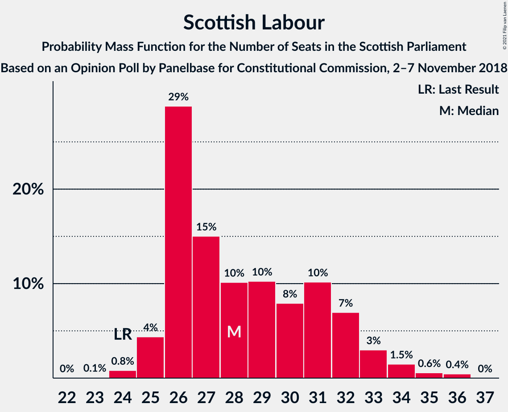
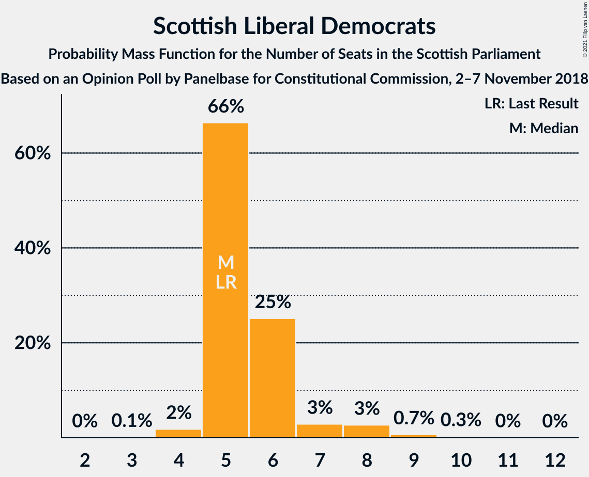

# Opinion Poll by Panelbase for Constitutional Commission, 2–7 November 2018

<a href="#voting-intentions">Voting Intentions</a> | <a href="#seats">Seats</a> | <a href="#coalitions">Coalitions</a> | <a href="#technical-information">Technical Information</a>

## Voting Intentions

### Confidence Intervals

| Party | Last Result | Poll Result | 80% Confidence Interval | 90% Confidence Interval | 95% Confidence Interval | 99% Confidence Interval |
|:-----:|:-----------:|:-----------:|:-----------------------:|:-----------------------:|:-----------------------:|:-----------------------:|
| Scottish National Party | 41.7% | 37.2% | 35.3–39.2% |34.8–39.7% |34.4–40.2% |33.5–41.2% |
| Scottish Conservative & Unionist Party | 22.9% | 26.2% | 24.5–28.0% |24.0–28.5% |23.6–28.9% |22.8–29.8% |
| Scottish Labour | 19.1% | 22.2% | 20.6–23.9% |20.2–24.4% |19.8–24.8% |19.0–25.7% |
| Scottish Greens | 6.6% | 6.0% | 5.2–7.1% |4.9–7.3% |4.7–7.6% |4.3–8.1% |
| Scottish Liberal Democrats | 5.2% | 6.0% | 5.2–7.1% |4.9–7.3% |4.7–7.6% |4.3–8.1% |
| UK Independence Party | 2.0% | 2.0% | 1.5–2.7% |1.4–2.9% |1.3–3.0% |1.1–3.4% |

*Note:* The poll result column reflects the actual value used in the calculations. Published results may vary slightly, and in addition be rounded to fewer digits.

## Seats

### Confidence Intervals

| Party | Last Result | Median | 80% Confidence Interval | 90% Confidence Interval | 95% Confidence Interval | 99% Confidence Interval |
|:-----:|:-----------:|:------:|:-----------------------:|:-----------------------:|:-----------------------:|:-----------------------:|
| <a href="#scottish-national-party">Scottish National Party</a> | 63 | 56 | 52–58 |51–58 |50–59 |48–61 |
| <a href="#scottish-conservative-&-unionist-party">Scottish Conservative & Unionist Party</a> | 31 | 35 | 32–37 |31–38 |31–39 |30–40 |
| <a href="#scottish-labour">Scottish Labour</a> | 24 | 29 | 27–33 |26–33 |26–34 |24–36 |
| <a href="#scottish-greens">Scottish Greens</a> | 6 | 4 | 3–7 |2–8 |2–9 |2–10 |
| <a href="#scottish-liberal-democrats">Scottish Liberal Democrats</a> | 5 | 5 | 5–6 |4–6 |4–7 |3–9 |
| <a href="#uk-independence-party">UK Independence Party</a> | 0 | 0 | 0 |0 |0 |0 |

### Scottish National Party

*For a full overview of the results for this party, see the [Scottish National Party](party-scottishnationalparty.html) page.*

| Number of Seats | Probability | Accumulated | Special Marks |
|:---------------:|:-----------:|:-----------:|:-------------:|
| 46 | 0.1% | 100% |  |
| 47 | 0.2% | 99.9% |  |
| 48 | 0.2% | 99.7% |  |
| 49 | 0.3% | 99.5% |  |
| 50 | 2% | 99.2% |  |
| 51 | 5% | 97% |  |
| 52 | 3% | 93% |  |
| 53 | 8% | 90% |  |
| 54 | 14% | 81% |  |
| 55 | 16% | 67% |  |
| 56 | 13% | 51% | Median |
| 57 | 16% | 38% |  |
| 58 | 17% | 22% |  |
| 59 | 3% | 5% |  |
| 60 | 0.7% | 1.3% |  |
| 61 | 0.4% | 0.7% |  |
| 62 | 0.2% | 0.3% |  |
| 63 | 0.1% | 0.1% | Last Result |
| 64 | 0% | 0% |  |

### Scottish Conservative & Unionist Party

*For a full overview of the results for this party, see the [Scottish Conservative & Unionist Party](party-scottishconservativeunionistparty.html) page.*

| Number of Seats | Probability | Accumulated | Special Marks |
|:---------------:|:-----------:|:-----------:|:-------------:|
| 27 | 0% | 100% |  |
| 28 | 0% | 99.9% |  |
| 29 | 0.2% | 99.9% |  |
| 30 | 1.1% | 99.7% |  |
| 31 | 7% | 98.6% | Last Result |
| 32 | 6% | 91% |  |
| 33 | 6% | 85% |  |
| 34 | 26% | 79% |  |
| 35 | 14% | 54% | Median |
| 36 | 22% | 40% |  |
| 37 | 10% | 18% |  |
| 38 | 5% | 8% |  |
| 39 | 1.4% | 3% |  |
| 40 | 0.7% | 1.2% |  |
| 41 | 0.4% | 0.5% |  |
| 42 | 0.1% | 0.1% |  |
| 43 | 0% | 0% |  |

### Scottish Labour

*For a full overview of the results for this party, see the [Scottish Labour](party-scottishlabour.html) page.*

| Number of Seats | Probability | Accumulated | Special Marks |
|:---------------:|:-----------:|:-----------:|:-------------:|
| 23 | 0.1% | 100% |  |
| 24 | 0.4% | 99.9% | Last Result |
| 25 | 1.2% | 99.5% |  |
| 26 | 4% | 98% |  |
| 27 | 23% | 95% |  |
| 28 | 12% | 72% |  |
| 29 | 20% | 59% | Median |
| 30 | 8% | 39% |  |
| 31 | 9% | 32% |  |
| 32 | 9% | 23% |  |
| 33 | 9% | 13% |  |
| 34 | 2% | 4% |  |
| 35 | 0.8% | 1.4% |  |
| 36 | 0.6% | 0.6% |  |
| 37 | 0% | 0% |  |

### Scottish Greens

*For a full overview of the results for this party, see the [Scottish Greens](party-scottishgreens.html) page.*

| Number of Seats | Probability | Accumulated | Special Marks |
|:---------------:|:-----------:|:-----------:|:-------------:|
| 2 | 7% | 100% |  |
| 3 | 32% | 93% |  |
| 4 | 35% | 61% | Median |
| 5 | 8% | 26% |  |
| 6 | 3% | 18% | Last Result |
| 7 | 5% | 15% |  |
| 8 | 6% | 9% |  |
| 9 | 2% | 3% |  |
| 10 | 0.9% | 0.9% |  |
| 11 | 0% | 0% |  |

### Scottish Liberal Democrats

*For a full overview of the results for this party, see the [Scottish Liberal Democrats](party-scottishliberaldemocrats.html) page.*

| Number of Seats | Probability | Accumulated | Special Marks |
|:---------------:|:-----------:|:-----------:|:-------------:|
| 2 | 0.2% | 100% |  |
| 3 | 0.6% | 99.8% |  |
| 4 | 8% | 99.2% |  |
| 5 | 71% | 91% | Last Result, Median |
| 6 | 15% | 20% |  |
| 7 | 3% | 5% |  |
| 8 | 2% | 2% |  |
| 9 | 0.6% | 0.7% |  |
| 10 | 0.1% | 0.1% |  |
| 11 | 0% | 0% |  |

### UK Independence Party

*For a full overview of the results for this party, see the [UK Independence Party](party-ukindependenceparty.html) page.*

| Number of Seats | Probability | Accumulated | Special Marks |
|:---------------:|:-----------:|:-----------:|:-------------:|
| 0 | 100% | 100% | Last Result, Median |

## Coalitions

### Confidence Intervals

| Coalition | Last Result | Median | Majority? | 80% Confidence Interval | 90% Confidence Interval | 95% Confidence Interval | 99% Confidence Interval |
|:---------:|:-----------:|:------:|:---------:|:-----------------------:|:-----------------------:|:-----------------------:|:-----------------------:|
| Scottish Conservative & Unionist Party – Scottish Labour – Scottish Liberal Democrats | 60 | 69 | 98% | 67–73 | 66–74 | 65–75 | 62–76 |
| Scottish Conservative & Unionist Party – Scottish Labour | 55 | 64 | 44% | 61–67 | 60–69 | 60–69 | 57–71 |
| Scottish National Party – Scottish Greens | 69 | 60 | 2% | 56–62 | 55–63 | 54–64 | 53–67 |
| Scottish National Party | 63 | 56 | 0% | 52–58 | 51–58 | 50–59 | 48–61 |
| Scottish Conservative & Unionist Party – Scottish Liberal Democrats | 36 | 40 | 0% | 37–42 | 36–43 | 36–44 | 35–46 |
| Scottish Labour – Scottish Greens – Scottish Liberal Democrats | 35 | 38 | 0% | 35–42 | 35–43 | 35–44 | 33–46 |
| Scottish Labour – Scottish Liberal Democrats | 29 | 34 | 0% | 32–38 | 31–39 | 31–39 | 30–41 |

### Scottish Conservative & Unionist Party – Scottish Labour – Scottish Liberal Democrats

| Number of Seats | Probability | Accumulated | Special Marks |
|:---------------:|:-----------:|:-----------:|:-------------:|
| 60 | 0% | 100% | Last Result |
| 61 | 0.1% | 100% |  |
| 62 | 0.4% | 99.9% |  |
| 63 | 0.4% | 99.4% |  |
| 64 | 1.1% | 99.0% |  |
| 65 | 3% | 98% | Majority |
| 66 | 5% | 95% |  |
| 67 | 11% | 90% |  |
| 68 | 26% | 79% |  |
| 69 | 9% | 53% | Median |
| 70 | 13% | 44% |  |
| 71 | 9% | 30% |  |
| 72 | 11% | 21% |  |
| 73 | 3% | 10% |  |
| 74 | 4% | 7% |  |
| 75 | 2% | 3% |  |
| 76 | 0.9% | 1.3% |  |
| 77 | 0.3% | 0.5% |  |
| 78 | 0.1% | 0.1% |  |
| 79 | 0% | 0% |  |

### Scottish Conservative & Unionist Party – Scottish Labour

| Number of Seats | Probability | Accumulated | Special Marks |
|:---------------:|:-----------:|:-----------:|:-------------:|
| 55 | 0% | 100% | Last Result |
| 56 | 0.1% | 100% |  |
| 57 | 0.3% | 99.8% |  |
| 58 | 0.5% | 99.5% |  |
| 59 | 1.3% | 99.0% |  |
| 60 | 4% | 98% |  |
| 61 | 5% | 94% |  |
| 62 | 15% | 90% |  |
| 63 | 25% | 75% |  |
| 64 | 6% | 50% | Median |
| 65 | 17% | 44% | Majority |
| 66 | 10% | 28% |  |
| 67 | 8% | 18% |  |
| 68 | 3% | 9% |  |
| 69 | 5% | 6% |  |
| 70 | 0.9% | 2% |  |
| 71 | 0.7% | 0.9% |  |
| 72 | 0.2% | 0.2% |  |
| 73 | 0% | 0% |  |

### Scottish National Party – Scottish Greens

| Number of Seats | Probability | Accumulated | Special Marks |
|:---------------:|:-----------:|:-----------:|:-------------:|
| 51 | 0.1% | 100% |  |
| 52 | 0.3% | 99.9% |  |
| 53 | 0.9% | 99.5% |  |
| 54 | 2% | 98.7% |  |
| 55 | 4% | 97% |  |
| 56 | 3% | 93% |  |
| 57 | 11% | 90% |  |
| 58 | 9% | 79% |  |
| 59 | 13% | 70% |  |
| 60 | 9% | 56% | Median |
| 61 | 26% | 47% |  |
| 62 | 11% | 21% |  |
| 63 | 5% | 10% |  |
| 64 | 3% | 5% |  |
| 65 | 1.1% | 2% | Majority |
| 66 | 0.4% | 1.0% |  |
| 67 | 0.4% | 0.6% |  |
| 68 | 0.1% | 0.1% |  |
| 69 | 0% | 0% | Last Result |

### Scottish National Party

| Number of Seats | Probability | Accumulated | Special Marks |
|:---------------:|:-----------:|:-----------:|:-------------:|
| 46 | 0.1% | 100% |  |
| 47 | 0.2% | 99.9% |  |
| 48 | 0.2% | 99.7% |  |
| 49 | 0.3% | 99.5% |  |
| 50 | 2% | 99.2% |  |
| 51 | 5% | 97% |  |
| 52 | 3% | 93% |  |
| 53 | 8% | 90% |  |
| 54 | 14% | 81% |  |
| 55 | 16% | 67% |  |
| 56 | 13% | 51% | Median |
| 57 | 16% | 38% |  |
| 58 | 17% | 22% |  |
| 59 | 3% | 5% |  |
| 60 | 0.7% | 1.3% |  |
| 61 | 0.4% | 0.7% |  |
| 62 | 0.2% | 0.3% |  |
| 63 | 0.1% | 0.1% | Last Result |
| 64 | 0% | 0% |  |

### Scottish Conservative & Unionist Party – Scottish Liberal Democrats

| Number of Seats | Probability | Accumulated | Special Marks |
|:---------------:|:-----------:|:-----------:|:-------------:|
| 33 | 0% | 100% |  |
| 34 | 0.3% | 99.9% |  |
| 35 | 0.8% | 99.7% |  |
| 36 | 6% | 98.8% | Last Result |
| 37 | 7% | 92% |  |
| 38 | 5% | 85% |  |
| 39 | 24% | 80% |  |
| 40 | 13% | 56% | Median |
| 41 | 20% | 43% |  |
| 42 | 13% | 23% |  |
| 43 | 5% | 10% |  |
| 44 | 2% | 4% |  |
| 45 | 1.4% | 2% |  |
| 46 | 0.4% | 0.6% |  |
| 47 | 0.1% | 0.2% |  |
| 48 | 0% | 0% |  |

### Scottish Labour – Scottish Greens – Scottish Liberal Democrats

| Number of Seats | Probability | Accumulated | Special Marks |
|:---------------:|:-----------:|:-----------:|:-------------:|
| 32 | 0.1% | 100% |  |
| 33 | 0.5% | 99.9% |  |
| 34 | 2% | 99.4% |  |
| 35 | 9% | 98% | Last Result |
| 36 | 7% | 89% |  |
| 37 | 14% | 81% |  |
| 38 | 20% | 67% | Median |
| 39 | 10% | 48% |  |
| 40 | 10% | 38% |  |
| 41 | 13% | 27% |  |
| 42 | 5% | 15% |  |
| 43 | 5% | 9% |  |
| 44 | 3% | 5% |  |
| 45 | 0.9% | 2% |  |
| 46 | 0.8% | 1.1% |  |
| 47 | 0.2% | 0.3% |  |
| 48 | 0.1% | 0.1% |  |
| 49 | 0% | 0% |  |

### Scottish Labour – Scottish Liberal Democrats

| Number of Seats | Probability | Accumulated | Special Marks |
|:---------------:|:-----------:|:-----------:|:-------------:|
| 28 | 0.1% | 100% |  |
| 29 | 0.3% | 99.9% | Last Result |
| 30 | 1.4% | 99.6% |  |
| 31 | 6% | 98% |  |
| 32 | 17% | 92% |  |
| 33 | 11% | 75% |  |
| 34 | 21% | 63% | Median |
| 35 | 9% | 43% |  |
| 36 | 9% | 34% |  |
| 37 | 11% | 25% |  |
| 38 | 9% | 14% |  |
| 39 | 3% | 5% |  |
| 40 | 0.8% | 2% |  |
| 41 | 1.3% | 2% |  |
| 42 | 0.2% | 0.3% |  |
| 43 | 0% | 0.1% |  |
| 44 | 0% | 0% |  |

## Technical Information

### Opinion Poll

+ **Polling firm:** Panelbase
+ **Commissioner(s):** Constitutional Commission
+ **Fieldwork period:** 2–7 November 2018

### Calculations

+ **Sample size:** 1050
+ **Simulations done:** 131,072
+ **Error estimate:** 1.39%

