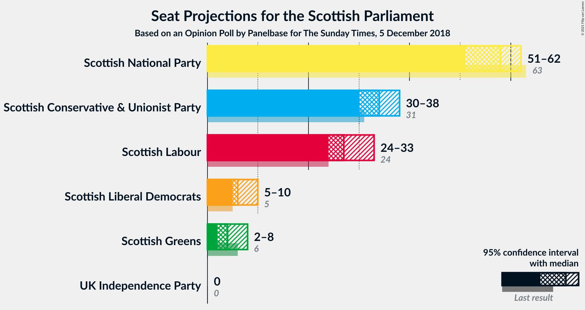
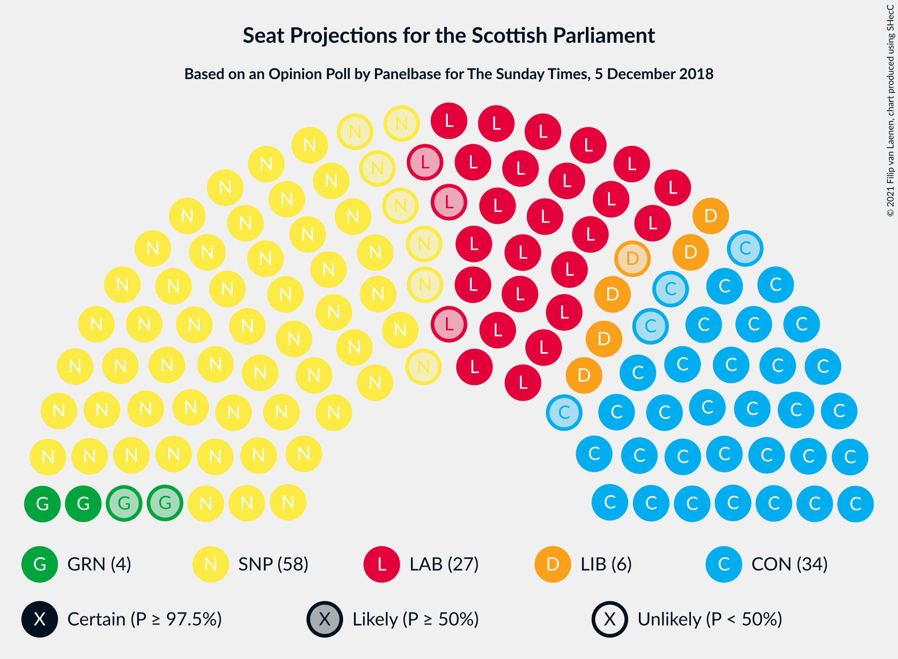
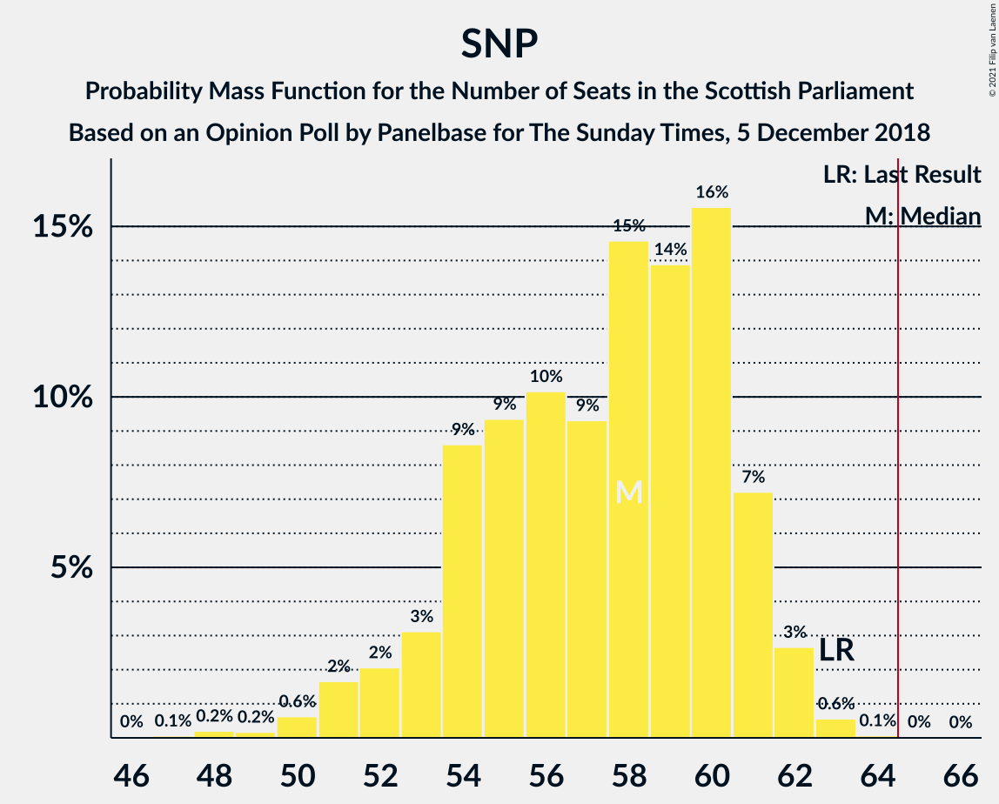
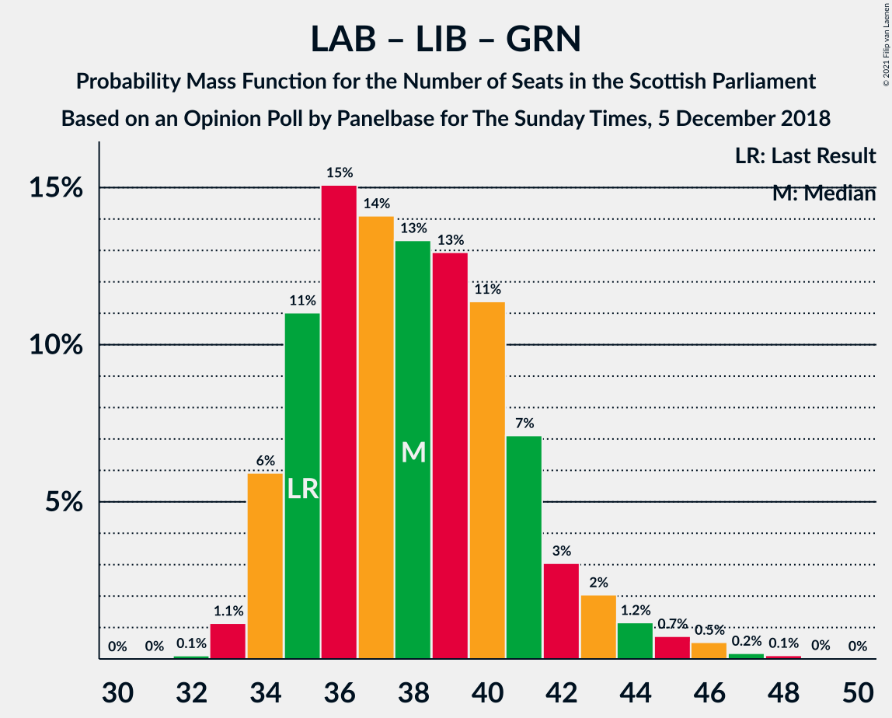

# Opinion Poll by Panelbase for The Sunday Times, 5 December 2018

<a href="#voting-intentions">Voting Intentions</a> | <a href="#seats">Seats</a> | <a href="#coalitions">Coalitions</a> | <a href="#technical-information">Technical Information</a>

## Voting Intentions

### Confidence Intervals

| Party | Last Result | Poll Result | 80% Confidence Interval | 90% Confidence Interval | 95% Confidence Interval | 99% Confidence Interval |
|:-----:|:-----------:|:-----------:|:-----------------------:|:-----------------------:|:-----------------------:|:-----------------------:|
| Scottish National Party | 41.7% | 37.9% | 36.0–39.9% |35.5–40.5% |35.0–41.0% |34.1–41.9% |
| Scottish Conservative & Unionist Party | 22.9% | 26.0% | 24.3–27.8% |23.8–28.3% |23.4–28.7% |22.6–29.6% |
| Scottish Labour | 19.1% | 22.0% | 20.4–23.7% |19.9–24.2% |19.6–24.6% |18.8–25.5% |
| Scottish Liberal Democrats | 5.2% | 7.0% | 6.1–8.1% |5.8–8.5% |5.6–8.7% |5.2–9.3% |
| Scottish Greens | 6.6% | 6.0% | 5.2–7.1% |4.9–7.4% |4.7–7.7% |4.3–8.2% |
| UK Independence Party | 2.0% | 1.0% | 0.7–1.5% |0.6–1.6% |0.5–1.8% |0.4–2.1% |

*Note:* The poll result column reflects the actual value used in the calculations. Published results may vary slightly, and in addition be rounded to fewer digits.

## Seats

### Confidence Intervals

| Party | Last Result | Median | 80% Confidence Interval | 90% Confidence Interval | 95% Confidence Interval | 99% Confidence Interval |
|:-----:|:-----------:|:------:|:-----------------------:|:-----------------------:|:-----------------------:|:-----------------------:|
| <a href="#scottish-national-party">Scottish National Party</a> | 63 | 57 | 54–60 |54–61 |53–62 |51–63 |
| <a href="#scottish-conservative-&-unionist-party">Scottish Conservative & Unionist Party</a> | 31 | 34 | 32–37 |30–37 |29–37 |28–39 |
| <a href="#scottish-labour">Scottish Labour</a> | 24 | 27 | 26–31 |25–32 |25–32 |23–34 |
| <a href="#scottish-liberal-democrats">Scottish Liberal Democrats</a> | 5 | 6 | 5–8 |5–9 |5–10 |4–10 |
| <a href="#scottish-greens">Scottish Greens</a> | 6 | 4 | 2–6 |2–8 |2–8 |2–10 |
| <a href="#uk-independence-party">UK Independence Party</a> | 0 | 0 | 0 |0 |0 |0 |

### Scottish National Party

*For a full overview of the results for this party, see the [Scottish National Party](party-scottishnationalparty.html) page.*

| Number of Seats | Probability | Accumulated | Special Marks |
|:---------------:|:-----------:|:-----------:|:-------------:|
| 49 | 0.1% | 100% |  |
| 50 | 0.2% | 99.9% |  |
| 51 | 1.1% | 99.8% |  |
| 52 | 0.8% | 98.7% |  |
| 53 | 3% | 98% |  |
| 54 | 12% | 95% |  |
| 55 | 9% | 83% |  |
| 56 | 19% | 74% |  |
| 57 | 14% | 54% | Median |
| 58 | 21% | 40% |  |
| 59 | 8% | 19% |  |
| 60 | 3% | 11% |  |
| 61 | 4% | 7% |  |
| 62 | 2% | 3% |  |
| 63 | 0.4% | 0.9% | Last Result |
| 64 | 0.2% | 0.4% |  |
| 65 | 0% | 0.2% | Majority |
| 66 | 0.1% | 0.2% |  |
| 67 | 0% | 0% |  |

### Scottish Conservative & Unionist Party

*For a full overview of the results for this party, see the [Scottish Conservative & Unionist Party](party-scottishconservativeunionistparty.html) page.*

| Number of Seats | Probability | Accumulated | Special Marks |
|:---------------:|:-----------:|:-----------:|:-------------:|
| 26 | 0.1% | 100% |  |
| 27 | 0.2% | 99.9% |  |
| 28 | 0.8% | 99.7% |  |
| 29 | 2% | 98.8% |  |
| 30 | 4% | 97% |  |
| 31 | 3% | 93% | Last Result |
| 32 | 11% | 90% |  |
| 33 | 14% | 79% |  |
| 34 | 37% | 65% | Median |
| 35 | 12% | 28% |  |
| 36 | 5% | 16% |  |
| 37 | 9% | 11% |  |
| 38 | 1.3% | 2% |  |
| 39 | 0.8% | 1.0% |  |
| 40 | 0.1% | 0.2% |  |
| 41 | 0.1% | 0.1% |  |
| 42 | 0% | 0% |  |

### Scottish Labour

*For a full overview of the results for this party, see the [Scottish Labour](party-scottishlabour.html) page.*

| Number of Seats | Probability | Accumulated | Special Marks |
|:---------------:|:-----------:|:-----------:|:-------------:|
| 22 | 0.1% | 100% |  |
| 23 | 0.6% | 99.9% |  |
| 24 | 1.1% | 99.3% | Last Result |
| 25 | 5% | 98% |  |
| 26 | 8% | 93% |  |
| 27 | 37% | 85% | Median |
| 28 | 16% | 48% |  |
| 29 | 9% | 32% |  |
| 30 | 10% | 23% |  |
| 31 | 7% | 12% |  |
| 32 | 3% | 6% |  |
| 33 | 2% | 2% |  |
| 34 | 0.7% | 0.8% |  |
| 35 | 0.1% | 0.1% |  |
| 36 | 0% | 0% |  |

### Scottish Liberal Democrats

*For a full overview of the results for this party, see the [Scottish Liberal Democrats](party-scottishliberaldemocrats.html) page.*

| Number of Seats | Probability | Accumulated | Special Marks |
|:---------------:|:-----------:|:-----------:|:-------------:|
| 3 | 0.1% | 100% |  |
| 4 | 0.6% | 99.9% |  |
| 5 | 34% | 99.4% | Last Result |
| 6 | 26% | 65% | Median |
| 7 | 5% | 39% |  |
| 8 | 27% | 34% |  |
| 9 | 2% | 7% |  |
| 10 | 4% | 5% |  |
| 11 | 0.4% | 0.4% |  |
| 12 | 0% | 0% |  |

### Scottish Greens

*For a full overview of the results for this party, see the [Scottish Greens](party-scottishgreens.html) page.*

| Number of Seats | Probability | Accumulated | Special Marks |
|:---------------:|:-----------:|:-----------:|:-------------:|
| 2 | 16% | 100% |  |
| 3 | 28% | 84% |  |
| 4 | 38% | 56% | Median |
| 5 | 7% | 19% |  |
| 6 | 2% | 11% | Last Result |
| 7 | 3% | 9% |  |
| 8 | 4% | 6% |  |
| 9 | 1.3% | 2% |  |
| 10 | 0.7% | 0.7% |  |
| 11 | 0% | 0% |  |

### UK Independence Party

*For a full overview of the results for this party, see the [UK Independence Party](party-ukindependenceparty.html) page.*

| Number of Seats | Probability | Accumulated | Special Marks |
|:---------------:|:-----------:|:-----------:|:-------------:|
| 0 | 100% | 100% | Last Result, Median |

## Coalitions

### Confidence Intervals

| Coalition | Last Result | Median | Majority? | 80% Confidence Interval | 90% Confidence Interval | 95% Confidence Interval | 99% Confidence Interval |
|:---------:|:-----------:|:------:|:---------:|:-----------------------:|:-----------------------:|:-----------------------:|:-----------------------:|
| Scottish Conservative & Unionist Party – Scottish Labour – Scottish Liberal Democrats | 60 | 69 | 93% | 65–71 | 64–72 | 63–73 | 60–75 |
| Scottish Conservative & Unionist Party – Scottish Labour | 55 | 62 | 15% | 59–65 | 58–65 | 57–66 | 55–69 |
| Scottish National Party – Scottish Greens | 69 | 60 | 7% | 58–64 | 57–65 | 56–66 | 54–69 |
| Scottish National Party | 63 | 57 | 0.2% | 54–60 | 54–61 | 53–62 | 51–63 |
| Scottish Conservative & Unionist Party – Scottish Liberal Democrats | 36 | 40 | 0% | 37–43 | 37–44 | 35–45 | 34–46 |
| Scottish Labour – Scottish Liberal Democrats – Scottish Greens | 35 | 39 | 0% | 35–41 | 35–41 | 34–43 | 34–46 |
| Scottish Labour – Scottish Liberal Democrats | 29 | 35 | 0% | 32–37 | 31–38 | 31–39 | 29–42 |

### Scottish Conservative & Unionist Party – Scottish Labour – Scottish Liberal Democrats

| Number of Seats | Probability | Accumulated | Special Marks |
|:---------------:|:-----------:|:-----------:|:-------------:|
| 57 | 0% | 100% |  |
| 58 | 0.1% | 99.9% |  |
| 59 | 0.1% | 99.9% |  |
| 60 | 0.3% | 99.8% | Last Result |
| 61 | 0.4% | 99.4% |  |
| 62 | 0.8% | 99.1% |  |
| 63 | 0.9% | 98% |  |
| 64 | 4% | 97% |  |
| 65 | 4% | 93% | Majority |
| 66 | 9% | 89% |  |
| 67 | 13% | 80% | Median |
| 68 | 18% | 68% |  |
| 69 | 25% | 50% |  |
| 70 | 7% | 25% |  |
| 71 | 12% | 18% |  |
| 72 | 3% | 6% |  |
| 73 | 1.1% | 3% |  |
| 74 | 0.5% | 2% |  |
| 75 | 0.9% | 1.0% |  |
| 76 | 0.1% | 0.2% |  |
| 77 | 0% | 0.1% |  |
| 78 | 0% | 0% |  |

### Scottish Conservative & Unionist Party – Scottish Labour

| Number of Seats | Probability | Accumulated | Special Marks |
|:---------------:|:-----------:|:-----------:|:-------------:|
| 52 | 0.1% | 100% |  |
| 53 | 0.1% | 99.9% |  |
| 54 | 0.2% | 99.8% |  |
| 55 | 0.3% | 99.6% | Last Result |
| 56 | 1.0% | 99.3% |  |
| 57 | 1.4% | 98% |  |
| 58 | 6% | 97% |  |
| 59 | 8% | 91% |  |
| 60 | 8% | 83% |  |
| 61 | 22% | 74% | Median |
| 62 | 12% | 52% |  |
| 63 | 16% | 40% |  |
| 64 | 9% | 24% |  |
| 65 | 12% | 15% | Majority |
| 66 | 1.3% | 3% |  |
| 67 | 0.4% | 1.5% |  |
| 68 | 0.3% | 1.1% |  |
| 69 | 0.6% | 0.8% |  |
| 70 | 0.1% | 0.1% |  |
| 71 | 0% | 0% |  |

### Scottish National Party – Scottish Greens

| Number of Seats | Probability | Accumulated | Special Marks |
|:---------------:|:-----------:|:-----------:|:-------------:|
| 52 | 0% | 100% |  |
| 53 | 0.1% | 99.9% |  |
| 54 | 0.9% | 99.8% |  |
| 55 | 0.5% | 99.0% |  |
| 56 | 1.1% | 98% |  |
| 57 | 3% | 97% |  |
| 58 | 12% | 94% |  |
| 59 | 7% | 82% |  |
| 60 | 25% | 75% |  |
| 61 | 18% | 50% | Median |
| 62 | 13% | 32% |  |
| 63 | 9% | 20% |  |
| 64 | 4% | 11% |  |
| 65 | 4% | 7% | Majority |
| 66 | 0.9% | 3% |  |
| 67 | 0.8% | 2% |  |
| 68 | 0.4% | 0.9% |  |
| 69 | 0.3% | 0.6% | Last Result |
| 70 | 0.1% | 0.2% |  |
| 71 | 0.1% | 0.1% |  |
| 72 | 0% | 0.1% |  |
| 73 | 0% | 0% |  |

### Scottish National Party

| Number of Seats | Probability | Accumulated | Special Marks |
|:---------------:|:-----------:|:-----------:|:-------------:|
| 49 | 0.1% | 100% |  |
| 50 | 0.2% | 99.9% |  |
| 51 | 1.1% | 99.8% |  |
| 52 | 0.8% | 98.7% |  |
| 53 | 3% | 98% |  |
| 54 | 12% | 95% |  |
| 55 | 9% | 83% |  |
| 56 | 19% | 74% |  |
| 57 | 14% | 54% | Median |
| 58 | 21% | 40% |  |
| 59 | 8% | 19% |  |
| 60 | 3% | 11% |  |
| 61 | 4% | 7% |  |
| 62 | 2% | 3% |  |
| 63 | 0.4% | 0.9% | Last Result |
| 64 | 0.2% | 0.4% |  |
| 65 | 0% | 0.2% | Majority |
| 66 | 0.1% | 0.2% |  |
| 67 | 0% | 0% |  |

### Scottish Conservative & Unionist Party – Scottish Liberal Democrats

| Number of Seats | Probability | Accumulated | Special Marks |
|:---------------:|:-----------:|:-----------:|:-------------:|
| 31 | 0.1% | 100% |  |
| 32 | 0.1% | 99.9% |  |
| 33 | 0.1% | 99.8% |  |
| 34 | 0.6% | 99.7% |  |
| 35 | 2% | 99.0% |  |
| 36 | 2% | 97% | Last Result |
| 37 | 8% | 95% |  |
| 38 | 8% | 87% |  |
| 39 | 15% | 79% |  |
| 40 | 15% | 64% | Median |
| 41 | 13% | 49% |  |
| 42 | 24% | 36% |  |
| 43 | 6% | 12% |  |
| 44 | 3% | 6% |  |
| 45 | 2% | 3% |  |
| 46 | 0.5% | 0.7% |  |
| 47 | 0.2% | 0.2% |  |
| 48 | 0% | 0% |  |

### Scottish Labour – Scottish Liberal Democrats – Scottish Greens

| Number of Seats | Probability | Accumulated | Special Marks |
|:---------------:|:-----------:|:-----------:|:-------------:|
| 31 | 0.1% | 100% |  |
| 32 | 0.2% | 99.9% |  |
| 33 | 0.2% | 99.7% |  |
| 34 | 3% | 99.6% |  |
| 35 | 8% | 97% | Last Result |
| 36 | 8% | 89% |  |
| 37 | 20% | 82% | Median |
| 38 | 10% | 62% |  |
| 39 | 22% | 52% |  |
| 40 | 15% | 30% |  |
| 41 | 10% | 15% |  |
| 42 | 2% | 5% |  |
| 43 | 1.2% | 3% |  |
| 44 | 0.7% | 2% |  |
| 45 | 0.2% | 0.8% |  |
| 46 | 0.4% | 0.6% |  |
| 47 | 0.1% | 0.2% |  |
| 48 | 0% | 0% |  |

### Scottish Labour – Scottish Liberal Democrats

| Number of Seats | Probability | Accumulated | Special Marks |
|:---------------:|:-----------:|:-----------:|:-------------:|
| 27 | 0.1% | 100% |  |
| 28 | 0.1% | 99.9% |  |
| 29 | 0.4% | 99.8% | Last Result |
| 30 | 2% | 99.3% |  |
| 31 | 5% | 98% |  |
| 32 | 12% | 93% |  |
| 33 | 16% | 81% | Median |
| 34 | 10% | 65% |  |
| 35 | 25% | 55% |  |
| 36 | 12% | 30% |  |
| 37 | 13% | 18% |  |
| 38 | 2% | 5% |  |
| 39 | 1.1% | 3% |  |
| 40 | 0.7% | 1.4% |  |
| 41 | 0.2% | 0.7% |  |
| 42 | 0.4% | 0.5% |  |
| 43 | 0% | 0.1% |  |
| 44 | 0% | 0% |  |

## Technical Information

### Opinion Poll

+ **Polling firm:** Panelbase
+ **Commissioner(s):** The Sunday Times
+ **Fieldwork period:** 5 December 2018

### Calculations

+ **Sample size:** 1028
+ **Simulations done:** 131,072
+ **Error estimate:** 0.87%

