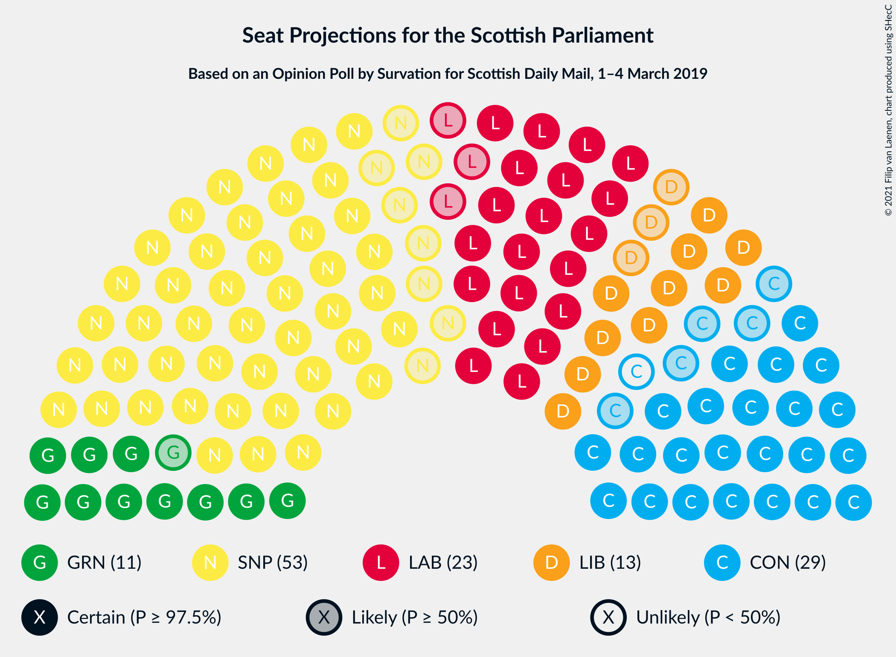
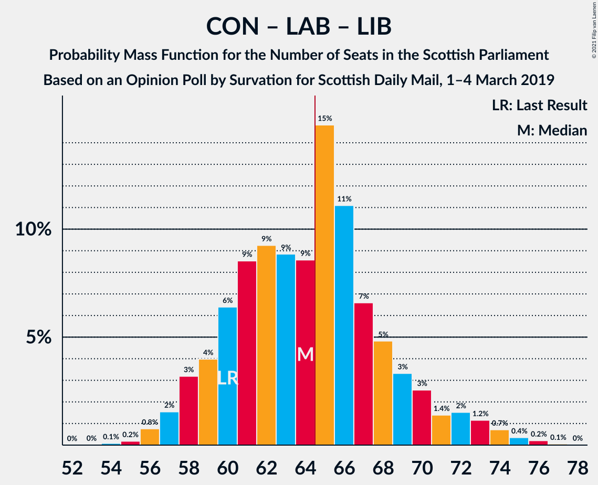

# Opinion Poll by Survation for Scottish Daily Mail, 1–4 March 2019

<a href="#voting-intentions">Voting Intentions</a> | <a href="#seats">Seats</a> | <a href="#coalitions">Coalitions</a> | <a href="#technical-information">Technical Information</a>

## Voting Intentions

### Confidence Intervals

| Party | Last Result | Poll Result | 80% Confidence Interval | 90% Confidence Interval | 95% Confidence Interval | 99% Confidence Interval |
|:-----:|:-----------:|:-----------:|:-----------------------:|:-----------------------:|:-----------------------:|:-----------------------:|
| Scottish National Party | 41.7% | 32.3% | 30.5–34.3% |30.0–34.8% |29.5–35.3% |28.7–36.2% |
| Scottish Conservative & Unionist Party | 22.9% | 22.3% | 20.6–24.0% |20.2–24.5% |19.8–24.9% |19.0–25.8% |
| Scottish Labour | 19.1% | 19.2% | 17.7–20.9% |17.2–21.3% |16.9–21.7% |16.2–22.6% |
| Scottish Greens | 6.6% | 11.1% | 9.9–12.5% |9.6–12.8% |9.3–13.2% |8.7–13.9% |
| Scottish Liberal Democrats | 5.2% | 11.1% | 9.9–12.5% |9.6–12.8% |9.3–13.2% |8.7–13.9% |
| UK Independence Party | 2.0% | 3.1% | 2.5–3.9% |2.3–4.1% |2.2–4.3% |1.9–4.8% |

*Note:* The poll result column reflects the actual value used in the calculations. Published results may vary slightly, and in addition be rounded to fewer digits.

## Seats

### Confidence Intervals

| Party | Last Result | Median | 80% Confidence Interval | 90% Confidence Interval | 95% Confidence Interval | 99% Confidence Interval |
|:-----:|:-----------:|:------:|:-----------------------:|:-----------------------:|:-----------------------:|:-----------------------:|
| <a href="#scottish-national-party">Scottish National Party</a> | 63 | 58 | 53–61 |52–62 |52–62 |51–63 |
| <a href="#scottish-conservative-&-unionist-party">Scottish Conservative & Unionist Party</a> | 31 | 27 | 24–30 |23–31 |22–31 |22–33 |
| <a href="#scottish-labour">Scottish Labour</a> | 24 | 23 | 21–24 |20–25 |19–26 |18–27 |
| <a href="#scottish-greens">Scottish Greens</a> | 6 | 11 | 10–13 |10–14 |10–14 |10–15 |
| <a href="#scottish-liberal-democrats">Scottish Liberal Democrats</a> | 5 | 12 | 10–13 |9–14 |9–14 |8–15 |
| <a href="#uk-independence-party">UK Independence Party</a> | 0 | 0 | 0 |0 |0 |0 |

### Scottish National Party

*For a full overview of the results for this party, see the [Scottish National Party](party-scottishnationalparty.html) page.*

| Number of Seats | Probability | Accumulated | Special Marks |
|:---------------:|:-----------:|:-----------:|:-------------:|
| 48 | 0% | 100% |  |
| 49 | 0.1% | 99.9% |  |
| 50 | 0.2% | 99.8% |  |
| 51 | 2% | 99.6% |  |
| 52 | 6% | 98% |  |
| 53 | 13% | 92% |  |
| 54 | 3% | 79% |  |
| 55 | 8% | 76% |  |
| 56 | 2% | 69% |  |
| 57 | 5% | 67% |  |
| 58 | 25% | 62% | Median |
| 59 | 11% | 37% |  |
| 60 | 13% | 26% |  |
| 61 | 6% | 12% |  |
| 62 | 5% | 6% |  |
| 63 | 0.9% | 1.1% | Last Result |
| 64 | 0.1% | 0.2% |  |
| 65 | 0% | 0.1% | Majority |
| 66 | 0% | 0% |  |

### Scottish Conservative & Unionist Party

*For a full overview of the results for this party, see the [Scottish Conservative & Unionist Party](party-scottishconservativeunionistparty.html) page.*

| Number of Seats | Probability | Accumulated | Special Marks |
|:---------------:|:-----------:|:-----------:|:-------------:|
| 20 | 0% | 100% |  |
| 21 | 0.4% | 99.9% |  |
| 22 | 3% | 99.5% |  |
| 23 | 6% | 97% |  |
| 24 | 13% | 91% |  |
| 25 | 12% | 77% |  |
| 26 | 11% | 65% |  |
| 27 | 25% | 54% | Median |
| 28 | 7% | 29% |  |
| 29 | 11% | 22% |  |
| 30 | 6% | 11% |  |
| 31 | 3% | 5% | Last Result |
| 32 | 1.1% | 2% |  |
| 33 | 0.5% | 0.8% |  |
| 34 | 0.2% | 0.2% |  |
| 35 | 0% | 0% |  |

### Scottish Labour

*For a full overview of the results for this party, see the [Scottish Labour](party-scottishlabour.html) page.*

| Number of Seats | Probability | Accumulated | Special Marks |
|:---------------:|:-----------:|:-----------:|:-------------:|
| 17 | 0.4% | 100% |  |
| 18 | 0.4% | 99.6% |  |
| 19 | 3% | 99.2% |  |
| 20 | 5% | 96% |  |
| 21 | 16% | 91% |  |
| 22 | 22% | 76% |  |
| 23 | 27% | 54% | Median |
| 24 | 17% | 27% | Last Result |
| 25 | 6% | 10% |  |
| 26 | 3% | 4% |  |
| 27 | 0.4% | 0.8% |  |
| 28 | 0.2% | 0.3% |  |
| 29 | 0.1% | 0.1% |  |
| 30 | 0% | 0% |  |

### Scottish Greens

*For a full overview of the results for this party, see the [Scottish Greens](party-scottishgreens.html) page.*

| Number of Seats | Probability | Accumulated | Special Marks |
|:---------------:|:-----------:|:-----------:|:-------------:|
| 6 | 0% | 100% | Last Result |
| 7 | 0% | 100% |  |
| 8 | 0% | 100% |  |
| 9 | 0.4% | 100% |  |
| 10 | 38% | 99.6% |  |
| 11 | 25% | 62% | Median |
| 12 | 22% | 36% |  |
| 13 | 10% | 15% |  |
| 14 | 4% | 5% |  |
| 15 | 0.5% | 0.6% |  |
| 16 | 0.1% | 0.1% |  |
| 17 | 0% | 0% |  |

### Scottish Liberal Democrats

*For a full overview of the results for this party, see the [Scottish Liberal Democrats](party-scottishliberaldemocrats.html) page.*

| Number of Seats | Probability | Accumulated | Special Marks |
|:---------------:|:-----------:|:-----------:|:-------------:|
| 5 | 0% | 100% | Last Result |
| 6 | 0% | 100% |  |
| 7 | 0% | 100% |  |
| 8 | 0.7% | 100% |  |
| 9 | 7% | 99.3% |  |
| 10 | 15% | 93% |  |
| 11 | 27% | 78% |  |
| 12 | 31% | 51% | Median |
| 13 | 14% | 19% |  |
| 14 | 4% | 6% |  |
| 15 | 0.8% | 1.3% |  |
| 16 | 0.4% | 0.5% |  |
| 17 | 0.1% | 0.1% |  |
| 18 | 0% | 0% |  |

### UK Independence Party

*For a full overview of the results for this party, see the [UK Independence Party](party-ukindependenceparty.html) page.*

| Number of Seats | Probability | Accumulated | Special Marks |
|:---------------:|:-----------:|:-----------:|:-------------:|
| 0 | 99.7% | 100% | Last Result, Median |
| 1 | 0.1% | 0.3% |  |
| 2 | 0.1% | 0.2% |  |
| 3 | 0% | 0% |  |

## Coalitions

### Confidence Intervals

| Coalition | Last Result | Median | Majority? | 80% Confidence Interval | 90% Confidence Interval | 95% Confidence Interval | 99% Confidence Interval |
|:---------:|:-----------:|:------:|:---------:|:-----------------------:|:-----------------------:|:-----------------------:|:-----------------------:|
| Scottish National Party – Scottish Greens | 69 | 69 | 87% | 64–72 | 63–73 | 63–73 | 61–75 |
| Scottish Conservative & Unionist Party – Scottish Labour – Scottish Liberal Democrats | 60 | 60 | 13% | 57–65 | 56–66 | 56–66 | 54–68 |
| Scottish National Party | 63 | 58 | 0.1% | 53–61 | 52–62 | 52–62 | 51–63 |
| Scottish Conservative & Unionist Party – Scottish Labour | 55 | 49 | 0% | 46–53 | 45–54 | 45–54 | 43–55 |
| Scottish Labour – Scottish Greens – Scottish Liberal Democrats | 35 | 45 | 0% | 43–48 | 42–48 | 42–49 | 41–51 |
| Scottish Conservative & Unionist Party – Scottish Liberal Democrats | 36 | 38 | 0% | 34–41 | 33–43 | 33–43 | 33–45 |
| Scottish Labour – Scottish Liberal Democrats | 29 | 34 | 0% | 32–37 | 31–37 | 30–38 | 29–39 |

### Scottish National Party – Scottish Greens

| Number of Seats | Probability | Accumulated | Special Marks |
|:---------------:|:-----------:|:-----------:|:-------------:|
| 59 | 0.1% | 100% |  |
| 60 | 0.2% | 99.9% |  |
| 61 | 0.4% | 99.8% |  |
| 62 | 1.5% | 99.3% |  |
| 63 | 4% | 98% |  |
| 64 | 6% | 93% |  |
| 65 | 8% | 87% | Majority |
| 66 | 8% | 79% |  |
| 67 | 6% | 72% |  |
| 68 | 14% | 65% |  |
| 69 | 11% | 51% | Last Result, Median |
| 70 | 10% | 40% |  |
| 71 | 13% | 30% |  |
| 72 | 9% | 16% |  |
| 73 | 6% | 8% |  |
| 74 | 1.4% | 2% |  |
| 75 | 0.7% | 0.8% |  |
| 76 | 0.1% | 0.1% |  |
| 77 | 0% | 0% |  |

### Scottish Conservative & Unionist Party – Scottish Labour – Scottish Liberal Democrats

| Number of Seats | Probability | Accumulated | Special Marks |
|:---------------:|:-----------:|:-----------:|:-------------:|
| 53 | 0.1% | 100% |  |
| 54 | 0.7% | 99.9% |  |
| 55 | 1.4% | 99.2% |  |
| 56 | 6% | 98% |  |
| 57 | 9% | 92% |  |
| 58 | 13% | 84% |  |
| 59 | 10% | 70% |  |
| 60 | 11% | 60% | Last Result |
| 61 | 14% | 49% |  |
| 62 | 6% | 34% | Median |
| 63 | 8% | 28% |  |
| 64 | 8% | 21% |  |
| 65 | 6% | 13% | Majority |
| 66 | 4% | 7% |  |
| 67 | 1.5% | 2% |  |
| 68 | 0.4% | 0.7% |  |
| 69 | 0.2% | 0.2% |  |
| 70 | 0.1% | 0.1% |  |
| 71 | 0% | 0% |  |

### Scottish National Party

| Number of Seats | Probability | Accumulated | Special Marks |
|:---------------:|:-----------:|:-----------:|:-------------:|
| 48 | 0% | 100% |  |
| 49 | 0.1% | 99.9% |  |
| 50 | 0.2% | 99.8% |  |
| 51 | 2% | 99.6% |  |
| 52 | 6% | 98% |  |
| 53 | 13% | 92% |  |
| 54 | 3% | 79% |  |
| 55 | 8% | 76% |  |
| 56 | 2% | 69% |  |
| 57 | 5% | 67% |  |
| 58 | 25% | 62% | Median |
| 59 | 11% | 37% |  |
| 60 | 13% | 26% |  |
| 61 | 6% | 12% |  |
| 62 | 5% | 6% |  |
| 63 | 0.9% | 1.1% | Last Result |
| 64 | 0.1% | 0.2% |  |
| 65 | 0% | 0.1% | Majority |
| 66 | 0% | 0% |  |

### Scottish Conservative & Unionist Party – Scottish Labour

| Number of Seats | Probability | Accumulated | Special Marks |
|:---------------:|:-----------:|:-----------:|:-------------:|
| 41 | 0% | 100% |  |
| 42 | 0.3% | 99.9% |  |
| 43 | 0.7% | 99.7% |  |
| 44 | 1.5% | 99.0% |  |
| 45 | 7% | 98% |  |
| 46 | 8% | 91% |  |
| 47 | 14% | 83% |  |
| 48 | 13% | 69% |  |
| 49 | 15% | 56% |  |
| 50 | 13% | 41% | Median |
| 51 | 5% | 28% |  |
| 52 | 10% | 24% |  |
| 53 | 7% | 13% |  |
| 54 | 5% | 7% |  |
| 55 | 1.4% | 2% | Last Result |
| 56 | 0.3% | 0.4% |  |
| 57 | 0.1% | 0.1% |  |
| 58 | 0% | 0.1% |  |
| 59 | 0% | 0% |  |

### Scottish Labour – Scottish Greens – Scottish Liberal Democrats

| Number of Seats | Probability | Accumulated | Special Marks |
|:---------------:|:-----------:|:-----------:|:-------------:|
| 35 | 0% | 100% | Last Result |
| 36 | 0% | 100% |  |
| 37 | 0% | 100% |  |
| 38 | 0% | 100% |  |
| 39 | 0.1% | 100% |  |
| 40 | 0.3% | 99.8% |  |
| 41 | 2% | 99.5% |  |
| 42 | 5% | 98% |  |
| 43 | 10% | 93% |  |
| 44 | 26% | 83% |  |
| 45 | 15% | 58% |  |
| 46 | 11% | 42% | Median |
| 47 | 20% | 31% |  |
| 48 | 6% | 11% |  |
| 49 | 3% | 5% |  |
| 50 | 0.7% | 1.4% |  |
| 51 | 0.5% | 0.7% |  |
| 52 | 0.1% | 0.2% |  |
| 53 | 0.1% | 0.1% |  |
| 54 | 0% | 0% |  |

### Scottish Conservative & Unionist Party – Scottish Liberal Democrats

| Number of Seats | Probability | Accumulated | Special Marks |
|:---------------:|:-----------:|:-----------:|:-------------:|
| 31 | 0.1% | 100% |  |
| 32 | 0.4% | 99.9% |  |
| 33 | 5% | 99.6% |  |
| 34 | 6% | 95% |  |
| 35 | 9% | 89% |  |
| 36 | 15% | 80% | Last Result |
| 37 | 11% | 65% |  |
| 38 | 8% | 54% |  |
| 39 | 17% | 46% | Median |
| 40 | 9% | 30% |  |
| 41 | 12% | 21% |  |
| 42 | 4% | 9% |  |
| 43 | 3% | 6% |  |
| 44 | 1.3% | 2% |  |
| 45 | 0.9% | 1.1% |  |
| 46 | 0.1% | 0.2% |  |
| 47 | 0.1% | 0.1% |  |
| 48 | 0% | 0% |  |

### Scottish Labour – Scottish Liberal Democrats

| Number of Seats | Probability | Accumulated | Special Marks |
|:---------------:|:-----------:|:-----------:|:-------------:|
| 27 | 0.1% | 100% |  |
| 28 | 0.1% | 99.9% |  |
| 29 | 1.2% | 99.8% | Last Result |
| 30 | 1.5% | 98.5% |  |
| 31 | 4% | 97% |  |
| 32 | 16% | 93% |  |
| 33 | 16% | 77% |  |
| 34 | 24% | 61% |  |
| 35 | 13% | 37% | Median |
| 36 | 11% | 24% |  |
| 37 | 9% | 13% |  |
| 38 | 3% | 4% |  |
| 39 | 0.4% | 0.8% |  |
| 40 | 0.2% | 0.4% |  |
| 41 | 0.1% | 0.2% |  |
| 42 | 0.1% | 0.1% |  |
| 43 | 0% | 0% |  |

## Technical Information

### Opinion Poll

+ **Polling firm:** Survation
+ **Commissioner(s):** Scottish Daily Mail
+ **Fieldwork period:** 1–4 March 2019

### Calculations

+ **Sample size:** 1011
+ **Simulations done:** 131,072
+ **Error estimate:** 1.10%

