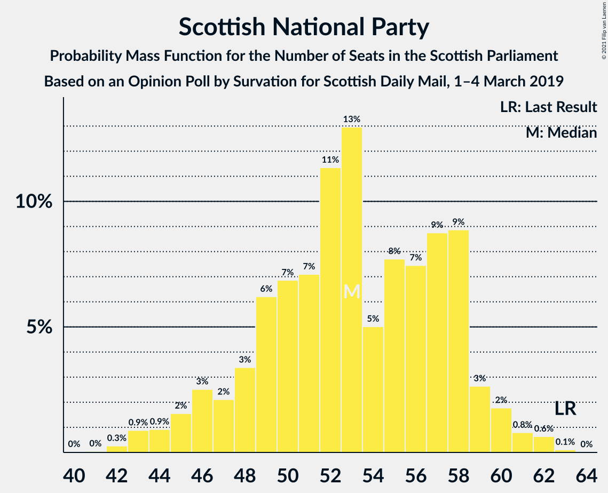
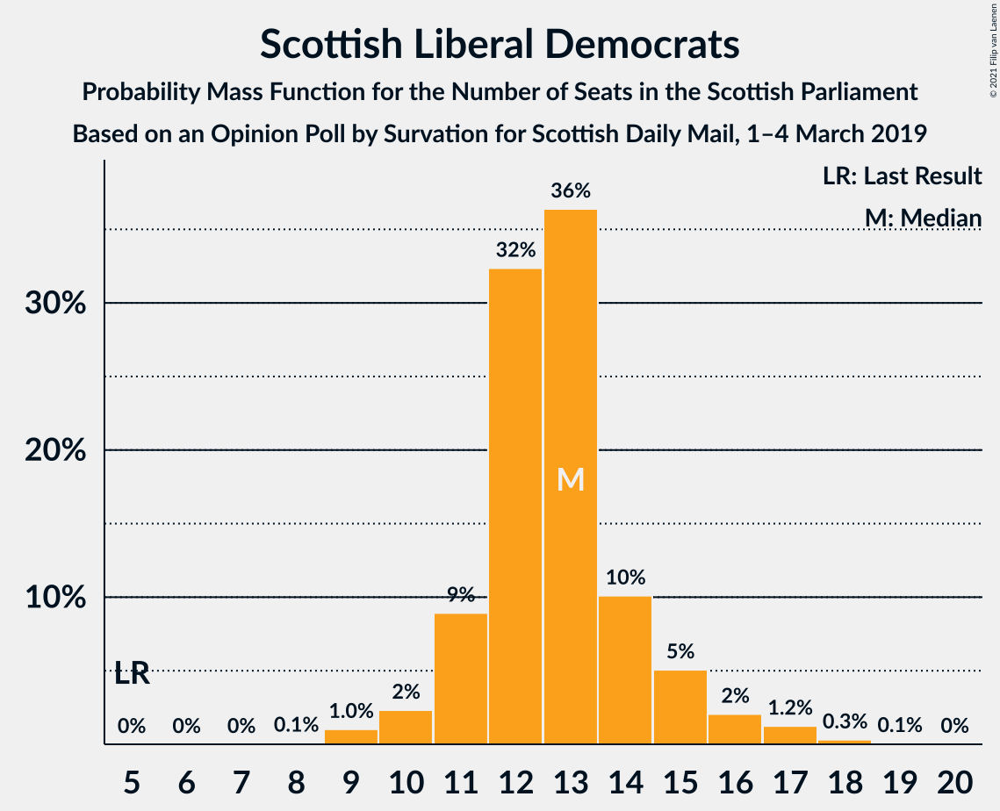
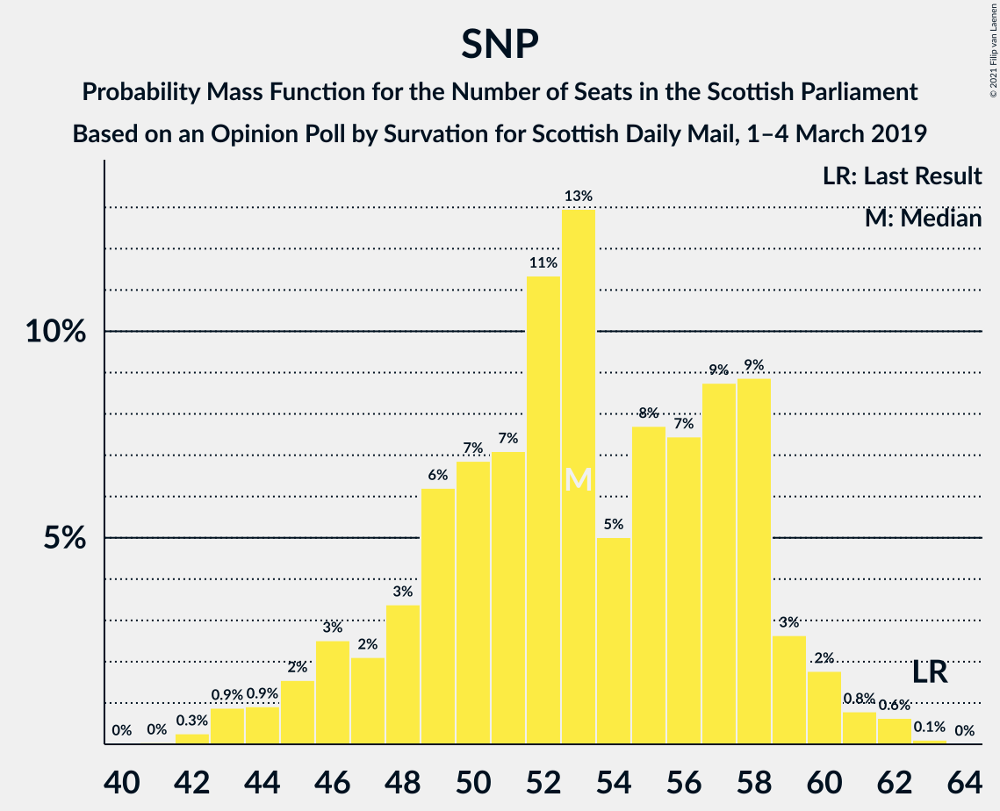

# Opinion Poll by Survation for Scottish Daily Mail, 1–4 March 2019

<a href="#voting-intentions">Voting Intentions</a> | <a href="#seats">Seats</a> | <a href="#coalitions">Coalitions</a> | <a href="#technical-information">Technical Information</a>

## Voting Intentions

### Confidence Intervals

| Party | Last Result | Poll Result | 80% Confidence Interval | 90% Confidence Interval | 95% Confidence Interval | 99% Confidence Interval |
|:-----:|:-----------:|:-----------:|:-----------------------:|:-----------------------:|:-----------------------:|:-----------------------:|
| Scottish National Party | 41.7% | 32.3% | 30.5–34.3% |30.0–34.8% |29.5–35.3% |28.7–36.2% |
| Scottish Conservative & Unionist Party | 22.9% | 22.3% | 20.6–24.0% |20.2–24.5% |19.8–24.9% |19.0–25.8% |
| Scottish Labour | 19.1% | 19.2% | 17.7–20.9% |17.2–21.3% |16.9–21.7% |16.2–22.6% |
| Scottish Greens | 6.6% | 11.1% | 9.9–12.5% |9.6–12.8% |9.3–13.2% |8.7–13.9% |
| Scottish Liberal Democrats | 5.2% | 11.1% | 9.9–12.5% |9.6–12.8% |9.3–13.2% |8.7–13.9% |
| UK Independence Party | 2.0% | 3.1% | 2.5–3.9% |2.3–4.1% |2.2–4.3% |1.9–4.8% |

*Note:* The poll result column reflects the actual value used in the calculations. Published results may vary slightly, and in addition be rounded to fewer digits.

## Seats

### Confidence Intervals

| Party | Last Result | Median | 80% Confidence Interval | 90% Confidence Interval | 95% Confidence Interval | 99% Confidence Interval |
|:-----:|:-----------:|:------:|:-----------------------:|:-----------------------:|:-----------------------:|:-----------------------:|
| <a href="#scottish-national-party">Scottish National Party</a> | 63 | 53 | 48–58 |46–59 |45–60 |43–62 |
| <a href="#scottish-conservative-&-unionist-party">Scottish Conservative & Unionist Party</a> | 31 | 28 | 24–31 |24–32 |23–33 |22–34 |
| <a href="#scottish-labour">Scottish Labour</a> | 24 | 23 | 21–26 |21–28 |20–29 |18–31 |
| <a href="#scottish-greens">Scottish Greens</a> | 6 | 11 | 10–14 |10–14 |10–15 |10–16 |
| <a href="#scottish-liberal-democrats">Scottish Liberal Democrats</a> | 5 | 13 | 11–14 |11–15 |10–16 |9–17 |
| <a href="#uk-independence-party">UK Independence Party</a> | 0 | 0 | 0 |0 |0 |0–1 |

### Scottish National Party

*For a full overview of the results for this party, see the [Scottish National Party](party-scottishnationalparty.html) page.*

| Number of Seats | Probability | Accumulated | Special Marks |
|:---------------:|:-----------:|:-----------:|:-------------:|
| 41 | 0% | 100% |  |
| 42 | 0.3% | 99.9% |  |
| 43 | 0.9% | 99.6% |  |
| 44 | 0.9% | 98.8% |  |
| 45 | 2% | 98% |  |
| 46 | 3% | 96% |  |
| 47 | 2% | 94% |  |
| 48 | 3% | 92% |  |
| 49 | 6% | 88% |  |
| 50 | 7% | 82% |  |
| 51 | 7% | 75% |  |
| 52 | 11% | 68% |  |
| 53 | 13% | 57% | Median |
| 54 | 5% | 44% |  |
| 55 | 8% | 39% |  |
| 56 | 7% | 31% |  |
| 57 | 9% | 24% |  |
| 58 | 9% | 15% |  |
| 59 | 3% | 6% |  |
| 60 | 2% | 3% |  |
| 61 | 0.8% | 2% |  |
| 62 | 0.6% | 0.8% |  |
| 63 | 0.1% | 0.1% | Last Result |
| 64 | 0% | 0% |  |

### Scottish Conservative & Unionist Party

*For a full overview of the results for this party, see the [Scottish Conservative & Unionist Party](party-scottishconservativeunionistparty.html) page.*

| Number of Seats | Probability | Accumulated | Special Marks |
|:---------------:|:-----------:|:-----------:|:-------------:|
| 21 | 0.1% | 100% |  |
| 22 | 0.6% | 99.9% |  |
| 23 | 3% | 99.3% |  |
| 24 | 8% | 97% |  |
| 25 | 8% | 89% |  |
| 26 | 11% | 81% |  |
| 27 | 12% | 69% |  |
| 28 | 12% | 57% | Median |
| 29 | 18% | 44% |  |
| 30 | 13% | 26% |  |
| 31 | 6% | 13% | Last Result |
| 32 | 5% | 7% |  |
| 33 | 2% | 3% |  |
| 34 | 0.6% | 0.7% |  |
| 35 | 0.1% | 0.1% |  |
| 36 | 0% | 0% |  |

### Scottish Labour

*For a full overview of the results for this party, see the [Scottish Labour](party-scottishlabour.html) page.*

| Number of Seats | Probability | Accumulated | Special Marks |
|:---------------:|:-----------:|:-----------:|:-------------:|
| 17 | 0.1% | 100% |  |
| 18 | 0.4% | 99.8% |  |
| 19 | 0.8% | 99.5% |  |
| 20 | 3% | 98.6% |  |
| 21 | 9% | 96% |  |
| 22 | 9% | 88% |  |
| 23 | 29% | 78% | Median |
| 24 | 30% | 50% | Last Result |
| 25 | 7% | 19% |  |
| 26 | 5% | 12% |  |
| 27 | 2% | 8% |  |
| 28 | 2% | 5% |  |
| 29 | 1.1% | 3% |  |
| 30 | 1.0% | 2% |  |
| 31 | 0.5% | 0.9% |  |
| 32 | 0.3% | 0.4% |  |
| 33 | 0.1% | 0.1% |  |
| 34 | 0% | 0% |  |

### Scottish Greens

*For a full overview of the results for this party, see the [Scottish Greens](party-scottishgreens.html) page.*

| Number of Seats | Probability | Accumulated | Special Marks |
|:---------------:|:-----------:|:-----------:|:-------------:|
| 6 | 0% | 100% | Last Result |
| 7 | 0% | 100% |  |
| 8 | 0% | 100% |  |
| 9 | 0.1% | 100% |  |
| 10 | 31% | 99.9% |  |
| 11 | 22% | 69% | Median |
| 12 | 17% | 47% |  |
| 13 | 11% | 30% |  |
| 14 | 16% | 19% |  |
| 15 | 3% | 3% |  |
| 16 | 0.6% | 0.7% |  |
| 17 | 0.1% | 0.1% |  |
| 18 | 0% | 0% |  |

### Scottish Liberal Democrats

*For a full overview of the results for this party, see the [Scottish Liberal Democrats](party-scottishliberaldemocrats.html) page.*

| Number of Seats | Probability | Accumulated | Special Marks |
|:---------------:|:-----------:|:-----------:|:-------------:|
| 5 | 0% | 100% | Last Result |
| 6 | 0% | 100% |  |
| 7 | 0% | 100% |  |
| 8 | 0.1% | 100% |  |
| 9 | 1.0% | 99.9% |  |
| 10 | 2% | 98.9% |  |
| 11 | 9% | 97% |  |
| 12 | 32% | 88% |  |
| 13 | 36% | 55% | Median |
| 14 | 10% | 19% |  |
| 15 | 5% | 9% |  |
| 16 | 2% | 4% |  |
| 17 | 1.2% | 2% |  |
| 18 | 0.3% | 0.4% |  |
| 19 | 0.1% | 0.1% |  |
| 20 | 0% | 0% |  |

### UK Independence Party

*For a full overview of the results for this party, see the [UK Independence Party](party-ukindependenceparty.html) page.*

| Number of Seats | Probability | Accumulated | Special Marks |
|:---------------:|:-----------:|:-----------:|:-------------:|
| 0 | 99.4% | 100% | Last Result, Median |
| 1 | 0.3% | 0.6% |  |
| 2 | 0.2% | 0.3% |  |
| 3 | 0.1% | 0.1% |  |
| 4 | 0% | 0% |  |

## Coalitions

### Confidence Intervals

| Coalition | Last Result | Median | Majority? | 80% Confidence Interval | 90% Confidence Interval | 95% Confidence Interval | 99% Confidence Interval |
|:---------:|:-----------:|:------:|:---------:|:-----------------------:|:-----------------------:|:-----------------------:|:-----------------------:|
| Scottish Conservative & Unionist Party – Scottish Labour – Scottish Liberal Democrats | 60 | 64 | 49% | 60–69 | 58–71 | 57–73 | 56–75 |
| Scottish National Party – Scottish Greens | 69 | 65 | 51% | 60–69 | 58–71 | 56–72 | 54–73 |
| Scottish National Party | 63 | 53 | 0% | 48–58 | 46–59 | 45–60 | 43–62 |
| Scottish Conservative & Unionist Party – Scottish Labour | 55 | 51 | 0% | 47–56 | 47–57 | 46–59 | 44–61 |
| Scottish Labour – Scottish Greens – Scottish Liberal Democrats | 35 | 48 | 0% | 45–52 | 44–53 | 43–54 | 42–57 |
| Scottish Conservative & Unionist Party – Scottish Liberal Democrats | 36 | 41 | 0% | 36–44 | 36–46 | 35–46 | 33–48 |
| Scottish Labour – Scottish Liberal Democrats | 29 | 36 | 0% | 33–39 | 33–41 | 32–43 | 30–45 |

### Scottish Conservative & Unionist Party – Scottish Labour – Scottish Liberal Democrats

| Number of Seats | Probability | Accumulated | Special Marks |
|:---------------:|:-----------:|:-----------:|:-------------:|
| 54 | 0.1% | 100% |  |
| 55 | 0.2% | 99.9% |  |
| 56 | 0.8% | 99.7% |  |
| 57 | 2% | 99.0% |  |
| 58 | 3% | 97% |  |
| 59 | 4% | 94% |  |
| 60 | 6% | 90% | Last Result |
| 61 | 9% | 84% |  |
| 62 | 9% | 75% |  |
| 63 | 9% | 66% |  |
| 64 | 9% | 57% | Median |
| 65 | 15% | 49% | Majority |
| 66 | 11% | 34% |  |
| 67 | 7% | 23% |  |
| 68 | 5% | 16% |  |
| 69 | 3% | 11% |  |
| 70 | 3% | 8% |  |
| 71 | 1.4% | 5% |  |
| 72 | 2% | 4% |  |
| 73 | 1.2% | 3% |  |
| 74 | 0.7% | 1.4% |  |
| 75 | 0.4% | 0.6% |  |
| 76 | 0.2% | 0.3% |  |
| 77 | 0.1% | 0.1% |  |
| 78 | 0% | 0% |  |

### Scottish National Party – Scottish Greens

| Number of Seats | Probability | Accumulated | Special Marks |
|:---------------:|:-----------:|:-----------:|:-------------:|
| 52 | 0.1% | 100% |  |
| 53 | 0.2% | 99.9% |  |
| 54 | 0.4% | 99.7% |  |
| 55 | 0.7% | 99.4% |  |
| 56 | 1.2% | 98.6% |  |
| 57 | 2% | 97% |  |
| 58 | 1.4% | 96% |  |
| 59 | 3% | 95% |  |
| 60 | 3% | 92% |  |
| 61 | 5% | 89% |  |
| 62 | 7% | 84% |  |
| 63 | 11% | 77% |  |
| 64 | 15% | 66% | Median |
| 65 | 9% | 51% | Majority |
| 66 | 9% | 43% |  |
| 67 | 9% | 34% |  |
| 68 | 9% | 25% |  |
| 69 | 6% | 16% | Last Result |
| 70 | 4% | 10% |  |
| 71 | 3% | 6% |  |
| 72 | 2% | 3% |  |
| 73 | 0.8% | 1.0% |  |
| 74 | 0.2% | 0.3% |  |
| 75 | 0.1% | 0.1% |  |
| 76 | 0% | 0% |  |

### Scottish National Party

| Number of Seats | Probability | Accumulated | Special Marks |
|:---------------:|:-----------:|:-----------:|:-------------:|
| 41 | 0% | 100% |  |
| 42 | 0.3% | 99.9% |  |
| 43 | 0.9% | 99.6% |  |
| 44 | 0.9% | 98.8% |  |
| 45 | 2% | 98% |  |
| 46 | 3% | 96% |  |
| 47 | 2% | 94% |  |
| 48 | 3% | 92% |  |
| 49 | 6% | 88% |  |
| 50 | 7% | 82% |  |
| 51 | 7% | 75% |  |
| 52 | 11% | 68% |  |
| 53 | 13% | 57% | Median |
| 54 | 5% | 44% |  |
| 55 | 8% | 39% |  |
| 56 | 7% | 31% |  |
| 57 | 9% | 24% |  |
| 58 | 9% | 15% |  |
| 59 | 3% | 6% |  |
| 60 | 2% | 3% |  |
| 61 | 0.8% | 2% |  |
| 62 | 0.6% | 0.8% |  |
| 63 | 0.1% | 0.1% | Last Result |
| 64 | 0% | 0% |  |

### Scottish Conservative & Unionist Party – Scottish Labour

| Number of Seats | Probability | Accumulated | Special Marks |
|:---------------:|:-----------:|:-----------:|:-------------:|
| 43 | 0.1% | 100% |  |
| 44 | 0.3% | 99.8% |  |
| 45 | 1.3% | 99.5% |  |
| 46 | 3% | 98% |  |
| 47 | 5% | 95% |  |
| 48 | 8% | 90% |  |
| 49 | 12% | 82% |  |
| 50 | 10% | 70% |  |
| 51 | 10% | 60% | Median |
| 52 | 11% | 50% |  |
| 53 | 17% | 39% |  |
| 54 | 7% | 21% |  |
| 55 | 5% | 15% | Last Result |
| 56 | 4% | 10% |  |
| 57 | 2% | 7% |  |
| 58 | 2% | 4% |  |
| 59 | 0.8% | 3% |  |
| 60 | 0.9% | 2% |  |
| 61 | 0.5% | 1.0% |  |
| 62 | 0.4% | 0.5% |  |
| 63 | 0.1% | 0.1% |  |
| 64 | 0% | 0% |  |

### Scottish Labour – Scottish Greens – Scottish Liberal Democrats

| Number of Seats | Probability | Accumulated | Special Marks |
|:---------------:|:-----------:|:-----------:|:-------------:|
| 35 | 0% | 100% | Last Result |
| 36 | 0% | 100% |  |
| 37 | 0% | 100% |  |
| 38 | 0% | 100% |  |
| 39 | 0% | 100% |  |
| 40 | 0% | 100% |  |
| 41 | 0.3% | 99.9% |  |
| 42 | 0.8% | 99.7% |  |
| 43 | 2% | 98.8% |  |
| 44 | 5% | 97% |  |
| 45 | 8% | 92% |  |
| 46 | 15% | 84% |  |
| 47 | 16% | 69% | Median |
| 48 | 14% | 52% |  |
| 49 | 13% | 38% |  |
| 50 | 7% | 25% |  |
| 51 | 7% | 19% |  |
| 52 | 5% | 11% |  |
| 53 | 2% | 6% |  |
| 54 | 2% | 4% |  |
| 55 | 1.1% | 2% |  |
| 56 | 0.7% | 1.3% |  |
| 57 | 0.4% | 0.7% |  |
| 58 | 0.2% | 0.3% |  |
| 59 | 0.1% | 0.1% |  |
| 60 | 0% | 0.1% |  |
| 61 | 0% | 0% |  |

### Scottish Conservative & Unionist Party – Scottish Liberal Democrats

| Number of Seats | Probability | Accumulated | Special Marks |
|:---------------:|:-----------:|:-----------:|:-------------:|
| 32 | 0% | 100% |  |
| 33 | 0.6% | 99.9% |  |
| 34 | 1.1% | 99.3% |  |
| 35 | 3% | 98% |  |
| 36 | 6% | 96% | Last Result |
| 37 | 6% | 89% |  |
| 38 | 9% | 83% |  |
| 39 | 10% | 74% |  |
| 40 | 9% | 64% |  |
| 41 | 15% | 55% | Median |
| 42 | 14% | 40% |  |
| 43 | 11% | 26% |  |
| 44 | 5% | 15% |  |
| 45 | 5% | 10% |  |
| 46 | 3% | 5% |  |
| 47 | 2% | 2% |  |
| 48 | 0.6% | 0.7% |  |
| 49 | 0.1% | 0.1% |  |
| 50 | 0% | 0% |  |

### Scottish Labour – Scottish Liberal Democrats

| Number of Seats | Probability | Accumulated | Special Marks |
|:---------------:|:-----------:|:-----------:|:-------------:|
| 29 | 0.2% | 100% | Last Result |
| 30 | 0.4% | 99.8% |  |
| 31 | 0.9% | 99.4% |  |
| 32 | 3% | 98.6% |  |
| 33 | 6% | 95% |  |
| 34 | 10% | 90% |  |
| 35 | 16% | 79% |  |
| 36 | 22% | 63% | Median |
| 37 | 17% | 42% |  |
| 38 | 9% | 24% |  |
| 39 | 5% | 15% |  |
| 40 | 3% | 10% |  |
| 41 | 3% | 7% |  |
| 42 | 1.5% | 4% |  |
| 43 | 1.4% | 3% |  |
| 44 | 0.5% | 1.3% |  |
| 45 | 0.4% | 0.7% |  |
| 46 | 0.2% | 0.3% |  |
| 47 | 0.1% | 0.1% |  |
| 48 | 0% | 0% |  |

## Technical Information

### Opinion Poll

+ **Polling firm:** Survation
+ **Commissioner(s):** Scottish Daily Mail
+ **Fieldwork period:** 1–4 March 2019

### Calculations

+ **Sample size:** 1011
+ **Simulations done:** 1,048,576
+ **Error estimate:** 0.75%

