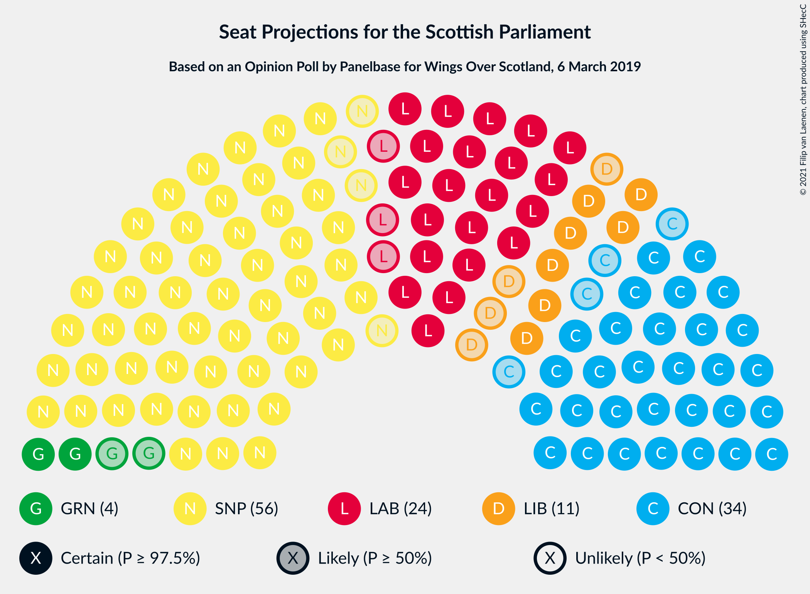
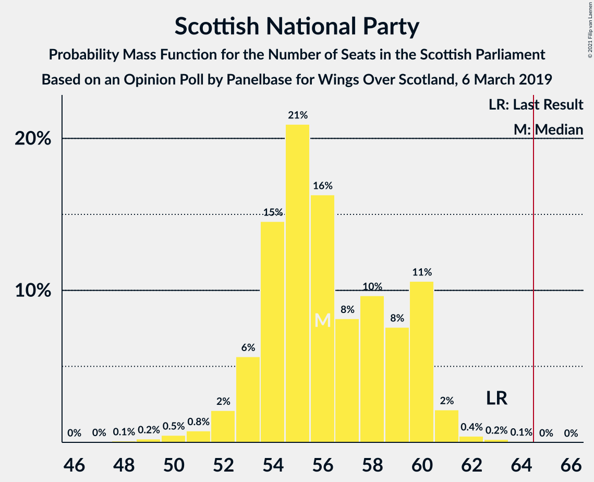
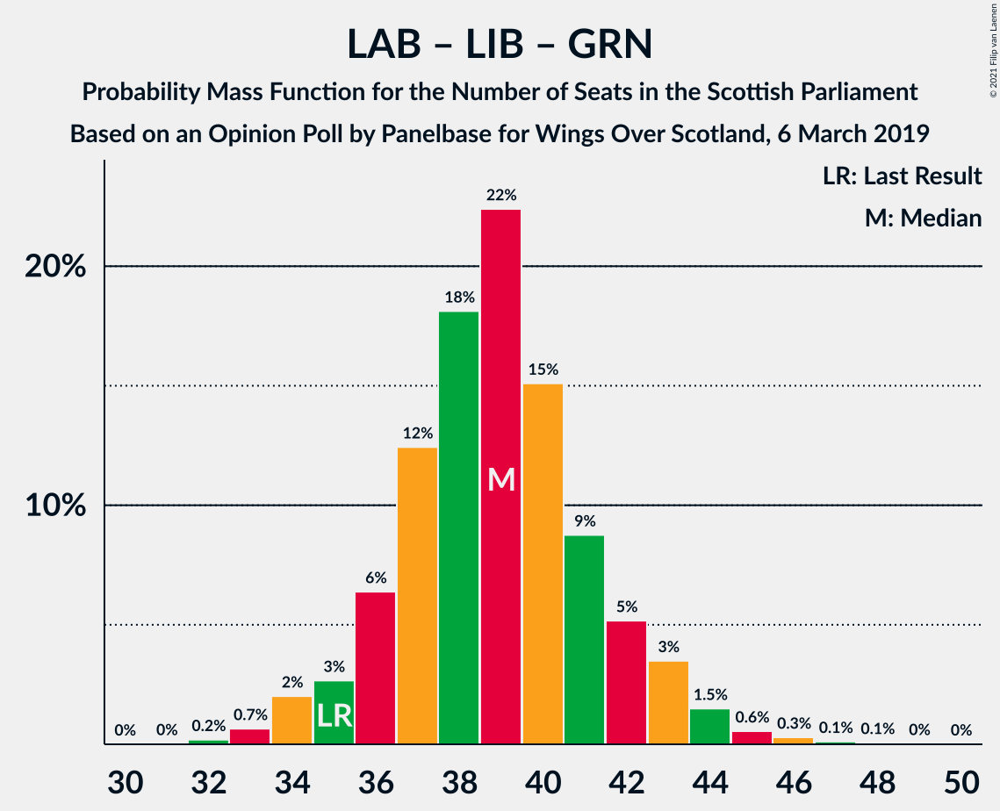

# Opinion Poll by Panelbase for Wings Over Scotland, 6 March 2019

<a href="#voting-intentions">Voting Intentions</a> | <a href="#seats">Seats</a> | <a href="#coalitions">Coalitions</a> | <a href="#technical-information">Technical Information</a>

## Voting Intentions

### Confidence Intervals

| Party | Last Result | Poll Result | 80% Confidence Interval | 90% Confidence Interval | 95% Confidence Interval | 99% Confidence Interval |
|:-----:|:-----------:|:-----------:|:-----------------------:|:-----------------------:|:-----------------------:|:-----------------------:|
| Scottish National Party | 41.7% | 36.2% | 34.3–38.2% |33.8–38.8% |33.3–39.3% |32.4–40.2% |
| Scottish Conservative & Unionist Party | 22.9% | 26.1% | 24.4–28.0% |23.9–28.5% |23.5–29.0% |22.7–29.9% |
| Scottish Labour | 19.1% | 19.2% | 17.6–20.8% |17.2–21.3% |16.8–21.7% |16.1–22.5% |
| Scottish Liberal Democrats | 5.2% | 9.1% | 8.0–10.3% |7.7–10.7% |7.5–11.0% |7.0–11.7% |
| Scottish Greens | 6.6% | 6.1% | 5.2–7.2% |5.0–7.5% |4.8–7.8% |4.4–8.3% |
| UK Independence Party | 2.0% | 3.0% | 2.4–3.8% |2.2–4.0% |2.1–4.3% |1.8–4.7% |

*Note:* The poll result column reflects the actual value used in the calculations. Published results may vary slightly, and in addition be rounded to fewer digits.

## Seats

### Confidence Intervals

| Party | Last Result | Median | 80% Confidence Interval | 90% Confidence Interval | 95% Confidence Interval | 99% Confidence Interval |
|:-----:|:-----------:|:------:|:-----------------------:|:-----------------------:|:-----------------------:|:-----------------------:|
| <a href="#scottish-national-party">Scottish National Party</a> | 63 | 56 | 53–58 |53–60 |53–61 |52–62 |
| <a href="#scottish-conservative-&-unionist-party">Scottish Conservative & Unionist Party</a> | 31 | 35 | 32–36 |31–37 |30–38 |29–40 |
| <a href="#scottish-labour">Scottish Labour</a> | 24 | 24 | 22–27 |22–27 |21–27 |20–28 |
| <a href="#scottish-liberal-democrats">Scottish Liberal Democrats</a> | 5 | 11 | 8–12 |7–12 |7–13 |6–14 |
| <a href="#scottish-greens">Scottish Greens</a> | 6 | 3 | 2–7 |2–8 |2–9 |2–10 |
| <a href="#uk-independence-party">UK Independence Party</a> | 0 | 0 | 0 |0 |0 |0–1 |

### Scottish National Party

*For a full overview of the results for this party, see the [Scottish National Party](party-scottishnationalparty.html) page.*

| Number of Seats | Probability | Accumulated | Special Marks |
|:---------------:|:-----------:|:-----------:|:-------------:|
| 50 | 0% | 100% |  |
| 51 | 0.4% | 99.9% |  |
| 52 | 1.0% | 99.5% |  |
| 53 | 10% | 98.5% |  |
| 54 | 20% | 88% |  |
| 55 | 14% | 68% |  |
| 56 | 21% | 54% | Median |
| 57 | 10% | 33% |  |
| 58 | 13% | 23% |  |
| 59 | 3% | 9% |  |
| 60 | 3% | 6% |  |
| 61 | 2% | 3% |  |
| 62 | 0.7% | 0.9% |  |
| 63 | 0.2% | 0.3% | Last Result |
| 64 | 0.1% | 0.1% |  |
| 65 | 0% | 0% | Majority |

### Scottish Conservative & Unionist Party

*For a full overview of the results for this party, see the [Scottish Conservative & Unionist Party](party-scottishconservativeunionistparty.html) page.*

| Number of Seats | Probability | Accumulated | Special Marks |
|:---------------:|:-----------:|:-----------:|:-------------:|
| 26 | 0.1% | 100% |  |
| 27 | 0.1% | 99.9% |  |
| 28 | 0.1% | 99.8% |  |
| 29 | 2% | 99.7% |  |
| 30 | 3% | 98% |  |
| 31 | 4% | 95% | Last Result |
| 32 | 6% | 91% |  |
| 33 | 8% | 85% |  |
| 34 | 22% | 76% |  |
| 35 | 25% | 54% | Median |
| 36 | 21% | 29% |  |
| 37 | 5% | 8% |  |
| 38 | 2% | 3% |  |
| 39 | 0.9% | 1.4% |  |
| 40 | 0.4% | 0.5% |  |
| 41 | 0.1% | 0.1% |  |
| 42 | 0% | 0% |  |

### Scottish Labour

*For a full overview of the results for this party, see the [Scottish Labour](party-scottishlabour.html) page.*

| Number of Seats | Probability | Accumulated | Special Marks |
|:---------------:|:-----------:|:-----------:|:-------------:|
| 18 | 0% | 100% |  |
| 19 | 0% | 99.9% |  |
| 20 | 0.5% | 99.9% |  |
| 21 | 4% | 99.4% |  |
| 22 | 15% | 96% |  |
| 23 | 22% | 81% |  |
| 24 | 16% | 59% | Last Result, Median |
| 25 | 11% | 44% |  |
| 26 | 7% | 32% |  |
| 27 | 23% | 25% |  |
| 28 | 2% | 2% |  |
| 29 | 0.1% | 0.3% |  |
| 30 | 0.1% | 0.2% |  |
| 31 | 0% | 0.1% |  |
| 32 | 0% | 0% |  |

### Scottish Liberal Democrats

*For a full overview of the results for this party, see the [Scottish Liberal Democrats](party-scottishliberaldemocrats.html) page.*

| Number of Seats | Probability | Accumulated | Special Marks |
|:---------------:|:-----------:|:-----------:|:-------------:|
| 5 | 0.2% | 100% | Last Result |
| 6 | 2% | 99.8% |  |
| 7 | 3% | 98% |  |
| 8 | 10% | 95% |  |
| 9 | 15% | 85% |  |
| 10 | 18% | 70% |  |
| 11 | 32% | 52% | Median |
| 12 | 16% | 21% |  |
| 13 | 4% | 5% |  |
| 14 | 0.7% | 0.8% |  |
| 15 | 0% | 0.1% |  |
| 16 | 0% | 0% |  |

### Scottish Greens

*For a full overview of the results for this party, see the [Scottish Greens](party-scottishgreens.html) page.*

| Number of Seats | Probability | Accumulated | Special Marks |
|:---------------:|:-----------:|:-----------:|:-------------:|
| 2 | 12% | 100% |  |
| 3 | 41% | 88% | Median |
| 4 | 18% | 47% |  |
| 5 | 6% | 29% |  |
| 6 | 11% | 23% | Last Result |
| 7 | 6% | 12% |  |
| 8 | 2% | 5% |  |
| 9 | 2% | 3% |  |
| 10 | 1.0% | 1.0% |  |
| 11 | 0% | 0% |  |

### UK Independence Party

*For a full overview of the results for this party, see the [UK Independence Party](party-ukindependenceparty.html) page.*

| Number of Seats | Probability | Accumulated | Special Marks |
|:---------------:|:-----------:|:-----------:|:-------------:|
| 0 | 99.0% | 100% | Last Result, Median |
| 1 | 0.8% | 1.0% |  |
| 2 | 0.1% | 0.2% |  |
| 3 | 0.1% | 0.1% |  |
| 4 | 0% | 0% |  |

## Coalitions

### Confidence Intervals

| Coalition | Last Result | Median | Majority? | 80% Confidence Interval | 90% Confidence Interval | 95% Confidence Interval | 99% Confidence Interval |
|:---------:|:-----------:|:------:|:---------:|:-----------------------:|:-----------------------:|:-----------------------:|:-----------------------:|
| Scottish Conservative & Unionist Party – Scottish Labour – Scottish Liberal Democrats | 60 | 70 | 95% | 66–72 | 65–73 | 63–73 | 62–74 |
| Scottish National Party – Scottish Greens | 69 | 59 | 5% | 57–63 | 56–64 | 56–66 | 55–67 |
| Scottish Conservative & Unionist Party – Scottish Labour | 55 | 59 | 0.6% | 56–62 | 54–63 | 54–63 | 52–65 |
| Scottish National Party | 63 | 56 | 0% | 53–58 | 53–60 | 53–61 | 52–62 |
| Scottish Conservative & Unionist Party – Scottish Liberal Democrats | 36 | 45 | 0% | 41–47 | 41–48 | 40–49 | 38–49 |
| Scottish Labour – Scottish Liberal Democrats – Scottish Greens | 35 | 39 | 0% | 36–41 | 35–42 | 35–43 | 33–45 |
| Scottish Labour – Scottish Liberal Democrats | 29 | 35 | 0% | 32–37 | 31–38 | 30–39 | 29–39 |

### Scottish Conservative & Unionist Party – Scottish Labour – Scottish Liberal Democrats

| Number of Seats | Probability | Accumulated | Special Marks |
|:---------------:|:-----------:|:-----------:|:-------------:|
| 58 | 0.1% | 100% |  |
| 59 | 0% | 99.9% |  |
| 60 | 0.1% | 99.9% | Last Result |
| 61 | 0.1% | 99.8% |  |
| 62 | 0.6% | 99.7% |  |
| 63 | 3% | 99.1% |  |
| 64 | 1.2% | 96% |  |
| 65 | 4% | 95% | Majority |
| 66 | 7% | 91% |  |
| 67 | 8% | 85% |  |
| 68 | 16% | 77% |  |
| 69 | 8% | 61% |  |
| 70 | 28% | 52% | Median |
| 71 | 6% | 24% |  |
| 72 | 10% | 18% |  |
| 73 | 7% | 8% |  |
| 74 | 1.3% | 1.5% |  |
| 75 | 0.1% | 0.2% |  |
| 76 | 0.1% | 0.1% |  |
| 77 | 0% | 0% |  |

### Scottish National Party – Scottish Greens

| Number of Seats | Probability | Accumulated | Special Marks |
|:---------------:|:-----------:|:-----------:|:-------------:|
| 53 | 0.1% | 100% |  |
| 54 | 0.1% | 99.9% |  |
| 55 | 1.3% | 99.8% |  |
| 56 | 7% | 98% |  |
| 57 | 10% | 92% |  |
| 58 | 6% | 82% |  |
| 59 | 28% | 76% | Median |
| 60 | 8% | 47% |  |
| 61 | 16% | 39% |  |
| 62 | 8% | 23% |  |
| 63 | 7% | 15% |  |
| 64 | 4% | 9% |  |
| 65 | 1.3% | 5% | Majority |
| 66 | 3% | 4% |  |
| 67 | 0.6% | 0.9% |  |
| 68 | 0.1% | 0.3% |  |
| 69 | 0.1% | 0.2% | Last Result |
| 70 | 0% | 0.1% |  |
| 71 | 0.1% | 0.1% |  |
| 72 | 0% | 0% |  |

### Scottish Conservative & Unionist Party – Scottish Labour

| Number of Seats | Probability | Accumulated | Special Marks |
|:---------------:|:-----------:|:-----------:|:-------------:|
| 48 | 0.1% | 100% |  |
| 49 | 0.1% | 99.9% |  |
| 50 | 0% | 99.9% |  |
| 51 | 0.2% | 99.8% |  |
| 52 | 0.5% | 99.6% |  |
| 53 | 1.4% | 99.2% |  |
| 54 | 3% | 98% |  |
| 55 | 5% | 95% | Last Result |
| 56 | 4% | 90% |  |
| 57 | 11% | 86% |  |
| 58 | 13% | 75% |  |
| 59 | 30% | 62% | Median |
| 60 | 8% | 32% |  |
| 61 | 10% | 24% |  |
| 62 | 8% | 14% |  |
| 63 | 4% | 6% |  |
| 64 | 1.0% | 2% |  |
| 65 | 0.3% | 0.6% | Majority |
| 66 | 0.3% | 0.3% |  |
| 67 | 0% | 0% |  |

### Scottish National Party

| Number of Seats | Probability | Accumulated | Special Marks |
|:---------------:|:-----------:|:-----------:|:-------------:|
| 50 | 0% | 100% |  |
| 51 | 0.4% | 99.9% |  |
| 52 | 1.0% | 99.5% |  |
| 53 | 10% | 98.5% |  |
| 54 | 20% | 88% |  |
| 55 | 14% | 68% |  |
| 56 | 21% | 54% | Median |
| 57 | 10% | 33% |  |
| 58 | 13% | 23% |  |
| 59 | 3% | 9% |  |
| 60 | 3% | 6% |  |
| 61 | 2% | 3% |  |
| 62 | 0.7% | 0.9% |  |
| 63 | 0.2% | 0.3% | Last Result |
| 64 | 0.1% | 0.1% |  |
| 65 | 0% | 0% | Majority |

### Scottish Conservative & Unionist Party – Scottish Liberal Democrats

| Number of Seats | Probability | Accumulated | Special Marks |
|:---------------:|:-----------:|:-----------:|:-------------:|
| 36 | 0.1% | 100% | Last Result |
| 37 | 0.2% | 99.9% |  |
| 38 | 0.9% | 99.7% |  |
| 39 | 0.8% | 98.8% |  |
| 40 | 2% | 98% |  |
| 41 | 7% | 96% |  |
| 42 | 10% | 89% |  |
| 43 | 9% | 79% |  |
| 44 | 13% | 71% |  |
| 45 | 15% | 58% |  |
| 46 | 18% | 43% | Median |
| 47 | 18% | 25% |  |
| 48 | 4% | 7% |  |
| 49 | 3% | 3% |  |
| 50 | 0.3% | 0.4% |  |
| 51 | 0.1% | 0.1% |  |
| 52 | 0% | 0.1% |  |
| 53 | 0% | 0% |  |

### Scottish Labour – Scottish Liberal Democrats – Scottish Greens

| Number of Seats | Probability | Accumulated | Special Marks |
|:---------------:|:-----------:|:-----------:|:-------------:|
| 32 | 0.2% | 100% |  |
| 33 | 0.7% | 99.8% |  |
| 34 | 2% | 99.1% |  |
| 35 | 3% | 98% | Last Result |
| 36 | 9% | 94% |  |
| 37 | 19% | 86% |  |
| 38 | 14% | 67% | Median |
| 39 | 16% | 53% |  |
| 40 | 16% | 38% |  |
| 41 | 13% | 22% |  |
| 42 | 4% | 9% |  |
| 43 | 2% | 5% |  |
| 44 | 2% | 2% |  |
| 45 | 0.7% | 0.9% |  |
| 46 | 0.1% | 0.2% |  |
| 47 | 0% | 0.1% |  |
| 48 | 0% | 0% |  |

### Scottish Labour – Scottish Liberal Democrats

| Number of Seats | Probability | Accumulated | Special Marks |
|:---------------:|:-----------:|:-----------:|:-------------:|
| 28 | 0.3% | 100% |  |
| 29 | 1.0% | 99.7% | Last Result |
| 30 | 3% | 98.7% |  |
| 31 | 5% | 96% |  |
| 32 | 9% | 91% |  |
| 33 | 16% | 82% |  |
| 34 | 15% | 67% |  |
| 35 | 12% | 52% | Median |
| 36 | 12% | 40% |  |
| 37 | 20% | 27% |  |
| 38 | 4% | 8% |  |
| 39 | 3% | 3% |  |
| 40 | 0.3% | 0.4% |  |
| 41 | 0.1% | 0.1% |  |
| 42 | 0% | 0.1% |  |
| 43 | 0% | 0% |  |

## Technical Information

### Opinion Poll

+ **Polling firm:** Panelbase
+ **Commissioner(s):** Wings Over Scotland
+ **Fieldwork period:** 6 March 2019

### Calculations

+ **Sample size:** 1002
+ **Simulations done:** 131,072
+ **Error estimate:** 0.37%

