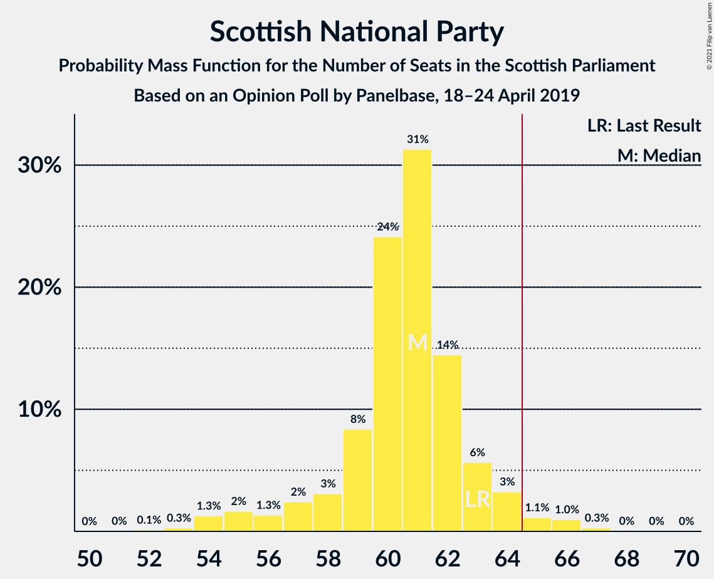
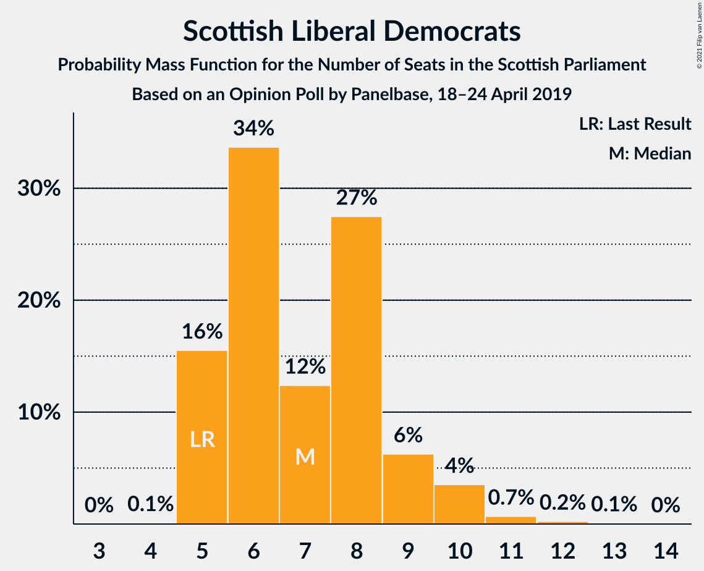

# Opinion Poll by Panelbase, 18–24 April 2019

<a href="#voting-intentions">Voting Intentions</a> | <a href="#seats">Seats</a> | <a href="#coalitions">Coalitions</a> | <a href="#technical-information">Technical Information</a>

## Voting Intentions

### Confidence Intervals

| Party | Last Result | Poll Result | 80% Confidence Interval | 90% Confidence Interval | 95% Confidence Interval | 99% Confidence Interval |
|:-----:|:-----------:|:-----------:|:-----------------------:|:-----------------------:|:-----------------------:|:-----------------------:|
| Scottish National Party | 41.7% | 37.0% | 35.1–39.0% |34.6–39.6% |34.1–40.1% |33.2–41.0% |
| Scottish Conservative & Unionist Party | 22.9% | 22.0% | 20.4–23.7% |20.0–24.2% |19.6–24.7% |18.8–25.5% |
| Scottish Labour | 19.1% | 19.0% | 17.5–20.6% |17.0–21.1% |16.7–21.5% |16.0–22.3% |
| Scottish Greens | 6.6% | 7.0% | 6.1–8.1% |5.8–8.4% |5.6–8.7% |5.2–9.3% |
| Scottish Liberal Democrats | 5.2% | 7.0% | 6.1–8.1% |5.8–8.4% |5.6–8.7% |5.2–9.3% |
| Reform UK | 0.0% | 4.0% | 3.3–4.9% |3.1–5.2% |3.0–5.4% |2.7–5.9% |
| UK Independence Party | 2.0% | 2.0% | 1.5–2.7% |1.4–2.9% |1.3–3.0% |1.1–3.4% |

*Note:* The poll result column reflects the actual value used in the calculations. Published results may vary slightly, and in addition be rounded to fewer digits.

## Seats

### Confidence Intervals

| Party | Last Result | Median | 80% Confidence Interval | 90% Confidence Interval | 95% Confidence Interval | 99% Confidence Interval |
|:-----:|:-----------:|:------:|:-----------------------:|:-----------------------:|:-----------------------:|:-----------------------:|
| <a href="#scottish-national-party">Scottish National Party</a> | 63 | 60 | 56–63 |54–65 |54–66 |53–66 |
| <a href="#scottish-conservative-&-unionist-party">Scottish Conservative & Unionist Party</a> | 31 | 29 | 25–32 |25–34 |25–35 |24–36 |
| <a href="#scottish-labour">Scottish Labour</a> | 24 | 25 | 22–28 |22–29 |22–29 |19–31 |
| <a href="#scottish-greens">Scottish Greens</a> | 6 | 9 | 4–10 |3–10 |3–10 |2–10 |
| <a href="#scottish-liberal-democrats">Scottish Liberal Democrats</a> | 5 | 6 | 5–9 |5–10 |5–10 |4–11 |
| <a href="#reform-uk">Reform UK</a> | 0 | 0 | 0–3 |0–5 |0–5 |0–6 |
| <a href="#uk-independence-party">UK Independence Party</a> | 0 | 0 | 0 |0 |0 |0 |

### Scottish National Party

*For a full overview of the results for this party, see the [Scottish National Party](party-scottishnationalparty.html) page.*

| Number of Seats | Probability | Accumulated | Special Marks |
|:---------------:|:-----------:|:-----------:|:-------------:|
| 52 | 0.1% | 100% |  |
| 53 | 1.2% | 99.8% |  |
| 54 | 6% | 98.6% |  |
| 55 | 3% | 93% |  |
| 56 | 3% | 90% |  |
| 57 | 7% | 87% |  |
| 58 | 7% | 80% |  |
| 59 | 23% | 74% |  |
| 60 | 16% | 51% | Median |
| 61 | 14% | 35% |  |
| 62 | 8% | 21% |  |
| 63 | 5% | 13% | Last Result |
| 64 | 3% | 8% |  |
| 65 | 0.8% | 5% | Majority |
| 66 | 4% | 4% |  |
| 67 | 0.3% | 0.3% |  |
| 68 | 0% | 0.1% |  |
| 69 | 0% | 0% |  |

### Scottish Conservative & Unionist Party

*For a full overview of the results for this party, see the [Scottish Conservative & Unionist Party](party-scottishconservativeunionistparty.html) page.*

| Number of Seats | Probability | Accumulated | Special Marks |
|:---------------:|:-----------:|:-----------:|:-------------:|
| 22 | 0.1% | 100% |  |
| 23 | 0.1% | 99.9% |  |
| 24 | 0.8% | 99.8% |  |
| 25 | 11% | 99.0% |  |
| 26 | 10% | 88% |  |
| 27 | 10% | 78% |  |
| 28 | 15% | 68% |  |
| 29 | 5% | 53% | Median |
| 30 | 13% | 48% |  |
| 31 | 16% | 35% | Last Result |
| 32 | 10% | 19% |  |
| 33 | 1.3% | 9% |  |
| 34 | 4% | 7% |  |
| 35 | 2% | 3% |  |
| 36 | 0.8% | 1.1% |  |
| 37 | 0.3% | 0.3% |  |
| 38 | 0% | 0% |  |

### Scottish Labour

*For a full overview of the results for this party, see the [Scottish Labour](party-scottishlabour.html) page.*

| Number of Seats | Probability | Accumulated | Special Marks |
|:---------------:|:-----------:|:-----------:|:-------------:|
| 18 | 0.2% | 100% |  |
| 19 | 0.4% | 99.8% |  |
| 20 | 0.7% | 99.4% |  |
| 21 | 0.9% | 98.7% |  |
| 22 | 11% | 98% |  |
| 23 | 13% | 87% |  |
| 24 | 16% | 74% | Last Result |
| 25 | 17% | 57% | Median |
| 26 | 11% | 40% |  |
| 27 | 13% | 28% |  |
| 28 | 10% | 16% |  |
| 29 | 4% | 6% |  |
| 30 | 1.4% | 2% |  |
| 31 | 0.7% | 0.8% |  |
| 32 | 0% | 0.1% |  |
| 33 | 0.1% | 0.1% |  |
| 34 | 0% | 0% |  |

### Scottish Greens

*For a full overview of the results for this party, see the [Scottish Greens](party-scottishgreens.html) page.*

| Number of Seats | Probability | Accumulated | Special Marks |
|:---------------:|:-----------:|:-----------:|:-------------:|
| 2 | 0.7% | 100% |  |
| 3 | 6% | 99.3% |  |
| 4 | 12% | 94% |  |
| 5 | 11% | 82% |  |
| 6 | 9% | 71% | Last Result |
| 7 | 7% | 62% |  |
| 8 | 4% | 55% |  |
| 9 | 20% | 51% | Median |
| 10 | 31% | 31% |  |
| 11 | 0.2% | 0.2% |  |
| 12 | 0% | 0% |  |

### Scottish Liberal Democrats

*For a full overview of the results for this party, see the [Scottish Liberal Democrats](party-scottishliberaldemocrats.html) page.*

| Number of Seats | Probability | Accumulated | Special Marks |
|:---------------:|:-----------:|:-----------:|:-------------:|
| 3 | 0% | 100% |  |
| 4 | 0.6% | 99.9% |  |
| 5 | 22% | 99.3% | Last Result |
| 6 | 30% | 78% | Median |
| 7 | 10% | 47% |  |
| 8 | 26% | 37% |  |
| 9 | 6% | 11% |  |
| 10 | 5% | 5% |  |
| 11 | 0.3% | 0.5% |  |
| 12 | 0.2% | 0.2% |  |
| 13 | 0% | 0% |  |

### Reform UK

*For a full overview of the results for this party, see the [Reform UK](party-reformuk.html) page.*

| Number of Seats | Probability | Accumulated | Special Marks |
|:---------------:|:-----------:|:-----------:|:-------------:|
| 0 | 51% | 100% | Last Result, Median |
| 1 | 28% | 49% |  |
| 2 | 6% | 20% |  |
| 3 | 4% | 14% |  |
| 4 | 3% | 10% |  |
| 5 | 6% | 7% |  |
| 6 | 0.3% | 0.7% |  |
| 7 | 0.3% | 0.4% |  |
| 8 | 0.2% | 0.2% |  |
| 9 | 0% | 0% |  |

### UK Independence Party

*For a full overview of the results for this party, see the [UK Independence Party](party-ukindependenceparty.html) page.*

| Number of Seats | Probability | Accumulated | Special Marks |
|:---------------:|:-----------:|:-----------:|:-------------:|
| 0 | 100% | 100% | Last Result, Median |

## Coalitions

### Confidence Intervals

| Coalition | Last Result | Median | Majority? | 80% Confidence Interval | 90% Confidence Interval | 95% Confidence Interval | 99% Confidence Interval |
|:---------:|:-----------:|:------:|:---------:|:-----------------------:|:-----------------------:|:-----------------------:|:-----------------------:|
| Scottish National Party – Scottish Greens | 69 | 67 | 73% | 63–71 | 61–71 | 61–73 | 60–75 |
| Scottish Conservative & Unionist Party – Scottish Labour – Scottish Liberal Democrats | 60 | 61 | 18% | 57–66 | 56–67 | 55–68 | 53–69 |
| Scottish National Party | 63 | 60 | 5% | 56–63 | 54–65 | 54–66 | 53–66 |
| Scottish Conservative & Unionist Party – Scottish Labour | 55 | 54 | 0% | 50–58 | 49–59 | 49–61 | 47–63 |
| Scottish Labour – Scottish Greens – Scottish Liberal Democrats | 35 | 40 | 0% | 35–43 | 33–43 | 33–44 | 32–45 |
| Scottish Conservative & Unionist Party – Scottish Liberal Democrats | 36 | 36 | 0% | 32–40 | 32–41 | 31–41 | 30–43 |
| Scottish Labour – Scottish Liberal Democrats | 29 | 32 | 0% | 29–35 | 28–36 | 27–37 | 25–38 |

### Scottish National Party – Scottish Greens

| Number of Seats | Probability | Accumulated | Special Marks |
|:---------------:|:-----------:|:-----------:|:-------------:|
| 57 | 0% | 100% |  |
| 58 | 0.2% | 99.9% |  |
| 59 | 0.1% | 99.8% |  |
| 60 | 2% | 99.7% |  |
| 61 | 3% | 98% |  |
| 62 | 3% | 95% |  |
| 63 | 9% | 92% |  |
| 64 | 9% | 83% |  |
| 65 | 5% | 73% | Majority |
| 66 | 5% | 68% |  |
| 67 | 15% | 64% |  |
| 68 | 12% | 49% |  |
| 69 | 11% | 37% | Last Result, Median |
| 70 | 11% | 25% |  |
| 71 | 9% | 14% |  |
| 72 | 2% | 5% |  |
| 73 | 2% | 3% |  |
| 74 | 0.3% | 1.0% |  |
| 75 | 0.2% | 0.7% |  |
| 76 | 0.4% | 0.5% |  |
| 77 | 0% | 0% |  |

### Scottish Conservative & Unionist Party – Scottish Labour – Scottish Liberal Democrats

| Number of Seats | Probability | Accumulated | Special Marks |
|:---------------:|:-----------:|:-----------:|:-------------:|
| 51 | 0% | 100% |  |
| 52 | 0.4% | 99.9% |  |
| 53 | 0.2% | 99.5% |  |
| 54 | 1.0% | 99.3% |  |
| 55 | 2% | 98% |  |
| 56 | 4% | 96% |  |
| 57 | 5% | 92% |  |
| 58 | 13% | 88% |  |
| 59 | 10% | 74% |  |
| 60 | 10% | 64% | Last Result, Median |
| 61 | 17% | 54% |  |
| 62 | 11% | 37% |  |
| 63 | 4% | 27% |  |
| 64 | 5% | 23% |  |
| 65 | 7% | 18% | Majority |
| 66 | 5% | 11% |  |
| 67 | 2% | 6% |  |
| 68 | 3% | 4% |  |
| 69 | 1.1% | 1.2% |  |
| 70 | 0.1% | 0.1% |  |
| 71 | 0.1% | 0.1% |  |
| 72 | 0% | 0% |  |

### Scottish National Party

| Number of Seats | Probability | Accumulated | Special Marks |
|:---------------:|:-----------:|:-----------:|:-------------:|
| 52 | 0.1% | 100% |  |
| 53 | 1.2% | 99.8% |  |
| 54 | 6% | 98.6% |  |
| 55 | 3% | 93% |  |
| 56 | 3% | 90% |  |
| 57 | 7% | 87% |  |
| 58 | 7% | 80% |  |
| 59 | 23% | 74% |  |
| 60 | 16% | 51% | Median |
| 61 | 14% | 35% |  |
| 62 | 8% | 21% |  |
| 63 | 5% | 13% | Last Result |
| 64 | 3% | 8% |  |
| 65 | 0.8% | 5% | Majority |
| 66 | 4% | 4% |  |
| 67 | 0.3% | 0.3% |  |
| 68 | 0% | 0.1% |  |
| 69 | 0% | 0% |  |

### Scottish Conservative & Unionist Party – Scottish Labour

| Number of Seats | Probability | Accumulated | Special Marks |
|:---------------:|:-----------:|:-----------:|:-------------:|
| 44 | 0% | 100% |  |
| 45 | 0.1% | 99.9% |  |
| 46 | 0.1% | 99.9% |  |
| 47 | 0.5% | 99.8% |  |
| 48 | 2% | 99.3% |  |
| 49 | 6% | 98% |  |
| 50 | 10% | 91% |  |
| 51 | 7% | 81% |  |
| 52 | 9% | 74% |  |
| 53 | 6% | 65% |  |
| 54 | 12% | 59% | Median |
| 55 | 12% | 47% | Last Result |
| 56 | 9% | 35% |  |
| 57 | 6% | 26% |  |
| 58 | 11% | 20% |  |
| 59 | 5% | 9% |  |
| 60 | 1.4% | 4% |  |
| 61 | 1.3% | 3% |  |
| 62 | 1.1% | 2% |  |
| 63 | 0.4% | 0.5% |  |
| 64 | 0.1% | 0.1% |  |
| 65 | 0% | 0% | Majority |

### Scottish Labour – Scottish Greens – Scottish Liberal Democrats

| Number of Seats | Probability | Accumulated | Special Marks |
|:---------------:|:-----------:|:-----------:|:-------------:|
| 31 | 0.1% | 100% |  |
| 32 | 2% | 99.8% |  |
| 33 | 3% | 98% |  |
| 34 | 3% | 95% |  |
| 35 | 5% | 92% | Last Result |
| 36 | 3% | 87% |  |
| 37 | 7% | 84% |  |
| 38 | 12% | 77% |  |
| 39 | 13% | 65% |  |
| 40 | 14% | 52% | Median |
| 41 | 12% | 38% |  |
| 42 | 16% | 26% |  |
| 43 | 7% | 11% |  |
| 44 | 3% | 4% |  |
| 45 | 0.3% | 0.8% |  |
| 46 | 0.4% | 0.4% |  |
| 47 | 0.1% | 0.1% |  |
| 48 | 0% | 0% |  |

### Scottish Conservative & Unionist Party – Scottish Liberal Democrats

| Number of Seats | Probability | Accumulated | Special Marks |
|:---------------:|:-----------:|:-----------:|:-------------:|
| 28 | 0% | 100% |  |
| 29 | 0.3% | 99.9% |  |
| 30 | 0.7% | 99.6% |  |
| 31 | 3% | 98.9% |  |
| 32 | 6% | 96% |  |
| 33 | 16% | 90% |  |
| 34 | 14% | 74% |  |
| 35 | 6% | 59% | Median |
| 36 | 11% | 53% | Last Result |
| 37 | 15% | 43% |  |
| 38 | 7% | 28% |  |
| 39 | 7% | 21% |  |
| 40 | 4% | 14% |  |
| 41 | 8% | 10% |  |
| 42 | 1.2% | 2% |  |
| 43 | 0.6% | 0.7% |  |
| 44 | 0.1% | 0.2% |  |
| 45 | 0% | 0% |  |

### Scottish Labour – Scottish Liberal Democrats

| Number of Seats | Probability | Accumulated | Special Marks |
|:---------------:|:-----------:|:-----------:|:-------------:|
| 24 | 0.3% | 100% |  |
| 25 | 0.2% | 99.6% |  |
| 26 | 0.5% | 99.5% |  |
| 27 | 2% | 99.0% |  |
| 28 | 2% | 97% |  |
| 29 | 12% | 95% | Last Result |
| 30 | 14% | 83% |  |
| 31 | 15% | 69% | Median |
| 32 | 13% | 54% |  |
| 33 | 23% | 42% |  |
| 34 | 3% | 18% |  |
| 35 | 7% | 16% |  |
| 36 | 6% | 9% |  |
| 37 | 2% | 3% |  |
| 38 | 0.6% | 0.9% |  |
| 39 | 0.3% | 0.4% |  |
| 40 | 0% | 0% |  |

## Technical Information

### Opinion Poll

+ **Polling firm:** Panelbase
+ **Commissioner(s):** —
+ **Fieldwork period:** 18–24 April 2019

### Calculations

+ **Sample size:** 1018
+ **Simulations done:** 131,072
+ **Error estimate:** 2.12%

