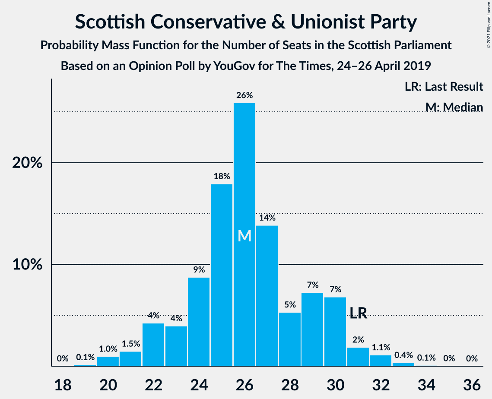
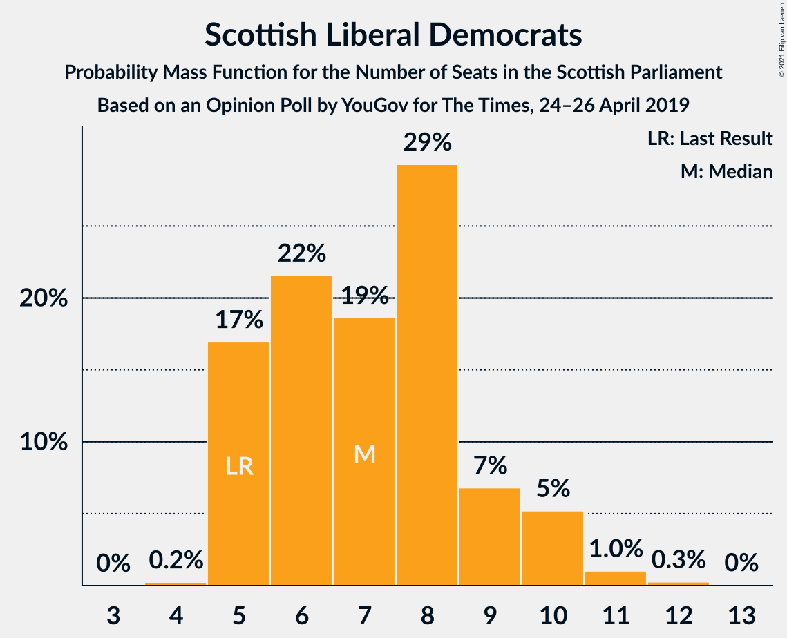
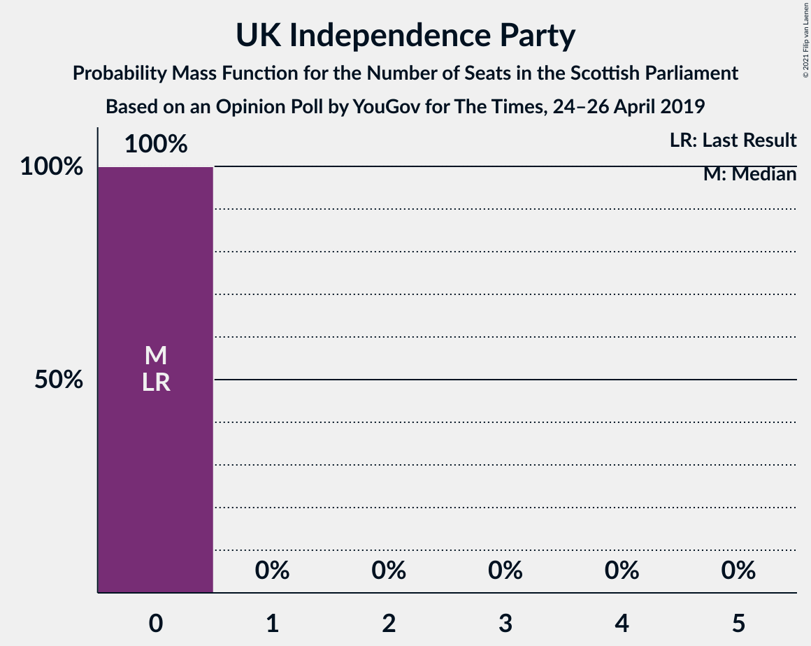
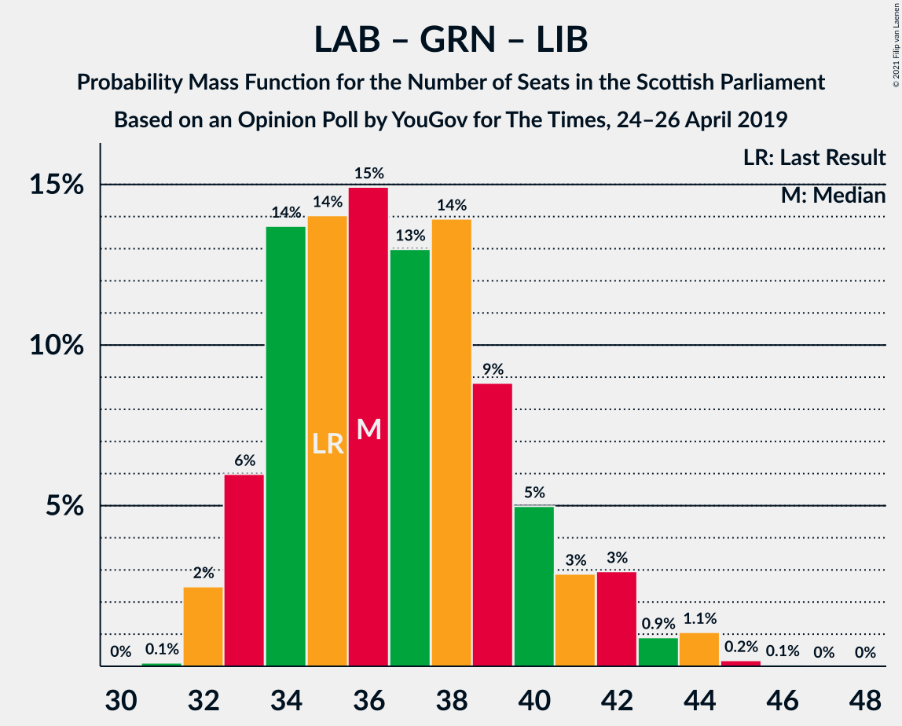

# Opinion Poll by YouGov for The Times, 24–26 April 2019

<a href="#voting-intentions">Voting Intentions</a> | <a href="#seats">Seats</a> | <a href="#coalitions">Coalitions</a> | <a href="#technical-information">Technical Information</a>

## Voting Intentions

### Confidence Intervals

| Party | Last Result | Poll Result | 80% Confidence Interval | 90% Confidence Interval | 95% Confidence Interval | 99% Confidence Interval |
|:-----:|:-----------:|:-----------:|:-----------------------:|:-----------------------:|:-----------------------:|:-----------------------:|
| Scottish National Party | 41.7% | 36.6% | 34.7–38.6% |34.2–39.2% |33.7–39.6% |32.8–40.6% |
| Scottish Conservative & Unionist Party | 22.9% | 19.8% | 18.3–21.5% |17.9–22.0% |17.5–22.4% |16.8–23.2% |
| Scottish Labour | 19.1% | 14.9% | 13.5–16.4% |13.1–16.8% |12.8–17.2% |12.2–17.9% |
| Scottish Greens | 6.6% | 9.9% | 8.8–11.2% |8.5–11.6% |8.2–11.9% |7.7–12.5% |
| Scottish Liberal Democrats | 5.2% | 6.9% | 6.0–8.0% |5.7–8.3% |5.5–8.6% |5.1–9.2% |
| Reform UK | 0.0% | 5.0% | 4.2–5.9% |4.0–6.2% |3.8–6.5% |3.4–7.0% |
| Scottish Socialist Party | 0.5% | 3.0% | 2.4–3.8% |2.3–4.1% |2.1–4.3% |1.9–4.7% |
| UK Independence Party | 2.0% | 1.9% | 1.5–2.6% |1.4–2.8% |1.3–3.0% |1.1–3.4% |

*Note:* The poll result column reflects the actual value used in the calculations. Published results may vary slightly, and in addition be rounded to fewer digits.

## Seats

### Confidence Intervals

| Party | Last Result | Median | 80% Confidence Interval | 90% Confidence Interval | 95% Confidence Interval | 99% Confidence Interval |
|:-----:|:-----------:|:------:|:-----------------------:|:-----------------------:|:-----------------------:|:-----------------------:|
| <a href="#scottish-national-party">Scottish National Party</a> | 63 | 62 | 61–65 |61–66 |60–67 |58–68 |
| <a href="#scottish-conservative-&-unionist-party">Scottish Conservative & Unionist Party</a> | 31 | 26 | 24–29 |23–30 |22–32 |21–33 |
| <a href="#scottish-labour">Scottish Labour</a> | 24 | 18 | 17–20 |17–22 |16–23 |16–24 |
| <a href="#scottish-greens">Scottish Greens</a> | 6 | 12 | 10–13 |10–14 |10–14 |10–15 |
| <a href="#scottish-liberal-democrats">Scottish Liberal Democrats</a> | 5 | 8 | 5–9 |5–9 |5–9 |4–10 |
| <a href="#reform-uk">Reform UK</a> | 0 | 3 | 0–7 |0–7 |0–7 |0–8 |
| <a href="#scottish-socialist-party">Scottish Socialist Party</a> | 0 | 0 | 0 |0 |0 |0 |
| <a href="#uk-independence-party">UK Independence Party</a> | 0 | 0 | 0 |0 |0 |0 |

### Scottish National Party

*For a full overview of the results for this party, see the [Scottish National Party](party-scottishnationalparty.html) page.*

| Number of Seats | Probability | Accumulated | Special Marks |
|:---------------:|:-----------:|:-----------:|:-------------:|
| 54 | 0.1% | 100% |  |
| 55 | 0.3% | 99.9% |  |
| 56 | 0% | 99.6% |  |
| 57 | 0.1% | 99.6% |  |
| 58 | 0.1% | 99.5% |  |
| 59 | 2% | 99.4% |  |
| 60 | 0.4% | 98% |  |
| 61 | 15% | 97% |  |
| 62 | 38% | 82% | Median |
| 63 | 13% | 44% | Last Result |
| 64 | 15% | 31% |  |
| 65 | 7% | 16% | Majority |
| 66 | 4% | 8% |  |
| 67 | 2% | 4% |  |
| 68 | 2% | 2% |  |
| 69 | 0.2% | 0.4% |  |
| 70 | 0.2% | 0.2% |  |
| 71 | 0% | 0% |  |

### Scottish Conservative & Unionist Party

*For a full overview of the results for this party, see the [Scottish Conservative & Unionist Party](party-scottishconservativeunionistparty.html) page.*

| Number of Seats | Probability | Accumulated | Special Marks |
|:---------------:|:-----------:|:-----------:|:-------------:|
| 19 | 0.1% | 100% |  |
| 20 | 0.3% | 99.9% |  |
| 21 | 2% | 99.6% |  |
| 22 | 2% | 98% |  |
| 23 | 4% | 96% |  |
| 24 | 10% | 92% |  |
| 25 | 25% | 82% |  |
| 26 | 27% | 57% | Median |
| 27 | 14% | 30% |  |
| 28 | 2% | 16% |  |
| 29 | 8% | 14% |  |
| 30 | 1.1% | 6% |  |
| 31 | 0.4% | 5% | Last Result |
| 32 | 4% | 4% |  |
| 33 | 0.3% | 0.5% |  |
| 34 | 0.1% | 0.2% |  |
| 35 | 0% | 0.1% |  |
| 36 | 0% | 0% |  |

### Scottish Labour

*For a full overview of the results for this party, see the [Scottish Labour](party-scottishlabour.html) page.*

| Number of Seats | Probability | Accumulated | Special Marks |
|:---------------:|:-----------:|:-----------:|:-------------:|
| 14 | 0.1% | 100% |  |
| 15 | 0.1% | 99.9% |  |
| 16 | 3% | 99.8% |  |
| 17 | 45% | 97% |  |
| 18 | 24% | 52% | Median |
| 19 | 14% | 28% |  |
| 20 | 7% | 15% |  |
| 21 | 3% | 8% |  |
| 22 | 3% | 5% |  |
| 23 | 2% | 3% |  |
| 24 | 1.0% | 1.1% | Last Result |
| 25 | 0.1% | 0.1% |  |
| 26 | 0% | 0% |  |

### Scottish Greens

*For a full overview of the results for this party, see the [Scottish Greens](party-scottishgreens.html) page.*

| Number of Seats | Probability | Accumulated | Special Marks |
|:---------------:|:-----------:|:-----------:|:-------------:|
| 6 | 0% | 100% | Last Result |
| 7 | 0% | 100% |  |
| 8 | 0% | 100% |  |
| 9 | 0.1% | 100% |  |
| 10 | 36% | 99.9% |  |
| 11 | 10% | 64% |  |
| 12 | 14% | 55% | Median |
| 13 | 35% | 41% |  |
| 14 | 5% | 6% |  |
| 15 | 0.6% | 0.6% |  |
| 16 | 0% | 0.1% |  |
| 17 | 0% | 0% |  |

### Scottish Liberal Democrats

*For a full overview of the results for this party, see the [Scottish Liberal Democrats](party-scottishliberaldemocrats.html) page.*

| Number of Seats | Probability | Accumulated | Special Marks |
|:---------------:|:-----------:|:-----------:|:-------------:|
| 4 | 2% | 100% |  |
| 5 | 21% | 98% | Last Result |
| 6 | 16% | 77% |  |
| 7 | 11% | 61% |  |
| 8 | 35% | 50% | Median |
| 9 | 13% | 15% |  |
| 10 | 1.1% | 1.3% |  |
| 11 | 0.2% | 0.3% |  |
| 12 | 0% | 0% |  |

### Reform UK

*For a full overview of the results for this party, see the [Reform UK](party-reformuk.html) page.*

| Number of Seats | Probability | Accumulated | Special Marks |
|:---------------:|:-----------:|:-----------:|:-------------:|
| 0 | 17% | 100% | Last Result |
| 1 | 6% | 83% |  |
| 2 | 6% | 77% |  |
| 3 | 21% | 71% | Median |
| 4 | 16% | 49% |  |
| 5 | 17% | 33% |  |
| 6 | 6% | 16% |  |
| 7 | 8% | 10% |  |
| 8 | 2% | 2% |  |
| 9 | 0% | 0% |  |

### Scottish Socialist Party

*For a full overview of the results for this party, see the [Scottish Socialist Party](party-scottishsocialistparty.html) page.*

| Number of Seats | Probability | Accumulated | Special Marks |
|:---------------:|:-----------:|:-----------:|:-------------:|
| 0 | 100% | 100% | Last Result, Median |

### UK Independence Party

*For a full overview of the results for this party, see the [UK Independence Party](party-ukindependenceparty.html) page.*

| Number of Seats | Probability | Accumulated | Special Marks |
|:---------------:|:-----------:|:-----------:|:-------------:|
| 0 | 100% | 100% | Last Result, Median |

## Coalitions

### Confidence Intervals

| Coalition | Last Result | Median | Majority? | 80% Confidence Interval | 90% Confidence Interval | 95% Confidence Interval | 99% Confidence Interval |
|:---------:|:-----------:|:------:|:---------:|:-----------------------:|:-----------------------:|:-----------------------:|:-----------------------:|
| Scottish National Party – Scottish Greens | 69 | 75 | 100% | 71–77 | 71–78 | 70–79 | 69–80 |
| Scottish National Party | 63 | 62 | 16% | 61–65 | 61–66 | 60–67 | 58–68 |
| Scottish Conservative & Unionist Party – Scottish Labour – Scottish Liberal Democrats | 60 | 51 | 0% | 48–55 | 47–56 | 46–58 | 44–58 |
| Scottish Conservative & Unionist Party – Scottish Labour | 55 | 44 | 0% | 42–48 | 41–49 | 40–51 | 38–51 |
| Scottish Labour – Scottish Greens – Scottish Liberal Democrats | 35 | 37 | 0% | 33–40 | 33–40 | 33–41 | 32–42 |
| Scottish Conservative & Unionist Party – Scottish Liberal Democrats | 36 | 33 | 0% | 30–36 | 29–38 | 28–39 | 27–40 |
| Scottish Labour – Scottish Liberal Democrats | 29 | 25 | 0% | 23–28 | 22–28 | 22–29 | 21–31 |

### Scottish National Party – Scottish Greens

| Number of Seats | Probability | Accumulated | Special Marks |
|:---------------:|:-----------:|:-----------:|:-------------:|
| 65 | 0.1% | 100% | Majority |
| 66 | 0% | 99.9% |  |
| 67 | 0.3% | 99.8% |  |
| 68 | 0.1% | 99.6% |  |
| 69 | 2% | 99.5% | Last Result |
| 70 | 0.4% | 98% |  |
| 71 | 8% | 97% |  |
| 72 | 9% | 89% |  |
| 73 | 8% | 80% |  |
| 74 | 12% | 72% | Median |
| 75 | 32% | 60% |  |
| 76 | 15% | 27% |  |
| 77 | 6% | 12% |  |
| 78 | 3% | 7% |  |
| 79 | 2% | 3% |  |
| 80 | 0.7% | 0.9% |  |
| 81 | 0.2% | 0.2% |  |
| 82 | 0% | 0% |  |

### Scottish National Party

| Number of Seats | Probability | Accumulated | Special Marks |
|:---------------:|:-----------:|:-----------:|:-------------:|
| 54 | 0.1% | 100% |  |
| 55 | 0.3% | 99.9% |  |
| 56 | 0% | 99.6% |  |
| 57 | 0.1% | 99.6% |  |
| 58 | 0.1% | 99.5% |  |
| 59 | 2% | 99.4% |  |
| 60 | 0.4% | 98% |  |
| 61 | 15% | 97% |  |
| 62 | 38% | 82% | Median |
| 63 | 13% | 44% | Last Result |
| 64 | 15% | 31% |  |
| 65 | 7% | 16% | Majority |
| 66 | 4% | 8% |  |
| 67 | 2% | 4% |  |
| 68 | 2% | 2% |  |
| 69 | 0.2% | 0.4% |  |
| 70 | 0.2% | 0.2% |  |
| 71 | 0% | 0% |  |

### Scottish Conservative & Unionist Party – Scottish Labour – Scottish Liberal Democrats

| Number of Seats | Probability | Accumulated | Special Marks |
|:---------------:|:-----------:|:-----------:|:-------------:|
| 42 | 0% | 100% |  |
| 43 | 0.1% | 99.9% |  |
| 44 | 0.5% | 99.8% |  |
| 45 | 2% | 99.3% |  |
| 46 | 1.4% | 98% |  |
| 47 | 5% | 96% |  |
| 48 | 5% | 91% |  |
| 49 | 4% | 86% |  |
| 50 | 23% | 82% |  |
| 51 | 25% | 58% |  |
| 52 | 6% | 33% | Median |
| 53 | 13% | 28% |  |
| 54 | 3% | 15% |  |
| 55 | 6% | 12% |  |
| 56 | 1.5% | 6% |  |
| 57 | 1.1% | 5% |  |
| 58 | 3% | 4% |  |
| 59 | 0.2% | 0.4% |  |
| 60 | 0% | 0.3% | Last Result |
| 61 | 0.2% | 0.2% |  |
| 62 | 0% | 0% |  |

### Scottish Conservative & Unionist Party – Scottish Labour

| Number of Seats | Probability | Accumulated | Special Marks |
|:---------------:|:-----------:|:-----------:|:-------------:|
| 36 | 0.1% | 100% |  |
| 37 | 0.2% | 99.9% |  |
| 38 | 0.8% | 99.7% |  |
| 39 | 0.9% | 98.9% |  |
| 40 | 2% | 98% |  |
| 41 | 4% | 96% |  |
| 42 | 26% | 92% |  |
| 43 | 12% | 66% |  |
| 44 | 15% | 54% | Median |
| 45 | 13% | 39% |  |
| 46 | 11% | 26% |  |
| 47 | 5% | 15% |  |
| 48 | 4% | 10% |  |
| 49 | 2% | 6% |  |
| 50 | 0.3% | 4% |  |
| 51 | 4% | 4% |  |
| 52 | 0.1% | 0.4% |  |
| 53 | 0.1% | 0.3% |  |
| 54 | 0% | 0.2% |  |
| 55 | 0.2% | 0.2% | Last Result |
| 56 | 0% | 0% |  |

### Scottish Labour – Scottish Greens – Scottish Liberal Democrats

| Number of Seats | Probability | Accumulated | Special Marks |
|:---------------:|:-----------:|:-----------:|:-------------:|
| 31 | 0.3% | 100% |  |
| 32 | 1.1% | 99.7% |  |
| 33 | 11% | 98.6% |  |
| 34 | 8% | 88% |  |
| 35 | 5% | 80% | Last Result |
| 36 | 19% | 75% |  |
| 37 | 7% | 56% |  |
| 38 | 30% | 48% | Median |
| 39 | 9% | 19% |  |
| 40 | 7% | 10% |  |
| 41 | 2% | 3% |  |
| 42 | 0.9% | 1.1% |  |
| 43 | 0.1% | 0.2% |  |
| 44 | 0.1% | 0.1% |  |
| 45 | 0% | 0% |  |

### Scottish Conservative & Unionist Party – Scottish Liberal Democrats

| Number of Seats | Probability | Accumulated | Special Marks |
|:---------------:|:-----------:|:-----------:|:-------------:|
| 25 | 0.1% | 100% |  |
| 26 | 0.3% | 99.9% |  |
| 27 | 1.0% | 99.6% |  |
| 28 | 3% | 98.6% |  |
| 29 | 5% | 95% |  |
| 30 | 5% | 91% |  |
| 31 | 9% | 86% |  |
| 32 | 7% | 76% |  |
| 33 | 30% | 69% |  |
| 34 | 22% | 40% | Median |
| 35 | 6% | 17% |  |
| 36 | 3% | 11% | Last Result |
| 37 | 2% | 8% |  |
| 38 | 2% | 6% |  |
| 39 | 4% | 4% |  |
| 40 | 0.5% | 0.8% |  |
| 41 | 0.1% | 0.2% |  |
| 42 | 0.1% | 0.1% |  |
| 43 | 0% | 0% |  |

### Scottish Labour – Scottish Liberal Democrats

| Number of Seats | Probability | Accumulated | Special Marks |
|:---------------:|:-----------:|:-----------:|:-------------:|
| 20 | 0.1% | 100% |  |
| 21 | 0.6% | 99.9% |  |
| 22 | 9% | 99.4% |  |
| 23 | 15% | 91% |  |
| 24 | 6% | 75% |  |
| 25 | 29% | 69% |  |
| 26 | 20% | 40% | Median |
| 27 | 10% | 20% |  |
| 28 | 6% | 10% |  |
| 29 | 2% | 4% | Last Result |
| 30 | 1.3% | 2% |  |
| 31 | 0.6% | 0.8% |  |
| 32 | 0.2% | 0.2% |  |
| 33 | 0% | 0% |  |

## Technical Information

### Opinion Poll

+ **Polling firm:** YouGov
+ **Commissioner(s):** The Times
+ **Fieldwork period:** 24–26 April 2019

### Calculations

+ **Sample size:** 1029
+ **Simulations done:** 131,072
+ **Error estimate:** 1.75%

