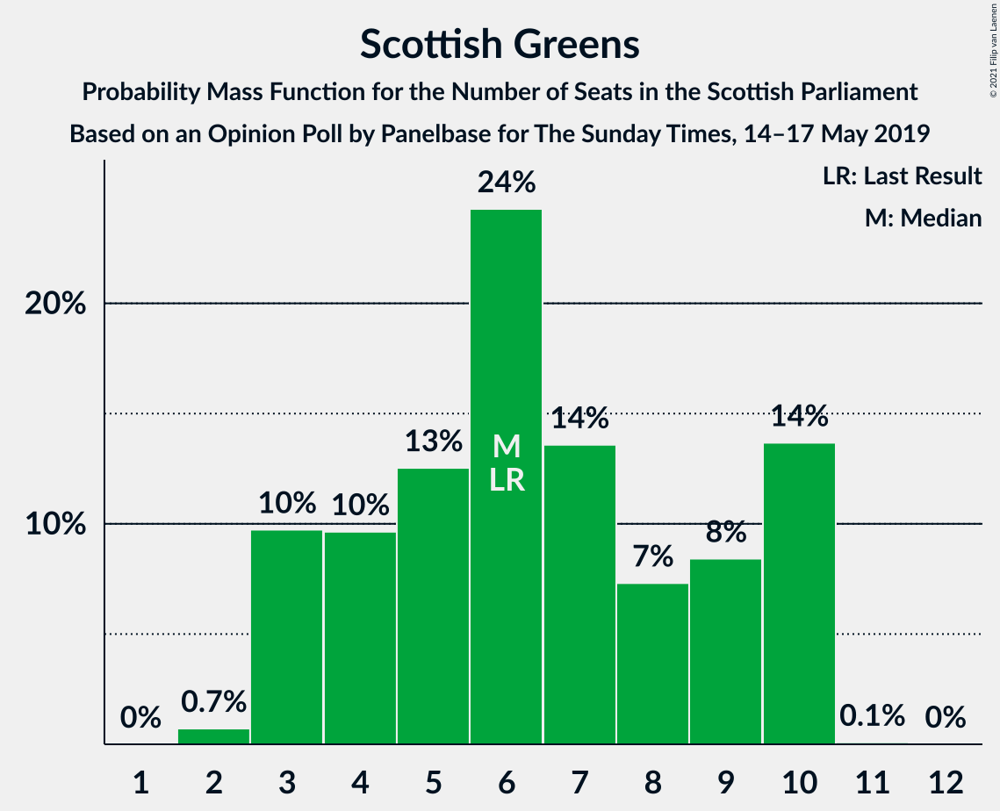
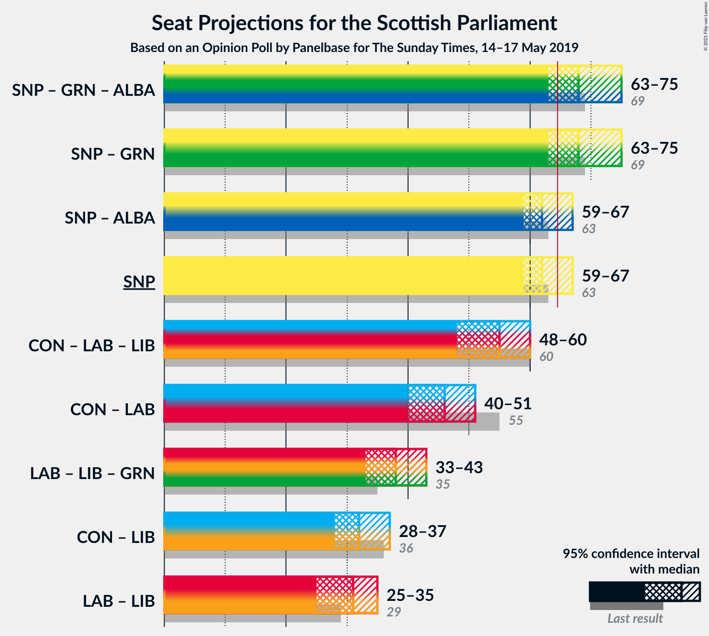
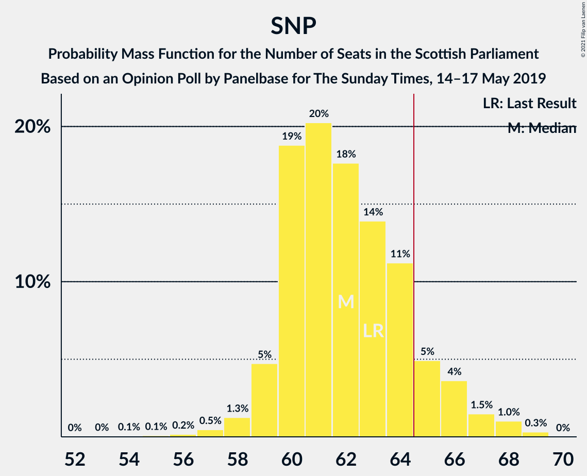

# Opinion Poll by Panelbase for The Sunday Times, 14–17 May 2019

<a href="#voting-intentions">Voting Intentions</a> | <a href="#seats">Seats</a> | <a href="#coalitions">Coalitions</a> | <a href="#technical-information">Technical Information</a>

## Voting Intentions

### Confidence Intervals

| Party | Last Result | Poll Result | 80% Confidence Interval | 90% Confidence Interval | 95% Confidence Interval | 99% Confidence Interval |
|:-----:|:-----------:|:-----------:|:-----------------------:|:-----------------------:|:-----------------------:|:-----------------------:|
| Scottish National Party | 41.7% | 37.4% | 35.5–39.4% |35.0–39.9% |34.5–40.4% |33.6–41.4% |
| Scottish Conservative & Unionist Party | 22.9% | 19.2% | 17.7–20.9% |17.3–21.3% |16.9–21.7% |16.2–22.5% |
| Scottish Labour | 19.1% | 18.2% | 16.7–19.8% |16.3–20.3% |16.0–20.7% |15.3–21.5% |
| Scottish Liberal Democrats | 5.2% | 8.1% | 7.1–9.3% |6.8–9.7% |6.6–10.0% |6.1–10.6% |
| Scottish Greens | 6.6% | 7.1% | 6.1–8.2% |5.9–8.5% |5.6–8.8% |5.2–9.4% |
| Reform UK | 0.0% | 6.1% | 5.2–7.1% |5.0–7.5% |4.8–7.7% |4.4–8.3% |
| UK Independence Party | 2.0% | 2.1% | 1.6–2.8% |1.4–3.0% |1.3–3.1% |1.2–3.5% |

*Note:* The poll result column reflects the actual value used in the calculations. Published results may vary slightly, and in addition be rounded to fewer digits.

## Seats

### Confidence Intervals

| Party | Last Result | Median | 80% Confidence Interval | 90% Confidence Interval | 95% Confidence Interval | 99% Confidence Interval |
|:-----:|:-----------:|:------:|:-----------------------:|:-----------------------:|:-----------------------:|:-----------------------:|
| <a href="#scottish-national-party">Scottish National Party</a> | 63 | 62 | 59–64 |59–65 |58–65 |55–67 |
| <a href="#scottish-conservative-&-unionist-party">Scottish Conservative & Unionist Party</a> | 31 | 24 | 21–26 |20–27 |20–27 |19–29 |
| <a href="#scottish-labour">Scottish Labour</a> | 24 | 22 | 20–25 |19–26 |18–27 |17–27 |
| <a href="#scottish-liberal-democrats">Scottish Liberal Democrats</a> | 5 | 8 | 6–9 |6–10 |6–11 |5–12 |
| <a href="#scottish-greens">Scottish Greens</a> | 6 | 7 | 4–10 |3–10 |3–10 |2–10 |
| <a href="#reform-uk">Reform UK</a> | 0 | 5 | 4–8 |3–8 |1–8 |0–8 |
| <a href="#uk-independence-party">UK Independence Party</a> | 0 | 0 | 0 |0 |0 |0 |

### Scottish National Party

*For a full overview of the results for this party, see the [Scottish National Party](party-scottishnationalparty.html) page.*

| Number of Seats | Probability | Accumulated | Special Marks |
|:---------------:|:-----------:|:-----------:|:-------------:|
| 53 | 0.1% | 100% |  |
| 54 | 0.2% | 99.9% |  |
| 55 | 0.3% | 99.7% |  |
| 56 | 0.5% | 99.4% |  |
| 57 | 0.7% | 98.9% |  |
| 58 | 1.4% | 98% |  |
| 59 | 8% | 97% |  |
| 60 | 11% | 89% |  |
| 61 | 17% | 78% |  |
| 62 | 46% | 61% | Median |
| 63 | 5% | 16% | Last Result |
| 64 | 4% | 11% |  |
| 65 | 4% | 6% | Majority |
| 66 | 1.4% | 2% |  |
| 67 | 0.7% | 1.1% |  |
| 68 | 0.3% | 0.3% |  |
| 69 | 0% | 0% |  |

### Scottish Conservative & Unionist Party

*For a full overview of the results for this party, see the [Scottish Conservative & Unionist Party](party-scottishconservativeunionistparty.html) page.*

| Number of Seats | Probability | Accumulated | Special Marks |
|:---------------:|:-----------:|:-----------:|:-------------:|
| 17 | 0.1% | 100% |  |
| 18 | 0.2% | 99.9% |  |
| 19 | 0.5% | 99.7% |  |
| 20 | 6% | 99.2% |  |
| 21 | 4% | 93% |  |
| 22 | 11% | 89% |  |
| 23 | 15% | 78% |  |
| 24 | 21% | 63% | Median |
| 25 | 28% | 42% |  |
| 26 | 6% | 14% |  |
| 27 | 5% | 8% |  |
| 28 | 2% | 2% |  |
| 29 | 0.4% | 0.8% |  |
| 30 | 0.3% | 0.4% |  |
| 31 | 0% | 0.1% | Last Result |
| 32 | 0% | 0.1% |  |
| 33 | 0% | 0% |  |

### Scottish Labour

*For a full overview of the results for this party, see the [Scottish Labour](party-scottishlabour.html) page.*

| Number of Seats | Probability | Accumulated | Special Marks |
|:---------------:|:-----------:|:-----------:|:-------------:|
| 16 | 0% | 100% |  |
| 17 | 0.6% | 99.9% |  |
| 18 | 2% | 99.3% |  |
| 19 | 5% | 97% |  |
| 20 | 2% | 91% |  |
| 21 | 5% | 90% |  |
| 22 | 36% | 85% | Median |
| 23 | 28% | 48% |  |
| 24 | 7% | 20% | Last Result |
| 25 | 6% | 13% |  |
| 26 | 3% | 7% |  |
| 27 | 4% | 5% |  |
| 28 | 0.3% | 0.4% |  |
| 29 | 0.1% | 0.2% |  |
| 30 | 0% | 0.1% |  |
| 31 | 0% | 0% |  |

### Scottish Liberal Democrats

*For a full overview of the results for this party, see the [Scottish Liberal Democrats](party-scottishliberaldemocrats.html) page.*

| Number of Seats | Probability | Accumulated | Special Marks |
|:---------------:|:-----------:|:-----------:|:-------------:|
| 5 | 2% | 100% | Last Result |
| 6 | 11% | 98% |  |
| 7 | 19% | 87% |  |
| 8 | 36% | 68% | Median |
| 9 | 22% | 32% |  |
| 10 | 5% | 10% |  |
| 11 | 3% | 5% |  |
| 12 | 1.4% | 2% |  |
| 13 | 0.3% | 0.3% |  |
| 14 | 0% | 0% |  |

### Scottish Greens

*For a full overview of the results for this party, see the [Scottish Greens](party-scottishgreens.html) page.*

| Number of Seats | Probability | Accumulated | Special Marks |
|:---------------:|:-----------:|:-----------:|:-------------:|
| 2 | 0.7% | 100% |  |
| 3 | 8% | 99.3% |  |
| 4 | 5% | 92% |  |
| 5 | 7% | 87% |  |
| 6 | 18% | 80% | Last Result |
| 7 | 21% | 62% | Median |
| 8 | 15% | 41% |  |
| 9 | 12% | 26% |  |
| 10 | 14% | 14% |  |
| 11 | 0% | 0% |  |

### Reform UK

*For a full overview of the results for this party, see the [Reform UK](party-reformuk.html) page.*

| Number of Seats | Probability | Accumulated | Special Marks |
|:---------------:|:-----------:|:-----------:|:-------------:|
| 0 | 0.6% | 100% | Last Result |
| 1 | 2% | 99.4% |  |
| 2 | 2% | 97% |  |
| 3 | 2% | 96% |  |
| 4 | 5% | 94% |  |
| 5 | 40% | 89% | Median |
| 6 | 8% | 49% |  |
| 7 | 13% | 41% |  |
| 8 | 28% | 28% |  |
| 9 | 0% | 0% |  |

### UK Independence Party

*For a full overview of the results for this party, see the [UK Independence Party](party-ukindependenceparty.html) page.*

| Number of Seats | Probability | Accumulated | Special Marks |
|:---------------:|:-----------:|:-----------:|:-------------:|
| 0 | 100% | 100% | Last Result, Median |

## Coalitions

### Confidence Intervals

| Coalition | Last Result | Median | Majority? | 80% Confidence Interval | 90% Confidence Interval | 95% Confidence Interval | 99% Confidence Interval |
|:---------:|:-----------:|:------:|:---------:|:-----------------------:|:-----------------------:|:-----------------------:|:-----------------------:|
| Scottish National Party – Scottish Greens | 69 | 69 | 92% | 65–72 | 64–72 | 63–73 | 61–75 |
| Scottish National Party | 63 | 62 | 6% | 59–64 | 59–65 | 58–65 | 55–67 |
| Scottish Conservative & Unionist Party – Scottish Labour – Scottish Liberal Democrats | 60 | 54 | 0.1% | 51–58 | 49–59 | 49–60 | 49–62 |
| Scottish Conservative & Unionist Party – Scottish Labour | 55 | 47 | 0% | 43–50 | 42–51 | 41–51 | 39–53 |
| Scottish Labour – Scottish Liberal Democrats – Scottish Greens | 35 | 38 | 0% | 34–40 | 34–41 | 33–42 | 32–44 |
| Scottish Conservative & Unionist Party – Scottish Liberal Democrats | 36 | 31 | 0% | 29–35 | 28–36 | 27–36 | 27–38 |
| Scottish Labour – Scottish Liberal Democrats | 29 | 31 | 0% | 28–33 | 26–35 | 25–35 | 24–37 |

### Scottish National Party – Scottish Greens

| Number of Seats | Probability | Accumulated | Special Marks |
|:---------------:|:-----------:|:-----------:|:-------------:|
| 59 | 0% | 100% |  |
| 60 | 0.1% | 99.9% |  |
| 61 | 0.5% | 99.8% |  |
| 62 | 0.5% | 99.3% |  |
| 63 | 3% | 98.8% |  |
| 64 | 5% | 96% |  |
| 65 | 4% | 92% | Majority |
| 66 | 8% | 87% |  |
| 67 | 3% | 79% |  |
| 68 | 25% | 76% |  |
| 69 | 14% | 51% | Last Result, Median |
| 70 | 15% | 37% |  |
| 71 | 10% | 22% |  |
| 72 | 9% | 12% |  |
| 73 | 0.8% | 3% |  |
| 74 | 1.2% | 2% |  |
| 75 | 0.9% | 1.2% |  |
| 76 | 0.2% | 0.3% |  |
| 77 | 0.1% | 0.1% |  |
| 78 | 0% | 0% |  |

### Scottish National Party

| Number of Seats | Probability | Accumulated | Special Marks |
|:---------------:|:-----------:|:-----------:|:-------------:|
| 53 | 0.1% | 100% |  |
| 54 | 0.2% | 99.9% |  |
| 55 | 0.3% | 99.7% |  |
| 56 | 0.5% | 99.4% |  |
| 57 | 0.7% | 98.9% |  |
| 58 | 1.4% | 98% |  |
| 59 | 8% | 97% |  |
| 60 | 11% | 89% |  |
| 61 | 17% | 78% |  |
| 62 | 46% | 61% | Median |
| 63 | 5% | 16% | Last Result |
| 64 | 4% | 11% |  |
| 65 | 4% | 6% | Majority |
| 66 | 1.4% | 2% |  |
| 67 | 0.7% | 1.1% |  |
| 68 | 0.3% | 0.3% |  |
| 69 | 0% | 0% |  |

### Scottish Conservative & Unionist Party – Scottish Labour – Scottish Liberal Democrats

| Number of Seats | Probability | Accumulated | Special Marks |
|:---------------:|:-----------:|:-----------:|:-------------:|
| 44 | 0.1% | 100% |  |
| 45 | 0.1% | 99.9% |  |
| 46 | 0% | 99.9% |  |
| 47 | 0.1% | 99.8% |  |
| 48 | 0.2% | 99.7% |  |
| 49 | 5% | 99.5% |  |
| 50 | 3% | 94% |  |
| 51 | 5% | 92% |  |
| 52 | 11% | 87% |  |
| 53 | 18% | 76% |  |
| 54 | 9% | 59% | Median |
| 55 | 7% | 50% |  |
| 56 | 21% | 43% |  |
| 57 | 8% | 22% |  |
| 58 | 7% | 14% |  |
| 59 | 3% | 7% |  |
| 60 | 2% | 4% | Last Result |
| 61 | 0.8% | 1.5% |  |
| 62 | 0.4% | 0.7% |  |
| 63 | 0.1% | 0.3% |  |
| 64 | 0.1% | 0.2% |  |
| 65 | 0% | 0.1% | Majority |
| 66 | 0% | 0% |  |

### Scottish Conservative & Unionist Party – Scottish Labour

| Number of Seats | Probability | Accumulated | Special Marks |
|:---------------:|:-----------:|:-----------:|:-------------:|
| 38 | 0.3% | 100% |  |
| 39 | 1.0% | 99.7% |  |
| 40 | 0.3% | 98.7% |  |
| 41 | 1.0% | 98% |  |
| 42 | 6% | 97% |  |
| 43 | 5% | 91% |  |
| 44 | 8% | 87% |  |
| 45 | 8% | 79% |  |
| 46 | 19% | 71% | Median |
| 47 | 20% | 52% |  |
| 48 | 14% | 32% |  |
| 49 | 4% | 18% |  |
| 50 | 9% | 14% |  |
| 51 | 4% | 5% |  |
| 52 | 0.7% | 2% |  |
| 53 | 0.5% | 0.8% |  |
| 54 | 0.1% | 0.4% |  |
| 55 | 0.1% | 0.3% | Last Result |
| 56 | 0.1% | 0.1% |  |
| 57 | 0% | 0.1% |  |
| 58 | 0% | 0% |  |

### Scottish Labour – Scottish Liberal Democrats – Scottish Greens

| Number of Seats | Probability | Accumulated | Special Marks |
|:---------------:|:-----------:|:-----------:|:-------------:|
| 31 | 0.1% | 100% |  |
| 32 | 1.4% | 99.9% |  |
| 33 | 3% | 98.5% |  |
| 34 | 8% | 96% |  |
| 35 | 5% | 88% | Last Result |
| 36 | 13% | 82% |  |
| 37 | 17% | 70% | Median |
| 38 | 18% | 53% |  |
| 39 | 14% | 34% |  |
| 40 | 10% | 20% |  |
| 41 | 5% | 10% |  |
| 42 | 3% | 4% |  |
| 43 | 1.0% | 2% |  |
| 44 | 0.7% | 0.9% |  |
| 45 | 0.2% | 0.2% |  |
| 46 | 0% | 0.1% |  |
| 47 | 0% | 0% |  |

### Scottish Conservative & Unionist Party – Scottish Liberal Democrats

| Number of Seats | Probability | Accumulated | Special Marks |
|:---------------:|:-----------:|:-----------:|:-------------:|
| 23 | 0% | 100% |  |
| 24 | 0% | 99.9% |  |
| 25 | 0.1% | 99.9% |  |
| 26 | 0.1% | 99.8% |  |
| 27 | 3% | 99.7% |  |
| 28 | 3% | 97% |  |
| 29 | 4% | 94% |  |
| 30 | 17% | 89% |  |
| 31 | 23% | 72% |  |
| 32 | 7% | 49% | Median |
| 33 | 13% | 42% |  |
| 34 | 15% | 28% |  |
| 35 | 8% | 13% |  |
| 36 | 4% | 6% | Last Result |
| 37 | 0.4% | 1.2% |  |
| 38 | 0.5% | 0.8% |  |
| 39 | 0.2% | 0.4% |  |
| 40 | 0.1% | 0.2% |  |
| 41 | 0% | 0.1% |  |
| 42 | 0% | 0% |  |

### Scottish Labour – Scottish Liberal Democrats

| Number of Seats | Probability | Accumulated | Special Marks |
|:---------------:|:-----------:|:-----------:|:-------------:|
| 24 | 0.6% | 100% |  |
| 25 | 2% | 99.3% |  |
| 26 | 3% | 97% |  |
| 27 | 1.3% | 95% |  |
| 28 | 9% | 93% |  |
| 29 | 11% | 84% | Last Result |
| 30 | 8% | 73% | Median |
| 31 | 42% | 64% |  |
| 32 | 8% | 22% |  |
| 33 | 5% | 14% |  |
| 34 | 3% | 9% |  |
| 35 | 4% | 6% |  |
| 36 | 1.3% | 2% |  |
| 37 | 0.7% | 0.8% |  |
| 38 | 0.1% | 0.1% |  |
| 39 | 0% | 0.1% |  |
| 40 | 0% | 0% |  |

## Technical Information

### Opinion Poll

+ **Polling firm:** Panelbase
+ **Commissioner(s):** The Sunday Times
+ **Fieldwork period:** 14–17 May 2019

### Calculations

+ **Sample size:** 1021
+ **Simulations done:** 131,072
+ **Error estimate:** 2.12%

