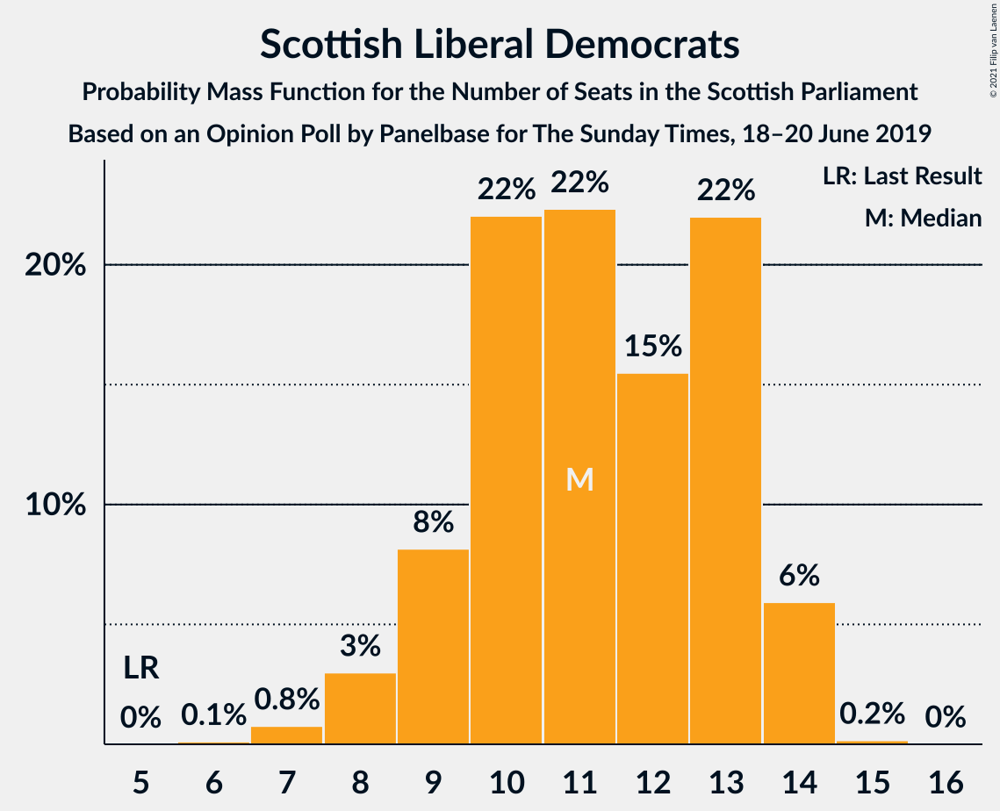
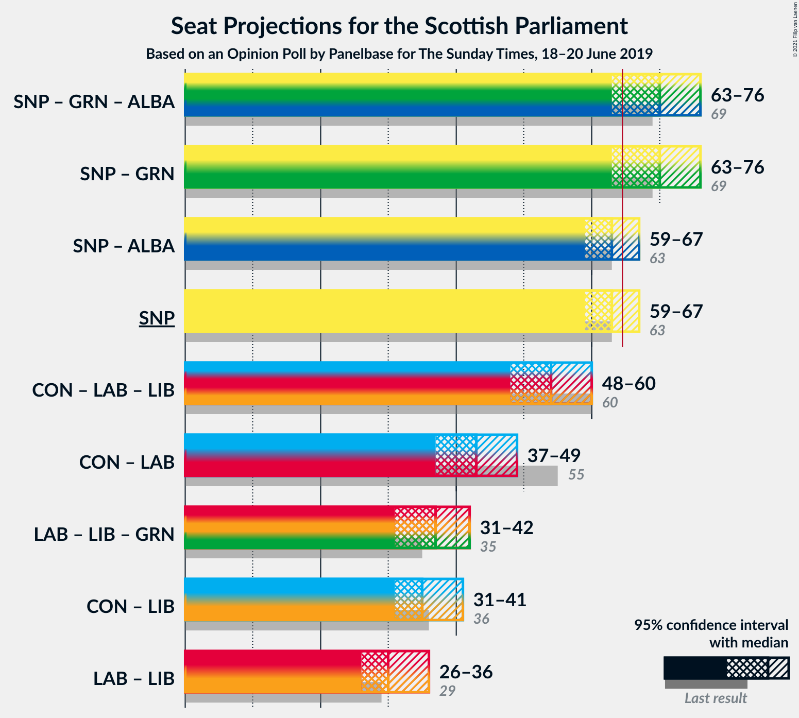
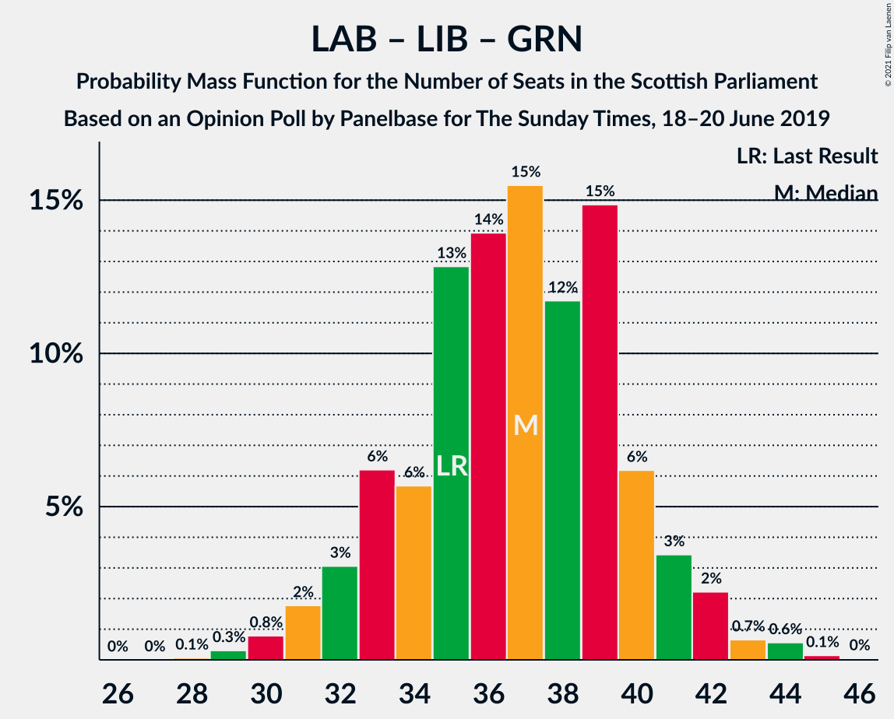

# Opinion Poll by Panelbase for The Sunday Times, 18–20 June 2019

<a href="#voting-intentions">Voting Intentions</a> | <a href="#seats">Seats</a> | <a href="#coalitions">Coalitions</a> | <a href="#technical-information">Technical Information</a>

## Voting Intentions

### Confidence Intervals

| Party | Last Result | Poll Result | 80% Confidence Interval | 90% Confidence Interval | 95% Confidence Interval | 99% Confidence Interval |
|:-----:|:-----------:|:-----------:|:-----------------------:|:-----------------------:|:-----------------------:|:-----------------------:|
| Scottish National Party | 41.7% | 39.6% | 37.6–41.5% |37.1–42.1% |36.6–42.6% |35.7–43.5% |
| Scottish Conservative & Unionist Party | 22.9% | 20.3% | 18.8–22.0% |18.3–22.5% |18.0–22.9% |17.2–23.7% |
| Scottish Labour | 19.1% | 16.2% | 14.8–17.8% |14.4–18.2% |14.1–18.6% |13.4–19.4% |
| Scottish Liberal Democrats | 5.2% | 10.2% | 9.0–11.5% |8.7–11.8% |8.4–12.2% |7.9–12.8% |
| Scottish Greens | 6.6% | 7.1% | 6.2–8.3% |5.9–8.6% |5.7–8.9% |5.3–9.4% |
| Reform UK | 0.0% | 6.1% | 5.2–7.1% |5.0–7.4% |4.7–7.7% |4.4–8.2% |
| UK Independence Party | 2.0% | 0.3% | 0.2–0.7% |0.1–0.8% |0.1–0.9% |0.1–1.1% |

*Note:* The poll result column reflects the actual value used in the calculations. Published results may vary slightly, and in addition be rounded to fewer digits.

## Seats

### Confidence Intervals

| Party | Last Result | Median | 80% Confidence Interval | 90% Confidence Interval | 95% Confidence Interval | 99% Confidence Interval |
|:-----:|:-----------:|:------:|:-----------------------:|:-----------------------:|:-----------------------:|:-----------------------:|
| <a href="#scottish-national-party">Scottish National Party</a> | 63 | 62 | 60–64 |60–66 |60–67 |57–67 |
| <a href="#scottish-conservative-&-unionist-party">Scottish Conservative & Unionist Party</a> | 31 | 24 | 21–26 |20–28 |20–29 |19–31 |
| <a href="#scottish-labour">Scottish Labour</a> | 24 | 19 | 17–22 |17–23 |16–23 |15–25 |
| <a href="#scottish-liberal-democrats">Scottish Liberal Democrats</a> | 5 | 11 | 9–13 |9–13 |8–14 |7–15 |
| <a href="#scottish-greens">Scottish Greens</a> | 6 | 8 | 3–10 |3–10 |3–10 |3–10 |
| <a href="#reform-uk">Reform UK</a> | 0 | 5 | 4–8 |2–8 |1–8 |0–8 |
| <a href="#uk-independence-party">UK Independence Party</a> | 0 | 0 | 0 |0 |0 |0 |

### Scottish National Party

*For a full overview of the results for this party, see the [Scottish National Party](party-scottishnationalparty.html) page.*

| Number of Seats | Probability | Accumulated | Special Marks |
|:---------------:|:-----------:|:-----------:|:-------------:|
| 54 | 0.1% | 100% |  |
| 55 | 0.1% | 99.9% |  |
| 56 | 0.1% | 99.8% |  |
| 57 | 0.4% | 99.7% |  |
| 58 | 0.5% | 99.3% |  |
| 59 | 1.0% | 98.8% |  |
| 60 | 15% | 98% |  |
| 61 | 29% | 82% |  |
| 62 | 27% | 53% | Median |
| 63 | 10% | 26% | Last Result |
| 64 | 9% | 16% |  |
| 65 | 1.0% | 7% | Majority |
| 66 | 2% | 6% |  |
| 67 | 4% | 4% |  |
| 68 | 0.3% | 0.3% |  |
| 69 | 0% | 0% |  |

### Scottish Conservative & Unionist Party

*For a full overview of the results for this party, see the [Scottish Conservative & Unionist Party](party-scottishconservativeunionistparty.html) page.*

| Number of Seats | Probability | Accumulated | Special Marks |
|:---------------:|:-----------:|:-----------:|:-------------:|
| 18 | 0.3% | 100% |  |
| 19 | 0.8% | 99.7% |  |
| 20 | 7% | 98.9% |  |
| 21 | 3% | 92% |  |
| 22 | 5% | 89% |  |
| 23 | 6% | 84% |  |
| 24 | 34% | 78% | Median |
| 25 | 25% | 44% |  |
| 26 | 12% | 19% |  |
| 27 | 2% | 8% |  |
| 28 | 2% | 5% |  |
| 29 | 0.9% | 3% |  |
| 30 | 1.1% | 2% |  |
| 31 | 0.7% | 0.8% | Last Result |
| 32 | 0% | 0.1% |  |
| 33 | 0% | 0% |  |

### Scottish Labour

*For a full overview of the results for this party, see the [Scottish Labour](party-scottishlabour.html) page.*

| Number of Seats | Probability | Accumulated | Special Marks |
|:---------------:|:-----------:|:-----------:|:-------------:|
| 15 | 0.6% | 100% |  |
| 16 | 2% | 99.4% |  |
| 17 | 26% | 97% |  |
| 18 | 11% | 72% |  |
| 19 | 16% | 60% | Median |
| 20 | 10% | 44% |  |
| 21 | 10% | 35% |  |
| 22 | 19% | 24% |  |
| 23 | 5% | 6% |  |
| 24 | 0.3% | 0.8% | Last Result |
| 25 | 0.4% | 0.5% |  |
| 26 | 0.1% | 0.1% |  |
| 27 | 0% | 0% |  |

### Scottish Liberal Democrats

*For a full overview of the results for this party, see the [Scottish Liberal Democrats](party-scottishliberaldemocrats.html) page.*

| Number of Seats | Probability | Accumulated | Special Marks |
|:---------------:|:-----------:|:-----------:|:-------------:|
| 5 | 0% | 100% | Last Result |
| 6 | 0.1% | 100% |  |
| 7 | 0.9% | 99.9% |  |
| 8 | 3% | 99.0% |  |
| 9 | 15% | 96% |  |
| 10 | 28% | 81% |  |
| 11 | 29% | 52% | Median |
| 12 | 8% | 24% |  |
| 13 | 13% | 15% |  |
| 14 | 2% | 3% |  |
| 15 | 0.6% | 0.6% |  |
| 16 | 0% | 0% |  |

### Scottish Greens

*For a full overview of the results for this party, see the [Scottish Greens](party-scottishgreens.html) page.*

| Number of Seats | Probability | Accumulated | Special Marks |
|:---------------:|:-----------:|:-----------:|:-------------:|
| 2 | 0.5% | 100% |  |
| 3 | 14% | 99.5% |  |
| 4 | 5% | 85% |  |
| 5 | 11% | 80% |  |
| 6 | 4% | 69% | Last Result |
| 7 | 5% | 65% |  |
| 8 | 22% | 60% | Median |
| 9 | 7% | 38% |  |
| 10 | 30% | 30% |  |
| 11 | 0.1% | 0.1% |  |
| 12 | 0% | 0% |  |

### Reform UK

*For a full overview of the results for this party, see the [Reform UK](party-reformuk.html) page.*

| Number of Seats | Probability | Accumulated | Special Marks |
|:---------------:|:-----------:|:-----------:|:-------------:|
| 0 | 1.3% | 100% | Last Result |
| 1 | 1.2% | 98.7% |  |
| 2 | 4% | 97% |  |
| 3 | 1.1% | 94% |  |
| 4 | 15% | 93% |  |
| 5 | 31% | 78% | Median |
| 6 | 17% | 46% |  |
| 7 | 16% | 30% |  |
| 8 | 14% | 14% |  |
| 9 | 0% | 0% |  |

### UK Independence Party

*For a full overview of the results for this party, see the [UK Independence Party](party-ukindependenceparty.html) page.*

| Number of Seats | Probability | Accumulated | Special Marks |
|:---------------:|:-----------:|:-----------:|:-------------:|
| 0 | 100% | 100% | Last Result, Median |

## Coalitions

### Confidence Intervals

| Coalition | Last Result | Median | Majority? | 80% Confidence Interval | 90% Confidence Interval | 95% Confidence Interval | 99% Confidence Interval |
|:---------:|:-----------:|:------:|:---------:|:-----------------------:|:-----------------------:|:-----------------------:|:-----------------------:|
| Scottish National Party – Scottish Greens | 69 | 70 | 93% | 65–72 | 64–73 | 63–76 | 62–77 |
| Scottish National Party | 63 | 62 | 7% | 60–64 | 60–66 | 60–67 | 57–67 |
| Scottish Conservative & Unionist Party – Scottish Labour – Scottish Liberal Democrats | 60 | 54 | 0% | 51–58 | 51–59 | 49–59 | 46–61 |
| Scottish Conservative & Unionist Party – Scottish Labour | 55 | 43 | 0% | 40–47 | 40–48 | 39–49 | 36–50 |
| Scottish Labour – Scottish Liberal Democrats – Scottish Greens | 35 | 38 | 0% | 34–40 | 34–40 | 32–41 | 30–43 |
| Scottish Conservative & Unionist Party – Scottish Liberal Democrats | 36 | 35 | 0% | 32–38 | 31–38 | 31–39 | 29–42 |
| Scottish Labour – Scottish Liberal Democrats | 29 | 30 | 0% | 27–34 | 27–34 | 26–35 | 25–36 |

### Scottish National Party – Scottish Greens

| Number of Seats | Probability | Accumulated | Special Marks |
|:---------------:|:-----------:|:-----------:|:-------------:|
| 60 | 0.1% | 100% |  |
| 61 | 0.1% | 99.9% |  |
| 62 | 0.5% | 99.9% |  |
| 63 | 3% | 99.4% |  |
| 64 | 2% | 96% |  |
| 65 | 11% | 93% | Majority |
| 66 | 7% | 82% |  |
| 67 | 6% | 76% |  |
| 68 | 6% | 70% |  |
| 69 | 6% | 64% | Last Result |
| 70 | 15% | 58% | Median |
| 71 | 24% | 43% |  |
| 72 | 12% | 19% |  |
| 73 | 3% | 7% |  |
| 74 | 0.8% | 4% |  |
| 75 | 0.7% | 3% |  |
| 76 | 2% | 3% |  |
| 77 | 0.8% | 0.9% |  |
| 78 | 0% | 0% |  |

### Scottish National Party

| Number of Seats | Probability | Accumulated | Special Marks |
|:---------------:|:-----------:|:-----------:|:-------------:|
| 54 | 0.1% | 100% |  |
| 55 | 0.1% | 99.9% |  |
| 56 | 0.1% | 99.8% |  |
| 57 | 0.4% | 99.7% |  |
| 58 | 0.5% | 99.3% |  |
| 59 | 1.0% | 98.8% |  |
| 60 | 15% | 98% |  |
| 61 | 29% | 82% |  |
| 62 | 27% | 53% | Median |
| 63 | 10% | 26% | Last Result |
| 64 | 9% | 16% |  |
| 65 | 1.0% | 7% | Majority |
| 66 | 2% | 6% |  |
| 67 | 4% | 4% |  |
| 68 | 0.3% | 0.3% |  |
| 69 | 0% | 0% |  |

### Scottish Conservative & Unionist Party – Scottish Labour – Scottish Liberal Democrats

| Number of Seats | Probability | Accumulated | Special Marks |
|:---------------:|:-----------:|:-----------:|:-------------:|
| 46 | 0.6% | 100% |  |
| 47 | 0.5% | 99.4% |  |
| 48 | 0.5% | 98.9% |  |
| 49 | 1.1% | 98% |  |
| 50 | 2% | 97% |  |
| 51 | 9% | 95% |  |
| 52 | 18% | 86% |  |
| 53 | 13% | 68% |  |
| 54 | 6% | 55% | Median |
| 55 | 16% | 49% |  |
| 56 | 11% | 33% |  |
| 57 | 7% | 23% |  |
| 58 | 6% | 16% |  |
| 59 | 7% | 9% |  |
| 60 | 1.0% | 2% | Last Result |
| 61 | 0.8% | 1.2% |  |
| 62 | 0.2% | 0.4% |  |
| 63 | 0.1% | 0.2% |  |
| 64 | 0.1% | 0.1% |  |
| 65 | 0% | 0% | Majority |

### Scottish Conservative & Unionist Party – Scottish Labour

| Number of Seats | Probability | Accumulated | Special Marks |
|:---------------:|:-----------:|:-----------:|:-------------:|
| 34 | 0.1% | 100% |  |
| 35 | 0.1% | 99.9% |  |
| 36 | 0.5% | 99.8% |  |
| 37 | 0.4% | 99.2% |  |
| 38 | 1.0% | 98.8% |  |
| 39 | 2% | 98% |  |
| 40 | 9% | 96% |  |
| 41 | 14% | 87% |  |
| 42 | 9% | 73% |  |
| 43 | 17% | 64% | Median |
| 44 | 6% | 47% |  |
| 45 | 11% | 41% |  |
| 46 | 13% | 30% |  |
| 47 | 9% | 17% |  |
| 48 | 5% | 8% |  |
| 49 | 2% | 3% |  |
| 50 | 0.9% | 1.2% |  |
| 51 | 0.1% | 0.3% |  |
| 52 | 0.1% | 0.1% |  |
| 53 | 0% | 0.1% |  |
| 54 | 0% | 0% |  |
| 55 | 0% | 0% | Last Result |

### Scottish Labour – Scottish Liberal Democrats – Scottish Greens

| Number of Seats | Probability | Accumulated | Special Marks |
|:---------------:|:-----------:|:-----------:|:-------------:|
| 29 | 0.2% | 100% |  |
| 30 | 0.3% | 99.8% |  |
| 31 | 0.4% | 99.5% |  |
| 32 | 3% | 99.1% |  |
| 33 | 1.2% | 96% |  |
| 34 | 9% | 95% |  |
| 35 | 7% | 86% | Last Result |
| 36 | 14% | 79% |  |
| 37 | 10% | 65% |  |
| 38 | 16% | 55% | Median |
| 39 | 25% | 40% |  |
| 40 | 10% | 14% |  |
| 41 | 3% | 5% |  |
| 42 | 1.4% | 2% |  |
| 43 | 0.5% | 0.5% |  |
| 44 | 0% | 0% |  |

### Scottish Conservative & Unionist Party – Scottish Liberal Democrats

| Number of Seats | Probability | Accumulated | Special Marks |
|:---------------:|:-----------:|:-----------:|:-------------:|
| 28 | 0.3% | 100% |  |
| 29 | 1.2% | 99.7% |  |
| 30 | 0.6% | 98% |  |
| 31 | 6% | 98% |  |
| 32 | 3% | 92% |  |
| 33 | 14% | 89% |  |
| 34 | 18% | 74% |  |
| 35 | 20% | 56% | Median |
| 36 | 10% | 37% | Last Result |
| 37 | 14% | 27% |  |
| 38 | 8% | 13% |  |
| 39 | 2% | 4% |  |
| 40 | 0.8% | 2% |  |
| 41 | 0.9% | 1.4% |  |
| 42 | 0.1% | 0.5% |  |
| 43 | 0.2% | 0.5% |  |
| 44 | 0.2% | 0.2% |  |
| 45 | 0% | 0% |  |

### Scottish Labour – Scottish Liberal Democrats

| Number of Seats | Probability | Accumulated | Special Marks |
|:---------------:|:-----------:|:-----------:|:-------------:|
| 24 | 0.3% | 100% |  |
| 25 | 1.3% | 99.7% |  |
| 26 | 2% | 98% |  |
| 27 | 13% | 96% |  |
| 28 | 11% | 84% |  |
| 29 | 14% | 73% | Last Result |
| 30 | 13% | 58% | Median |
| 31 | 22% | 45% |  |
| 32 | 10% | 24% |  |
| 33 | 2% | 14% |  |
| 34 | 8% | 12% |  |
| 35 | 3% | 4% |  |
| 36 | 0.6% | 0.7% |  |
| 37 | 0% | 0.1% |  |
| 38 | 0% | 0.1% |  |
| 39 | 0% | 0% |  |

## Technical Information

### Opinion Poll

+ **Polling firm:** Panelbase
+ **Commissioner(s):** The Sunday Times
+ **Fieldwork period:** 18–20 June 2019

### Calculations

+ **Sample size:** 1024
+ **Simulations done:** 131,072
+ **Error estimate:** 1.60%

