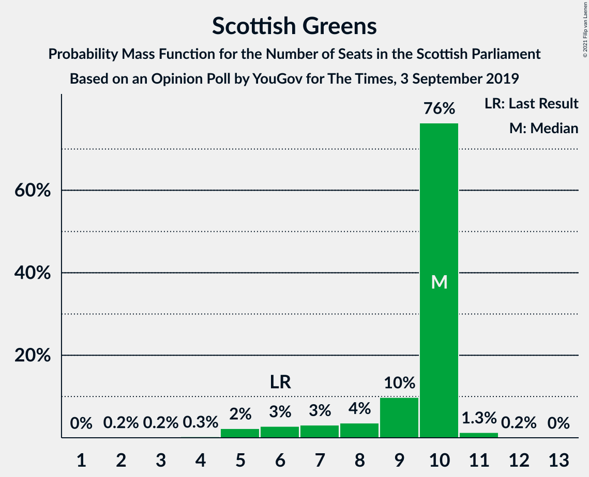
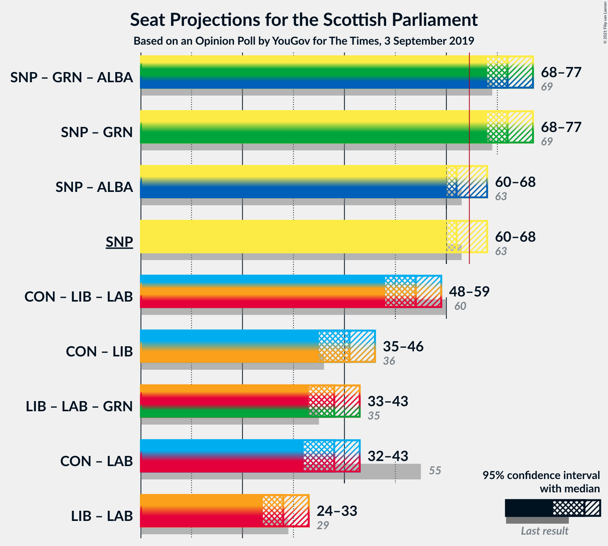

# Opinion Poll by YouGov for The Times, 3 September 2019

<a href="#voting-intentions">Voting Intentions</a> | <a href="#seats">Seats</a> | <a href="#coalitions">Coalitions</a> | <a href="#technical-information">Technical Information</a>

## Voting Intentions

### Confidence Intervals

| Party | Last Result | Poll Result | 80% Confidence Interval | 90% Confidence Interval | 95% Confidence Interval | 99% Confidence Interval |
|:-----:|:-----------:|:-----------:|:-----------------------:|:-----------------------:|:-----------------------:|:-----------------------:|
| Scottish National Party | 41.7% | 38.9% | 37.0–40.9% |36.5–41.4% |36.0–41.9% |35.1–42.8% |
| Scottish Conservative & Unionist Party | 22.9% | 19.9% | 18.4–21.6% |18.0–22.0% |17.6–22.5% |16.9–23.3% |
| Scottish Liberal Democrats | 5.2% | 12.9% | 11.7–14.4% |11.3–14.8% |11.1–15.1% |10.5–15.8% |
| Scottish Labour | 19.1% | 11.0% | 9.8–12.3% |9.5–12.7% |9.2–13.0% |8.7–13.6% |
| Scottish Greens | 6.6% | 8.0% | 7.0–9.2% |6.8–9.5% |6.5–9.8% |6.1–10.4% |
| Reform UK | 0.0% | 5.0% | 4.2–6.0% |4.0–6.2% |3.8–6.5% |3.5–7.0% |
| Scottish Socialist Party | 0.5% | 3.0% | 2.4–3.8% |2.3–4.0% |2.1–4.2% |1.9–4.6% |
| UK Independence Party | 2.0% | 1.0% | 0.7–1.6% |0.6–1.7% |0.6–1.9% |0.5–2.1% |

*Note:* The poll result column reflects the actual value used in the calculations. Published results may vary slightly, and in addition be rounded to fewer digits.

## Seats

### Confidence Intervals

| Party | Last Result | Median | 80% Confidence Interval | 90% Confidence Interval | 95% Confidence Interval | 99% Confidence Interval |
|:-----:|:-----------:|:------:|:-----------------------:|:-----------------------:|:-----------------------:|:-----------------------:|
| <a href="#scottish-national-party">Scottish National Party</a> | 63 | 60 | 60–64 |58–65 |56–66 |55–67 |
| <a href="#scottish-conservative-&-unionist-party">Scottish Conservative & Unionist Party</a> | 31 | 26 | 23–29 |21–29 |21–31 |21–31 |
| <a href="#scottish-liberal-democrats">Scottish Liberal Democrats</a> | 5 | 15 | 13–18 |13–19 |13–20 |12–21 |
| <a href="#scottish-labour">Scottish Labour</a> | 24 | 14 | 11–16 |11–17 |10–17 |9–17 |
| <a href="#scottish-greens">Scottish Greens</a> | 6 | 10 | 8–10 |7–10 |6–10 |4–11 |
| <a href="#reform-uk">Reform UK</a> | 0 | 4 | 0–7 |0–7 |0–8 |0–8 |
| <a href="#scottish-socialist-party">Scottish Socialist Party</a> | 0 | 0 | 0 |0 |0 |0 |
| <a href="#uk-independence-party">UK Independence Party</a> | 0 | 0 | 0 |0 |0 |0 |

### Scottish National Party

*For a full overview of the results for this party, see the [Scottish National Party](party-scottishnationalparty.html) page.*

| Number of Seats | Probability | Accumulated | Special Marks |
|:---------------:|:-----------:|:-----------:|:-------------:|
| 54 | 0.1% | 100% |  |
| 55 | 0.5% | 99.9% |  |
| 56 | 2% | 99.4% |  |
| 57 | 1.3% | 97% |  |
| 58 | 1.2% | 96% |  |
| 59 | 2% | 95% |  |
| 60 | 45% | 93% | Median |
| 61 | 10% | 48% |  |
| 62 | 12% | 38% |  |
| 63 | 14% | 26% | Last Result |
| 64 | 3% | 11% |  |
| 65 | 5% | 9% | Majority |
| 66 | 3% | 4% |  |
| 67 | 0.5% | 0.6% |  |
| 68 | 0.1% | 0.2% |  |
| 69 | 0.1% | 0.1% |  |
| 70 | 0% | 0% |  |

### Scottish Conservative & Unionist Party

*For a full overview of the results for this party, see the [Scottish Conservative & Unionist Party](party-scottishconservativeunionistparty.html) page.*

| Number of Seats | Probability | Accumulated | Special Marks |
|:---------------:|:-----------:|:-----------:|:-------------:|
| 20 | 0.2% | 100% |  |
| 21 | 7% | 99.8% |  |
| 22 | 2% | 93% |  |
| 23 | 6% | 91% |  |
| 24 | 16% | 85% |  |
| 25 | 4% | 69% |  |
| 26 | 44% | 65% | Median |
| 27 | 4% | 22% |  |
| 28 | 7% | 17% |  |
| 29 | 6% | 11% |  |
| 30 | 1.1% | 5% |  |
| 31 | 4% | 4% | Last Result |
| 32 | 0.1% | 0.1% |  |
| 33 | 0% | 0% |  |

### Scottish Liberal Democrats

*For a full overview of the results for this party, see the [Scottish Liberal Democrats](party-scottishliberaldemocrats.html) page.*

| Number of Seats | Probability | Accumulated | Special Marks |
|:---------------:|:-----------:|:-----------:|:-------------:|
| 5 | 0% | 100% | Last Result |
| 6 | 0% | 100% |  |
| 7 | 0% | 100% |  |
| 8 | 0% | 100% |  |
| 9 | 0% | 100% |  |
| 10 | 0% | 100% |  |
| 11 | 0.3% | 100% |  |
| 12 | 1.0% | 99.7% |  |
| 13 | 15% | 98.7% |  |
| 14 | 12% | 84% |  |
| 15 | 45% | 71% | Median |
| 16 | 3% | 26% |  |
| 17 | 11% | 24% |  |
| 18 | 3% | 12% |  |
| 19 | 6% | 10% |  |
| 20 | 3% | 4% |  |
| 21 | 0.9% | 0.9% |  |
| 22 | 0% | 0% |  |

### Scottish Labour

*For a full overview of the results for this party, see the [Scottish Labour](party-scottishlabour.html) page.*

| Number of Seats | Probability | Accumulated | Special Marks |
|:---------------:|:-----------:|:-----------:|:-------------:|
| 8 | 0.2% | 100% |  |
| 9 | 0.4% | 99.8% |  |
| 10 | 4% | 99.4% |  |
| 11 | 18% | 95% |  |
| 12 | 11% | 77% |  |
| 13 | 7% | 66% |  |
| 14 | 40% | 59% | Median |
| 15 | 8% | 19% |  |
| 16 | 4% | 11% |  |
| 17 | 7% | 7% |  |
| 18 | 0% | 0% |  |
| 19 | 0% | 0% |  |
| 20 | 0% | 0% |  |
| 21 | 0% | 0% |  |
| 22 | 0% | 0% |  |
| 23 | 0% | 0% |  |
| 24 | 0% | 0% | Last Result |

### Scottish Greens

*For a full overview of the results for this party, see the [Scottish Greens](party-scottishgreens.html) page.*

| Number of Seats | Probability | Accumulated | Special Marks |
|:---------------:|:-----------:|:-----------:|:-------------:|
| 2 | 0.3% | 100% |  |
| 3 | 0% | 99.7% |  |
| 4 | 0.6% | 99.6% |  |
| 5 | 0.2% | 99.0% |  |
| 6 | 2% | 98.8% | Last Result |
| 7 | 2% | 97% |  |
| 8 | 7% | 95% |  |
| 9 | 9% | 88% |  |
| 10 | 77% | 79% | Median |
| 11 | 2% | 2% |  |
| 12 | 0.2% | 0.2% |  |
| 13 | 0.1% | 0.1% |  |
| 14 | 0% | 0% |  |

### Reform UK

*For a full overview of the results for this party, see the [Reform UK](party-reformuk.html) page.*

| Number of Seats | Probability | Accumulated | Special Marks |
|:---------------:|:-----------:|:-----------:|:-------------:|
| 0 | 11% | 100% | Last Result |
| 1 | 3% | 89% |  |
| 2 | 2% | 86% |  |
| 3 | 13% | 84% |  |
| 4 | 39% | 71% | Median |
| 5 | 9% | 31% |  |
| 6 | 6% | 22% |  |
| 7 | 13% | 16% |  |
| 8 | 3% | 3% |  |
| 9 | 0% | 0% |  |

### Scottish Socialist Party

*For a full overview of the results for this party, see the [Scottish Socialist Party](party-scottishsocialistparty.html) page.*

| Number of Seats | Probability | Accumulated | Special Marks |
|:---------------:|:-----------:|:-----------:|:-------------:|
| 0 | 100% | 100% | Last Result, Median |

### UK Independence Party

*For a full overview of the results for this party, see the [UK Independence Party](party-ukindependenceparty.html) page.*

| Number of Seats | Probability | Accumulated | Special Marks |
|:---------------:|:-----------:|:-----------:|:-------------:|
| 0 | 100% | 100% | Last Result, Median |

## Coalitions

### Confidence Intervals

| Coalition | Last Result | Median | Majority? | 80% Confidence Interval | 90% Confidence Interval | 95% Confidence Interval | 99% Confidence Interval |
|:---------:|:-----------:|:------:|:---------:|:-----------------------:|:-----------------------:|:-----------------------:|:-----------------------:|
| Scottish National Party – Scottish Greens | 69 | 70 | 99.2% | 68–74 | 67–75 | 66–75 | 64–77 |
| Scottish National Party | 63 | 60 | 9% | 60–64 | 58–65 | 56–66 | 55–67 |
| Scottish Conservative & Unionist Party – Scottish Liberal Democrats – Scottish Labour | 60 | 55 | 0.1% | 50–57 | 49–59 | 49–59 | 46–63 |
| Scottish Conservative & Unionist Party – Scottish Liberal Democrats | 36 | 41 | 0% | 37–45 | 35–45 | 35–46 | 35–48 |
| Scottish Conservative & Unionist Party – Scottish Labour | 55 | 40 | 0% | 35–41 | 34–43 | 34–43 | 32–47 |
| Scottish Liberal Democrats – Scottish Labour – Scottish Greens | 35 | 39 | 0% | 35–40 | 34–42 | 33–43 | 32–44 |
| Scottish Liberal Democrats – Scottish Labour | 29 | 29 | 0% | 25–32 | 25–32 | 24–34 | 23–35 |

### Scottish National Party – Scottish Greens

| Number of Seats | Probability | Accumulated | Special Marks |
|:---------------:|:-----------:|:-----------:|:-------------:|
| 62 | 0% | 100% |  |
| 63 | 0.4% | 99.9% |  |
| 64 | 0.4% | 99.6% |  |
| 65 | 1.0% | 99.2% | Majority |
| 66 | 2% | 98% |  |
| 67 | 2% | 96% |  |
| 68 | 5% | 94% |  |
| 69 | 4% | 89% | Last Result |
| 70 | 46% | 85% | Median |
| 71 | 7% | 40% |  |
| 72 | 12% | 32% |  |
| 73 | 10% | 20% |  |
| 74 | 2% | 10% |  |
| 75 | 7% | 8% |  |
| 76 | 0.6% | 1.2% |  |
| 77 | 0.4% | 0.6% |  |
| 78 | 0.2% | 0.2% |  |
| 79 | 0.1% | 0.1% |  |
| 80 | 0% | 0% |  |

### Scottish National Party

| Number of Seats | Probability | Accumulated | Special Marks |
|:---------------:|:-----------:|:-----------:|:-------------:|
| 54 | 0.1% | 100% |  |
| 55 | 0.5% | 99.9% |  |
| 56 | 2% | 99.4% |  |
| 57 | 1.3% | 97% |  |
| 58 | 1.2% | 96% |  |
| 59 | 2% | 95% |  |
| 60 | 45% | 93% | Median |
| 61 | 10% | 48% |  |
| 62 | 12% | 38% |  |
| 63 | 14% | 26% | Last Result |
| 64 | 3% | 11% |  |
| 65 | 5% | 9% | Majority |
| 66 | 3% | 4% |  |
| 67 | 0.5% | 0.6% |  |
| 68 | 0.1% | 0.2% |  |
| 69 | 0.1% | 0.1% |  |
| 70 | 0% | 0% |  |

### Scottish Conservative & Unionist Party – Scottish Liberal Democrats – Scottish Labour

| Number of Seats | Probability | Accumulated | Special Marks |
|:---------------:|:-----------:|:-----------:|:-------------:|
| 45 | 0.1% | 100% |  |
| 46 | 0.5% | 99.9% |  |
| 47 | 0.2% | 99.4% |  |
| 48 | 0.2% | 99.3% |  |
| 49 | 9% | 99.1% |  |
| 50 | 3% | 90% |  |
| 51 | 2% | 88% |  |
| 52 | 9% | 86% |  |
| 53 | 7% | 77% |  |
| 54 | 11% | 70% |  |
| 55 | 35% | 58% | Median |
| 56 | 9% | 24% |  |
| 57 | 5% | 15% |  |
| 58 | 5% | 10% |  |
| 59 | 4% | 5% |  |
| 60 | 0.6% | 2% | Last Result |
| 61 | 0.2% | 1.0% |  |
| 62 | 0.2% | 0.8% |  |
| 63 | 0.3% | 0.6% |  |
| 64 | 0.2% | 0.4% |  |
| 65 | 0% | 0.1% | Majority |
| 66 | 0.1% | 0.1% |  |
| 67 | 0% | 0% |  |

### Scottish Conservative & Unionist Party – Scottish Liberal Democrats

| Number of Seats | Probability | Accumulated | Special Marks |
|:---------------:|:-----------:|:-----------:|:-------------:|
| 33 | 0.1% | 100% |  |
| 34 | 0.3% | 99.9% |  |
| 35 | 6% | 99.7% |  |
| 36 | 0.9% | 94% | Last Result |
| 37 | 4% | 93% |  |
| 38 | 6% | 88% |  |
| 39 | 8% | 82% |  |
| 40 | 5% | 74% |  |
| 41 | 41% | 69% | Median |
| 42 | 5% | 29% |  |
| 43 | 4% | 24% |  |
| 44 | 7% | 20% |  |
| 45 | 8% | 12% |  |
| 46 | 2% | 4% |  |
| 47 | 0.9% | 1.5% |  |
| 48 | 0.3% | 0.6% |  |
| 49 | 0.1% | 0.3% |  |
| 50 | 0% | 0.1% |  |
| 51 | 0% | 0.1% |  |
| 52 | 0.1% | 0.1% |  |
| 53 | 0% | 0% |  |

### Scottish Conservative & Unionist Party – Scottish Labour

| Number of Seats | Probability | Accumulated | Special Marks |
|:---------------:|:-----------:|:-----------:|:-------------:|
| 31 | 0.3% | 100% |  |
| 32 | 1.0% | 99.7% |  |
| 33 | 0.3% | 98.7% |  |
| 34 | 4% | 98% |  |
| 35 | 10% | 94% |  |
| 36 | 1.2% | 84% |  |
| 37 | 7% | 83% |  |
| 38 | 9% | 75% |  |
| 39 | 10% | 67% |  |
| 40 | 41% | 57% | Median |
| 41 | 7% | 16% |  |
| 42 | 2% | 9% |  |
| 43 | 4% | 7% |  |
| 44 | 0.4% | 2% |  |
| 45 | 1.3% | 2% |  |
| 46 | 0.2% | 0.8% |  |
| 47 | 0.6% | 0.6% |  |
| 48 | 0% | 0% |  |
| 49 | 0% | 0% |  |
| 50 | 0% | 0% |  |
| 51 | 0% | 0% |  |
| 52 | 0% | 0% |  |
| 53 | 0% | 0% |  |
| 54 | 0% | 0% |  |
| 55 | 0% | 0% | Last Result |

### Scottish Liberal Democrats – Scottish Labour – Scottish Greens

| Number of Seats | Probability | Accumulated | Special Marks |
|:---------------:|:-----------:|:-----------:|:-------------:|
| 28 | 0.1% | 100% |  |
| 29 | 0% | 99.9% |  |
| 30 | 0.2% | 99.9% |  |
| 31 | 0.2% | 99.7% |  |
| 32 | 0.8% | 99.5% |  |
| 33 | 3% | 98.7% |  |
| 34 | 4% | 96% |  |
| 35 | 9% | 92% | Last Result |
| 36 | 5% | 84% |  |
| 37 | 9% | 78% |  |
| 38 | 9% | 69% |  |
| 39 | 37% | 60% | Median |
| 40 | 15% | 23% |  |
| 41 | 2% | 8% |  |
| 42 | 3% | 7% |  |
| 43 | 1.0% | 4% |  |
| 44 | 2% | 2% |  |
| 45 | 0.2% | 0.2% |  |
| 46 | 0% | 0% |  |

### Scottish Liberal Democrats – Scottish Labour

| Number of Seats | Probability | Accumulated | Special Marks |
|:---------------:|:-----------:|:-----------:|:-------------:|
| 22 | 0.1% | 100% |  |
| 23 | 1.1% | 99.9% |  |
| 24 | 3% | 98.8% |  |
| 25 | 6% | 96% |  |
| 26 | 10% | 89% |  |
| 27 | 4% | 80% |  |
| 28 | 11% | 76% |  |
| 29 | 39% | 65% | Last Result, Median |
| 30 | 13% | 26% |  |
| 31 | 3% | 13% |  |
| 32 | 6% | 10% |  |
| 33 | 1.1% | 4% |  |
| 34 | 0.4% | 3% |  |
| 35 | 2% | 2% |  |
| 36 | 0.3% | 0.3% |  |
| 37 | 0% | 0% |  |

## Technical Information

### Opinion Poll

+ **Polling firm:** YouGov
+ **Commissioner(s):** The Times
+ **Fieldwork period:** 3 September 2019

### Calculations

+ **Sample size:** 1059
+ **Simulations done:** 131,072
+ **Error estimate:** 2.16%

