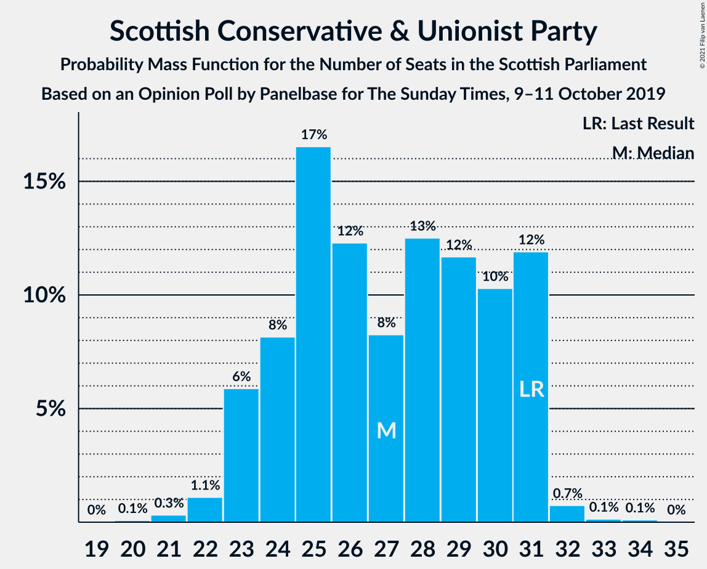
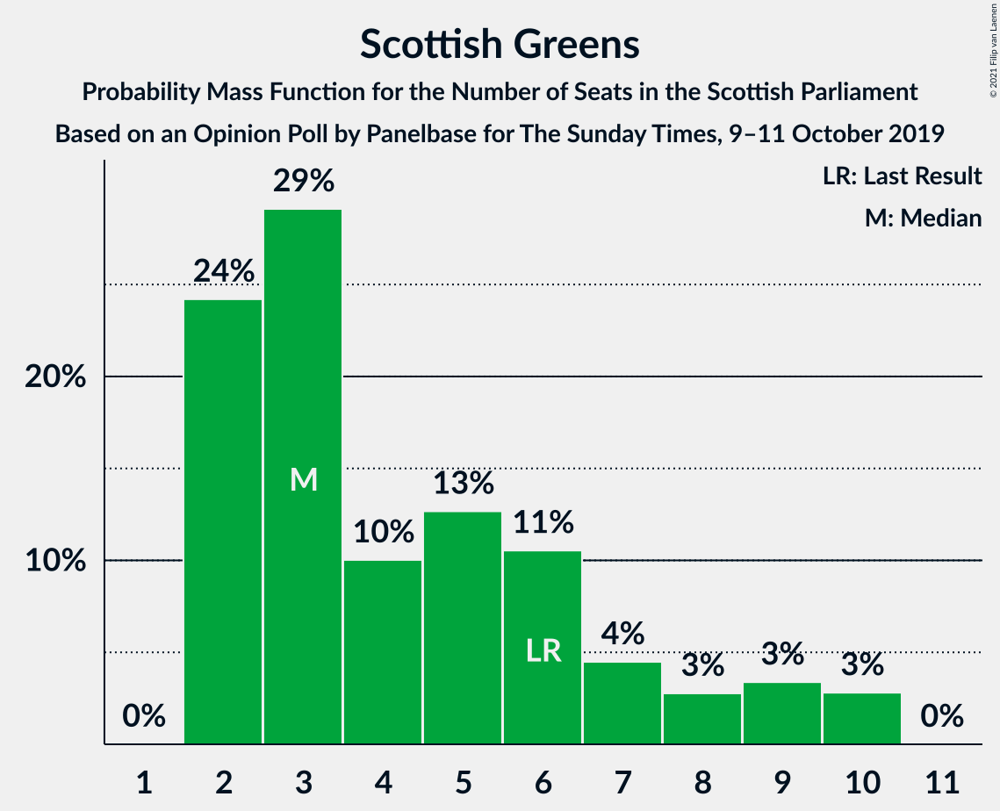
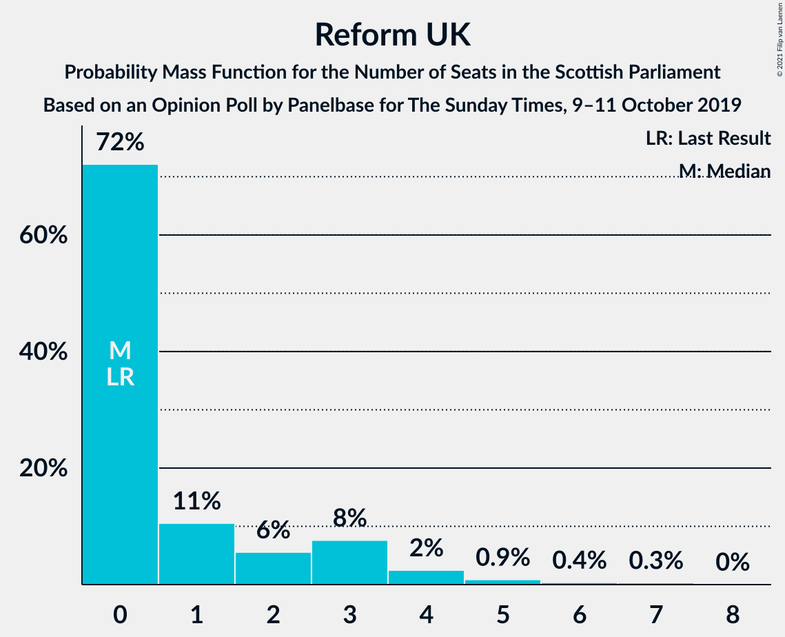
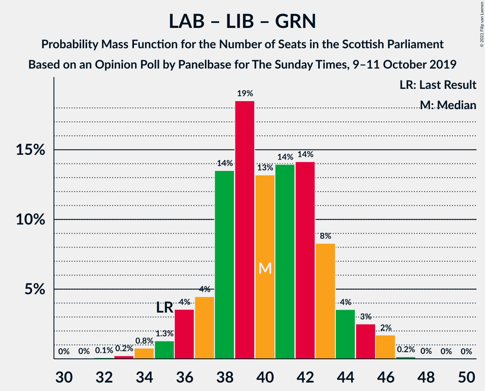

# Opinion Poll by Panelbase for The Sunday Times, 9–11 October 2019

<a href="#voting-intentions">Voting Intentions</a> | <a href="#seats">Seats</a> | <a href="#coalitions">Coalitions</a> | <a href="#technical-information">Technical Information</a>

## Voting Intentions

### Confidence Intervals

| Party | Last Result | Poll Result | 80% Confidence Interval | 90% Confidence Interval | 95% Confidence Interval | 99% Confidence Interval |
|:-----:|:-----------:|:-----------:|:-----------------------:|:-----------------------:|:-----------------------:|:-----------------------:|
| Scottish National Party | 41.7% | 38.6% | 36.6–40.6% |36.1–41.2% |35.6–41.6% |34.7–42.6% |
| Scottish Conservative & Unionist Party | 22.9% | 21.3% | 19.7–23.1% |19.3–23.6% |18.9–24.0% |18.2–24.8% |
| Scottish Labour | 19.1% | 18.2% | 16.8–19.9% |16.3–20.4% |16.0–20.8% |15.3–21.6% |
| Scottish Liberal Democrats | 5.2% | 11.2% | 10.0–12.5% |9.6–12.9% |9.4–13.3% |8.8–14.0% |
| Scottish Greens | 6.6% | 6.1% | 5.2–7.2% |5.0–7.5% |4.8–7.7% |4.4–8.3% |
| Reform UK | 0.0% | 4.1% | 3.4–5.0% |3.2–5.3% |3.0–5.5% |2.7–6.0% |
| UK Independence Party | 2.0% | 0.3% | 0.2–0.7% |0.1–0.8% |0.1–0.9% |0.1–1.1% |

*Note:* The poll result column reflects the actual value used in the calculations. Published results may vary slightly, and in addition be rounded to fewer digits.

## Seats

### Confidence Intervals

| Party | Last Result | Median | 80% Confidence Interval | 90% Confidence Interval | 95% Confidence Interval | 99% Confidence Interval |
|:-----:|:-----------:|:------:|:-----------------------:|:-----------------------:|:-----------------------:|:-----------------------:|
| <a href="#scottish-national-party">Scottish National Party</a> | 63 | 61 | 59–63 |58–64 |58–66 |55–67 |
| <a href="#scottish-conservative-&-unionist-party">Scottish Conservative & Unionist Party</a> | 31 | 26 | 25–30 |24–30 |22–31 |21–32 |
| <a href="#scottish-labour">Scottish Labour</a> | 24 | 22 | 22–26 |20–27 |20–27 |17–28 |
| <a href="#scottish-liberal-democrats">Scottish Liberal Democrats</a> | 5 | 13 | 11–14 |11–15 |10–15 |9–16 |
| <a href="#scottish-greens">Scottish Greens</a> | 6 | 4 | 2–7 |2–9 |2–10 |2–10 |
| <a href="#reform-uk">Reform UK</a> | 0 | 0 | 0–2 |0–3 |0–3 |0–5 |
| <a href="#uk-independence-party">UK Independence Party</a> | 0 | 0 | 0 |0 |0 |0 |

### Scottish National Party

*For a full overview of the results for this party, see the [Scottish National Party](party-scottishnationalparty.html) page.*

| Number of Seats | Probability | Accumulated | Special Marks |
|:---------------:|:-----------:|:-----------:|:-------------:|
| 53 | 0.1% | 100% |  |
| 54 | 0.4% | 99.9% |  |
| 55 | 0.2% | 99.5% |  |
| 56 | 1.0% | 99.3% |  |
| 57 | 0.3% | 98% |  |
| 58 | 6% | 98% |  |
| 59 | 13% | 92% |  |
| 60 | 13% | 79% |  |
| 61 | 18% | 66% | Median |
| 62 | 20% | 48% |  |
| 63 | 19% | 29% | Last Result |
| 64 | 6% | 10% |  |
| 65 | 0.7% | 4% | Majority |
| 66 | 1.1% | 3% |  |
| 67 | 1.4% | 2% |  |
| 68 | 0.3% | 0.3% |  |
| 69 | 0.1% | 0.1% |  |
| 70 | 0% | 0% |  |

### Scottish Conservative & Unionist Party

*For a full overview of the results for this party, see the [Scottish Conservative & Unionist Party](party-scottishconservativeunionistparty.html) page.*

| Number of Seats | Probability | Accumulated | Special Marks |
|:---------------:|:-----------:|:-----------:|:-------------:|
| 20 | 0.1% | 100% |  |
| 21 | 0.7% | 99.9% |  |
| 22 | 2% | 99.1% |  |
| 23 | 0.7% | 97% |  |
| 24 | 3% | 97% |  |
| 25 | 28% | 94% |  |
| 26 | 19% | 66% | Median |
| 27 | 3% | 47% |  |
| 28 | 21% | 44% |  |
| 29 | 11% | 23% |  |
| 30 | 8% | 12% |  |
| 31 | 3% | 4% | Last Result |
| 32 | 1.1% | 1.3% |  |
| 33 | 0.1% | 0.2% |  |
| 34 | 0.2% | 0.2% |  |
| 35 | 0% | 0% |  |

### Scottish Labour

*For a full overview of the results for this party, see the [Scottish Labour](party-scottishlabour.html) page.*

| Number of Seats | Probability | Accumulated | Special Marks |
|:---------------:|:-----------:|:-----------:|:-------------:|
| 17 | 0.5% | 100% |  |
| 18 | 0.5% | 99.5% |  |
| 19 | 1.4% | 99.0% |  |
| 20 | 5% | 98% |  |
| 21 | 2% | 92% |  |
| 22 | 44% | 90% | Median |
| 23 | 24% | 47% |  |
| 24 | 7% | 23% | Last Result |
| 25 | 5% | 16% |  |
| 26 | 3% | 11% |  |
| 27 | 6% | 8% |  |
| 28 | 1.4% | 2% |  |
| 29 | 0.3% | 0.4% |  |
| 30 | 0.1% | 0.1% |  |
| 31 | 0% | 0% |  |

### Scottish Liberal Democrats

*For a full overview of the results for this party, see the [Scottish Liberal Democrats](party-scottishliberaldemocrats.html) page.*

| Number of Seats | Probability | Accumulated | Special Marks |
|:---------------:|:-----------:|:-----------:|:-------------:|
| 5 | 0% | 100% | Last Result |
| 6 | 0% | 100% |  |
| 7 | 0% | 100% |  |
| 8 | 0.5% | 100% |  |
| 9 | 0.4% | 99.5% |  |
| 10 | 3% | 99.1% |  |
| 11 | 9% | 96% |  |
| 12 | 20% | 88% |  |
| 13 | 34% | 68% | Median |
| 14 | 25% | 34% |  |
| 15 | 8% | 9% |  |
| 16 | 0.9% | 1.4% |  |
| 17 | 0.3% | 0.4% |  |
| 18 | 0% | 0.1% |  |
| 19 | 0.1% | 0.1% |  |
| 20 | 0% | 0% |  |

### Scottish Greens

*For a full overview of the results for this party, see the [Scottish Greens](party-scottishgreens.html) page.*

| Number of Seats | Probability | Accumulated | Special Marks |
|:---------------:|:-----------:|:-----------:|:-------------:|
| 2 | 15% | 100% |  |
| 3 | 30% | 85% |  |
| 4 | 8% | 55% | Median |
| 5 | 21% | 47% |  |
| 6 | 11% | 26% | Last Result |
| 7 | 6% | 15% |  |
| 8 | 3% | 9% |  |
| 9 | 4% | 6% |  |
| 10 | 3% | 3% |  |
| 11 | 0% | 0% |  |

### Reform UK

*For a full overview of the results for this party, see the [Reform UK](party-reformuk.html) page.*

| Number of Seats | Probability | Accumulated | Special Marks |
|:---------------:|:-----------:|:-----------:|:-------------:|
| 0 | 67% | 100% | Last Result, Median |
| 1 | 19% | 33% |  |
| 2 | 6% | 14% |  |
| 3 | 6% | 8% |  |
| 4 | 1.2% | 2% |  |
| 5 | 0.7% | 1.1% |  |
| 6 | 0.1% | 0.4% |  |
| 7 | 0.2% | 0.3% |  |
| 8 | 0% | 0% |  |

### UK Independence Party

*For a full overview of the results for this party, see the [UK Independence Party](party-ukindependenceparty.html) page.*

| Number of Seats | Probability | Accumulated | Special Marks |
|:---------------:|:-----------:|:-----------:|:-------------:|
| 0 | 100% | 100% | Last Result, Median |

## Coalitions

### Confidence Intervals

| Coalition | Last Result | Median | Majority? | 80% Confidence Interval | 90% Confidence Interval | 95% Confidence Interval | 99% Confidence Interval |
|:---------:|:-----------:|:------:|:---------:|:-----------------------:|:-----------------------:|:-----------------------:|:-----------------------:|
| Scottish National Party – Scottish Greens | 69 | 65 | 75% | 62–69 | 62–70 | 61–71 | 58–73 |
| Scottish Conservative & Unionist Party – Scottish Labour – Scottish Liberal Democrats | 60 | 63 | 22% | 59–65 | 58–67 | 57–67 | 55–70 |
| Scottish National Party | 63 | 61 | 4% | 59–63 | 58–64 | 58–66 | 55–67 |
| Scottish Conservative & Unionist Party – Scottish Labour | 55 | 50 | 0% | 47–52 | 46–54 | 45–55 | 43–57 |
| Scottish Labour – Scottish Liberal Democrats – Scottish Greens | 35 | 41 | 0% | 36–43 | 36–44 | 36–45 | 34–46 |
| Scottish Conservative & Unionist Party – Scottish Liberal Democrats | 36 | 40 | 0% | 37–43 | 36–44 | 35–44 | 33–46 |
| Scottish Labour – Scottish Liberal Democrats | 29 | 36 | 0% | 33–39 | 32–39 | 32–39 | 30–41 |

### Scottish National Party – Scottish Greens

| Number of Seats | Probability | Accumulated | Special Marks |
|:---------------:|:-----------:|:-----------:|:-------------:|
| 56 | 0.1% | 100% |  |
| 57 | 0% | 99.9% |  |
| 58 | 0.4% | 99.8% |  |
| 59 | 0.4% | 99.5% |  |
| 60 | 0.4% | 99.1% |  |
| 61 | 3% | 98.7% |  |
| 62 | 8% | 96% |  |
| 63 | 4% | 88% |  |
| 64 | 10% | 85% |  |
| 65 | 29% | 75% | Median, Majority |
| 66 | 9% | 46% |  |
| 67 | 14% | 37% |  |
| 68 | 11% | 23% |  |
| 69 | 3% | 12% | Last Result |
| 70 | 5% | 9% |  |
| 71 | 2% | 4% |  |
| 72 | 1.0% | 2% |  |
| 73 | 0.6% | 0.8% |  |
| 74 | 0.2% | 0.2% |  |
| 75 | 0% | 0% |  |

### Scottish Conservative & Unionist Party – Scottish Labour – Scottish Liberal Democrats

| Number of Seats | Probability | Accumulated | Special Marks |
|:---------------:|:-----------:|:-----------:|:-------------:|
| 53 | 0% | 100% |  |
| 54 | 0.1% | 99.9% |  |
| 55 | 0.4% | 99.8% |  |
| 56 | 0.6% | 99.4% |  |
| 57 | 3% | 98.8% |  |
| 58 | 2% | 96% |  |
| 59 | 5% | 94% |  |
| 60 | 3% | 89% | Last Result |
| 61 | 26% | 86% | Median |
| 62 | 4% | 61% |  |
| 63 | 12% | 57% |  |
| 64 | 23% | 44% |  |
| 65 | 13% | 22% | Majority |
| 66 | 1.1% | 8% |  |
| 67 | 5% | 7% |  |
| 68 | 1.1% | 2% |  |
| 69 | 0.4% | 1.1% |  |
| 70 | 0.3% | 0.7% |  |
| 71 | 0.3% | 0.4% |  |
| 72 | 0% | 0.1% |  |
| 73 | 0.1% | 0.1% |  |
| 74 | 0% | 0% |  |

### Scottish National Party

| Number of Seats | Probability | Accumulated | Special Marks |
|:---------------:|:-----------:|:-----------:|:-------------:|
| 53 | 0.1% | 100% |  |
| 54 | 0.4% | 99.9% |  |
| 55 | 0.2% | 99.5% |  |
| 56 | 1.0% | 99.3% |  |
| 57 | 0.3% | 98% |  |
| 58 | 6% | 98% |  |
| 59 | 13% | 92% |  |
| 60 | 13% | 79% |  |
| 61 | 18% | 66% | Median |
| 62 | 20% | 48% |  |
| 63 | 19% | 29% | Last Result |
| 64 | 6% | 10% |  |
| 65 | 0.7% | 4% | Majority |
| 66 | 1.1% | 3% |  |
| 67 | 1.4% | 2% |  |
| 68 | 0.3% | 0.3% |  |
| 69 | 0.1% | 0.1% |  |
| 70 | 0% | 0% |  |

### Scottish Conservative & Unionist Party – Scottish Labour

| Number of Seats | Probability | Accumulated | Special Marks |
|:---------------:|:-----------:|:-----------:|:-------------:|
| 41 | 0% | 100% |  |
| 42 | 0.3% | 99.9% |  |
| 43 | 0.5% | 99.7% |  |
| 44 | 0.7% | 99.2% |  |
| 45 | 1.5% | 98% |  |
| 46 | 2% | 97% |  |
| 47 | 10% | 95% |  |
| 48 | 17% | 84% | Median |
| 49 | 11% | 67% |  |
| 50 | 26% | 56% |  |
| 51 | 6% | 31% |  |
| 52 | 18% | 25% |  |
| 53 | 2% | 7% |  |
| 54 | 2% | 5% |  |
| 55 | 1.3% | 3% | Last Result |
| 56 | 0.9% | 2% |  |
| 57 | 0.4% | 0.8% |  |
| 58 | 0.2% | 0.4% |  |
| 59 | 0.1% | 0.2% |  |
| 60 | 0% | 0% |  |

### Scottish Labour – Scottish Liberal Democrats – Scottish Greens

| Number of Seats | Probability | Accumulated | Special Marks |
|:---------------:|:-----------:|:-----------:|:-------------:|
| 32 | 0.1% | 100% |  |
| 33 | 0.1% | 99.9% |  |
| 34 | 0.4% | 99.8% |  |
| 35 | 2% | 99.3% | Last Result |
| 36 | 9% | 98% |  |
| 37 | 1.3% | 89% |  |
| 38 | 6% | 87% |  |
| 39 | 15% | 81% | Median |
| 40 | 15% | 66% |  |
| 41 | 20% | 51% |  |
| 42 | 17% | 30% |  |
| 43 | 6% | 13% |  |
| 44 | 2% | 7% |  |
| 45 | 4% | 5% |  |
| 46 | 0.6% | 0.7% |  |
| 47 | 0.1% | 0.1% |  |
| 48 | 0% | 0% |  |

### Scottish Conservative & Unionist Party – Scottish Liberal Democrats

| Number of Seats | Probability | Accumulated | Special Marks |
|:---------------:|:-----------:|:-----------:|:-------------:|
| 31 | 0.1% | 100% |  |
| 32 | 0.1% | 99.9% |  |
| 33 | 0.6% | 99.8% |  |
| 34 | 0.5% | 99.3% |  |
| 35 | 3% | 98.8% |  |
| 36 | 3% | 95% | Last Result |
| 37 | 11% | 93% |  |
| 38 | 14% | 81% |  |
| 39 | 16% | 67% | Median |
| 40 | 7% | 51% |  |
| 41 | 12% | 44% |  |
| 42 | 19% | 32% |  |
| 43 | 6% | 13% |  |
| 44 | 5% | 6% |  |
| 45 | 0.6% | 2% |  |
| 46 | 0.7% | 1.0% |  |
| 47 | 0.2% | 0.3% |  |
| 48 | 0.1% | 0.1% |  |
| 49 | 0% | 0% |  |

### Scottish Labour – Scottish Liberal Democrats

| Number of Seats | Probability | Accumulated | Special Marks |
|:---------------:|:-----------:|:-----------:|:-------------:|
| 28 | 0% | 100% |  |
| 29 | 0.2% | 99.9% | Last Result |
| 30 | 0.6% | 99.8% |  |
| 31 | 2% | 99.1% |  |
| 32 | 6% | 98% |  |
| 33 | 8% | 92% |  |
| 34 | 6% | 84% |  |
| 35 | 17% | 79% | Median |
| 36 | 32% | 62% |  |
| 37 | 9% | 30% |  |
| 38 | 8% | 20% |  |
| 39 | 10% | 13% |  |
| 40 | 1.1% | 2% |  |
| 41 | 0.9% | 1.4% |  |
| 42 | 0.4% | 0.5% |  |
| 43 | 0.1% | 0.1% |  |
| 44 | 0% | 0% |  |

## Technical Information

### Opinion Poll

+ **Polling firm:** Panelbase
+ **Commissioner(s):** The Sunday Times
+ **Fieldwork period:** 9–11 October 2019

### Calculations

+ **Sample size:** 1003
+ **Simulations done:** 131,072
+ **Error estimate:** 2.42%

