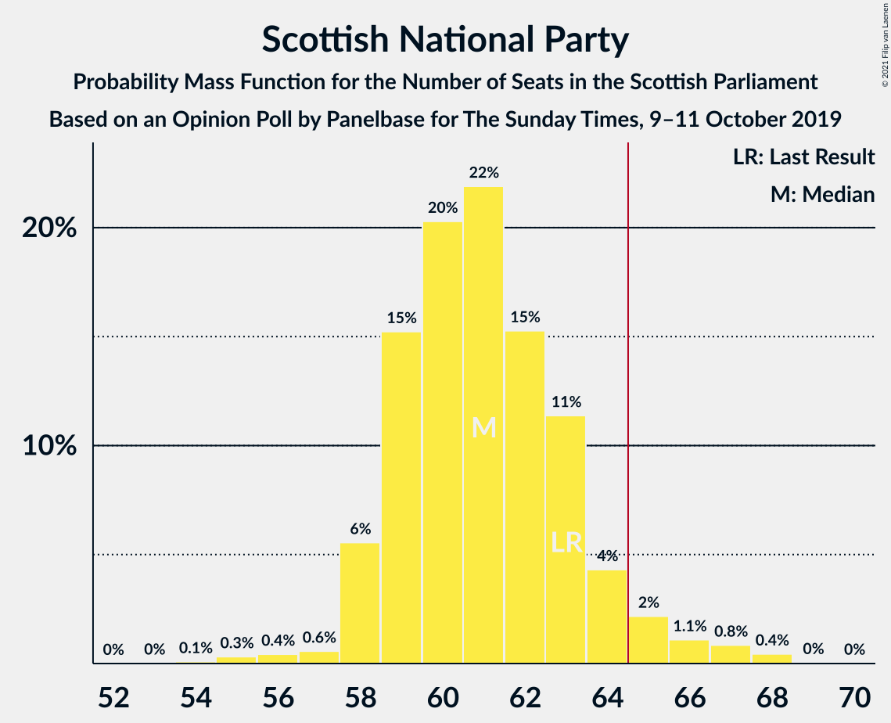
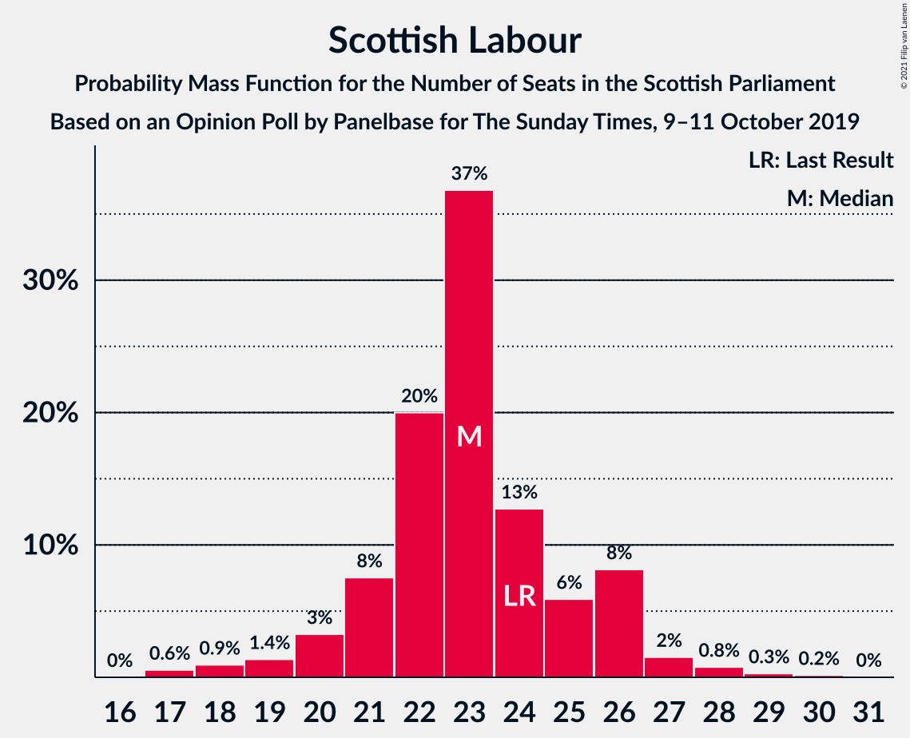

# Opinion Poll by Panelbase for The Sunday Times, 9–11 October 2019

<a href="#voting-intentions">Voting Intentions</a> | <a href="#seats">Seats</a> | <a href="#coalitions">Coalitions</a> | <a href="#technical-information">Technical Information</a>

## Voting Intentions

### Confidence Intervals

| Party | Last Result | Poll Result | 80% Confidence Interval | 90% Confidence Interval | 95% Confidence Interval | 99% Confidence Interval |
|:-----:|:-----------:|:-----------:|:-----------------------:|:-----------------------:|:-----------------------:|:-----------------------:|
| Scottish National Party | 41.7% | 38.6% | 36.6–40.6% |36.1–41.2% |35.6–41.6% |34.7–42.6% |
| Scottish Conservative & Unionist Party | 22.9% | 21.3% | 19.7–23.1% |19.3–23.6% |18.9–24.0% |18.2–24.8% |
| Scottish Labour | 19.1% | 18.2% | 16.8–19.9% |16.3–20.4% |16.0–20.8% |15.3–21.6% |
| Scottish Liberal Democrats | 5.2% | 11.2% | 10.0–12.5% |9.6–12.9% |9.4–13.3% |8.8–14.0% |
| Scottish Greens | 6.6% | 6.1% | 5.2–7.2% |5.0–7.5% |4.8–7.7% |4.4–8.3% |
| Reform UK | 0.0% | 4.1% | 3.4–5.0% |3.2–5.3% |3.0–5.5% |2.7–6.0% |
| UK Independence Party | 2.0% | 0.3% | 0.2–0.7% |0.1–0.8% |0.1–0.9% |0.1–1.1% |

*Note:* The poll result column reflects the actual value used in the calculations. Published results may vary slightly, and in addition be rounded to fewer digits.

## Seats

### Confidence Intervals

| Party | Last Result | Median | 80% Confidence Interval | 90% Confidence Interval | 95% Confidence Interval | 99% Confidence Interval |
|:-----:|:-----------:|:------:|:-----------------------:|:-----------------------:|:-----------------------:|:-----------------------:|
| <a href="#scottish-national-party">Scottish National Party</a> | 63 | 61 | 59–63 |58–64 |58–65 |56–68 |
| <a href="#scottish-conservative-&-unionist-party">Scottish Conservative & Unionist Party</a> | 31 | 27 | 24–31 |23–31 |23–31 |22–32 |
| <a href="#scottish-labour">Scottish Labour</a> | 24 | 23 | 21–26 |20–26 |19–27 |17–28 |
| <a href="#scottish-liberal-democrats">Scottish Liberal Democrats</a> | 5 | 13 | 12–14 |11–15 |10–15 |9–17 |
| <a href="#scottish-greens">Scottish Greens</a> | 6 | 3 | 2–7 |2–9 |2–10 |2–10 |
| <a href="#reform-uk">Reform UK</a> | 0 | 0 | 0–3 |0–3 |0–4 |0–6 |
| <a href="#uk-independence-party">UK Independence Party</a> | 0 | 0 | 0 |0 |0 |0 |

### Scottish National Party

*For a full overview of the results for this party, see the [Scottish National Party](party-scottishnationalparty.html) page.*

| Number of Seats | Probability | Accumulated | Special Marks |
|:---------------:|:-----------:|:-----------:|:-------------:|
| 54 | 0.1% | 100% |  |
| 55 | 0.3% | 99.9% |  |
| 56 | 0.4% | 99.6% |  |
| 57 | 0.6% | 99.1% |  |
| 58 | 6% | 98.6% |  |
| 59 | 15% | 93% |  |
| 60 | 20% | 78% |  |
| 61 | 22% | 57% | Median |
| 62 | 15% | 36% |  |
| 63 | 11% | 20% | Last Result |
| 64 | 4% | 9% |  |
| 65 | 2% | 5% | Majority |
| 66 | 1.1% | 2% |  |
| 67 | 0.8% | 1.4% |  |
| 68 | 0.4% | 0.5% |  |
| 69 | 0% | 0.1% |  |
| 70 | 0% | 0% |  |

### Scottish Conservative & Unionist Party

*For a full overview of the results for this party, see the [Scottish Conservative & Unionist Party](party-scottishconservativeunionistparty.html) page.*

| Number of Seats | Probability | Accumulated | Special Marks |
|:---------------:|:-----------:|:-----------:|:-------------:|
| 20 | 0.1% | 100% |  |
| 21 | 0.3% | 99.9% |  |
| 22 | 1.1% | 99.6% |  |
| 23 | 6% | 98% |  |
| 24 | 8% | 93% |  |
| 25 | 17% | 84% |  |
| 26 | 12% | 68% |  |
| 27 | 8% | 56% | Median |
| 28 | 13% | 47% |  |
| 29 | 12% | 35% |  |
| 30 | 10% | 23% |  |
| 31 | 12% | 13% | Last Result |
| 32 | 0.7% | 1.0% |  |
| 33 | 0.1% | 0.3% |  |
| 34 | 0.1% | 0.1% |  |
| 35 | 0% | 0% |  |

### Scottish Labour

*For a full overview of the results for this party, see the [Scottish Labour](party-scottishlabour.html) page.*

| Number of Seats | Probability | Accumulated | Special Marks |
|:---------------:|:-----------:|:-----------:|:-------------:|
| 17 | 0.6% | 100% |  |
| 18 | 0.9% | 99.4% |  |
| 19 | 1.4% | 98% |  |
| 20 | 3% | 97% |  |
| 21 | 8% | 94% |  |
| 22 | 20% | 86% |  |
| 23 | 37% | 66% | Median |
| 24 | 13% | 30% | Last Result |
| 25 | 6% | 17% |  |
| 26 | 8% | 11% |  |
| 27 | 2% | 3% |  |
| 28 | 0.8% | 1.2% |  |
| 29 | 0.3% | 0.5% |  |
| 30 | 0.2% | 0.2% |  |
| 31 | 0% | 0% |  |

### Scottish Liberal Democrats

*For a full overview of the results for this party, see the [Scottish Liberal Democrats](party-scottishliberaldemocrats.html) page.*

| Number of Seats | Probability | Accumulated | Special Marks |
|:---------------:|:-----------:|:-----------:|:-------------:|
| 5 | 0% | 100% | Last Result |
| 6 | 0% | 100% |  |
| 7 | 0% | 100% |  |
| 8 | 0.2% | 100% |  |
| 9 | 0.6% | 99.7% |  |
| 10 | 2% | 99.2% |  |
| 11 | 7% | 97% |  |
| 12 | 12% | 91% |  |
| 13 | 51% | 79% | Median |
| 14 | 22% | 27% |  |
| 15 | 3% | 5% |  |
| 16 | 0.8% | 2% |  |
| 17 | 0.5% | 0.9% |  |
| 18 | 0.2% | 0.4% |  |
| 19 | 0.1% | 0.2% |  |
| 20 | 0.1% | 0.1% |  |
| 21 | 0% | 0% |  |

### Scottish Greens

*For a full overview of the results for this party, see the [Scottish Greens](party-scottishgreens.html) page.*

| Number of Seats | Probability | Accumulated | Special Marks |
|:---------------:|:-----------:|:-----------:|:-------------:|
| 2 | 24% | 100% |  |
| 3 | 29% | 76% | Median |
| 4 | 10% | 47% |  |
| 5 | 13% | 37% |  |
| 6 | 11% | 24% | Last Result |
| 7 | 4% | 13% |  |
| 8 | 3% | 9% |  |
| 9 | 3% | 6% |  |
| 10 | 3% | 3% |  |
| 11 | 0% | 0% |  |

### Reform UK

*For a full overview of the results for this party, see the [Reform UK](party-reformuk.html) page.*

| Number of Seats | Probability | Accumulated | Special Marks |
|:---------------:|:-----------:|:-----------:|:-------------:|
| 0 | 72% | 100% | Last Result, Median |
| 1 | 11% | 28% |  |
| 2 | 6% | 17% |  |
| 3 | 8% | 12% |  |
| 4 | 2% | 4% |  |
| 5 | 0.9% | 2% |  |
| 6 | 0.4% | 0.7% |  |
| 7 | 0.3% | 0.4% |  |
| 8 | 0% | 0% |  |

### UK Independence Party

*For a full overview of the results for this party, see the [UK Independence Party](party-ukindependenceparty.html) page.*

| Number of Seats | Probability | Accumulated | Special Marks |
|:---------------:|:-----------:|:-----------:|:-------------:|
| 0 | 100% | 100% | Last Result, Median |

## Coalitions

### Confidence Intervals

| Coalition | Last Result | Median | Majority? | 80% Confidence Interval | 90% Confidence Interval | 95% Confidence Interval | 99% Confidence Interval |
|:---------:|:-----------:|:------:|:---------:|:-----------------------:|:-----------------------:|:-----------------------:|:-----------------------:|
| Scottish National Party – Scottish Greens | 69 | 65 | 53% | 62–69 | 61–70 | 61–71 | 59–73 |
| Scottish Conservative & Unionist Party – Scottish Labour – Scottish Liberal Democrats | 60 | 64 | 40% | 60–67 | 58–67 | 57–68 | 55–69 |
| Scottish National Party | 63 | 61 | 5% | 59–63 | 58–64 | 58–65 | 56–68 |
| Scottish Conservative & Unionist Party – Scottish Labour | 55 | 50 | 0% | 47–54 | 46–54 | 45–55 | 43–56 |
| Scottish Labour – Scottish Liberal Democrats – Scottish Greens | 35 | 40 | 0% | 37–43 | 36–44 | 36–45 | 34–46 |
| Scottish Conservative & Unionist Party – Scottish Liberal Democrats | 36 | 40 | 0% | 37–44 | 36–44 | 35–45 | 34–46 |
| Scottish Labour – Scottish Liberal Democrats | 29 | 36 | 0% | 34–39 | 32–39 | 32–40 | 30–42 |

### Scottish National Party – Scottish Greens

| Number of Seats | Probability | Accumulated | Special Marks |
|:---------------:|:-----------:|:-----------:|:-------------:|
| 57 | 0.1% | 100% |  |
| 58 | 0.2% | 99.9% |  |
| 59 | 0.3% | 99.7% |  |
| 60 | 0.8% | 99.4% |  |
| 61 | 5% | 98.6% |  |
| 62 | 9% | 94% |  |
| 63 | 14% | 85% |  |
| 64 | 18% | 71% | Median |
| 65 | 14% | 53% | Majority |
| 66 | 10% | 39% |  |
| 67 | 10% | 30% |  |
| 68 | 6% | 19% |  |
| 69 | 7% | 13% | Last Result |
| 70 | 2% | 6% |  |
| 71 | 2% | 4% |  |
| 72 | 1.0% | 2% |  |
| 73 | 0.3% | 0.6% |  |
| 74 | 0.2% | 0.3% |  |
| 75 | 0% | 0.1% |  |
| 76 | 0% | 0% |  |

### Scottish Conservative & Unionist Party – Scottish Labour – Scottish Liberal Democrats

| Number of Seats | Probability | Accumulated | Special Marks |
|:---------------:|:-----------:|:-----------:|:-------------:|
| 53 | 0.1% | 100% |  |
| 54 | 0.1% | 99.9% |  |
| 55 | 0.4% | 99.8% |  |
| 56 | 0.7% | 99.4% |  |
| 57 | 2% | 98.7% |  |
| 58 | 3% | 97% |  |
| 59 | 4% | 95% |  |
| 60 | 11% | 91% | Last Result |
| 61 | 10% | 80% |  |
| 62 | 8% | 70% |  |
| 63 | 11% | 62% | Median |
| 64 | 12% | 52% |  |
| 65 | 18% | 40% | Majority |
| 66 | 11% | 22% |  |
| 67 | 8% | 11% |  |
| 68 | 3% | 4% |  |
| 69 | 0.4% | 0.9% |  |
| 70 | 0.3% | 0.5% |  |
| 71 | 0.2% | 0.2% |  |
| 72 | 0% | 0% |  |

### Scottish National Party

| Number of Seats | Probability | Accumulated | Special Marks |
|:---------------:|:-----------:|:-----------:|:-------------:|
| 54 | 0.1% | 100% |  |
| 55 | 0.3% | 99.9% |  |
| 56 | 0.4% | 99.6% |  |
| 57 | 0.6% | 99.1% |  |
| 58 | 6% | 98.6% |  |
| 59 | 15% | 93% |  |
| 60 | 20% | 78% |  |
| 61 | 22% | 57% | Median |
| 62 | 15% | 36% |  |
| 63 | 11% | 20% | Last Result |
| 64 | 4% | 9% |  |
| 65 | 2% | 5% | Majority |
| 66 | 1.1% | 2% |  |
| 67 | 0.8% | 1.4% |  |
| 68 | 0.4% | 0.5% |  |
| 69 | 0% | 0.1% |  |
| 70 | 0% | 0% |  |

### Scottish Conservative & Unionist Party – Scottish Labour

| Number of Seats | Probability | Accumulated | Special Marks |
|:---------------:|:-----------:|:-----------:|:-------------:|
| 40 | 0% | 100% |  |
| 41 | 0.1% | 99.9% |  |
| 42 | 0.3% | 99.8% |  |
| 43 | 0.7% | 99.6% |  |
| 44 | 0.9% | 98.9% |  |
| 45 | 2% | 98% |  |
| 46 | 5% | 96% |  |
| 47 | 10% | 91% |  |
| 48 | 11% | 82% |  |
| 49 | 8% | 70% |  |
| 50 | 15% | 63% | Median |
| 51 | 7% | 48% |  |
| 52 | 21% | 40% |  |
| 53 | 9% | 19% |  |
| 54 | 6% | 10% |  |
| 55 | 3% | 5% | Last Result |
| 56 | 0.8% | 1.2% |  |
| 57 | 0.3% | 0.5% |  |
| 58 | 0.1% | 0.2% |  |
| 59 | 0% | 0% |  |

### Scottish Labour – Scottish Liberal Democrats – Scottish Greens

| Number of Seats | Probability | Accumulated | Special Marks |
|:---------------:|:-----------:|:-----------:|:-------------:|
| 32 | 0.1% | 100% |  |
| 33 | 0.2% | 99.9% |  |
| 34 | 0.8% | 99.7% |  |
| 35 | 1.3% | 98.9% | Last Result |
| 36 | 4% | 98% |  |
| 37 | 4% | 94% |  |
| 38 | 14% | 90% |  |
| 39 | 19% | 76% | Median |
| 40 | 13% | 58% |  |
| 41 | 14% | 44% |  |
| 42 | 14% | 30% |  |
| 43 | 8% | 16% |  |
| 44 | 4% | 8% |  |
| 45 | 3% | 4% |  |
| 46 | 2% | 2% |  |
| 47 | 0.2% | 0.2% |  |
| 48 | 0% | 0.1% |  |
| 49 | 0% | 0% |  |

### Scottish Conservative & Unionist Party – Scottish Liberal Democrats

| Number of Seats | Probability | Accumulated | Special Marks |
|:---------------:|:-----------:|:-----------:|:-------------:|
| 32 | 0.1% | 100% |  |
| 33 | 0.3% | 99.9% |  |
| 34 | 0.8% | 99.6% |  |
| 35 | 2% | 98.8% |  |
| 36 | 3% | 97% | Last Result |
| 37 | 13% | 93% |  |
| 38 | 13% | 80% |  |
| 39 | 11% | 67% |  |
| 40 | 7% | 56% | Median |
| 41 | 13% | 49% |  |
| 42 | 14% | 36% |  |
| 43 | 9% | 22% |  |
| 44 | 8% | 13% |  |
| 45 | 4% | 5% |  |
| 46 | 0.8% | 1.0% |  |
| 47 | 0.2% | 0.3% |  |
| 48 | 0% | 0.1% |  |
| 49 | 0% | 0% |  |

### Scottish Labour – Scottish Liberal Democrats

| Number of Seats | Probability | Accumulated | Special Marks |
|:---------------:|:-----------:|:-----------:|:-------------:|
| 28 | 0.1% | 100% |  |
| 29 | 0.1% | 99.9% | Last Result |
| 30 | 0.6% | 99.8% |  |
| 31 | 1.1% | 99.2% |  |
| 32 | 3% | 98% |  |
| 33 | 4% | 95% |  |
| 34 | 6% | 91% |  |
| 35 | 21% | 84% |  |
| 36 | 28% | 63% | Median |
| 37 | 17% | 35% |  |
| 38 | 6% | 19% |  |
| 39 | 8% | 13% |  |
| 40 | 3% | 4% |  |
| 41 | 0.9% | 2% |  |
| 42 | 0.4% | 0.7% |  |
| 43 | 0.3% | 0.3% |  |
| 44 | 0% | 0.1% |  |
| 45 | 0% | 0% |  |

## Technical Information

### Opinion Poll

+ **Polling firm:** Panelbase
+ **Commissioner(s):** The Sunday Times
+ **Fieldwork period:** 9–11 October 2019

### Calculations

+ **Sample size:** 1003
+ **Simulations done:** 1,048,576
+ **Error estimate:** 1.11%

