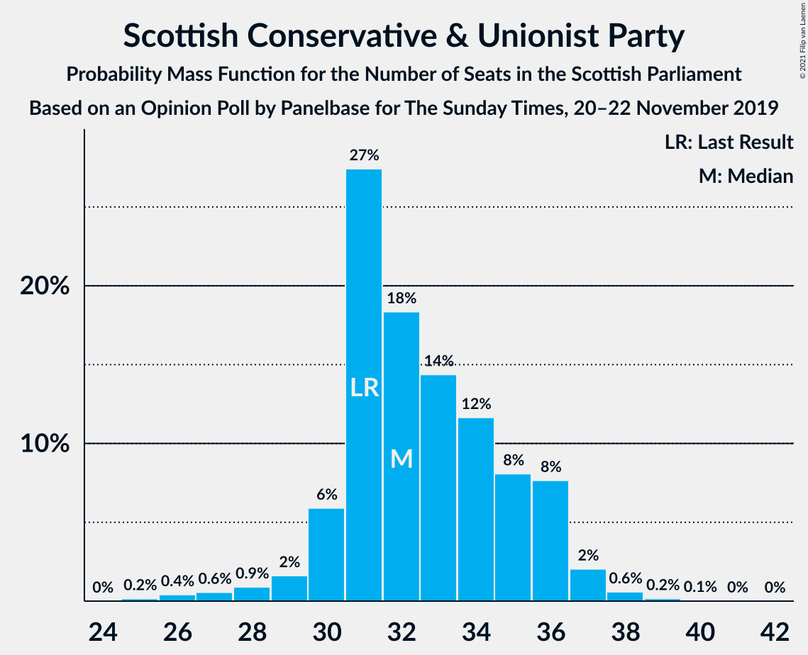
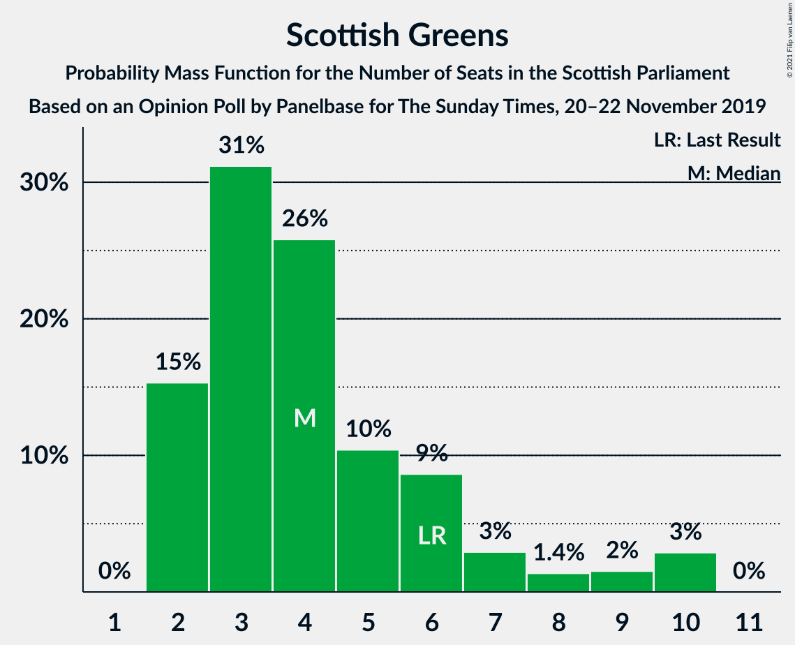

# Opinion Poll by Panelbase for The Sunday Times, 20–22 November 2019

<a href="#voting-intentions">Voting Intentions</a> | <a href="#seats">Seats</a> | <a href="#coalitions">Coalitions</a> | <a href="#technical-information">Technical Information</a>

## Voting Intentions

### Confidence Intervals

| Party | Last Result | Poll Result | 80% Confidence Interval | 90% Confidence Interval | 95% Confidence Interval | 99% Confidence Interval |
|:-----:|:-----------:|:-----------:|:-----------------------:|:-----------------------:|:-----------------------:|:-----------------------:|
| Scottish National Party | 41.7% | 39.0% | 37.1–41.0% |36.5–41.6% |36.1–42.1% |35.2–43.1% |
| Scottish Conservative & Unionist Party | 22.9% | 25.0% | 23.3–26.8% |22.8–27.3% |22.4–27.7% |21.6–28.6% |
| Scottish Labour | 19.1% | 17.0% | 15.6–18.7% |15.2–19.1% |14.8–19.5% |14.2–20.3% |
| Scottish Liberal Democrats | 5.2% | 9.0% | 8.0–10.3% |7.7–10.6% |7.4–11.0% |6.9–11.6% |
| Scottish Greens | 6.6% | 6.0% | 5.2–7.1% |4.9–7.4% |4.7–7.7% |4.3–8.2% |
| Reform UK | 0.0% | 3.0% | 2.4–3.8% |2.2–4.0% |2.1–4.2% |1.8–4.6% |

*Note:* The poll result column reflects the actual value used in the calculations. Published results may vary slightly, and in addition be rounded to fewer digits.

## Seats

### Confidence Intervals

| Party | Last Result | Median | 80% Confidence Interval | 90% Confidence Interval | 95% Confidence Interval | 99% Confidence Interval |
|:-----:|:-----------:|:------:|:-----------------------:|:-----------------------:|:-----------------------:|:-----------------------:|
| <a href="#scottish-national-party">Scottish National Party</a> | 63 | 60 | 57–63 |56–64 |55–64 |54–65 |
| <a href="#scottish-conservative-&-unionist-party">Scottish Conservative & Unionist Party</a> | 31 | 33 | 30–36 |30–37 |29–37 |26–38 |
| <a href="#scottish-labour">Scottish Labour</a> | 24 | 22 | 20–24 |20–25 |18–26 |17–27 |
| <a href="#scottish-liberal-democrats">Scottish Liberal Democrats</a> | 5 | 10 | 8–12 |7–13 |7–13 |6–13 |
| <a href="#scottish-greens">Scottish Greens</a> | 6 | 4 | 2–7 |2–8 |2–10 |2–10 |
| <a href="#reform-uk">Reform UK</a> | 0 | 0 | 0 |0 |0 |0–1 |

### Scottish National Party

*For a full overview of the results for this party, see the [Scottish National Party](party-scottishnationalparty.html) page.*

| Number of Seats | Probability | Accumulated | Special Marks |
|:---------------:|:-----------:|:-----------:|:-------------:|
| 53 | 0.1% | 100% |  |
| 54 | 0.8% | 99.8% |  |
| 55 | 3% | 99.0% |  |
| 56 | 6% | 96% |  |
| 57 | 12% | 90% |  |
| 58 | 11% | 78% |  |
| 59 | 10% | 67% |  |
| 60 | 19% | 57% | Median |
| 61 | 12% | 38% |  |
| 62 | 9% | 25% |  |
| 63 | 10% | 16% | Last Result |
| 64 | 3% | 6% |  |
| 65 | 2% | 2% | Majority |
| 66 | 0.1% | 0.2% |  |
| 67 | 0.1% | 0.1% |  |
| 68 | 0% | 0% |  |

### Scottish Conservative & Unionist Party

*For a full overview of the results for this party, see the [Scottish Conservative & Unionist Party](party-scottishconservativeunionistparty.html) page.*

| Number of Seats | Probability | Accumulated | Special Marks |
|:---------------:|:-----------:|:-----------:|:-------------:|
| 25 | 0.2% | 100% |  |
| 26 | 0.6% | 99.8% |  |
| 27 | 0.3% | 99.2% |  |
| 28 | 1.2% | 98.9% |  |
| 29 | 2% | 98% |  |
| 30 | 7% | 96% |  |
| 31 | 18% | 89% | Last Result |
| 32 | 13% | 71% |  |
| 33 | 16% | 58% | Median |
| 34 | 14% | 42% |  |
| 35 | 12% | 27% |  |
| 36 | 11% | 16% |  |
| 37 | 4% | 5% |  |
| 38 | 0.9% | 1.2% |  |
| 39 | 0.3% | 0.4% |  |
| 40 | 0% | 0.1% |  |
| 41 | 0% | 0% |  |

### Scottish Labour

*For a full overview of the results for this party, see the [Scottish Labour](party-scottishlabour.html) page.*

| Number of Seats | Probability | Accumulated | Special Marks |
|:---------------:|:-----------:|:-----------:|:-------------:|
| 16 | 0.3% | 100% |  |
| 17 | 1.1% | 99.7% |  |
| 18 | 1.4% | 98.6% |  |
| 19 | 2% | 97% |  |
| 20 | 11% | 96% |  |
| 21 | 24% | 84% |  |
| 22 | 31% | 60% | Median |
| 23 | 14% | 29% |  |
| 24 | 7% | 15% | Last Result |
| 25 | 4% | 7% |  |
| 26 | 1.5% | 3% |  |
| 27 | 1.4% | 2% |  |
| 28 | 0.1% | 0.2% |  |
| 29 | 0% | 0% |  |

### Scottish Liberal Democrats

*For a full overview of the results for this party, see the [Scottish Liberal Democrats](party-scottishliberaldemocrats.html) page.*

| Number of Seats | Probability | Accumulated | Special Marks |
|:---------------:|:-----------:|:-----------:|:-------------:|
| 5 | 0.1% | 100% | Last Result |
| 6 | 1.5% | 99.9% |  |
| 7 | 4% | 98% |  |
| 8 | 9% | 95% |  |
| 9 | 28% | 86% |  |
| 10 | 22% | 58% | Median |
| 11 | 18% | 36% |  |
| 12 | 10% | 18% |  |
| 13 | 8% | 8% |  |
| 14 | 0.2% | 0.3% |  |
| 15 | 0.1% | 0.1% |  |
| 16 | 0% | 0% |  |

### Scottish Greens

*For a full overview of the results for this party, see the [Scottish Greens](party-scottishgreens.html) page.*

| Number of Seats | Probability | Accumulated | Special Marks |
|:---------------:|:-----------:|:-----------:|:-------------:|
| 2 | 12% | 100% |  |
| 3 | 28% | 88% |  |
| 4 | 29% | 61% | Median |
| 5 | 8% | 32% |  |
| 6 | 12% | 24% | Last Result |
| 7 | 4% | 12% |  |
| 8 | 3% | 8% |  |
| 9 | 2% | 5% |  |
| 10 | 3% | 3% |  |
| 11 | 0% | 0% |  |

### Reform UK

*For a full overview of the results for this party, see the [Reform UK](party-reformuk.html) page.*

| Number of Seats | Probability | Accumulated | Special Marks |
|:---------------:|:-----------:|:-----------:|:-------------:|
| 0 | 99.2% | 100% | Last Result, Median |
| 1 | 0.5% | 0.8% |  |
| 2 | 0.2% | 0.4% |  |
| 3 | 0.1% | 0.1% |  |
| 4 | 0% | 0.1% |  |
| 5 | 0% | 0% |  |

## Coalitions

### Confidence Intervals

| Coalition | Last Result | Median | Majority? | 80% Confidence Interval | 90% Confidence Interval | 95% Confidence Interval | 99% Confidence Interval |
|:---------:|:-----------:|:------:|:---------:|:-----------------------:|:-----------------------:|:-----------------------:|:-----------------------:|
| Scottish Conservative & Unionist Party – Scottish Labour – Scottish Liberal Democrats | 60 | 65 | 55% | 62–69 | 61–69 | 60–70 | 57–72 |
| Scottish National Party – Scottish Greens | 69 | 64 | 45% | 60–67 | 60–68 | 59–69 | 57–72 |
| Scottish National Party | 63 | 60 | 2% | 57–63 | 56–64 | 55–64 | 54–65 |
| Scottish Conservative & Unionist Party – Scottish Labour | 55 | 55 | 0% | 52–58 | 51–59 | 49–59 | 47–61 |
| Scottish Conservative & Unionist Party – Scottish Liberal Democrats | 36 | 43 | 0% | 40–46 | 39–47 | 38–48 | 36–49 |
| Scottish Labour – Scottish Liberal Democrats – Scottish Greens | 35 | 36 | 0% | 33–39 | 33–40 | 33–41 | 31–42 |
| Scottish Labour – Scottish Liberal Democrats | 29 | 32 | 0% | 29–35 | 29–36 | 28–36 | 26–38 |

### Scottish Conservative & Unionist Party – Scottish Labour – Scottish Liberal Democrats

| Number of Seats | Probability | Accumulated | Special Marks |
|:---------------:|:-----------:|:-----------:|:-------------:|
| 55 | 0.1% | 100% |  |
| 56 | 0.1% | 99.9% |  |
| 57 | 0.4% | 99.8% |  |
| 58 | 1.1% | 99.3% |  |
| 59 | 0.6% | 98% |  |
| 60 | 2% | 98% | Last Result |
| 61 | 5% | 96% |  |
| 62 | 10% | 91% |  |
| 63 | 13% | 81% |  |
| 64 | 13% | 68% |  |
| 65 | 11% | 55% | Median, Majority |
| 66 | 17% | 44% |  |
| 67 | 7% | 27% |  |
| 68 | 9% | 19% |  |
| 69 | 6% | 10% |  |
| 70 | 4% | 5% |  |
| 71 | 0.5% | 1.1% |  |
| 72 | 0.5% | 0.5% |  |
| 73 | 0% | 0.1% |  |
| 74 | 0% | 0% |  |

### Scottish National Party – Scottish Greens

| Number of Seats | Probability | Accumulated | Special Marks |
|:---------------:|:-----------:|:-----------:|:-------------:|
| 56 | 0% | 100% |  |
| 57 | 0.5% | 99.9% |  |
| 58 | 0.6% | 99.5% |  |
| 59 | 4% | 98.9% |  |
| 60 | 6% | 95% |  |
| 61 | 9% | 89% |  |
| 62 | 8% | 80% |  |
| 63 | 17% | 73% |  |
| 64 | 11% | 56% | Median |
| 65 | 13% | 45% | Majority |
| 66 | 13% | 32% |  |
| 67 | 10% | 19% |  |
| 68 | 5% | 9% |  |
| 69 | 2% | 4% | Last Result |
| 70 | 0.6% | 2% |  |
| 71 | 1.1% | 2% |  |
| 72 | 0.4% | 0.7% |  |
| 73 | 0.1% | 0.2% |  |
| 74 | 0.1% | 0.1% |  |
| 75 | 0% | 0% |  |

### Scottish National Party

| Number of Seats | Probability | Accumulated | Special Marks |
|:---------------:|:-----------:|:-----------:|:-------------:|
| 53 | 0.1% | 100% |  |
| 54 | 0.8% | 99.8% |  |
| 55 | 3% | 99.0% |  |
| 56 | 6% | 96% |  |
| 57 | 12% | 90% |  |
| 58 | 11% | 78% |  |
| 59 | 10% | 67% |  |
| 60 | 19% | 57% | Median |
| 61 | 12% | 38% |  |
| 62 | 9% | 25% |  |
| 63 | 10% | 16% | Last Result |
| 64 | 3% | 6% |  |
| 65 | 2% | 2% | Majority |
| 66 | 0.1% | 0.2% |  |
| 67 | 0.1% | 0.1% |  |
| 68 | 0% | 0% |  |

### Scottish Conservative & Unionist Party – Scottish Labour

| Number of Seats | Probability | Accumulated | Special Marks |
|:---------------:|:-----------:|:-----------:|:-------------:|
| 44 | 0% | 100% |  |
| 45 | 0% | 99.9% |  |
| 46 | 0.1% | 99.9% |  |
| 47 | 0.6% | 99.9% |  |
| 48 | 1.1% | 99.3% |  |
| 49 | 1.3% | 98% |  |
| 50 | 1.4% | 97% |  |
| 51 | 3% | 95% |  |
| 52 | 15% | 93% |  |
| 53 | 10% | 78% |  |
| 54 | 11% | 69% |  |
| 55 | 12% | 58% | Last Result, Median |
| 56 | 15% | 46% |  |
| 57 | 15% | 31% |  |
| 58 | 9% | 16% |  |
| 59 | 5% | 8% |  |
| 60 | 1.4% | 2% |  |
| 61 | 0.5% | 0.7% |  |
| 62 | 0.1% | 0.2% |  |
| 63 | 0.1% | 0.1% |  |
| 64 | 0% | 0% |  |

### Scottish Conservative & Unionist Party – Scottish Liberal Democrats

| Number of Seats | Probability | Accumulated | Special Marks |
|:---------------:|:-----------:|:-----------:|:-------------:|
| 34 | 0.1% | 100% |  |
| 35 | 0.2% | 99.9% |  |
| 36 | 0.4% | 99.7% | Last Result |
| 37 | 0.7% | 99.3% |  |
| 38 | 2% | 98.6% |  |
| 39 | 3% | 97% |  |
| 40 | 8% | 94% |  |
| 41 | 13% | 86% |  |
| 42 | 18% | 73% |  |
| 43 | 16% | 55% | Median |
| 44 | 12% | 39% |  |
| 45 | 7% | 27% |  |
| 46 | 11% | 20% |  |
| 47 | 5% | 9% |  |
| 48 | 3% | 4% |  |
| 49 | 0.7% | 0.9% |  |
| 50 | 0.1% | 0.2% |  |
| 51 | 0% | 0.1% |  |
| 52 | 0% | 0% |  |

### Scottish Labour – Scottish Liberal Democrats – Scottish Greens

| Number of Seats | Probability | Accumulated | Special Marks |
|:---------------:|:-----------:|:-----------:|:-------------:|
| 29 | 0% | 100% |  |
| 30 | 0.2% | 99.9% |  |
| 31 | 0.4% | 99.7% |  |
| 32 | 2% | 99.3% |  |
| 33 | 11% | 98% |  |
| 34 | 15% | 86% |  |
| 35 | 9% | 72% | Last Result |
| 36 | 19% | 63% | Median |
| 37 | 14% | 44% |  |
| 38 | 12% | 30% |  |
| 39 | 9% | 17% |  |
| 40 | 4% | 8% |  |
| 41 | 2% | 4% |  |
| 42 | 1.1% | 2% |  |
| 43 | 0.3% | 0.4% |  |
| 44 | 0.1% | 0.1% |  |
| 45 | 0% | 0% |  |

### Scottish Labour – Scottish Liberal Democrats

| Number of Seats | Probability | Accumulated | Special Marks |
|:---------------:|:-----------:|:-----------:|:-------------:|
| 24 | 0.1% | 100% |  |
| 25 | 0.2% | 99.9% |  |
| 26 | 0.7% | 99.7% |  |
| 27 | 1.1% | 99.0% |  |
| 28 | 2% | 98% |  |
| 29 | 6% | 96% | Last Result |
| 30 | 14% | 90% |  |
| 31 | 25% | 76% |  |
| 32 | 15% | 51% | Median |
| 33 | 12% | 36% |  |
| 34 | 9% | 23% |  |
| 35 | 8% | 14% |  |
| 36 | 5% | 6% |  |
| 37 | 1.0% | 2% |  |
| 38 | 0.5% | 0.7% |  |
| 39 | 0.1% | 0.1% |  |
| 40 | 0% | 0% |  |

## Technical Information

### Opinion Poll

+ **Polling firm:** Panelbase
+ **Commissioner(s):** The Sunday Times
+ **Fieldwork period:** 20–22 November 2019

### Calculations

+ **Sample size:** 1009
+ **Simulations done:** 131,072
+ **Error estimate:** 0.94%

