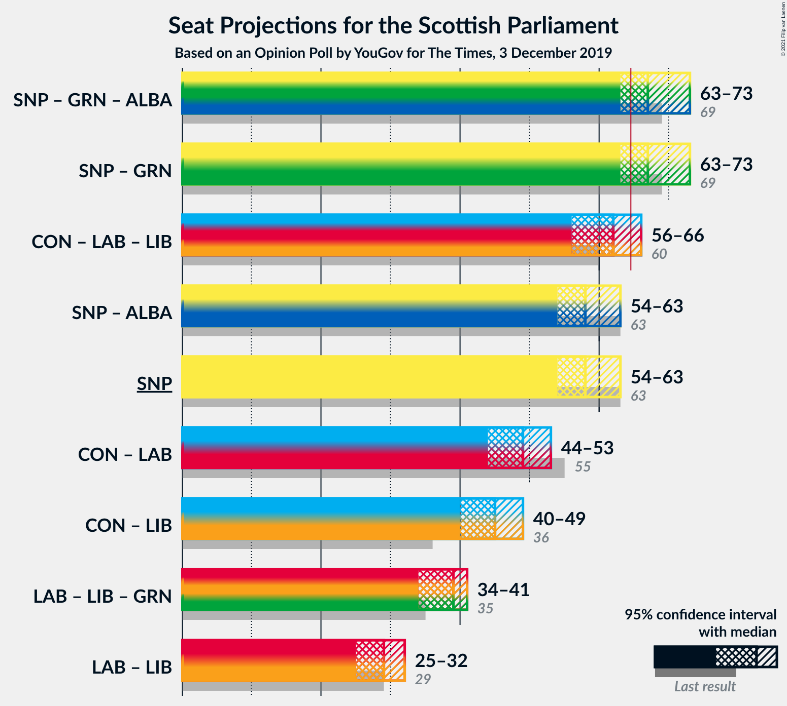

# Opinion Poll by YouGov for The Times, 3 December 2019

<a href="#voting-intentions">Voting Intentions</a> | <a href="#seats">Seats</a> | <a href="#coalitions">Coalitions</a> | <a href="#technical-information">Technical Information</a>

## Voting Intentions

### Confidence Intervals

| Party | Last Result | Poll Result | 80% Confidence Interval | 90% Confidence Interval | 95% Confidence Interval | 99% Confidence Interval |
|:-----:|:-----------:|:-----------:|:-----------------------:|:-----------------------:|:-----------------------:|:-----------------------:|
| Scottish National Party | 41.7% | 37.2% | 35.3–39.2% |34.8–39.8% |34.3–40.3% |33.4–41.2% |
| Scottish Conservative & Unionist Party | 22.9% | 25.1% | 23.4–27.0% |23.0–27.5% |22.6–27.9% |21.8–28.8% |
| Scottish Labour | 19.1% | 14.1% | 12.7–15.6% |12.4–16.0% |12.1–16.4% |11.4–17.1% |
| Scottish Liberal Democrats | 5.2% | 10.1% | 8.9–11.4% |8.6–11.8% |8.4–12.1% |7.8–12.8% |
| Scottish Greens | 6.6% | 8.1% | 7.1–9.3% |6.8–9.6% |6.6–9.9% |6.1–10.5% |
| Scottish Socialist Party | 0.5% | 3.0% | 2.4–3.8% |2.2–4.0% |2.1–4.3% |1.8–4.7% |
| Reform UK | 0.0% | 2.0% | 1.5–2.7% |1.4–2.9% |1.3–3.1% |1.1–3.4% |
| UK Independence Party | 2.0% | 0.3% | 0.2–0.7% |0.1–0.8% |0.1–0.9% |0.1–1.1% |

*Note:* The poll result column reflects the actual value used in the calculations. Published results may vary slightly, and in addition be rounded to fewer digits.

## Seats

### Confidence Intervals

| Party | Last Result | Median | 80% Confidence Interval | 90% Confidence Interval | 95% Confidence Interval | 99% Confidence Interval |
|:-----:|:-----------:|:------:|:-----------------------:|:-----------------------:|:-----------------------:|:-----------------------:|
| <a href="#scottish-national-party">Scottish National Party</a> | 63 | 60 | 54–62 |54–63 |54–63 |54–64 |
| <a href="#scottish-conservative-&-unionist-party">Scottish Conservative & Unionist Party</a> | 31 | 33 | 29–36 |28–36 |27–37 |26–38 |
| <a href="#scottish-labour">Scottish Labour</a> | 24 | 17 | 16–18 |16–20 |16–20 |15–22 |
| <a href="#scottish-liberal-democrats">Scottish Liberal Democrats</a> | 5 | 12 | 8–13 |8–14 |8–14 |8–14 |
| <a href="#scottish-greens">Scottish Greens</a> | 6 | 10 | 7–10 |5–10 |4–11 |3–12 |
| <a href="#scottish-socialist-party">Scottish Socialist Party</a> | 0 | 0 | 0 |0 |0 |0 |
| <a href="#reform-uk">Reform UK</a> | 0 | 0 | 0 |0 |0 |0 |
| <a href="#uk-independence-party">UK Independence Party</a> | 0 | 0 | 0 |0 |0 |0 |

### Scottish National Party

*For a full overview of the results for this party, see the [Scottish National Party](party-scottishnationalparty.html) page.*

| Number of Seats | Probability | Accumulated | Special Marks |
|:---------------:|:-----------:|:-----------:|:-------------:|
| 52 | 0.1% | 100% |  |
| 53 | 0.3% | 99.9% |  |
| 54 | 10% | 99.6% |  |
| 55 | 13% | 89% |  |
| 56 | 11% | 76% |  |
| 57 | 5% | 65% |  |
| 58 | 1.3% | 60% |  |
| 59 | 3% | 59% |  |
| 60 | 16% | 56% | Median |
| 61 | 11% | 40% |  |
| 62 | 24% | 29% |  |
| 63 | 4% | 5% | Last Result |
| 64 | 0.9% | 1.0% |  |
| 65 | 0.1% | 0.1% | Majority |
| 66 | 0% | 0% |  |

### Scottish Conservative & Unionist Party

*For a full overview of the results for this party, see the [Scottish Conservative & Unionist Party](party-scottishconservativeunionistparty.html) page.*

| Number of Seats | Probability | Accumulated | Special Marks |
|:---------------:|:-----------:|:-----------:|:-------------:|
| 25 | 0.2% | 100% |  |
| 26 | 0.3% | 99.8% |  |
| 27 | 3% | 99.5% |  |
| 28 | 3% | 96% |  |
| 29 | 7% | 93% |  |
| 30 | 3% | 86% |  |
| 31 | 9% | 83% | Last Result |
| 32 | 20% | 73% |  |
| 33 | 14% | 53% | Median |
| 34 | 6% | 39% |  |
| 35 | 20% | 33% |  |
| 36 | 9% | 13% |  |
| 37 | 3% | 4% |  |
| 38 | 1.0% | 1.1% |  |
| 39 | 0% | 0.1% |  |
| 40 | 0% | 0% |  |

### Scottish Labour

*For a full overview of the results for this party, see the [Scottish Labour](party-scottishlabour.html) page.*

| Number of Seats | Probability | Accumulated | Special Marks |
|:---------------:|:-----------:|:-----------:|:-------------:|
| 12 | 0% | 100% |  |
| 13 | 0.1% | 99.9% |  |
| 14 | 0.1% | 99.9% |  |
| 15 | 1.1% | 99.8% |  |
| 16 | 41% | 98.6% |  |
| 17 | 26% | 57% | Median |
| 18 | 22% | 31% |  |
| 19 | 1.3% | 9% |  |
| 20 | 6% | 8% |  |
| 21 | 1.4% | 2% |  |
| 22 | 0.5% | 0.6% |  |
| 23 | 0% | 0% |  |
| 24 | 0% | 0% | Last Result |

### Scottish Liberal Democrats

*For a full overview of the results for this party, see the [Scottish Liberal Democrats](party-scottishliberaldemocrats.html) page.*

| Number of Seats | Probability | Accumulated | Special Marks |
|:---------------:|:-----------:|:-----------:|:-------------:|
| 5 | 0% | 100% | Last Result |
| 6 | 0.1% | 100% |  |
| 7 | 0.2% | 99.9% |  |
| 8 | 15% | 99.6% |  |
| 9 | 3% | 85% |  |
| 10 | 15% | 82% |  |
| 11 | 16% | 67% |  |
| 12 | 18% | 51% | Median |
| 13 | 26% | 33% |  |
| 14 | 6% | 6% |  |
| 15 | 0.2% | 0.3% |  |
| 16 | 0% | 0% |  |

### Scottish Greens

*For a full overview of the results for this party, see the [Scottish Greens](party-scottishgreens.html) page.*

| Number of Seats | Probability | Accumulated | Special Marks |
|:---------------:|:-----------:|:-----------:|:-------------:|
| 3 | 0.8% | 100% |  |
| 4 | 3% | 99.2% |  |
| 5 | 1.0% | 96% |  |
| 6 | 2% | 95% | Last Result |
| 7 | 11% | 93% |  |
| 8 | 3% | 82% |  |
| 9 | 14% | 79% |  |
| 10 | 62% | 65% | Median |
| 11 | 0.8% | 3% |  |
| 12 | 2% | 2% |  |
| 13 | 0.2% | 0.2% |  |
| 14 | 0% | 0% |  |

### Scottish Socialist Party

*For a full overview of the results for this party, see the [Scottish Socialist Party](party-scottishsocialistparty.html) page.*

| Number of Seats | Probability | Accumulated | Special Marks |
|:---------------:|:-----------:|:-----------:|:-------------:|
| 0 | 100% | 100% | Last Result, Median |

### Reform UK

*For a full overview of the results for this party, see the [Reform UK](party-reformuk.html) page.*

| Number of Seats | Probability | Accumulated | Special Marks |
|:---------------:|:-----------:|:-----------:|:-------------:|
| 0 | 100% | 100% | Last Result, Median |

### UK Independence Party

*For a full overview of the results for this party, see the [UK Independence Party](party-ukindependenceparty.html) page.*

| Number of Seats | Probability | Accumulated | Special Marks |
|:---------------:|:-----------:|:-----------:|:-------------:|
| 0 | 100% | 100% | Last Result, Median |

## Coalitions

### Confidence Intervals

| Coalition | Last Result | Median | Majority? | 80% Confidence Interval | 90% Confidence Interval | 95% Confidence Interval | 99% Confidence Interval |
|:---------:|:-----------:|:------:|:---------:|:-----------------------:|:-----------------------:|:-----------------------:|:-----------------------:|
| Scottish National Party – Scottish Greens | 69 | 69 | 77% | 63–72 | 63–72 | 63–73 | 63–73 |
| Scottish Conservative & Unionist Party – Scottish Labour – Scottish Liberal Democrats | 60 | 60 | 23% | 57–66 | 57–66 | 56–66 | 56–66 |
| Scottish National Party | 63 | 60 | 0.1% | 54–62 | 54–63 | 54–63 | 54–64 |
| Scottish Conservative & Unionist Party – Scottish Labour | 55 | 50 | 0% | 46–53 | 45–53 | 44–53 | 44–55 |
| Scottish Conservative & Unionist Party – Scottish Liberal Democrats | 36 | 43 | 0% | 40–49 | 40–49 | 40–49 | 39–49 |
| Scottish Labour – Scottish Liberal Democrats – Scottish Greens | 35 | 38 | 0% | 34–40 | 34–41 | 34–42 | 33–42 |
| Scottish Labour – Scottish Liberal Democrats | 29 | 29 | 0% | 24–31 | 24–32 | 24–32 | 24–32 |

### Scottish National Party – Scottish Greens

| Number of Seats | Probability | Accumulated | Special Marks |
|:---------------:|:-----------:|:-----------:|:-------------:|
| 59 | 0.1% | 100% |  |
| 60 | 0.1% | 99.9% |  |
| 61 | 0.1% | 99.9% |  |
| 62 | 0.3% | 99.8% |  |
| 63 | 12% | 99.5% |  |
| 64 | 10% | 88% |  |
| 65 | 12% | 77% | Majority |
| 66 | 7% | 65% |  |
| 67 | 3% | 58% |  |
| 68 | 3% | 55% |  |
| 69 | 3% | 52% | Last Result |
| 70 | 18% | 49% | Median |
| 71 | 12% | 31% |  |
| 72 | 16% | 19% |  |
| 73 | 3% | 3% |  |
| 74 | 0.2% | 0.4% |  |
| 75 | 0.1% | 0.1% |  |
| 76 | 0% | 0% |  |

### Scottish Conservative & Unionist Party – Scottish Labour – Scottish Liberal Democrats

| Number of Seats | Probability | Accumulated | Special Marks |
|:---------------:|:-----------:|:-----------:|:-------------:|
| 54 | 0.1% | 100% |  |
| 55 | 0.2% | 99.9% |  |
| 56 | 3% | 99.6% |  |
| 57 | 16% | 97% |  |
| 58 | 12% | 81% |  |
| 59 | 18% | 69% |  |
| 60 | 3% | 51% | Last Result |
| 61 | 3% | 48% |  |
| 62 | 3% | 45% | Median |
| 63 | 7% | 42% |  |
| 64 | 12% | 35% |  |
| 65 | 10% | 23% | Majority |
| 66 | 12% | 12% |  |
| 67 | 0.3% | 0.5% |  |
| 68 | 0.1% | 0.2% |  |
| 69 | 0.1% | 0.1% |  |
| 70 | 0.1% | 0.1% |  |
| 71 | 0% | 0% |  |

### Scottish National Party

| Number of Seats | Probability | Accumulated | Special Marks |
|:---------------:|:-----------:|:-----------:|:-------------:|
| 52 | 0.1% | 100% |  |
| 53 | 0.3% | 99.9% |  |
| 54 | 10% | 99.6% |  |
| 55 | 13% | 89% |  |
| 56 | 11% | 76% |  |
| 57 | 5% | 65% |  |
| 58 | 1.3% | 60% |  |
| 59 | 3% | 59% |  |
| 60 | 16% | 56% | Median |
| 61 | 11% | 40% |  |
| 62 | 24% | 29% |  |
| 63 | 4% | 5% | Last Result |
| 64 | 0.9% | 1.0% |  |
| 65 | 0.1% | 0.1% | Majority |
| 66 | 0% | 0% |  |

### Scottish Conservative & Unionist Party – Scottish Labour

| Number of Seats | Probability | Accumulated | Special Marks |
|:---------------:|:-----------:|:-----------:|:-------------:|
| 43 | 0.3% | 100% |  |
| 44 | 4% | 99.7% |  |
| 45 | 4% | 96% |  |
| 46 | 2% | 92% |  |
| 47 | 12% | 90% |  |
| 48 | 6% | 78% |  |
| 49 | 20% | 72% |  |
| 50 | 9% | 52% | Median |
| 51 | 8% | 43% |  |
| 52 | 15% | 34% |  |
| 53 | 18% | 20% |  |
| 54 | 0.8% | 2% |  |
| 55 | 1.1% | 2% | Last Result |
| 56 | 0.2% | 0.4% |  |
| 57 | 0.2% | 0.2% |  |
| 58 | 0% | 0% |  |

### Scottish Conservative & Unionist Party – Scottish Liberal Democrats

| Number of Seats | Probability | Accumulated | Special Marks |
|:---------------:|:-----------:|:-----------:|:-------------:|
| 34 | 0.1% | 100% |  |
| 35 | 0.2% | 99.9% |  |
| 36 | 0% | 99.8% | Last Result |
| 37 | 0.1% | 99.7% |  |
| 38 | 0.2% | 99.7% |  |
| 39 | 1.1% | 99.5% |  |
| 40 | 11% | 98% |  |
| 41 | 18% | 87% |  |
| 42 | 15% | 69% |  |
| 43 | 8% | 54% |  |
| 44 | 6% | 46% |  |
| 45 | 3% | 40% | Median |
| 46 | 6% | 37% |  |
| 47 | 6% | 31% |  |
| 48 | 14% | 25% |  |
| 49 | 11% | 11% |  |
| 50 | 0.2% | 0.3% |  |
| 51 | 0.1% | 0.1% |  |
| 52 | 0% | 0% |  |

### Scottish Labour – Scottish Liberal Democrats – Scottish Greens

| Number of Seats | Probability | Accumulated | Special Marks |
|:---------------:|:-----------:|:-----------:|:-------------:|
| 32 | 0.3% | 100% |  |
| 33 | 0.7% | 99.6% |  |
| 34 | 13% | 98.9% |  |
| 35 | 8% | 86% | Last Result |
| 36 | 6% | 78% |  |
| 37 | 21% | 72% |  |
| 38 | 20% | 52% |  |
| 39 | 15% | 31% | Median |
| 40 | 9% | 16% |  |
| 41 | 3% | 7% |  |
| 42 | 3% | 4% |  |
| 43 | 0.2% | 0.2% |  |
| 44 | 0% | 0% |  |

### Scottish Labour – Scottish Liberal Democrats

| Number of Seats | Probability | Accumulated | Special Marks |
|:---------------:|:-----------:|:-----------:|:-------------:|
| 22 | 0.1% | 100% |  |
| 23 | 0.2% | 99.9% |  |
| 24 | 11% | 99.7% |  |
| 25 | 6% | 89% |  |
| 26 | 4% | 83% |  |
| 27 | 11% | 79% |  |
| 28 | 17% | 68% |  |
| 29 | 18% | 50% | Last Result, Median |
| 30 | 10% | 32% |  |
| 31 | 17% | 22% |  |
| 32 | 5% | 5% |  |
| 33 | 0.1% | 0.4% |  |
| 34 | 0.2% | 0.3% |  |
| 35 | 0.1% | 0.1% |  |
| 36 | 0% | 0% |  |

## Technical Information

### Opinion Poll

+ **Polling firm:** YouGov
+ **Commissioner(s):** The Times
+ **Fieldwork period:** 3 December 2019

### Calculations

+ **Sample size:** 1002
+ **Simulations done:** 131,072
+ **Error estimate:** 2.77%

