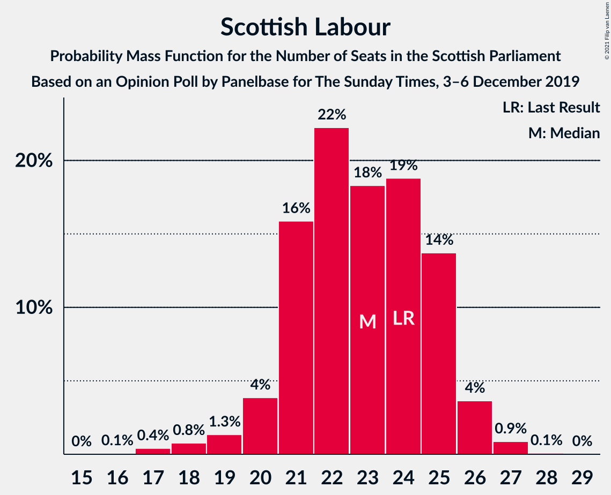
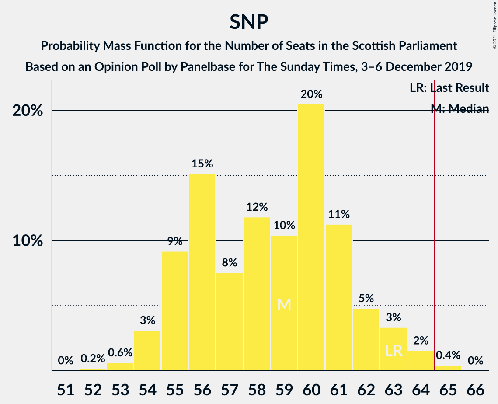

# Opinion Poll by Panelbase for The Sunday Times, 3–6 December 2019

<a href="#voting-intentions">Voting Intentions</a> | <a href="#seats">Seats</a> | <a href="#coalitions">Coalitions</a> | <a href="#technical-information">Technical Information</a>

## Voting Intentions

### Confidence Intervals

| Party | Last Result | Poll Result | 80% Confidence Interval | 90% Confidence Interval | 95% Confidence Interval | 99% Confidence Interval |
|:-----:|:-----------:|:-----------:|:-----------------------:|:-----------------------:|:-----------------------:|:-----------------------:|
| Scottish National Party | 41.7% | 38.0% | 36.1–40.0% |35.6–40.6% |35.1–41.1% |34.2–42.0% |
| Scottish Conservative & Unionist Party | 22.9% | 26.0% | 24.3–27.8% |23.8–28.3% |23.4–28.8% |22.6–29.7% |
| Scottish Labour | 19.1% | 18.0% | 16.6–19.7% |16.2–20.1% |15.8–20.5% |15.1–21.3% |
| Scottish Liberal Democrats | 5.2% | 9.0% | 8.0–10.3% |7.7–10.6% |7.4–10.9% |6.9–11.6% |
| Scottish Greens | 6.6% | 6.0% | 5.1–7.0% |4.9–7.3% |4.7–7.6% |4.3–8.2% |
| Reform UK | 0.0% | 2.0% | 1.5–2.7% |1.4–2.8% |1.3–3.0% |1.1–3.4% |

*Note:* The poll result column reflects the actual value used in the calculations. Published results may vary slightly, and in addition be rounded to fewer digits.

## Seats

### Confidence Intervals

| Party | Last Result | Median | 80% Confidence Interval | 90% Confidence Interval | 95% Confidence Interval | 99% Confidence Interval |
|:-----:|:-----------:|:------:|:-----------------------:|:-----------------------:|:-----------------------:|:-----------------------:|
| <a href="#scottish-national-party">Scottish National Party</a> | 63 | 59 | 55–62 |55–63 |54–63 |53–64 |
| <a href="#scottish-conservative-&-unionist-party">Scottish Conservative & Unionist Party</a> | 31 | 34 | 31–36 |31–37 |30–37 |28–39 |
| <a href="#scottish-labour">Scottish Labour</a> | 24 | 23 | 21–25 |20–25 |19–26 |18–27 |
| <a href="#scottish-liberal-democrats">Scottish Liberal Democrats</a> | 5 | 10 | 8–13 |8–13 |7–13 |6–13 |
| <a href="#scottish-greens">Scottish Greens</a> | 6 | 3 | 2–6 |2–7 |2–8 |2–10 |
| <a href="#reform-uk">Reform UK</a> | 0 | 0 | 0 |0 |0 |0 |

### Scottish National Party

*For a full overview of the results for this party, see the [Scottish National Party](party-scottishnationalparty.html) page.*

| Number of Seats | Probability | Accumulated | Special Marks |
|:---------------:|:-----------:|:-----------:|:-------------:|
| 52 | 0.2% | 100% |  |
| 53 | 0.6% | 99.8% |  |
| 54 | 3% | 99.1% |  |
| 55 | 9% | 96% |  |
| 56 | 15% | 87% |  |
| 57 | 8% | 72% |  |
| 58 | 12% | 64% |  |
| 59 | 10% | 52% | Median |
| 60 | 20% | 42% |  |
| 61 | 11% | 21% |  |
| 62 | 5% | 10% |  |
| 63 | 3% | 5% | Last Result |
| 64 | 2% | 2% |  |
| 65 | 0.4% | 0.5% | Majority |
| 66 | 0% | 0% |  |

### Scottish Conservative & Unionist Party

*For a full overview of the results for this party, see the [Scottish Conservative & Unionist Party](party-scottishconservativeunionistparty.html) page.*

| Number of Seats | Probability | Accumulated | Special Marks |
|:---------------:|:-----------:|:-----------:|:-------------:|
| 26 | 0.1% | 100% |  |
| 27 | 0.2% | 99.9% |  |
| 28 | 0.3% | 99.8% |  |
| 29 | 0.5% | 99.5% |  |
| 30 | 3% | 99.0% |  |
| 31 | 18% | 96% | Last Result |
| 32 | 16% | 79% |  |
| 33 | 12% | 62% |  |
| 34 | 14% | 50% | Median |
| 35 | 18% | 36% |  |
| 36 | 10% | 19% |  |
| 37 | 7% | 9% |  |
| 38 | 2% | 2% |  |
| 39 | 0.4% | 0.6% |  |
| 40 | 0.1% | 0.2% |  |
| 41 | 0% | 0.1% |  |
| 42 | 0% | 0% |  |

### Scottish Labour

*For a full overview of the results for this party, see the [Scottish Labour](party-scottishlabour.html) page.*

| Number of Seats | Probability | Accumulated | Special Marks |
|:---------------:|:-----------:|:-----------:|:-------------:|
| 16 | 0.1% | 100% |  |
| 17 | 0.4% | 99.9% |  |
| 18 | 0.8% | 99.5% |  |
| 19 | 1.3% | 98.8% |  |
| 20 | 4% | 97% |  |
| 21 | 16% | 94% |  |
| 22 | 22% | 78% |  |
| 23 | 18% | 55% | Median |
| 24 | 19% | 37% | Last Result |
| 25 | 14% | 18% |  |
| 26 | 4% | 5% |  |
| 27 | 0.9% | 1.0% |  |
| 28 | 0.1% | 0.1% |  |
| 29 | 0% | 0% |  |

### Scottish Liberal Democrats

*For a full overview of the results for this party, see the [Scottish Liberal Democrats](party-scottishliberaldemocrats.html) page.*

| Number of Seats | Probability | Accumulated | Special Marks |
|:---------------:|:-----------:|:-----------:|:-------------:|
| 5 | 0.1% | 100% | Last Result |
| 6 | 2% | 99.9% |  |
| 7 | 2% | 98% |  |
| 8 | 14% | 96% |  |
| 9 | 14% | 82% |  |
| 10 | 22% | 68% | Median |
| 11 | 24% | 46% |  |
| 12 | 8% | 22% |  |
| 13 | 14% | 14% |  |
| 14 | 0.4% | 0.4% |  |
| 15 | 0% | 0% |  |

### Scottish Greens

*For a full overview of the results for this party, see the [Scottish Greens](party-scottishgreens.html) page.*

| Number of Seats | Probability | Accumulated | Special Marks |
|:---------------:|:-----------:|:-----------:|:-------------:|
| 2 | 19% | 100% |  |
| 3 | 32% | 81% | Median |
| 4 | 24% | 50% |  |
| 5 | 10% | 26% |  |
| 6 | 7% | 15% | Last Result |
| 7 | 5% | 8% |  |
| 8 | 1.1% | 3% |  |
| 9 | 1.0% | 2% |  |
| 10 | 1.1% | 1.1% |  |
| 11 | 0% | 0% |  |

### Reform UK

*For a full overview of the results for this party, see the [Reform UK](party-reformuk.html) page.*

| Number of Seats | Probability | Accumulated | Special Marks |
|:---------------:|:-----------:|:-----------:|:-------------:|
| 0 | 100% | 100% | Last Result, Median |

## Coalitions

### Confidence Intervals

| Coalition | Last Result | Median | Majority? | 80% Confidence Interval | 90% Confidence Interval | 95% Confidence Interval | 99% Confidence Interval |
|:---------:|:-----------:|:------:|:---------:|:-----------------------:|:-----------------------:|:-----------------------:|:-----------------------:|
| Scottish Conservative & Unionist Party – Scottish Labour – Scottish Liberal Democrats | 60 | 67 | 78% | 63–70 | 62–71 | 61–72 | 58–73 |
| Scottish National Party – Scottish Greens | 69 | 62 | 22% | 59–66 | 58–67 | 57–68 | 56–71 |
| Scottish National Party | 63 | 59 | 0.5% | 55–62 | 55–63 | 54–63 | 53–64 |
| Scottish Conservative & Unionist Party – Scottish Labour | 55 | 57 | 0% | 53–59 | 52–60 | 51–61 | 49–62 |
| Scottish Conservative & Unionist Party – Scottish Liberal Democrats | 36 | 44 | 0% | 41–47 | 40–48 | 39–49 | 38–50 |
| Scottish Labour – Scottish Liberal Democrats – Scottish Greens | 35 | 37 | 0% | 34–40 | 33–40 | 33–41 | 32–43 |
| Scottish Labour – Scottish Liberal Democrats | 29 | 33 | 0% | 30–36 | 30–37 | 29–37 | 26–38 |

### Scottish Conservative & Unionist Party – Scottish Labour – Scottish Liberal Democrats

| Number of Seats | Probability | Accumulated | Special Marks |
|:---------------:|:-----------:|:-----------:|:-------------:|
| 56 | 0.1% | 100% |  |
| 57 | 0.1% | 99.9% |  |
| 58 | 0.3% | 99.8% |  |
| 59 | 0.5% | 99.5% |  |
| 60 | 0.6% | 99.0% | Last Result |
| 61 | 1.0% | 98% |  |
| 62 | 4% | 97% |  |
| 63 | 8% | 94% |  |
| 64 | 7% | 85% |  |
| 65 | 11% | 78% | Majority |
| 66 | 14% | 67% |  |
| 67 | 15% | 53% | Median |
| 68 | 11% | 37% |  |
| 69 | 11% | 26% |  |
| 70 | 8% | 15% |  |
| 71 | 4% | 8% |  |
| 72 | 3% | 4% |  |
| 73 | 1.0% | 1.1% |  |
| 74 | 0.1% | 0.1% |  |
| 75 | 0% | 0% |  |

### Scottish National Party – Scottish Greens

| Number of Seats | Probability | Accumulated | Special Marks |
|:---------------:|:-----------:|:-----------:|:-------------:|
| 55 | 0.1% | 100% |  |
| 56 | 1.0% | 99.9% |  |
| 57 | 3% | 98.9% |  |
| 58 | 4% | 96% |  |
| 59 | 8% | 92% |  |
| 60 | 11% | 85% |  |
| 61 | 11% | 74% |  |
| 62 | 15% | 63% | Median |
| 63 | 14% | 47% |  |
| 64 | 11% | 33% |  |
| 65 | 7% | 22% | Majority |
| 66 | 8% | 15% |  |
| 67 | 4% | 6% |  |
| 68 | 1.0% | 3% |  |
| 69 | 0.6% | 2% | Last Result |
| 70 | 0.5% | 1.0% |  |
| 71 | 0.3% | 0.5% |  |
| 72 | 0.1% | 0.2% |  |
| 73 | 0.1% | 0.1% |  |
| 74 | 0% | 0% |  |

### Scottish National Party

| Number of Seats | Probability | Accumulated | Special Marks |
|:---------------:|:-----------:|:-----------:|:-------------:|
| 52 | 0.2% | 100% |  |
| 53 | 0.6% | 99.8% |  |
| 54 | 3% | 99.1% |  |
| 55 | 9% | 96% |  |
| 56 | 15% | 87% |  |
| 57 | 8% | 72% |  |
| 58 | 12% | 64% |  |
| 59 | 10% | 52% | Median |
| 60 | 20% | 42% |  |
| 61 | 11% | 21% |  |
| 62 | 5% | 10% |  |
| 63 | 3% | 5% | Last Result |
| 64 | 2% | 2% |  |
| 65 | 0.4% | 0.5% | Majority |
| 66 | 0% | 0% |  |

### Scottish Conservative & Unionist Party – Scottish Labour

| Number of Seats | Probability | Accumulated | Special Marks |
|:---------------:|:-----------:|:-----------:|:-------------:|
| 47 | 0.1% | 100% |  |
| 48 | 0.3% | 99.9% |  |
| 49 | 0.4% | 99.6% |  |
| 50 | 0.6% | 99.2% |  |
| 51 | 1.4% | 98.6% |  |
| 52 | 3% | 97% |  |
| 53 | 8% | 94% |  |
| 54 | 10% | 86% |  |
| 55 | 10% | 76% | Last Result |
| 56 | 14% | 66% |  |
| 57 | 19% | 53% | Median |
| 58 | 12% | 33% |  |
| 59 | 14% | 21% |  |
| 60 | 4% | 7% |  |
| 61 | 2% | 3% |  |
| 62 | 0.8% | 1.1% |  |
| 63 | 0.2% | 0.4% |  |
| 64 | 0.1% | 0.1% |  |
| 65 | 0% | 0% | Majority |

### Scottish Conservative & Unionist Party – Scottish Liberal Democrats

| Number of Seats | Probability | Accumulated | Special Marks |
|:---------------:|:-----------:|:-----------:|:-------------:|
| 35 | 0% | 100% |  |
| 36 | 0.1% | 99.9% | Last Result |
| 37 | 0.2% | 99.8% |  |
| 38 | 0.7% | 99.6% |  |
| 39 | 2% | 98.9% |  |
| 40 | 6% | 97% |  |
| 41 | 14% | 92% |  |
| 42 | 12% | 77% |  |
| 43 | 14% | 65% |  |
| 44 | 11% | 51% | Median |
| 45 | 11% | 40% |  |
| 46 | 12% | 29% |  |
| 47 | 7% | 16% |  |
| 48 | 6% | 9% |  |
| 49 | 2% | 3% |  |
| 50 | 1.0% | 1.2% |  |
| 51 | 0.2% | 0.2% |  |
| 52 | 0% | 0.1% |  |
| 53 | 0% | 0% |  |

### Scottish Labour – Scottish Liberal Democrats – Scottish Greens

| Number of Seats | Probability | Accumulated | Special Marks |
|:---------------:|:-----------:|:-----------:|:-------------:|
| 30 | 0.1% | 100% |  |
| 31 | 0.3% | 99.9% |  |
| 32 | 1.3% | 99.6% |  |
| 33 | 5% | 98% |  |
| 34 | 9% | 93% |  |
| 35 | 9% | 84% | Last Result |
| 36 | 15% | 75% | Median |
| 37 | 16% | 60% |  |
| 38 | 20% | 44% |  |
| 39 | 12% | 24% |  |
| 40 | 7% | 12% |  |
| 41 | 3% | 5% |  |
| 42 | 1.3% | 2% |  |
| 43 | 0.6% | 0.8% |  |
| 44 | 0.1% | 0.2% |  |
| 45 | 0% | 0% |  |

### Scottish Labour – Scottish Liberal Democrats

| Number of Seats | Probability | Accumulated | Special Marks |
|:---------------:|:-----------:|:-----------:|:-------------:|
| 24 | 0.1% | 100% |  |
| 25 | 0.2% | 99.9% |  |
| 26 | 0.3% | 99.7% |  |
| 27 | 0.4% | 99.5% |  |
| 28 | 1.3% | 99.1% |  |
| 29 | 3% | 98% | Last Result |
| 30 | 7% | 95% |  |
| 31 | 12% | 88% |  |
| 32 | 17% | 76% |  |
| 33 | 15% | 59% | Median |
| 34 | 15% | 44% |  |
| 35 | 13% | 29% |  |
| 36 | 8% | 15% |  |
| 37 | 6% | 7% |  |
| 38 | 1.3% | 2% |  |
| 39 | 0.2% | 0.2% |  |
| 40 | 0% | 0% |  |

## Technical Information

### Opinion Poll

+ **Polling firm:** Panelbase
+ **Commissioner(s):** The Sunday Times
+ **Fieldwork period:** 3–6 December 2019

### Calculations

+ **Sample size:** 1020
+ **Simulations done:** 1,048,576
+ **Error estimate:** 0.84%

