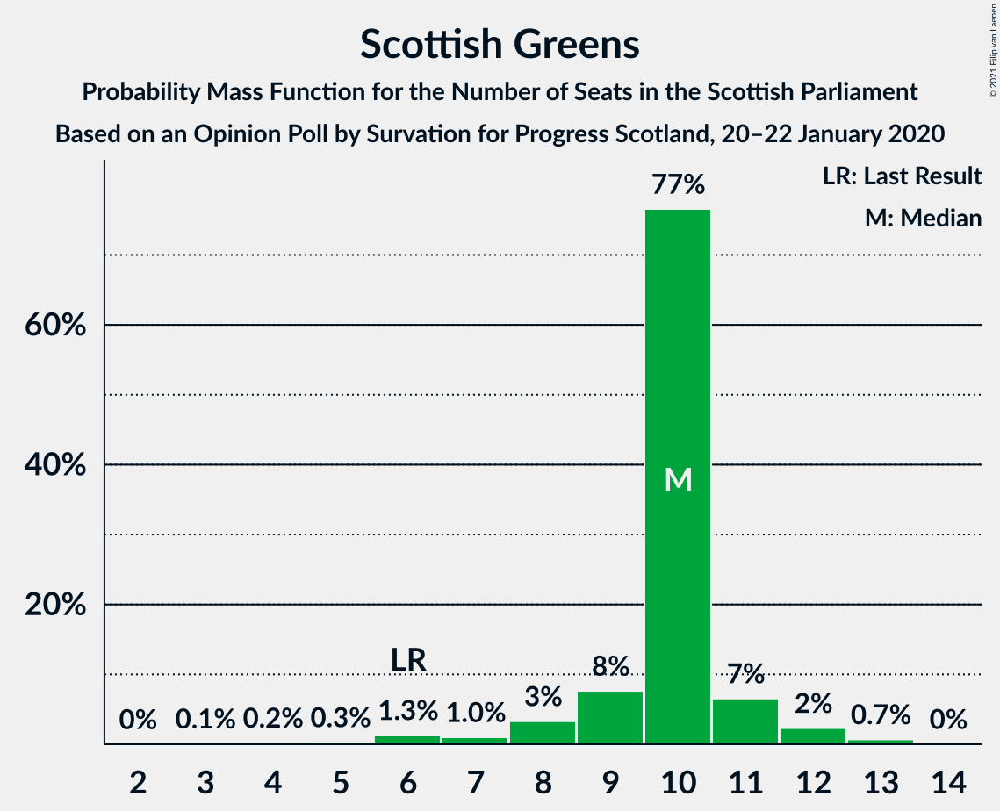
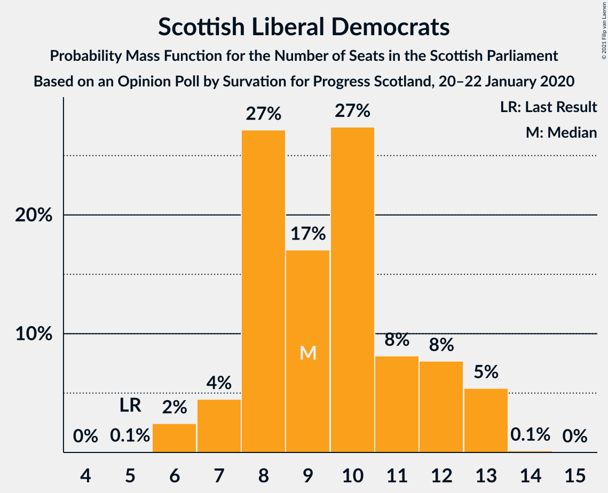

# Opinion Poll by Survation for Progress Scotland, 20–22 January 2020

<a href="#voting-intentions">Voting Intentions</a> | <a href="#seats">Seats</a> | <a href="#coalitions">Coalitions</a> | <a href="#technical-information">Technical Information</a>

## Voting Intentions

### Confidence Intervals

| Party | Last Result | Poll Result | 80% Confidence Interval | 90% Confidence Interval | 95% Confidence Interval | 99% Confidence Interval |
|:-----:|:-----------:|:-----------:|:-----------------------:|:-----------------------:|:-----------------------:|:-----------------------:|
| Scottish National Party | 41.7% | 38.3% | 36.4–40.3% |35.8–40.8% |35.3–41.3% |34.4–42.3% |
| Scottish Conservative & Unionist Party | 22.9% | 21.2% | 19.6–22.9% |19.2–23.4% |18.8–23.8% |18.1–24.7% |
| Scottish Labour | 19.1% | 19.1% | 17.6–20.8% |17.2–21.3% |16.8–21.7% |16.1–22.5% |
| Scottish Greens | 6.6% | 9.0% | 8.0–10.3% |7.7–10.6% |7.4–11.0% |6.9–11.6% |
| Scottish Liberal Democrats | 5.2% | 9.0% | 8.0–10.3% |7.7–10.6% |7.4–11.0% |6.9–11.6% |
| Reform UK | 0.0% | 2.1% | 1.6–2.8% |1.5–3.0% |1.4–3.1% |1.2–3.5% |
| UK Independence Party | 2.0% | 1.0% | 0.7–1.5% |0.6–1.7% |0.5–1.8% |0.4–2.1% |

*Note:* The poll result column reflects the actual value used in the calculations. Published results may vary slightly, and in addition be rounded to fewer digits.

## Seats

### Confidence Intervals

| Party | Last Result | Median | 80% Confidence Interval | 90% Confidence Interval | 95% Confidence Interval | 99% Confidence Interval |
|:-----:|:-----------:|:------:|:-----------------------:|:-----------------------:|:-----------------------:|:-----------------------:|
| <a href="#scottish-national-party">Scottish National Party</a> | 63 | 61 | 59–65 |58–67 |57–68 |55–70 |
| <a href="#scottish-conservative-&-unionist-party">Scottish Conservative & Unionist Party</a> | 31 | 25 | 23–27 |22–29 |21–30 |20–31 |
| <a href="#scottish-labour">Scottish Labour</a> | 24 | 23 | 21–26 |20–26 |19–27 |18–28 |
| <a href="#scottish-greens">Scottish Greens</a> | 6 | 10 | 9–10 |8–11 |7–12 |5–13 |
| <a href="#scottish-liberal-democrats">Scottish Liberal Democrats</a> | 5 | 9 | 8–12 |7–13 |6–13 |6–13 |
| <a href="#reform-uk">Reform UK</a> | 0 | 0 | 0 |0 |0 |0 |
| <a href="#uk-independence-party">UK Independence Party</a> | 0 | 0 | 0 |0 |0 |0 |

### Scottish National Party

*For a full overview of the results for this party, see the [Scottish National Party](party-scottishnationalparty.html) page.*

| Number of Seats | Probability | Accumulated | Special Marks |
|:---------------:|:-----------:|:-----------:|:-------------:|
| 52 | 0.1% | 100% |  |
| 53 | 0.2% | 99.9% |  |
| 54 | 0.2% | 99.7% |  |
| 55 | 0.4% | 99.5% |  |
| 56 | 0.5% | 99.1% |  |
| 57 | 1.1% | 98.6% |  |
| 58 | 4% | 97% |  |
| 59 | 13% | 94% |  |
| 60 | 19% | 81% |  |
| 61 | 25% | 61% | Median |
| 62 | 10% | 36% |  |
| 63 | 10% | 26% | Last Result |
| 64 | 4% | 16% |  |
| 65 | 4% | 12% | Majority |
| 66 | 2% | 8% |  |
| 67 | 2% | 6% |  |
| 68 | 2% | 4% |  |
| 69 | 0.8% | 2% |  |
| 70 | 1.0% | 1.2% |  |
| 71 | 0.2% | 0.2% |  |
| 72 | 0% | 0% |  |

### Scottish Conservative & Unionist Party

*For a full overview of the results for this party, see the [Scottish Conservative & Unionist Party](party-scottishconservativeunionistparty.html) page.*

| Number of Seats | Probability | Accumulated | Special Marks |
|:---------------:|:-----------:|:-----------:|:-------------:|
| 19 | 0.1% | 100% |  |
| 20 | 0.7% | 99.9% |  |
| 21 | 4% | 99.1% |  |
| 22 | 3% | 95% |  |
| 23 | 8% | 92% |  |
| 24 | 29% | 84% |  |
| 25 | 21% | 55% | Median |
| 26 | 14% | 34% |  |
| 27 | 10% | 19% |  |
| 28 | 4% | 10% |  |
| 29 | 3% | 5% |  |
| 30 | 1.4% | 3% |  |
| 31 | 0.9% | 1.2% | Last Result |
| 32 | 0.2% | 0.3% |  |
| 33 | 0.1% | 0.1% |  |
| 34 | 0% | 0% |  |

### Scottish Labour

*For a full overview of the results for this party, see the [Scottish Labour](party-scottishlabour.html) page.*

| Number of Seats | Probability | Accumulated | Special Marks |
|:---------------:|:-----------:|:-----------:|:-------------:|
| 17 | 0.2% | 100% |  |
| 18 | 1.1% | 99.7% |  |
| 19 | 2% | 98.7% |  |
| 20 | 3% | 96% |  |
| 21 | 8% | 93% |  |
| 22 | 15% | 85% |  |
| 23 | 26% | 70% | Median |
| 24 | 19% | 44% | Last Result |
| 25 | 13% | 26% |  |
| 26 | 9% | 12% |  |
| 27 | 3% | 3% |  |
| 28 | 0.5% | 0.7% |  |
| 29 | 0.1% | 0.2% |  |
| 30 | 0.1% | 0.1% |  |
| 31 | 0% | 0% |  |

### Scottish Greens

*For a full overview of the results for this party, see the [Scottish Greens](party-scottishgreens.html) page.*

| Number of Seats | Probability | Accumulated | Special Marks |
|:---------------:|:-----------:|:-----------:|:-------------:|
| 3 | 0.1% | 100% |  |
| 4 | 0.2% | 99.9% |  |
| 5 | 0.3% | 99.7% |  |
| 6 | 1.3% | 99.4% | Last Result |
| 7 | 1.0% | 98% |  |
| 8 | 3% | 97% |  |
| 9 | 8% | 94% |  |
| 10 | 77% | 86% | Median |
| 11 | 7% | 10% |  |
| 12 | 2% | 3% |  |
| 13 | 0.7% | 0.7% |  |
| 14 | 0% | 0% |  |

### Scottish Liberal Democrats

*For a full overview of the results for this party, see the [Scottish Liberal Democrats](party-scottishliberaldemocrats.html) page.*

| Number of Seats | Probability | Accumulated | Special Marks |
|:---------------:|:-----------:|:-----------:|:-------------:|
| 5 | 0.1% | 100% | Last Result |
| 6 | 2% | 99.9% |  |
| 7 | 4% | 97% |  |
| 8 | 27% | 93% |  |
| 9 | 17% | 66% | Median |
| 10 | 27% | 49% |  |
| 11 | 8% | 21% |  |
| 12 | 8% | 13% |  |
| 13 | 5% | 6% |  |
| 14 | 0.1% | 0.1% |  |
| 15 | 0% | 0% |  |

### Reform UK

*For a full overview of the results for this party, see the [Reform UK](party-reformuk.html) page.*

| Number of Seats | Probability | Accumulated | Special Marks |
|:---------------:|:-----------:|:-----------:|:-------------:|
| 0 | 100% | 100% | Last Result, Median |

### UK Independence Party

*For a full overview of the results for this party, see the [UK Independence Party](party-ukindependenceparty.html) page.*

| Number of Seats | Probability | Accumulated | Special Marks |
|:---------------:|:-----------:|:-----------:|:-------------:|
| 0 | 100% | 100% | Last Result, Median |

## Coalitions

### Confidence Intervals

| Coalition | Last Result | Median | Majority? | 80% Confidence Interval | 90% Confidence Interval | 95% Confidence Interval | 99% Confidence Interval |
|:---------:|:-----------:|:------:|:---------:|:-----------------------:|:-----------------------:|:-----------------------:|:-----------------------:|
| Scottish National Party – Scottish Greens | 69 | 71 | 99.3% | 69–75 | 68–77 | 67–78 | 64–80 |
| Scottish National Party | 63 | 61 | 12% | 59–65 | 58–67 | 57–68 | 55–70 |
| Scottish Conservative & Unionist Party – Scottish Labour – Scottish Liberal Democrats | 60 | 58 | 0.7% | 54–60 | 52–61 | 51–62 | 49–65 |
| Scottish Conservative & Unionist Party – Scottish Labour | 55 | 48 | 0% | 45–51 | 44–52 | 42–53 | 41–55 |
| Scottish Labour – Scottish Greens – Scottish Liberal Democrats | 35 | 43 | 0% | 40–45 | 39–46 | 38–46 | 36–48 |
| Scottish Conservative & Unionist Party – Scottish Liberal Democrats | 36 | 34 | 0% | 31–38 | 30–38 | 29–40 | 27–41 |
| Scottish Labour – Scottish Liberal Democrats | 29 | 33 | 0% | 30–35 | 29–36 | 28–36 | 26–38 |

### Scottish National Party – Scottish Greens

| Number of Seats | Probability | Accumulated | Special Marks |
|:---------------:|:-----------:|:-----------:|:-------------:|
| 61 | 0% | 100% |  |
| 62 | 0.1% | 99.9% |  |
| 63 | 0.2% | 99.9% |  |
| 64 | 0.3% | 99.6% |  |
| 65 | 0.5% | 99.3% | Majority |
| 66 | 1.0% | 98.8% |  |
| 67 | 2% | 98% |  |
| 68 | 5% | 96% |  |
| 69 | 13% | 91% | Last Result |
| 70 | 16% | 79% |  |
| 71 | 26% | 62% | Median |
| 72 | 11% | 37% |  |
| 73 | 10% | 25% |  |
| 74 | 5% | 15% |  |
| 75 | 4% | 10% |  |
| 76 | 1.1% | 6% |  |
| 77 | 3% | 5% |  |
| 78 | 0.8% | 3% |  |
| 79 | 0.4% | 2% |  |
| 80 | 1.2% | 1.4% |  |
| 81 | 0.2% | 0.2% |  |
| 82 | 0% | 0% |  |

### Scottish National Party

| Number of Seats | Probability | Accumulated | Special Marks |
|:---------------:|:-----------:|:-----------:|:-------------:|
| 52 | 0.1% | 100% |  |
| 53 | 0.2% | 99.9% |  |
| 54 | 0.2% | 99.7% |  |
| 55 | 0.4% | 99.5% |  |
| 56 | 0.5% | 99.1% |  |
| 57 | 1.1% | 98.6% |  |
| 58 | 4% | 97% |  |
| 59 | 13% | 94% |  |
| 60 | 19% | 81% |  |
| 61 | 25% | 61% | Median |
| 62 | 10% | 36% |  |
| 63 | 10% | 26% | Last Result |
| 64 | 4% | 16% |  |
| 65 | 4% | 12% | Majority |
| 66 | 2% | 8% |  |
| 67 | 2% | 6% |  |
| 68 | 2% | 4% |  |
| 69 | 0.8% | 2% |  |
| 70 | 1.0% | 1.2% |  |
| 71 | 0.2% | 0.2% |  |
| 72 | 0% | 0% |  |

### Scottish Conservative & Unionist Party – Scottish Labour – Scottish Liberal Democrats

| Number of Seats | Probability | Accumulated | Special Marks |
|:---------------:|:-----------:|:-----------:|:-------------:|
| 48 | 0.2% | 100% |  |
| 49 | 1.2% | 99.8% |  |
| 50 | 0.4% | 98.6% |  |
| 51 | 0.8% | 98% |  |
| 52 | 3% | 97% |  |
| 53 | 1.1% | 95% |  |
| 54 | 4% | 94% |  |
| 55 | 5% | 90% |  |
| 56 | 10% | 85% |  |
| 57 | 11% | 75% | Median |
| 58 | 26% | 63% |  |
| 59 | 16% | 38% |  |
| 60 | 13% | 21% | Last Result |
| 61 | 5% | 9% |  |
| 62 | 2% | 4% |  |
| 63 | 1.0% | 2% |  |
| 64 | 0.5% | 1.2% |  |
| 65 | 0.3% | 0.7% | Majority |
| 66 | 0.2% | 0.4% |  |
| 67 | 0.1% | 0.1% |  |
| 68 | 0% | 0.1% |  |
| 69 | 0% | 0% |  |

### Scottish Conservative & Unionist Party – Scottish Labour

| Number of Seats | Probability | Accumulated | Special Marks |
|:---------------:|:-----------:|:-----------:|:-------------:|
| 40 | 0.4% | 100% |  |
| 41 | 0.9% | 99.6% |  |
| 42 | 1.2% | 98.7% |  |
| 43 | 2% | 97% |  |
| 44 | 3% | 95% |  |
| 45 | 4% | 93% |  |
| 46 | 8% | 89% |  |
| 47 | 13% | 80% |  |
| 48 | 20% | 68% | Median |
| 49 | 17% | 48% |  |
| 50 | 16% | 31% |  |
| 51 | 10% | 15% |  |
| 52 | 3% | 5% |  |
| 53 | 2% | 3% |  |
| 54 | 0.8% | 1.4% |  |
| 55 | 0.3% | 0.6% | Last Result |
| 56 | 0.2% | 0.3% |  |
| 57 | 0.1% | 0.2% |  |
| 58 | 0% | 0.1% |  |
| 59 | 0% | 0% |  |

### Scottish Labour – Scottish Greens – Scottish Liberal Democrats

| Number of Seats | Probability | Accumulated | Special Marks |
|:---------------:|:-----------:|:-----------:|:-------------:|
| 34 | 0.1% | 100% |  |
| 35 | 0.3% | 99.9% | Last Result |
| 36 | 0.5% | 99.6% |  |
| 37 | 0.9% | 99.1% |  |
| 38 | 2% | 98% |  |
| 39 | 5% | 96% |  |
| 40 | 8% | 91% |  |
| 41 | 9% | 83% |  |
| 42 | 17% | 74% | Median |
| 43 | 19% | 57% |  |
| 44 | 17% | 37% |  |
| 45 | 15% | 20% |  |
| 46 | 4% | 5% |  |
| 47 | 1.2% | 2% |  |
| 48 | 0.4% | 0.6% |  |
| 49 | 0.1% | 0.2% |  |
| 50 | 0.1% | 0.1% |  |
| 51 | 0% | 0% |  |

### Scottish Conservative & Unionist Party – Scottish Liberal Democrats

| Number of Seats | Probability | Accumulated | Special Marks |
|:---------------:|:-----------:|:-----------:|:-------------:|
| 26 | 0.1% | 100% |  |
| 27 | 0.8% | 99.9% |  |
| 28 | 1.3% | 99.1% |  |
| 29 | 0.5% | 98% |  |
| 30 | 3% | 97% |  |
| 31 | 5% | 94% |  |
| 32 | 12% | 89% |  |
| 33 | 12% | 78% |  |
| 34 | 18% | 65% | Median |
| 35 | 15% | 47% |  |
| 36 | 11% | 33% | Last Result |
| 37 | 12% | 22% |  |
| 38 | 6% | 11% |  |
| 39 | 2% | 5% |  |
| 40 | 2% | 3% |  |
| 41 | 0.8% | 1.2% |  |
| 42 | 0.2% | 0.4% |  |
| 43 | 0.1% | 0.2% |  |
| 44 | 0.1% | 0.1% |  |
| 45 | 0% | 0% |  |

### Scottish Labour – Scottish Liberal Democrats

| Number of Seats | Probability | Accumulated | Special Marks |
|:---------------:|:-----------:|:-----------:|:-------------:|
| 25 | 0.3% | 100% |  |
| 26 | 0.4% | 99.7% |  |
| 27 | 0.8% | 99.4% |  |
| 28 | 2% | 98.6% |  |
| 29 | 4% | 97% | Last Result |
| 30 | 6% | 93% |  |
| 31 | 10% | 87% |  |
| 32 | 18% | 77% | Median |
| 33 | 24% | 59% |  |
| 34 | 15% | 35% |  |
| 35 | 14% | 20% |  |
| 36 | 4% | 6% |  |
| 37 | 2% | 2% |  |
| 38 | 0.5% | 0.7% |  |
| 39 | 0.1% | 0.3% |  |
| 40 | 0.1% | 0.1% |  |
| 41 | 0% | 0.1% |  |
| 42 | 0% | 0% |  |

## Technical Information

### Opinion Poll

+ **Polling firm:** Survation
+ **Commissioner(s):** Progress Scotland
+ **Fieldwork period:** 20–22 January 2020

### Calculations

+ **Sample size:** 1019
+ **Simulations done:** 1,048,576
+ **Error estimate:** 1.43%

