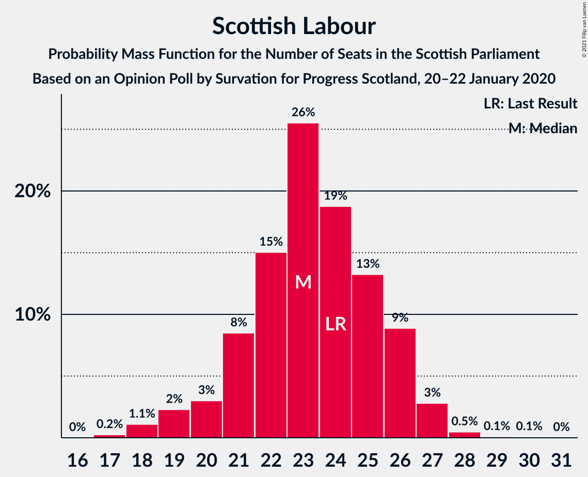

# Opinion Poll by Survation for Progress Scotland, 20–22 January 2020

<a href="#voting-intentions">Voting Intentions</a> | <a href="#seats">Seats</a> | <a href="#coalitions">Coalitions</a> | <a href="#technical-information">Technical Information</a>

## Voting Intentions

### Confidence Intervals

| Party | Last Result | Poll Result | 80% Confidence Interval | 90% Confidence Interval | 95% Confidence Interval | 99% Confidence Interval |
|:-----:|:-----------:|:-----------:|:-----------------------:|:-----------------------:|:-----------------------:|:-----------------------:|
| Scottish National Party | 41.7% | 38.3% | 36.4–40.3% |35.8–40.8% |35.3–41.3% |34.4–42.3% |
| Scottish Conservative & Unionist Party | 22.9% | 21.2% | 19.6–22.9% |19.2–23.4% |18.8–23.8% |18.1–24.7% |
| Scottish Labour | 19.1% | 19.1% | 17.6–20.8% |17.2–21.3% |16.8–21.7% |16.1–22.5% |
| Scottish Greens | 6.6% | 9.0% | 8.0–10.3% |7.7–10.6% |7.4–11.0% |6.9–11.6% |
| Scottish Liberal Democrats | 5.2% | 9.0% | 8.0–10.3% |7.7–10.6% |7.4–11.0% |6.9–11.6% |
| Reform UK | 0.0% | 2.1% | 1.6–2.8% |1.5–3.0% |1.4–3.1% |1.2–3.5% |
| UK Independence Party | 2.0% | 1.0% | 0.7–1.5% |0.6–1.7% |0.5–1.8% |0.4–2.1% |

*Note:* The poll result column reflects the actual value used in the calculations. Published results may vary slightly, and in addition be rounded to fewer digits.

## Seats

### Confidence Intervals

| Party | Last Result | Median | 80% Confidence Interval | 90% Confidence Interval | 95% Confidence Interval | 99% Confidence Interval |
|:-----:|:-----------:|:------:|:-----------------------:|:-----------------------:|:-----------------------:|:-----------------------:|
| <a href="#scottish-national-party">Scottish National Party</a> | 63 | 65 | 63–69 |63–70 |62–70 |62–71 |
| <a href="#scottish-conservative-&-unionist-party">Scottish Conservative & Unionist Party</a> | 31 | 23 | 21–25 |21–25 |20–27 |20–30 |
| <a href="#scottish-labour">Scottish Labour</a> | 24 | 22 | 20–24 |19–24 |19–25 |17–27 |
| <a href="#scottish-greens">Scottish Greens</a> | 6 | 10 | 8–10 |8–11 |7–11 |4–11 |
| <a href="#scottish-liberal-democrats">Scottish Liberal Democrats</a> | 5 | 8 | 7–10 |6–10 |6–11 |6–11 |
| <a href="#reform-uk">Reform UK</a> | 0 | 0 | 0 |0 |0 |0 |
| <a href="#uk-independence-party">UK Independence Party</a> | 0 | 0 | 0 |0 |0 |0 |

### Scottish National Party

*For a full overview of the results for this party, see the [Scottish National Party](party-scottishnationalparty.html) page.*

| Number of Seats | Probability | Accumulated | Special Marks |
|:---------------:|:-----------:|:-----------:|:-------------:|
| 56 | 0% | 100% |  |
| 57 | 0% | 99.9% |  |
| 58 | 0% | 99.9% |  |
| 59 | 0% | 99.9% |  |
| 60 | 0.1% | 99.9% |  |
| 61 | 0.3% | 99.8% |  |
| 62 | 3% | 99.5% |  |
| 63 | 28% | 96% | Last Result |
| 64 | 10% | 68% |  |
| 65 | 13% | 59% | Median, Majority |
| 66 | 12% | 46% |  |
| 67 | 8% | 34% |  |
| 68 | 13% | 26% |  |
| 69 | 5% | 13% |  |
| 70 | 7% | 8% |  |
| 71 | 1.2% | 1.2% |  |
| 72 | 0% | 0% |  |

### Scottish Conservative & Unionist Party

*For a full overview of the results for this party, see the [Scottish Conservative & Unionist Party](party-scottishconservativeunionistparty.html) page.*

| Number of Seats | Probability | Accumulated | Special Marks |
|:---------------:|:-----------:|:-----------:|:-------------:|
| 18 | 0.1% | 100% |  |
| 19 | 0.3% | 99.9% |  |
| 20 | 4% | 99.6% |  |
| 21 | 20% | 95% |  |
| 22 | 7% | 75% |  |
| 23 | 22% | 69% | Median |
| 24 | 34% | 46% |  |
| 25 | 9% | 13% |  |
| 26 | 1.1% | 4% |  |
| 27 | 0.6% | 3% |  |
| 28 | 0.2% | 2% |  |
| 29 | 1.0% | 2% |  |
| 30 | 0.8% | 1.1% |  |
| 31 | 0.2% | 0.3% | Last Result |
| 32 | 0.1% | 0.1% |  |
| 33 | 0% | 0% |  |

### Scottish Labour

*For a full overview of the results for this party, see the [Scottish Labour](party-scottishlabour.html) page.*

| Number of Seats | Probability | Accumulated | Special Marks |
|:---------------:|:-----------:|:-----------:|:-------------:|
| 17 | 0.8% | 100% |  |
| 18 | 0.8% | 99.2% |  |
| 19 | 5% | 98% |  |
| 20 | 6% | 93% |  |
| 21 | 9% | 87% |  |
| 22 | 32% | 78% | Median |
| 23 | 4% | 46% |  |
| 24 | 39% | 42% | Last Result |
| 25 | 1.4% | 3% |  |
| 26 | 0.8% | 1.3% |  |
| 27 | 0.2% | 0.5% |  |
| 28 | 0.3% | 0.3% |  |
| 29 | 0% | 0% |  |

### Scottish Greens

*For a full overview of the results for this party, see the [Scottish Greens](party-scottishgreens.html) page.*

| Number of Seats | Probability | Accumulated | Special Marks |
|:---------------:|:-----------:|:-----------:|:-------------:|
| 3 | 0.2% | 100% |  |
| 4 | 0.9% | 99.8% |  |
| 5 | 0.7% | 99.0% |  |
| 6 | 0.5% | 98% | Last Result |
| 7 | 2% | 98% |  |
| 8 | 12% | 95% |  |
| 9 | 14% | 83% |  |
| 10 | 63% | 70% | Median |
| 11 | 6% | 6% |  |
| 12 | 0.4% | 0.4% |  |
| 13 | 0% | 0% |  |

### Scottish Liberal Democrats

*For a full overview of the results for this party, see the [Scottish Liberal Democrats](party-scottishliberaldemocrats.html) page.*

| Number of Seats | Probability | Accumulated | Special Marks |
|:---------------:|:-----------:|:-----------:|:-------------:|
| 5 | 0% | 100% | Last Result |
| 6 | 8% | 99.9% |  |
| 7 | 20% | 92% |  |
| 8 | 32% | 72% | Median |
| 9 | 5% | 40% |  |
| 10 | 33% | 35% |  |
| 11 | 2% | 3% |  |
| 12 | 0.3% | 0.4% |  |
| 13 | 0% | 0.1% |  |
| 14 | 0% | 0% |  |

### Reform UK

*For a full overview of the results for this party, see the [Reform UK](party-reformuk.html) page.*

| Number of Seats | Probability | Accumulated | Special Marks |
|:---------------:|:-----------:|:-----------:|:-------------:|
| 0 | 100% | 100% | Last Result, Median |

### UK Independence Party

*For a full overview of the results for this party, see the [UK Independence Party](party-ukindependenceparty.html) page.*

| Number of Seats | Probability | Accumulated | Special Marks |
|:---------------:|:-----------:|:-----------:|:-------------:|
| 0 | 100% | 100% | Last Result, Median |

## Coalitions

### Confidence Intervals

| Coalition | Last Result | Median | Majority? | 80% Confidence Interval | 90% Confidence Interval | 95% Confidence Interval | 99% Confidence Interval |
|:---------:|:-----------:|:------:|:---------:|:-----------------------:|:-----------------------:|:-----------------------:|:-----------------------:|
| Scottish National Party – Scottish Greens | 69 | 74 | 100% | 73–79 | 72–80 | 71–80 | 68–81 |
| Scottish National Party | 63 | 65 | 59% | 63–69 | 63–70 | 62–70 | 62–71 |
| Scottish Conservative & Unionist Party – Scottish Labour – Scottish Liberal Democrats | 60 | 55 | 0% | 50–56 | 49–57 | 49–58 | 48–61 |
| Scottish Conservative & Unionist Party – Scottish Labour | 55 | 46 | 0% | 42–48 | 41–49 | 41–49 | 40–52 |
| Scottish Labour – Scottish Greens – Scottish Liberal Democrats | 35 | 40 | 0% | 38–42 | 38–42 | 36–42 | 35–43 |
| Scottish Conservative & Unionist Party – Scottish Liberal Democrats | 36 | 32 | 0% | 28–34 | 27–35 | 27–36 | 26–40 |
| Scottish Labour – Scottish Liberal Democrats | 29 | 32 | 0% | 28–32 | 28–32 | 27–33 | 25–35 |

### Scottish National Party – Scottish Greens

| Number of Seats | Probability | Accumulated | Special Marks |
|:---------------:|:-----------:|:-----------:|:-------------:|
| 66 | 0.2% | 100% |  |
| 67 | 0.2% | 99.8% |  |
| 68 | 0.1% | 99.6% |  |
| 69 | 0.3% | 99.5% | Last Result |
| 70 | 0.5% | 99.2% |  |
| 71 | 1.2% | 98.7% |  |
| 72 | 3% | 97% |  |
| 73 | 34% | 94% |  |
| 74 | 14% | 60% |  |
| 75 | 11% | 46% | Median |
| 76 | 4% | 35% |  |
| 77 | 15% | 31% |  |
| 78 | 5% | 16% |  |
| 79 | 2% | 11% |  |
| 80 | 8% | 9% |  |
| 81 | 1.3% | 1.3% |  |
| 82 | 0% | 0% |  |

### Scottish National Party

| Number of Seats | Probability | Accumulated | Special Marks |
|:---------------:|:-----------:|:-----------:|:-------------:|
| 56 | 0% | 100% |  |
| 57 | 0% | 99.9% |  |
| 58 | 0% | 99.9% |  |
| 59 | 0% | 99.9% |  |
| 60 | 0.1% | 99.9% |  |
| 61 | 0.3% | 99.8% |  |
| 62 | 3% | 99.5% |  |
| 63 | 28% | 96% | Last Result |
| 64 | 10% | 68% |  |
| 65 | 13% | 59% | Median, Majority |
| 66 | 12% | 46% |  |
| 67 | 8% | 34% |  |
| 68 | 13% | 26% |  |
| 69 | 5% | 13% |  |
| 70 | 7% | 8% |  |
| 71 | 1.2% | 1.2% |  |
| 72 | 0% | 0% |  |

### Scottish Conservative & Unionist Party – Scottish Labour – Scottish Liberal Democrats

| Number of Seats | Probability | Accumulated | Special Marks |
|:---------------:|:-----------:|:-----------:|:-------------:|
| 48 | 1.3% | 100% |  |
| 49 | 8% | 98.7% |  |
| 50 | 2% | 91% |  |
| 51 | 5% | 89% |  |
| 52 | 15% | 84% |  |
| 53 | 4% | 69% | Median |
| 54 | 11% | 65% |  |
| 55 | 14% | 54% |  |
| 56 | 34% | 40% |  |
| 57 | 3% | 6% |  |
| 58 | 1.2% | 3% |  |
| 59 | 0.5% | 1.3% |  |
| 60 | 0.3% | 0.8% | Last Result |
| 61 | 0.1% | 0.5% |  |
| 62 | 0.2% | 0.4% |  |
| 63 | 0.2% | 0.2% |  |
| 64 | 0% | 0% |  |

### Scottish Conservative & Unionist Party – Scottish Labour

| Number of Seats | Probability | Accumulated | Special Marks |
|:---------------:|:-----------:|:-----------:|:-------------:|
| 39 | 0.1% | 100% |  |
| 40 | 2% | 99.9% |  |
| 41 | 5% | 98% |  |
| 42 | 7% | 92% |  |
| 43 | 8% | 85% |  |
| 44 | 6% | 78% |  |
| 45 | 12% | 72% | Median |
| 46 | 19% | 59% |  |
| 47 | 19% | 40% |  |
| 48 | 15% | 21% |  |
| 49 | 4% | 6% |  |
| 50 | 0.4% | 2% |  |
| 51 | 1.0% | 2% |  |
| 52 | 0.7% | 0.9% |  |
| 53 | 0.1% | 0.2% |  |
| 54 | 0.1% | 0.1% |  |
| 55 | 0% | 0% | Last Result |

### Scottish Labour – Scottish Greens – Scottish Liberal Democrats

| Number of Seats | Probability | Accumulated | Special Marks |
|:---------------:|:-----------:|:-----------:|:-------------:|
| 34 | 0.3% | 100% |  |
| 35 | 1.4% | 99.7% | Last Result |
| 36 | 1.2% | 98% |  |
| 37 | 2% | 97% |  |
| 38 | 7% | 95% |  |
| 39 | 13% | 88% |  |
| 40 | 26% | 75% | Median |
| 41 | 13% | 49% |  |
| 42 | 35% | 36% |  |
| 43 | 1.1% | 1.2% |  |
| 44 | 0% | 0.1% |  |
| 45 | 0% | 0% |  |

### Scottish Conservative & Unionist Party – Scottish Liberal Democrats

| Number of Seats | Probability | Accumulated | Special Marks |
|:---------------:|:-----------:|:-----------:|:-------------:|
| 25 | 0.1% | 100% |  |
| 26 | 0.5% | 99.9% |  |
| 27 | 6% | 99.4% |  |
| 28 | 9% | 94% |  |
| 29 | 2% | 85% |  |
| 30 | 12% | 83% |  |
| 31 | 19% | 71% | Median |
| 32 | 20% | 52% |  |
| 33 | 7% | 31% |  |
| 34 | 18% | 24% |  |
| 35 | 2% | 6% |  |
| 36 | 1.1% | 3% | Last Result |
| 37 | 0.6% | 2% |  |
| 38 | 0.7% | 2% |  |
| 39 | 0.3% | 0.8% |  |
| 40 | 0.3% | 0.5% |  |
| 41 | 0.1% | 0.2% |  |
| 42 | 0% | 0.1% |  |
| 43 | 0% | 0% |  |

### Scottish Labour – Scottish Liberal Democrats

| Number of Seats | Probability | Accumulated | Special Marks |
|:---------------:|:-----------:|:-----------:|:-------------:|
| 24 | 0.1% | 100% |  |
| 25 | 1.1% | 99.9% |  |
| 26 | 1.0% | 98.8% |  |
| 27 | 2% | 98% |  |
| 28 | 7% | 96% |  |
| 29 | 8% | 89% | Last Result |
| 30 | 8% | 80% | Median |
| 31 | 23% | 73% |  |
| 32 | 47% | 50% |  |
| 33 | 2% | 3% |  |
| 34 | 0.4% | 1.0% |  |
| 35 | 0.1% | 0.6% |  |
| 36 | 0.4% | 0.4% |  |
| 37 | 0% | 0.1% |  |
| 38 | 0% | 0% |  |

## Technical Information

### Opinion Poll

+ **Polling firm:** Survation
+ **Commissioner(s):** Progress Scotland
+ **Fieldwork period:** 20–22 January 2020

### Calculations

+ **Sample size:** 1019
+ **Simulations done:** 131,072
+ **Error estimate:** 1.83%

